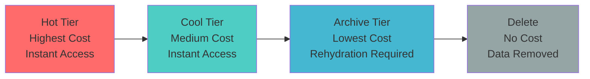

# ♻️ Data Lifecycle Management in ADLS Gen2

> __🏠 [Home](../../../../README.md)__ | __📖 [Overview](../../../01-overview/README.md)__ | __🛠️ [Services](../../README.md)__ | __🗃️ Storage Services__ | __🏞️ [ADLS Gen2](README.md)__ | __♻️ Data Lifecycle__


Automate data tier transitions and deletion with lifecycle management policies to optimize storage costs while maintaining data availability and compliance requirements.

---

## 🎯 Overview

Data Lifecycle Management in ADLS Gen2 enables automatic transition of data between storage tiers (Hot, Cool, Archive) and automated deletion based on age, access patterns, and custom rules.

### 💰 Storage Tier Comparison

| Tier | Storage Cost | Access Cost | Latency | Min Duration | Best For |
|------|-------------|-------------|---------|--------------|----------|
| __Hot__ | $$$ | $ | Milliseconds | None | Frequently accessed data |
| __Cool__ | $$ | $$ | Milliseconds | 30 days | Infrequently accessed (monthly) |
| __Archive__ | $ | $$$ | Hours | 180 days | Rarely accessed (yearly) |



---

## 📋 Lifecycle Policy Structure

### Policy Components

```json
{
  "rules": [
    {
      "enabled": true,
      "name": "rule-name",
      "type": "Lifecycle",
      "definition": {
        "filters": {
          "blobTypes": ["blockBlob"],
          "prefixMatch": ["bronze/logs/"],
          "blobIndexMatch": [
            {
              "name": "retention-category",
              "op": "==",
              "value": "short-term"
            }
          ]
        },
        "actions": {
          "baseBlob": {
            "tierToCool": {
              "daysAfterModificationGreaterThan": 30
            },
            "tierToArchive": {
              "daysAfterModificationGreaterThan": 90
            },
            "delete": {
              "daysAfterModificationGreaterThan": 365
            }
          },
          "snapshot": {
            "delete": {
              "daysAfterCreationGreaterThan": 30
            }
          }
        }
      }
    }
  ]
}
```

---

## 🏗️ Common Lifecycle Patterns

### Pattern 1: Log Data Management

```json
{
  "rules": [
    {
      "enabled": true,
      "name": "log-data-lifecycle",
      "type": "Lifecycle",
      "definition": {
        "filters": {
          "blobTypes": ["blockBlob"],
          "prefixMatch": ["bronze/logs/"]
        },
        "actions": {
          "baseBlob": {
            "tierToCool": {
              "daysAfterModificationGreaterThan": 7
            },
            "tierToArchive": {
              "daysAfterModificationGreaterThan": 30
            },
            "delete": {
              "daysAfterModificationGreaterThan": 365
            }
          }
        }
      }
    }
  ]
}
```

### Pattern 2: Medallion Architecture Tiering

```json
{
  "rules": [
    {
      "enabled": true,
      "name": "bronze-layer-policy",
      "type": "Lifecycle",
      "definition": {
        "filters": {
          "blobTypes": ["blockBlob"],
          "prefixMatch": ["bronze/"]
        },
        "actions": {
          "baseBlob": {
            "tierToCool": {
              "daysAfterModificationGreaterThan": 14
            },
            "tierToArchive": {
              "daysAfterModificationGreaterThan": 60
            }
          }
        }
      }
    },
    {
      "enabled": true,
      "name": "silver-layer-policy",
      "type": "Lifecycle",
      "definition": {
        "filters": {
          "blobTypes": ["blockBlob"],
          "prefixMatch": ["silver/"]
        },
        "actions": {
          "baseBlob": {
            "tierToCool": {
              "daysAfterModificationGreaterThan": 30
            },
            "tierToArchive": {
              "daysAfterModificationGreaterThan": 180
            }
          }
        }
      }
    },
    {
      "enabled": true,
      "name": "gold-layer-policy",
      "type": "Lifecycle",
      "definition": {
        "filters": {
          "blobTypes": ["blockBlob"],
          "prefixMatch": ["gold/"]
        },
        "actions": {
          "baseBlob": {
            "tierToCool": {
              "daysAfterModificationGreaterThan": 90
            }
          }
        }
      }
    }
  ]
}
```

### Pattern 3: Last Access Time-Based Policy

```json
{
  "rules": [
    {
      "enabled": true,
      "name": "access-based-tiering",
      "type": "Lifecycle",
      "definition": {
        "filters": {
          "blobTypes": ["blockBlob"],
          "prefixMatch": ["archive-candidates/"]
        },
        "actions": {
          "baseBlob": {
            "enableAutoTierToHotFromCool": true,
            "tierToCool": {
              "daysAfterLastAccessTimeGreaterThan": 30
            },
            "tierToArchive": {
              "daysAfterLastAccessTimeGreaterThan": 90
            }
          }
        }
      }
    }
  ]
}
```

---

## 🛠️ Implementing Lifecycle Policies

### Using Azure CLI

```bash
# Create lifecycle policy from JSON file
az storage account management-policy create \
  --account-name mystorageaccount \
  --resource-group myresourcegroup \
  --policy @lifecycle-policy.json

# View current policy
az storage account management-policy show \
  --account-name mystorageaccount \
  --resource-group myresourcegroup

# Update policy
az storage account management-policy update \
  --account-name mystorageaccount \
  --resource-group myresourcegroup \
  --policy @updated-policy.json

# Delete policy
az storage account management-policy delete \
  --account-name mystorageaccount \
  --resource-group myresourcegroup
```

### Using PowerShell

```powershell
# Define lifecycle management policy
$action = Add-AzStorageAccountManagementPolicyAction `
  -BaseBlobAction TierToCool `
  -daysAfterModificationGreaterThan 30

$action = Add-AzStorageAccountManagementPolicyAction `
  -InputObject $action `
  -BaseBlobAction TierToArchive `
  -daysAfterModificationGreaterThan 90

$action = Add-AzStorageAccountManagementPolicyAction `
  -InputObject $action `
  -BaseBlobAction Delete `
  -daysAfterModificationGreaterThan 365

# Create filter
$filter = New-AzStorageAccountManagementPolicyFilter `
  -PrefixMatch "bronze/logs/"

# Create rule
$rule = New-AzStorageAccountManagementPolicyRule `
  -Name "log-lifecycle" `
  -Action $action `
  -Filter $filter

# Set policy
Set-AzStorageAccountManagementPolicy `
  -ResourceGroupName "myresourcegroup" `
  -AccountName "mystorageaccount" `
  -Rule $rule
```

### Using Python SDK

```python
from azure.mgmt.storage import StorageManagementClient
from azure.mgmt.storage.models import (
    ManagementPolicy,
    ManagementPolicySchema,
    ManagementPolicyRule,
    ManagementPolicyDefinition,
    ManagementPolicyAction,
    ManagementPolicyBaseBlob,
    DateAfterModification,
    ManagementPolicyFilter
)
from azure.identity import DefaultAzureCredential

credential = DefaultAzureCredential()
storage_client = StorageManagementClient(
    credential=credential,
    subscription_id="<subscription-id>"
)

# Define lifecycle management policy
policy = ManagementPolicy(
    policy=ManagementPolicySchema(
        rules=[
            ManagementPolicyRule(
                enabled=True,
                name="bronze-data-lifecycle",
                type="Lifecycle",
                definition=ManagementPolicyDefinition(
                    filters=ManagementPolicyFilter(
                        blob_types=["blockBlob"],
                        prefix_match=["bronze/"]
                    ),
                    actions=ManagementPolicyAction(
                        base_blob=ManagementPolicyBaseBlob(
                            tier_to_cool=DateAfterModification(
                                days_after_modification_greater_than=14
                            ),
                            tier_to_archive=DateAfterModification(
                                days_after_modification_greater_than=60
                            ),
                            delete=DateAfterModification(
                                days_after_modification_greater_than=365
                            )
                        )
                    )
                )
            )
        ]
    )
)

# Apply policy
storage_client.management_policies.create_or_update(
    resource_group_name="myresourcegroup",
    account_name="mystorageaccount",
    management_policy_name="default",
    properties=policy
)

print("Lifecycle policy created successfully")
```

---

## 📊 Monitoring Lifecycle Actions

### Track Policy Execution

```python
from azure.mgmt.monitor import MonitorManagementClient
from azure.identity import DefaultAzureCredential
from datetime import datetime, timedelta

def monitor_lifecycle_actions():
    """Monitor lifecycle policy execution."""
    credential = DefaultAzureCredential()
    monitor_client = MonitorManagementClient(
        credential=credential,
        subscription_id="<subscription-id>"
    )

    storage_account_id = "/subscriptions/<subscription-id>/resourceGroups/<resource-group>/providers/Microsoft.Storage/storageAccounts/<storage-account>"

    # Query last 24 hours
    end_time = datetime.utcnow()
    start_time = end_time - timedelta(days=1)

    # Get activity logs for lifecycle actions
    activity_logs = monitor_client.activity_logs.list(
        filter=f"eventTimestamp ge '{start_time.isoformat()}' and eventTimestamp le '{end_time.isoformat()}' and resourceUri eq '{storage_account_id}' and operationName.value eq 'Microsoft.Storage/storageAccounts/managementPolicies/write'",
        select="eventTimestamp,operationName,status,properties"
    )

    for log in activity_logs:
        print(f"Time: {log.event_timestamp}")
        print(f"Operation: {log.operation_name.localized_value}")
        print(f"Status: {log.status.value}")
        print("---")

monitor_lifecycle_actions()
```

### Query Blob Tier Distribution

```python
from azure.storage.blob import BlobServiceClient
from azure.identity import DefaultAzureCredential
from collections import Counter

def analyze_tier_distribution(container_name: str, prefix: str = None):
    """Analyze distribution of blobs across tiers."""
    credential = DefaultAzureCredential()
    blob_service_client = BlobServiceClient(
        account_url="https://mystorageaccount.blob.core.windows.net",
        credential=credential
    )

    container_client = blob_service_client.get_container_client(container_name)

    tier_counts = Counter()
    total_size_by_tier = {}

    # List all blobs
    blobs = container_client.list_blobs(name_starts_with=prefix, include=['metadata'])

    for blob in blobs:
        tier = blob.blob_tier or "Hot"  # Default to Hot if not set
        tier_counts[tier] += 1

        if tier not in total_size_by_tier:
            total_size_by_tier[tier] = 0
        total_size_by_tier[tier] += blob.size

    # Print analysis
    print(f"\nTier Distribution for {container_name}/{prefix or 'all'}:")
    print("-" * 60)

    for tier in ["Hot", "Cool", "Archive"]:
        count = tier_counts.get(tier, 0)
        size_gb = total_size_by_tier.get(tier, 0) / (1024**3)
        print(f"{tier:10} : {count:,} blobs, {size_gb:,.2f} GB")

    return tier_counts, total_size_by_tier

# Usage
analyze_tier_distribution("datalake", "bronze/")
```

---

## 💰 Cost Optimization Strategies

### Calculate Tier Transition Savings

```python
def calculate_tiering_savings(
    data_size_gb: float,
    hot_months: int,
    cool_months: int,
    archive_months: int
):
    """Calculate potential savings from tiering strategy."""

    # Pricing (example - update with current pricing)
    pricing = {
        "hot": {"storage": 0.0184, "operations": 0.0004},      # per GB/month, per 10k ops
        "cool": {"storage": 0.0100, "operations": 0.0010},
        "archive": {"storage": 0.0020, "operations": 0.0500},
    }

    # Calculate costs
    hot_cost = (data_size_gb * hot_months * pricing["hot"]["storage"])
    cool_cost = (data_size_gb * cool_months * pricing["cool"]["storage"])
    archive_cost = (data_size_gb * archive_months * pricing["archive"]["storage"])

    total_with_lifecycle = hot_cost + cool_cost + archive_cost

    # Calculate cost without lifecycle (all hot)
    total_months = hot_months + cool_months + archive_months
    total_without_lifecycle = data_size_gb * total_months * pricing["hot"]["storage"]

    savings = total_without_lifecycle - total_with_lifecycle
    savings_percent = (savings / total_without_lifecycle) * 100

    print(f"\nLifecycle Cost Analysis ({data_size_gb:.2f} GB over {total_months} months)")
    print("-" * 70)
    print(f"Hot tier cost ({hot_months} months):     ${hot_cost:,.2f}")
    print(f"Cool tier cost ({cool_months} months):   ${cool_cost:,.2f}")
    print(f"Archive tier cost ({archive_months} months): ${archive_cost:,.2f}")
    print(f"\nTotal with lifecycle:    ${total_with_lifecycle:,.2f}")
    print(f"Total without lifecycle: ${total_without_lifecycle:,.2f}")
    print(f"\nSavings: ${savings:,.2f} ({savings_percent:.1f}%)")

    return savings

# Example: 1TB of data
# 1 month in Hot, 2 months in Cool, 9 months in Archive
calculate_tiering_savings(
    data_size_gb=1024,
    hot_months=1,
    cool_months=2,
    archive_months=9
)
```

---

## 🔄 Blob Index Tags for Advanced Policies

### Using Blob Index Tags

```python
from azure.storage.blob import BlobServiceClient
from azure.identity import DefaultAzureCredential

def tag_blobs_for_lifecycle(container_name: str, prefix: str, tags: dict):
    """Tag blobs with metadata for lifecycle policies."""
    credential = DefaultAzureCredential()
    blob_service_client = BlobServiceClient(
        account_url="https://mystorageaccount.blob.core.windows.net",
        credential=credential
    )

    container_client = blob_service_client.get_container_client(container_name)

    # List and tag blobs
    blobs = container_client.list_blobs(name_starts_with=prefix)

    tagged_count = 0
    for blob in blobs:
        blob_client = container_client.get_blob_client(blob.name)

        # Set blob index tags
        blob_client.set_blob_tags(tags)
        tagged_count += 1

        if tagged_count % 100 == 0:
            print(f"Tagged {tagged_count} blobs...")

    print(f"Total blobs tagged: {tagged_count}")

# Usage: Tag logs for retention policy
tag_blobs_for_lifecycle(
    container_name="datalake",
    prefix="bronze/logs/",
    tags={
        "retention-category": "short-term",
        "compliance-level": "standard"
    }
)
```

### Index Tag-Based Lifecycle Policy

```json
{
  "rules": [
    {
      "enabled": true,
      "name": "compliance-based-retention",
      "type": "Lifecycle",
      "definition": {
        "filters": {
          "blobTypes": ["blockBlob"],
          "blobIndexMatch": [
            {
              "name": "compliance-level",
              "op": "==",
              "value": "long-term"
            }
          ]
        },
        "actions": {
          "baseBlob": {
            "tierToCool": {
              "daysAfterModificationGreaterThan": 180
            },
            "tierToArchive": {
              "daysAfterModificationGreaterThan": 365
            },
            "delete": {
              "daysAfterModificationGreaterThan": 2555
            }
          }
        }
      }
    }
  ]
}
```

---

## 🔍 Best Practices

### ✅ Lifecycle Management Best Practices

1. __Test Policies First__: Use test container before production
2. __Monitor Execution__: Track policy actions and costs
3. __Use Appropriate Delays__: Account for minimum storage durations
4. __Consider Access Patterns__: Use last-access-time policies when appropriate
5. __Document Policies__: Maintain clear documentation of retention rules
6. __Review Regularly__: Audit policies quarterly for optimization
7. __Use Blob Index Tags__: Enable granular control over lifecycle actions

### ❌ Common Pitfalls

1. __Early Deletion Fees__: Deleting Cool/Archive blobs before minimum duration
2. __Over-aggressive Archiving__: Archiving frequently accessed data
3. __Ignoring Rehydration Costs__: Archive tier requires rehydration before access
4. __Missing Snapshots__: Not including snapshot lifecycle rules
5. __Conflicting Rules__: Multiple rules applying to same blobs

---

## 🔗 Related Resources

- [Hierarchical Namespace](hierarchical-namespace.md)
- [Access Control](access-control.md)
- [Performance Optimization](performance-optimization.md)
- [Cost Optimization Best Practices](../../../05-best-practices/cross-cutting-concerns/cost-optimization/storage-optimization.md)

---

*Last Updated: 2025-01-28*
*Documentation Status: Complete*
