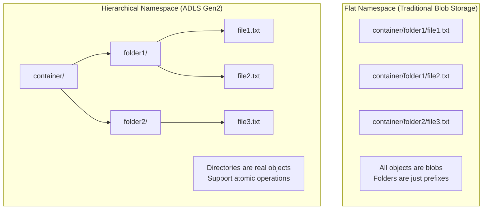

# 🌳 Hierarchical Namespace in ADLS Gen2

> __🏠 [Home](../../../../README.md)__ | __📖 [Overview](../../../01-overview/README.md)__ | __🛠️ [Services](../../README.md)__ | __🗃️ Storage Services__ | __🏞️ [ADLS Gen2](README.md)__ | __🌳 Hierarchical Namespace__


The Hierarchical Namespace (HNS) is the foundational feature that transforms Azure Blob Storage into a true file system, enabling efficient directory operations and significantly improving performance for big data analytics workloads.

---

## 🎯 What is Hierarchical Namespace?

Hierarchical Namespace organizes blobs into a hierarchy of directories and files, similar to a traditional file system. Unlike flat namespace storage where all blobs exist at a single level with simulated folders, HNS provides true directory objects with their own properties and permissions.

### 🔑 Key Concepts



---

## 🚀 Benefits of Hierarchical Namespace

### ⚡ Performance Improvements

__Directory Operations__

| Operation | Flat Namespace | Hierarchical Namespace | Improvement |
|-----------|---------------|----------------------|-------------|
| __Rename Directory__ | Copy all blobs + Delete originals | Single atomic operation | 100-1000x faster |
| __Delete Directory__ | Delete each blob individually | Single directory delete | 10-100x faster |
| __List Directory__ | Filter by prefix | Direct directory listing | 2-10x faster |
| __Move Files__ | Copy + Delete per file | Atomic rename | Significantly faster |

### 🎯 Big Data Analytics Benefits

```python
# Example: Processing performance comparison

# Without HNS - Must copy entire directory
import time
start = time.time()
# Copy 10,000 files from /raw to /processed
for file in list_blobs(prefix="raw/"):
    copy_blob(file, file.replace("raw/", "processed/"))
    delete_blob(file)
# Time: ~10-30 minutes
print(f"Flat namespace: {time.time() - start:.2f} seconds")

# With HNS - Atomic directory rename
start = time.time()
directory_client.rename_directory("raw", "processed")
# Time: ~1-5 seconds
print(f"HNS: {time.time() - start:.2f} seconds")
```

---

## 🏗️ Directory Structure Best Practices

### 📁 Recommended Organization Patterns

#### 1. Medallion Architecture

```text
datalake/
├── bronze/                  # Raw data ingestion
│   ├── source1/
│   │   ├── year=2024/
│   │   │   ├── month=01/
│   │   │   │   └── day=15/
│   │   │   │       └── data.parquet
│   ├── source2/
│   └── _metadata/          # Ingestion metadata
│
├── silver/                 # Cleaned and validated
│   ├── customers/
│   │   └── v1/            # Version control
│   ├── transactions/
│   └── _schemas/          # Schema definitions
│
└── gold/                   # Business-ready aggregations
    ├── sales_summary/
    ├── customer_360/
    └── _documentation/    # Data dictionary
```

#### 2. Time-based Partitioning

```text
logs/
├── year=2024/
│   ├── month=01/
│   │   ├── day=01/
│   │   │   ├── hour=00/
│   │   │   ├── hour=01/
│   │   │   └── hour=02/
│   │   └── day=02/
│   └── month=02/
└── _checkpoints/          # Streaming checkpoints
```

#### 3. Multi-tenant Organization

```text
shared-storage/
├── tenant-001/
│   ├── bronze/
│   ├── silver/
│   └── gold/
├── tenant-002/
│   ├── bronze/
│   ├── silver/
│   └── gold/
└── common/                # Shared reference data
    ├── calendars/
    └── lookup-tables/
```

---

## 🔧 Working with Directories

### Creating Directory Structures

#### Using Azure CLI

```bash
# Create nested directory structure
az storage fs directory create \
  --name bronze/sales/year=2024/month=01 \
  --file-system datalake \
  --account-name mystorageaccount

# Create multiple directories
for layer in bronze silver gold; do
  for source in sales marketing finance; do
    az storage fs directory create \
      --name ${layer}/${source} \
      --file-system datalake \
      --account-name mystorageaccount
  done
done
```

#### Using Python SDK

```python
from azure.storage.filedatalake import DataLakeServiceClient
from azure.identity import DefaultAzureCredential
from datetime import datetime

# Initialize client
credential = DefaultAzureCredential()
service_client = DataLakeServiceClient(
    account_url="https://mystorageaccount.dfs.core.windows.net",
    credential=credential
)

file_system_client = service_client.get_file_system_client("datalake")

# Create medallion architecture
layers = ["bronze", "silver", "gold"]
sources = ["sales", "marketing", "finance"]

for layer in layers:
    for source in sources:
        directory_client = file_system_client.get_directory_client(f"{layer}/{source}")
        directory_client.create_directory()
        print(f"Created: {layer}/{source}")

# Create time-partitioned structure
today = datetime.now()
partition_path = f"bronze/logs/year={today.year}/month={today.month:02d}/day={today.day:02d}"
directory_client = file_system_client.get_directory_client(partition_path)
directory_client.create_directory()
print(f"Created partitioned directory: {partition_path}")
```

#### Using .NET SDK

```csharp
using Azure.Storage.Files.DataLake;
using Azure.Identity;

// Initialize client
var credential = new DefaultAzureCredential();
var serviceClient = new DataLakeServiceClient(
    new Uri("https://mystorageaccount.dfs.core.windows.net"),
    credential
);

var fileSystemClient = serviceClient.GetFileSystemClient("datalake");

// Create directory hierarchy
string[] layers = { "bronze", "silver", "gold" };
string[] sources = { "sales", "marketing", "finance" };

foreach (var layer in layers)
{
    foreach (var source in sources)
    {
        var directoryPath = $"{layer}/{source}";
        var directoryClient = fileSystemClient.GetDirectoryClient(directoryPath);
        await directoryClient.CreateAsync();
        Console.WriteLine($"Created: {directoryPath}");
    }
}
```

---

## 🔄 Directory Operations

### Atomic Rename Operations

```python
# Rename directory - atomic operation in HNS
def promote_to_silver(source_directory: str):
    """Atomically move data from bronze to silver layer."""
    from azure.storage.filedatalake import DataLakeServiceClient
    from azure.identity import DefaultAzureCredential

    credential = DefaultAzureCredential()
    service_client = DataLakeServiceClient(
        account_url="https://mystorageaccount.dfs.core.windows.net",
        credential=credential
    )

    file_system_client = service_client.get_file_system_client("datalake")

    # Atomic rename from bronze to silver
    bronze_path = f"bronze/{source_directory}"
    silver_path = f"silver/{source_directory}"

    directory_client = file_system_client.get_directory_client(bronze_path)

    # Single atomic operation - all files moved instantly
    directory_client.rename_directory(silver_path)
    print(f"Atomically renamed: {bronze_path} → {silver_path}")

# Usage
promote_to_silver("sales/2024-01-15")
```

### Recursive Delete Operations

```python
def cleanup_old_data(retention_days: int = 90):
    """Delete directories older than retention period."""
    from datetime import datetime, timedelta
    from azure.storage.filedatalake import DataLakeServiceClient
    from azure.identity import DefaultAzureCredential

    credential = DefaultAzureCredential()
    service_client = DataLakeServiceClient(
        account_url="https://mystorageaccount.dfs.core.windows.net",
        credential=credential
    )

    file_system_client = service_client.get_file_system_client("datalake")

    cutoff_date = datetime.now() - timedelta(days=retention_days)

    # List all directories in bronze layer
    paths = file_system_client.get_paths(path="bronze/logs")

    for path in paths:
        if path.is_directory and path.last_modified < cutoff_date:
            # Single operation deletes entire directory tree
            directory_client = file_system_client.get_directory_client(path.name)
            directory_client.delete_directory()
            print(f"Deleted old directory: {path.name}")

# Usage
cleanup_old_data(retention_days=90)
```

### Moving Directories Between Layers

```python
def move_with_validation(source: str, destination: str):
    """Move directory with validation and error handling."""
    from azure.storage.filedatalake import DataLakeServiceClient
    from azure.identity import DefaultAzureCredential
    from azure.core.exceptions import ResourceNotFoundError

    credential = DefaultAzureCredential()
    service_client = DataLakeServiceClient(
        account_url="https://mystorageaccount.dfs.core.windows.net",
        credential=credential
    )

    file_system_client = service_client.get_file_system_client("datalake")

    try:
        # Check source exists
        source_client = file_system_client.get_directory_client(source)
        properties = source_client.get_directory_properties()

        # Check destination doesn't exist
        dest_client = file_system_client.get_directory_client(destination)
        try:
            dest_client.get_directory_properties()
            print(f"Error: Destination {destination} already exists")
            return False
        except ResourceNotFoundError:
            pass  # Destination doesn't exist - good

        # Perform atomic rename
        source_client.rename_directory(destination)
        print(f"Successfully moved: {source} → {destination}")
        return True

    except ResourceNotFoundError:
        print(f"Error: Source {source} not found")
        return False
    except Exception as e:
        print(f"Error during move: {str(e)}")
        return False

# Usage
success = move_with_validation(
    source="bronze/sales/2024-01-15",
    destination="silver/sales/2024-01-15"
)
```

---

## 📊 Performance Optimization

### File Size Recommendations

```python
# Optimize file sizes for analytics workloads

def check_file_sizes(directory_path: str):
    """Analyze file sizes in a directory."""
    from azure.storage.filedatalake import DataLakeServiceClient
    from azure.identity import DefaultAzureCredential

    credential = DefaultAzureCredential()
    service_client = DataLakeServiceClient(
        account_url="https://mystorageaccount.dfs.core.windows.net",
        credential=credential
    )

    file_system_client = service_client.get_file_system_client("datalake")

    paths = file_system_client.get_paths(path=directory_path)

    file_sizes = []
    for path in paths:
        if not path.is_directory:
            file_sizes.append(path.content_length)

    if file_sizes:
        avg_size = sum(file_sizes) / len(file_sizes)
        avg_size_mb = avg_size / (1024 * 1024)

        print(f"Directory: {directory_path}")
        print(f"Total files: {len(file_sizes)}")
        print(f"Average file size: {avg_size_mb:.2f} MB")

        # Optimal range: 256 MB - 1 GB
        if avg_size_mb < 256:
            print("⚠️  Files are too small - consider compaction")
        elif avg_size_mb > 1024:
            print("⚠️  Files are too large - consider splitting")
        else:
            print("✅ File sizes are optimal")

# Usage
check_file_sizes("gold/sales")
```

### Partitioning Strategy

```python
# Implement effective partitioning for query performance

from datetime import datetime
from azure.storage.filedatalake import DataLakeServiceClient
from azure.identity import DefaultAzureCredential

def write_partitioned_data(data, base_path: str, partition_cols: list):
    """Write data with optimal partitioning."""

    credential = DefaultAzureCredential()
    service_client = DataLakeServiceClient(
        account_url="https://mystorageaccount.dfs.core.windows.net",
        credential=credential
    )

    file_system_client = service_client.get_file_system_client("datalake")

    # Group data by partition columns
    partitions = {}
    for record in data:
        # Build partition key
        partition_parts = [f"{col}={record[col]}" for col in partition_cols]
        partition_key = "/".join(partition_parts)

        if partition_key not in partitions:
            partitions[partition_key] = []
        partitions[partition_key].append(record)

    # Write each partition
    for partition_key, records in partitions.items():
        partition_path = f"{base_path}/{partition_key}"

        # Create partition directory
        directory_client = file_system_client.get_directory_client(partition_path)
        directory_client.create_directory()

        # Write partition file
        timestamp = datetime.now().strftime("%Y%m%d%H%M%S")
        file_path = f"{partition_path}/data_{timestamp}.parquet"
        file_client = file_system_client.get_file_client(file_path)

        # Convert records to bytes (use your preferred format)
        data_bytes = convert_to_parquet(records)  # Your conversion function
        file_client.upload_data(data_bytes, overwrite=True)

        print(f"Written partition: {file_path}")

# Usage example
sample_data = [
    {"date": "2024-01-15", "region": "US", "sales": 1000},
    {"date": "2024-01-15", "region": "EU", "sales": 800},
    {"date": "2024-01-16", "region": "US", "sales": 1200},
]

write_partitioned_data(
    data=sample_data,
    base_path="gold/sales",
    partition_cols=["date", "region"]
)
```

---

## 🔍 Monitoring Directory Operations

### Track Directory Metrics

```python
# Monitor directory operations and performance

from azure.mgmt.monitor import MonitorManagementClient
from azure.identity import DefaultAzureCredential
from datetime import datetime, timedelta

def monitor_directory_operations(storage_account_resource_id: str):
    """Monitor directory-level operations."""

    credential = DefaultAzureCredential()
    monitor_client = MonitorManagementClient(credential, subscription_id="<subscription-id>")

    # Query last hour of metrics
    end_time = datetime.utcnow()
    start_time = end_time - timedelta(hours=1)

    metrics = monitor_client.metrics.list(
        resource_uri=storage_account_resource_id,
        timespan=f"{start_time.isoformat()}/{end_time.isoformat()}",
        interval="PT5M",
        metricnames="Transactions",
        aggregation="Total",
        filter="ApiName eq 'RenameDirectory' or ApiName eq 'DeleteDirectory' or ApiName eq 'CreateDirectory'"
    )

    for metric in metrics.value:
        print(f"\nMetric: {metric.name.value}")
        for timeseries in metric.timeseries:
            for data in timeseries.data:
                if data.total:
                    print(f"  {data.time_stamp}: {data.total} operations")

# Usage
storage_resource_id = "/subscriptions/<sub-id>/resourceGroups/<rg>/providers/Microsoft.Storage/storageAccounts/<account>"
monitor_directory_operations(storage_resource_id)
```

---

## 💡 Best Practices

### ✅ Do's

1. __Use HNS for Analytics Workloads__: Always enable HNS for data lake scenarios
2. __Leverage Atomic Operations__: Use rename for data promotion between layers
3. __Organize with Purpose__: Structure directories for query performance
4. __Partition Appropriately__: Balance partition count with file size
5. __Set ACLs on Directories__: Inherit permissions for security

### ❌ Don'ts

1. __Don't Create Too Many Small Partitions__: Leads to small files and poor performance
2. __Don't Nest Too Deeply__: Keep directory depth reasonable (< 10 levels)
3. __Don't Mix Concerns__: Separate raw, processed, and analytics-ready data
4. __Don't Ignore File Sizes__: Monitor and optimize file sizes regularly
5. __Don't Skip Planning__: Design directory structure before implementation

---

## 🔗 Related Resources

- [Access Control for Hierarchical Namespace](access-control.md)
- [Performance Optimization Guide](performance-optimization.md)
- [Data Lifecycle Management](data-lifecycle.md)
- [ADLS Gen2 Overview](README.md)

---

*Last Updated: 2025-01-28*
*Documentation Status: Complete*
