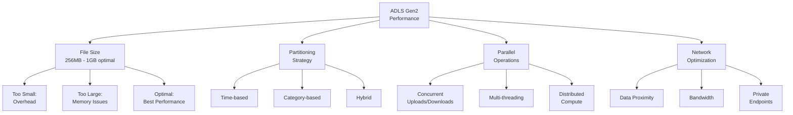

# ⚡ Performance Optimization in ADLS Gen2

> __🏠 [Home](../../../../README.md)__ | __📖 [Overview](../../../01-overview/README.md)__ | __🛠️ [Services](../../README.md)__ | __🗃️ Storage Services__ | __🏞️ [ADLS Gen2](README.md)__ | __⚡ Performance__


Maximize performance of ADLS Gen2 for big data analytics workloads through file sizing, partitioning strategies, parallel operations, and network optimization.

---

## 🎯 Performance Factors

### Key Performance Dimensions



---

## 📏 File Size Optimization

### Optimal File Sizing

```python
import pandas as pd
from azure.storage.filedatalake import DataLakeServiceClient
from azure.identity import DefaultAzureCredential
import io

def write_optimized_parquet(df: pd.DataFrame, base_path: str, target_size_mb: int = 512):
    """Write DataFrame in optimally-sized Parquet files."""

    # Calculate rows per file for target size
    sample_size = min(10000, len(df))
    sample_bytes = df.head(sample_size).memory_usage(deep=True).sum()
    bytes_per_row = sample_bytes / sample_size
    target_bytes = target_size_mb * 1024 * 1024
    rows_per_file = int(target_bytes / bytes_per_row)

    credential = DefaultAzureCredential()
    service_client = DataLakeServiceClient(
        account_url="https://mystorageaccount.dfs.core.windows.net",
        credential=credential
    )

    file_system_client = service_client.get_file_system_client("datalake")

    # Write in chunks
    for i in range(0, len(df), rows_per_file):
        chunk = df.iloc[i:i + rows_per_file]

        # Convert to parquet
        buffer = io.BytesIO()
        chunk.to_parquet(buffer, engine='pyarrow', compression='snappy')
        buffer.seek(0)

        # Upload
        file_path = f"{base_path}/part-{i//rows_per_file:05d}.parquet"
        file_client = file_system_client.get_file_client(file_path)
        file_client.upload_data(buffer.read(), overwrite=True)

        print(f"Written {file_path} ({len(chunk)} rows)")

# Usage
df = pd.read_csv("large_dataset.csv")
write_optimized_parquet(df, "gold/sales", target_size_mb=512)
```

### Small File Compaction

```python
def compact_small_files(directory_path: str, min_size_mb: int = 256):
    """Compact small files into larger optimized files."""
    from azure.storage.filedatalake import DataLakeServiceClient
    from azure.identity import DefaultAzureCredential
    import pyarrow.parquet as pq
    import pyarrow as pa

    credential = DefaultAzureCredential()
    service_client = DataLakeServiceClient(
        account_url="https://mystorageaccount.dfs.core.windows.net",
        credential=credential
    )

    file_system_client = service_client.get_file_system_client("datalake")

    # List files in directory
    paths = file_system_client.get_paths(path=directory_path)
    small_files = []

    min_size_bytes = min_size_mb * 1024 * 1024

    for path in paths:
        if not path.is_directory and path.content_length < min_size_bytes:
            small_files.append(path.name)

    if not small_files:
        print("No small files to compact")
        return

    print(f"Found {len(small_files)} small files to compact")

    # Read and combine small files
    tables = []
    for file_path in small_files:
        file_client = file_system_client.get_file_client(file_path)
        download = file_client.download_file()
        data = download.readall()

        # Read parquet
        table = pq.read_table(io.BytesIO(data))
        tables.append(table)

    # Combine into single table
    combined_table = pa.concat_tables(tables)

    # Write compacted file
    buffer = io.BytesIO()
    pq.write_table(combined_table, buffer, compression='snappy')
    buffer.seek(0)

    compacted_path = f"{directory_path}/compacted-{int(time.time())}.parquet"
    file_client = file_system_client.get_file_client(compacted_path)
    file_client.upload_data(buffer.read(), overwrite=True)

    print(f"Created compacted file: {compacted_path}")

    # Delete small files
    for file_path in small_files:
        file_client = file_system_client.get_file_client(file_path)
        file_client.delete_file()

    print(f"Deleted {len(small_files)} small files")

# Usage
compact_small_files("bronze/logs/2024-01-15")
```

---

## 🗂️ Partitioning Strategies

### Time-based Partitioning

```python
from datetime import datetime
import pandas as pd

def write_time_partitioned_data(df: pd.DataFrame, base_path: str, time_column: str):
    """Write data with time-based partitioning."""
    from azure.storage.filedatalake import DataLakeServiceClient
    from azure.identity import DefaultAzureCredential

    credential = DefaultAzureCredential()
    service_client = DataLakeServiceClient(
        account_url="https://mystorageaccount.dfs.core.windows.net",
        credential=credential
    )

    file_system_client = service_client.get_file_system_client("datalake")

    # Ensure datetime column
    df[time_column] = pd.to_datetime(df[time_column])

    # Add partition columns
    df['year'] = df[time_column].dt.year
    df['month'] = df[time_column].dt.month
    df['day'] = df[time_column].dt.day

    # Group by partition
    for (year, month, day), group in df.groupby(['year', 'month', 'day']):
        partition_path = f"{base_path}/year={year}/month={month:02d}/day={day:02d}"

        # Create directory
        directory_client = file_system_client.get_directory_client(partition_path)
        directory_client.create_directory()

        # Write partition data
        buffer = io.BytesIO()
        group.drop(['year', 'month', 'day'], axis=1).to_parquet(buffer, engine='pyarrow')
        buffer.seek(0)

        file_path = f"{partition_path}/data.parquet"
        file_client = file_system_client.get_file_client(file_path)
        file_client.upload_data(buffer.read(), overwrite=True)

        print(f"Written partition: {partition_path}")

# Usage
df = pd.read_csv("sales_data.csv")
write_time_partitioned_data(df, "gold/sales", time_column="sale_date")
```

### Query Performance with Partitioning

```sql
-- Synapse Serverless SQL - Partition pruning example

-- Bad: Full table scan
SELECT SUM(amount) as total_sales
FROM OPENROWSET(
    BULK 'https://mystorageaccount.dfs.core.windows.net/datalake/gold/sales/**',
    FORMAT = 'PARQUET'
) AS sales
WHERE sale_date >= '2024-01-01';

-- Good: Partition pruning - only reads January 2024 data
SELECT SUM(amount) as total_sales
FROM OPENROWSET(
    BULK 'https://mystorageaccount.dfs.core.windows.net/datalake/gold/sales/year=2024/month=01/**',
    FORMAT = 'PARQUET'
) AS sales;

-- Best: Explicit partition columns
SELECT SUM(amount) as total_sales
FROM OPENROWSET(
    BULK 'https://mystorageaccount.dfs.core.windows.net/datalake/gold/sales/year=*/month=*/day=*/',
    FORMAT = 'PARQUET'
) AS sales
WHERE filepath(1) = '2024'  -- year
  AND filepath(2) = '01';    -- month
```

---

## 🚀 Parallel Operations

### Concurrent File Upload

```python
from concurrent.futures import ThreadPoolExecutor, as_completed
from azure.storage.filedatalake import DataLakeServiceClient
from azure.identity import DefaultAzureCredential
import os

def parallel_upload_directory(local_directory: str, remote_path: str, max_workers: int = 10):
    """Upload directory contents in parallel."""

    credential = DefaultAzureCredential()
    service_client = DataLakeServiceClient(
        account_url="https://mystorageaccount.dfs.core.windows.net",
        credential=credential
    )

    file_system_client = service_client.get_file_system_client("datalake")

    # Get all files
    files_to_upload = []
    for root, dirs, files in os.walk(local_directory):
        for file in files:
            local_path = os.path.join(root, file)
            relative_path = os.path.relpath(local_path, local_directory)
            remote_file_path = f"{remote_path}/{relative_path}".replace("\\", "/")
            files_to_upload.append((local_path, remote_file_path))

    print(f"Uploading {len(files_to_upload)} files with {max_workers} workers...")

    def upload_file(local_path, remote_path):
        try:
            file_client = file_system_client.get_file_client(remote_path)
            with open(local_path, "rb") as data:
                file_client.upload_data(data, overwrite=True)
            return f"✓ {remote_path}"
        except Exception as e:
            return f"✗ {remote_path}: {str(e)}"

    # Upload in parallel
    with ThreadPoolExecutor(max_workers=max_workers) as executor:
        futures = [
            executor.submit(upload_file, local_path, remote_path)
            for local_path, remote_path in files_to_upload
        ]

        for future in as_completed(futures):
            print(future.result())

# Usage
parallel_upload_directory(
    local_directory="./data",
    remote_path="bronze/uploads",
    max_workers=20
)
```

### Concurrent File Download

```python
def parallel_download_directory(remote_path: str, local_directory: str, max_workers: int = 10):
    """Download directory contents in parallel."""
    from concurrent.futures import ThreadPoolExecutor, as_completed
    from azure.storage.filedatalake import DataLakeServiceClient
    from azure.identity import DefaultAzureCredential
    import os

    credential = DefaultAzureCredential()
    service_client = DataLakeServiceClient(
        account_url="https://mystorageaccount.dfs.core.windows.net",
        credential=credential
    )

    file_system_client = service_client.get_file_system_client("datalake")

    # List all files
    paths = file_system_client.get_paths(path=remote_path, recursive=True)
    files_to_download = [(path.name, path.name) for path in paths if not path.is_directory]

    print(f"Downloading {len(files_to_download)} files with {max_workers} workers...")

    def download_file(remote_path, local_relative_path):
        try:
            file_client = file_system_client.get_file_client(remote_path)
            download = file_client.download_file()

            local_path = os.path.join(local_directory, local_relative_path)
            os.makedirs(os.path.dirname(local_path), exist_ok=True)

            with open(local_path, "wb") as file:
                file.write(download.readall())

            return f"✓ {remote_path}"
        except Exception as e:
            return f"✗ {remote_path}: {str(e)}"

    # Download in parallel
    with ThreadPoolExecutor(max_workers=max_workers) as executor:
        futures = [
            executor.submit(download_file, remote_path, local_relative_path)
            for remote_path, local_relative_path in files_to_download
        ]

        for future in as_completed(futures):
            print(future.result())

# Usage
parallel_download_directory(
    remote_path="gold/reports",
    local_directory="./downloads",
    max_workers=20
)
```

---

## 🌐 Network Optimization

### Use Private Endpoints

```bash
# Create private endpoint for storage account
az network private-endpoint create \
  --name adls-private-endpoint \
  --resource-group myresourcegroup \
  --vnet-name myvnet \
  --subnet mysubnet \
  --private-connection-resource-id "/subscriptions/<subscription-id>/resourceGroups/myresourcegroup/providers/Microsoft.Storage/storageAccounts/mystorageaccount" \
  --group-id dfs \
  --connection-name adls-connection

# Create private DNS zone
az network private-dns zone create \
  --resource-group myresourcegroup \
  --name "privatelink.dfs.core.windows.net"

# Link DNS zone to VNet
az network private-dns link vnet create \
  --resource-group myresourcegroup \
  --zone-name "privatelink.dfs.core.windows.net" \
  --name adls-dns-link \
  --virtual-network myvnet \
  --registration-enabled false
```

### Co-locate Compute and Storage

```python
# Ensure compute resources are in same region as storage
def check_region_alignment():
    """Verify compute and storage are in same region."""
    from azure.mgmt.storage import StorageManagementClient
    from azure.mgmt.synapse import SynapseManagementClient
    from azure.identity import DefaultAzureCredential

    credential = DefaultAzureCredential()
    subscription_id = "<subscription-id>"

    storage_client = StorageManagementClient(credential, subscription_id)
    synapse_client = SynapseManagementClient(credential, subscription_id)

    # Get storage account location
    storage_account = storage_client.storage_accounts.get_properties(
        "myresourcegroup",
        "mystorageaccount"
    )
    storage_location = storage_account.location

    # Get Synapse workspace location
    synapse_workspace = synapse_client.workspaces.get(
        "myresourcegroup",
        "mysynapseworkspace"
    )
    synapse_location = synapse_workspace.location

    if storage_location == synapse_location:
        print(f"✓ Resources aligned: {storage_location}")
    else:
        print(f"⚠ Location mismatch: Storage={storage_location}, Synapse={synapse_location}")
        print("  Consider migrating resources to same region for optimal performance")

check_region_alignment()
```

---

## 📊 Performance Monitoring

### Track Operation Latency

```python
from azure.mgmt.monitor import MonitorManagementClient
from azure.identity import DefaultAzureCredential
from datetime import datetime, timedelta

def monitor_storage_performance():
    """Monitor storage account performance metrics."""
    credential = DefaultAzureCredential()
    monitor_client = MonitorManagementClient(
        credential=credential,
        subscription_id="<subscription-id>"
    )

    storage_resource_id = "/subscriptions/<subscription-id>/resourceGroups/<resource-group>/providers/Microsoft.Storage/storageAccounts/<storage-account>"

    end_time = datetime.utcnow()
    start_time = end_time - timedelta(hours=1)

    # Query performance metrics
    metrics = monitor_client.metrics.list(
        resource_uri=storage_resource_id,
        timespan=f"{start_time.isoformat()}/{end_time.isoformat()}",
        interval="PT5M",
        metricnames="SuccessE2ELatency,SuccessServerLatency,Availability,Transactions",
        aggregation="Average,Total"
    )

    for metric in metrics.value:
        print(f"\n{metric.name.value}:")
        for timeseries in metric.timeseries:
            for data in timeseries.data:
                if data.average:
                    print(f"  {data.time_stamp}: {data.average:.2f} ms")

monitor_storage_performance()
```

---

## 💡 Best Practices

### ✅ Performance Optimization Checklist

- [x] __File Sizes__: 256MB - 1GB per file
- [x] __Partitioning__: Partition by query patterns
- [x] __Compression__: Use Snappy or Zstd for Parquet
- [x] __Parallelism__: Use concurrent operations (10-20 threads)
- [x] __Co-location__: Storage and compute in same region
- [x] __Private Endpoints__: Use for secure, low-latency access
- [x] __File Formats__: Prefer Parquet/ORC over CSV/JSON
- [x] __Monitoring__: Track latency and throughput metrics

### ❌ Performance Anti-patterns

- ❌ Millions of small files (< 10MB each)
- ❌ Single-threaded operations for large datasets
- ❌ Cross-region data access
- ❌ Uncompressed text formats
- ❌ No partitioning strategy
- ❌ Synchronous sequential operations

---

## 🔗 Related Resources

- [Hierarchical Namespace](hierarchical-namespace.md)
- [Access Control](access-control.md)
- [Data Lifecycle Management](data-lifecycle.md)
- [Performance Best Practices](../../../05-best-practices/cross-cutting-concerns/performance/storage-performance.md)

---

*Last Updated: 2025-01-28*
*Documentation Status: Complete*
