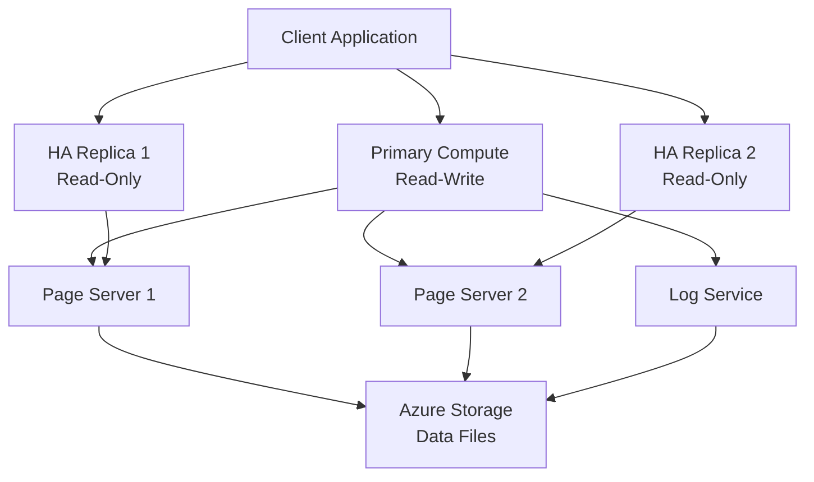

# 🚀 Hyperscale Tier - Azure SQL Database

> __🏠 [Home](../../../../README.md)__ | __📖 [Overview](../../../01-overview/README.md)__ | __🛠️ [Services](../../README.md)__ | __🗃️ Storage Services__ | __🗄️ [Azure SQL](README.md)__ | __🚀 Hyperscale__


Hyperscale is a scalable storage architecture that supports databases up to 100TB with instant backups and fast restores.

---

## 🎯 Overview

Hyperscale tier uses a multi-tiered distributed architecture with page servers and compute nodes, enabling massive scale with minimal operational overhead.

### Key Benefits

- __Massive Scale__: Up to 100TB databases
- __Fast Backups__: Snapshot-based, complete in seconds
- __Rapid Scaling__: Scale compute up/down in minutes
- __Read Scale-out__: Up to 4 high-availability replicas
- __Storage Auto-grow__: No pre-provisioning required

---

## 🏗️ Architecture



---

## 🚀 Create Hyperscale Database

```bash
# Create Hyperscale database
az sql db create \
  --resource-group myresourcegroup \
  --server mysqlserver \
  --name hypersaledb \
  --edition Hyperscale \
  --service-objective HS_Gen5_4 \
  --read-scale Enabled \
  --zone-redundant false

# Add read replica
az sql db replica create \
  --name hypersaledb \
  --resource-group myresourcegroup \
  --server mysqlserver \
  --secondary-type ReadOnlyReplica
```

### Query Routing

```python
import pyodbc

# Primary connection (read-write)
primary_conn_string = """
    Server=tcp:mysqlserver.database.windows.net,1433;
    Database=hypersaledb;
    ApplicationIntent=ReadWrite;
"""

# Replica connection (read-only)
replica_conn_string = """
    Server=tcp:mysqlserver.database.windows.net,1433;
    Database=hypersaledb;
    ApplicationIntent=ReadOnly;
"""

# Route writes to primary
primary_conn = pyodbc.connect(primary_conn_string)
cursor = primary_conn.cursor()
cursor.execute("INSERT INTO Orders VALUES (1, 'Product', 100)")
primary_conn.commit()

# Route reads to replica
replica_conn = pyodbc.connect(replica_conn_string)
cursor = replica_conn.cursor()
cursor.execute("SELECT * FROM Orders")
results = cursor.fetchall()
```

---

## 📊 Performance Optimization

### Columnstore Indexes

```sql
-- Create columnstore index for analytics
CREATE CLUSTERED COLUMNSTORE INDEX CCI_Orders
ON Orders;

-- Optimized for large scans
SELECT ProductCategory, SUM(OrderTotal)
FROM Orders
WHERE OrderDate >= '2024-01-01'
GROUP BY ProductCategory;
```

### Read Scale-out

```sql
-- Offload reporting queries to read replicas
-- Add ApplicationIntent=ReadOnly to connection string
SELECT
    CustomerID,
    COUNT(*) as TotalOrders,
    SUM(OrderAmount) as TotalSpent
FROM Orders
WHERE OrderDate >= DATEADD(month, -12, GETDATE())
GROUP BY CustomerID
ORDER BY TotalSpent DESC;
```

---

## 💰 Cost Optimization

```sql
-- Scale down during off-hours
ALTER DATABASE hypersaledb
MODIFY (SERVICE_OBJECTIVE = 'HS_Gen5_2');

-- Scale up for peak hours
ALTER DATABASE hypersaledb
MODIFY (SERVICE_OBJECTIVE = 'HS_Gen5_8');
```

---

## 🔗 Related Resources

- [Azure SQL Database Overview](README.md)
- [Elastic Pools](elastic-pools.md)

---

*Last Updated: 2025-01-28*
