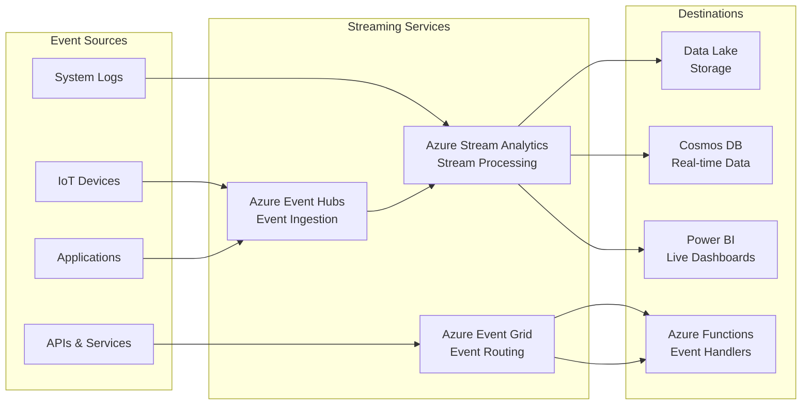
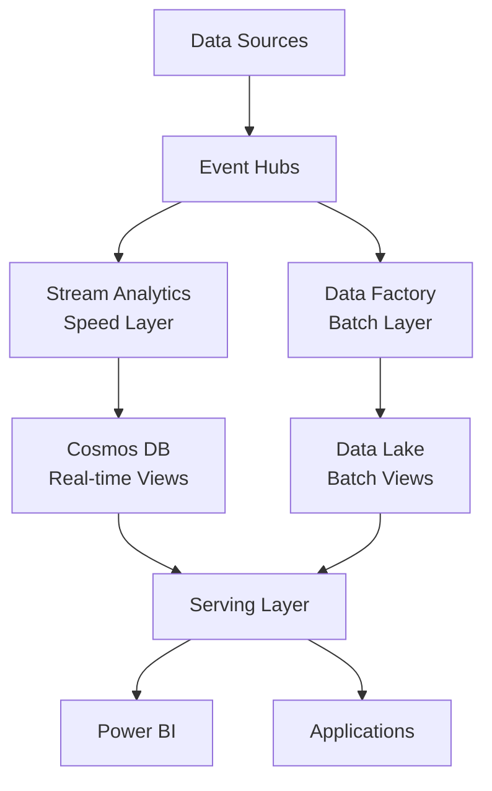
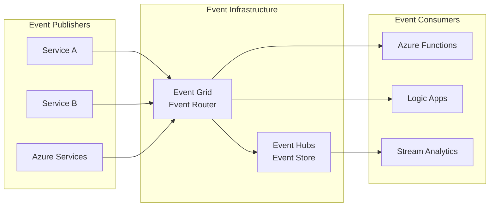

# 🔄 Streaming Services

> __🏠 [Home](../../../README.md)__ | __📖 [Overview](../../01-overview/README.md)__ | __🛠️ Services__ | __🔄 Streaming Services__

Real-time data processing and event-driven architecture services for streaming analytics.

---

## 🎯 Service Overview

Streaming services enable real-time data processing, event ingestion, and event-driven architectures. These services handle continuous data streams with low latency and high throughput requirements.

---

## 🚀 Service Cards

### 📨 Azure Event Hubs

__Big data streaming platform and event ingestion service for millions of events per second.__

#### 🔥 Key Strengths

- __Massive Scale__: Ingest millions of events per second
- __Kafka Compatible__: Drop-in replacement for Apache Kafka
- __Auto-scaling__: Automatically adjust to traffic patterns
- __Global Distribution__: Multi-region event streaming

#### 📊 Core Capabilities

- __[Event Streaming Basics](azure-event-hubs/event-streaming-basics.md)__ - Fundamental concepts
- __[Kafka Compatibility](azure-event-hubs/kafka-compatibility.md)__ - Migration from Kafka
- __[Capture to Storage](azure-event-hubs/capture-to-storage.md)__ - Automatic archival
- __[Schema Registry](azure-event-hubs/schema-registry.md)__ - Schema management

#### 🎯 Best For

- High-volume event ingestion
- IoT device telemetry
- Application logging and monitoring
- Kafka migration scenarios

#### 💰 Pricing Model

- __Standard__: Throughput Units (TU) + ingress/egress
- __Dedicated__: Dedicated Capacity Units (CU) for isolation
- __Premium__: Enhanced performance and security

__[📖 Full Documentation →](azure-event-hubs/README.md)__

---

### ⚡ Azure Stream Analytics

__Real-time analytics service for streaming data with SQL-based queries.__

#### 🔥 Key Strengths

- __SQL-based__: Familiar SQL syntax for stream processing
- __Serverless__: No infrastructure management required
- __Built-in ML__: Anomaly detection and machine learning
- __Edge Support__: Deploy to IoT Edge devices

#### 📊 Core Capabilities

- __[Stream Processing Basics](azure-stream-analytics/stream-processing-basics.md)__ - Core concepts
- __[Windowing Functions](azure-stream-analytics/windowing-functions.md)__ - Time-based aggregations
- __[Anomaly Detection](azure-stream-analytics/anomaly-detection.md)__ - Built-in ML features
- __[Edge Deployments](azure-stream-analytics/edge-deployments.md)__ - IoT Edge processing

#### 🎯 Best For

- Real-time analytics and dashboards
- IoT device analytics
- Fraud detection systems
- Operational monitoring

#### 💰 Pricing Model

- __Streaming Units (SU)__: Compute capacity pricing
- __Edge__: Per device licensing
- __Pay-as-you-go__: Hourly billing

__[📖 Full Documentation →](azure-stream-analytics/README.md)__

---

### 🌐 Azure Event Grid

__Event routing service for building reactive, event-driven applications.__

#### 🔥 Key Strengths

- __Serverless__: Pay-per-event pricing model
- __Rich Filtering__: Content-based event routing
- __Reliable Delivery__: Built-in retry and dead letter queues
- __Azure Integration__: Native events from all Azure services

#### 📊 Core Capabilities

- __[Event-driven Architecture](azure-event-grid/event-driven-architecture.md)__ - Design patterns
- __[System Topics](azure-event-grid/system-topics.md)__ - Built-in Azure events

#### 🎯 Best For

- Event-driven application architectures
- Serverless workflow automation
- System integration and decoupling
- Reactive microservices

#### 💰 Pricing Model

- __Pay-per-operation__: $0.60 per million operations
- __No minimum fees__: True pay-as-you-use
- __Advanced features__: Additional costs for premium features

__[📖 Full Documentation →](azure-event-grid/README.md)__

---

## 📊 Service Comparison

### Feature Matrix

| Feature | Event Hubs | Stream Analytics | Event Grid |
|---------|------------|-----------------|------------|
| __Primary Purpose__ | Event Ingestion | Stream Processing | Event Routing |
| __Throughput__ | Very High (millions/sec) | Medium (SU-based) | High |
| __Processing Logic__ | ❌ None | ✅ SQL-based | ❌ Routing Only |
| __Kafka Compatible__ | ✅ Yes | ❌ No | ❌ No |
| __Built-in Analytics__ | ❌ No | ✅ Advanced | ❌ No |
| __Event Filtering__ | ❌ Limited | ✅ SQL-based | ✅ Advanced |
| __Schema Registry__ | ✅ Yes | ❌ No | ❌ No |
| __Serverless Option__ | ❌ No | ✅ Yes | ✅ Yes |
| __Edge Deployment__ | ❌ No | ✅ Yes | ❌ No |
| __Dead Letter Queues__ | ❌ No | ❌ No | ✅ Yes |
| __Cost Model__ | TU/CU-based | SU-based | Per-operation |

### Use Case Recommendations

#### 📈 Real-time Analytics Dashboard

__Architecture__: Event Hubs → Stream Analytics → Power BI

- __Primary__: Stream Analytics for processing
- __Supporting__: Event Hubs for ingestion
- __Pattern__: [Lambda Architecture](../../03-architecture-patterns/streaming-architectures/lambda-architecture.md)

#### 🏭 IoT Device Monitoring

__Architecture__: IoT Devices → Event Hubs → Stream Analytics → Alerts

- __Primary__: Event Hubs for high-volume ingestion
- __Supporting__: Stream Analytics for real-time analysis
- __Pattern__: [Streaming Architectures](../../03-architecture-patterns/streaming-architectures/README.md)

#### 🔗 Event-driven Microservices

__Architecture__: Services → Event Grid → Functions/Logic Apps

- __Primary__: Event Grid for service decoupling
- __Supporting__: Azure Functions for event handling
- __Pattern__: [Streaming Architectures](../../03-architecture-patterns/streaming-architectures/README.md)

#### 📊 Stream Processing Pipeline

__Architecture__: Data Sources → Event Hubs → Stream Analytics → Storage

- __Primary__: Stream Analytics for transformation
- __Supporting__: Event Hubs for buffering
- __Pattern__: [Streaming Architectures](../../03-architecture-patterns/streaming-architectures/README.md)

---

## 🎯 Common Architecture Patterns

### Lambda Architecture with Streaming Services

### Event-Driven Architecture

---

## 🚀 Getting Started Recommendations

### 🆕 __New to Streaming__

1. __Start with__: Azure Stream Analytics
2. __Why__: SQL-based, serverless, easy to learn
3. __Next__: Add Event Hubs for higher throughput
4. __Pattern__: Simple stream processing pipeline

### 📊 __Analytics-Focused__

1. __Start with__: Event Hubs + Stream Analytics
2. __Why__: Purpose-built for analytics workloads
3. __Next__: Integrate with Power BI and Data Lake
4. __Pattern__: Real-time analytics dashboard

### 🏗️ __Architecture-Focused__

1. __Start with__: Event Grid
2. __Why__: Event-driven architecture foundation
3. __Next__: Add Event Hubs for high-volume scenarios
4. __Pattern__: Event-driven microservices

### 🏭 __IoT-Focused__

1. __Start with__: Event Hubs + Stream Analytics
2. __Why__: Optimized for IoT scenarios
3. __Next__: Add Edge deployments
4. __Pattern__: IoT analytics pipeline

---

## 💰 Cost Optimization Strategies

### Event Hubs Cost Optimization

- __Right-size throughput units__ based on actual usage
- __Use auto-inflate__ to handle traffic spikes efficiently
- __Consider dedicated clusters__ for predictable high-volume workloads
- __Optimize partition count__ based on consumer parallelism

### Stream Analytics Cost Optimization

- __Use appropriate streaming unit size__ for your workload
- __Implement auto-scaling__ to adjust to demand
- __Optimize query complexity__ to reduce SU requirements
- __Use temporal aggregations__ to reduce processing overhead

### Event Grid Cost Optimization

- __Implement efficient filtering__ to reduce unnecessary operations
- __Use system topics__ instead of custom topics where possible
- __Optimize event schema__ to minimize payload size
- __Implement proper error handling__ to avoid retry costs

__[📖 Detailed Cost Guide →](../../05-best-practices/cross-cutting-concerns/cost-optimization/README.md)__

---

## 🔒 Security Best Practices

### Authentication & Authorization

- __Azure AD Integration__: Use managed identities where possible
- __Shared Access Signatures__: Implement least-privilege access
- __RBAC__: Apply role-based access control
- __Network Security__: Use private endpoints and VNet integration

### Data Protection

- __Encryption in Transit__: TLS 1.2 for all connections
- __Encryption at Rest__: Azure Storage Service Encryption
- __Key Management__: Azure Key Vault for secret management
- __Data Masking__: Implement data anonymization where needed

__[📖 Security Guide →](../../05-best-practices/cross-cutting-concerns/security/README.md)__

---

## 📊 Monitoring & Observability

### Key Metrics to Monitor

#### Event Hubs Metrics

- __Incoming Messages__: Message ingestion rate
- __Outgoing Messages__: Message consumption rate
- __Throttled Requests__: Capacity utilization
- __Capture Backlog__: Archive processing status

#### Stream Analytics Metrics

- __SU Utilization__: Resource consumption
- __Input/Output Events__: Processing throughput
- __Watermark Delay__: Processing latency
- __Runtime Errors__: Processing health

#### Event Grid Metrics

- __Published Events__: Event publication rate
- __Delivered Events__: Successful delivery rate
- __Failed Deliveries__: Error rate monitoring
- __Dead Letter Events__: Failed event tracking

__[📖 Monitoring Guide →](../../09-monitoring/README.md)__

---

## 🔧 Integration Scenarios

### With Analytics Services

- __[Integration Scenarios](../../04-implementation-guides/integration-scenarios/README.md)__: Real-time to batch processing
- __[Streaming Architectures](../../03-architecture-patterns/streaming-architectures/README.md)__: Stream processing patterns
- __[Real-time Analytics](../../solutions/azure-realtime-analytics/README.md)__: Complete solutions

### With Storage Services

- __[Storage Services Guide](../storage-services/README.md)__: Integration with storage
- __[Integration Scenarios](../../04-implementation-guides/integration-scenarios/README.md)__: Implementation guides
- __[Best Practices](../../05-best-practices/README.md)__: Optimization guidance

__[📖 All Integration Scenarios →](../../04-implementation-guides/integration-scenarios/README.md)__

---

## 📚 Learning Resources

### 🎓 __Getting Started__

- [__Stream Analytics Tutorials__](../../tutorials/stream-analytics/README.md)
- [__Synapse Tutorials__](../../tutorials/synapse/README.md)
- [__Code Labs__](../../tutorials/code-labs/README.md)

### 📖 __Advanced Topics__

- [__Streaming Architecture Patterns__](../../03-architecture-patterns/streaming-architectures/README.md)
- [__Best Practices__](../../05-best-practices/README.md)
- [__Real-time Analytics Solutions__](../../solutions/azure-realtime-analytics/README.md)

### 🔧 __Code Examples__

- [__Code Examples Guide__](../../06-code-examples/README.md)
- [__Integration Examples__](../../tutorials/integration/README.md)
- [__Learning Paths__](../../tutorials/learning-paths/README.md)

---

*Last Updated: 2025-01-28*  
*Services Documented: 3*  
*Coverage: Complete*
