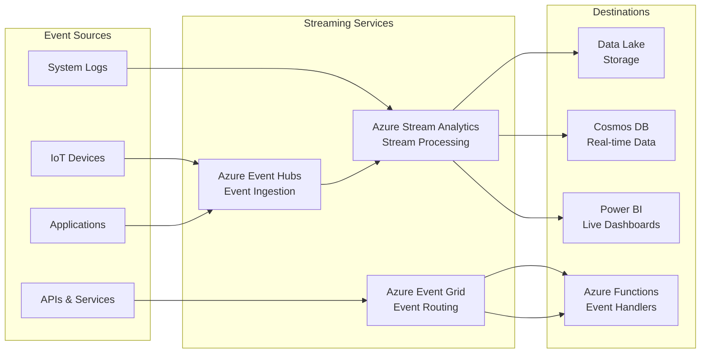
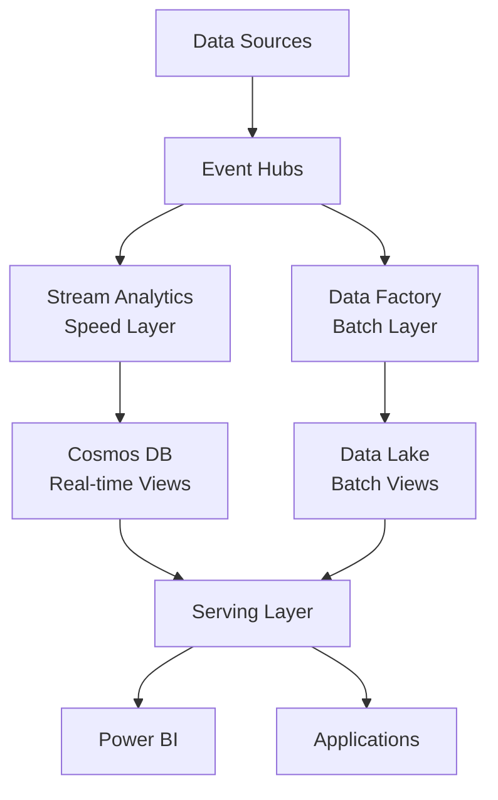
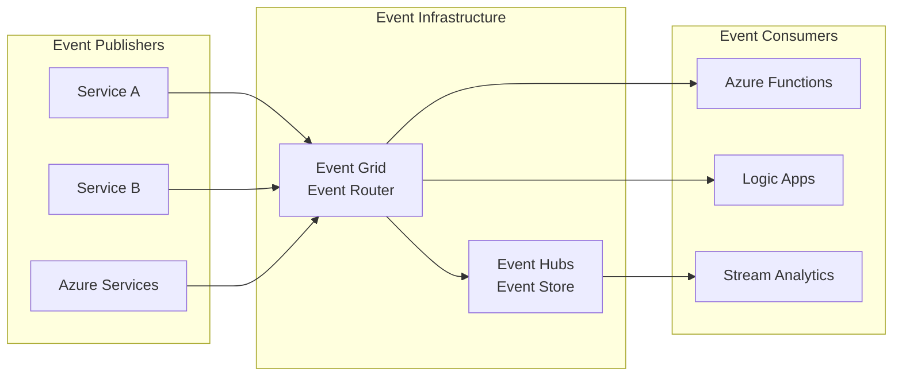

# 🔄 Streaming Services

> **🏠 [Home](../../../README.md)** | **📖 [Overview](../../01-overview/README.md)** | **🛠️ [Services](../README.md)** | **🔄 Streaming Services**

Real-time data processing and event-driven architecture services for streaming analytics.

---

## 🎯 Service Overview

Streaming services enable real-time data processing, event ingestion, and event-driven architectures. These services handle continuous data streams with low latency and high throughput requirements.

---

## 🚀 Service Cards

### 📨 Azure Event Hubs

**Big data streaming platform and event ingestion service for millions of events per second.**

#### 🔥 Key Strengths
- **Massive Scale**: Ingest millions of events per second
- **Kafka Compatible**: Drop-in replacement for Apache Kafka
- **Auto-scaling**: Automatically adjust to traffic patterns
- **Global Distribution**: Multi-region event streaming

#### 📊 Core Capabilities
- **[Event Streaming Basics](azure-event-hubs/event-streaming-basics.md)** - Fundamental concepts
- **[Kafka Compatibility](azure-event-hubs/kafka-compatibility.md)** - Migration from Kafka
- **[Capture to Storage](azure-event-hubs/capture-to-storage.md)** - Automatic archival
- **[Schema Registry](azure-event-hubs/schema-registry.md)** - Schema management

#### 🎯 Best For
- High-volume event ingestion
- IoT device telemetry
- Application logging and monitoring
- Kafka migration scenarios

#### 💰 Pricing Model
- **Standard**: Throughput Units (TU) + ingress/egress
- **Dedicated**: Dedicated Capacity Units (CU) for isolation
- **Premium**: Enhanced performance and security

**[📖 Full Documentation →](azure-event-hubs/README.md)**

---

### ⚡ Azure Stream Analytics

**Real-time analytics service for streaming data with SQL-based queries.**

#### 🔥 Key Strengths
- **SQL-based**: Familiar SQL syntax for stream processing
- **Serverless**: No infrastructure management required
- **Built-in ML**: Anomaly detection and machine learning
- **Edge Support**: Deploy to IoT Edge devices

#### 📊 Core Capabilities
- **[Stream Processing Basics](azure-stream-analytics/stream-processing-basics.md)** - Core concepts
- **[Windowing Functions](azure-stream-analytics/windowing-functions.md)** - Time-based aggregations
- **[Anomaly Detection](azure-stream-analytics/anomaly-detection.md)** - Built-in ML features
- **[Edge Deployments](azure-stream-analytics/edge-deployments.md)** - IoT Edge processing

#### 🎯 Best For
- Real-time analytics and dashboards
- IoT device analytics
- Fraud detection systems
- Operational monitoring

#### 💰 Pricing Model
- **Streaming Units (SU)**: Compute capacity pricing
- **Edge**: Per device licensing
- **Pay-as-you-go**: Hourly billing

**[📖 Full Documentation →](azure-stream-analytics/README.md)**

---

### 🌐 Azure Event Grid

**Event routing service for building reactive, event-driven applications.**

#### 🔥 Key Strengths
- **Serverless**: Pay-per-event pricing model
- **Rich Filtering**: Content-based event routing
- **Reliable Delivery**: Built-in retry and dead letter queues
- **Azure Integration**: Native events from all Azure services

#### 📊 Core Capabilities
- **[Event-driven Architecture](azure-event-grid/event-driven-architecture.md)** - Design patterns
- **[System Topics](azure-event-grid/system-topics.md)** - Built-in Azure events

#### 🎯 Best For
- Event-driven application architectures
- Serverless workflow automation
- System integration and decoupling
- Reactive microservices

#### 💰 Pricing Model
- **Pay-per-operation**: $0.60 per million operations
- **No minimum fees**: True pay-as-you-use
- **Advanced features**: Additional costs for premium features

**[📖 Full Documentation →](azure-event-grid/README.md)**

---

## 📊 Service Comparison

### Feature Matrix

| Feature | Event Hubs | Stream Analytics | Event Grid |
|---------|------------|-----------------|------------|
| **Primary Purpose** | Event Ingestion | Stream Processing | Event Routing |
| **Throughput** | Very High (millions/sec) | Medium (SU-based) | High |
| **Processing Logic** | ❌ None | ✅ SQL-based | ❌ Routing Only |
| **Kafka Compatible** | ✅ Yes | ❌ No | ❌ No |
| **Built-in Analytics** | ❌ No | ✅ Advanced | ❌ No |
| **Event Filtering** | ❌ Limited | ✅ SQL-based | ✅ Advanced |
| **Schema Registry** | ✅ Yes | ❌ No | ❌ No |
| **Serverless Option** | ❌ No | ✅ Yes | ✅ Yes |
| **Edge Deployment** | ❌ No | ✅ Yes | ❌ No |
| **Dead Letter Queues** | ❌ No | ❌ No | ✅ Yes |
| **Cost Model** | TU/CU-based | SU-based | Per-operation |

### Use Case Recommendations

#### 📈 Real-time Analytics Dashboard
**Architecture**: Event Hubs → Stream Analytics → Power BI
- **Primary**: Stream Analytics for processing
- **Supporting**: Event Hubs for ingestion
- **Pattern**: [Lambda Architecture](../../03-architecture-patterns/streaming-architectures/lambda-architecture.md)

#### 🏭 IoT Device Monitoring
**Architecture**: IoT Devices → Event Hubs → Stream Analytics → Alerts
- **Primary**: Event Hubs for high-volume ingestion
- **Supporting**: Stream Analytics for real-time analysis
- **Pattern**: [IoT Analytics Pattern](../../03-architecture-patterns/reference-architectures/iot-analytics.md)

#### 🔗 Event-driven Microservices
**Architecture**: Services → Event Grid → Functions/Logic Apps
- **Primary**: Event Grid for service decoupling
- **Supporting**: Azure Functions for event handling
- **Pattern**: [Event Sourcing](../../03-architecture-patterns/streaming-architectures/event-sourcing.md)

#### 📊 Stream Processing Pipeline
**Architecture**: Data Sources → Event Hubs → Stream Analytics → Storage
- **Primary**: Stream Analytics for transformation
- **Supporting**: Event Hubs for buffering
- **Pattern**: [Kappa Architecture](../../03-architecture-patterns/streaming-architectures/kappa-architecture.md)

---

## 🎯 Common Architecture Patterns

### Lambda Architecture with Streaming Services

### Event-Driven Architecture

---

## 🚀 Getting Started Recommendations

### 🆕 **New to Streaming**
1. **Start with**: Azure Stream Analytics
2. **Why**: SQL-based, serverless, easy to learn
3. **Next**: Add Event Hubs for higher throughput
4. **Pattern**: Simple stream processing pipeline

### 📊 **Analytics-Focused**
1. **Start with**: Event Hubs + Stream Analytics
2. **Why**: Purpose-built for analytics workloads
3. **Next**: Integrate with Power BI and Data Lake
4. **Pattern**: Real-time analytics dashboard

### 🏗️ **Architecture-Focused**
1. **Start with**: Event Grid
2. **Why**: Event-driven architecture foundation
3. **Next**: Add Event Hubs for high-volume scenarios
4. **Pattern**: Event-driven microservices

### 🏭 **IoT-Focused**
1. **Start with**: Event Hubs + Stream Analytics
2. **Why**: Optimized for IoT scenarios
3. **Next**: Add Edge deployments
4. **Pattern**: IoT analytics pipeline

---

## 💰 Cost Optimization Strategies

### Event Hubs Cost Optimization
- **Right-size throughput units** based on actual usage
- **Use auto-inflate** to handle traffic spikes efficiently
- **Consider dedicated clusters** for predictable high-volume workloads
- **Optimize partition count** based on consumer parallelism

### Stream Analytics Cost Optimization
- **Use appropriate streaming unit size** for your workload
- **Implement auto-scaling** to adjust to demand
- **Optimize query complexity** to reduce SU requirements
- **Use temporal aggregations** to reduce processing overhead

### Event Grid Cost Optimization
- **Implement efficient filtering** to reduce unnecessary operations
- **Use system topics** instead of custom topics where possible
- **Optimize event schema** to minimize payload size
- **Implement proper error handling** to avoid retry costs

**[📖 Detailed Cost Guide →](../../05-best-practices/cross-cutting-concerns/cost-optimization/README.md)**

---

## 🔒 Security Best Practices

### Authentication & Authorization
- **Azure AD Integration**: Use managed identities where possible
- **Shared Access Signatures**: Implement least-privilege access
- **RBAC**: Apply role-based access control
- **Network Security**: Use private endpoints and VNet integration

### Data Protection
- **Encryption in Transit**: TLS 1.2 for all connections
- **Encryption at Rest**: Azure Storage Service Encryption
- **Key Management**: Azure Key Vault for secret management
- **Data Masking**: Implement data anonymization where needed

**[📖 Security Guide →](../../05-best-practices/cross-cutting-concerns/security/README.md)**

---

## 📊 Monitoring & Observability

### Key Metrics to Monitor

#### Event Hubs Metrics
- **Incoming Messages**: Message ingestion rate
- **Outgoing Messages**: Message consumption rate
- **Throttled Requests**: Capacity utilization
- **Capture Backlog**: Archive processing status

#### Stream Analytics Metrics
- **SU Utilization**: Resource consumption
- **Input/Output Events**: Processing throughput
- **Watermark Delay**: Processing latency
- **Runtime Errors**: Processing health

#### Event Grid Metrics
- **Published Events**: Event publication rate
- **Delivered Events**: Successful delivery rate
- **Failed Deliveries**: Error rate monitoring
- **Dead Letter Events**: Failed event tracking

**[📖 Monitoring Guide →](../../09-monitoring/README.md)**

---

## 🔧 Integration Scenarios

### With Analytics Services
- **[Synapse Integration](../../04-implementation-guides/integration-scenarios/stream-analytics-synapse.md)**: Real-time to batch processing
- **[Databricks Integration](../../04-implementation-guides/integration-scenarios/eventhubs-databricks.md)**: Stream processing with ML
- **[Data Factory Integration](../../04-implementation-guides/integration-scenarios/event-driven-pipelines.md)**: Event-triggered data pipelines

### With Storage Services
- **[Data Lake Integration](../../04-implementation-guides/integration-scenarios/streaming-to-datalake.md)**: Stream to lake patterns
- **[Cosmos DB Integration](../../04-implementation-guides/integration-scenarios/stream-analytics-cosmos.md)**: Real-time operational data
- **[SQL Database Integration](../../04-implementation-guides/integration-scenarios/streaming-to-sql.md)**: Stream to relational patterns

**[📖 All Integration Scenarios →](../../04-implementation-guides/integration-scenarios/README.md)**

---

## 📚 Learning Resources

### 🎓 **Getting Started**
- [**Streaming Concepts**](../../tutorials/beginner/streaming-concepts.md)
- [**Event Hubs Quick Start**](../../tutorials/beginner/eventhubs-quickstart.md)
- [**Stream Analytics Tutorial**](../../tutorials/intermediate/stream-analytics-tutorial.md)

### 📖 **Advanced Topics**
- [**Streaming Architecture Patterns**](../../03-architecture-patterns/streaming-architectures/README.md)
- [**Performance Optimization**](../../05-best-practices/cross-cutting-concerns/performance/streaming-optimization.md)
- [**Disaster Recovery**](../../05-best-practices/operational-excellence/streaming-dr.md)

### 🔧 **Code Examples**
- [**Event Hubs Samples**](../../06-code-examples/by-service/event-hubs/README.md)
- [**Stream Analytics Samples**](../../06-code-examples/by-service/stream-analytics/README.md)
- [**Integration Examples**](../../06-code-examples/integration-examples/streaming-pipeline/README.md)

---

*Last Updated: 2025-01-28*  
*Services Documented: 3*  
*Coverage: Complete*