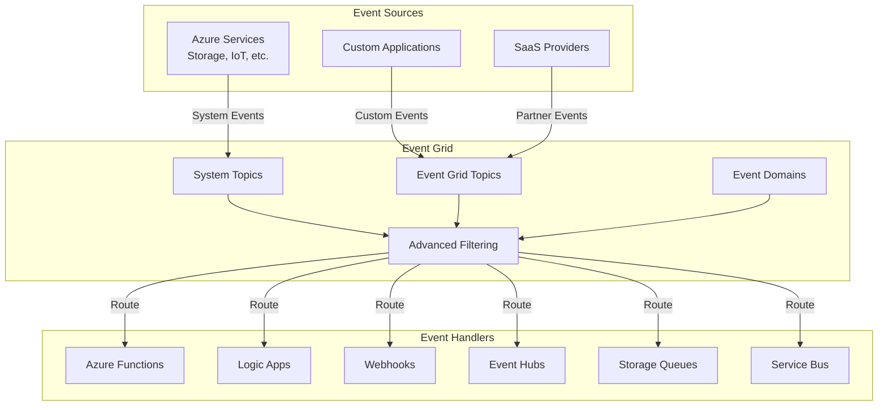
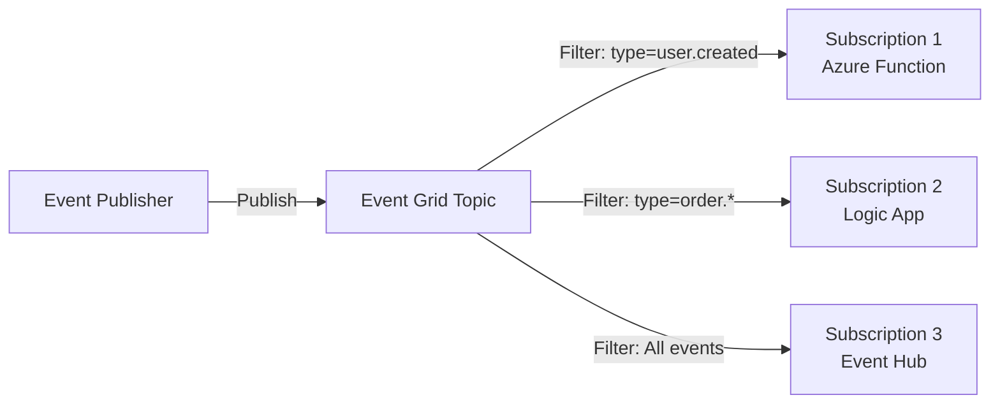
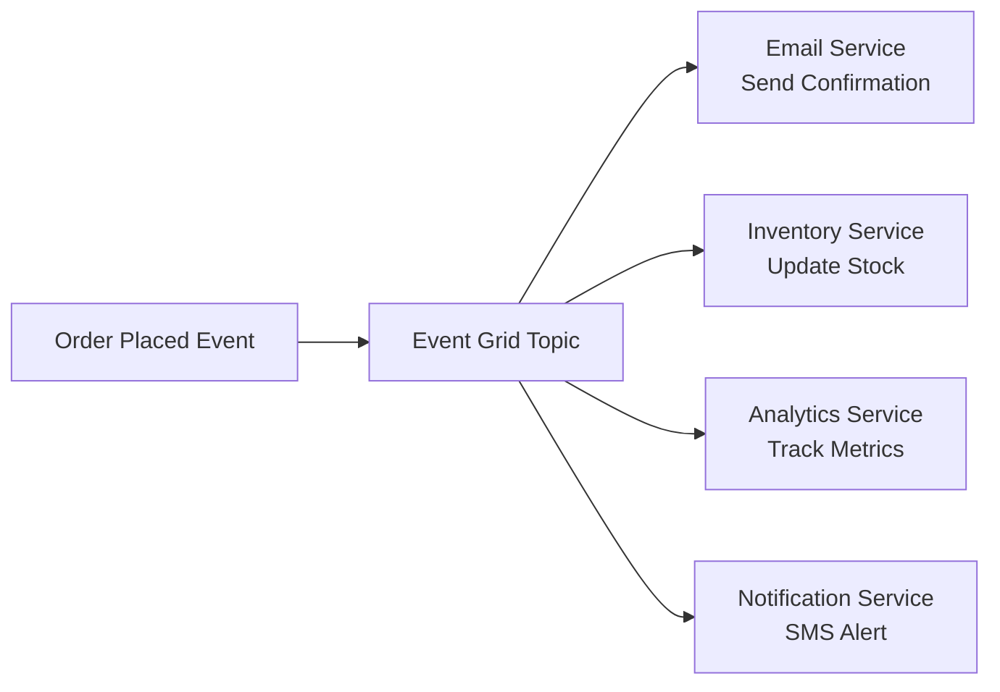
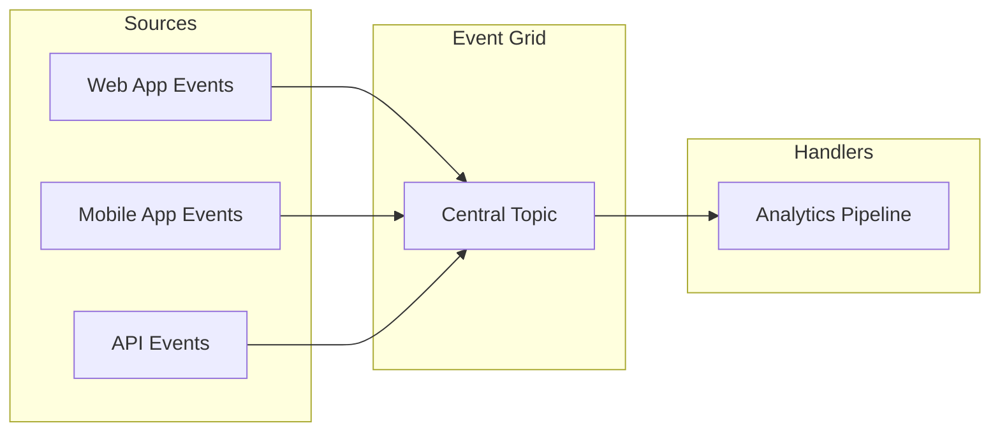

# 🌐 Azure Event Grid

> __🏠 [Home](../../../../README.md)__ | __📖 [Overview](../../../01-overview/README.md)__ | __🛠️ [Services](../../README.md)__ | __🔄 [Streaming Services](../README.md)__ | __🌐 Azure Event Grid__


Fully managed event routing service for building reactive, event-driven applications at scale.

---

## 🌟 Service Overview

Azure Event Grid is a highly scalable, serverless event broker that enables you to build event-driven architectures. It provides uniform event consumption using a publish-subscribe model, enabling real-time reactions to state changes across Azure services and custom applications.

### 🔥 Key Value Propositions

- __Serverless Architecture__: Pay only for events published, no infrastructure to manage
- __Native Azure Integration__: Built-in events from 100+ Azure services
- __Advanced Filtering__: Route events based on content, headers, or metadata
- __Reliable Delivery__: Built-in retry logic with dead-letter queues
- __Global Scale__: Handle millions of events per second across regions

---

## 🏗️ Architecture Overview



---

## 💰 Pricing Tiers

### 🥉 Basic Tier


__Best For__: Standard event-driven workloads

__Features__:

- __Operations pricing__: $0.60 per million operations
- __Standard throughput__: Up to 10 MB/s ingress
- __Event retention__: 24 hours
- __Public endpoints__: HTTPS webhooks
- __Filtering__: Subject and basic filtering

__Operations include__:
- Event publish
- Subscription match and delivery
- Advanced matching operations

### 🥇 Premium Tier


__Best For__: Enterprise workloads requiring enhanced security and performance

__Additional Features__:

- __Private Link support__: VNet integration
- __IP firewall__: Restrict access by IP
- __Managed identity__: Azure AD authentication
- __Higher throughput__: Increased limits
- __Geo-disaster recovery__: Multi-region support

---

## 🎯 Core Concepts

### Topics and Event Subscriptions



### Custom Topics

Create custom topics for your application events:

```bash
# Create resource group
az group create --name rg-eventgrid --location eastus

# Create custom topic
az eventgrid topic create \
  --name my-custom-topic \
  --resource-group rg-eventgrid \
  --location eastus

# Get topic endpoint
TOPIC_ENDPOINT=$(az eventgrid topic show \
  --name my-custom-topic \
  --resource-group rg-eventgrid \
  --query endpoint -o tsv)

# Get topic key
TOPIC_KEY=$(az eventgrid topic key list \
  --name my-custom-topic \
  --resource-group rg-eventgrid \
  --query key1 -o tsv)
```

### Publish Events

```python
from azure.eventgrid import EventGridPublisherClient
from azure.core.credentials import AzureKeyCredential
from azure.eventgrid import EventGridEvent
import datetime

# Initialize client
credential = AzureKeyCredential(topic_key)
client = EventGridPublisherClient(topic_endpoint, credential)

# Create events
events = [
    EventGridEvent(
        event_type="user.created",
        data={
            "user_id": "user-123",
            "email": "user@example.com",
            "created_at": datetime.datetime.utcnow().isoformat()
        },
        subject="users/user-123",
        data_version="1.0"
    ),
    EventGridEvent(
        event_type="order.placed",
        data={
            "order_id": "order-456",
            "total_amount": 99.99,
            "items": 3
        },
        subject="orders/order-456",
        data_version="1.0"
    )
]

# Publish events
client.send(events)
print(f"Published {len(events)} events")
```

---

## 🔗 Event Subscriptions

### Create Subscription to Azure Function

```bash
# Create Azure Function as event handler
az functionapp create \
  --name eventgrid-handler \
  --resource-group rg-eventgrid \
  --storage-account mystorageaccount \
  --consumption-plan-location eastus \
  --runtime python \
  --functions-version 4

# Create event subscription
az eventgrid event-subscription create \
  --name user-events-subscription \
  --source-resource-id $(az eventgrid topic show \
    --name my-custom-topic \
    --resource-group rg-eventgrid \
    --query id -o tsv) \
  --endpoint-type azurefunction \
  --endpoint $(az functionapp function show \
    --name eventgrid-handler \
    --resource-group rg-eventgrid \
    --function-name ProcessUserEvent \
    --query invokeUrlTemplate -o tsv) \
  --included-event-types "user.created" "user.updated"
```

### Advanced Filtering

```bash
# Create subscription with advanced filtering
az eventgrid event-subscription create \
  --name filtered-subscription \
  --source-resource-id $(az eventgrid topic show \
    --name my-custom-topic \
    --resource-group rg-eventgrid \
    --query id -o tsv) \
  --endpoint https://mywebhook.example.com/api/events \
  --advanced-filter data.order_amount NumberGreaterThan 100 \
  --advanced-filter data.region StringIn westus eastus \
  --subject-begins-with orders/ \
  --subject-ends-with /completed
```

### Filter Examples

```json
{
  "filter": {
    "includedEventTypes": [
      "Microsoft.Storage.BlobCreated",
      "Microsoft.Storage.BlobDeleted"
    ],
    "subjectBeginsWith": "/blobServices/default/containers/images/",
    "subjectEndsWith": ".jpg",
    "advancedFilters": [
      {
        "operatorType": "NumberGreaterThan",
        "key": "data.contentLength",
        "value": 1048576
      },
      {
        "operatorType": "StringContains",
        "key": "subject",
        "values": ["prod", "production"]
      }
    ]
  }
}
```

---

## 🎯 Event Handlers

### Azure Function Handler

```python
import logging
import json
import azure.functions as func

def main(event: func.EventGridEvent):
    """Process Event Grid event in Azure Function."""
    logging.info('Python EventGrid trigger processed an event')

    # Parse event
    event_data = event.get_json()

    logging.info(f'Event Type: {event.event_type}')
    logging.info(f'Event Subject: {event.subject}')
    logging.info(f'Event Data: {json.dumps(event_data, indent=2)}')

    # Process based on event type
    if event.event_type == "user.created":
        process_user_creation(event_data)
    elif event.event_type == "order.placed":
        process_order(event_data)
    else:
        logging.warning(f'Unknown event type: {event.event_type}')

def process_user_creation(data):
    """Handle user creation event."""
    user_id = data.get('user_id')
    email = data.get('email')

    # Send welcome email
    logging.info(f'Sending welcome email to {email}')

    # Create user profile
    logging.info(f'Creating profile for user {user_id}')

def process_order(data):
    """Handle order placement event."""
    order_id = data.get('order_id')
    total = data.get('total_amount')

    logging.info(f'Processing order {order_id} for ${total}')
```

### Webhook Handler

```python
from flask import Flask, request, jsonify
import json

app = Flask(__name__)

@app.route('/api/events', methods=['POST', 'OPTIONS'])
def handle_event():
    """Webhook endpoint for Event Grid events."""
    if request.method == 'OPTIONS':
        # Handle validation handshake
        return '', 200

    if request.method == 'POST':
        events = request.get_json()

        # Handle validation event
        for event in events:
            if event['eventType'] == 'Microsoft.EventGrid.SubscriptionValidationEvent':
                validation_code = event['data']['validationCode']
                return jsonify({
                    'validationResponse': validation_code
                })

            # Process actual events
            process_event(event)

        return '', 200

def process_event(event):
    """Process individual event."""
    event_type = event['eventType']
    subject = event['subject']
    data = event['data']

    print(f"Event Type: {event_type}")
    print(f"Subject: {subject}")
    print(f"Data: {json.dumps(data, indent=2)}")

if __name__ == '__main__':
    app.run(port=5000)
```

---

## 📚 Common Patterns

### Fan-Out Pattern

Route single event to multiple handlers:



### Event Aggregation

Collect events from multiple sources:



---

## 🔒 Security

### Authentication Methods

```python
# Method 1: Access Key
from azure.eventgrid import EventGridPublisherClient
from azure.core.credentials import AzureKeyCredential

credential = AzureKeyCredential(topic_key)
client = EventGridPublisherClient(endpoint, credential)

# Method 2: Managed Identity (Premium tier)
from azure.identity import DefaultAzureCredential

credential = DefaultAzureCredential()
client = EventGridPublisherClient(endpoint, credential)
```

### Webhook Security

```python
import hmac
import hashlib
import base64

def validate_event_grid_signature(request):
    """Validate Event Grid webhook signature."""
    # Get signature from header
    signature = request.headers.get('aeg-signature')

    # Get shared secret
    shared_secret = os.getenv('EVENTGRID_WEBHOOK_SECRET')

    # Compute expected signature
    payload = request.get_data()
    expected = base64.b64encode(
        hmac.new(
            shared_secret.encode('utf-8'),
            payload,
            hashlib.sha256
        ).digest()
    ).decode('utf-8')

    return hmac.compare_digest(signature, expected)
```

---

## 📊 Monitoring

### Track Metrics

```python
from azure.monitor.query import MetricsQueryClient
from azure.identity import DefaultAzureCredential
from datetime import datetime, timedelta

credential = DefaultAzureCredential()
client = MetricsQueryClient(credential)

# Query Event Grid metrics
resource_id = "/subscriptions/{sub}/resourceGroups/rg-eventgrid/providers/Microsoft.EventGrid/topics/my-custom-topic"

response = client.query_resource(
    resource_id,
    metric_names=["PublishSuccessCount", "PublishFailCount", "DeliverySuccessCount"],
    timespan=timedelta(hours=1),
    granularity=timedelta(minutes=5)
)

for metric in response.metrics:
    print(f"{metric.name}: {metric.timeseries}")
```

### Key Metrics

| Metric | Description | Threshold |
|--------|-------------|-----------|
| __PublishSuccessCount__ | Successfully published events | Monitor for drops |
| __PublishFailCount__ | Failed publish attempts | Alert if > 0 |
| __DeliverySuccessCount__ | Successfully delivered events | Compare with published |
| __DeliveryFailCount__ | Failed delivery attempts | Alert if increasing |
| __MatchedEventCount__ | Events matched to subscriptions | Monitor routing |
| __DeadLetteredCount__ | Events sent to dead letter | Investigate failures |

---

## 🔗 Related Topics

### Deep Dive Guides

- __[Event-driven Architecture](event-driven-architecture.md)__ - Design patterns and best practices
- __[System Topics](system-topics.md)__ - Azure service events

### Integration Scenarios

- [__Event Grid + Functions__](../../../04-implementation-guides/integration-scenarios/eventgrid-functions.md)
- [__Event Grid + Logic Apps__](../../../04-implementation-guides/integration-scenarios/eventgrid-logicapps.md)
- [__Event Grid + Event Hubs__](../../../04-implementation-guides/integration-scenarios/eventgrid-eventhubs.md)

### Best Practices

- [__Reliability Patterns__](../../../05-best-practices/operational-excellence/eventgrid-reliability.md)
- [__Security Configuration__](../../../05-best-practices/cross-cutting-concerns/security/eventgrid-security.md)
- [__Performance Optimization__](../../../05-best-practices/cross-cutting-concerns/performance/eventgrid-optimization.md)

---

*Last Updated: 2025-01-28*
*Service Version: General Availability*
*Documentation Status: Complete*
