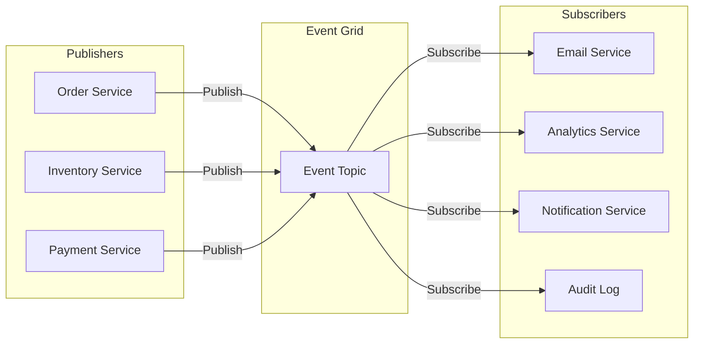
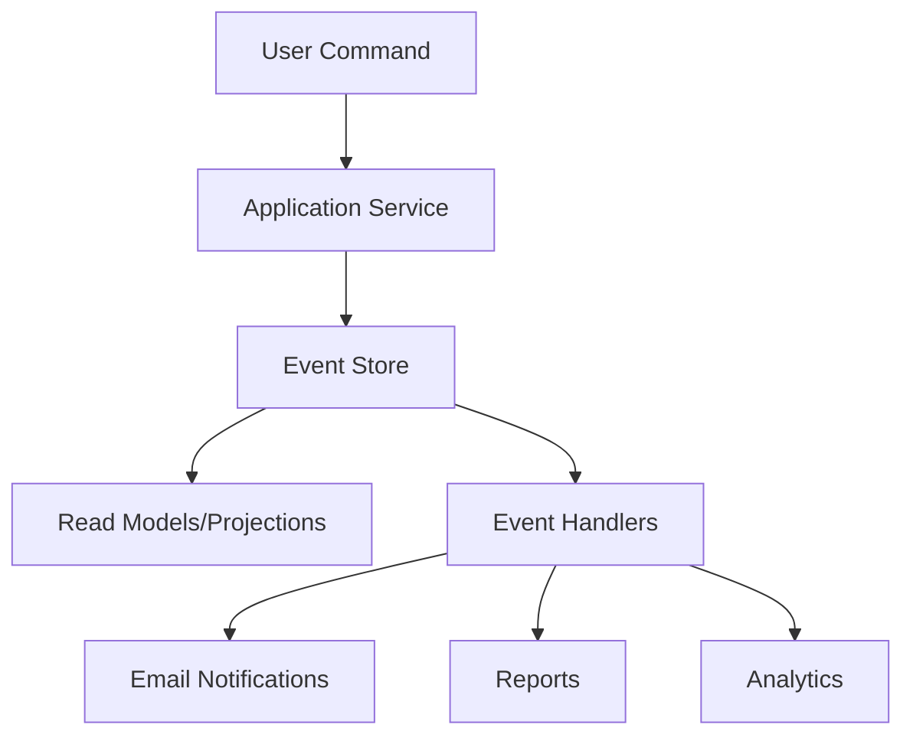
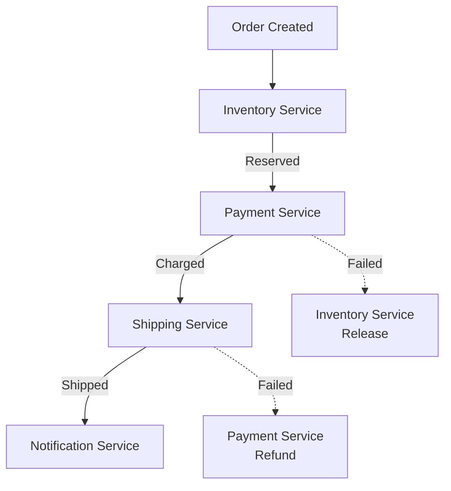
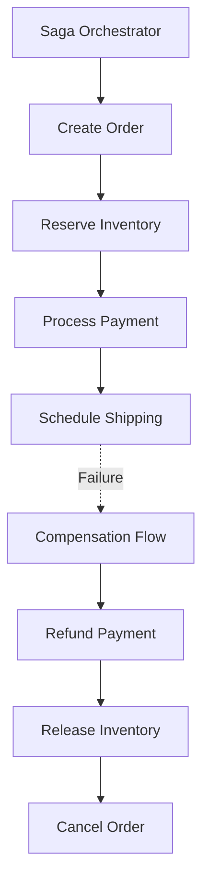

# 🔄 Event-Driven Architecture

> __🏠 [Home](../../../../README.md)__ | __📖 [Overview](../../../01-overview/README.md)__ | __🛠️ [Services](../../README.md)__ | __🔄 [Streaming Services](../README.md)__ | __🌐 [Event Grid](README.md)__ | __🔄 Event-Driven Architecture__


Design patterns and best practices for building event-driven applications with Azure Event Grid.

---

## 🎯 What is Event-Driven Architecture?

Event-Driven Architecture (EDA) is a software design pattern where system components communicate through the production, detection, and consumption of events. An event represents a significant change in state or an occurrence in the system.

### Core Principles

- __Loose Coupling__: Components don't know about each other
- __Asynchronous Communication__: Non-blocking event processing
- __Scalability__: Components scale independently
- __Resilience__: Failures are isolated
- __Real-time Responsiveness__: Immediate reaction to events

---

## 🏗️ Architecture Patterns

### 1. Publisher-Subscriber Pattern



**Implementation**:

```python
from azure.eventgrid import EventGridPublisherClient, EventGridEvent
from azure.core.credentials import AzureKeyCredential
from datetime import datetime

class OrderService:
    """Order service publishes events to Event Grid."""

    def __init__(self, topic_endpoint, topic_key):
        credential = AzureKeyCredential(topic_key)
        self.client = EventGridPublisherClient(topic_endpoint, credential)

    def create_order(self, order_data):
        """Create order and publish event."""
        # Business logic
        order_id = self.save_order(order_data)

        # Publish event
        event = EventGridEvent(
            event_type="order.created",
            data={
                "order_id": order_id,
                "customer_id": order_data["customer_id"],
                "total_amount": order_data["total"],
                "items": order_data["items"],
                "timestamp": datetime.utcnow().isoformat()
            },
            subject=f"orders/{order_id}",
            data_version="1.0"
        )

        self.client.send([event])
        return order_id
```

### 2. Event Sourcing Pattern



**Implementation**:

```python
from dataclasses import dataclass
from typing import List
from datetime import datetime

@dataclass
class Event:
    """Base event class."""
    event_id: str
    event_type: str
    timestamp: datetime
    data: dict

class EventStore:
    """Event store for event sourcing."""

    def __init__(self, event_grid_client):
        self.client = event_grid_client
        self.events = []  # In production, use durable storage

    def append_event(self, event: Event):
        """Append event to store and publish."""
        # Store event
        self.events.append(event)

        # Publish to Event Grid
        grid_event = EventGridEvent(
            event_type=event.event_type,
            data=event.data,
            subject=event.event_id,
            data_version="1.0"
        )
        self.client.send([grid_event])

    def replay_events(self, entity_id):
        """Replay events to rebuild state."""
        return [e for e in self.events if e.data.get("entity_id") == entity_id]

class BankAccount:
    """Aggregate using event sourcing."""

    def __init__(self, account_id, event_store):
        self.account_id = account_id
        self.event_store = event_store
        self.balance = 0
        self.version = 0

    def deposit(self, amount):
        """Deposit money and create event."""
        event = Event(
            event_id=f"{self.account_id}-{self.version + 1}",
            event_type="account.deposited",
            timestamp=datetime.utcnow(),
            data={
                "entity_id": self.account_id,
                "amount": amount,
                "balance_after": self.balance + amount
            }
        )

        self.event_store.append_event(event)
        self.apply(event)

    def apply(self, event: Event):
        """Apply event to update state."""
        if event.event_type == "account.deposited":
            self.balance += event.data["amount"]
            self.version += 1
        elif event.event_type == "account.withdrawn":
            self.balance -= event.data["amount"]
            self.version += 1
```

### 3. Choreography Pattern

Services react to events without central orchestration:



**Implementation**:

```python
import azure.functions as func
from azure.eventgrid import EventGridPublisherClient
from azure.core.credentials import AzureKeyCredential

# Inventory Service Handler
def inventory_handler(event: func.EventGridEvent):
    """React to order.created event."""
    if event.event_type == "order.created":
        order_data = event.get_json()

        # Reserve inventory
        success = reserve_inventory(order_data["items"])

        # Publish result event
        if success:
            publish_event("inventory.reserved", order_data)
        else:
            publish_event("inventory.insufficient", order_data)

# Payment Service Handler
def payment_handler(event: func.EventGridEvent):
    """React to inventory.reserved event."""
    if event.event_type == "inventory.reserved":
        order_data = event.get_json()

        # Process payment
        success = charge_payment(order_data["payment_info"])

        # Publish result event
        if success:
            publish_event("payment.completed", order_data)
        else:
            publish_event("payment.failed", order_data)
            # Trigger compensation
            publish_event("inventory.release", order_data)
```

### 4. Orchestration Pattern (Saga Pattern)

Central coordinator manages distributed transactions:



**Implementation with Logic Apps**:

```json
{
  "definition": {
    "$schema": "https://schema.management.azure.com/providers/Microsoft.Logic/schemas/2016-06-01/workflowdefinition.json#",
    "triggers": {
      "When_order_created_event": {
        "type": "EventGrid",
        "inputs": {
          "eventType": "order.created",
          "topic": "/subscriptions/.../topics/orders"
        }
      }
    },
    "actions": {
      "Reserve_Inventory": {
        "type": "Http",
        "inputs": {
          "method": "POST",
          "uri": "https://inventory-api.com/reserve"
        },
        "runAfter": {}
      },
      "Process_Payment": {
        "type": "Http",
        "inputs": {
          "method": "POST",
          "uri": "https://payment-api.com/charge"
        },
        "runAfter": {
          "Reserve_Inventory": ["Succeeded"]
        }
      },
      "Compensate_on_Failure": {
        "type": "Scope",
        "actions": {
          "Release_Inventory": {
            "type": "Http",
            "inputs": {
              "method": "POST",
              "uri": "https://inventory-api.com/release"
            }
          }
        },
        "runAfter": {
          "Process_Payment": ["Failed"]
        }
      }
    }
  }
}
```

---

## 🎯 Best Practices

### 1. Event Design

```python
from dataclasses import dataclass
from typing import Optional
from datetime import datetime
import uuid

@dataclass
class WellDesignedEvent:
    """Example of well-designed event."""

    # Standard fields
    event_id: str = str(uuid.uuid4())
    event_type: str = ""  # e.g., "order.created"
    event_timestamp: datetime = datetime.utcnow()
    event_version: str = "1.0"

    # Subject/Source
    subject: str = ""  # e.g., "orders/order-123"
    source: str = ""  # e.g., "order-service"

    # Event data
    data: dict = None

    # Correlation
    correlation_id: Optional[str] = None
    causation_id: Optional[str] = None

    def to_eventgrid_event(self):
        """Convert to Event Grid event format."""
        from azure.eventgrid import EventGridEvent

        return EventGridEvent(
            id=self.event_id,
            event_type=self.event_type,
            data={
                **self.data,
                "correlation_id": self.correlation_id,
                "causation_id": self.causation_id
            },
            subject=self.subject,
            event_time=self.event_timestamp,
            data_version=self.event_version
        )
```

### 2. Idempotency

```python
import hashlib
import json

class IdempotentEventHandler:
    """Handle events idempotently."""

    def __init__(self):
        self.processed_events = set()  # In production, use Redis/Cosmos DB

    def compute_event_hash(self, event):
        """Compute unique hash for event."""
        event_str = json.dumps({
            "id": event.id,
            "type": event.event_type,
            "subject": event.subject
        }, sort_keys=True)

        return hashlib.sha256(event_str.encode()).hexdigest()

    def process_event(self, event):
        """Process event only once."""
        event_hash = self.compute_event_hash(event)

        if event_hash in self.processed_events:
            print(f"Event {event.id} already processed, skipping")
            return

        # Process event
        self.handle_event(event)

        # Mark as processed
        self.processed_events.add(event_hash)

    def handle_event(self, event):
        """Actual event processing logic."""
        print(f"Processing event {event.id}")
```

### 3. Error Handling and Dead Letter Queues

```bash
# Create storage account for dead letter queue
az storage account create \
  --name deadletterstorage \
  --resource-group rg-eventgrid \
  --location eastus \
  --sku Standard_LRS

# Create event subscription with dead letter configuration
az eventgrid event-subscription create \
  --name resilient-subscription \
  --source-resource-id /subscriptions/.../topics/my-topic \
  --endpoint https://myhandler.com/api/events \
  --max-delivery-attempts 30 \
  --event-ttl 1440 \
  --deadletter-endpoint /subscriptions/.../storageAccounts/deadletterstorage/blobServices/default/containers/deadletter
```

**Process Dead Letter Events**:

```python
from azure.storage.blob import BlobServiceClient
from azure.eventgrid import EventGridEvent
import json

def process_dead_letter_events():
    """Process events from dead letter queue."""
    blob_service = BlobServiceClient.from_connection_string(connection_string)
    container = blob_service.get_container_client("deadletter")

    for blob in container.list_blobs():
        # Download dead letter event
        blob_client = container.get_blob_client(blob.name)
        content = blob_client.download_blob().readall()

        event_data = json.loads(content)

        # Analyze failure
        print(f"Failed event: {event_data['event_type']}")
        print(f"Reason: {event_data.get('reason')}")

        # Attempt manual processing or alert
        handle_failed_event(event_data)
```

### 4. Event Versioning

```python
def handle_versioned_event(event):
    """Handle different event versions."""
    version = event.data_version

    if version == "1.0":
        return process_v1_event(event)
    elif version == "2.0":
        return process_v2_event(event)
    else:
        raise ValueError(f"Unsupported event version: {version}")

def process_v1_event(event):
    """Process version 1.0 events."""
    data = event.get_json()
    # V1 schema: {order_id, total}
    return {
        "order_id": data["order_id"],
        "total": data["total"],
        "currency": "USD"  # Default for V1
    }

def process_v2_event(event):
    """Process version 2.0 events."""
    data = event.get_json()
    # V2 schema: {order_id, total, currency}
    return {
        "order_id": data["order_id"],
        "total": data["total"],
        "currency": data["currency"]
    }
```

---

## 📊 Monitoring Event-Driven Systems

```python
from azure.monitor.opentelemetry import configure_azure_monitor
from opentelemetry import trace

# Configure monitoring
configure_azure_monitor()
tracer = trace.get_tracer(__name__)

def publish_with_tracing(event_data):
    """Publish event with distributed tracing."""
    with tracer.start_as_current_span("publish_event") as span:
        span.set_attribute("event.type", event_data["event_type"])
        span.set_attribute("event.subject", event_data["subject"])

        # Publish event
        client.send([event_data])

        span.set_attribute("event.id", event_data.id)

def consume_with_tracing(event: func.EventGridEvent):
    """Consume event with distributed tracing."""
    with tracer.start_as_current_span("consume_event") as span:
        span.set_attribute("event.type", event.event_type)
        span.set_attribute("event.id", event.id)

        # Process event
        process_event(event)
```

---

## 🔗 Related Resources

### Documentation

- [__Azure Event Grid Overview__](README.md) - Service overview
- [__System Topics__](system-topics.md) - Azure service events

### Patterns

- [__Saga Pattern__](../../../03-architecture-patterns/integration-patterns/saga-pattern.md)
- [__Event Sourcing__](../../../03-architecture-patterns/data-patterns/event-sourcing.md)
- [__CQRS Pattern__](../../../03-architecture-patterns/data-patterns/cqrs.md)

### Best Practices

- [__Reliability Engineering__](../../../05-best-practices/operational-excellence/reliability.md)
- [__Monitoring & Observability__](../../../05-best-practices/operational-excellence/monitoring.md)

---

*Last Updated: 2025-01-28*
*Pattern Type: Architectural*
*Documentation Status: Complete*
