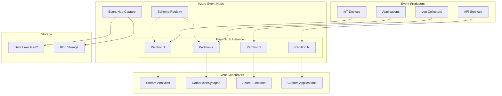
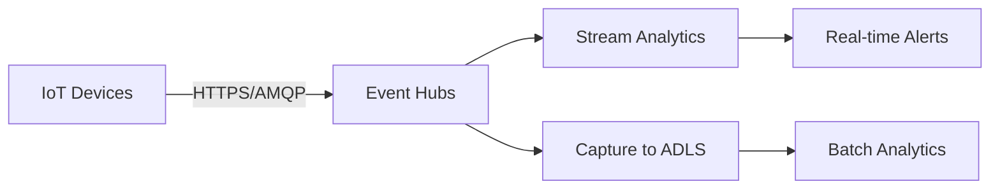

# 📨 Azure Event Hubs

> __🏠 [Home](../../../../README.md)__ | __📖 [Overview](../../../01-overview/README.md)__ | __🛠️ [Services](../../README.md)__ | __🔄 [Streaming Services](../README.md)__ | __📨 Azure Event Hubs__


Big data streaming platform and event ingestion service for millions of events per second.

---

## 🌟 Service Overview

Azure Event Hubs is a fully managed, real-time data ingestion service that can stream millions of events per second from any source. It provides a distributed streaming platform with low latency and seamless integration with Azure and third-party services.

### 🔥 Key Value Propositions

- __Massive Scale__: Ingest millions of events per second with elastic throughput
- __Kafka Compatibility__: Drop-in replacement for Apache Kafka with native protocol support
- __Auto-Capture__: Automatically capture streaming data to Azure Data Lake or Blob Storage
- __Global Distribution__: Multi-region replication with geo-disaster recovery
- __Enterprise Security__: Advanced authentication, encryption, and network isolation

---

## 🏗️ Architecture Overview



---

## 💰 Pricing Tiers

### 🥉 Standard Tier


__Best For__: Development, testing, and variable production workloads

__Features__:

- __Throughput Units (TUs)__: 1-20 auto-inflate capable
- __Retention__: 1-7 days configurable
- __Consumer Groups__: Up to 20 per Event Hub
- __Partitions__: Up to 32 per Event Hub
- __Kafka Support__: ✅ Native protocol support
- __Capture__: ✅ To Data Lake or Blob Storage
- __Schema Registry__: ✅ Included

__Pricing Model__:

- Base charge per Throughput Unit
- Ingress events (per million)
- Capture charge (per GB stored)

### 🥇 Premium Tier


__Best For__: Production workloads with predictable performance requirements

__Features__:

- __Processing Units (PUs)__: 1-16 dedicated capacity
- __Retention__: Up to 90 days
- __Consumer Groups__: Unlimited
- __Partitions__: Up to 100 per Event Hub
- __Performance Isolation__: Dedicated resources
- __Enhanced Security__: Private Link, customer-managed keys
- __Larger Messages__: Up to 1 MB message size

__Additional Benefits__:

- Guaranteed capacity and latency
- Network isolation with Private Link
- Customer-managed encryption keys
- Multi-region disaster recovery

### 🏆 Dedicated Tier


__Best For__: Mission-critical enterprise workloads with extreme scale requirements

__Features__:

- __Capacity Units (CUs)__: Single-tenant deployments
- __Retention__: Up to 90 days
- __Throughput__: Multiple GB/sec per CU
- __Event Hubs__: Unlimited namespaces and Event Hubs
- __Complete Isolation__: Physical hardware isolation
- __Bring Your Own Key (BYOK)__: Full encryption control

__Ideal For__:

- Multi-tenant SaaS platforms
- Extremely high-volume scenarios (>100 MB/sec)
- Compliance requirements needing physical isolation
- Predictable monthly costs for large-scale operations

---

## 🎯 Core Concepts

### Throughput Units (Standard Tier)

A throughput unit controls capacity for Event Hubs:

- __Ingress__: Up to 1 MB/sec or 1,000 events/sec per TU
- __Egress__: Up to 2 MB/sec or 4,096 events/sec per TU
- __Auto-inflate__: Automatically scale TUs based on demand

```bash
# Enable auto-inflate for an Event Hub namespace
az eventhubs namespace update \
  --resource-group myResourceGroup \
  --name myNamespace \
  --enable-auto-inflate true \
  --maximum-throughput-units 20
```

### Partitions

Partitions are ordered sequences of events within an Event Hub:

- __Purpose__: Enable parallel processing and scaling
- __Count__: 1-32 (Standard), up to 100 (Premium)
- __Partition Keys__: Route related events to same partition
- __Ordering__: Guaranteed within a partition, not across partitions

```python
# Send event with partition key for ordering
from azure.eventhub import EventHubProducerClient, EventData

producer = EventHubProducerClient.from_connection_string(
    conn_str="your_connection_string",
    eventhub_name="your_eventhub"
)

# Events with same partition key go to same partition
event_data = EventData("Sensor reading: 23.5°C")
producer.send_event(event_data, partition_key="sensor-123")
```

### Consumer Groups

Consumer groups enable multiple applications to read from the same Event Hub independently:

- __Default__: `$Default` consumer group always available
- __Isolation__: Each consumer group maintains its own offset
- __Limit__: Up to 20 (Standard), Unlimited (Premium)

```python
# Read from specific consumer group
from azure.eventhub import EventHubConsumerClient

consumer = EventHubConsumerClient.from_connection_string(
    conn_str="your_connection_string",
    consumer_group="analytics-team",
    eventhub_name="your_eventhub"
)
```

---

## 📊 Use Cases

### 📱 IoT Telemetry Ingestion

__Scenario__: Ingest millions of sensor readings per second



### 📊 Application Logging & Monitoring

__Scenario__: Centralized logging for distributed applications

```python
# Send application logs to Event Hubs
import logging
from azure.eventhub import EventHubProducerClient, EventData
import json

def send_log_event(level, message, metadata):
    producer = EventHubProducerClient.from_connection_string(
        conn_str=os.getenv("EVENTHUB_CONNECTION_STRING"),
        eventhub_name="application-logs"
    )

    log_event = {
        "timestamp": datetime.utcnow().isoformat(),
        "level": level,
        "message": message,
        "metadata": metadata
    }

    event_data = EventData(json.dumps(log_event))
    producer.send_event(event_data)
    producer.close()
```

### 🔄 Change Data Capture (CDC)

__Scenario__: Stream database changes to Event Hubs for downstream processing

### 📈 Real-time Analytics Pipeline

__Scenario__: Process streaming data with Stream Analytics and visualize in Power BI

---

## 🚀 Quick Start

### Create Event Hub Namespace and Hub

```bash
# Create resource group
az group create --name rg-eventhub-demo --location eastus

# Create Event Hubs namespace (Standard tier)
az eventhubs namespace create \
  --name eventhub-demo-ns \
  --resource-group rg-eventhub-demo \
  --location eastus \
  --sku Standard \
  --enable-auto-inflate true \
  --maximum-throughput-units 10

# Create Event Hub with 4 partitions
az eventhubs eventhub create \
  --name telemetry-events \
  --namespace-name eventhub-demo-ns \
  --resource-group rg-eventhub-demo \
  --partition-count 4 \
  --message-retention 3

# Create consumer group
az eventhubs eventhub consumer-group create \
  --eventhub-name telemetry-events \
  --namespace-name eventhub-demo-ns \
  --resource-group rg-eventhub-demo \
  --name analytics-consumers
```

### Send Events (Python)

```python
from azure.eventhub import EventHubProducerClient, EventData
import json

# Initialize producer
producer = EventHubProducerClient.from_connection_string(
    conn_str="Endpoint=sb://eventhub-demo-ns.servicebus.windows.net/;...",
    eventhub_name="telemetry-events"
)

# Create batch and send events
try:
    event_batch = producer.create_batch()

    for i in range(100):
        event_data = {
            "sensor_id": f"sensor-{i % 10}",
            "temperature": 20 + (i % 15),
            "humidity": 50 + (i % 30),
            "timestamp": datetime.utcnow().isoformat()
        }
        event_batch.add(EventData(json.dumps(event_data)))

    producer.send_batch(event_batch)
    print(f"Sent batch of {len(event_batch)} events")
finally:
    producer.close()
```

### Receive Events (Python)

```python
from azure.eventhub import EventHubConsumerClient

def on_event_batch(partition_context, events):
    for event in events:
        print(f"Received event from partition {partition_context.partition_id}")
        print(f"Event data: {event.body_as_str()}")

    # Update checkpoint for this partition
    partition_context.update_checkpoint()

# Initialize consumer
consumer = EventHubConsumerClient.from_connection_string(
    conn_str="Endpoint=sb://eventhub-demo-ns.servicebus.windows.net/;...",
    consumer_group="$Default",
    eventhub_name="telemetry-events"
)

# Start receiving
try:
    with consumer:
        consumer.receive_batch(
            on_event_batch=on_event_batch,
            starting_position="-1"  # Start from beginning
        )
except KeyboardInterrupt:
    print("Stopped receiving")
```

---

## 🔗 Related Topics

### 📚 Deep Dive Guides

- __[Event Streaming Basics](event-streaming-basics.md)__ - Fundamental concepts and patterns
- __[Kafka Compatibility](kafka-compatibility.md)__ - Using Event Hubs as Kafka replacement
- __[Capture to Storage](capture-to-storage.md)__ - Automatic archival to Data Lake
- __[Schema Registry](schema-registry.md)__ - Schema management for Avro data

### 🛠️ Integration Scenarios

- [__Event Hubs + Stream Analytics__](../../../04-implementation-guides/integration-scenarios/eventhub-stream-analytics.md)
- [__Event Hubs + Databricks__](../../../04-implementation-guides/integration-scenarios/eventhub-databricks.md)
- [__Event Hubs + Azure Functions__](../../../04-implementation-guides/integration-scenarios/eventhub-functions.md)

### 🎯 Best Practices

- [__Performance Optimization__](../../../05-best-practices/cross-cutting-concerns/performance/eventhub-optimization.md)
- [__Security Configuration__](../../../05-best-practices/cross-cutting-concerns/security/eventhub-security.md)
- [__Cost Optimization__](../../../05-best-practices/cross-cutting-concerns/cost-optimization/eventhub-cost.md)

---

*Last Updated: 2025-01-28*
*Service Version: General Availability*
*Documentation Status: Complete*
