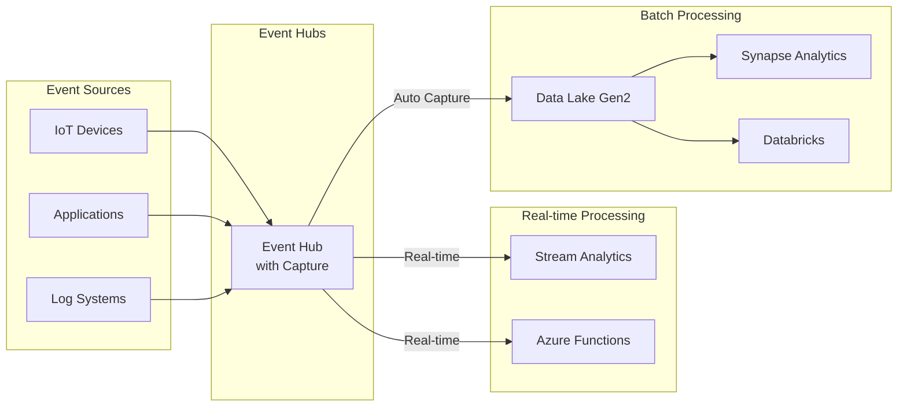
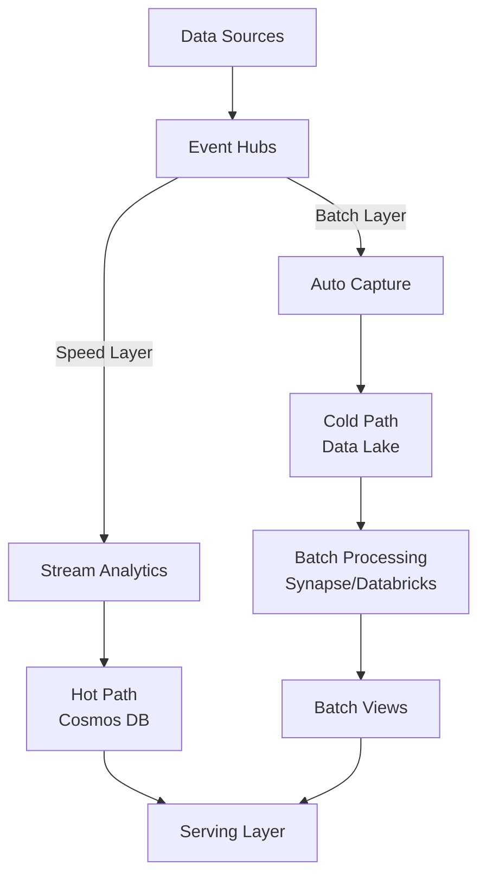

# 📦 Event Hub Capture to Storage

> __🏠 [Home](../../../../README.md)__ | __📖 [Overview](../../../01-overview/README.md)__ | __🛠️ [Services](../../README.md)__ | __🔄 [Streaming Services](../README.md)__ | __📨 [Event Hubs](README.md)__ | __📦 Capture to Storage__


Automatically capture streaming events to Azure Data Lake Storage Gen2 or Blob Storage for batch processing and long-term retention.

---

## 🎯 Overview

Event Hubs Capture enables you to automatically capture streaming data and save it to Azure Data Lake Storage Gen2 or Blob Storage in Avro or Parquet format. This provides a seamless way to combine real-time and batch processing without writing custom code.

### Key Benefits

- __Zero Code__: No custom applications needed for data archival
- __Configurable Windowing__: Time or size-based capture windows
- __Multiple Formats__: Avro (default) or Parquet output
- __Partitioned Output__: Automatic organization by date and time
- __Cost Effective__: Pay only for storage, not for capture processing
- __Integration Ready__: Works seamlessly with Azure Data Lake analytics

---

## 🏗️ Architecture Patterns

### Basic Capture Pattern



### Lambda Architecture with Capture



---

## ⚙️ Configuration

### Enable Capture via Azure Portal

1. Navigate to Event Hubs namespace
2. Select your Event Hub
3. Click "Capture" in left menu
4. Enable capture and configure:
   - **Capture provider**: Azure Storage or Data Lake
   - **Time window**: 1-15 minutes
   - **Size window**: 10-500 MB
   - **Output format**: Avro or Parquet

### Enable Capture via Azure CLI

```bash
# Create storage account for capture
az storage account create \
  --name capturestorage \
  --resource-group rg-eventhubs \
  --location eastus \
  --sku Standard_LRS \
  --enable-hierarchical-namespace true

# Get storage account key
STORAGE_KEY=$(az storage account keys list \
  --account-name capturestorage \
  --resource-group rg-eventhubs \
  --query '[0].value' -o tsv)

# Create container for captured data
az storage container create \
  --name eventhub-capture \
  --account-name capturestorage \
  --account-key $STORAGE_KEY

# Enable capture on Event Hub
az eventhubs eventhub update \
  --resource-group rg-eventhubs \
  --namespace-name mynamespace \
  --name myeventhub \
  --enable-capture true \
  --capture-interval 300 \
  --capture-size-limit 314572800 \
  --destination-name EventHubArchive.AzureBlockBlob \
  --storage-account /subscriptions/{subscription-id}/resourceGroups/rg-eventhubs/providers/Microsoft.Storage/storageAccounts/capturestorage \
  --blob-container eventhub-capture \
  --archive-name-format '{Namespace}/{EventHub}/{PartitionId}/{Year}/{Month}/{Day}/{Hour}/{Minute}/{Second}'
```

### Enable Capture via Terraform

```hcl
resource "azurerm_eventhub" "example" {
  name                = "example-eventhub"
  namespace_name      = azurerm_eventhub_namespace.example.name
  resource_group_name = azurerm_resource_group.example.name
  partition_count     = 4
  message_retention   = 7

  capture_description {
    enabled  = true
    encoding = "Avro"  # or "AvroDeflate" or "Parquet"

    destination {
      name                = "EventHubArchive.AzureBlockBlob"
      archive_name_format = "{Namespace}/{EventHub}/{PartitionId}/{Year}/{Month}/{Day}/{Hour}/{Minute}/{Second}"
      blob_container_name = azurerm_storage_container.example.name
      storage_account_id  = azurerm_storage_account.example.id
    }

    interval_in_seconds = 300    # 5 minutes
    size_limit_in_bytes = 314572800  # 300 MB
  }
}
```

---

## 📁 Capture Output Format

### File Naming Convention

Default format:
```
{Namespace}/{EventHub}/{PartitionId}/{Year}/{Month}/{Day}/{Hour}/{Minute}/{Second}
```

Example output:
```
mynamespace/
└── telemetry-events/
    ├── 0/
    │   └── 2025/
    │       └── 01/
    │           └── 28/
    │               └── 14/
    │                   ├── 00/
    │                   │   └── 00.avro
    │                   └── 05/
    │                       └── 00.avro
    ├── 1/
    │   └── 2025/
    │       └── 01/
    │           └── 28/
    └── 2/
```

### Custom Naming Format

```bash
# Custom format with additional tokens
--archive-name-format '{Namespace}/{EventHub}/year={Year}/month={Month}/day={Day}/hour={Hour}/{PartitionId}_{Year}_{Month}_{Day}_{Hour}_{Minute}_{Second}'
```

Output:
```
mynamespace/telemetry-events/year=2025/month=01/day=28/hour=14/0_2025_01_28_14_00_00.avro
```

---

## 🔄 Working with Captured Data

### Read Avro Files with Python

```python
from azure.storage.filedatalake import DataLakeServiceClient
from azure.identity import DefaultAzureCredential
import avro.datafile
import avro.io
import io

def read_captured_events(storage_account, container, file_path):
    """Read captured Avro files from Data Lake."""
    # Initialize Data Lake client
    credential = DefaultAzureCredential()
    service_client = DataLakeServiceClient(
        account_url=f"https://{storage_account}.dfs.core.windows.net",
        credential=credential
    )

    # Get file system and file client
    file_system_client = service_client.get_file_system_client(container)
    file_client = file_system_client.get_file_client(file_path)

    # Download file
    download = file_client.download_file()
    downloaded_bytes = download.readall()

    # Read Avro data
    bytes_reader = io.BytesIO(downloaded_bytes)
    reader = avro.datafile.DataFileReader(bytes_reader, avro.io.DatumReader())

    events = []
    for record in reader:
        events.append(record)

    reader.close()
    return events

# Usage
events = read_captured_events(
    storage_account="capturestorage",
    container="eventhub-capture",
    file_path="mynamespace/telemetry-events/0/2025/01/28/14/00/00.avro"
)

for event in events:
    print(f"Event: {event['Body']}")
    print(f"Offset: {event['Offset']}")
    print(f"Sequence: {event['SequenceNumber']}")
```

### Process with Synapse Serverless SQL

```sql
-- Create external data source
CREATE EXTERNAL DATA SOURCE CapturedEvents
WITH (
    LOCATION = 'https://capturestorage.dfs.core.windows.net/eventhub-capture',
    CREDENTIAL = [WorkspaceIdentity]
);

-- Query Avro files directly
SELECT
    JSON_VALUE(Body, '$.sensor_id') AS sensor_id,
    JSON_VALUE(Body, '$.temperature') AS temperature,
    EnqueuedTimeUtc,
    PartitionId
FROM OPENROWSET(
    BULK 'mynamespace/telemetry-events/*/2025/01/28/*/*/*/*.avro',
    DATA_SOURCE = 'CapturedEvents',
    FORMAT = 'AVRO'
) AS captured_data
WHERE EnqueuedTimeUtc >= '2025-01-28T00:00:00'
ORDER BY EnqueuedTimeUtc;
```

### Process with PySpark (Databricks/Synapse)

```python
# Read Avro files
df = spark.read.format("avro").load(
    "abfss://eventhub-capture@capturestorage.dfs.core.windows.net/mynamespace/telemetry-events/*/*/*/*/*/*/*.avro"
)

# Extract and parse body
from pyspark.sql.functions import col, from_json
from pyspark.sql.types import StructType, StructField, StringType, DoubleType

# Define schema for event body
schema = StructType([
    StructField("sensor_id", StringType(), True),
    StructField("temperature", DoubleType(), True),
    StructField("timestamp", StringType(), True)
])

# Parse JSON body
parsed_df = df.withColumn(
    "parsed_body",
    from_json(col("Body").cast("string"), schema)
).select(
    "EnqueuedTimeUtc",
    "PartitionId",
    "Offset",
    "SequenceNumber",
    "parsed_body.*"
)

# Show results
parsed_df.show()

# Write to Delta Lake for further processing
parsed_df.write.format("delta").mode("append").save("/mnt/delta/captured_events")
```

---

## 📊 Capture Formats

### Avro Format (Default)

__Advantages__:
- Compact binary format
- Self-describing schema
- Wide tool support
- Fast serialization

__File Structure__:
```json
{
  "type": "record",
  "name": "EventData",
  "namespace": "Microsoft.ServiceBus.Messaging",
  "fields": [
    {"name": "SequenceNumber", "type": "long"},
    {"name": "Offset", "type": "string"},
    {"name": "EnqueuedTimeUtc", "type": "string"},
    {"name": "SystemProperties", "type": {"type": "map", "values": ["long", "double", "string", "bytes"]}},
    {"name": "Properties", "type": {"type": "map", "values": ["long", "double", "string", "bytes", "null"]}},
    {"name": "Body", "type": ["null", "bytes"]}
  ]
}
```

### Parquet Format

__Advantages__:
- Columnar storage (better for analytics)
- Excellent compression
- Optimized for query performance
- Native support in Azure services

```bash
# Enable Parquet capture
az eventhubs eventhub update \
  --resource-group rg-eventhubs \
  --namespace-name mynamespace \
  --name myeventhub \
  --capture-encoding Parquet
```

__Query Parquet with Synapse__:
```sql
SELECT *
FROM OPENROWSET(
    BULK 'https://capturestorage.dfs.core.windows.net/eventhub-capture/mynamespace/telemetry-events/*/*/*/*/*/*/*/*.parquet',
    FORMAT = 'PARQUET'
) AS captured_events
WHERE EnqueuedTimeUtc >= '2025-01-28T00:00:00';
```

---

## ⚙️ Optimization Strategies

### Capture Window Configuration

```python
def calculate_optimal_capture_window(
    events_per_second,
    avg_event_size_bytes,
    max_file_size_mb=300,
    min_time_window_sec=60,
    max_time_window_sec=900
):
    """Calculate optimal capture window settings."""
    # Calculate data rate
    bytes_per_second = events_per_second * avg_event_size_bytes
    mb_per_second = bytes_per_second / (1024 * 1024)

    # Calculate time to fill max file size
    time_to_fill = max_file_size_mb / mb_per_second

    # Determine optimal window
    if time_to_fill < min_time_window_sec:
        # High throughput - use size-based
        return {
            "strategy": "size_based",
            "size_limit_mb": max_file_size_mb,
            "time_window_sec": min_time_window_sec,
            "expected_files_per_hour": 3600 / min_time_window_sec
        }
    elif time_to_fill > max_time_window_sec:
        # Low throughput - use time-based
        return {
            "strategy": "time_based",
            "size_limit_mb": max_file_size_mb,
            "time_window_sec": max_time_window_sec,
            "expected_files_per_hour": 3600 / max_time_window_sec
        }
    else:
        # Balanced
        return {
            "strategy": "balanced",
            "size_limit_mb": max_file_size_mb,
            "time_window_sec": int(time_to_fill),
            "expected_files_per_hour": 3600 / time_to_fill
        }

# Example
config = calculate_optimal_capture_window(
    events_per_second=1000,
    avg_event_size_bytes=1024
)
print(f"Recommended strategy: {config['strategy']}")
print(f"Time window: {config['time_window_sec']} seconds")
```

### Partition Strategy for Downstream Processing

```python
# Organize by business dimensions in addition to time
def generate_custom_path_format(business_dimensions):
    """Generate capture path with business partitioning."""
    base_format = "{Namespace}/{EventHub}"

    # Add business dimensions
    for dimension in business_dimensions:
        base_format += f"/{dimension}={{{dimension}}}"

    # Add time partitions
    base_format += "/year={Year}/month={Month}/day={Day}/hour={Hour}"
    base_format += "/{PartitionId}_{Year}_{Month}_{Day}_{Hour}_{Minute}_{Second}"

    return base_format

# Example: Partition by region and device type
custom_format = generate_custom_path_format(["region", "device_type"])
print(custom_format)
# Output: {Namespace}/{EventHub}/region={region}/device_type={device_type}/year={Year}/month={Month}/day={Day}/hour={Hour}/{PartitionId}_{Year}_{Month}_{Day}_{Hour}_{Minute}_{Second}
```

---

## 🔄 Batch Processing Patterns

### Daily Aggregation with Synapse

```sql
-- Create external table for captured data
CREATE EXTERNAL TABLE dbo.CapturedTelemetry
(
    SequenceNumber BIGINT,
    Offset VARCHAR(100),
    EnqueuedTimeUtc DATETIME2,
    Body VARBINARY(MAX)
)
WITH (
    LOCATION = 'mynamespace/telemetry-events/*/year=2025/month=01/day=28/*/*/*/*.avro',
    DATA_SOURCE = CapturedEvents,
    FILE_FORMAT = AvroFormat
);

-- Daily aggregation
SELECT
    CAST(EnqueuedTimeUtc AS DATE) AS event_date,
    JSON_VALUE(CAST(Body AS VARCHAR(MAX)), '$.sensor_id') AS sensor_id,
    COUNT(*) AS event_count,
    AVG(CAST(JSON_VALUE(CAST(Body AS VARCHAR(MAX)), '$.temperature') AS FLOAT)) AS avg_temperature,
    MIN(CAST(JSON_VALUE(CAST(Body AS VARCHAR(MAX)), '$.temperature') AS FLOAT)) AS min_temperature,
    MAX(CAST(JSON_VALUE(CAST(Body AS VARCHAR(MAX)), '$.temperature') AS FLOAT)) AS max_temperature
FROM dbo.CapturedTelemetry
WHERE EnqueuedTimeUtc >= '2025-01-28'
GROUP BY
    CAST(EnqueuedTimeUtc AS DATE),
    JSON_VALUE(CAST(Body AS VARCHAR(MAX)), '$.sensor_id');
```

### Incremental Processing with Delta Lake

```python
from delta.tables import DeltaTable
from pyspark.sql.functions import col, from_json, to_timestamp

# Define checkpoint location
checkpoint_path = "/mnt/checkpoints/captured_events"

# Read captured files as stream
captured_stream = (
    spark.readStream
    .format("avro")
    .load("abfss://eventhub-capture@capturestorage.dfs.core.windows.net/mynamespace/telemetry-events/*/*/*/*/*/*/*.avro")
)

# Parse and transform
schema = "sensor_id STRING, temperature DOUBLE, timestamp STRING"
processed_stream = (
    captured_stream
    .withColumn("parsed_body", from_json(col("Body").cast("string"), schema))
    .withColumn("event_timestamp", to_timestamp(col("EnqueuedTimeUtc")))
    .select(
        "event_timestamp",
        "PartitionId",
        "SequenceNumber",
        "parsed_body.*"
    )
)

# Write to Delta Lake with deduplication
(
    processed_stream.writeStream
    .format("delta")
    .outputMode("append")
    .option("checkpointLocation", checkpoint_path)
    .option("mergeSchema", "true")
    .start("/mnt/delta/telemetry_events")
)
```

---

## 💰 Cost Optimization

### Capture Pricing

- **Capture feature**: No additional charge
- **Storage costs**: Standard Azure Storage pricing
- **Data transfer**: Minimal (within same region)

### Optimization Tips

1. **Right-size capture windows** - Balance file count vs file size
2. **Use lifecycle policies** - Move old data to cool/archive tiers
3. **Choose appropriate format** - Parquet for analytics, Avro for general use
4. **Partition efficiently** - Enable partition elimination in queries
5. **Compress data** - Enable compression in Avro/Parquet

```bash
# Set lifecycle management policy
az storage account management-policy create \
  --account-name capturestorage \
  --policy @lifecycle-policy.json

# lifecycle-policy.json
{
  "rules": [
    {
      "name": "MoveOldCapturesToCool",
      "type": "Lifecycle",
      "definition": {
        "filters": {
          "blobTypes": ["blockBlob"],
          "prefixMatch": ["eventhub-capture/"]
        },
        "actions": {
          "baseBlob": {
            "tierToCool": {
              "daysAfterModificationGreaterThan": 30
            },
            "tierToArchive": {
              "daysAfterModificationGreaterThan": 90
            },
            "delete": {
              "daysAfterModificationGreaterThan": 365
            }
          }
        }
      }
    }
  ]
}
```

---

## 🔗 Related Resources

### Documentation

- [__Event Streaming Basics__](event-streaming-basics.md) - Core concepts
- [__Kafka Compatibility__](kafka-compatibility.md) - Kafka protocol support
- [__Schema Registry__](schema-registry.md) - Schema management

### Integration Guides

- [__Synapse Integration__](../../../04-implementation-guides/integration-scenarios/capture-synapse-analytics.md)
- [__Databricks Processing__](../../../04-implementation-guides/integration-scenarios/capture-databricks.md)
- [__Data Factory Pipelines__](../../../04-implementation-guides/integration-scenarios/capture-data-factory.md)

### Best Practices

- [__Storage Optimization__](../../../05-best-practices/cross-cutting-concerns/storage/capture-optimization.md)
- [__Cost Management__](../../../05-best-practices/cross-cutting-concerns/cost-optimization/capture-cost.md)

---

*Last Updated: 2025-01-28*
*Supported Formats: Avro, Parquet*
*Documentation Status: Complete*
