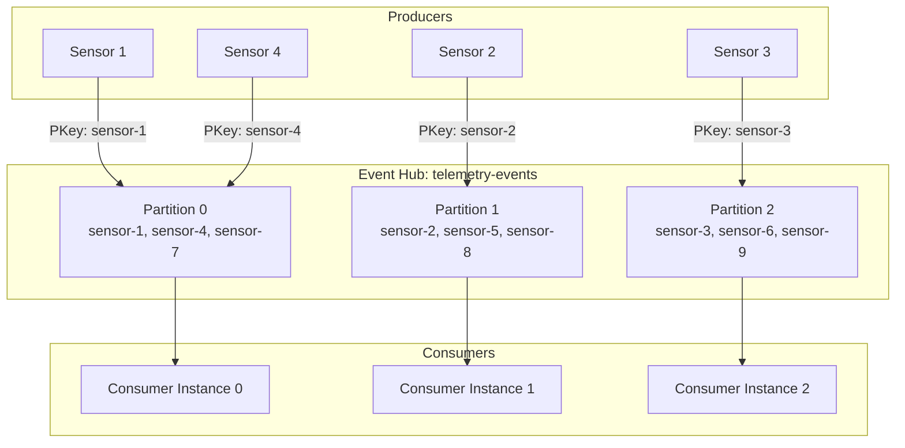
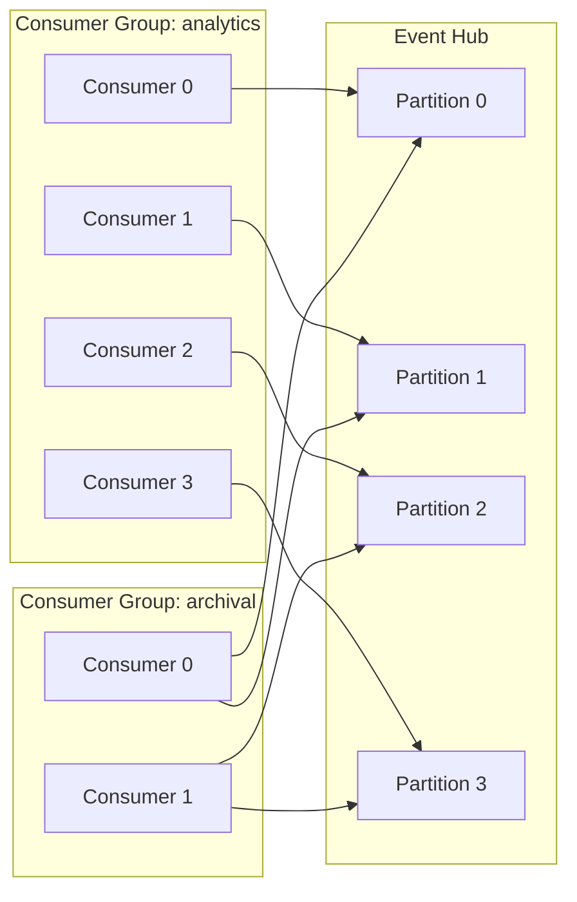

# 🌊 Event Streaming Basics

> __🏠 [Home](../../../../README.md)__ | __📖 [Overview](../../../01-overview/README.md)__ | __🛠️ [Services](../../README.md)__ | __🔄 [Streaming Services](../README.md)__ | __📨 [Event Hubs](README.md)__ | __🌊 Event Streaming Basics__


Fundamental concepts and patterns for event streaming with Azure Event Hubs.

---

## 🎯 What is Event Streaming?

Event streaming is the practice of capturing data in real-time from event sources like databases, sensors, mobile devices, cloud services, and software applications as streams of events; storing these event streams durably for later retrieval; manipulating, processing, and reacting to the event streams in real-time as well as retrospectively.

### Key Characteristics

- __Continuous__: Events flow continuously, not in discrete batches
- __Ordered__: Events maintain order within partitions
- __Immutable__: Once written, events cannot be modified
- __Persistent__: Events are durably stored for configured retention period
- __Scalable__: System scales horizontally to handle increasing load

---

## 🏗️ Core Components

### Producers

Producers (also called publishers) are applications that send events to Event Hubs.

```python
from azure.eventhub import EventHubProducerClient, EventData
import os
import json
from datetime import datetime

class EventProducer:
    def __init__(self, connection_string, eventhub_name):
        self.producer = EventHubProducerClient.from_connection_string(
            conn_str=connection_string,
            eventhub_name=eventhub_name
        )

    def send_single_event(self, event_data):
        """Send a single event."""
        event = EventData(json.dumps(event_data))
        self.producer.send_event(event)

    def send_batch_events(self, events_list):
        """Send events in batches for better throughput."""
        event_batch = self.producer.create_batch()

        for event_data in events_list:
            try:
                event_batch.add(EventData(json.dumps(event_data)))
            except ValueError:
                # Batch is full, send it and create new one
                self.producer.send_batch(event_batch)
                event_batch = self.producer.create_batch()
                event_batch.add(EventData(json.dumps(event_data)))

        # Send remaining events
        if len(event_batch) > 0:
            self.producer.send_batch(event_batch)

    def close(self):
        self.producer.close()

# Usage example
if __name__ == "__main__":
    producer = EventProducer(
        connection_string=os.getenv("EVENTHUB_CONNECTION_STRING"),
        eventhub_name="telemetry-events"
    )

    # Send single event
    producer.send_single_event({
        "sensor_id": "sensor-001",
        "temperature": 23.5,
        "timestamp": datetime.utcnow().isoformat()
    })

    # Send batch of events
    events = [
        {"sensor_id": f"sensor-{i}", "temperature": 20 + i, "timestamp": datetime.utcnow().isoformat()}
        for i in range(100)
    ]
    producer.send_batch_events(events)

    producer.close()
```

### Consumers

Consumers (also called subscribers) read events from Event Hubs.

```python
from azure.eventhub import EventHubConsumerClient
from azure.eventhub.extensions.checkpointstoreblobaio import BlobCheckpointStore
import os

class EventConsumer:
    def __init__(self, connection_string, eventhub_name, consumer_group, checkpoint_store):
        self.consumer = EventHubConsumerClient.from_connection_string(
            conn_str=connection_string,
            consumer_group=consumer_group,
            eventhub_name=eventhub_name,
            checkpoint_store=checkpoint_store
        )

    def on_event(self, partition_context, event):
        """Process individual event."""
        print(f"Partition {partition_context.partition_id}: {event.body_as_str()}")

        # Update checkpoint every 10 events
        if partition_context.offset % 10 == 0:
            partition_context.update_checkpoint(event)

    def on_partition_initialize(self, partition_context):
        """Called when partition processing starts."""
        print(f"Partition {partition_context.partition_id} initialized")

    def on_partition_close(self, partition_context, reason):
        """Called when partition processing stops."""
        print(f"Partition {partition_context.partition_id} closed: {reason}")

    def on_error(self, partition_context, error):
        """Handle errors during processing."""
        print(f"Error on partition {partition_context.partition_id}: {error}")

    def receive_events(self):
        """Start receiving events."""
        with self.consumer:
            self.consumer.receive(
                on_event=self.on_event,
                on_partition_initialize=self.on_partition_initialize,
                on_partition_close=self.on_partition_close,
                on_error=self.on_error,
                starting_position="-1"  # Start from beginning
            )

# Usage example with checkpoint store
if __name__ == "__main__":
    # Create checkpoint store for tracking consumer progress
    checkpoint_store = BlobCheckpointStore.from_connection_string(
        conn_str=os.getenv("STORAGE_CONNECTION_STRING"),
        container_name="eventhub-checkpoints"
    )

    consumer = EventConsumer(
        connection_string=os.getenv("EVENTHUB_CONNECTION_STRING"),
        eventhub_name="telemetry-events",
        consumer_group="$Default",
        checkpoint_store=checkpoint_store
    )

    consumer.receive_events()
```

### Partitions

Partitions enable parallel processing and ordering guarantees.



__Partition Key Strategy__:

```python
# Send events with partition key for ordering
from azure.eventhub import EventHubProducerClient, EventData

producer = EventHubProducerClient.from_connection_string(
    conn_str="your_connection_string",
    eventhub_name="your_eventhub"
)

# All events from same sensor go to same partition
sensor_id = "sensor-123"
event_data = EventData("Temperature: 23.5°C")

# Option 1: Use partition key (recommended for ordering)
producer.send_event(event_data, partition_key=sensor_id)

# Option 2: Specify partition ID directly (less flexible)
producer.send_event(event_data, partition_id="0")

# Option 3: Let Event Hubs distribute (best for throughput)
producer.send_event(event_data)
```

---

## 🎯 Event Streaming Patterns

### Pattern 1: Fire and Forget

Producer sends events without waiting for acknowledgment.

```python
# Fast but no delivery guarantee
producer.send_event(EventData("sensor reading"))
# Continue immediately
```

__Use Cases__: High-volume telemetry, logging where occasional loss is acceptable

### Pattern 2: Synchronous Send with Batching

Producer sends events in batches and waits for acknowledgment.

```python
def send_with_batching(producer, events, batch_size=100):
    """Send events in controlled batches."""
    batch = producer.create_batch()
    sent_count = 0

    for event_data in events:
        try:
            batch.add(EventData(json.dumps(event_data)))
        except ValueError:
            # Batch full, send it
            producer.send_batch(batch)
            sent_count += len(batch)
            print(f"Sent batch: {len(batch)} events")

            # Create new batch
            batch = producer.create_batch()
            batch.add(EventData(json.dumps(event_data)))

    # Send remaining
    if len(batch) > 0:
        producer.send_batch(batch)
        sent_count += len(batch)

    return sent_count
```

__Use Cases__: Transactional data, financial records, critical events

### Pattern 3: Competing Consumers

Multiple consumer instances process events in parallel from different partitions.



### Pattern 4: Event Time vs Processing Time

Handle late-arriving events with watermarks and windowing.

```python
from datetime import datetime, timedelta
import json

def process_event_with_watermark(event, watermark_delay_minutes=5):
    """Process events considering event time vs processing time."""
    event_data = json.loads(event.body_as_str())

    # Parse event timestamp
    event_time = datetime.fromisoformat(event_data["timestamp"])
    processing_time = datetime.utcnow()

    # Calculate watermark (allow 5 minutes late)
    watermark = processing_time - timedelta(minutes=watermark_delay_minutes)

    if event_time < watermark:
        print(f"Late event detected: {event_time} (watermark: {watermark})")
        # Handle late event (dead letter, separate processing, etc.)
        return "late"
    else:
        # Process normally
        return "on_time"
```

---

## 🔄 Consumer Patterns

### Single Consumer with Checkpointing

```python
from azure.eventhub import EventHubConsumerClient
from azure.eventhub.extensions.checkpointstoreblobaio import BlobCheckpointStore

def on_event_batch(partition_context, events):
    """Process events in batches with checkpointing."""
    for event in events:
        # Process event
        process_telemetry_data(event.body_as_str())

    # Checkpoint after processing all events in batch
    partition_context.update_checkpoint()

# Setup consumer with checkpoint store
checkpoint_store = BlobCheckpointStore.from_connection_string(
    conn_str=storage_connection_string,
    container_name="checkpoints"
)

consumer = EventHubConsumerClient.from_connection_string(
    conn_str=eventhub_connection_string,
    consumer_group="$Default",
    eventhub_name="telemetry",
    checkpoint_store=checkpoint_store
)

with consumer:
    consumer.receive_batch(on_event_batch=on_event_batch)
```

### Multiple Consumers with Consumer Groups

```python
# Consumer Group 1: Real-time analytics
analytics_consumer = EventHubConsumerClient.from_connection_string(
    conn_str=connection_string,
    consumer_group="analytics-team",
    eventhub_name="telemetry"
)

# Consumer Group 2: Data archival
archival_consumer = EventHubConsumerClient.from_connection_string(
    conn_str=connection_string,
    consumer_group="archival-team",
    eventhub_name="telemetry"
)

# Both read same events independently
```

### Event Processing with Error Handling

```python
import logging
from tenacity import retry, stop_after_attempt, wait_exponential

logger = logging.getLogger(__name__)

@retry(
    stop=stop_after_attempt(3),
    wait=wait_exponential(multiplier=1, min=2, max=10)
)
def process_event_with_retry(event_data):
    """Process event with automatic retry on failure."""
    try:
        # Parse and validate
        data = json.loads(event_data)

        # Business logic
        result = analyze_sensor_data(data)

        # Store result
        store_analysis_result(result)

        return True
    except json.JSONDecodeError as e:
        logger.error(f"Invalid JSON: {e}")
        # Don't retry for invalid data
        raise ValueError("Invalid event format") from e
    except Exception as e:
        logger.error(f"Processing failed: {e}")
        # Retry for transient failures
        raise

def on_event_with_error_handling(partition_context, event):
    """Event handler with robust error handling."""
    try:
        process_event_with_retry(event.body_as_str())

        # Checkpoint on success
        partition_context.update_checkpoint(event)
    except ValueError:
        # Invalid data - move to dead letter queue
        send_to_dead_letter(event)
    except Exception as e:
        # Unrecoverable error
        logger.error(f"Failed to process event: {e}")
        # Skip this event and continue
```

---

## 📊 Throughput and Scaling

### Understanding Throughput Units

```python
def calculate_throughput_requirements(events_per_second, avg_event_size_kb):
    """Calculate required throughput units."""
    # Standard tier limits per TU
    INGRESS_MB_PER_TU = 1
    INGRESS_EVENTS_PER_TU = 1000

    # Calculate based on size
    total_mb_per_sec = (events_per_second * avg_event_size_kb) / 1024
    tus_by_size = total_mb_per_sec / INGRESS_MB_PER_TU

    # Calculate based on count
    tus_by_count = events_per_second / INGRESS_EVENTS_PER_TU

    # Take the maximum
    required_tus = max(tus_by_size, tus_by_count)

    return {
        "required_tus": int(required_tus) + 1,  # Round up
        "tus_by_size": tus_by_size,
        "tus_by_count": tus_by_count,
        "recommendation": "Consider auto-inflate for variable loads"
    }

# Example calculation
result = calculate_throughput_requirements(
    events_per_second=5000,
    avg_event_size_kb=2
)
print(f"Required TUs: {result['required_tus']}")
```

### Partition Count Strategy

```python
def recommend_partition_count(
    expected_events_per_sec,
    consumer_instances,
    growth_factor=2
):
    """Recommend partition count based on workload."""
    # Rule of thumb: 1 partition per 1-2 MB/sec throughput
    # Or: Match consumer instance count for parallel processing

    min_partitions = max(
        consumer_instances,
        int(expected_events_per_sec / 1000)  # ~1000 events/sec per partition
    )

    # Account for growth
    recommended = min_partitions * growth_factor

    # Event Hubs limits
    if recommended > 32:
        return {
            "recommended": 32,
            "note": "Standard tier max is 32. Consider Premium for up to 100."
        }

    return {
        "recommended": recommended,
        "min_partitions": min_partitions,
        "consumer_instances": consumer_instances
    }
```

---

## 🔒 Security Best Practices

### Using Managed Identity

```python
from azure.eventhub import EventHubProducerClient
from azure.identity import DefaultAzureCredential

# Use managed identity instead of connection string
credential = DefaultAzureCredential()

producer = EventHubProducerClient(
    fully_qualified_namespace="eventhub-namespace.servicebus.windows.net",
    eventhub_name="telemetry-events",
    credential=credential
)

# Send event
producer.send_event(EventData("secure event"))
producer.close()
```

### Shared Access Signatures (SAS)

```python
from azure.eventhub import EventHubProducerClient
from datetime import datetime, timedelta

# Generate SAS token with specific permissions and expiry
def generate_sas_token(namespace, eventhub, key_name, key_value, expiry_hours=24):
    """Generate time-limited SAS token."""
    from urllib.parse import quote_plus
    import hmac
    import hashlib
    import base64
    import time

    uri = f"sb://{namespace}.servicebus.windows.net/{eventhub}"
    encoded_uri = quote_plus(uri)

    expiry = int(time.time() + (expiry_hours * 3600))
    string_to_sign = f"{encoded_uri}\n{expiry}"

    signature = base64.b64encode(
        hmac.new(
            key_value.encode('utf-8'),
            string_to_sign.encode('utf-8'),
            hashlib.sha256
        ).digest()
    )

    token = f"SharedAccessSignature sr={encoded_uri}&sig={quote_plus(signature)}&se={expiry}&skn={key_name}"
    return token

# Use SAS token
sas_token = generate_sas_token(
    namespace="eventhub-namespace",
    eventhub="telemetry-events",
    key_name="SendPolicy",
    key_value="your-key-value",
    expiry_hours=2  # Short-lived token
)
```

---

## 📈 Monitoring and Observability

### Track Producer Metrics

```python
import time
from collections import defaultdict

class InstrumentedProducer:
    def __init__(self, producer):
        self.producer = producer
        self.metrics = defaultdict(int)
        self.start_time = time.time()

    def send_event(self, event_data):
        """Send event and track metrics."""
        start = time.time()
        try:
            self.producer.send_event(event_data)
            self.metrics["events_sent"] += 1
            self.metrics["total_latency_ms"] += (time.time() - start) * 1000
        except Exception as e:
            self.metrics["send_errors"] += 1
            raise

    def get_metrics(self):
        """Get producer performance metrics."""
        elapsed = time.time() - self.start_time
        events_sent = self.metrics["events_sent"]

        return {
            "events_sent": events_sent,
            "errors": self.metrics["send_errors"],
            "avg_latency_ms": (
                self.metrics["total_latency_ms"] / events_sent
                if events_sent > 0 else 0
            ),
            "events_per_second": events_sent / elapsed if elapsed > 0 else 0
        }
```

### Monitor Consumer Lag

```python
from azure.eventhub import EventHubConsumerClient

def calculate_consumer_lag(partition_context, event):
    """Calculate how far behind consumer is from producer."""
    # Compare event sequence number with partition's last sequence
    lag = partition_context.last_enqueued_sequence_number - event.sequence_number

    if lag > 1000:
        print(f"⚠️ High consumer lag detected: {lag} events behind")

    return lag
```

---

## 🔗 Related Resources

### Integration Guides

- [__Kafka Compatibility__](kafka-compatibility.md) - Using Event Hubs with Kafka protocol
- [__Capture to Storage__](capture-to-storage.md) - Automatic event archival
- [__Schema Registry__](schema-registry.md) - Schema validation and evolution

### Best Practices

- [__Performance Tuning__](../../../05-best-practices/cross-cutting-concerns/performance/eventhub-optimization.md)
- [__Security Configuration__](../../../05-best-practices/cross-cutting-concerns/security/eventhub-security.md)
- [__Disaster Recovery__](../../../05-best-practices/operational-excellence/eventhub-dr.md)

### Code Examples

- [__Python SDK Examples__](../../../06-code-examples/by-service/event-hubs/python-examples.md)
- [__C# SDK Examples__](../../../06-code-examples/by-service/event-hubs/dotnet-examples.md)
- [__Integration Scenarios__](../../../06-code-examples/integration-examples/eventhub-patterns.md)

---

*Last Updated: 2025-01-28*
*Complexity: Beginner*
*Estimated Reading Time: 25 minutes*
