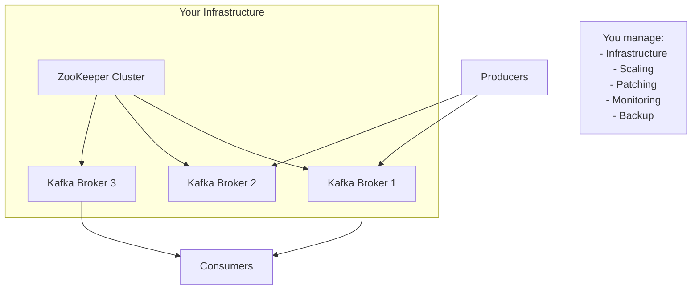
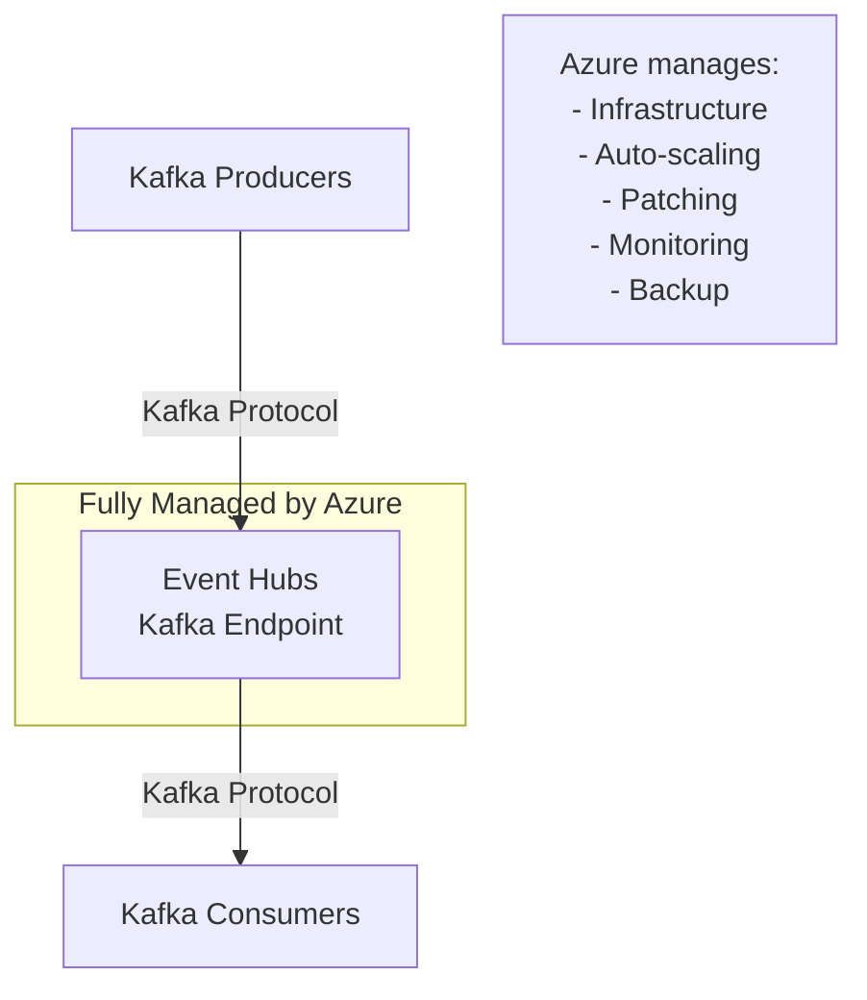
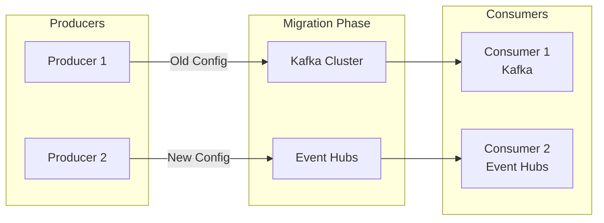

# 🔄 Kafka Compatibility

> __🏠 [Home](../../../../README.md)__ | __📖 [Overview](../../../01-overview/README.md)__ | __🛠️ [Services](../../README.md)__ | __🔄 [Streaming Services](../README.md)__ | __📨 [Event Hubs](README.md)__ | __🔄 Kafka Compatibility__


Use Azure Event Hubs as a drop-in replacement for Apache Kafka with native protocol support.

---

## 🎯 Overview

Azure Event Hubs provides a Kafka endpoint that enables you to use your existing Kafka-based applications without code changes. Simply update your connection configuration to point to Event Hubs instead of your Kafka cluster.

### Key Benefits

- __Zero Code Changes__: Use existing Kafka applications as-is
- __Managed Service__: No cluster management, patching, or scaling
- __Cost Effective__: Pay for throughput, not cluster nodes
- __Azure Integration__: Native connectivity with Azure services
- __Global Scale__: Multi-region replication and geo-disaster recovery

### Supported Kafka Versions

- Kafka 1.0 and above
- Kafka 2.0 and above (recommended)
- Kafka 3.0 and above

---

## 🏗️ Architecture Comparison

### Traditional Kafka Deployment



### Event Hubs with Kafka Protocol



---

## 🚀 Migration Guide

### Step 1: Update Connection Configuration

__Before (Kafka)__:

```properties
# Kafka configuration
bootstrap.servers=kafka-broker1:9092,kafka-broker2:9092
security.protocol=PLAINTEXT
```

__After (Event Hubs)__:

```properties
# Event Hubs configuration
bootstrap.servers=mynamespace.servicebus.windows.net:9093
security.protocol=SASL_SSL
sasl.mechanism=PLAIN
sasl.jaas.config=org.apache.kafka.common.security.plain.PlainLoginModule required \
    username="$ConnectionString" \
    password="Endpoint=sb://mynamespace.servicebus.windows.net/;SharedAccessKeyName=RootManageSharedAccessKey;SharedAccessKey=YOUR_KEY";
```

### Step 2: Test Your Application

```bash
# No code changes needed - just update configuration
java -jar your-kafka-app.jar --config eventhubs-config.properties
```

---

## 🔧 Configuration Examples

### Java Producer

```java
import org.apache.kafka.clients.producer.*;
import java.util.Properties;

public class EventHubsKafkaProducer {
    public static void main(String[] args) {
        Properties props = new Properties();

        // Event Hubs connection
        props.put(ProducerConfig.BOOTSTRAP_SERVERS_CONFIG,
                "mynamespace.servicebus.windows.net:9093");
        props.put("security.protocol", "SASL_SSL");
        props.put("sasl.mechanism", "PLAIN");
        props.put("sasl.jaas.config",
                "org.apache.kafka.common.security.plain.PlainLoginModule required " +
                "username=\"$ConnectionString\" " +
                "password=\"Endpoint=sb://mynamespace.servicebus.windows.net/;SharedAccessKeyName=RootManageSharedAccessKey;SharedAccessKey=YOUR_KEY\";");

        // Serialization
        props.put(ProducerConfig.KEY_SERIALIZER_CLASS_CONFIG,
                "org.apache.kafka.common.serialization.StringSerializer");
        props.put(ProducerConfig.VALUE_SERIALIZER_CLASS_CONFIG,
                "org.apache.kafka.common.serialization.StringSerializer");

        // Create producer
        KafkaProducer<String, String> producer = new KafkaProducer<>(props);

        // Send messages
        for (int i = 0; i < 100; i++) {
            ProducerRecord<String, String> record =
                new ProducerRecord<>("test-topic", "key-" + i, "value-" + i);

            producer.send(record, (metadata, exception) -> {
                if (exception != null) {
                    exception.printStackTrace();
                } else {
                    System.out.printf("Sent to partition %d with offset %d%n",
                        metadata.partition(), metadata.offset());
                }
            });
        }

        producer.close();
    }
}
```

### Java Consumer

```java
import org.apache.kafka.clients.consumer.*;
import java.time.Duration;
import java.util.Arrays;
import java.util.Properties;

public class EventHubsKafkaConsumer {
    public static void main(String[] args) {
        Properties props = new Properties();

        // Event Hubs connection
        props.put(ConsumerConfig.BOOTSTRAP_SERVERS_CONFIG,
                "mynamespace.servicebus.windows.net:9093");
        props.put("security.protocol", "SASL_SSL");
        props.put("sasl.mechanism", "PLAIN");
        props.put("sasl.jaas.config",
                "org.apache.kafka.common.security.plain.PlainLoginModule required " +
                "username=\"$ConnectionString\" " +
                "password=\"Endpoint=sb://mynamespace.servicebus.windows.net/;SharedAccessKeyName=RootManageSharedAccessKey;SharedAccessKey=YOUR_KEY\";");

        // Consumer configuration
        props.put(ConsumerConfig.GROUP_ID_CONFIG, "my-consumer-group");
        props.put(ConsumerConfig.AUTO_OFFSET_RESET_CONFIG, "earliest");
        props.put(ConsumerConfig.KEY_DESERIALIZER_CLASS_CONFIG,
                "org.apache.kafka.common.serialization.StringDeserializer");
        props.put(ConsumerConfig.VALUE_DESERIALIZER_CLASS_CONFIG,
                "org.apache.kafka.common.serialization.StringDeserializer");

        // Create consumer
        KafkaConsumer<String, String> consumer = new KafkaConsumer<>(props);
        consumer.subscribe(Arrays.asList("test-topic"));

        // Poll for messages
        try {
            while (true) {
                ConsumerRecords<String, String> records =
                    consumer.poll(Duration.ofMillis(1000));

                for (ConsumerRecord<String, String> record : records) {
                    System.out.printf("offset = %d, key = %s, value = %s%n",
                        record.offset(), record.key(), record.value());
                }
            }
        } finally {
            consumer.close();
        }
    }
}
```

### Python Producer (kafka-python)

```python
from kafka import KafkaProducer
import json

# Event Hubs configuration
producer = KafkaProducer(
    bootstrap_servers='mynamespace.servicebus.windows.net:9093',
    security_protocol='SASL_SSL',
    sasl_mechanism='PLAIN',
    sasl_plain_username='$ConnectionString',
    sasl_plain_password='Endpoint=sb://mynamespace.servicebus.windows.net/;SharedAccessKeyName=RootManageSharedAccessKey;SharedAccessKey=YOUR_KEY',
    value_serializer=lambda v: json.dumps(v).encode('utf-8')
)

# Send messages
for i in range(100):
    data = {'sensor_id': f'sensor-{i}', 'temperature': 20 + i}
    future = producer.send('test-topic', value=data)

    # Wait for send to complete
    try:
        record_metadata = future.get(timeout=10)
        print(f'Sent to partition {record_metadata.partition} at offset {record_metadata.offset}')
    except Exception as e:
        print(f'Error sending message: {e}')

producer.close()
```

### Python Consumer (kafka-python)

```python
from kafka import KafkaConsumer
import json

# Event Hubs configuration
consumer = KafkaConsumer(
    'test-topic',
    bootstrap_servers='mynamespace.servicebus.windows.net:9093',
    security_protocol='SASL_SSL',
    sasl_mechanism='PLAIN',
    sasl_plain_username='$ConnectionString',
    sasl_plain_password='Endpoint=sb://mynamespace.servicebus.windows.net/;SharedAccessKeyName=RootManageSharedAccessKey;SharedAccessKey=YOUR_KEY',
    auto_offset_reset='earliest',
    group_id='my-consumer-group',
    value_deserializer=lambda m: json.loads(m.decode('utf-8'))
)

# Process messages
for message in consumer:
    print(f'Partition: {message.partition}, Offset: {message.offset}')
    print(f'Key: {message.key}, Value: {message.value}')
```

---

## 🔄 Concept Mapping

### Kafka → Event Hubs Terminology

| Kafka Concept | Event Hubs Equivalent | Notes |
|---------------|----------------------|-------|
| Kafka Cluster | Event Hubs Namespace | Logical container |
| Topic | Event Hub | Data stream |
| Partition | Partition | Same concept |
| Consumer Group | Consumer Group | Same concept |
| Broker | Managed by Azure | No direct equivalent |
| Offset | Offset | Same concept |
| Producer | Producer/Publisher | Same concept |
| Consumer | Consumer/Subscriber | Same concept |

### Configuration Mapping

| Kafka Setting | Event Hubs Setting | Value |
|--------------|-------------------|-------|
| `bootstrap.servers` | `bootstrap.servers` | `<namespace>.servicebus.windows.net:9093` |
| `security.protocol` | `security.protocol` | `SASL_SSL` |
| N/A | `sasl.mechanism` | `PLAIN` |
| N/A | `sasl.jaas.config` | Connection string |

---

## ⚙️ Feature Comparison

### Supported Features

| Feature | Kafka | Event Hubs | Notes |
|---------|-------|------------|-------|
| __Producer API__ | ✅ | ✅ | Full compatibility |
| __Consumer API__ | ✅ | ✅ | Full compatibility |
| __Consumer Groups__ | ✅ | ✅ | Full compatibility |
| __Transactions__ | ✅ | ✅ | Supported in Premium tier |
| __Compression__ | ✅ | ✅ | GZIP, Snappy, LZ4 |
| __Idempotent Producer__ | ✅ | ✅ | Supported |
| __Exactly Once Semantics__ | ✅ | ✅ | With transactions |

### Differences and Limitations

| Feature | Kafka | Event Hubs | Workaround |
|---------|-------|------------|------------|
| __Topic Creation__ | Dynamic | Pre-created | Use Azure Portal/CLI |
| __Partition Count Change__ | Supported | Fixed at creation | Plan ahead |
| __Log Compaction__ | ✅ | ❌ | Use Azure Storage |
| __Kafka Streams__ | ✅ | ❌ | Use Stream Analytics |
| __Kafka Connect__ | ✅ | Limited | Use Azure Data Factory |
| __Admin APIs__ | Full | Limited | Use Azure APIs |

---

## 🎯 Migration Scenarios

### Scenario 1: Lift and Shift

__Goal__: Migrate existing Kafka applications with minimal changes

```bash
# Step 1: Create Event Hubs namespace with Kafka enabled
az eventhubs namespace create \
  --name kafka-migration-ns \
  --resource-group rg-migration \
  --location eastus \
  --sku Standard \
  --enable-kafka true

# Step 2: Create Event Hubs (topics)
az eventhubs eventhub create \
  --name orders-topic \
  --namespace-name kafka-migration-ns \
  --resource-group rg-migration \
  --partition-count 8 \
  --message-retention 7

# Step 3: Update application configuration
# Replace kafka-broker:9092 with kafka-migration-ns.servicebus.windows.net:9093
# Add SASL_SSL configuration

# Step 4: Test and deploy
```

### Scenario 2: Hybrid Architecture

Run Kafka and Event Hubs in parallel during migration.



### Scenario 3: Kafka Connect to Azure Data Factory

Replace Kafka Connect with Azure Data Factory connectors.

```json
{
  "name": "CopyFromSQLToEventHub",
  "type": "Copy",
  "inputs": [
    {
      "referenceName": "SqlServerDataset",
      "type": "DatasetReference"
    }
  ],
  "outputs": [
    {
      "referenceName": "EventHubDataset",
      "type": "DatasetReference"
    }
  ],
  "typeProperties": {
    "source": {
      "type": "SqlSource"
    },
    "sink": {
      "type": "EventHubSink"
    }
  }
}
```

---

## 🔒 Security Configuration

### Using Connection Strings

```properties
# Standard connection string authentication
sasl.jaas.config=org.apache.kafka.common.security.plain.PlainLoginModule required \
    username="$ConnectionString" \
    password="Endpoint=sb://mynamespace.servicebus.windows.net/;SharedAccessKeyName=RootManageSharedAccessKey;SharedAccessKey=YOUR_KEY";
```

### Using Azure Active Directory (OAuth)

```properties
# AAD authentication (Premium tier)
security.protocol=SASL_SSL
sasl.mechanism=OAUTHBEARER
sasl.jaas.config=org.apache.kafka.common.security.oauthbearer.OAuthBearerLoginModule required;
sasl.login.callback.handler.class=CustomAuthCallbackHandler
```

### Network Security

```bash
# Enable private endpoint for Kafka traffic
az network private-endpoint create \
  --name eventhub-kafka-pe \
  --resource-group rg-migration \
  --vnet-name my-vnet \
  --subnet default \
  --private-connection-resource-id $(az eventhubs namespace show \
    --name kafka-migration-ns \
    --resource-group rg-migration \
    --query id -o tsv) \
  --group-id namespace \
  --connection-name kafka-pe-connection
```

---

## 📊 Performance Optimization

### Producer Optimization

```java
// Optimize for throughput
props.put(ProducerConfig.BATCH_SIZE_CONFIG, 16384);
props.put(ProducerConfig.LINGER_MS_CONFIG, 10);
props.put(ProducerConfig.COMPRESSION_TYPE_CONFIG, "snappy");
props.put(ProducerConfig.BUFFER_MEMORY_CONFIG, 33554432);
props.put(ProducerConfig.ACKS_CONFIG, "1");  // Balance between durability and latency
```

### Consumer Optimization

```java
// Optimize for throughput
props.put(ConsumerConfig.FETCH_MIN_BYTES_CONFIG, 1024);
props.put(ConsumerConfig.FETCH_MAX_WAIT_MS_CONFIG, 500);
props.put(ConsumerConfig.MAX_PARTITION_FETCH_BYTES_CONFIG, 1048576);
props.put(ConsumerConfig.MAX_POLL_RECORDS_CONFIG, 500);
```

### Partition Strategy

```python
# Use partition key for related events
def partition_key_strategy(event):
    """Route related events to same partition."""
    # All events from same user go to same partition
    return event['user_id']

# Send with partition key
producer.send(
    'user-events',
    value=event_data,
    key=partition_key_strategy(event_data)
)
```

---

## 🧪 Testing Compatibility

### Test Script (Python)

```python
import os
from kafka import KafkaProducer, KafkaConsumer
import json
import time

def test_eventhubs_kafka_compatibility():
    """Test Event Hubs Kafka compatibility."""
    connection_string = os.getenv('EVENTHUB_CONNECTION_STRING')
    namespace = connection_string.split(';')[0].split('//')[1]

    # Configuration
    config = {
        'bootstrap_servers': f'{namespace}:9093',
        'security_protocol': 'SASL_SSL',
        'sasl_mechanism': 'PLAIN',
        'sasl_plain_username': '$ConnectionString',
        'sasl_plain_password': connection_string
    }

    # Test Producer
    print("Testing producer...")
    producer = KafkaProducer(
        **config,
        value_serializer=lambda v: json.dumps(v).encode('utf-8')
    )

    test_message = {
        'test_id': 'kafka-compatibility-test',
        'timestamp': time.time()
    }

    future = producer.send('test-topic', value=test_message)
    result = future.get(timeout=10)
    print(f"✅ Producer test passed: partition {result.partition}, offset {result.offset}")
    producer.close()

    # Test Consumer
    print("\nTesting consumer...")
    consumer = KafkaConsumer(
        'test-topic',
        **config,
        auto_offset_reset='earliest',
        group_id='test-group',
        value_deserializer=lambda m: json.loads(m.decode('utf-8'))
    )

    messages_received = 0
    for message in consumer:
        print(f"✅ Consumer test passed: received message {message.value}")
        messages_received += 1
        if messages_received >= 1:
            break

    consumer.close()
    print("\n✅ All compatibility tests passed!")

if __name__ == "__main__":
    test_eventhubs_kafka_compatibility()
```

---

## 🔗 Related Resources

### Documentation

- [__Event Streaming Basics__](event-streaming-basics.md) - Core streaming concepts
- [__Capture to Storage__](capture-to-storage.md) - Data archival patterns
- [__Schema Registry__](schema-registry.md) - Schema management

### Best Practices

- [__Migration Strategies__](../../../05-best-practices/migration/kafka-to-eventhubs.md)
- [__Performance Tuning__](../../../05-best-practices/cross-cutting-concerns/performance/kafka-eventhubs-optimization.md)
- [__Security Hardening__](../../../05-best-practices/cross-cutting-concerns/security/kafka-security.md)

### External Resources

- [Apache Kafka Documentation](https://kafka.apache.org/documentation/)
- [Event Hubs for Kafka](https://docs.microsoft.com/azure/event-hubs/event-hubs-for-kafka-ecosystem-overview)
- [Kafka Protocol Guide](https://kafka.apache.org/protocol)

---

*Last Updated: 2025-01-28*
*Kafka Protocol Support: 1.0+*
*Documentation Status: Complete*
