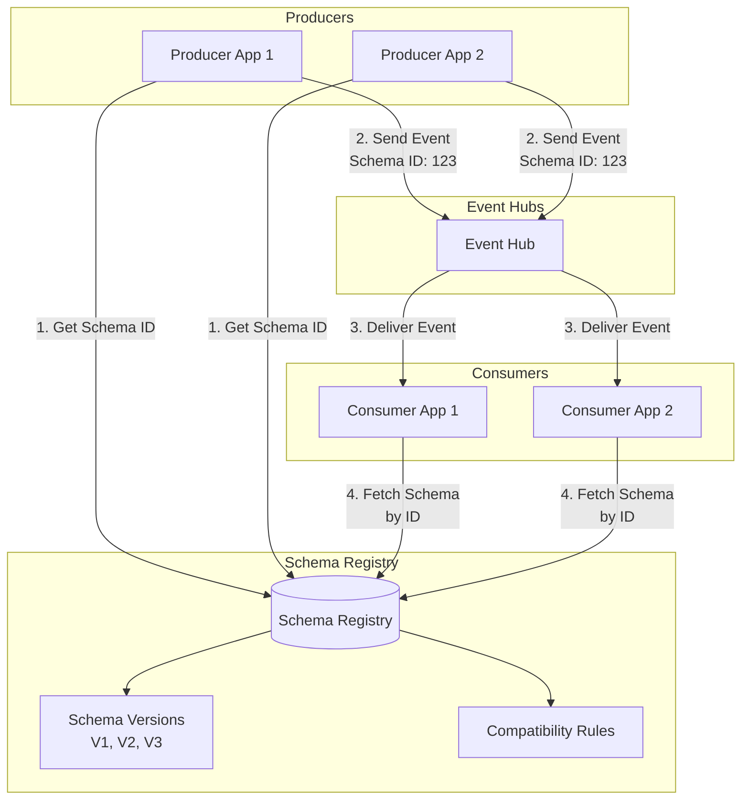

# 📋 Schema Registry

> __🏠 [Home](../../../../README.md)__ | __📖 [Overview](../../../01-overview/README.md)__ | __🛠️ [Services](../../README.md)__ | __🔄 [Streaming Services](../README.md)__ | __📨 [Event Hubs](README.md)__ | __📋 Schema Registry__


Centralized schema management for Event Hubs with validation, versioning, and compatibility rules.

---

## 🎯 Overview

Azure Schema Registry provides a centralized repository for managing schemas used in Event Hubs. It ensures data quality, enables schema evolution, and supports compatibility checking across producers and consumers.

### Key Benefits

- __Schema Validation__: Automatic validation of events against schemas
- __Version Control__: Track schema changes over time
- __Compatibility Checking__: Enforce compatibility rules for schema evolution
- __Reduced Payload Size__: Send schema ID instead of full schema
- __Data Governance__: Central control over data contracts

### Supported Formats

- **Avro**: Primary format with rich schema evolution support
- **JSON Schema**: In preview
- **Protobuf**: Planned

---

## 🏗️ Architecture



---

## 🚀 Getting Started

### Create Schema Registry

```bash
# Schema Registry is automatically created with Event Hubs namespace
# Standard and Premium tiers include Schema Registry

# Create Event Hubs namespace
az eventhubs namespace create \
  --name mynamespace \
  --resource-group rg-eventhubs \
  --location eastus \
  --sku Standard

# Schema Registry is available at:
# https://mynamespace.servicebus.windows.net/$schemaregistry
```

### Register a Schema

```python
from azure.schemaregistry import SchemaRegistryClient
from azure.identity import DefaultAzureCredential

# Initialize Schema Registry client
credential = DefaultAzureCredential()
schema_registry_client = SchemaRegistryClient(
    fully_qualified_namespace="mynamespace.servicebus.windows.net",
    credential=credential
)

# Define Avro schema
schema_definition = """{
    "type": "record",
    "name": "SensorReading",
    "namespace": "com.example.sensors",
    "fields": [
        {"name": "sensor_id", "type": "string"},
        {"name": "temperature", "type": "double"},
        {"name": "humidity", "type": "double"},
        {"name": "timestamp", "type": "long", "logicalType": "timestamp-millis"}
    ]
}"""

# Register schema
schema_properties = schema_registry_client.register_schema(
    group_name="sensor-schemas",
    name="SensorReading",
    schema_definition=schema_definition,
    format="Avro"
)

print(f"Schema registered with ID: {schema_properties.id}")
print(f"Version: {schema_properties.version}")
```

---

## 📝 Schema Definition

### Avro Schema Example

```json
{
  "type": "record",
  "name": "UserActivity",
  "namespace": "com.example.events",
  "doc": "User activity event schema",
  "fields": [
    {
      "name": "user_id",
      "type": "string",
      "doc": "Unique user identifier"
    },
    {
      "name": "activity_type",
      "type": {
        "type": "enum",
        "name": "ActivityType",
        "symbols": ["LOGIN", "LOGOUT", "PAGE_VIEW", "PURCHASE"]
      },
      "doc": "Type of activity"
    },
    {
      "name": "timestamp",
      "type": "long",
      "logicalType": "timestamp-millis",
      "doc": "Event timestamp in milliseconds"
    },
    {
      "name": "metadata",
      "type": {
        "type": "map",
        "values": "string"
      },
      "default": {},
      "doc": "Additional metadata"
    },
    {
      "name": "session_id",
      "type": ["null", "string"],
      "default": null,
      "doc": "Optional session identifier"
    }
  ]
}
```

### Schema Groups

Organize related schemas into groups:

```python
# Create different schema groups for different domains
groups = [
    "sensor-schemas",      # IoT sensor data
    "user-events",         # User activity events
    "transaction-events",  # Financial transactions
    "audit-logs"          # System audit events
]

for group in groups:
    # Schemas are automatically grouped by the group_name parameter
    # during registration
    pass
```

---

## 🔄 Schema Evolution

### Compatibility Modes

```python
from azure.schemaregistry import SchemaRegistryClient

# Register schema with compatibility checking
schema_properties = schema_registry_client.register_schema(
    group_name="sensor-schemas",
    name="SensorReading",
    schema_definition=evolved_schema,
    format="Avro"
)
```

### Backward Compatibility

**Version 1** (Original):
```json
{
  "type": "record",
  "name": "SensorReading",
  "fields": [
    {"name": "sensor_id", "type": "string"},
    {"name": "temperature", "type": "double"}
  ]
}
```

**Version 2** (Backward Compatible):
```json
{
  "type": "record",
  "name": "SensorReading",
  "fields": [
    {"name": "sensor_id", "type": "string"},
    {"name": "temperature", "type": "double"},
    {"name": "humidity", "type": "double", "default": 0.0}
  ]
}
```

✅ **Old consumers can read new data** (ignores new humidity field)

### Forward Compatibility

**Version 1** (Original):
```json
{
  "type": "record",
  "name": "SensorReading",
  "fields": [
    {"name": "sensor_id", "type": "string"},
    {"name": "temperature", "type": "double"},
    {"name": "humidity", "type": "double", "default": 0.0}
  ]
}
```

**Version 2** (Forward Compatible):
```json
{
  "type": "record",
  "name": "SensorReading",
  "fields": [
    {"name": "sensor_id", "type": "string"},
    {"name": "temperature", "type": "double"}
  ]
}
```

✅ **New consumers can read old data** (humidity has default value)

### Full Compatibility

Schema is both backward and forward compatible.

---

## 💻 Producer Integration

### Serialize with Schema Registry

```python
from azure.schemaregistry import SchemaRegistryClient
from azure.schemaregistry.encoder.avroencoder import AvroEncoder
from azure.eventhub import EventHubProducerClient, EventData
from azure.identity import DefaultAzureCredential
import os

# Initialize clients
credential = DefaultAzureCredential()

schema_registry_client = SchemaRegistryClient(
    fully_qualified_namespace="mynamespace.servicebus.windows.net",
    credential=credential
)

# Create Avro encoder that integrates with Schema Registry
encoder = AvroEncoder(
    client=schema_registry_client,
    group_name="sensor-schemas",
    auto_register_schemas=True  # Automatically register new schemas
)

# Initialize Event Hub producer
producer = EventHubProducerClient(
    fully_qualified_namespace="mynamespace.servicebus.windows.net",
    eventhub_name="telemetry-events",
    credential=credential
)

# Create event data
event_data = {
    "sensor_id": "sensor-001",
    "temperature": 23.5,
    "humidity": 65.0,
    "timestamp": int(time.time() * 1000)
}

# Encode with schema
encoded_data = encoder.encode(
    content=event_data,
    schema="SensorReading"  # Schema name in registry
)

# Send to Event Hub
event = EventData(body=encoded_data)
producer.send_batch([event])
producer.close()
```

### Batch Encoding for Performance

```python
def send_events_with_schema(producer, encoder, events, schema_name):
    """Send multiple events with schema encoding."""
    event_batch = producer.create_batch()

    for event_data in events:
        # Encode with schema
        encoded_data = encoder.encode(
            content=event_data,
            schema=schema_name
        )

        # Add to batch
        try:
            event_batch.add(EventData(body=encoded_data))
        except ValueError:
            # Batch full, send it
            producer.send_batch(event_batch)
            event_batch = producer.create_batch()
            event_batch.add(EventData(body=encoded_data))

    # Send remaining
    if len(event_batch) > 0:
        producer.send_batch(event_batch)

# Usage
events = [
    {"sensor_id": f"sensor-{i}", "temperature": 20 + i, "humidity": 50 + i, "timestamp": int(time.time() * 1000)}
    for i in range(1000)
]

send_events_with_schema(producer, encoder, events, "SensorReading")
```

---

## 📥 Consumer Integration

### Deserialize with Schema Registry

```python
from azure.schemaregistry import SchemaRegistryClient
from azure.schemaregistry.encoder.avroencoder import AvroEncoder
from azure.eventhub import EventHubConsumerClient
from azure.identity import DefaultAzureCredential

# Initialize clients
credential = DefaultAzureCredential()

schema_registry_client = SchemaRegistryClient(
    fully_qualified_namespace="mynamespace.servicebus.windows.net",
    credential=credential
)

# Create decoder
decoder = AvroEncoder(
    client=schema_registry_client,
    group_name="sensor-schemas"
)

# Initialize Event Hub consumer
consumer = EventHubConsumerClient(
    fully_qualified_namespace="mynamespace.servicebus.windows.net",
    eventhub_name="telemetry-events",
    consumer_group="$Default",
    credential=credential
)

def on_event(partition_context, event):
    """Process received event."""
    # Decode event body using schema
    decoded_data = decoder.decode(event.body)

    print(f"Sensor ID: {decoded_data['sensor_id']}")
    print(f"Temperature: {decoded_data['temperature']}°C")
    print(f"Humidity: {decoded_data['humidity']}%")

    # Update checkpoint
    partition_context.update_checkpoint(event)

# Start consuming
with consumer:
    consumer.receive(on_event=on_event)
```

### Schema Caching

```python
from functools import lru_cache

class CachedSchemaRegistryClient:
    """Schema Registry client with caching."""

    def __init__(self, schema_registry_client):
        self.client = schema_registry_client

    @lru_cache(maxsize=128)
    def get_schema(self, schema_id):
        """Get schema with caching."""
        return self.client.get_schema(schema_id)

    @lru_cache(maxsize=128)
    def get_schema_properties(self, group_name, name):
        """Get schema properties with caching."""
        return self.client.get_schema_properties(
            group_name=group_name,
            name=name,
            format="Avro"
        )

# Usage
cached_client = CachedSchemaRegistryClient(schema_registry_client)
schema = cached_client.get_schema("schema-id-123")  # Cached on subsequent calls
```

---

## 🔍 Schema Management

### List Schemas

```python
from azure.schemaregistry import SchemaRegistryClient
from azure.identity import DefaultAzureCredential

credential = DefaultAzureCredential()
client = SchemaRegistryClient(
    fully_qualified_namespace="mynamespace.servicebus.windows.net",
    credential=credential
)

# Get schema by ID
schema = client.get_schema("schema-id-123")
print(f"Schema definition: {schema.definition}")

# Get schema properties by name
schema_properties = client.get_schema_properties(
    group_name="sensor-schemas",
    name="SensorReading",
    format="Avro"
)
print(f"Schema ID: {schema_properties.id}")
print(f"Version: {schema_properties.version}")
```

### Version Management

```python
def manage_schema_versions(client, group_name, schema_name):
    """Track and manage schema versions."""
    versions = []

    try:
        # Get current schema properties
        current = client.get_schema_properties(
            group_name=group_name,
            name=schema_name,
            format="Avro"
        )

        versions.append({
            "version": current.version,
            "schema_id": current.id,
            "timestamp": current.properties.get("created_time")
        })

        print(f"Current schema version: {current.version}")
        print(f"Schema ID: {current.id}")

    except Exception as e:
        print(f"Error retrieving schema: {e}")

    return versions
```

---

## 🎯 Best Practices

### Schema Design

1. **Use descriptive names and namespaces**
   ```json
   {
     "namespace": "com.company.domain.events",
     "name": "UserRegistrationEvent"
   }
   ```

2. **Add documentation**
   ```json
   {
     "name": "email",
     "type": "string",
     "doc": "User's email address (RFC 5322 compliant)"
   }
   ```

3. **Provide default values for optional fields**
   ```json
   {
     "name": "phone_number",
     "type": ["null", "string"],
     "default": null,
     "doc": "Optional phone number"
   }
   ```

4. **Use enums for fixed sets of values**
   ```json
   {
     "name": "status",
     "type": {
       "type": "enum",
       "name": "OrderStatus",
       "symbols": ["PENDING", "PROCESSING", "COMPLETED", "CANCELLED"]
     }
   }
   ```

### Schema Evolution Strategy

```python
class SchemaEvolutionStrategy:
    """Best practices for schema evolution."""

    @staticmethod
    def backward_compatible_change(schema):
        """Changes that allow old consumers to read new data."""
        return {
            "allowed": [
                "Add optional field with default value",
                "Delete field",
                "Add enum symbol (at end)"
            ],
            "example": {
                "name": "new_field",
                "type": "string",
                "default": ""
            }
        }

    @staticmethod
    def forward_compatible_change(schema):
        """Changes that allow new consumers to read old data."""
        return {
            "allowed": [
                "Delete optional field",
                "Add field"
            ],
            "example": "Remove optional field that new code doesn't use"
        }

    @staticmethod
    def breaking_change(schema):
        """Changes that break compatibility."""
        return {
            "avoid": [
                "Change field type",
                "Rename field",
                "Add required field without default",
                "Delete required field",
                "Reorder enum symbols"
            ],
            "solution": "Create new schema with new name/namespace"
        }
```

---

## 💰 Pricing

Schema Registry is included with Event Hubs:

- **Standard tier**: Included
- **Premium tier**: Included
- **Dedicated tier**: Included

**No additional costs** for:
- Schema storage
- Schema lookups
- Schema registrations

---

## 🔗 Related Resources

### Documentation

- [__Event Streaming Basics__](event-streaming-basics.md) - Core streaming concepts
- [__Kafka Compatibility__](kafka-compatibility.md) - Kafka protocol support
- [__Capture to Storage__](capture-to-storage.md) - Data archival

### External Resources

- [Apache Avro Documentation](https://avro.apache.org/docs/current/)
- [Schema Evolution Best Practices](https://docs.confluent.io/platform/current/schema-registry/avro.html)
- [Azure Schema Registry SDK](https://github.com/Azure/azure-sdk-for-python/tree/main/sdk/schemaregistry)

---

*Last Updated: 2025-01-28*
*Supported Formats: Avro*
*Documentation Status: Complete*
