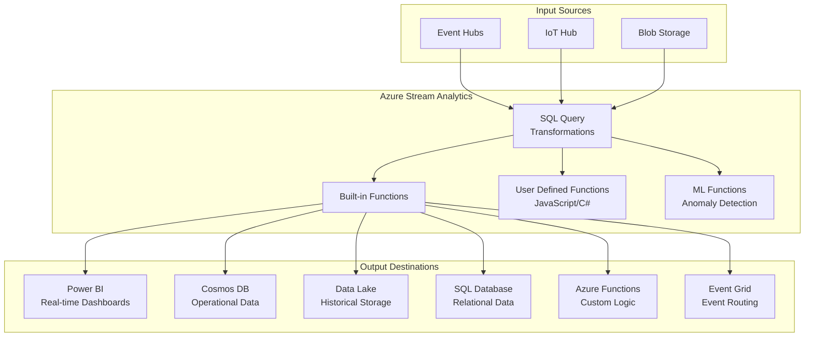

# ⚡ Azure Stream Analytics

> __🏠 [Home](../../../../README.md)__ | __📖 [Overview](../../../01-overview/README.md)__ | __= [Services](../../README.md)__ | __= [Streaming Services](../README.md)__ | __⚡ Azure Stream Analytics__


Real-time analytics service for streaming data with SQL-based queries and built-in machine learning.

---

## < Service Overview

Azure Stream Analytics is a fully managed, serverless real-time analytics service designed to process and analyze fast-moving streams of data. It uses SQL-based queries to transform, aggregate, and analyze streaming data from multiple sources simultaneously.

### 🔥 Key Value Propositions

- __SQL-based Processing__: Familiar T-SQL syntax for stream processing
- __Serverless Architecture__: No infrastructure to manage or maintain
- __Built-in ML__: Anomaly detection and machine learning functions
- __Sub-second Latency__: Process events in near real-time
- __IoT Edge Support__: Deploy analytics to edge devices

---

## < Architecture Overview



---

## 💰 Pricing Model

### Streaming Units (SU)

Azure Stream Analytics pricing is based on Streaming Units, which represent compute capacity.


__Streaming Unit Composition__:

- **1 SU** = Combination of CPU, memory, and throughput
- **Scale**: 1 to 192+ SUs (in increments)
- **Cost**: Per SU per hour

```bash
# Calculate estimated cost
# Formula: SUs  Hours  Rate per SU/hour

# Example: 6 SUs running 24/7 for a month
SUs=6
Hours_per_month=720
Rate_per_SU_hour=0.11  # USD (example rate)

Monthly_cost = 6  720  0.11 = $475.20/month
```

### Cost Optimization Strategies

- **Right-size SUs**: Monitor utilization and adjust
- **Auto-scaling**: Use with Azure Automation
- **Reference data caching**: Reduce repeated lookups
- **Batch outputs**: Minimize write operations

---

## 📚 Core Concepts

### Query Language

Stream Analytics uses SQL-like syntax extended for temporal operations.

```sql
-- Basic SELECT query
SELECT
    deviceId,
    temperature,
    humidity,
    System.Timestamp() AS EventTime
INTO
    [output-alias]
FROM
    [input-alias]
WHERE
    temperature > 75

-- Aggregation with time window
SELECT
    deviceId,
    AVG(temperature) AS AvgTemp,
    MAX(temperature) AS MaxTemp,
    COUNT(*) AS EventCount,
    System.Timestamp() AS WindowEnd
INTO
    [aggregated-output]
FROM
    [input-alias]
GROUP BY
    deviceId,
    TumblingWindow(minute, 5)
```

### Inputs

Stream Analytics supports multiple input types:

#### Event Hubs Input

```bash
# Configure Event Hubs input
az stream-analytics input create \
  --resource-group myResourceGroup \
  --job-name myStreamJob \
  --name eventhub-input \
  --type Stream \
  --datasource '{
    "type": "Microsoft.ServiceBus/EventHub",
    "properties": {
      "serviceBusNamespace": "my-eventhub-ns",
      "eventHubName": "telemetry",
      "consumerGroupName": "$Default"
    }
  }'
```

#### IoT Hub Input

```bash
# Configure IoT Hub input
az stream-analytics input create \
  --resource-group myResourceGroup \
  --job-name myStreamJob \
  --name iothub-input \
  --type Stream \
  --datasource '{
    "type": "Microsoft.Devices/IotHubs",
    "properties": {
      "iotHubNamespace": "my-iothub",
      "consumerGroupName": "$Default"
    }
  }'
```

#### Blob Storage (Reference Data)

```sql
-- Query using reference data
SELECT
    i.deviceId,
    i.temperature,
    r.deviceName,
    r.location,
    r.alertThreshold
FROM
    [input-alias] i
JOIN
    [reference-data] r
ON
    i.deviceId = r.deviceId
WHERE
    i.temperature > r.alertThreshold
```

### Outputs

Configure multiple outputs for different destinations:

```bash
# Power BI output for dashboards
az stream-analytics output create \
  --resource-group myResourceGroup \
  --job-name myStreamJob \
  --name powerbi-output \
  --datasource '{
    "type": "PowerBI",
    "properties": {
      "dataset": "telemetry-dataset",
      "table": "device-readings"
    }
  }'

# Cosmos DB output for operational data
az stream-analytics output create \
  --resource-group myResourceGroup \
  --job-name myStreamJob \
  --name cosmos-output \
  --datasource '{
    "type": "Microsoft.Storage/DocumentDB",
    "properties": {
      "accountId": "my-cosmos-account",
      "database": "telemetry",
      "collectionNamePattern": "readings"
    }
  }'
```

---

## 💡 Use Cases

### <! IoT Device Monitoring

__Scenario__: Real-time monitoring and alerting for IoT sensors

```sql
-- Detect devices with high temperature readings
SELECT
    deviceId,
    AVG(temperature) AS avgTemp,
    MAX(temperature) AS maxTemp,
    System.Timestamp() AS windowEnd
INTO
    [alert-output]
FROM
    [iothub-input]
GROUP BY
    deviceId,
    TumblingWindow(minute, 1)
HAVING
    AVG(temperature) > 80 OR MAX(temperature) > 100
```

### 📊 Real-time Analytics Dashboard

__Scenario__: Live Power BI dashboard with streaming data

```sql
-- Aggregate data for Power BI visualization
SELECT
    System.Timestamp() AS timestamp,
    COUNT(*) AS totalEvents,
    COUNT(DISTINCT deviceId) AS activeDevices,
    AVG(temperature) AS avgTemperature,
    AVG(humidity) AS avgHumidity,
    MAX(temperature) AS maxTemperature
INTO
    [powerbi-output]
FROM
    [eventhub-input]
GROUP BY
    TumblingWindow(second, 10)
```

### 🔍 Anomaly Detection

__Scenario__: Detect unusual patterns in streaming data

```sql
-- Use built-in anomaly detection
SELECT
    deviceId,
    temperature,
    AnomalyDetection_SpikeAndDip(temperature, 95, 120, 'spikesanddips')
        OVER(LIMIT DURATION(minute, 5)) AS anomalyScore
INTO
    [anomaly-output]
FROM
    [input-alias]
```

### = ETL and Data Transformation

__Scenario__: Transform and enrich streaming data before storage

```sql
-- Transform and enrich events
SELECT
    e.deviceId,
    e.sensorReading,
    r.deviceName,
    r.location,
    r.department,
    CASE
        WHEN e.sensorReading > r.criticalThreshold THEN 'Critical'
        WHEN e.sensorReading > r.warningThreshold THEN 'Warning'
        ELSE 'Normal'
    END AS status,
    System.Timestamp() AS processedTime
INTO
    [datalake-output]
FROM
    [eventhub-input] e
JOIN
    [device-reference-data] r
ON
    e.deviceId = r.deviceId
```

---

## 🚀 Quick Start

### Create Stream Analytics Job

```bash
# Create resource group
az group create --name rg-stream-analytics --location eastus

# Create Stream Analytics job
az stream-analytics job create \
  --resource-group rg-stream-analytics \
  --name my-stream-job \
  --location eastus \
  --output-error-policy Drop \
  --events-outoforder-policy Adjust \
  --events-outoforder-max-delay 5 \
  --events-late-arrival-max-delay 5 \
  --data-locale en-US \
  --compatibility-level 1.2 \
  --sku Standard

# Show job details
az stream-analytics job show \
  --resource-group rg-stream-analytics \
  --name my-stream-job
```

### Configure Inputs and Outputs

```bash
# Add Event Hubs input
az stream-analytics input create \
  --resource-group rg-stream-analytics \
  --job-name my-stream-job \
  --name eventhub-input \
  --type Stream \
  --serialization '{
    "type": "Json",
    "properties": {
      "encoding": "UTF8"
    }
  }' \
  --datasource @eventhub-datasource.json

# Add Cosmos DB output
az stream-analytics output create \
  --resource-group rg-stream-analytics \
  --job-name my-stream-job \
  --name cosmos-output \
  --datasource @cosmos-datasource.json
```

### Define Query

```sql
-- Example: Temperature monitoring query
WITH TemperatureAlerts AS (
    SELECT
        deviceId,
        temperature,
        System.Timestamp() AS eventTime
    FROM
        [eventhub-input]
    WHERE
        temperature > 75
)

-- Output to Cosmos DB
SELECT
    deviceId,
    temperature,
    eventTime,
    'High Temperature Alert' AS alertType
INTO
    [cosmos-output]
FROM
    TemperatureAlerts

-- Output to Power BI for visualization
SELECT
    COUNT(*) AS alertCount,
    AVG(temperature) AS avgTemperature,
    System.Timestamp() AS windowEnd
INTO
    [powerbi-output]
FROM
    TemperatureAlerts
GROUP BY
    TumblingWindow(minute, 1)
```

### Start the Job

```bash
# Start the job
az stream-analytics job start \
  --resource-group rg-stream-analytics \
  --name my-stream-job \
  --output-start-mode JobStartTime

# Monitor job status
az stream-analytics job show \
  --resource-group rg-stream-analytics \
  --name my-stream-job \
  --query "{name:name, state:jobState, startTime:startTime}"
```

---

## ⚙️ Advanced Features

### User-Defined Functions (UDF)

```javascript
// JavaScript UDF example
function convertToFahrenheit(celsius) {
    return (celsius * 9/5) + 32;
}

// Use in query
SELECT
    deviceId,
    temperature AS tempCelsius,
    udf.convertToFahrenheit(temperature) AS tempFahrenheit
FROM
    [input-alias]
```

### User-Defined Aggregates (UDA)

```csharp
// C# UDA for custom aggregations
using Microsoft.Azure.StreamAnalytics;

[FunctionName("CustomMean")]
public class CustomMean : IAggregate<double, double>
{
    private double sum;
    private long count;

    public void Accumulate(double value)
    {
        sum += value;
        count++;
    }

    public double Deaccumulate(double value)
    {
        sum -= value;
        count--;
        return count > 0 ? sum / count : 0;
    }

    public double GetResult()
    {
        return count > 0 ? sum / count : 0;
    }
}
```

### Machine Learning Integration

```sql
-- Call Azure ML endpoint for predictions
SELECT
    deviceId,
    temperature,
    humidity,
    udf.machinelearning(temperature, humidity) AS prediction
INTO
    [ml-output]
FROM
    [input-alias]
```

---

## 📈 Performance Optimization

### Streaming Units Calculation

```python
# Python script to calculate required SUs
def calculate_streaming_units(
    events_per_second,
    avg_event_size_kb,
    query_complexity_factor=1.5
):
    """
    Calculate required Streaming Units.

    Args:
        events_per_second: Expected event rate
        avg_event_size_kb: Average event size in KB
        query_complexity_factor: Multiplier for query complexity (1.0-3.0)
    """
    # Base throughput per SU (approximate)
    EVENTS_PER_SU = 1000  # events/sec per SU (simplified)
    MB_PER_SU = 1  # MB/sec per SU

    # Calculate based on event rate
    sus_by_rate = (events_per_second / EVENTS_PER_SU) * query_complexity_factor

    # Calculate based on data volume
    data_mb_per_sec = (events_per_second * avg_event_size_kb) / 1024
    sus_by_volume = (data_mb_per_sec / MB_PER_SU) * query_complexity_factor

    # Take maximum and round up
    required_sus = max(sus_by_rate, sus_by_volume)
    recommended_sus = int(required_sus) + 1 if required_sus % 1 > 0 else int(required_sus)

    return {
        "recommended_sus": recommended_sus,
        "sus_by_rate": round(sus_by_rate, 2),
        "sus_by_volume": round(sus_by_volume, 2),
        "estimated_cost_per_month_usd": round(recommended_sus * 720 * 0.11, 2)
    }

# Example usage
result = calculate_streaming_units(
    events_per_second=5000,
    avg_event_size_kb=2,
    query_complexity_factor=1.5
)
print(f"Recommended SUs: {result['recommended_sus']}")
print(f"Estimated Monthly Cost: ${result['estimated_cost_per_month_usd']}")
```

### Query Optimization Tips

```sql
-- ❌ BAD: Unnecessary joins
SELECT *
FROM [input1] i1
JOIN [input2] i2 ON i1.id = i2.id
JOIN [input3] i3 ON i2.id = i3.id

--  GOOD: Selective projection and filtering
SELECT
    i1.deviceId,
    i1.temperature,
    i2.location
FROM [input1] i1
JOIN [input2] i2 ON i1.deviceId = i2.deviceId
WHERE i1.temperature > 70

-- ❌ BAD: Multiple separate queries
SELECT AVG(temp) INTO [output1] FROM [input] GROUP BY TumblingWindow(minute,1)
SELECT MAX(temp) INTO [output2] FROM [input] GROUP BY TumblingWindow(minute,1)
SELECT MIN(temp) INTO [output3] FROM [input] GROUP BY TumblingWindow(minute,1)

--  GOOD: Single query with multiple outputs
SELECT
    AVG(temp) AS avgTemp,
    MAX(temp) AS maxTemp,
    MIN(temp) AS minTemp
INTO [output]
FROM [input]
GROUP BY TumblingWindow(minute,1)
```

---

## = Related Topics

### 📖 Deep Dive Guides

- __[Stream Processing Basics](stream-processing-basics.md)__ - Core concepts and patterns
- __[Windowing Functions](windowing-functions.md)__ - Time-based aggregations
- __[Anomaly Detection](anomaly-detection.md)__ - Built-in ML capabilities
- __[Edge Deployments](edge-deployments.md)__ - IoT Edge processing

### = Integration Scenarios

- [__Stream Analytics + Event Hubs__](../../../04-implementation-guides/integration-scenarios/eventhub-stream-analytics.md)
- [__Stream Analytics + Power BI__](../../../04-implementation-guides/integration-scenarios/stream-analytics-powerbi.md)
- [__Stream Analytics + Synapse__](../../../04-implementation-guides/integration-scenarios/stream-analytics-synapse.md)

### ✅ Best Practices

- [__Performance Tuning__](../../../05-best-practices/cross-cutting-concerns/performance/stream-analytics-optimization.md)
- [__Query Development__](../../../05-best-practices/cross-cutting-concerns/development/stream-analytics-queries.md)
- [__Cost Optimization__](../../../05-best-practices/cross-cutting-concerns/cost-optimization/stream-analytics-cost.md)

---

## =
 Monitoring and Diagnostics

### Key Metrics

```bash
# View job metrics
az monitor metrics list \
  --resource /subscriptions/{sub}/resourceGroups/rg/providers/Microsoft.StreamAnalytics/streamingjobs/myjob \
  --metric "InputEvents,OutputEvents,Errors,ResourceUtilization" \
  --start-time 2025-01-01T00:00:00Z \
  --end-time 2025-01-28T23:59:59Z
```

Monitor these key metrics:

- **SU % Utilization**: Should be 60-80% for optimal cost/performance
- **Watermark Delay**: Measures processing lag
- **Input Events**: Events received from sources
- **Output Events**: Events written to destinations
- **Runtime Errors**: Failed event processing
- **Data Conversion Errors**: Schema mismatch issues

---

*Last Updated: 2025-01-28*
*Service Version: General Availability*
*Documentation Status: Complete*
