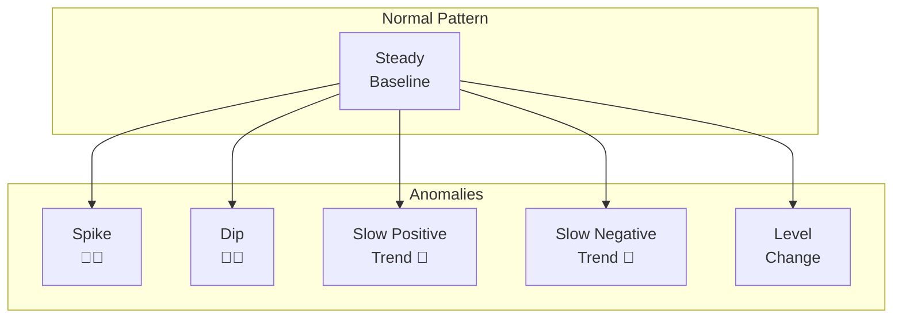

# =
 Anomaly Detection

> __< [Home](../../../../README.md)__ | __= [Overview](../../../01-overview/README.md)__ | __= [Services](../../README.md)__ | __= [Streaming Services](../README.md)__ | __ [Stream Analytics](README.md)__ | __=
 Anomaly Detection__


Built-in machine learning capabilities for detecting anomalies in streaming data.

---

## < Overview

Azure Stream Analytics includes built-in machine learning models for anomaly detection without requiring data science expertise. These functions detect unusual patterns in streaming data in real-time.

### Supported Anomaly Types

- **Spikes**: Sudden increase in values
- **Dips**: Sudden decrease in values
- **Slow Positive Trends**: Gradual upward drift
- **Slow Negative Trends**: Gradual downward drift
- **Bidirectional Level Changes**: Step changes up or down



---

## =' Anomaly Detection Functions

### AnomalyDetection_SpikeAndDip

Detects spikes and dips in time-series data.

```sql
-- Basic spike and dip detection
SELECT
    deviceId,
    temperature,
    AnomalyDetection_SpikeAndDip(temperature, 95, 120, 'spikesanddips')
        OVER(PARTITION BY deviceId LIMIT DURATION(hour, 1)) AS anomalyScore
INTO
    [anomaly-output]
FROM
    [sensor-input]
```

**Parameters:**
- **Column**: The numeric column to analyze (e.g., `temperature`)
- **Confidence**: Confidence level (0-100), typically 95
- **History Size**: Number of events to consider (e.g., 120)
- **Mode**: `'spikes'`, `'dips'`, or `'spikesanddips'`

**Output Fields:**
- **Score**: Anomaly score (0-1, higher = more anomalous)
- **IsAnomaly**: Boolean flag (1 = anomaly detected)

### AnomalyDetection_ChangePoint

Detects persistent changes in the level or trend of time-series data.

```sql
-- Detect level changes in metrics
SELECT
    metricName,
    value,
    AnomalyDetection_ChangePoint(value, 95, 120)
        OVER(PARTITION BY metricName LIMIT DURATION(hour, 1)) AS changePoint
INTO
    [changepoint-output]
FROM
    [metrics-input]
```

**Use Cases:**
- Detecting system configuration changes
- Identifying service degradation
- Monitoring baseline shifts

---

## = Practical Examples

### Example 1: Temperature Anomaly Detection

```sql
-- Comprehensive temperature monitoring with anomaly detection
WITH TemperatureData AS (
    SELECT
        deviceId,
        location,
        temperature,
        System.Timestamp() AS eventTime
    FROM
        [sensor-input]
),
AnomalyDetection AS (
    SELECT
        deviceId,
        location,
        temperature,
        eventTime,
        AnomalyDetection_SpikeAndDip(temperature, 95, 120, 'spikesanddips')
            OVER(PARTITION BY deviceId LIMIT DURATION(hour, 2)) AS spikeAndDip,
        AnomalyDetection_ChangePoint(temperature, 95, 120)
            OVER(PARTITION BY deviceId LIMIT DURATION(hour, 2)) AS changePoint
    FROM
        TemperatureData
)

-- Output anomalies with context
SELECT
    deviceId,
    location,
    temperature,
    eventTime,
    spikeAndDip.Score AS spikeScore,
    spikeAndDip.IsAnomaly AS isSpikeAnomaly,
    changePoint.Score AS changePointScore,
    changePoint.IsAnomaly AS isChangePoint,
    CASE
        WHEN spikeAndDip.IsAnomaly = 1 AND spikeAndDip.Score > 0.8 THEN 'Critical Spike/Dip'
        WHEN changePoint.IsAnomaly = 1 THEN 'Level Change Detected'
        ELSE 'Normal'
    END AS anomalyType
INTO
    [temperature-anomalies]
FROM
    AnomalyDetection
WHERE
    spikeAndDip.IsAnomaly = 1 OR changePoint.IsAnomaly = 1
```

```csharp
// C# consumer to process anomalies
using Azure.Messaging.EventHubs.Consumer;
using System;
using System.Text.Json;

public class AnomalyProcessor
{
    public async Task ProcessAnomaliesAsync(string connectionString, string eventHubName)
    {
        await using var consumer = new EventHubConsumerClient(
            EventHubConsumerClient.DefaultConsumerGroupName,
            connectionString,
            eventHubName);

        await foreach (PartitionEvent partitionEvent in consumer.ReadEventsAsync())
        {
            var anomaly = JsonSerializer.Deserialize<TemperatureAnomaly>(
                partitionEvent.Data.EventBody.ToString());

            Console.WriteLine($"Anomaly detected for device {anomaly.DeviceId}");
            Console.WriteLine($"  Type: {anomaly.AnomalyType}");
            Console.WriteLine($"  Temperature: {anomaly.Temperature}C");
            Console.WriteLine($"  Spike Score: {anomaly.SpikeScore:F2}");

            if (anomaly.AnomalyType == "Critical Spike/Dip")
            {
                await SendAlertAsync(anomaly);
            }
        }
    }

    private async Task SendAlertAsync(TemperatureAnomaly anomaly)
    {
        // Send alert via email, SMS, or notification service
        Console.WriteLine($"= ALERT: Critical anomaly for device {anomaly.DeviceId}");
    }
}

public record TemperatureAnomaly(
    string DeviceId,
    string Location,
    double Temperature,
    DateTime EventTime,
    double SpikeScore,
    bool IsSpikeAnomaly,
    double ChangePointScore,
    bool IsChangePoint,
    string AnomalyType
);
```

### Example 2: Network Traffic Anomaly Detection

```sql
-- Detect unusual network traffic patterns
WITH NetworkMetrics AS (
    SELECT
        serverId,
        bytesReceived,
        bytesSent,
        connectionCount,
        System.Timestamp() AS timestamp
    FROM
        [network-input]
    GROUP BY
        serverId,
        bytesReceived,
        bytesSent,
        connectionCount,
        TumblingWindow(second, 30)
),
TrafficAnomalies AS (
    SELECT
        serverId,
        bytesReceived,
        bytesSent,
        connectionCount,
        timestamp,
        AnomalyDetection_SpikeAndDip(bytesReceived, 95, 240, 'spikes')
            OVER(PARTITION BY serverId LIMIT DURATION(minute, 30)) AS receivedAnomaly,
        AnomalyDetection_SpikeAndDip(bytesSent, 95, 240, 'spikes')
            OVER(PARTITION BY serverId LIMIT DURATION(minute, 30)) AS sentAnomaly,
        AnomalyDetection_SpikeAndDip(connectionCount, 95, 240, 'spikes')
            OVER(PARTITION BY serverId LIMIT DURATION(minute, 30)) AS connAnomaly
    FROM
        NetworkMetrics
)

-- Flag potential DDoS or security incidents
SELECT
    serverId,
    bytesReceived / 1024 / 1024 AS mbReceived,
    bytesSent / 1024 / 1024 AS mbSent,
    connectionCount,
    timestamp,
    receivedAnomaly.Score AS receivedAnomalyScore,
    sentAnomaly.Score AS sentAnomalyScore,
    connAnomaly.Score AS connAnomalyScore,
    CASE
        WHEN receivedAnomaly.IsAnomaly = 1 AND connAnomaly.IsAnomaly = 1
            THEN 'Potential DDoS Attack'
        WHEN sentAnomaly.IsAnomaly = 1 AND sentAnomaly.Score > 0.9
            THEN 'Potential Data Exfiltration'
        WHEN receivedAnomaly.IsAnomaly = 1
            THEN 'Unusual Inbound Traffic'
        ELSE 'Traffic Anomaly'
    END AS securityAlert
INTO
    [security-alerts]
FROM
    TrafficAnomalies
WHERE
    receivedAnomaly.IsAnomaly = 1
    OR sentAnomaly.IsAnomaly = 1
    OR connAnomaly.IsAnomaly = 1
```

### Example 3: Application Performance Monitoring

```sql
-- Monitor application response times for anomalies
WITH ResponseTimeMetrics AS (
    SELECT
        applicationName,
        endpoint,
        AVG(responseTime) AS avgResponseTime,
        MAX(responseTime) AS maxResponseTime,
        COUNT(*) AS requestCount,
        System.Timestamp() AS windowEnd
    FROM
        [app-logs]
    GROUP BY
        applicationName,
        endpoint,
        TumblingWindow(minute, 1)
),
PerformanceAnomalies AS (
    SELECT
        applicationName,
        endpoint,
        avgResponseTime,
        maxResponseTime,
        requestCount,
        windowEnd,
        AnomalyDetection_SpikeAndDip(avgResponseTime, 95, 120, 'spikes')
            OVER(PARTITION BY applicationName, endpoint LIMIT DURATION(hour, 1)) AS responseAnomaly,
        AnomalyDetection_ChangePoint(avgResponseTime, 95, 120)
            OVER(PARTITION BY applicationName, endpoint LIMIT DURATION(hour, 1)) AS performanceChange
    FROM
        ResponseTimeMetrics
)

-- Alert on performance degradation
SELECT
    applicationName,
    endpoint,
    avgResponseTime,
    maxResponseTime,
    requestCount,
    windowEnd,
    responseAnomaly.Score AS anomalyScore,
    performanceChange.Score AS changeScore,
    CASE
        WHEN performanceChange.IsAnomaly = 1 THEN 'Performance Degradation Detected'
        WHEN responseAnomaly.IsAnomaly = 1 AND responseAnomaly.Score > 0.9 THEN 'Critical Response Time Spike'
        WHEN responseAnomaly.IsAnomaly = 1 THEN 'Response Time Anomaly'
        ELSE 'Normal'
    END AS alertType
INTO
    [performance-alerts]
FROM
    PerformanceAnomalies
WHERE
    responseAnomaly.IsAnomaly = 1 OR performanceChange.IsAnomaly = 1
```

---

## < Tuning Anomaly Detection

### Confidence Level Selection

```python
# Python script to evaluate different confidence levels
import numpy as np
from typing import List, Tuple

def evaluate_confidence_levels(
    normal_data: List[float],
    anomaly_data: List[float]
) -> List[Tuple[int, float, float]]:
    """
    Evaluate detection performance at different confidence levels.

    Returns: List of (confidence_level, false_positive_rate, true_positive_rate)
    """
    confidence_levels = [80, 85, 90, 95, 99]
    results = []

    for confidence in confidence_levels:
        # Simulate anomaly detection threshold
        threshold = np.percentile(normal_data, confidence)

        # Calculate metrics
        false_positives = sum(1 for x in normal_data if x > threshold)
        true_positives = sum(1 for x in anomaly_data if x > threshold)

        fpr = false_positives / len(normal_data)
        tpr = true_positives / len(anomaly_data)

        results.append((confidence, fpr, tpr))

        print(f"Confidence {confidence}%:")
        print(f"  False Positive Rate: {fpr:.2%}")
        print(f"  True Positive Rate: {tpr:.2%}")
        print()

    return results

# Example usage
normal_temps = [20 + np.random.normal(0, 2) for _ in range(1000)]
anomaly_temps = [20 + np.random.normal(10, 3) for _ in range(100)]

evaluate_confidence_levels(normal_temps, anomaly_temps)
```

**Confidence Level Guidelines:**
- **95%**: Good balance, recommended for most use cases
- **99%**: More conservative, fewer false positives
- **90%**: More sensitive, catches more anomalies but more false positives

### History Size Selection

```sql
-- Test different history sizes
-- Small history (60): Fast adaptation, more sensitive to recent changes
SELECT
    deviceId,
    temperature,
    AnomalyDetection_SpikeAndDip(temperature, 95, 60, 'spikesanddips')
        OVER(PARTITION BY deviceId LIMIT DURATION(minute, 30)) AS anomaly60
FROM [input]

-- Medium history (120): Balanced approach (recommended)
SELECT
    deviceId,
    temperature,
    AnomalyDetection_SpikeAndDip(temperature, 95, 120, 'spikesanddips')
        OVER(PARTITION BY deviceId LIMIT DURATION(hour, 1)) AS anomaly120
FROM [input]

-- Large history (240): More stable, less reactive to short-term fluctuations
SELECT
    deviceId,
    temperature,
    AnomalyDetection_SpikeAndDip(temperature, 95, 240, 'spikesanddips')
        OVER(PARTITION BY deviceId LIMIT DURATION(hour, 2)) AS anomaly240
FROM [input]
```

---

## = Integration with Alerting

### Event Grid Integration

```sql
-- Send anomalies to Event Grid for action
SELECT
    deviceId,
    temperature,
    anomaly.Score AS score,
    'TemperatureAnomaly' AS eventType,
    System.Timestamp() AS detectionTime
INTO
    [eventgrid-output]
FROM
    [sensor-input]
CROSS APPLY
    AnomalyDetection_SpikeAndDip(temperature, 95, 120, 'spikesanddips')
        OVER(PARTITION BY deviceId LIMIT DURATION(hour, 1)) AS anomaly
WHERE
    anomaly.IsAnomaly = 1
```

```python
# Python Azure Function triggered by Event Grid
import logging
import json
import azure.functions as func
from azure.communication.email import EmailClient

def main(event: func.EventGridEvent):
    """Process anomaly alert from Stream Analytics."""
    result = event.get_json()

    logging.info(f"Anomaly detected for device {result['deviceId']}")
    logging.info(f"  Temperature: {result['temperature']}")
    logging.info(f"  Anomaly Score: {result['score']}")

    # Send email alert
    if result['score'] > 0.9:
        send_critical_alert(result)

    # Update monitoring dashboard
    update_dashboard(result)

    # Log to monitoring system
    log_to_monitoring(result)

def send_critical_alert(anomaly_data):
    """Send critical alert via email."""
    email_client = EmailClient.from_connection_string(
        os.environ["COMMUNICATION_SERVICES_CONNECTION_STRING"]
    )

    message = {
        "senderAddress": "noreply@contoso.com",
        "recipients": {
            "to": [{"address": "alerts@contoso.com"}]
        },
        "content": {
            "subject": f"Critical Anomaly: Device {anomaly_data['deviceId']}",
            "plainText": f"""
            Critical anomaly detected:

            Device: {anomaly_data['deviceId']}
            Temperature: {anomaly_data['temperature']}C
            Anomaly Score: {anomaly_data['score']:.2f}
            Time: {anomaly_data['detectionTime']}
            """
        }
    }

    email_client.begin_send(message)
```

---

## = Advanced Patterns

### Multi-Metric Anomaly Detection

```sql
-- Combine multiple metrics for comprehensive anomaly detection
WITH MultiMetricAnomalies AS (
    SELECT
        deviceId,
        temperature,
        humidity,
        pressure,
        AnomalyDetection_SpikeAndDip(temperature, 95, 120, 'spikesanddips')
            OVER(PARTITION BY deviceId LIMIT DURATION(hour, 1)) AS tempAnomaly,
        AnomalyDetection_SpikeAndDip(humidity, 95, 120, 'spikesanddips')
            OVER(PARTITION BY deviceId LIMIT DURATION(hour, 1)) AS humidityAnomaly,
        AnomalyDetection_SpikeAndDip(pressure, 95, 120, 'spikesanddips')
            OVER(PARTITION BY deviceId LIMIT DURATION(hour, 1)) AS pressureAnomaly,
        System.Timestamp() AS timestamp
    FROM
        [sensor-input]
)

-- Flag devices with multiple concurrent anomalies
SELECT
    deviceId,
    temperature,
    humidity,
    pressure,
    timestamp,
    (CASE WHEN tempAnomaly.IsAnomaly = 1 THEN 1 ELSE 0 END +
     CASE WHEN humidityAnomaly.IsAnomaly = 1 THEN 1 ELSE 0 END +
     CASE WHEN pressureAnomaly.IsAnomaly = 1 THEN 1 ELSE 0 END) AS anomalyCount,
    CASE
        WHEN tempAnomaly.IsAnomaly = 1 AND humidityAnomaly.IsAnomaly = 1
            AND pressureAnomaly.IsAnomaly = 1
            THEN 'System Failure Likely'
        WHEN (tempAnomaly.IsAnomaly = 1 AND humidityAnomaly.IsAnomaly = 1)
            OR (tempAnomaly.IsAnomaly = 1 AND pressureAnomaly.IsAnomaly = 1)
            THEN 'Multiple Anomalies Detected'
        ELSE 'Single Anomaly'
    END AS severity
INTO
    [multi-metric-alerts]
FROM
    MultiMetricAnomalies
WHERE
    tempAnomaly.IsAnomaly = 1
    OR humidityAnomaly.IsAnomaly = 1
    OR pressureAnomaly.IsAnomaly = 1
```

---

## = Related Resources

### Core Topics

- [__Stream Processing Basics__](stream-processing-basics.md) - Fundamental concepts
- [__Windowing Functions__](windowing-functions.md) - Time-based analysis
- [__Edge Deployments__](edge-deployments.md) - Deploy to IoT Edge

### Integration Guides

- [__Event Grid Integration__](../../../04-implementation-guides/integration-scenarios/stream-analytics-eventgrid.md)
- [__Azure Functions Integration__](../../../04-implementation-guides/integration-scenarios/stream-analytics-functions.md)

### Best Practices

- [__ML Model Tuning__](../../../05-best-practices/cross-cutting-concerns/performance/anomaly-detection-tuning.md)
- [__Alert Management__](../../../05-best-practices/operational-excellence/alert-strategies.md)

---

*Last Updated: 2025-01-28*
*Complexity: Advanced*
*Estimated Reading Time: 20 minutes*
