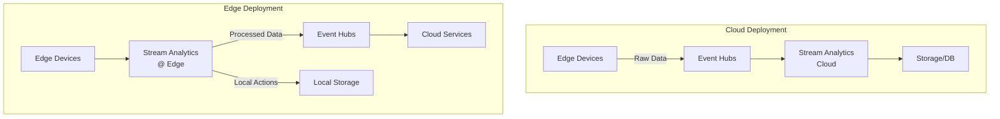
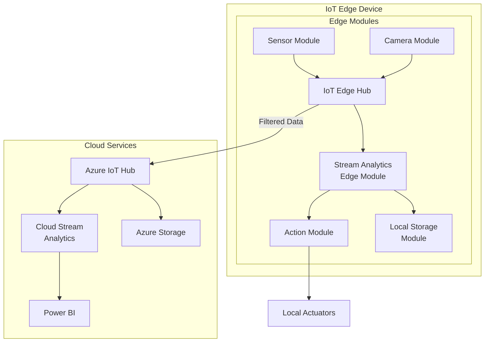

# < Edge Deployments

> __< [Home](../../../../README.md)__ | __= [Overview](../../../01-overview/README.md)__ | __= [Services](../../README.md)__ | __= [Streaming Services](../README.md)__ | __ [Stream Analytics](README.md)__ | __< Edge Deployments__


Deploy Azure Stream Analytics jobs to IoT Edge devices for low-latency, edge-based stream processing.

---

## < Overview

Azure Stream Analytics on IoT Edge enables you to run the same Stream Analytics queries on edge devices that you run in the cloud. This provides ultra-low-latency analytics, reduced bandwidth costs, and offline operation capabilities.

### Cloud vs Edge Deployment



### Benefits of Edge Deployment

- **Low Latency**: Process data locally without cloud round-trip
- **Reduced Bandwidth**: Send only processed/filtered data to cloud
- **Offline Operation**: Continue processing during connectivity loss
- **Data Privacy**: Keep sensitive data on-premises
- **Cost Savings**: Lower data transfer and cloud processing costs

---

## < Architecture

### Edge Processing Architecture



---

## = Getting Started

### Prerequisites

```bash
# Install Azure IoT Edge runtime
# For Ubuntu/Debian
curl https://packages.microsoft.com/config/ubuntu/20.04/packages-microsoft-prod.deb > ./packages-microsoft-prod.deb
sudo dpkg -i ./packages-microsoft-prod.deb
sudo apt-get update
sudo apt-get install aziot-edge

# For Windows
# Download and run installer from:
# https://aka.ms/iotedge-win
```

### Step 1: Create Stream Analytics Edge Job

```bash
# Create resource group
az group create --name rg-asa-edge --location eastus

# Create Stream Analytics job for Edge
az stream-analytics job create \
  --resource-group rg-asa-edge \
  --name asa-edge-job \
  --location eastus \
  --compatibility-level 1.2 \
  --type Edge

# Show job details
az stream-analytics job show \
  --resource-group rg-asa-edge \
  --name asa-edge-job
```

### Step 2: Define Edge Job Query

```sql
-- Example: Temperature filtering and alerting at the edge
WITH FilteredData AS (
    SELECT
        deviceId,
        temperature,
        humidity,
        System.Timestamp() AS timestamp
    FROM
        EdgeInput
    WHERE
        temperature > 70  -- Only process high temperatures
),
Alerts AS (
    SELECT
        deviceId,
        AVG(temperature) AS avgTemp,
        MAX(temperature) AS maxTemp,
        System.Timestamp() AS windowEnd
    FROM
        FilteredData
    GROUP BY
        deviceId,
        TumblingWindow(second, 30)
    HAVING
        AVG(temperature) > 80
)

-- Send all data to local storage
SELECT * INTO LocalOutput FROM FilteredData

-- Send only alerts to cloud
SELECT * INTO CloudOutput FROM Alerts
```

### Step 3: Package and Deploy

```bash
# Package the job for Edge deployment
az stream-analytics job publish \
  --resource-group rg-asa-edge \
  --name asa-edge-job \
  --publish-path "./asa-edge-package"

# Create IoT Edge deployment manifest
cat > deployment.template.json <<EOF
{
  "modulesContent": {
    "$edgeAgent": {
      "properties.desired": {
        "modules": {
          "StreamAnalytics": {
            "version": "1.0",
            "type": "docker",
            "status": "running",
            "restartPolicy": "always",
            "settings": {
              "image": "mcr.microsoft.com/azure-stream-analytics/azureiotedge:latest"
            },
            "env": {
              "PlanId": {
                "value": "{YOUR_PLAN_ID}"
              }
            }
          }
        }
      }
    },
    "$edgeHub": {
      "properties.desired": {
        "routes": {
          "ASAToIoTHub": "FROM /messages/modules/StreamAnalytics/* INTO $upstream"
        }
      }
    },
    "StreamAnalytics": {
      "properties.desired": {
        "ASAJobInfo": "{YOUR_JOB_INFO}"
      }
    }
  }
}
EOF

# Deploy to IoT Edge device
az iot edge set-modules \
  --device-id my-edge-device \
  --hub-name my-iothub \
  --content deployment.template.json
```

---

## = Code Examples

### Example 1: Temperature Monitoring at Edge

```sql
-- Process sensor data at the edge with immediate alerts
WITH SensorReadings AS (
    SELECT
        deviceId,
        sensorId,
        temperature,
        pressure,
        humidity,
        System.Timestamp() AS readingTime
    FROM
        IotHubInput
),
ImmediateAlerts AS (
    -- Critical alerts processed immediately
    SELECT
        deviceId,
        sensorId,
        temperature,
        'CRITICAL' AS severity,
        readingTime
    FROM
        SensorReadings
    WHERE
        temperature > 100
),
AggregatedMetrics AS (
    -- Aggregate for cloud reporting
    SELECT
        deviceId,
        AVG(temperature) AS avgTemp,
        AVG(pressure) AS avgPressure,
        AVG(humidity) AS avgHumidity,
        COUNT(*) AS readingCount,
        System.Timestamp() AS windowEnd
    FROM
        SensorReadings
    GROUP BY
        deviceId,
        TumblingWindow(minute, 5)
)

-- Immediate alerts to local actuator
SELECT * INTO LocalActuator FROM ImmediateAlerts

-- Aggregated data to cloud for analytics
SELECT * INTO IotHubOutput FROM AggregatedMetrics

-- All raw data to local storage for audit
SELECT * INTO BlobOutput FROM SensorReadings
```

### Example 2: Video Analytics at Edge

```sql
-- Process video analytics frames at the edge
WITH VideoFrames AS (
    SELECT
        cameraId,
        frameId,
        timestamp,
        detectedObjects,
        confidenceScore
    FROM
        VideoInput
),
ObjectDetections AS (
    SELECT
        cameraId,
        frameId,
        timestamp,
        GetArrayElement(detectedObjects, 0) AS primaryObject,
        confidenceScore
    FROM
        VideoFrames
    WHERE
        confidenceScore > 0.8  -- High confidence detections only
),
SecurityAlerts AS (
    SELECT
        cameraId,
        COUNT(*) AS detectionCount,
        COLLECT() AS detections,
        System.Timestamp() AS windowEnd
    FROM
        ObjectDetections
    WHERE
        GetRecordPropertyValue(primaryObject, 'class') = 'person'
        AND DATEPART(hour, System.Timestamp()) BETWEEN 22 AND 6  -- After hours
    GROUP BY
        cameraId,
        SlidingWindow(minute, 5)
    HAVING
        COUNT(*) > 3  -- Multiple detections
)

-- Send alerts to cloud
SELECT * INTO CloudAlerts FROM SecurityAlerts

-- Store detections locally
SELECT * INTO LocalStorage FROM ObjectDetections
```

### Example 3: Predictive Maintenance at Edge

```sql
-- Edge-based predictive maintenance
WITH MachineMetrics AS (
    SELECT
        machineId,
        vibration,
        temperature,
        pressure,
        rotationalSpeed,
        System.Timestamp() AS timestamp
    FROM
        MachineInput
),
HealthScore AS (
    SELECT
        machineId,
        -- Calculate health score from multiple metrics
        CASE
            WHEN vibration > 10 THEN 0.4
            WHEN vibration > 8 THEN 0.7
            ELSE 1.0
        END AS vibrationScore,
        CASE
            WHEN temperature > 80 THEN 0.4
            WHEN temperature > 70 THEN 0.7
            ELSE 1.0
        END AS temperatureScore,
        (vibrationScore + temperatureScore) / 2 AS overallHealth,
        timestamp
    FROM
        MachineMetrics
),
MaintenanceAlerts AS (
    SELECT
        machineId,
        AVG(overallHealth) AS avgHealth,
        MIN(overallHealth) AS minHealth,
        System.Timestamp() AS windowEnd
    FROM
        HealthScore
    GROUP BY
        machineId,
        HoppingWindow(minute, 10, 5)
    HAVING
        AVG(overallHealth) < 0.6  -- Poor health score
)

-- Trigger local maintenance workflow
SELECT * INTO MaintenanceModule FROM MaintenanceAlerts

-- Report to cloud for trending
SELECT * INTO CloudTelemetry FROM HealthScore
```

---

## =' Edge-Specific Considerations

### Local Storage Options

```csharp
// C# Edge Module: Store data locally
using Microsoft.Azure.Devices.Client;
using System.IO;
using Newtonsoft.Json;

public class LocalStorageModule
{
    private readonly string storagePathpath = "/mnt/data";

    public async Task StoreDataAsync(string data)
    {
        var filename = $"{storagePathpath}/data_{DateTime.UtcNow:yyyyMMddHHmmss}.json";

        // Ensure directory exists
        Directory.CreateDirectory(storagePathpath);

        // Write data to file
        await File.WriteAllTextAsync(filename, data);

        // Optional: Upload to cloud when connectivity available
        if (IsConnectedToCloud())
        {
            await UploadToCloudAsync(filename);
        }
    }

    public async Task UploadToCloudAsync(string filename)
    {
        // Upload to Azure Blob Storage
        var blobClient = GetBlobClient();
        await blobClient.UploadAsync(filename);

        // Delete local file after successful upload
        File.Delete(filename);
    }
}
```

### Offline Operation

```sql
-- Query design for offline scenarios
WITH BufferedData AS (
    SELECT
        *,
        System.Timestamp() AS processingTime
    FROM
        EdgeInput
),
ProcessedData AS (
    SELECT
        deviceId,
        AVG(value) AS avgValue,
        COUNT(*) AS eventCount,
        MIN(processingTime) AS windowStart,
        MAX(processingTime) AS windowEnd
    FROM
        BufferedData
    GROUP BY
        deviceId,
        TumblingWindow(minute, 1)
)

-- Always write to local storage (works offline)
SELECT * INTO LocalBlobStorage FROM ProcessedData

-- Opportunistically send to cloud (when online)
SELECT * INTO CloudOutput FROM ProcessedData
```

### Resource Constraints

```python
# Python script to monitor edge resource usage
import psutil
import logging
from datetime import datetime

class EdgeResourceMonitor:
    def __init__(self, threshold_cpu=80, threshold_memory=80):
        self.threshold_cpu = threshold_cpu
        self.threshold_memory = threshold_memory

    def check_resources(self):
        """Monitor CPU and memory usage."""
        cpu_percent = psutil.cpu_percent(interval=1)
        memory = psutil.virtual_memory()

        metrics = {
            "timestamp": datetime.utcnow().isoformat(),
            "cpu_percent": cpu_percent,
            "memory_percent": memory.percent,
            "memory_available_mb": memory.available / (1024 * 1024)
        }

        # Log warnings if thresholds exceeded
        if cpu_percent > self.threshold_cpu:
            logging.warning(f"High CPU usage: {cpu_percent}%")

        if memory.percent > self.threshold_memory:
            logging.warning(f"High memory usage: {memory.percent}%")

        return metrics

    def optimize_asa_job(self, metrics):
        """Adjust ASA job based on resource availability."""
        if metrics["cpu_percent"] > self.threshold_cpu:
            # Reduce query complexity or increase windowing intervals
            logging.info("Optimizing ASA job for CPU constraints")

        if metrics["memory_percent"] > self.threshold_memory:
            # Reduce buffer sizes or checkpoint frequency
            logging.info("Optimizing ASA job for memory constraints")

# Usage
monitor = EdgeResourceMonitor()
metrics = monitor.check_resources()
print(f"CPU: {metrics['cpu_percent']}%, Memory: {metrics['memory_percent']}%")
```

---

## = Monitoring Edge Deployments

### Monitor Edge Job Status

```bash
# Check IoT Edge module status
az iot edge list-modules \
  --device-id my-edge-device \
  --hub-name my-iothub

# View Stream Analytics module logs
az iot edge logs \
  --device-id my-edge-device \
  --hub-name my-iothub \
  --module-id StreamAnalytics \
  --tail 100

# Monitor module health
az iot edge show-module \
  --device-id my-edge-device \
  --hub-name my-iothub \
  --module-id StreamAnalytics
```

### Custom Metrics

```python
# Python script to collect custom edge metrics
from azure.iot.device import IoTHubModuleClient
import json
import time

class EdgeMetricsCollector:
    def __init__(self):
        self.client = IoTHubModuleClient.create_from_edge_environment()

    async def send_metrics(self, metrics):
        """Send custom metrics to IoT Hub."""
        message = {
            "deviceId": self.client.device_id,
            "moduleId": "StreamAnalytics",
            "metrics": metrics,
            "timestamp": time.time()
        }

        await self.client.send_message_to_output(
            json.dumps(message),
            "metrics"
        )

    async def collect_asa_metrics(self):
        """Collect Stream Analytics specific metrics."""
        return {
            "eventsProcessed": get_events_processed(),
            "queryLatency": get_query_latency_ms(),
            "memoryUsage": get_memory_usage_mb(),
            "cpuUsage": get_cpu_usage_percent()
        }

# Usage
collector = EdgeMetricsCollector()
metrics = await collector.collect_asa_metrics()
await collector.send_metrics(metrics)
```

---

## = Security Best Practices

### Secure Edge Deployment

```bash
# Use IoT Edge security daemon
sudo iotedge config mp --connection-string 'HostName=...'

# Configure module identity
az iot edge set-modules \
  --device-id my-edge-device \
  --hub-name my-iothub \
  --content deployment.json \
  --auth-method x509
```

### Data Encryption at Edge

```csharp
// Encrypt sensitive data before storing locally
using System.Security.Cryptography;
using System.Text;

public class EdgeDataEncryption
{
    private readonly byte[] encryptionKey;

    public EdgeDataEncryption(string keyString)
    {
        encryptionKey = Encoding.UTF8.GetBytes(keyString);
    }

    public byte[] EncryptData(string plainText)
    {
        using (Aes aes = Aes.Create())
        {
            aes.Key = encryptionKey;
            aes.GenerateIV();

            var encryptor = aes.CreateEncryptor(aes.Key, aes.IV);
            byte[] encrypted;

            using (var ms = new MemoryStream())
            {
                ms.Write(aes.IV, 0, aes.IV.Length);

                using (var cs = new CryptoStream(ms, encryptor, CryptoStreamMode.Write))
                using (var sw = new StreamWriter(cs))
                {
                    sw.Write(plainText);
                }

                encrypted = ms.ToArray();
            }

            return encrypted;
        }
    }
}
```

---

## = Related Resources

### Core Topics

- [__Stream Processing Basics__](stream-processing-basics.md) - Fundamental concepts
- [__Windowing Functions__](windowing-functions.md) - Time-based operations
- [__Anomaly Detection__](anomaly-detection.md) - ML at the edge

### Integration Guides

- [__IoT Hub Integration__](../../../04-implementation-guides/integration-scenarios/iothub-stream-analytics.md)
- [__Edge Module Development__](../../../04-implementation-guides/integration-scenarios/iot-edge-modules.md)

### Best Practices

- [__Edge Security__](../../../05-best-practices/cross-cutting-concerns/security/iot-edge-security.md)
- [__Edge Performance__](../../../05-best-practices/cross-cutting-concerns/performance/edge-optimization.md)
- [__Offline Scenarios__](../../../05-best-practices/operational-excellence/edge-offline-handling.md)

---

*Last Updated: 2025-01-28*
*Complexity: Advanced*
*Estimated Reading Time: 30 minutes*
