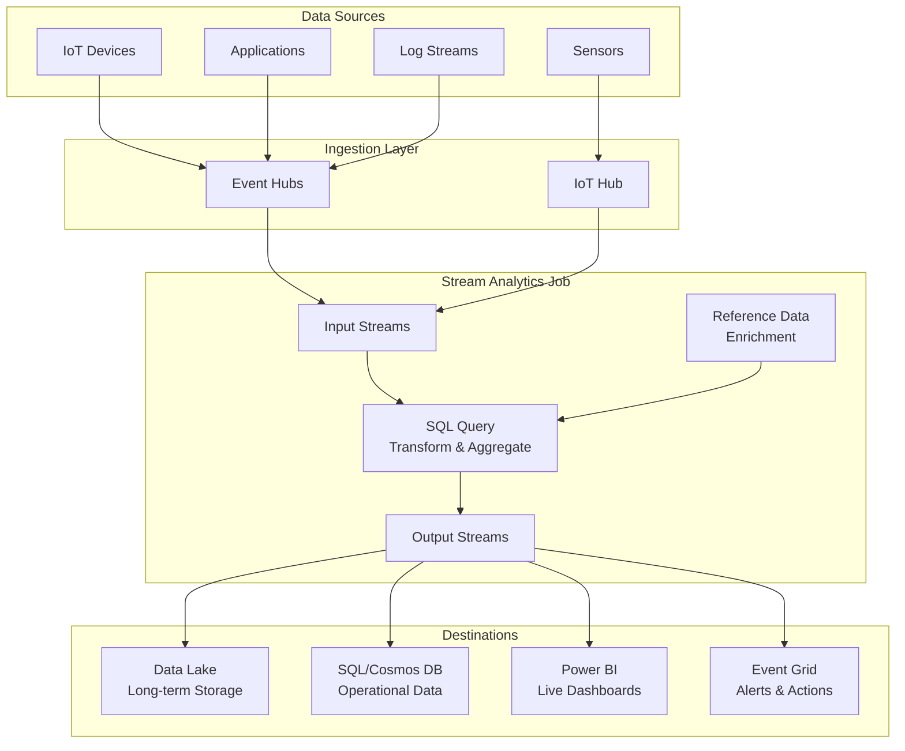
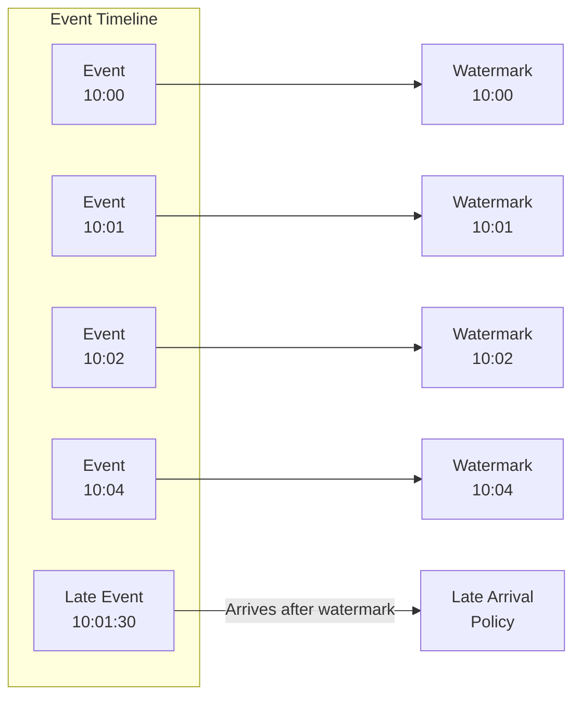
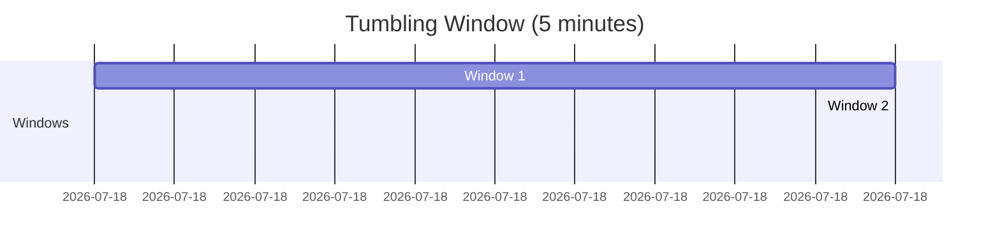
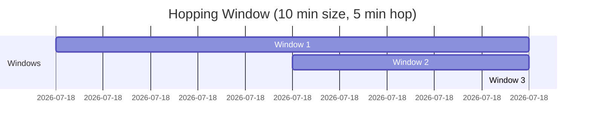

# <
 Stream Processing Basics

> __< [Home](../../../../README.md)__ | __= [Overview](../../../01-overview/README.md)__ | __= [Services](../../README.md)__ | __= [Streaming Services](../README.md)__ | __ [Stream Analytics](README.md)__ | __<
 Stream Processing Basics__


Fundamental concepts and patterns for stream processing with Azure Stream Analytics.

---

## < What is Stream Processing?

Stream processing is the real-time processing of continuous data streams. Unlike batch processing which operates on static datasets, stream processing analyzes data as it arrives, enabling immediate insights and actions.

### Stream vs Batch Processing

| Aspect | Batch Processing | Stream Processing |
|--------|-----------------|-------------------|
| **Data Type** | Bounded (finite) | Unbounded (continuous) |
| **Latency** | Minutes to hours | Milliseconds to seconds |
| **Processing** | All data at once | Continuous, incremental |
| **Use Case** | Historical analysis | Real-time analytics |
| **Examples** | Daily reports, ETL | Monitoring, alerting |

---

## < Stream Analytics Architecture



---

## = Core Concepts

### Event Time vs Processing Time

Understanding time is crucial in stream processing.

```sql
-- Event Time: When the event actually occurred
{
    "deviceId": "sensor-01",
    "temperature": 23.5,
    "eventTime": "2025-01-28T10:30:00Z"  -- Event time
}

-- Processing Time: When Stream Analytics processes the event
-- System.Timestamp() provides processing time

SELECT
    deviceId,
    temperature,
    eventTime,  -- Original event time
    System.Timestamp() AS processingTime  -- When we processed it
FROM
    [input-alias]
```

### Watermarks

Watermarks track the progress of event time in the stream.



```bash
# Configure late arrival policy
az stream-analytics job update \
  --resource-group myResourceGroup \
  --name myStreamJob \
  --events-late-arrival-max-delay 300  # 5 minutes in seconds
```

---

## = Query Language Fundamentals

### Basic SELECT Statement

```sql
-- Simple projection
SELECT
    deviceId,
    temperature,
    humidity,
    System.Timestamp() AS eventTime
INTO
    [output-alias]
FROM
    [input-alias]
```

### Filtering with WHERE

```sql
-- Filter events based on conditions
SELECT
    deviceId,
    temperature,
    location
INTO
    [high-temp-output]
FROM
    [sensor-input]
WHERE
    temperature > 75
    AND location = 'DataCenter-1'
```

### Data Type Conversion

```sql
-- Convert and cast data types
SELECT
    deviceId,
    CAST(temperature AS float) AS temp,
    TRY_CAST(sensorReading AS bigint) AS reading,
    CONVERT(varchar, eventTime, 127) AS eventTimeStr
FROM
    [input-alias]
```

### Working with JSON

```sql
-- Parse JSON properties
SELECT
    deviceId,
    GetRecordPropertyValue(GetRecordProperties(metadata), 'location') AS location,
    GetArrayElement(readings, 0) AS firstReading
FROM
    [input-alias]

-- Example input event:
{
    "deviceId": "sensor-01",
    "metadata": {
        "location": "Building-A",
        "floor": 2
    },
    "readings": [23.5, 24.0, 23.8]
}
```

---

## = Common Streaming Patterns

### Pattern 1: Filter and Forward

```sql
-- Simple filtering and routing
SELECT
    deviceId,
    temperature,
    System.Timestamp() AS timestamp
INTO
    [critical-alerts]
FROM
    [sensor-input]
WHERE
    temperature > 90  -- Critical threshold
```

```python
# Python example: Process alerts from output
from azure.cosmos import CosmosClient
import os

def process_critical_alerts():
    """Read and process critical alerts from Cosmos DB."""
    client = CosmosClient(
        url=os.getenv("COSMOS_ENDPOINT"),
        credential=os.getenv("COSMOS_KEY")
    )

    database = client.get_database_client("telemetry")
    container = database.get_container_client("critical-alerts")

    # Query recent alerts
    query = "SELECT * FROM c WHERE c.timestamp >= '2025-01-28T00:00:00Z'"
    alerts = list(container.query_items(query=query, enable_cross_partition_query=True))

    for alert in alerts:
        print(f"Alert for {alert['deviceId']}: {alert['temperature']}C")
        send_notification(alert)
```

### Pattern 2: Aggregation

```sql
-- Calculate statistics over time windows
SELECT
    deviceId,
    AVG(temperature) AS avgTemp,
    MIN(temperature) AS minTemp,
    MAX(temperature) AS maxTemp,
    COUNT(*) AS eventCount,
    System.Timestamp() AS windowEnd
INTO
    [aggregated-output]
FROM
    [sensor-input]
GROUP BY
    deviceId,
    TumblingWindow(minute, 5)
```

### Pattern 3: Enrichment with Reference Data

```sql
-- Join streaming data with static reference data
SELECT
    i.deviceId,
    i.temperature,
    i.humidity,
    r.deviceName,
    r.location,
    r.department,
    r.alertThreshold
INTO
    [enriched-output]
FROM
    [sensor-input] i
JOIN
    [device-reference] r
ON
    i.deviceId = r.deviceId
WHERE
    i.temperature > r.alertThreshold
```

Reference data file (CSV or JSON in Blob Storage):

```csv
deviceId,deviceName,location,department,alertThreshold
sensor-01,Temperature Sensor 1,Building A,Facilities,75
sensor-02,Temperature Sensor 2,Building B,IT,80
sensor-03,Humidity Sensor 1,Building A,Facilities,60
```

### Pattern 4: Multi-Stage Processing

```sql
-- Use CTEs for complex multi-stage queries
WITH TemperatureReadings AS (
    SELECT
        deviceId,
        AVG(temperature) AS avgTemp,
        System.Timestamp() AS windowEnd
    FROM
        [sensor-input]
    GROUP BY
        deviceId,
        TumblingWindow(minute, 1)
),
TemperatureDeviation AS (
    SELECT
        deviceId,
        avgTemp,
        avgTemp - LAG(avgTemp, 1) OVER (PARTITION BY deviceId LIMIT DURATION(minute, 5)) AS tempChange
    FROM
        TemperatureReadings
)

-- Output significant changes
SELECT
    deviceId,
    avgTemp,
    tempChange
INTO
    [temperature-change-alerts]
FROM
    TemperatureDeviation
WHERE
    ABS(tempChange) > 5  -- Alert on 5-degree change
```

---

## > Basic Windowing

### Tumbling Windows

Non-overlapping, fixed-size windows.



```sql
-- Count events in 5-minute tumbling windows
SELECT
    COUNT(*) AS eventCount,
    System.Timestamp() AS windowEnd
INTO
    [event-counts]
FROM
    [input-alias]
GROUP BY
    TumblingWindow(minute, 5)
```

### Hopping Windows

Overlapping windows that hop forward.



```sql
-- Calculate moving average with hopping windows
SELECT
    deviceId,
    AVG(temperature) AS movingAvgTemp,
    System.Timestamp() AS windowEnd
INTO
    [moving-average]
FROM
    [sensor-input]
GROUP BY
    deviceId,
    HoppingWindow(minute, 10, 5)  -- 10-min window, 5-min hop
```

### Sliding Windows

Triggered when events occur.

```sql
-- Alert when 3+ high temperature events occur within 2 minutes
SELECT
    deviceId,
    COUNT(*) AS highTempCount
INTO
    [sliding-alerts]
FROM
    [sensor-input]
WHERE
    temperature > 80
GROUP BY
    deviceId,
    SlidingWindow(minute, 2)
HAVING
    COUNT(*) >= 3
```

---

## =' Practical Examples

### Example 1: IoT Temperature Monitoring

```sql
-- Real-time temperature monitoring with alerts
WITH TemperatureStats AS (
    SELECT
        deviceId,
        AVG(temperature) AS avgTemp,
        MAX(temperature) AS maxTemp,
        COUNT(*) AS readingCount,
        System.Timestamp() AS windowEnd
    FROM
        [iothub-input]
    GROUP BY
        deviceId,
        TumblingWindow(minute, 1)
)

-- Normal readings to storage
SELECT
    *
INTO
    [datalake-output]
FROM
    TemperatureStats

-- High temperature alerts
SELECT
    deviceId,
    avgTemp,
    maxTemp,
    'High Temperature Alert' AS alertType,
    windowEnd
INTO
    [alert-output]
FROM
    TemperatureStats
WHERE
    maxTemp > 85 OR avgTemp > 80
```

### Example 2: Application Logging Analysis

```sql
-- Analyze application logs in real-time
SELECT
    applicationName,
    logLevel,
    COUNT(*) AS logCount,
    COUNT(CASE WHEN logLevel = 'ERROR' THEN 1 END) AS errorCount,
    COUNT(CASE WHEN logLevel = 'WARNING' THEN 1 END) AS warningCount,
    System.Timestamp() AS windowEnd
INTO
    [log-analytics-output]
FROM
    [eventhub-input]
GROUP BY
    applicationName,
    logLevel,
    TumblingWindow(minute, 5)
```

### Example 3: Real-time Click Stream Analysis

```sql
-- Analyze user click streams
WITH ClickEvents AS (
    SELECT
        userId,
        pageUrl,
        action,
        System.Timestamp() AS eventTime
    FROM
        [clickstream-input]
),
UserSessions AS (
    SELECT
        userId,
        COUNT(DISTINCT pageUrl) AS pagesVisited,
        COUNT(*) AS totalActions,
        DATEDIFF(minute, MIN(eventTime), MAX(eventTime)) AS sessionDuration
    FROM
        ClickEvents
    GROUP BY
        userId,
        SessionWindow(minute, 30, 5)  -- 30-min timeout, 5-min max extension
)

-- Output session analytics
SELECT
    userId,
    pagesVisited,
    totalActions,
    sessionDuration,
    System.Timestamp() AS sessionEnd
INTO
    [session-analytics-output]
FROM
    UserSessions
WHERE
    totalActions > 5  -- Active sessions only
```

---

## =
 Debugging and Testing

### Test Queries with Sample Data

```json
// Sample input data for testing (sample-input.json)
[
    {
        "deviceId": "sensor-01",
        "temperature": 72.5,
        "humidity": 45.2,
        "timestamp": "2025-01-28T10:00:00Z"
    },
    {
        "deviceId": "sensor-01",
        "temperature": 85.3,
        "humidity": 48.1,
        "timestamp": "2025-01-28T10:05:00Z"
    },
    {
        "deviceId": "sensor-02",
        "temperature": 68.9,
        "humidity": 52.3,
        "timestamp": "2025-01-28T10:00:00Z"
    }
]
```

```bash
# Test query locally with sample data
az stream-analytics job test \
  --resource-group myResourceGroup \
  --name myStreamJob \
  --input-name sensor-input \
  --sample-data-file sample-input.json
```

### Monitor Query Performance

```python
# Python script to monitor Stream Analytics metrics
from azure.mgmt.streamanalytics import StreamAnalyticsManagementClient
from azure.identity import DefaultAzureCredential
import os

def get_job_metrics(subscription_id, resource_group, job_name):
    """Retrieve Stream Analytics job metrics."""
    credential = DefaultAzureCredential()
    client = StreamAnalyticsManagementClient(credential, subscription_id)

    # Get job details
    job = client.streaming_jobs.get(resource_group, job_name)

    print(f"Job: {job.name}")
    print(f"State: {job.job_state}")
    print(f"Created: {job.created_date}")

    # Get SU utilization
    print(f"\nStreaming Units:")
    print(f"  Configured: {job.transformation.streaming_units}")

    return job

# Usage
job = get_job_metrics(
    subscription_id=os.getenv("AZURE_SUBSCRIPTION_ID"),
    resource_group="rg-stream-analytics",
    job_name="my-stream-job"
)
```

---

##  Performance Best Practices

### Query Optimization

```sql
-- L BAD: Select all columns
SELECT *
FROM [input-alias]

--  GOOD: Select only needed columns
SELECT deviceId, temperature, timestamp
FROM [input-alias]

-- L BAD: Complex nested subqueries
SELECT * FROM (
    SELECT * FROM (
        SELECT * FROM [input-alias]
    )
)

--  GOOD: Use CTEs for readability
WITH FilteredData AS (
    SELECT deviceId, temperature
    FROM [input-alias]
    WHERE temperature > 70
)
SELECT * FROM FilteredData
```

### Partitioning Strategy

```sql
-- Use PARTITION BY for parallel processing
SELECT
    deviceId,
    AVG(temperature) AS avgTemp
INTO
    [output-alias]
FROM
    [input-alias]
GROUP BY
    deviceId,
    TumblingWindow(minute, 5)
PARTITION BY
    deviceId
```

### Reference Data Optimization

```bash
# Keep reference data small and updated frequently
# Store in Blob Storage with path pattern: /reference/{date}/devices.json

# Configure reference data input
az stream-analytics input create \
  --resource-group myResourceGroup \
  --job-name myStreamJob \
  --name reference-data \
  --type Reference \
  --datasource '{
    "type": "Microsoft.Storage/Blob",
    "properties": {
      "storageAccounts": [...],
      "container": "reference-data",
      "pathPattern": "{date}/devices.json",
      "dateFormat": "yyyy-MM-dd"
    }
  }'
```

---

## = Related Resources

### Deep Dive Topics

- [__Windowing Functions__](windowing-functions.md) - Advanced temporal operations
- [__Anomaly Detection__](anomaly-detection.md) - Built-in ML capabilities
- [__Edge Deployments__](edge-deployments.md) - IoT Edge processing

### Integration Guides

- [__Event Hubs Integration__](../../../04-implementation-guides/integration-scenarios/eventhub-stream-analytics.md)
- [__Power BI Integration__](../../../04-implementation-guides/integration-scenarios/stream-analytics-powerbi.md)
- [__Cosmos DB Integration__](../../../04-implementation-guides/integration-scenarios/stream-analytics-cosmos.md)

### Best Practices

- [__Query Optimization__](../../../05-best-practices/cross-cutting-concerns/performance/stream-analytics-optimization.md)
- [__Error Handling__](../../../05-best-practices/operational-excellence/stream-analytics-errors.md)
- [__Cost Management__](../../../05-best-practices/cross-cutting-concerns/cost-optimization/stream-analytics-cost.md)

---

## < Learning Path

1. **Start Here**: Understand stream processing fundamentals
2. **Next**: Learn [windowing functions](windowing-functions.md) for time-based analysis
3. **Then**: Explore [anomaly detection](anomaly-detection.md) for advanced scenarios
4. **Finally**: Deploy to [IoT Edge](edge-deployments.md) for edge computing

---

*Last Updated: 2025-01-28*
*Complexity: Beginner*
*Estimated Reading Time: 30 minutes*
