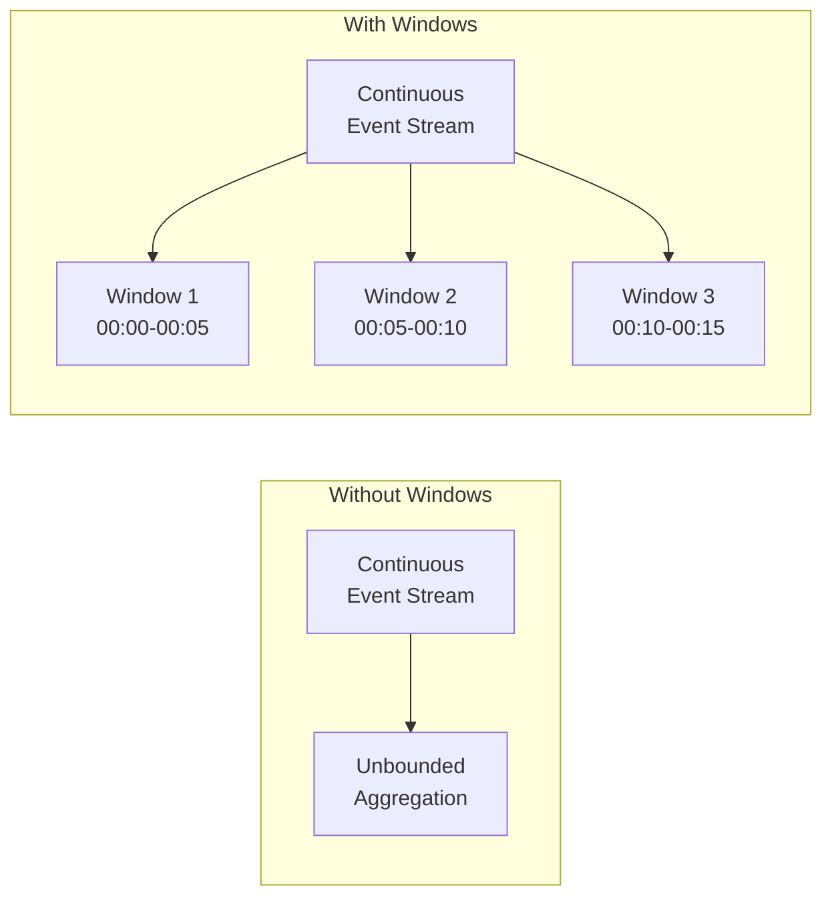
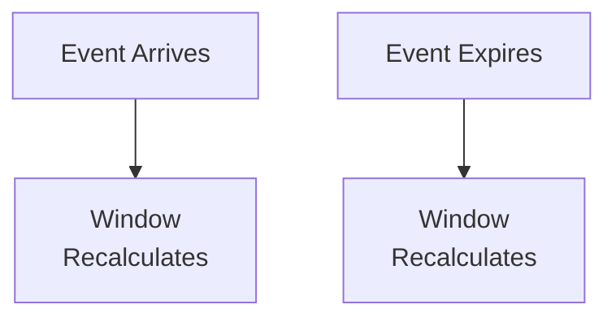

# > Windowing Functions

> __< [Home](../../../../README.md)__ | __= [Overview](../../../01-overview/README.md)__ | __= [Services](../../README.md)__ | __= [Streaming Services](../README.md)__ | __ [Stream Analytics](README.md)__ | __> Windowing Functions__


Advanced time-based windowing functions for temporal aggregations in Azure Stream Analytics.

---

## < Overview

Windowing functions enable aggregation over temporal slices of streaming data. They define how events are grouped by time for aggregate operations like COUNT, SUM, AVG, and custom calculations.

### Why Windows Matter



---

## =
 Window Types

### 1. Tumbling Window

Non-overlapping, fixed-duration windows.

```mermaid
gantt
    title Tumbling Window (5 minutes)
    dateFormat HH:mm
    section Windows
    Window 1 :10:00, 5m
    Window 2 :10:05, 5m
    Window 3 :10:10, 5m
    Window 4 :10:15, 5m
```



```sql
-- Basic tumbling window
SELECT
    deviceId,
    AVG(temperature) AS avgTemp,
    COUNT(*) AS eventCount,
    System.Timestamp() AS windowEnd
INTO
    [output-alias]
FROM
    [input-alias]
GROUP BY
    deviceId,
    TumblingWindow(minute, 5)
```

**Use Cases:**
- Regular interval reporting
- Periodic aggregations
- Fixed-time billing

**Example: 5-Minute Traffic Report**

```sql
-- Count website visits every 5 minutes
SELECT
    pageUrl,
    COUNT(*) AS visitors,
    AVG(responseTime) AS avgResponseTime,
    System.Timestamp() AS windowEnd
INTO
    [traffic-report]
FROM
    [website-events]
GROUP BY
    pageUrl,
    TumblingWindow(minute, 5)
```

### 2. Hopping Window

Overlapping windows with fixed size and hop interval.

```mermaid
gantt
    title Hopping Window (10 min size, 5 min hop)
    dateFormat HH:mm
    section Windows
    Window 1 :10:00, 10m
    Window 2 :10:05, 10m
    Window 3 :10:10, 10m
```



```sql
-- Hopping window for moving averages
SELECT
    deviceId,
    AVG(temperature) AS movingAvg,
    System.Timestamp() AS windowEnd
INTO
    [moving-average-output]
FROM
    [sensor-input]
GROUP BY
    deviceId,
    HoppingWindow(minute, 10, 5)  -- Size: 10 min, Hop: 5 min
```

**Use Cases:**
- Moving averages
- Trend detection
- Overlapping analytics

**Example: 10-Minute Moving Average CPU Usage**

```sql
-- Calculate overlapping CPU usage statistics
SELECT
    serverId,
    AVG(cpuPercent) AS avgCpu,
    MAX(cpuPercent) AS maxCpu,
    STDEV(cpuPercent) AS stdDevCpu,
    System.Timestamp() AS windowEnd
INTO
    [cpu-moving-avg]
FROM
    [server-metrics]
GROUP BY
    serverId,
    HoppingWindow(minute, 10, 2)  -- 10-min window, 2-min hop
```

### 3. Sliding Window

Triggered when events enter or leave the window.



```sql
-- Sliding window for burst detection
SELECT
    deviceId,
    COUNT(*) AS errorCount
INTO
    [error-burst-alerts]
FROM
    [error-logs]
WHERE
    severity = 'ERROR'
GROUP BY
    deviceId,
    SlidingWindow(minute, 5)
HAVING
    COUNT(*) > 10  -- Alert on 10+ errors in 5 minutes
```

**Use Cases:**
- Anomaly detection
- Burst identification
- Real-time thresholds

**Example: Fraud Detection**

```sql
-- Detect multiple failed login attempts
SELECT
    userId,
    COUNT(*) AS failedAttempts,
    COLLECT() AS attemptDetails,
    System.Timestamp() AS detectionTime
INTO
    [fraud-alerts]
FROM
    [login-events]
WHERE
    loginStatus = 'FAILED'
GROUP BY
    userId,
    SlidingWindow(minute, 10)
HAVING
    COUNT(*) >= 5  -- 5+ failed attempts in 10 minutes
```

### 4. Session Window

Dynamic windows based on activity patterns with gaps.

```mermaid
gantt
    title Session Window (5 min timeout)
    dateFormat HH:mm
    section User Sessions
    Session 1 :10:00, 7m
    Idle :10:07, 5m
    Session 2 :10:12, 10m
```



```sql
-- Track user sessions with 30-minute timeout
SELECT
    userId,
    COUNT(*) AS actionsInSession,
    MIN(eventTime) AS sessionStart,
    MAX(eventTime) AS sessionEnd,
    DATEDIFF(minute, MIN(eventTime), MAX(eventTime)) AS sessionDuration
INTO
    [user-sessions]
FROM
    [user-activity]
GROUP BY
    userId,
    SessionWindow(minute, 30, 5)  -- 30-min timeout, 5-min max extension
```

**Use Cases:**
- User session tracking
- Activity-based windows
- Dynamic grouping

**Example: E-commerce Session Analysis**

```sql
-- Analyze shopping sessions
SELECT
    userId,
    COUNT(DISTINCT productId) AS productsViewed,
    SUM(CASE WHEN action = 'ADD_TO_CART' THEN 1 ELSE 0 END) AS itemsAddedToCart,
    MAX(CASE WHEN action = 'PURCHASE' THEN 1 ELSE 0 END) AS purchaseMade,
    DATEDIFF(minute, MIN(eventTime), MAX(eventTime)) AS sessionLength
INTO
    [session-analytics]
FROM
    [clickstream-events]
GROUP BY
    userId,
    SessionWindow(minute, 20, 3)
```

### 5. Snapshot Window

Immediate processing without waiting for window closure.

```sql
-- Snapshot window for latest values
SELECT
    deviceId,
    MAX(timestamp) AS lastUpdate,
    LAST(temperature) AS currentTemperature,
    LAST(status) AS currentStatus
INTO
    [device-state]
FROM
    [device-telemetry]
GROUP BY
    deviceId,
    SnapshotWindow()
```

**Use Cases:**
- Real-time dashboards
- Current state tracking
- Immediate updates

---

## =' Advanced Window Techniques

### Window with PARTITION BY

Parallel processing across partitions.

```sql
-- Process each device independently
SELECT
    deviceId,
    location,
    AVG(temperature) AS avgTemp,
    System.Timestamp() AS windowEnd
INTO
    [partitioned-output]
FROM
    [sensor-input]
GROUP BY
    deviceId,
    location,
    TumblingWindow(minute, 5)
PARTITION BY
    deviceId
```

### Multiple Windows in One Query

```sql
-- Different aggregations for different time windows
WITH MinuteAgg AS (
    SELECT
        deviceId,
        AVG(temperature) AS avgTemp1Min,
        System.Timestamp() AS windowEnd
    FROM
        [sensor-input]
    GROUP BY
        deviceId,
        TumblingWindow(minute, 1)
),
FiveMinuteAgg AS (
    SELECT
        deviceId,
        AVG(temperature) AS avgTemp5Min,
        System.Timestamp() AS windowEnd
    FROM
        [sensor-input]
    GROUP BY
        deviceId,
        TumblingWindow(minute, 5)
)

-- Combine results
SELECT
    m.deviceId,
    m.avgTemp1Min,
    f.avgTemp5Min,
    m.windowEnd
INTO
    [multi-window-output]
FROM
    MinuteAgg m
JOIN
    FiveMinuteAgg f
ON
    m.deviceId = f.deviceId
    AND DATEDIFF(minute, m, f) = 0
```

### Nested Windows

```sql
-- Calculate rate of change across windows
WITH WindowedAvg AS (
    SELECT
        deviceId,
        AVG(temperature) AS avgTemp,
        System.Timestamp() AS windowEnd
    FROM
        [sensor-input]
    GROUP BY
        deviceId,
        TumblingWindow(minute, 5)
)

SELECT
    deviceId,
    avgTemp,
    avgTemp - LAG(avgTemp, 1) OVER (PARTITION BY deviceId LIMIT DURATION(hour, 1)) AS tempChange
INTO
    [trend-analysis]
FROM
    WindowedAvg
```

---

## = Real-world Examples

### Example 1: IoT Temperature Monitoring

```sql
-- Multi-level temperature monitoring
WITH InstantAlerts AS (
    -- Immediate critical alerts (no window)
    SELECT
        deviceId,
        temperature,
        'CRITICAL' AS severity,
        System.Timestamp() AS alertTime
    FROM
        [sensor-input]
    WHERE
        temperature > 100
),
SlidingAverage AS (
    -- Moving average for trend detection
    SELECT
        deviceId,
        AVG(temperature) AS avgTemp,
        System.Timestamp() AS windowEnd
    FROM
        [sensor-input]
    GROUP BY
        deviceId,
        HoppingWindow(minute, 15, 5)
),
HourlyStats AS (
    -- Hourly aggregation for reporting
    SELECT
        deviceId,
        AVG(temperature) AS avgTemp,
        MIN(temperature) AS minTemp,
        MAX(temperature) AS maxTemp,
        STDEV(temperature) AS stdDev,
        System.Timestamp() AS windowEnd
    FROM
        [sensor-input]
    GROUP BY
        deviceId,
        TumblingWindow(hour, 1)
)

-- Output to different destinations
SELECT * INTO [critical-alerts] FROM InstantAlerts
SELECT * INTO [trend-analysis] FROM SlidingAverage
SELECT * INTO [hourly-reports] FROM HourlyStats
```

### Example 2: Website Traffic Analysis

```sql
-- Real-time and aggregated traffic metrics
WITH RealTimeMetrics AS (
    -- Update dashboard every 10 seconds
    SELECT
        pageUrl,
        COUNT(*) AS currentVisitors,
        AVG(responseTime) AS avgResponseTime,
        System.Timestamp() AS timestamp
    FROM
        [web-events]
    GROUP BY
        pageUrl,
        TumblingWindow(second, 10)
),
SessionAnalysis AS (
    -- Track user sessions
    SELECT
        userId,
        COUNT(DISTINCT pageUrl) AS pagesVisited,
        COUNT(*) AS totalClicks,
        DATEDIFF(minute, MIN(eventTime), MAX(eventTime)) AS sessionDuration
    FROM
        [web-events]
    GROUP BY
        userId,
        SessionWindow(minute, 30, 5)
),
HourlyTraffic AS (
    -- Hourly traffic patterns
    SELECT
        DATEPART(hour, System.Timestamp()) AS hourOfDay,
        COUNT(DISTINCT userId) AS uniqueVisitors,
        COUNT(*) AS totalPageViews,
        AVG(responseTime) AS avgResponseTime
    FROM
        [web-events]
    GROUP BY
        TumblingWindow(hour, 1)
)

SELECT * INTO [powerbi-dashboard] FROM RealTimeMetrics
SELECT * INTO [session-storage] FROM SessionAnalysis
SELECT * INTO [traffic-reports] FROM HourlyTraffic
```

### Example 3: Financial Transaction Monitoring

```sql
-- Fraud detection with multiple time windows
WITH TransactionBurst AS (
    -- Detect burst of transactions
    SELECT
        accountId,
        COUNT(*) AS txnCount,
        SUM(amount) AS totalAmount,
        System.Timestamp() AS detectionTime
    FROM
        [transactions]
    GROUP BY
        accountId,
        SlidingWindow(minute, 5)
    HAVING
        COUNT(*) > 10 OR SUM(amount) > 10000
),
DailyPatterns AS (
    -- Normal daily transaction patterns
    SELECT
        accountId,
        COUNT(*) AS dailyTxnCount,
        AVG(amount) AS avgAmount,
        STDEV(amount) AS stdDevAmount,
        System.Timestamp() AS windowEnd
    FROM
        [transactions]
    GROUP BY
        accountId,
        TumblingWindow(day, 1)
),
VelocityCheck AS (
    -- Transaction velocity across regions
    SELECT
        accountId,
        COUNT(DISTINCT location) AS distinctLocations,
        DATEDIFF(minute, MIN(timestamp), MAX(timestamp)) AS timeSpan
    FROM
        [transactions]
    GROUP BY
        accountId,
        SlidingWindow(hour, 1)
    HAVING
        COUNT(DISTINCT location) > 3
        AND DATEDIFF(minute, MIN(timestamp), MAX(timestamp)) < 30
)

SELECT * INTO [fraud-alerts] FROM TransactionBurst
SELECT * INTO [account-profiles] FROM DailyPatterns
SELECT * INTO [velocity-alerts] FROM VelocityCheck
```

---

##  Performance Optimization

### Window Size Selection

```python
# Python utility to recommend window size
def recommend_window_size(
    events_per_second,
    latency_requirement_seconds,
    memory_limit_mb
):
    """
    Recommend optimal window size.

    Args:
        events_per_second: Expected event rate
        latency_requirement_seconds: Maximum acceptable latency
        memory_limit_mb: Available memory for windowing
    """
    # Calculate events per window at different sizes
    window_sizes = [10, 30, 60, 300, 900, 3600]  # seconds

    for window_sec in window_sizes:
        events_per_window = events_per_second * window_sec
        memory_per_window_mb = (events_per_window * 1) / 1024  # Assume 1KB per event

        print(f"\n{window_sec}s window:")
        print(f"  Events per window: {events_per_window:,.0f}")
        print(f"  Memory usage: {memory_per_window_mb:.2f} MB")
        print(f"  Latency: {window_sec}s")

        if memory_per_window_mb > memory_limit_mb:
            print(f"  L Exceeds memory limit")
        elif window_sec > latency_requirement_seconds:
            print(f"  L Exceeds latency requirement")
        else:
            print(f"   Suitable")

# Example usage
recommend_window_size(
    events_per_second=1000,
    latency_requirement_seconds=60,
    memory_limit_mb=100
)
```

### Optimizing Window Queries

```sql
-- L BAD: Unnecessary window overlap
SELECT deviceId, AVG(temp) AS avg1 INTO [out1]
FROM [input] GROUP BY deviceId, TumblingWindow(minute,1)

SELECT deviceId, AVG(temp) AS avg2 INTO [out2]
FROM [input] GROUP BY deviceId, TumblingWindow(minute,1)

--  GOOD: Single window, multiple outputs
SELECT
    deviceId,
    AVG(temp) AS avgTemp,
    MAX(temp) AS maxTemp,
    MIN(temp) AS minTemp
INTO [combined-output]
FROM [input]
GROUP BY deviceId, TumblingWindow(minute,1)
```

---

## = Related Resources

### Core Topics

- [__Stream Processing Basics__](stream-processing-basics.md) - Fundamental concepts
- [__Anomaly Detection__](anomaly-detection.md) - ML-powered analytics
- [__Edge Deployments__](edge-deployments.md) - Deploy to IoT Edge

### Integration Guides

- [__Power BI Streaming__](../../../04-implementation-guides/integration-scenarios/stream-analytics-powerbi.md)
- [__Event Hub Processing__](../../../04-implementation-guides/integration-scenarios/eventhub-stream-analytics.md)

### Best Practices

- [__Query Optimization__](../../../05-best-practices/cross-cutting-concerns/performance/stream-analytics-optimization.md)
- [__Cost Efficiency__](../../../05-best-practices/cross-cutting-concerns/cost-optimization/stream-analytics-cost.md)

---

*Last Updated: 2025-01-28*
*Complexity: Intermediate*
*Estimated Reading Time: 25 minutes*
