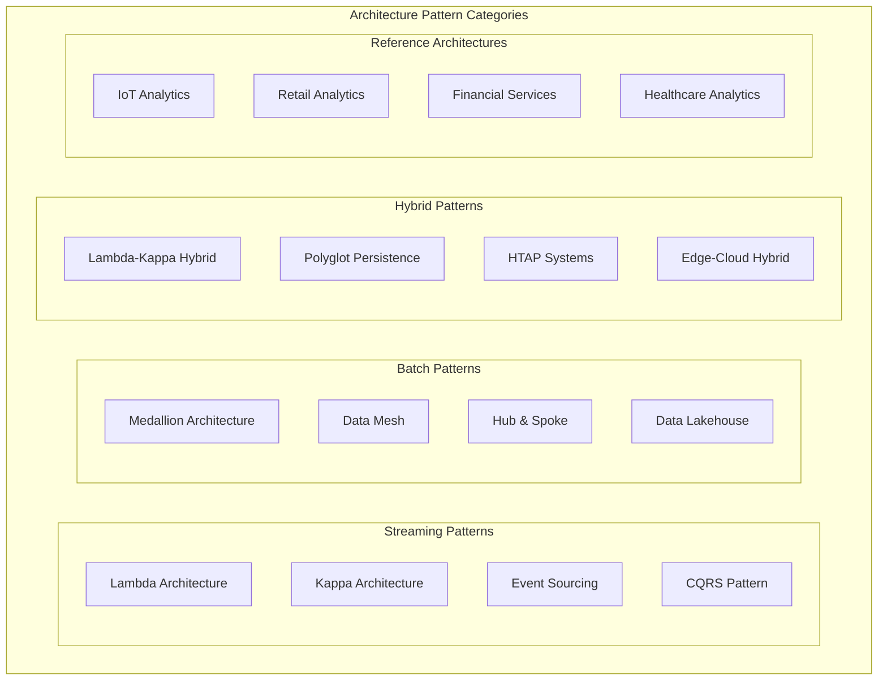
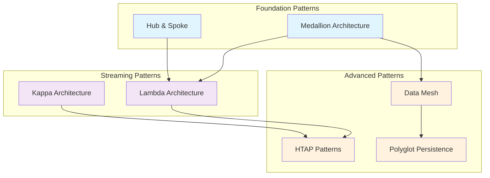

# 🏗️ Cloud Scale Analytics Architecture Patterns

> **🏠 [Home](../../README.md)** | **📖 [Overview](../01-overview/README.md)** | **🏗️ Architecture Patterns**

Proven architectural patterns and reference implementations for Azure Cloud Scale Analytics solutions.

---

## 🎯 Pattern Categories Overview

Modern data architectures require different patterns for different use cases. This section provides battle-tested architectural patterns that solve real-world data challenges at scale.

---

## 🔄 Streaming Architecture Patterns

### ⚡ [Lambda Architecture](streaming-architectures/lambda-architecture.md)

**Handles both batch and stream processing for comprehensive analytics.**

**Key Components**:
- **Batch Layer**: Historical data processing with high accuracy
- **Speed Layer**: Real-time stream processing for low latency
- **Serving Layer**: Unified query interface for both layers

**Best For**: IoT analytics, real-time dashboards, fraud detection

**Services**: Stream Analytics + Synapse + Event Hubs + Data Lake

---

### 🌊 [Kappa Architecture](streaming-architectures/kappa-architecture.md)

**Stream-first architecture that processes all data as infinite streams.**

**Key Components**:
- **Stream Processing Layer**: Single processing paradigm
- **Storage Layer**: Immutable event log
- **Serving Layer**: Stream-derived views

**Best For**: Event-driven systems, continuous processing, time-series analytics

**Services**: Event Hubs + Stream Analytics + Cosmos DB

---

### 📊 [Event Sourcing](streaming-architectures/event-sourcing.md)

**Store all changes as immutable events for complete audit trails.**

**Key Components**:
- **Event Store**: Immutable event log
- **Event Processors**: State reconstruction from events
- **Read Models**: Materialized views for queries

**Best For**: Financial systems, audit requirements, temporal data analysis

**Services**: Event Hubs + Cosmos DB + Azure Functions

---

### 🔀 [CQRS Pattern](streaming-architectures/cqrs-pattern.md)

**Separate read and write models for optimized performance.**

**Key Components**:
- **Command Side**: Write operations optimization
- **Query Side**: Read operations optimization  
- **Event Bus**: Communication between sides

**Best For**: High-performance applications, complex business logic, scalable reads

**Services**: Cosmos DB + Synapse + Event Grid

---

## 📊 Batch Architecture Patterns

### 🏛️ [Medallion Architecture](batch-architectures/medallion-architecture.md)

**Multi-layered approach to data refinement from raw to business-ready.**

**Key Layers**:
- **Bronze Layer**: Raw data ingestion
- **Silver Layer**: Cleaned and conformed data
- **Gold Layer**: Business-ready aggregates

**Best For**: Data lakes, data quality focus, gradual data refinement

**Services**: Synapse Spark + Data Lake Gen2 + Delta Lake

**🎓 [Complete Tutorial Available](../tutorials/architecture-patterns/batch/medallion-architecture-tutorial.md)** - Hands-on walkthrough with IaC, notebooks, and sample data

---

### 🕸️ [Data Mesh](batch-architectures/data-mesh.md)

**Domain-oriented decentralized data ownership and architecture.**

**Key Principles**:
- **Domain Ownership**: Business domains own their data
- **Data as a Product**: Product thinking for data assets
- **Self-serve Platform**: Shared infrastructure and tools
- **Federated Governance**: Distributed governance model

**Best For**: Large enterprises, multiple business units, data democratization

**Services**: Synapse + Data Factory + Purview + Power Platform

---

### 🌟 [Hub and Spoke Model](batch-architectures/hub-spoke-model.md)

**Centralized data warehouse with departmental data marts.**

**Key Components**:
- **Central Hub**: Enterprise data warehouse
- **Spokes**: Departmental data marts
- **Integration Layer**: ETL/ELT processes

**Best For**: Traditional enterprises, centralized governance, established BI teams

**Services**: Synapse Dedicated SQL + Data Factory + Analysis Services

---

## 🔄 Hybrid Architecture Patterns

### ⚡🌊 [Lambda-Kappa Hybrid](hybrid-architectures/lambda-kappa-hybrid.md)

**Combines strengths of both Lambda and Kappa architectures.**

**Key Features**:
- **Flexible Processing**: Choose batch or stream based on use case
- **Unified Storage**: Common data lake foundation
- **Multiple Compute Engines**: Optimized for different workloads

**Best For**: Mixed workload requirements, phased modernization

**Services**: Synapse (all engines) + Event Hubs + Data Lake Gen2

---

### 🗄️ [Polyglot Persistence](hybrid-architectures/polyglot-persistence.md)

**Use different databases optimized for specific data patterns.**

**Key Components**:
- **Relational Stores**: ACID transactions, structured data
- **Document Stores**: Semi-structured, flexible schema
- **Graph Databases**: Relationship-heavy data
- **Time-series Stores**: High-frequency temporal data

**Best For**: Diverse data types, performance optimization, microservices

**Services**: Azure SQL + Cosmos DB + Data Explorer + Synapse

---

### 🔄 [HTAP Patterns](hybrid-architectures/htap-patterns.md)

**Hybrid Transactional/Analytical Processing for real-time insights.**

**Key Features**:
- **Unified Platform**: Same system for transactions and analytics
- **Real-time Analytics**: No ETL delay
- **Operational Intelligence**: Live business insights

**Best For**: Real-time business intelligence, operational analytics

**Services**: Cosmos DB + Synapse Link + Power BI

---

## 🌐 Reference Architectures

### 🏭 [IoT Analytics](reference-architectures/iot-analytics.md)

**Complete IoT data pipeline from device to insights.**

**Architecture Flow**: IoT Devices → Event Hubs → Stream Analytics → Data Lake → Synapse → Power BI

**Key Patterns**: Lambda Architecture, Time-series optimization, Edge computing

---

### 🛒 [Retail Analytics](reference-architectures/retail-analytics.md)

**Customer 360, inventory optimization, and demand forecasting.**

**Architecture Flow**: POS Systems → Data Factory → Data Lake → Synapse → ML Models → Applications

**Key Patterns**: Medallion Architecture, Customer 360, Real-time personalization

---

### 🏦 [Financial Services](reference-architectures/financial-services.md)

**Risk management, compliance, and fraud detection.**

**Architecture Flow**: Trading Systems → Event Hubs → Stream Analytics → Risk Engine → Compliance Reports

**Key Patterns**: Event Sourcing, Real-time risk, Regulatory compliance

---

### 🏥 [Healthcare Analytics](reference-architectures/healthcare-analytics.md)

**Patient analytics, clinical insights, and operational optimization.**

**Architecture Flow**: EHR Systems → Data Factory → FHIR Data Lake → Analytics → Clinical Dashboards

**Key Patterns**: FHIR compliance, Privacy protection, Clinical workflows

---

## 🎯 Pattern Selection Guide

### By Use Case

| Use Case | Recommended Pattern | Key Services | Complexity |
|----------|-------------------|-------------|-----------|
| **Real-time Dashboards** | Lambda Architecture | Stream Analytics, Event Hubs, Synapse |  |
| **Data Lake Analytics** | Medallion Architecture | Synapse Spark, Data Lake Gen2, Delta Lake |  |
| **Enterprise Data Warehouse** | Hub & Spoke | Synapse Dedicated SQL, Data Factory |  |
| **Event-Driven Systems** | Event Sourcing + CQRS | Event Hubs, Cosmos DB, Functions |  |
| **IoT Analytics** | Lambda + Time-series | Stream Analytics, Data Explorer, Event Hubs |  |
| **Multi-Domain Enterprise** | Data Mesh | Multiple Synapse, Data Factory, Purview |  |

### By Data Characteristics

| Data Type | Volume | Latency | Pattern |
|-----------|---------|---------|---------|
| **Streaming Events** | High | Low | Kappa Architecture |
| **Mixed Batch + Stream** | High | Mixed | Lambda Architecture |
| **Enterprise Data** | Medium | High | Hub & Spoke |
| **Domain-specific** | Medium | Mixed | Data Mesh |
| **Time-series** | High | Low | HTAP + Time-series |

### By Organizational Maturity

#### 🌱 **Starting Out**
**Recommended**: Medallion Architecture with Synapse
- Clear data quality progression
- Familiar SQL-based processing
- Scalable foundation

#### 🔧 **Intermediate**
**Recommended**: Lambda Architecture or Hub & Spoke
- Proven enterprise patterns
- Balance of complexity and capability
- Good tooling support

#### 🚀 **Advanced**
**Recommended**: Data Mesh or Custom Hybrid
- Domain-driven architecture
- Advanced governance patterns
- Innovation-focused

---

## 📊 Implementation Roadmap

### Phase 1: Foundation (Months 1-3)
1. **Choose Core Pattern** based on primary use case
2. **Set up Data Lake** with proper security and governance
3. **Implement Basic Pipeline** with one compute engine
4. **Establish Monitoring** and basic data quality checks

### Phase 2: Expansion (Months 4-6)
1. **Add Second Compute Engine** (if hybrid pattern)
2. **Implement Advanced Features** (streaming, ML, etc.)
3. **Enhance Security** with advanced features
4. **Scale to Production** workloads

### Phase 3: Optimization (Months 7-12)
1. **Performance Tuning** based on usage patterns
2. **Advanced Governance** with full data lineage
3. **Multi-Environment** setup (dev/test/prod)
4. **Disaster Recovery** and business continuity

---

## 🔗 Pattern Relationships

---

## 📚 Additional Resources

### 🎓 **Learning Path**
1. Start with [**Service Overview**](../02-services/README.md) to understand capabilities
2. Choose your pattern based on [**Selection Guide**](#pattern-selection-guide)
3. Follow [**Implementation Guides**](../04-implementation-guides/README.md) for step-by-step setup
4. Apply [**Best Practices**](../05-best-practices/README.md) for production readiness

### 🔧 **Implementation Support**
- [**Code Examples**](../06-code-examples/README.md) - Sample implementations
- [**Troubleshooting**](../07-troubleshooting/README.md) - Common issues and solutions
- [**Monitoring**](../09-monitoring/README.md) - Observability patterns
- [**Security**](../10-security/README.md) - Security patterns and practices

### 📖 **Reference Materials**
- [**Configuration Reference**](../08-reference/README.md) - Detailed configuration options
- [**API Documentation**](../08-reference/api-references/README.md) - Service API references
- [**Limits and Quotas**](../08-reference/limits-quotas/README.md) - Service limitations

---

*Last Updated: 2025-01-28*  
*Patterns Documented: 20+*  
*Coverage: Complete*