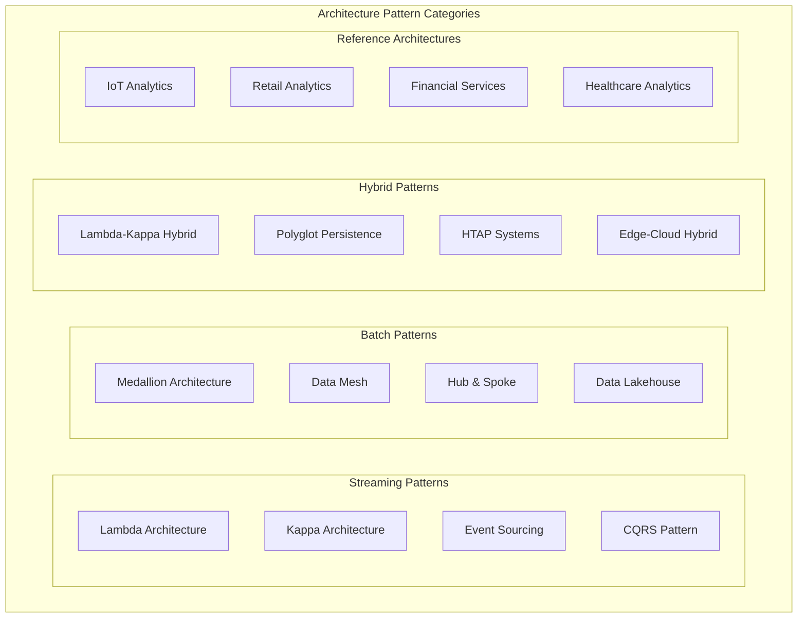
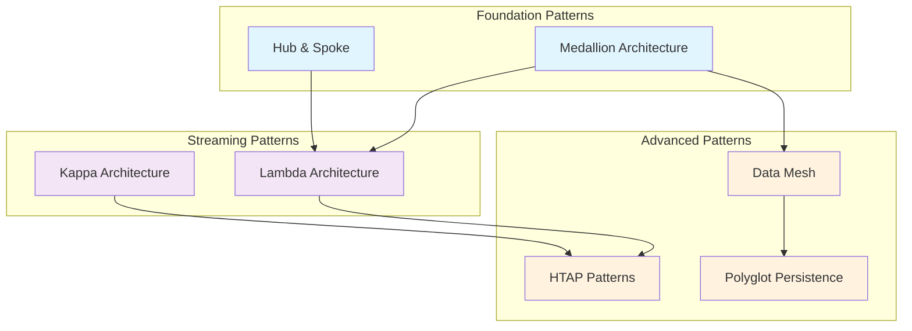

# 🏗️ Cloud Scale Analytics Architecture Patterns

> __🏠 [Home](../../README.md)__ | __📖 [Overview](../01-overview/README.md)__ | __🏗️ Architecture Patterns__

Proven architectural patterns and reference implementations for Azure Cloud Scale Analytics solutions.

---

## 🎯 Pattern Categories Overview

Modern data architectures require different patterns for different use cases. This section provides battle-tested architectural patterns that solve real-world data challenges at scale.

---

## 🔄 Streaming Architecture Patterns

### ⚡ [Lambda Architecture](streaming-architectures/lambda-architecture.md)

__Handles both batch and stream processing for comprehensive analytics.__

__Key Components__:

- __Batch Layer__: Historical data processing with high accuracy
- __Speed Layer__: Real-time stream processing for low latency
- __Serving Layer__: Unified query interface for both layers

__Best For__: IoT analytics, real-time dashboards, fraud detection

__Services__: Stream Analytics + Synapse + Event Hubs + Data Lake

---

### 🌊 [Kappa Architecture](streaming-architectures/kappa-architecture.md)

__Stream-first architecture that processes all data as infinite streams.__

__Key Components__:

- __Stream Processing Layer__: Single processing paradigm
- __Storage Layer__: Immutable event log
- __Serving Layer__: Stream-derived views

__Best For__: Event-driven systems, continuous processing, time-series analytics

__Services__: Event Hubs + Stream Analytics + Cosmos DB

---

### 📊 [Event Sourcing](streaming-architectures/event-sourcing.md)

__Store all changes as immutable events for complete audit trails.__

__Key Components__:

- __Event Store__: Immutable event log
- __Event Processors__: State reconstruction from events
- __Read Models__: Materialized views for queries

__Best For__: Financial systems, audit requirements, temporal data analysis

__Services__: Event Hubs + Cosmos DB + Azure Functions

---

### 🔀 [CQRS Pattern](streaming-architectures/cqrs-pattern.md)

__Separate read and write models for optimized performance.__

__Key Components__:

- __Command Side__: Write operations optimization
- __Query Side__: Read operations optimization  
- __Event Bus__: Communication between sides

__Best For__: High-performance applications, complex business logic, scalable reads

__Services__: Cosmos DB + Synapse + Event Grid

---

## 📊 Batch Architecture Patterns

### 🏛️ [Medallion Architecture](batch-architectures/medallion-architecture.md)

__Multi-layered approach to data refinement from raw to business-ready.__

__Key Layers__:

- __Bronze Layer__: Raw data ingestion
- __Silver Layer__: Cleaned and conformed data
- __Gold Layer__: Business-ready aggregates

__Best For__: Data lakes, data quality focus, gradual data refinement

__Services__: Synapse Spark + Data Lake Gen2 + Delta Lake

__🎓 [Complete Tutorial Available](../tutorials/architecture-patterns/batch/medallion-architecture-tutorial.md)__ - Hands-on walkthrough with IaC, notebooks, and sample data

---

### 🕸️ [Data Mesh](batch-architectures/data-mesh.md)

__Domain-oriented decentralized data ownership and architecture.__

__Key Principles__:

- __Domain Ownership__: Business domains own their data
- __Data as a Product__: Product thinking for data assets
- __Self-serve Platform__: Shared infrastructure and tools
- __Federated Governance__: Distributed governance model

__Best For__: Large enterprises, multiple business units, data democratization

__Services__: Synapse + Data Factory + Purview + Power Platform

---

### 🌟 [Hub and Spoke Model](batch-architectures/hub-spoke-model.md)

__Centralized data warehouse with departmental data marts.__

__Key Components__:

- __Central Hub__: Enterprise data warehouse
- __Spokes__: Departmental data marts
- __Integration Layer__: ETL/ELT processes

__Best For__: Traditional enterprises, centralized governance, established BI teams

__Services__: Synapse Dedicated SQL + Data Factory + Analysis Services

---

## 🔄 Hybrid Architecture Patterns

### ⚡🌊 [Lambda-Kappa Hybrid](hybrid-architectures/lambda-kappa-hybrid.md)

__Combines strengths of both Lambda and Kappa architectures.__

__Key Features__:

- __Flexible Processing__: Choose batch or stream based on use case
- __Unified Storage__: Common data lake foundation
- __Multiple Compute Engines__: Optimized for different workloads

__Best For__: Mixed workload requirements, phased modernization

__Services__: Synapse (all engines) + Event Hubs + Data Lake Gen2

---

### 🗄️ [Polyglot Persistence](hybrid-architectures/polyglot-persistence.md)

__Use different databases optimized for specific data patterns.__

__Key Components__:

- __Relational Stores__: ACID transactions, structured data
- __Document Stores__: Semi-structured, flexible schema
- __Graph Databases__: Relationship-heavy data
- __Time-series Stores__: High-frequency temporal data

__Best For__: Diverse data types, performance optimization, microservices

__Services__: Azure SQL + Cosmos DB + Data Explorer + Synapse

---

### 🔄 [HTAP Patterns](hybrid-architectures/htap-patterns.md)

__Hybrid Transactional/Analytical Processing for real-time insights.__

__Key Features__:

- __Unified Platform__: Same system for transactions and analytics
- __Real-time Analytics__: No ETL delay
- __Operational Intelligence__: Live business insights

__Best For__: Real-time business intelligence, operational analytics

__Services__: Cosmos DB + Synapse Link + Power BI

---

## 🌐 Reference Architectures

### 🏭 [IoT Analytics](reference-architectures/iot-analytics.md)

__Complete IoT data pipeline from device to insights.__

__Architecture Flow__: IoT Devices → Event Hubs → Stream Analytics → Data Lake → Synapse → Power BI

__Key Patterns__: Lambda Architecture, Time-series optimization, Edge computing

---

### 🛒 [Retail Analytics](reference-architectures/retail-analytics.md)

__Customer 360, inventory optimization, and demand forecasting.__

__Architecture Flow__: POS Systems → Data Factory → Data Lake → Synapse → ML Models → Applications

__Key Patterns__: Medallion Architecture, Customer 360, Real-time personalization

---

### 🏦 [Financial Services](reference-architectures/financial-services.md)

__Risk management, compliance, and fraud detection.__

__Architecture Flow__: Trading Systems → Event Hubs → Stream Analytics → Risk Engine → Compliance Reports

__Key Patterns__: Event Sourcing, Real-time risk, Regulatory compliance

---

### 🏥 [Healthcare Analytics](reference-architectures/healthcare-analytics.md)

__Patient analytics, clinical insights, and operational optimization.__

__Architecture Flow__: EHR Systems → Data Factory → FHIR Data Lake → Analytics → Clinical Dashboards

__Key Patterns__: FHIR compliance, Privacy protection, Clinical workflows

---

## 🎯 Pattern Selection Guide

### By Use Case

| Use Case | Recommended Pattern | Key Services | Complexity |
| ---------- | ------------------- | ------------- | ----------- |
| __Real-time Dashboards__ | Lambda Architecture | Stream Analytics, Event Hubs, Synapse |  |
| __Data Lake Analytics__ | Medallion Architecture | Synapse Spark, Data Lake Gen2, Delta Lake |  |
| __Enterprise Data Warehouse__ | Hub & Spoke | Synapse Dedicated SQL, Data Factory |  |
| __Event-Driven Systems__ | Event Sourcing + CQRS | Event Hubs, Cosmos DB, Functions |  |
| __IoT Analytics__ | Lambda + Time-series | Stream Analytics, Data Explorer, Event Hubs |  |
| __Multi-Domain Enterprise__ | Data Mesh | Multiple Synapse, Data Factory, Purview |  |

### By Data Characteristics

| Data Type | Volume | Latency | Pattern |
| ----------- | --------- | --------- | --------- |
| __Streaming Events__ | High | Low | Kappa Architecture |
| __Mixed Batch + Stream__ | High | Mixed | Lambda Architecture |
| __Enterprise Data__ | Medium | High | Hub & Spoke |
| __Domain-specific__ | Medium | Mixed | Data Mesh |
| __Time-series__ | High | Low | HTAP + Time-series |

### By Organizational Maturity

#### 🌱 __Starting Out__

__Recommended__: Medallion Architecture with Synapse

- Clear data quality progression
- Familiar SQL-based processing
- Scalable foundation

#### 🔧 __Intermediate__

__Recommended__: Lambda Architecture or Hub & Spoke

- Proven enterprise patterns
- Balance of complexity and capability
- Good tooling support

#### 🚀 __Advanced__

__Recommended__: Data Mesh or Custom Hybrid

- Domain-driven architecture
- Advanced governance patterns
- Innovation-focused

---

## 📊 Implementation Roadmap

### Phase 1: Foundation (Months 1-3)

1. __Choose Core Pattern__ based on primary use case
2. __Set up Data Lake__ with proper security and governance
3. __Implement Basic Pipeline__ with one compute engine
4. __Establish Monitoring__ and basic data quality checks

### Phase 2: Expansion (Months 4-6)

1. __Add Second Compute Engine__ (if hybrid pattern)
2. __Implement Advanced Features__ (streaming, ML, etc.)
3. __Enhance Security__ with advanced features
4. __Scale to Production__ workloads

### Phase 3: Optimization (Months 7-12)

1. __Performance Tuning__ based on usage patterns
2. __Advanced Governance__ with full data lineage
3. __Multi-Environment__ setup (dev/test/prod)
4. __Disaster Recovery__ and business continuity

---

## 🔗 Pattern Relationships

---

## 📚 Additional Resources

### 🎓 __Learning Path__

1. Start with [__Service Overview__](../02-services/README.md) to understand capabilities
2. Choose your pattern based on [__Selection Guide__](#pattern-selection-guide)
3. Follow [__Implementation Guides__](../04-implementation-guides/README.md) for step-by-step setup
4. Apply [__Best Practices__](../05-best-practices/README.md) for production readiness

### 🔧 __Implementation Support__

- [__Code Examples__](../06-code-examples/README.md) - Sample implementations
- [__Troubleshooting__](../07-troubleshooting/README.md) - Common issues and solutions
- [__Monitoring__](../09-monitoring/README.md) - Observability patterns
- [__Security__](../10-security/README.md) - Security patterns and practices

### 📖 __Reference Materials__

- [__Configuration Reference__](../08-reference/README.md) - Detailed configuration options
- [__API Documentation__](../08-reference/api-references/README.md) - Service API references
- [__Limits and Quotas__](../08-reference/limits-quotas/README.md) - Service limitations

---

*Last Updated: 2025-01-28*  
*Patterns Documented: 20+*  
*Coverage: Complete*
