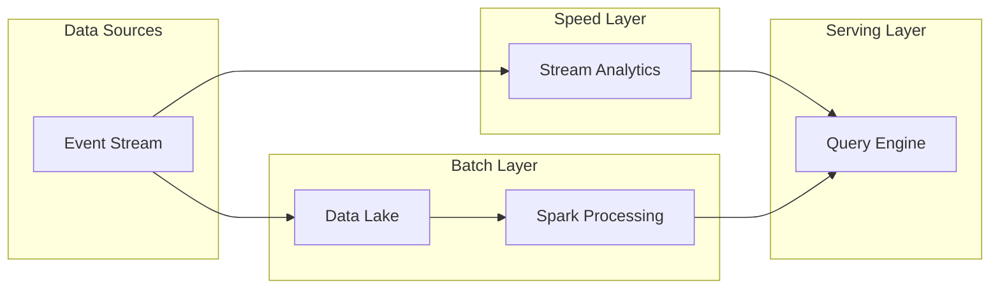
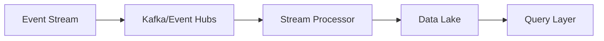
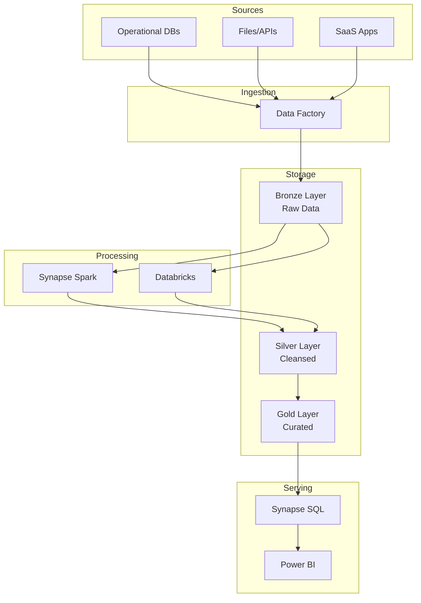

# 📦 Batch Architecture Patterns

> __🏠 [Home](../../../README.md)__ | __🏗️ [Architecture](../README.md)__ | __📦 Batch Architectures__

Reference architectures and patterns for batch data processing workloads.

---

## 🎯 Overview

Batch processing handles large volumes of data in scheduled intervals, ideal for:

- **ETL/ELT pipelines**: Transforming and loading data into analytics systems
- **Data warehousing**: Building dimensional models for reporting
- **Historical analysis**: Processing accumulated data for insights
- **Machine learning**: Training models on large datasets

---

## 📊 Pattern Catalog

### [Data Warehouse Patterns](data-warehouse-patterns.md)

Classic dimensional modeling and modern lakehouse approaches.

| Pattern | Use Case | Azure Services |
|---------|----------|----------------|
| Star Schema | OLAP reporting | Synapse Dedicated SQL |
| Snowflake Schema | Complex hierarchies | Synapse Dedicated SQL |
| Data Vault | Auditable history | Databricks, Synapse |
| Medallion | Lakehouse layers | Databricks, Synapse Spark |

### Lambda Architecture

Combining batch and real-time processing layers.

### Kappa Architecture

Simplified architecture using stream processing for both real-time and batch.

---

## 🏗️ Reference Architecture

### Modern Data Warehouse

---

## 📚 Related Documentation

- [Streaming Architectures](../streaming-architectures/README.md)
- [Hybrid Architectures](../hybrid-architectures/README.md)
- [Implementation Guides](../../04-implementation-guides/README.md)

---

*Last Updated: January 2025*
