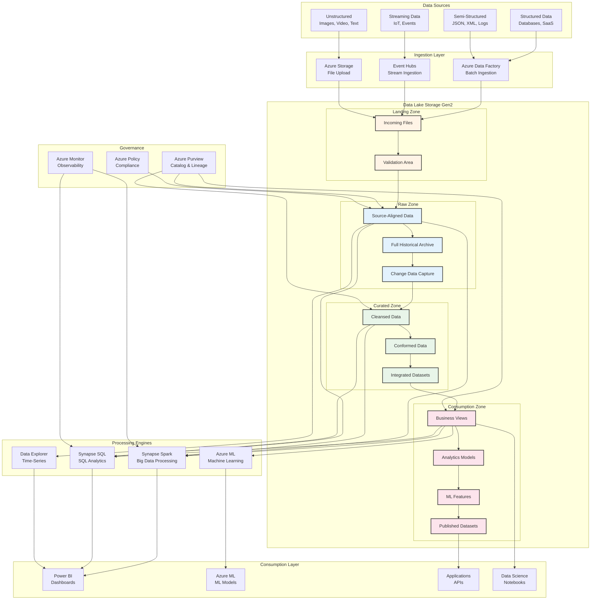
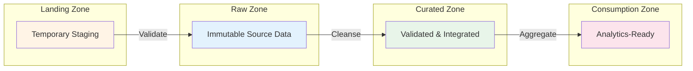
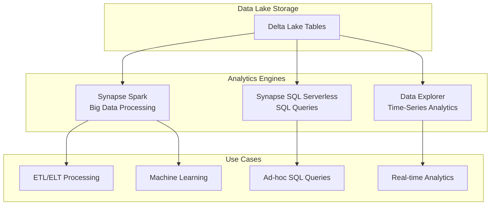

# Data Lake Analytics Architecture Pattern

> **🏠 [Home](../../../README.md)** | **📖 [Documentation](../../README.md)** | **🏗️ [Architecture Patterns](../README.md)** | **Data Lake Analytics**


Comprehensive data lake architecture pattern with organized zones (raw, curated, consumption), multi-engine analytics, and enterprise governance for scalable big data processing.

---

## Table of Contents

- [Overview](#overview)
- [Data Lake Zones](#data-lake-zones)
- [Multi-Engine Analytics](#multi-engine-analytics)
- [Governance Framework](#governance-framework)
- [Azure Service Mapping](#azure-service-mapping)
- [Best Practices](#best-practices)
- [Cost Optimization](#cost-optimization)

---

## Overview

The Data Lake Analytics pattern provides a scalable, flexible foundation for storing and analyzing structured, semi-structured, and unstructured data at any scale. This pattern emphasizes organized zones, multi-engine analytics, and comprehensive governance.

### Key Benefits

- **Schema Flexibility**: Store data in native formats without upfront schema definition
- **Scalability**: Petabyte-scale storage and processing capabilities
- **Multi-Engine Support**: Query same data with Spark, SQL, and specialized engines
- **Cost Efficiency**: Separate storage and compute, pay only for what you use
- **Unified Platform**: Single repository for all data types and analytics workloads
- **Future-Proof**: Adapt to changing requirements without data migration

### High-Level Architecture



---

## Data Lake Zones

### Zone Architecture



### 1. Landing Zone

**Purpose**: Temporary staging area for incoming data

**Characteristics**:
- Short retention period (7-30 days)
- Minimal processing
- File format validation
- Virus scanning (if applicable)
- Quick ingestion and validation

**Directory Structure**:
```text
landing/
├── inbound/
│   ├── salesforce/{YYYY-MM-DD}/
│   ├── sap/{YYYY-MM-DD}/
│   └── web-logs/{YYYY-MM-DD}/
├── validated/
│   └── ready-for-raw/
└── failed/
    └── quarantine/
```

**Implementation**:
```python
from pyspark.sql import DataFrame
from pyspark.sql.functions import input_file_name, current_timestamp

class LandingZoneProcessor:
    """
    Process files in landing zone with validation
    """

    def __init__(self, spark, landing_path: str, raw_path: str):
        self.spark = spark
        self.landing_path = landing_path
        self.raw_path = raw_path

    def process_landing_files(self, source_system: str, file_pattern: str):
        """
        Validate and move files from landing to raw
        """

        landing_files = f"{self.landing_path}/inbound/{source_system}/{file_pattern}"

        try:
            # Read files with schema inference
            df = self.spark.read \
                .option("inferSchema", "true") \
                .option("header", "true") \
                .csv(landing_files)

            # Add metadata
            df_with_meta = df \
                .withColumn("_source_file", input_file_name()) \
                .withColumn("_landing_timestamp", current_timestamp()) \
                .withColumn("_source_system", lit(source_system))

            # Validate file structure
            if self._validate_schema(df_with_meta, source_system):
                # Move to raw zone
                raw_destination = f"{self.raw_path}/{source_system}"

                df_with_meta.write \
                    .format("delta") \
                    .mode("append") \
                    .partitionBy("_landing_timestamp") \
                    .save(raw_destination)

                # Archive landing files
                self._archive_files(landing_files)

                return {"status": "success", "records": df.count()}
            else:
                # Move to failed/quarantine
                self._quarantine_files(landing_files, "schema_validation_failed")
                return {"status": "failed", "reason": "schema_validation"}

        except Exception as e:
            self._quarantine_files(landing_files, str(e))
            return {"status": "error", "error": str(e)}

    def _validate_schema(self, df: DataFrame, source_system: str) -> bool:
        """Validate schema against expected structure"""
        # Implement schema validation logic
        return True

    def _archive_files(self, file_pattern: str):
        """Move files to validated folder"""
        # Implementation for file archival
        pass

    def _quarantine_files(self, file_pattern: str, reason: str):
        """Move failed files to quarantine"""
        # Implementation for quarantine
        pass
```

### 2. Raw Zone

**Purpose**: Immutable, source-aligned data repository

**Characteristics**:
- Preserves original data format
- Complete historical archive
- Write-once, read-many pattern
- Optimized for data recovery and reprocessing
- Long retention (indefinite or compliance-driven)

**Directory Structure**:
```text
raw/
├── erp/
│   ├── sales/
│   │   ├── year=2024/month=01/
│   │   └── year=2024/month=02/
│   └── inventory/
├── crm/
│   ├── accounts/
│   ├── contacts/
│   └── opportunities/
└── web-analytics/
    ├── clickstream/
    └── sessions/
```

**Implementation**:
```python
class RawZoneLoader:
    """
    Load data into raw zone with immutable pattern
    """

    def __init__(self, spark, raw_path: str):
        self.spark = spark
        self.raw_path = raw_path

    def append_to_raw(self, df: DataFrame, source_system: str,
                      entity: str, partition_column: str = None):
        """
        Append data to raw zone (immutable)
        """

        raw_table_path = f"{self.raw_path}/{source_system}/{entity}"

        # Add raw zone metadata
        df_raw = df \
            .withColumn("_raw_ingestion_time", current_timestamp()) \
            .withColumn("_raw_partition_date", current_date()) \
            .withColumn("_raw_batch_id", lit(uuid.uuid4().hex))

        # Write with append-only pattern
        write_op = df_raw.write \
            .format("delta") \
            .mode("append") \
            .option("mergeSchema", "true")  # Allow schema evolution

        if partition_column:
            write_op = write_op.partitionBy(partition_column)

        write_op.save(raw_table_path)

        # Enable Change Data Feed for downstream processing
        spark.sql(f"""
            ALTER TABLE delta.`{raw_table_path}`
            SET TBLPROPERTIES (delta.enableChangeDataFeed = true)
        """)

        return raw_table_path

# Example usage
raw_loader = RawZoneLoader(spark, "abfss://raw@datalake.dfs.core.windows.net")

sales_df = spark.read.format("csv") \
    .option("header", "true") \
    .load("landing/validated/erp/sales/")

raw_loader.append_to_raw(
    df=sales_df,
    source_system="erp",
    entity="sales",
    partition_column="_raw_partition_date"
)
```

### 3. Curated Zone

**Purpose**: Cleansed, validated, and integrated data

**Characteristics**:
- Schema enforcement
- Data quality validation
- Business rules applied
- Master data integration
- Deduplication and standardization
- Optimized for analytics queries

**Directory Structure**:
```text
curated/
├── dimensions/
│   ├── dim_customer/
│   ├── dim_product/
│   └── dim_date/
├── facts/
│   ├── fact_sales/
│   ├── fact_inventory/
│   └── fact_web_events/
└── conformed/
    ├── customer_360/
    └── product_catalog/
```

**Implementation**:
```python
class CuratedZoneProcessor:
    """
    Process raw data into curated zone with quality checks
    """

    def __init__(self, spark, raw_path: str, curated_path: str):
        self.spark = spark
        self.raw_path = raw_path
        self.curated_path = curated_path

    def curate_dimension(self, raw_entity: str, curated_entity: str,
                         business_rules: dict):
        """
        Create curated dimension with quality checks
        """

        # Read from raw zone
        raw_df = spark.read.format("delta") \
            .load(f"{self.raw_path}/{raw_entity}")

        # Apply cleansing rules
        curated_df = self._apply_cleansing(raw_df, business_rules)

        # Validate data quality
        quality_report = self._validate_quality(curated_df, business_rules)

        if quality_report['passed']:
            # Write to curated zone
            curated_path = f"{self.curated_path}/dimensions/{curated_entity}"

            curated_df.write \
                .format("delta") \
                .mode("overwrite") \
                .option("overwriteSchema", "true") \
                .save(curated_path)

            # Optimize for query performance
            from delta.tables import DeltaTable
            delta_table = DeltaTable.forPath(spark, curated_path)
            delta_table.optimize().executeCompaction()

            if business_rules.get('z_order_columns'):
                delta_table.optimize().executeZOrderBy(
                    *business_rules['z_order_columns']
                )

            return {"status": "success", "path": curated_path}
        else:
            return {"status": "failed", "quality_report": quality_report}

    def _apply_cleansing(self, df: DataFrame, rules: dict) -> DataFrame:
        """Apply cleansing transformations"""

        cleansed_df = df

        # Remove duplicates
        if rules.get('deduplicate_on'):
            cleansed_df = cleansed_df.dropDuplicates(rules['deduplicate_on'])

        # Standardize columns
        for col_name, transformation in rules.get('standardize', {}).items():
            cleansed_df = cleansed_df.withColumn(
                col_name,
                expr(transformation)
            )

        # Filter invalid records
        if rules.get('filter_condition'):
            cleansed_df = cleansed_df.filter(rules['filter_condition'])

        return cleansed_df

    def _validate_quality(self, df: DataFrame, rules: dict) -> dict:
        """Validate data quality metrics"""

        total_count = df.count()
        quality_metrics = {}

        # Check completeness
        for col_name in rules.get('required_columns', []):
            null_count = df.filter(col(col_name).isNull()).count()
            completeness = (total_count - null_count) / total_count
            quality_metrics[f"{col_name}_completeness"] = completeness

        # Check if all metrics meet thresholds
        threshold = rules.get('quality_threshold', 0.95)
        passed = all(metric >= threshold for metric in quality_metrics.values())

        return {
            "passed": passed,
            "metrics": quality_metrics,
            "threshold": threshold
        }

# Example usage
curated_processor = CuratedZoneProcessor(
    spark,
    "abfss://raw@datalake.dfs.core.windows.net",
    "abfss://curated@datalake.dfs.core.windows.net"
)

customer_rules = {
    "deduplicate_on": ["customer_id"],
    "standardize": {
        "email": "lower(trim(email))",
        "country_code": "upper(country_code)"
    },
    "filter_condition": "customer_id IS NOT NULL AND email IS NOT NULL",
    "required_columns": ["customer_id", "email", "country_code"],
    "quality_threshold": 0.95,
    "z_order_columns": ["customer_id", "country_code"]
}

result = curated_processor.curate_dimension(
    raw_entity="crm/customers",
    curated_entity="dim_customer",
    business_rules=customer_rules
)
```

### 4. Consumption Zone

**Purpose**: Analytics-ready, optimized datasets for end-user consumption

**Characteristics**:
- Business-friendly schemas
- Pre-aggregated metrics
- Optimized for specific use cases
- Denormalized for performance
- Feature stores for ML
- Published datasets with SLAs

**Directory Structure**:
```text
consumption/
├── business-views/
│   ├── sales-dashboard/
│   ├── customer-analytics/
│   └── product-performance/
├── ml-features/
│   ├── customer-churn/
│   ├── product-recommendation/
│   └── demand-forecast/
└── published-datasets/
    ├── customer-360/
    ├── sales-performance/
    └── inventory-status/
```

**Implementation**:
```python
class ConsumptionZoneBuilder:
    """
    Build consumption-ready datasets
    """

    def __init__(self, spark, curated_path: str, consumption_path: str):
        self.spark = spark
        self.curated_path = curated_path
        self.consumption_path = consumption_path

    def build_business_view(self, view_config: dict):
        """
        Create business view from curated data
        """

        # Read curated dimensions and facts
        datasets = {}
        for entity, path in view_config['sources'].items():
            datasets[entity] = spark.read.format("delta") \
                .load(f"{self.curated_path}/{path}")

        # Join datasets
        result_df = datasets[view_config['base_table']]

        for join_config in view_config['joins']:
            result_df = result_df.join(
                datasets[join_config['table']],
                join_config['condition'],
                join_config.get('how', 'left')
            )

        # Apply aggregations
        if view_config.get('group_by'):
            agg_exprs = [
                expr(agg['expression']).alias(agg['name'])
                for agg in view_config['aggregations']
            ]

            result_df = result_df \
                .groupBy(view_config['group_by']) \
                .agg(*agg_exprs)

        # Add calculated metrics
        for calc in view_config.get('calculated_columns', []):
            result_df = result_df.withColumn(
                calc['name'],
                expr(calc['expression'])
            )

        # Write to consumption zone
        consumption_path = f"{self.consumption_path}/business-views/{view_config['view_name']}"

        result_df.write \
            .format("delta") \
            .mode("overwrite") \
            .partitionBy(view_config.get('partition_by', [])) \
            .save(consumption_path)

        # Create external table for SQL access
        spark.sql(f"""
            CREATE OR REPLACE TABLE consumption.{view_config['view_name']}
            USING DELTA
            LOCATION '{consumption_path}'
        """)

        return consumption_path

# Example: Customer 360 view
customer_360_config = {
    "view_name": "customer_360_view",
    "sources": {
        "customers": "dimensions/dim_customer",
        "orders": "facts/fact_sales",
        "support": "facts/fact_support_tickets"
    },
    "base_table": "customers",
    "joins": [
        {
            "table": "orders",
            "condition": "customers.customer_id = orders.customer_id",
            "how": "left"
        },
        {
            "table": "support",
            "condition": "customers.customer_id = support.customer_id",
            "how": "left"
        }
    ],
    "group_by": [
        "customers.customer_id",
        "customers.customer_name",
        "customers.email",
        "customers.country_code"
    ],
    "aggregations": [
        {"name": "total_orders", "expression": "COUNT(DISTINCT orders.order_id)"},
        {"name": "total_revenue", "expression": "SUM(orders.order_amount)"},
        {"name": "total_support_tickets", "expression": "COUNT(DISTINCT support.ticket_id)"},
        {"name": "avg_order_value", "expression": "AVG(orders.order_amount)"}
    ],
    "calculated_columns": [
        {
            "name": "customer_segment",
            "expression": """
                CASE
                    WHEN total_revenue > 100000 THEN 'Platinum'
                    WHEN total_revenue > 50000 THEN 'Gold'
                    WHEN total_revenue > 10000 THEN 'Silver'
                    ELSE 'Bronze'
                END
            """
        },
        {
            "name": "health_score",
            "expression": """
                CASE
                    WHEN total_support_tickets = 0 AND total_orders > 10 THEN 100
                    WHEN total_support_tickets <= 2 THEN 80
                    WHEN total_support_tickets <= 5 THEN 60
                    ELSE 40
                END
            """
        }
    ],
    "partition_by": ["country_code"]
}

consumption_builder = ConsumptionZoneBuilder(
    spark,
    "abfss://curated@datalake.dfs.core.windows.net",
    "abfss://consumption@datalake.dfs.core.windows.net"
)

consumption_builder.build_business_view(customer_360_config)
```

---

## Multi-Engine Analytics

### Query Same Data with Multiple Engines



### Spark Processing

```python
# Process large datasets with Spark
sales_df = spark.read.format("delta") \
    .load("abfss://curated@datalake.dfs.core.windows.net/facts/fact_sales")

monthly_summary = sales_df \
    .groupBy("year", "month", "country") \
    .agg(
        sum("order_amount").alias("total_revenue"),
        count("order_id").alias("order_count"),
        countDistinct("customer_id").alias("unique_customers")
    )

monthly_summary.write \
    .format("delta") \
    .mode("overwrite") \
    .partitionBy("year", "month") \
    .save("abfss://consumption@datalake.dfs.core.windows.net/business-views/monthly-sales")
```

### SQL Serverless Queries

```sql
-- Query same data with T-SQL
CREATE OR REPLACE VIEW consumption.monthly_sales_summary
AS
SELECT
    year,
    month,
    country,
    SUM(order_amount) AS total_revenue,
    COUNT(order_id) AS order_count,
    COUNT(DISTINCT customer_id) AS unique_customers
FROM
    OPENROWSET(
        BULK 'https://datalake.dfs.core.windows.net/curated/facts/fact_sales/',
        FORMAT = 'DELTA'
    ) AS sales
GROUP BY
    year, month, country;

-- Query the view
SELECT * FROM consumption.monthly_sales_summary
WHERE year = 2024 AND month = 1;
```

---

## Governance Framework

### Comprehensive Governance

```mermaid
graph TB
    subgraph "Data Catalog"
        DC1[Asset Discovery]
        DC2[Business Glossary]
        DC3[Data Lineage]
    end

    subgraph "Access Control"
        AC1[Azure AD Integration]
        AC2[RBAC Policies]
        AC3[Column-Level Security]
    end

    subgraph "Data Quality"
        DQ1[Quality Rules]
        DQ2[Automated Validation]
        DQ3[Quality Dashboards]
    end

    subgraph "Compliance"
        CP1[Data Classification]
        CP2[Retention Policies]
        CP3[Audit Logging]
    end

    DC1 --> DC2
    DC2 --> DC3

    AC1 --> AC2
    AC2 --> AC3

    DQ1 --> DQ2
    DQ2 --> DQ3

    CP1 --> CP2
    CP2 --> CP3
```



### Azure Purview Integration

```python
# Register data assets in Purview
from azure.purview.catalog import PurviewCatalogClient
from azure.identity import DefaultAzureCredential

credential = DefaultAzureCredential()
client = PurviewCatalogClient(
    endpoint="https://<purview-account>.purview.azure.com",
    credential=credential
)

# Register Delta Lake table
entity = {
    "typeName": "azure_datalake_gen2_path",
    "attributes": {
        "name": "fact_sales",
        "qualifiedName": "abfss://curated@datalake.dfs.core.windows.net/facts/fact_sales",
        "path": "/curated/facts/fact_sales",
        "dataType": "delta",
        "description": "Sales transactions fact table",
        "classifications": [
            {"typeName": "MICROSOFT.FINANCIAL.US.ABA_ROUTING"}
        ]
    }
}

response = client.entity.create_or_update(entity=entity)
```

---

## Azure Service Mapping

| Component | Azure Service | Purpose |
|-----------|--------------|---------|
| **Storage** | Azure Data Lake Storage Gen2 | Scalable data lake storage |
| **Batch Processing** | Synapse Spark Pools | Big data processing |
| **SQL Analytics** | Synapse SQL Serverless | SQL queries on files |
| **Time-Series** | Azure Data Explorer | Real-time analytics |
| **Ingestion** | Azure Data Factory | ETL/ELT orchestration |
| **Streaming** | Event Hubs + Stream Analytics | Real-time ingestion |
| **Catalog** | Azure Purview | Metadata and governance |
| **ML** | Azure Machine Learning | Model training and deployment |
| **BI** | Power BI | Dashboards and reports |
| **Monitoring** | Azure Monitor | Observability |
| **Security** | Azure AD, Key Vault, Private Link | Identity and security |

---

## Best Practices

### 1. File Format Selection

| Format | Use Case | Pros | Cons |
|--------|----------|------|------|
| **Delta Lake** | All zones (recommended) | ACID, time travel, schema evolution | Requires Delta runtime |
| **Parquet** | Curated/Consumption | Columnar, compressed | No ACID transactions |
| **CSV** | Landing only | Simple, universal | Inefficient, no schema |
| **JSON** | Semi-structured data | Flexible schema | Larger files |
| **Avro** | Streaming ingestion | Schema evolution | Less query-efficient |

### 2. Partitioning Strategy

```python
# Effective partitioning
# Good: Date-based partitioning for time-series data
df.write.partitionBy("year", "month", "day").save("path")

# Good: High-cardinality column
df.write.partitionBy("country_code").save("path")

# Bad: Low-cardinality creates too few partitions
df.write.partitionBy("is_active").save("path")

# Bad: High-cardinality creates too many partitions
df.write.partitionBy("customer_id").save("path")
```

### 3. Lifecycle Management

```python
# Azure Data Lake lifecycle policy
lifecycle_policy = {
    "rules": [
        {
            "name": "archive-landing-zone",
            "type": "Lifecycle",
            "definition": {
                "actions": {
                    "baseBlob": {
                        "delete": {"daysAfterModificationGreaterThan": 30}
                    }
                },
                "filters": {
                    "blobTypes": ["blockBlob"],
                    "prefixMatch": ["landing/"]
                }
            }
        },
        {
            "name": "cool-raw-zone",
            "type": "Lifecycle",
            "definition": {
                "actions": {
                    "baseBlob": {
                        "tierToCool": {"daysAfterModificationGreaterThan": 90}
                    }
                },
                "filters": {
                    "prefixMatch": ["raw/"]
                }
            }
        }
    ]
}
```

---

## Cost Optimization

### Storage Optimization

```python
# Regular compaction to reduce storage costs
from delta.tables import DeltaTable

# Compact small files
delta_table = DeltaTable.forPath(spark, "path/to/table")
delta_table.optimize().executeCompaction()

# Remove old versions
delta_table.vacuum(168)  # Retain 7 days

# Enable auto-optimize
spark.sql("""
    ALTER TABLE delta.`path/to/table`
    SET TBLPROPERTIES (
        delta.autoOptimize.optimizeWrite = true,
        delta.autoOptimize.autoCompact = true
    )
""")
```

### Compute Optimization

```python
# Right-size Spark pools
spark_config = {
    "development": {
        "node_size": "Small",
        "min_nodes": 3,
        "max_nodes": 5,
        "auto_pause_minutes": 5
    },
    "production": {
        "node_size": "Large",
        "min_nodes": 5,
        "max_nodes": 50,
        "auto_pause_minutes": 15,
        "auto_scale_enabled": True
    }
}
```

---

**Related Documentation**:
- [Medallion Architecture](medallion-architecture.md)
- [Delta Lake Optimization](../../best-practices/delta-lake-optimization.md)
- [Cost Optimization](../../best-practices/cost-optimization.md)
- [Security Best Practices](../../best-practices/security.md)

---

*Last Updated: 2025-01-28*
*Version: 1.0*
