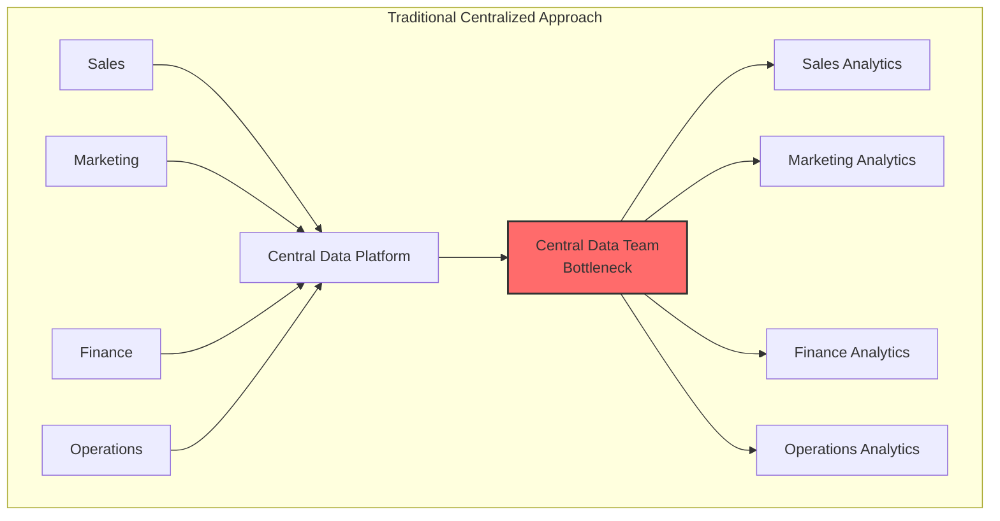
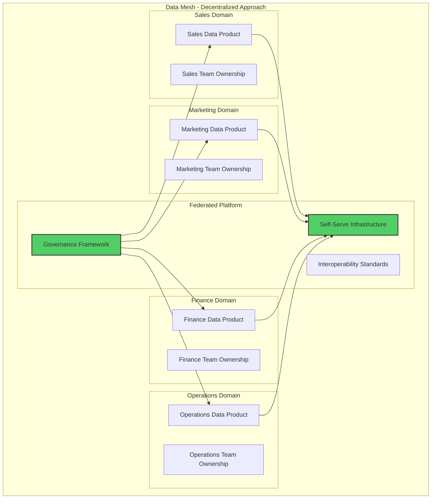
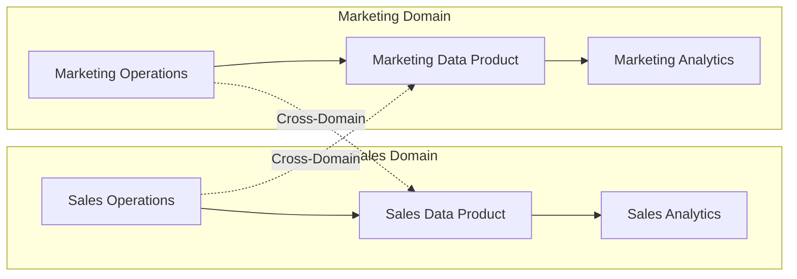
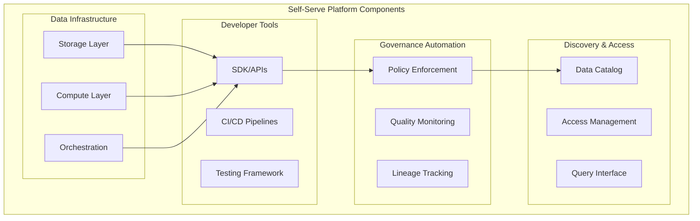
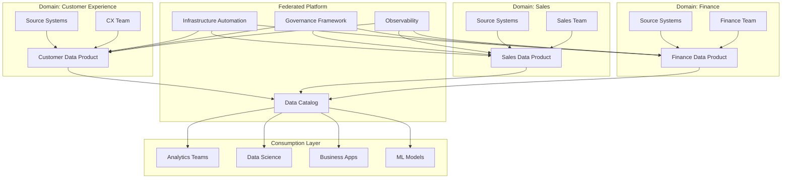
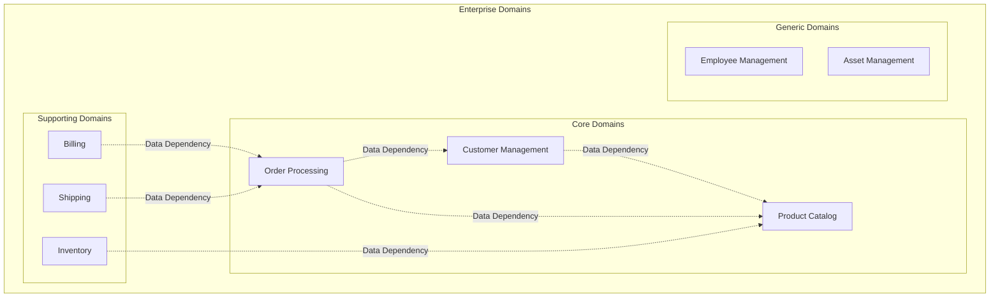
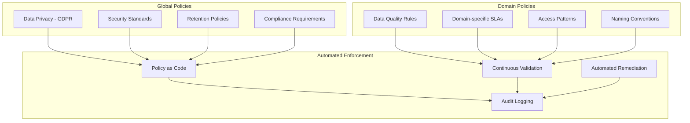

# Data Mesh Architecture Pattern

> **🏠 [Home](../../../README.md)** | **📖 [Documentation](../../README.md)** | **🏗️ [Architecture Patterns](../README.md)** | **Data Mesh**


Domain-oriented decentralized data architecture that treats data as a product, enabling scalable and autonomous data ownership across the enterprise.

---

## Table of Contents

- [Overview](#overview)
- [Core Principles](#core-principles)
- [Architecture Components](#architecture-components)
- [Domain Design](#domain-design)
- [Data Product Implementation](#data-product-implementation)
- [Self-Serve Platform](#self-serve-platform)
- [Federated Governance](#federated-governance)
- [Azure Service Mapping](#azure-service-mapping)
- [Best Practices](#best-practices)
- [Common Challenges](#common-challenges)

---

## Overview

Data Mesh is a paradigm shift in data platform architecture that addresses the limitations of centralized data lakes and warehouses by applying domain-driven design and product thinking to analytical data management.

### The Problem with Centralized Architectures



### Data Mesh Solution



---

## Core Principles

### 1. Domain Ownership

**Definition**: Data owned and managed by the domain teams who understand it best

**Key Aspects**:
- Domain teams are accountable for data quality
- End-to-end ownership from source to consumption
- Domain experts make data modeling decisions
- Operational and analytical data aligned



### 2. Data as a Product

**Definition**: Treat data with the same rigor as customer-facing products

**Product Characteristics**:
- Discoverable
- Addressable
- Trustworthy
- Self-describing
- Interoperable
- Secure

```python
# Data Product Manifest Example
data_product_manifest = {
    "product_name": "customer_360_view",
    "domain": "customer_experience",
    "owner": "customer-analytics-team@company.com",
    "version": "2.1.0",
    "description": "Unified customer profile with behavioral, transactional, and demographic data",

    "quality_sla": {
        "completeness": 0.95,
        "accuracy": 0.98,
        "freshness_minutes": 30,
        "availability": 0.999
    },

    "data_contract": {
        "schema_version": "1.0",
        "breaking_change_policy": "30_day_deprecation_notice",
        "backward_compatibility": True
    },

    "access": {
        "read_endpoint": "https://api.company.com/data-products/customer-360",
        "query_interface": "sql",
        "supported_formats": ["parquet", "delta", "json"],
        "authentication": "azure_ad"
    },

    "lineage": {
        "source_systems": ["crm", "web_analytics", "support_tickets"],
        "transformations": ["deduplication", "enrichment", "aggregation"],
        "last_updated": "2025-01-28T10:00:00Z"
    }
}
```

### 3. Self-Serve Data Platform

**Definition**: Infrastructure platform that enables domain autonomy

**Platform Capabilities**:
- Automated provisioning
- Built-in governance
- Standardized tooling
- Observability
- Security by default



### 4. Federated Computational Governance

**Definition**: Distributed governance model with global standards

**Governance Layers**:
- Global policies (compliance, security)
- Domain-specific policies (data quality, retention)
- Automated enforcement
- Observability and auditing

---

## Architecture Components

### Complete Data Mesh Architecture



---

## Domain Design

### Domain Identification



### Domain Boundaries

```python
# Domain definition template
class DataDomain:
    """Define a data domain with clear boundaries"""

    def __init__(self, name, description, owner):
        self.name = name
        self.description = description
        self.owner = owner
        self.data_products = []
        self.source_systems = []
        self.consumers = []

    def add_data_product(self, product):
        """Register a data product in this domain"""
        self.data_products.append(product)

    def get_domain_metadata(self):
        """Return domain metadata"""
        return {
            "domain_name": self.name,
            "description": self.description,
            "owner": self.owner,
            "data_products": [p.name for p in self.data_products],
            "source_systems": self.source_systems,
            "consumer_count": len(self.consumers)
        }

# Example domain definition
customer_domain = DataDomain(
    name="customer_experience",
    description="All customer-related data products and analytics",
    owner="customer-analytics-team@company.com"
)

sales_domain = DataDomain(
    name="sales",
    description="Sales transactions, pipeline, and performance data",
    owner="sales-analytics-team@company.com"
)
```

---

## Data Product Implementation

### Data Product Structure

```python
from pyspark.sql import DataFrame
from delta.tables import DeltaTable
from typing import List, Dict, Any
import json

class DataProduct:
    """
    Data Product implementation with quality SLAs and governance
    """

    def __init__(self, name: str, domain: str, owner: str):
        self.name = name
        self.domain = domain
        self.owner = owner
        self.version = "1.0.0"
        self.schema_version = "1.0"
        self.sla_metrics = {}

    def define_schema(self, schema_definition: Dict):
        """Define and version the data product schema"""
        self.schema = schema_definition
        return self

    def set_quality_sla(self, metric: str, threshold: float):
        """Define quality SLA for the data product"""
        self.sla_metrics[metric] = threshold
        return self

    def publish(self, df: DataFrame, storage_path: str):
        """Publish the data product with quality checks"""

        # Validate against SLAs
        quality_checks = self._validate_quality(df)

        if not all(quality_checks.values()):
            raise ValueError(f"Quality SLA violations: {quality_checks}")

        # Add data product metadata
        df_with_metadata = df \
            .withColumn("_product_name", lit(self.name)) \
            .withColumn("_product_version", lit(self.version)) \
            .withColumn("_domain", lit(self.domain)) \
            .withColumn("_publish_timestamp", current_timestamp())

        # Write to Delta Lake
        df_with_metadata.write \
            .format("delta") \
            .mode("overwrite") \
            .option("overwriteSchema", "true") \
            .save(storage_path)

        # Register in catalog
        self._register_in_catalog(storage_path)

        return storage_path

    def _validate_quality(self, df: DataFrame) -> Dict[str, bool]:
        """Validate data against SLA metrics"""
        results = {}

        total_count = df.count()

        for metric, threshold in self.sla_metrics.items():
            if metric == "completeness":
                # Check for NULL values
                null_count = df.filter(
                    sum([col(c).isNull().cast("int") for c in df.columns]) > 0
                ).count()
                completeness = (total_count - null_count) / total_count
                results[metric] = completeness >= threshold

            elif metric == "uniqueness":
                # Check for duplicates on key columns
                distinct_count = df.dropDuplicates().count()
                uniqueness = distinct_count / total_count
                results[metric] = uniqueness >= threshold

        return results

    def _register_in_catalog(self, storage_path: str):
        """Register data product in Azure Purview"""
        catalog_entry = {
            "name": self.name,
            "domain": self.domain,
            "owner": self.owner,
            "version": self.version,
            "storage_path": storage_path,
            "schema": self.schema,
            "sla_metrics": self.sla_metrics,
            "registered_at": datetime.now().isoformat()
        }

        # Register with Purview API
        # Implementation depends on Azure Purview SDK
        pass

# Example usage
customer_product = DataProduct(
    name="customer_360_view",
    domain="customer_experience",
    owner="cx-team@company.com"
)

customer_product \
    .set_quality_sla("completeness", 0.95) \
    .set_quality_sla("uniqueness", 0.99) \
    .define_schema({
        "customer_id": "string",
        "email": "string",
        "total_orders": "integer",
        "lifetime_value": "decimal"
    })

# Build the data product
customer_df = spark.read.format("delta") \
    .load("silver/crm/customers") \
    .join(orders_df, "customer_id") \
    .groupBy("customer_id", "email") \
    .agg(
        count("order_id").alias("total_orders"),
        sum("order_amount").alias("lifetime_value")
    )

# Publish with automatic quality checks
customer_product.publish(
    customer_df,
    "data-products/customer-experience/customer-360"
)
```

### Data Product Interface

```python
class DataProductInterface:
    """
    Standardized interface for consuming data products
    """

    def __init__(self, product_name: str, catalog_url: str):
        self.product_name = product_name
        self.catalog_url = catalog_url
        self.metadata = self._fetch_metadata()

    def read(self, version: str = "latest") -> DataFrame:
        """Read data product with specific version"""

        storage_path = self.metadata.get("storage_path")

        if version == "latest":
            return spark.read.format("delta").load(storage_path)
        else:
            return spark.read.format("delta") \
                .option("versionAsOf", version) \
                .load(storage_path)

    def get_schema(self) -> Dict:
        """Get data product schema"""
        return self.metadata.get("schema")

    def get_sla(self) -> Dict:
        """Get quality SLA metrics"""
        return self.metadata.get("sla_metrics")

    def get_lineage(self) -> Dict:
        """Get data product lineage"""
        # Query Purview for lineage information
        pass

    def _fetch_metadata(self) -> Dict:
        """Fetch metadata from catalog"""
        # Implementation depends on catalog API
        pass

# Consumer usage
customer_360 = DataProductInterface(
    product_name="customer_360_view",
    catalog_url="https://purview.azure.com/catalog"
)

# Read latest version
df = customer_360.read()

# Check schema
schema = customer_360.get_schema()
print(f"Schema: {schema}")

# Check SLAs
sla = customer_360.get_sla()
print(f"Quality SLA: {sla}")
```

---

## Self-Serve Platform

### Infrastructure as Code

```python
# Terraform configuration for data product infrastructure
"""
resource "azurerm_synapse_workspace" "domain_workspace" {
  name                = "${var.domain_name}-synapse"
  resource_group_name = azurerm_resource_group.rg.name
  location            = azurerm_resource_group.rg.location

  storage_data_lake_gen2_filesystem_id = azurerm_storage_data_lake_gen2_filesystem.domain_storage.id

  sql_administrator_login          = "sqladmin"
  sql_administrator_login_password = var.sql_admin_password

  managed_virtual_network_enabled = true

  identity {
    type = "SystemAssigned"
  }

  tags = {
    domain = var.domain_name
    owner  = var.domain_owner
  }
}

resource "azurerm_synapse_spark_pool" "domain_spark" {
  name                 = "${var.domain_name}-spark"
  synapse_workspace_id = azurerm_synapse_workspace.domain_workspace.id

  node_size_family = "MemoryOptimized"
  node_size        = "Medium"

  auto_scale {
    min_node_count = 3
    max_node_count = 20
  }

  auto_pause {
    delay_in_minutes = 15
  }
}

resource "azurerm_storage_account" "domain_storage" {
  name                     = "${var.domain_name}datalake"
  resource_group_name      = azurerm_resource_group.rg.name
  location                 = azurerm_resource_group.rg.location
  account_tier             = "Standard"
  account_replication_type = "ZRS"
  is_hns_enabled          = true

  network_rules {
    default_action = "Deny"
    ip_rules       = var.allowed_ips
    bypass         = ["AzureServices"]
  }
}
"""
```

### Platform Automation

```python
class DataProductProvisioner:
    """
    Automated provisioning for new data products
    """

    def __init__(self, domain: str, subscription_id: str):
        self.domain = domain
        self.subscription_id = subscription_id

    def provision_data_product(self, product_config: Dict):
        """
        Provision complete infrastructure for a data product
        """

        steps = [
            self._create_storage_container,
            self._setup_spark_pool,
            self._configure_access_policies,
            self._register_in_catalog,
            self._setup_monitoring,
            self._deploy_pipelines
        ]

        for step in steps:
            result = step(product_config)
            if not result["success"]:
                self._rollback(product_config)
                raise Exception(f"Provisioning failed: {result['error']}")

        return {
            "status": "success",
            "product_name": product_config["name"],
            "endpoints": self._get_endpoints(product_config)
        }

    def _create_storage_container(self, config: Dict):
        """Create dedicated storage for data product"""
        container_name = f"{self.domain}-{config['name']}"

        # Create container using Azure SDK
        # Implementation omitted for brevity

        return {"success": True}

    def _setup_spark_pool(self, config: Dict):
        """Configure Spark pool for data product"""
        # Implementation using Azure SDK
        return {"success": True}

    def _configure_access_policies(self, config: Dict):
        """Set up RBAC and access policies"""
        # Implementation using Azure SDK
        return {"success": True}

    def _register_in_catalog(self, config: Dict):
        """Register in Azure Purview"""
        # Implementation using Purview SDK
        return {"success": True}

    def _setup_monitoring(self, config: Dict):
        """Configure Azure Monitor alerts"""
        # Implementation using Monitor SDK
        return {"success": True}

    def _deploy_pipelines(self, config: Dict):
        """Deploy Data Factory pipelines"""
        # Implementation using ADF SDK
        return {"success": True}
```

---

## Federated Governance

### Governance Framework



### Policy Implementation

```python
from typing import List, Callable

class GovernancePolicy:
    """
    Define and enforce governance policies
    """

    def __init__(self, name: str, scope: str, rules: List[Callable]):
        self.name = name
        self.scope = scope  # "global" or "domain"
        self.rules = rules

    def validate(self, data_product: DataProduct) -> Dict:
        """Validate data product against policy"""
        violations = []

        for rule in self.rules:
            result = rule(data_product)
            if not result["passed"]:
                violations.append(result)

        return {
            "policy_name": self.name,
            "passed": len(violations) == 0,
            "violations": violations
        }

# Define global policies
def gdpr_compliance_check(product: DataProduct) -> Dict:
    """Ensure GDPR compliance"""
    has_pii_classification = "pii" in product.metadata.get("classifications", [])
    has_retention_policy = product.metadata.get("retention_days") is not None

    return {
        "rule": "gdpr_compliance",
        "passed": has_pii_classification and has_retention_policy,
        "message": "GDPR compliance requires PII classification and retention policy"
    }

def encryption_at_rest_check(product: DataProduct) -> Dict:
    """Verify encryption is enabled"""
    is_encrypted = product.metadata.get("encryption_enabled", False)

    return {
        "rule": "encryption_at_rest",
        "passed": is_encrypted,
        "message": "Data must be encrypted at rest"
    }

# Create global policy
global_security_policy = GovernancePolicy(
    name="global_security_policy",
    scope="global",
    rules=[gdpr_compliance_check, encryption_at_rest_check]
)

# Validate data product
validation_result = global_security_policy.validate(customer_product)

if not validation_result["passed"]:
    print(f"Policy violations: {validation_result['violations']}")
```

---

## Azure Service Mapping

### Complete Service Stack

| Component | Azure Service | Purpose |
|-----------|--------------|---------|
| **Domain Workspace** | Azure Synapse Workspace | Isolated workspace per domain |
| **Data Storage** | Azure Data Lake Gen2 | Domain data product storage |
| **Compute** | Synapse Spark Pools | Data transformation and processing |
| **Orchestration** | Azure Data Factory | Pipeline automation |
| **Catalog** | Azure Purview | Data discovery and governance |
| **Access Management** | Azure AD + RBAC | Identity and access control |
| **Monitoring** | Azure Monitor + Log Analytics | Observability and alerting |
| **API Gateway** | Azure API Management | Data product APIs |
| **Secrets** | Azure Key Vault | Credential management |
| **Networking** | Private Link + VNet | Network isolation |

### Reference Architecture

```json
{
  "data_mesh_architecture": {
    "domains": [
      {
        "name": "customer_experience",
        "workspace": "cx-synapse-workspace",
        "resource_group": "rg-datamesh-cx",
        "storage_account": "cxdatalake",
        "spark_pool": "cx-spark-pool",
        "data_products": [
          {
            "name": "customer_360_view",
            "storage_path": "data-products/customer-360",
            "update_frequency": "hourly",
            "consumers": ["analytics", "ml", "customer-service"]
          }
        ]
      },
      {
        "name": "sales",
        "workspace": "sales-synapse-workspace",
        "resource_group": "rg-datamesh-sales",
        "storage_account": "salesdatalake",
        "spark_pool": "sales-spark-pool",
        "data_products": [
          {
            "name": "sales_performance",
            "storage_path": "data-products/sales-perf",
            "update_frequency": "daily",
            "consumers": ["exec-dashboard", "sales-ops"]
          }
        ]
      }
    ],
    "shared_services": {
      "catalog": "company-purview",
      "monitoring": "datamesh-monitor",
      "key_vault": "datamesh-secrets"
    }
  }
}
```

---

## Best Practices

### 1. Start Small, Scale Incrementally

```text
Phase 1: Pilot Domain (3-6 months)
  - Choose one domain with clear boundaries
  - Build 2-3 data products
  - Establish platform patterns
  - Define governance framework

Phase 2: Early Adopters (6-12 months)
  - Onboard 2-3 additional domains
  - Refine platform tooling
  - Document lessons learned
  - Build self-service capabilities

Phase 3: Enterprise Scale (12-24 months)
  - Roll out to all domains
  - Automate provisioning
  - Establish centers of excellence
  - Measure adoption and value
```

### 2. Clear Data Product Ownership

```python
# Data product ownership structure
ownership_model = {
    "product_owner": {
        "role": "Business stakeholder",
        "responsibilities": [
            "Define product roadmap",
            "Set quality SLAs",
            "Prioritize features",
            "Approve changes"
        ]
    },
    "technical_lead": {
        "role": "Engineering lead",
        "responsibilities": [
            "Technical implementation",
            "Performance optimization",
            "Infrastructure management",
            "On-call support"
        ]
    },
    "data_steward": {
        "role": "Governance liaison",
        "responsibilities": [
            "Data quality monitoring",
            "Compliance verification",
            "Metadata management",
            "Access control"
        ]
    }
}
```

### 3. Standardized Data Contracts

```yaml
# data-contract.yaml
version: "1.0"
product:
  name: "customer_360_view"
  domain: "customer_experience"
  owner: "cx-team@company.com"

schema:
  format: "delta"
  fields:
    - name: "customer_id"
      type: "string"
      nullable: false
      description: "Unique customer identifier"

    - name: "email"
      type: "string"
      nullable: false
      pattern: "^[a-zA-Z0-9._%+-]+@[a-zA-Z0-9.-]+\\.[a-zA-Z]{2,}$"

    - name: "lifetime_value"
      type: "decimal(10,2)"
      nullable: true
      description: "Total customer value in USD"

sla:
  freshness:
    max_age_hours: 1
  completeness:
    min_threshold: 0.95
  availability:
    uptime_percentage: 99.9

versioning:
  breaking_changes: "major_version_bump"
  deprecation_notice_days: 30
  backward_compatibility: true
```

---

## Common Challenges

### Challenge 1: Organizational Change

**Problem**: Moving from centralized to decentralized requires cultural shift

**Solution**:
- Executive sponsorship and clear vision
- Training and enablement programs
- Celebrate early wins
- Gradual migration, not big bang

### Challenge 2: Platform Complexity

**Problem**: Building self-serve platform is significant investment

**Solution**:
- Start with minimal platform, iterate based on domain feedback
- Leverage cloud-native services (Azure Synapse, Purview)
- Build paved paths, not rigid frameworks
- Focus on developer experience

### Challenge 3: Governance at Scale

**Problem**: Ensuring consistency across autonomous domains

**Solution**:
- Automate policy enforcement
- Make compliance easy, not burdensome
- Provide observable metrics
- Regular governance reviews

---

**Related Documentation**:
- [Medallion Architecture](medallion-architecture.md)
- [Azure Purview Integration](../../code-examples/integration/azure-purview.md)
- [Organizational Patterns](../../best-practices/data-governance.md)

---

*Last Updated: 2025-01-28*
*Version: 1.0*
