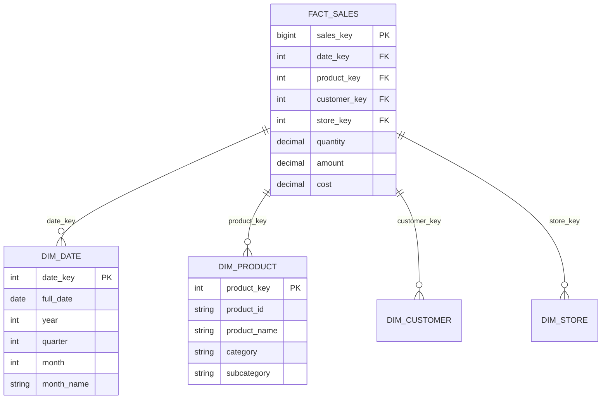
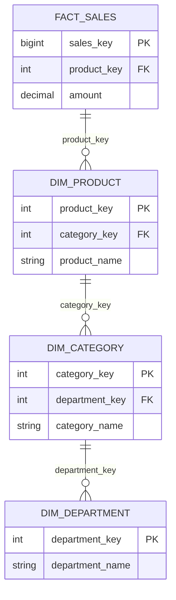
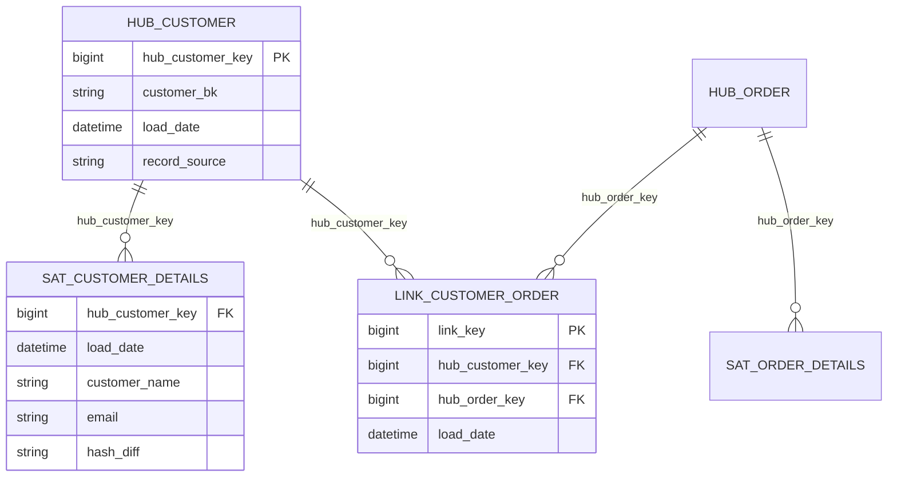
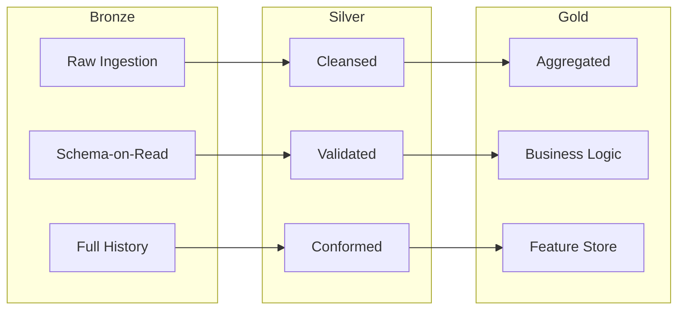

# 🏛️ Data Warehouse Patterns

> __🏠 [Home](../../../README.md)__ | __🏗️ [Architecture](../README.md)__ | __📦 [Batch](README.md)__ | __🏛️ DW Patterns__


Comprehensive guide to data warehouse modeling patterns for Azure analytics.

---

## 🎯 Overview

Data warehouse patterns define how to structure data for analytical workloads. Choose patterns based on:

- **Query patterns**: Ad-hoc vs. predefined reports
- **Data volatility**: How often source data changes
- **Historical requirements**: Point-in-time analysis needs
- **Scalability**: Data volume growth expectations

---

## 📊 Dimensional Modeling

### Star Schema

Simplest and most performant pattern for analytical queries.



**Implementation (Synapse SQL)**:

```sql
-- Fact table with hash distribution
CREATE TABLE fact_sales
(
    sales_key BIGINT IDENTITY(1,1),
    date_key INT NOT NULL,
    product_key INT NOT NULL,
    customer_key INT NOT NULL,
    store_key INT NOT NULL,
    quantity DECIMAL(18,4),
    amount DECIMAL(18,2),
    cost DECIMAL(18,2)
)
WITH
(
    DISTRIBUTION = HASH(customer_key),
    CLUSTERED COLUMNSTORE INDEX
);

-- Dimension table replicated
CREATE TABLE dim_product
(
    product_key INT NOT NULL,
    product_id NVARCHAR(50),
    product_name NVARCHAR(200),
    category NVARCHAR(100),
    subcategory NVARCHAR(100)
)
WITH
(
    DISTRIBUTION = REPLICATE,
    CLUSTERED INDEX (product_key)
);
```

### Snowflake Schema

Normalized dimensions for storage efficiency and data integrity.



---

## 🏗️ Data Vault

Designed for auditability and historical tracking.

### Hub-Link-Satellite Pattern



**Implementation (Databricks)**:

```python
from delta.tables import DeltaTable

# Hub table - business keys only
hub_customer_schema = """
    hub_customer_key BIGINT,
    customer_bk STRING,
    load_date TIMESTAMP,
    record_source STRING
"""

# Create hub with merge pattern
def load_hub_customer(df_source):
    df_new = df_source.select(
        "customer_id",
        current_timestamp().alias("load_date"),
        lit("ERP").alias("record_source")
    ).distinct()

    hub = DeltaTable.forPath(spark, "/data-vault/hub_customer")

    hub.alias("hub").merge(
        df_new.alias("new"),
        "hub.customer_bk = new.customer_id"
    ).whenNotMatchedInsertAll().execute()
```

---

## 🥇 Medallion Architecture

Modern lakehouse pattern with bronze, silver, and gold layers.



**Implementation (Delta Lake)**:

```python
# Bronze: Raw ingestion
bronze_df = (spark.readStream
    .format("cloudFiles")
    .option("cloudFiles.format", "json")
    .load("/raw/sales/")
)

bronze_df.writeStream \
    .format("delta") \
    .outputMode("append") \
    .option("checkpointLocation", "/checkpoints/bronze_sales") \
    .toTable("bronze.sales")

# Silver: Cleansing and validation
silver_df = spark.sql("""
    SELECT
        CAST(order_id AS BIGINT) as order_id,
        CAST(amount AS DECIMAL(18,2)) as amount,
        TO_DATE(order_date) as order_date,
        customer_id,
        current_timestamp() as processed_at
    FROM bronze.sales
    WHERE order_id IS NOT NULL
      AND amount > 0
""")

silver_df.write.format("delta").mode("merge").saveAsTable("silver.sales")

# Gold: Business aggregations
gold_df = spark.sql("""
    SELECT
        date_trunc('day', order_date) as sale_date,
        COUNT(*) as order_count,
        SUM(amount) as total_sales,
        AVG(amount) as avg_order_value
    FROM silver.sales
    GROUP BY date_trunc('day', order_date)
""")

gold_df.write.format("delta").mode("overwrite").saveAsTable("gold.daily_sales")
```

---

## 📈 Slowly Changing Dimensions (SCD)

### Type 1: Overwrite

```sql
-- Update in place, no history
MERGE INTO dim_customer AS target
USING staging_customer AS source
ON target.customer_id = source.customer_id
WHEN MATCHED THEN
    UPDATE SET
        customer_name = source.customer_name,
        email = source.email
WHEN NOT MATCHED THEN
    INSERT (customer_id, customer_name, email)
    VALUES (source.customer_id, source.customer_name, source.email);
```

### Type 2: Historical Tracking

```sql
-- Track all changes with validity periods
MERGE INTO dim_customer AS target
USING (
    SELECT
        customer_id,
        customer_name,
        email,
        GETDATE() AS effective_from,
        '9999-12-31' AS effective_to,
        1 AS is_current
    FROM staging_customer
) AS source
ON target.customer_id = source.customer_id AND target.is_current = 1
WHEN MATCHED AND (
    target.customer_name <> source.customer_name OR
    target.email <> source.email
) THEN
    UPDATE SET
        effective_to = DATEADD(day, -1, GETDATE()),
        is_current = 0
WHEN NOT MATCHED THEN
    INSERT (customer_id, customer_name, email, effective_from, effective_to, is_current)
    VALUES (source.customer_id, source.customer_name, source.email,
            source.effective_from, source.effective_to, source.is_current);
```

---

## 📚 Related Documentation

- [Batch Architecture Overview](README.md)
- [Delta Lake Best Practices](../../05-best-practices/service-specific/databricks/delta-lake.md)
- [Synapse SQL Performance](../../05-best-practices/service-specific/synapse/dedicated-sql-best-practices.md)

---

*Last Updated: January 2025*
