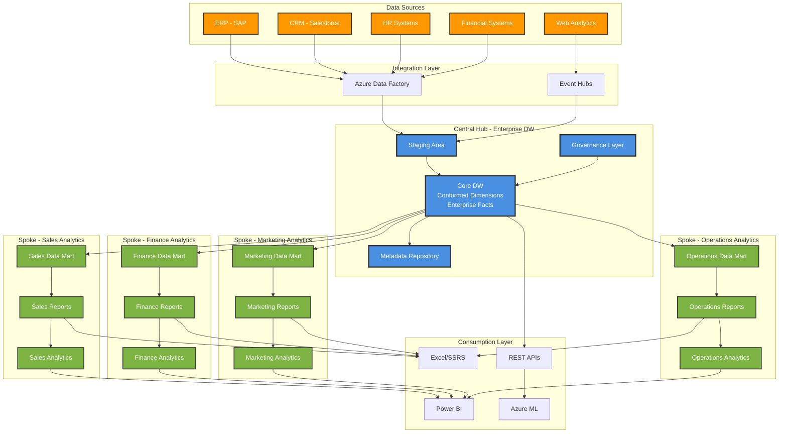
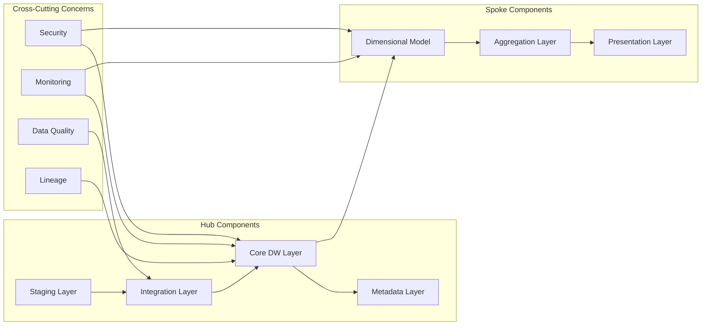
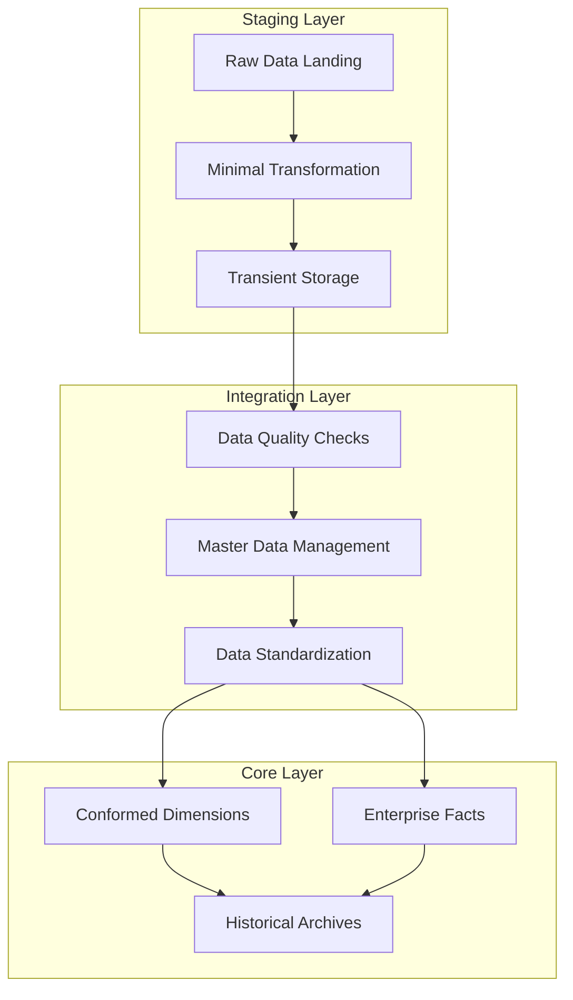
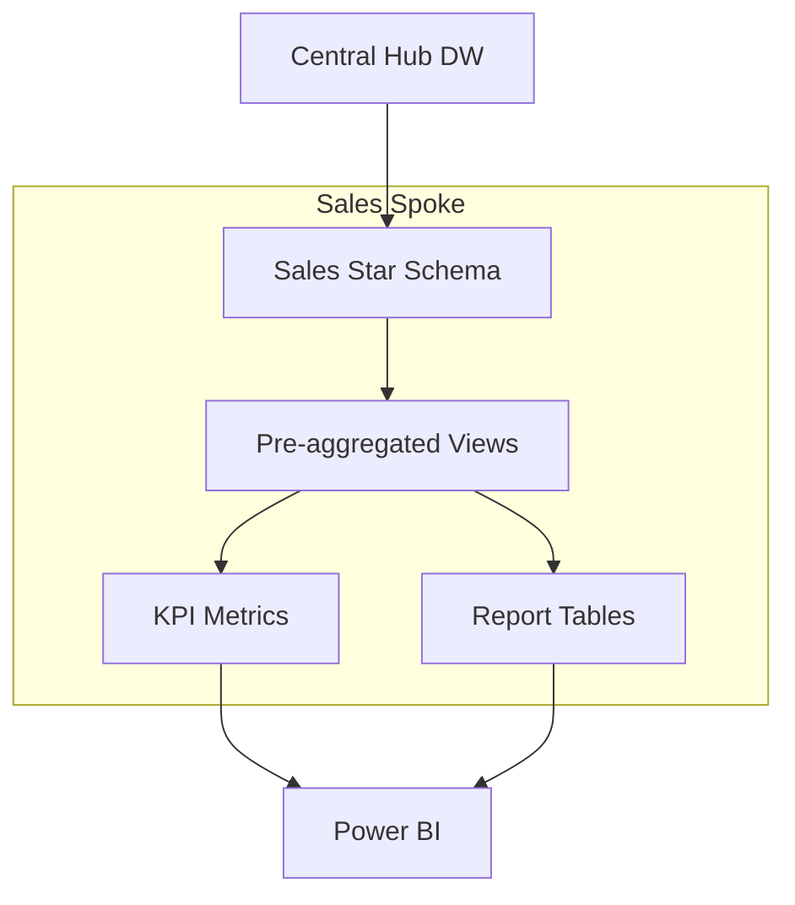
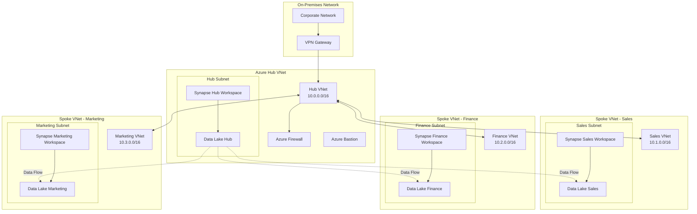

# Hub and Spoke Architecture Model

> **🏠 [Home](../../../README.md)** | **📖 [Documentation](../../README.md)** | **🏗️ [Architecture Patterns](../README.md)** | **Hub and Spoke Model**


Centralized data warehouse (hub) with specialized departmental data marts (spokes) for optimized analytics and reporting across the enterprise.

---

## Table of Contents

- [Overview](#overview)
- [Architecture Components](#architecture-components)
- [Hub Design](#hub-design)
- [Spoke Design](#spoke-design)
- [Network Topology](#network-topology)
- [Data Flow Patterns](#data-flow-patterns)
- [Azure Service Mapping](#azure-service-mapping)
- [Implementation Guide](#implementation-guide)
- [Code Examples](#code-examples)
- [Performance Optimization](#performance-optimization)
- [Security and Governance](#security-and-governance)
- [Best Practices](#best-practices)
- [Migration Strategies](#migration-strategies)

---

## Overview

The Hub and Spoke model is a proven enterprise data architecture pattern that centralizes data integration and governance in a core data warehouse (hub) while distributing specialized analytics capabilities to departmental data marts (spokes).

### Key Benefits

- **Centralized Governance**: Single source of truth with consistent data definitions
- **Departmental Autonomy**: Specialized data marts optimized for specific use cases
- **Cost Efficiency**: Shared infrastructure and reduced data duplication
- **Performance Optimization**: Workload isolation and query optimization
- **Scalability**: Add new spokes without impacting existing infrastructure
- **Clear Data Lineage**: Well-defined data flows from source to consumption

### Architecture Diagram



---

## Architecture Components

### Component Overview



---

## Hub Design

### Central Hub Architecture

The hub serves as the enterprise data warehouse with integrated, conformed, and historized data.

#### Hub Layers



### Hub Schema Design

```sql
-- Conformed Dimension: Customer
CREATE TABLE hub.DimCustomer (
    CustomerKey INT IDENTITY(1,1) PRIMARY KEY,
    CustomerID VARCHAR(50) NOT NULL,
    CustomerName VARCHAR(200) NOT NULL,
    CustomerType VARCHAR(50),
    Industry VARCHAR(100),
    Country VARCHAR(50),
    Region VARCHAR(50),
    -- SCD Type 2 columns
    EffectiveStartDate DATE NOT NULL,
    EffectiveEndDate DATE NOT NULL,
    IsCurrent BIT NOT NULL DEFAULT 1,
    -- Audit columns
    CreatedDate DATETIME NOT NULL DEFAULT GETDATE(),
    ModifiedDate DATETIME NOT NULL DEFAULT GETDATE(),
    SourceSystem VARCHAR(50) NOT NULL
)
WITH (
    DISTRIBUTION = REPLICATE,
    CLUSTERED COLUMNSTORE INDEX
);

-- Conformed Dimension: Product
CREATE TABLE hub.DimProduct (
    ProductKey INT IDENTITY(1,1) PRIMARY KEY,
    ProductID VARCHAR(50) NOT NULL,
    ProductName VARCHAR(200) NOT NULL,
    Category VARCHAR(100),
    SubCategory VARCHAR(100),
    Brand VARCHAR(100),
    UnitPrice DECIMAL(10,2),
    -- SCD Type 2 columns
    EffectiveStartDate DATE NOT NULL,
    EffectiveEndDate DATE NOT NULL,
    IsCurrent BIT NOT NULL DEFAULT 1,
    -- Audit columns
    CreatedDate DATETIME NOT NULL DEFAULT GETDATE(),
    ModifiedDate DATETIME NOT NULL DEFAULT GETDATE(),
    SourceSystem VARCHAR(50) NOT NULL
)
WITH (
    DISTRIBUTION = REPLICATE,
    CLUSTERED COLUMNSTORE INDEX
);

-- Conformed Dimension: Date
CREATE TABLE hub.DimDate (
    DateKey INT PRIMARY KEY,
    FullDate DATE NOT NULL,
    DayOfWeek INT,
    DayName VARCHAR(10),
    DayOfMonth INT,
    DayOfYear INT,
    WeekOfYear INT,
    MonthName VARCHAR(10),
    MonthOfYear INT,
    Quarter INT,
    Year INT,
    IsWeekend BIT,
    IsHoliday BIT,
    FiscalYear INT,
    FiscalQuarter INT,
    FiscalMonth INT
)
WITH (
    DISTRIBUTION = REPLICATE,
    CLUSTERED COLUMNSTORE INDEX
);

-- Enterprise Fact: Sales
CREATE TABLE hub.FactSales (
    SalesKey BIGINT IDENTITY(1,1) PRIMARY KEY,
    DateKey INT NOT NULL,
    CustomerKey INT NOT NULL,
    ProductKey INT NOT NULL,
    OrderID VARCHAR(50) NOT NULL,
    OrderLineNumber INT NOT NULL,
    Quantity INT NOT NULL,
    UnitPrice DECIMAL(10,2) NOT NULL,
    Discount DECIMAL(5,2),
    TaxAmount DECIMAL(10,2),
    TotalAmount DECIMAL(10,2) NOT NULL,
    -- Audit columns
    LoadDate DATETIME NOT NULL DEFAULT GETDATE(),
    SourceSystem VARCHAR(50) NOT NULL,
    -- Foreign keys
    CONSTRAINT FK_FactSales_DimDate FOREIGN KEY (DateKey) REFERENCES hub.DimDate(DateKey),
    CONSTRAINT FK_FactSales_DimCustomer FOREIGN KEY (CustomerKey) REFERENCES hub.DimCustomer(CustomerKey),
    CONSTRAINT FK_FactSales_DimProduct FOREIGN KEY (ProductKey) REFERENCES hub.DimProduct(ProductKey)
)
WITH (
    DISTRIBUTION = HASH(CustomerKey),
    CLUSTERED COLUMNSTORE INDEX,
    PARTITION (DateKey RANGE RIGHT FOR VALUES (20200101, 20210101, 20220101, 20230101, 20240101, 20250101))
);
```

### Hub Loading Pattern - PySpark

```python
from pyspark.sql import DataFrame
from pyspark.sql.functions import col, current_timestamp, lit, row_number, when
from pyspark.sql.window import Window
from delta.tables import DeltaTable

class HubLoader:
    """
    Load data into central hub with SCD Type 2 logic
    """

    def __init__(self, spark, hub_path: str):
        self.spark = spark
        self.hub_path = hub_path

    def load_dimension_scd2(self, source_df: DataFrame,
                            dimension_name: str,
                            business_key: str,
                            compare_columns: list):
        """
        Load dimension with SCD Type 2 logic
        """

        hub_table_path = f"{self.hub_path}/{dimension_name}"

        # Add metadata columns
        source_with_meta = source_df \
            .withColumn("EffectiveStartDate", current_timestamp()) \
            .withColumn("EffectiveEndDate", lit("9999-12-31").cast("date")) \
            .withColumn("IsCurrent", lit(True)) \
            .withColumn("CreatedDate", current_timestamp()) \
            .withColumn("ModifiedDate", current_timestamp())

        # Check if table exists
        try:
            hub_delta = DeltaTable.forPath(self.spark, hub_table_path)

            # Build comparison condition
            compare_condition = " OR ".join([
                f"target.{col} != source.{col}" for col in compare_columns
            ])

            # Merge with SCD Type 2 logic
            hub_delta.alias("target").merge(
                source_with_meta.alias("source"),
                f"target.{business_key} = source.{business_key} AND target.IsCurrent = true"
            ).whenMatchedUpdate(
                condition = compare_condition,
                set = {
                    "IsCurrent": "false",
                    "EffectiveEndDate": "current_date()",
                    "ModifiedDate": "current_timestamp()"
                }
            ).execute()

            # Insert new records (both new and changed)
            changed_keys = hub_delta.toDF() \
                .filter(col("IsCurrent") == False) \
                .filter(col("EffectiveEndDate") == current_timestamp().cast("date")) \
                .select(business_key)

            new_and_changed = source_with_meta \
                .join(changed_keys, business_key, "left_anti") \
                .union(
                    source_with_meta.join(changed_keys, business_key, "inner")
                )

            new_and_changed.write \
                .format("delta") \
                .mode("append") \
                .save(hub_table_path)

        except Exception as e:
            # Table doesn't exist, create it
            source_with_meta.write \
                .format("delta") \
                .mode("overwrite") \
                .save(hub_table_path)

    def load_fact(self, source_df: DataFrame,
                  fact_name: str,
                  partition_column: str = None):
        """
        Load fact table with incremental append
        """

        hub_table_path = f"{self.hub_path}/{fact_name}"

        # Add audit columns
        source_with_audit = source_df \
            .withColumn("LoadDate", current_timestamp())

        # Write to hub
        write_operation = source_with_audit.write \
            .format("delta") \
            .mode("append")

        if partition_column:
            write_operation = write_operation.partitionBy(partition_column)

        write_operation.save(hub_table_path)

# Example usage
hub_loader = HubLoader(spark, "abfss://hub@datalake.dfs.core.windows.net")

# Load customer dimension
customers_df = spark.read.format("delta") \
    .load("bronze/crm/customers")

hub_loader.load_dimension_scd2(
    source_df=customers_df,
    dimension_name="DimCustomer",
    business_key="CustomerID",
    compare_columns=["CustomerName", "Industry", "Country"]
)

# Load sales fact
sales_df = spark.read.format("delta") \
    .load("bronze/erp/sales")

hub_loader.load_fact(
    source_df=sales_df,
    fact_name="FactSales",
    partition_column="DateKey"
)
```

---

## Spoke Design

### Spoke Architecture

Spokes are specialized data marts optimized for specific business functions or departments.



### Spoke Schema Design - Sales Data Mart

```sql
-- Sales Spoke: Customer Dimension (Denormalized)
CREATE TABLE spoke_sales.DimCustomer (
    CustomerKey INT PRIMARY KEY,
    CustomerID VARCHAR(50) NOT NULL,
    CustomerName VARCHAR(200) NOT NULL,
    CustomerType VARCHAR(50),
    Industry VARCHAR(100),
    Country VARCHAR(50),
    Region VARCHAR(50),
    SalesTerritory VARCHAR(100),
    AccountManager VARCHAR(200),
    -- Derived attributes for sales analysis
    CustomerSegment VARCHAR(50),
    CustomerLifetimeValue DECIMAL(12,2),
    CustomerRiskScore DECIMAL(5,2),
    LastPurchaseDate DATE,
    TotalOrders INT,
    IsCurrent BIT NOT NULL
)
WITH (
    DISTRIBUTION = REPLICATE,
    CLUSTERED COLUMNSTORE INDEX
);

-- Sales Spoke: Product Dimension (Sales-specific)
CREATE TABLE spoke_sales.DimProduct (
    ProductKey INT PRIMARY KEY,
    ProductID VARCHAR(50) NOT NULL,
    ProductName VARCHAR(200) NOT NULL,
    Category VARCHAR(100),
    SubCategory VARCHAR(100),
    Brand VARCHAR(100),
    -- Sales-specific attributes
    SalesChannel VARCHAR(50),
    ProfitMargin DECIMAL(5,2),
    PromotionEligible BIT,
    StockLevel VARCHAR(20),
    IsCurrent BIT NOT NULL
)
WITH (
    DISTRIBUTION = REPLICATE,
    CLUSTERED COLUMNSTORE INDEX
);

-- Sales Spoke: Sales Performance Fact
CREATE TABLE spoke_sales.FactSalesPerformance (
    DateKey INT NOT NULL,
    CustomerKey INT NOT NULL,
    ProductKey INT NOT NULL,
    SalesPersonKey INT NOT NULL,
    TerritoryKey INT NOT NULL,
    -- Metrics
    OrderCount INT,
    Quantity INT,
    GrossRevenue DECIMAL(12,2),
    Discounts DECIMAL(12,2),
    NetRevenue DECIMAL(12,2),
    CostOfGoodsSold DECIMAL(12,2),
    GrossProfit DECIMAL(12,2),
    -- Derived Metrics
    ProfitMarginPct DECIMAL(5,2),
    AverageOrderValue DECIMAL(10,2),
    -- Foreign keys
    CONSTRAINT FK_Sales_Date FOREIGN KEY (DateKey) REFERENCES spoke_sales.DimDate(DateKey),
    CONSTRAINT FK_Sales_Customer FOREIGN KEY (CustomerKey) REFERENCES spoke_sales.DimCustomer(CustomerKey),
    CONSTRAINT FK_Sales_Product FOREIGN KEY (ProductKey) REFERENCES spoke_sales.DimProduct(ProductKey)
)
WITH (
    DISTRIBUTION = HASH(CustomerKey),
    CLUSTERED COLUMNSTORE INDEX,
    PARTITION (DateKey RANGE RIGHT FOR VALUES (20230101, 20230401, 20230701, 20231001, 20240101))
);

-- Sales Spoke: Pre-aggregated View
CREATE VIEW spoke_sales.vw_MonthlySalesSummary
AS
SELECT
    d.Year,
    d.MonthName,
    c.Region,
    c.Industry,
    p.Category,
    SUM(f.OrderCount) AS TotalOrders,
    SUM(f.Quantity) AS TotalQuantity,
    SUM(f.NetRevenue) AS TotalRevenue,
    SUM(f.GrossProfit) AS TotalProfit,
    AVG(f.ProfitMarginPct) AS AvgProfitMargin,
    COUNT(DISTINCT f.CustomerKey) AS UniqueCustomers
FROM spoke_sales.FactSalesPerformance f
    INNER JOIN spoke_sales.DimDate d ON f.DateKey = d.DateKey
    INNER JOIN spoke_sales.DimCustomer c ON f.CustomerKey = c.CustomerKey
    INNER JOIN spoke_sales.DimProduct p ON f.ProductKey = p.ProductKey
GROUP BY
    d.Year,
    d.MonthName,
    c.Region,
    c.Industry,
    p.Category;
```

### Spoke Loading Pattern - PySpark

```python
class SpokeLoader:
    """
    Load spoke data marts from central hub
    """

    def __init__(self, spark, hub_path: str, spoke_path: str):
        self.spark = spark
        self.hub_path = hub_path
        self.spoke_path = spoke_path

    def build_spoke_dimension(self, dimension_config: dict):
        """
        Build denormalized, spoke-specific dimension
        """

        # Read from hub
        hub_dim = spark.read.format("delta") \
            .load(f"{self.hub_path}/{dimension_config['source_table']}")

        # Apply spoke-specific transformations
        spoke_dim = hub_dim

        # Add derived columns
        for derived_col in dimension_config.get('derived_columns', []):
            spoke_dim = spoke_dim.withColumn(
                derived_col['name'],
                expr(derived_col['expression'])
            )

        # Join with additional dimensions for denormalization
        for join_config in dimension_config.get('joins', []):
            join_table = spark.read.format("delta") \
                .load(f"{self.hub_path}/{join_config['table']}")

            spoke_dim = spoke_dim.join(
                join_table,
                join_config['condition'],
                join_config.get('how', 'left')
            ).select(dimension_config['select_columns'])

        # Write to spoke
        spoke_dim.write \
            .format("delta") \
            .mode("overwrite") \
            .save(f"{self.spoke_path}/{dimension_config['target_table']}")

    def build_spoke_fact(self, fact_config: dict):
        """
        Build aggregated, spoke-specific fact table
        """

        # Read from hub fact
        hub_fact = spark.read.format("delta") \
            .load(f"{self.hub_path}/{fact_config['source_table']}")

        # Apply aggregations
        agg_expressions = [
            expr(agg['expression']).alias(agg['name'])
            for agg in fact_config['aggregations']
        ]

        spoke_fact = hub_fact \
            .groupBy(fact_config['group_by']) \
            .agg(*agg_expressions)

        # Add calculated metrics
        for calc in fact_config.get('calculated_metrics', []):
            spoke_fact = spoke_fact.withColumn(
                calc['name'],
                expr(calc['expression'])
            )

        # Write to spoke
        spoke_fact.write \
            .format("delta") \
            .mode("overwrite") \
            .partitionBy(fact_config.get('partition_by')) \
            .save(f"{self.spoke_path}/{fact_config['target_table']}")

# Example configuration
sales_spoke_config = {
    "dimension": {
        "source_table": "DimCustomer",
        "target_table": "DimCustomer",
        "derived_columns": [
            {
                "name": "CustomerSegment",
                "expression": """
                    CASE
                        WHEN TotalOrders > 100 THEN 'Platinum'
                        WHEN TotalOrders > 50 THEN 'Gold'
                        WHEN TotalOrders > 10 THEN 'Silver'
                        ELSE 'Bronze'
                    END
                """
            }
        ],
        "joins": [],
        "select_columns": ["*"]
    },
    "fact": {
        "source_table": "FactSales",
        "target_table": "FactSalesPerformance",
        "group_by": ["DateKey", "CustomerKey", "ProductKey"],
        "aggregations": [
            {"name": "OrderCount", "expression": "COUNT(OrderID)"},
            {"name": "Quantity", "expression": "SUM(Quantity)"},
            {"name": "GrossRevenue", "expression": "SUM(TotalAmount)"},
            {"name": "Discounts", "expression": "SUM(Discount)"}
        ],
        "calculated_metrics": [
            {"name": "NetRevenue", "expression": "GrossRevenue - Discounts"},
            {"name": "AverageOrderValue", "expression": "GrossRevenue / OrderCount"}
        ],
        "partition_by": "DateKey"
    }
}

# Build spoke
spoke_loader = SpokeLoader(
    spark,
    "abfss://hub@datalake.dfs.core.windows.net",
    "abfss://spoke-sales@datalake.dfs.core.windows.net"
)

spoke_loader.build_spoke_dimension(sales_spoke_config['dimension'])
spoke_loader.build_spoke_fact(sales_spoke_config['fact'])
```

---

## Network Topology

### Azure Network Architecture



### Private Link Configuration

```python
# Terraform configuration for Private Link
"""
resource "azurerm_private_endpoint" "hub_synapse" {
  name                = "pe-synapse-hub"
  location            = azurerm_resource_group.hub_rg.location
  resource_group_name = azurerm_resource_group.hub_rg.name
  subnet_id           = azurerm_subnet.hub_subnet.id

  private_service_connection {
    name                           = "psc-synapse-hub"
    private_connection_resource_id = azurerm_synapse_workspace.hub.id
    is_manual_connection           = false
    subresource_names              = ["Sql", "SqlOnDemand", "Dev"]
  }

  private_dns_zone_group {
    name                 = "pdns-group-synapse"
    private_dns_zone_ids = [azurerm_private_dns_zone.synapse.id]
  }
}

resource "azurerm_private_endpoint" "spoke_sales_synapse" {
  name                = "pe-synapse-sales"
  location            = azurerm_resource_group.sales_rg.location
  resource_group_name = azurerm_resource_group.sales_rg.name
  subnet_id           = azurerm_subnet.sales_subnet.id

  private_service_connection {
    name                           = "psc-synapse-sales"
    private_connection_resource_id = azurerm_synapse_workspace.sales.id
    is_manual_connection           = false
    subresource_names              = ["Sql"]
  }
}
"""
```

---

## Azure Service Mapping

### Complete Service Stack

| Component | Hub Service | Spoke Service | Purpose |
|-----------|------------|--------------|---------|
| **Storage** | Data Lake Gen2 (Hub Container) | Data Lake Gen2 (Spoke Containers) | Centralized and distributed storage |
| **Compute - DW** | Synapse Dedicated SQL Pool | Synapse Dedicated SQL Pool (smaller) | Enterprise DW and departmental marts |
| **Compute - Processing** | Synapse Spark Pool | Synapse Spark Pool (optional) | Data transformation |
| **Orchestration** | Azure Data Factory | Azure Data Factory (spoke-specific) | ETL/ELT pipelines |
| **BI** | - | Power BI Premium | Reporting and dashboards |
| **Catalog** | Azure Purview (centralized) | - | Metadata and lineage |
| **Monitoring** | Azure Monitor (centralized) | Log Analytics (per spoke) | Observability |
| **Networking** | Hub VNet with Firewall | Spoke VNets | Network isolation |
| **Access** | Azure AD + RBAC | Azure AD + RBAC | Identity management |

---

## Best Practices

### 1. Conformed Dimensions

```sql
-- Ensure consistent dimension design across hub and spokes
-- Hub dimension
CREATE TABLE hub.DimCustomer (
    CustomerKey INT PRIMARY KEY,
    CustomerID VARCHAR(50) NOT NULL,
    CustomerName VARCHAR(200),
    ...
);

-- All spokes reference the same CustomerKey
-- Sales spoke
CREATE TABLE spoke_sales.FactSales (
    CustomerKey INT FOREIGN KEY REFERENCES hub.DimCustomer(CustomerKey),
    ...
);

-- Finance spoke
CREATE TABLE spoke_finance.FactInvoices (
    CustomerKey INT FOREIGN KEY REFERENCES hub.DimCustomer(CustomerKey),
    ...
);
```

### 2. Incremental Loading

```python
def incremental_hub_to_spoke(hub_table: str, spoke_table: str, watermark_column: str):
    """
    Incremental load from hub to spoke
    """

    # Get last watermark from spoke
    try:
        last_watermark = spark.sql(f"""
            SELECT MAX({watermark_column})
            FROM delta.`{spoke_table}`
        """).collect()[0][0]
    except:
        last_watermark = "1900-01-01"

    # Read incremental data from hub
    incremental_df = spark.read.format("delta") \
        .load(hub_table) \
        .filter(col(watermark_column) > last_watermark)

    # Write to spoke
    incremental_df.write \
        .format("delta") \
        .mode("append") \
        .save(spoke_table)
```

### 3. Performance Optimization

```sql
-- Use appropriate distribution for hub tables
CREATE TABLE hub.FactSales (
    ...
)
WITH (
    DISTRIBUTION = HASH(CustomerKey),  -- Distribute on most common join key
    CLUSTERED COLUMNSTORE INDEX,
    PARTITION (DateKey RANGE RIGHT FOR VALUES (...))
);

-- Replicate small dimensions
CREATE TABLE hub.DimProduct (
    ...
)
WITH (
    DISTRIBUTION = REPLICATE,  -- Replicate to all nodes
    CLUSTERED COLUMNSTORE INDEX
);

-- Use materialized views for spoke aggregations
CREATE MATERIALIZED VIEW spoke_sales.mv_DailySalesSummary
WITH (
    DISTRIBUTION = HASH(CustomerKey)
)
AS
SELECT
    DateKey,
    CustomerKey,
    SUM(TotalAmount) AS DailyRevenue,
    COUNT(OrderID) AS DailyOrders
FROM hub.FactSales
GROUP BY DateKey, CustomerKey;
```

---

## Migration Strategies

### Phased Migration Approach

```text
Phase 1: Hub Foundation (Months 1-3)
  ✓ Deploy central hub infrastructure
  ✓ Migrate core dimensions (Customer, Product, Date)
  ✓ Implement master data management
  ✓ Establish ETL patterns

Phase 2: Critical Spoke (Months 4-6)
  ✓ Identify highest-priority spoke (e.g., Sales)
  ✓ Design and build spoke data mart
  ✓ Migrate critical reports
  ✓ User acceptance testing

Phase 3: Additional Spokes (Months 7-12)
  ✓ Rollout additional spokes (Finance, Marketing, etc.)
  ✓ Standardize spoke patterns
  ✓ Decommission legacy systems
  ✓ Full production adoption
```

---

**Related Documentation**:
- [Medallion Architecture](medallion-architecture.md)
- [Synapse Dedicated SQL Pools](../../02-services/analytics-compute/azure-synapse/README.md)
- [Performance Optimization](../../best-practices/performance-optimization.md)

---

*Last Updated: 2025-01-28*
*Version: 1.0*
