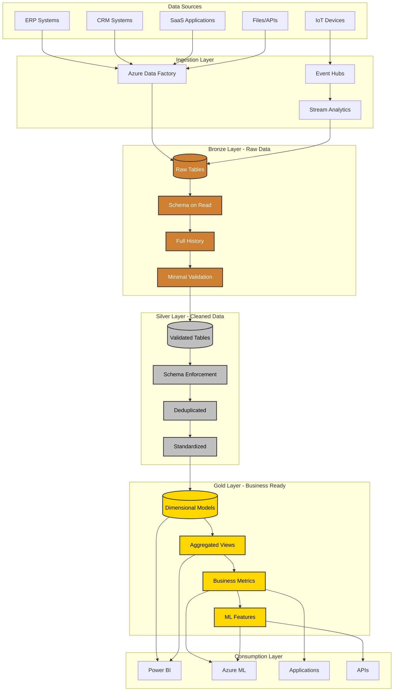
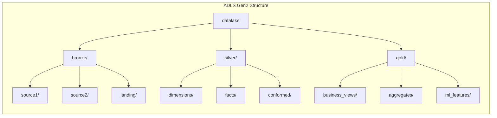
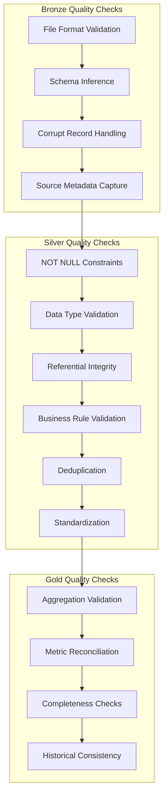

# Medallion Architecture - Lakehouse Pattern

> **🏠 [Home](../../../README.md)** | **📖 [Documentation](../../README.md)** | **🏗️ [Architecture Patterns](../README.md)** | **Medallion Architecture**


Multi-layered data architecture pattern that incrementally refines data quality from raw ingestion to business-ready analytics using Bronze, Silver, and Gold layers.

---

## Table of Contents

- [Overview](#overview)
- [Architecture Components](#architecture-components)
- [Layer Definitions](#layer-definitions)
- [Implementation Patterns](#implementation-patterns)
- [Data Quality Framework](#data-quality-framework)
- [Azure Service Mapping](#azure-service-mapping)
- [Code Examples](#code-examples)
- [Performance Optimization](#performance-optimization)
- [Governance and Security](#governance-and-security)
- [Best Practices](#best-practices)
- [Common Patterns](#common-patterns)
- [Troubleshooting](#troubleshooting)

---

## Overview

The Medallion Architecture is a data design pattern used to logically organize data in a lakehouse, with the goal of incrementally improving the structure and quality of data as it flows through each layer of the architecture.

### Key Benefits

- **Progressive Data Quality**: Incremental data refinement from raw to business-ready
- **Simplified Data Lineage**: Clear progression through Bronze, Silver, and Gold layers
- **Flexible Recovery**: Ability to reprocess from any layer
- **Cost Optimization**: Store raw data cheaply, optimize expensive transformations
- **Audit Trail**: Complete history of data transformations

### Architecture Diagram



---

## Architecture Components

### Storage Foundation

#### Azure Data Lake Storage Gen2



**Key Features**:
- Hierarchical namespace for efficient file operations
- POSIX-compliant access control
- Lifecycle management for cost optimization
- Zone redundancy for high availability

### Compute Engines

#### Azure Synapse Analytics Spark Pools

| Pool Configuration | Node Size | Nodes | Use Case |
|-------------------|-----------|-------|----------|
| **Dev/Test** | Small (4 cores) | 3-5 | Development, testing |
| **Bronze Processing** | Medium (8 cores) | 5-15 | Raw data ingestion |
| **Silver Processing** | Large (16 cores) | 10-30 | Data quality, transformations |
| **Gold Processing** | XLarge (32 cores) | 5-20 | Aggregations, ML features |

---

## Layer Definitions

### Bronze Layer - Raw Data Ingestion

**Purpose**: Land raw data with minimal transformation, preserve source fidelity

**Characteristics**:
- Exact copy of source data
- All historical data retained
- Schema inference or loose schema
- Append-only or full refresh patterns
- Minimal data quality checks

**Storage Format**: Delta Lake (for ACID compliance and time travel)

**Data Quality Level**: 0-30%

```python
# Bronze layer ingestion pattern
from delta.tables import DeltaTable
from pyspark.sql.functions import current_timestamp, input_file_name

# Read raw data from source
raw_df = spark.read \
    .format("csv") \
    .option("header", "true") \
    .option("inferSchema", "true") \
    .load("abfss://landing@datalake.dfs.core.windows.net/crm_data/*.csv")

# Add metadata columns
bronze_df = raw_df \
    .withColumn("_ingestion_timestamp", current_timestamp()) \
    .withColumn("_source_file", input_file_name()) \
    .withColumn("_layer", lit("bronze"))

# Write to Bronze layer with Delta Lake
bronze_df.write \
    .format("delta") \
    .mode("append") \
    .option("mergeSchema", "true") \
    .partitionBy("_ingestion_date") \
    .save("abfss://bronze@datalake.dfs.core.windows.net/crm/customers")

# Create or update Delta table
DeltaTable.createOrReplace(spark) \
    .location("abfss://bronze@datalake.dfs.core.windows.net/crm/customers") \
    .addColumns(bronze_df.schema) \
    .partitionedBy("_ingestion_date") \
    .property("delta.enableChangeDataFeed", "true") \
    .execute()
```

### Silver Layer - Cleaned and Conformed Data

**Purpose**: Validated, deduplicated, and standardized data ready for analytics

**Characteristics**:
- Schema enforcement and validation
- Data type standardization
- Deduplication logic applied
- Business rules validation
- Referential integrity checks
- Slowly Changing Dimensions (SCD) implementation

**Storage Format**: Delta Lake with optimizations

**Data Quality Level**: 70-90%

```python
# Silver layer transformation pattern
from pyspark.sql.functions import col, when, trim, upper, regexp_replace
from pyspark.sql.types import DateType, IntegerType

# Read from Bronze
bronze_df = spark.read \
    .format("delta") \
    .load("abfss://bronze@datalake.dfs.core.windows.net/crm/customers")

# Data quality transformations
silver_df = bronze_df \
    .filter(col("customer_id").isNotNull()) \
    .withColumn("email", lower(trim(col("email")))) \
    .withColumn("phone", regexp_replace(col("phone"), "[^0-9]", "")) \
    .withColumn("country_code", upper(trim(col("country_code")))) \
    .withColumn("registration_date", col("registration_date").cast(DateType())) \
    .dropDuplicates(["customer_id"]) \
    .withColumn("_silver_processed_timestamp", current_timestamp())

# Data validation
validated_df = silver_df \
    .filter(col("email").rlike("^[a-zA-Z0-9._%+-]+@[a-zA-Z0-9.-]+\\.[a-zA-Z]{2,}$")) \
    .filter(length(col("phone")) >= 10) \
    .filter(col("country_code").isin(["US", "CA", "UK", "DE", "FR"]))

# Implement SCD Type 2 for history tracking
from delta.tables import DeltaTable

silver_delta = DeltaTable.forPath(spark,
    "abfss://silver@datalake.dfs.core.windows.net/crm/dim_customers")

# Merge with SCD Type 2 logic
silver_delta.alias("target").merge(
    validated_df.alias("source"),
    "target.customer_id = source.customer_id AND target.is_current = true"
).whenMatchedUpdate(
    condition = """
        target.email != source.email OR
        target.phone != source.phone OR
        target.country_code != source.country_code
    """,
    set = {
        "is_current": "false",
        "end_date": "current_date()",
        "updated_timestamp": "current_timestamp()"
    }
).whenNotMatchedInsert(
    values = {
        "customer_id": "source.customer_id",
        "email": "source.email",
        "phone": "source.phone",
        "country_code": "source.country_code",
        "start_date": "current_date()",
        "end_date": "to_date('9999-12-31')",
        "is_current": "true",
        "created_timestamp": "current_timestamp()"
    }
).execute()
```

### Gold Layer - Business-Ready Data

**Purpose**: Aggregated, enriched data optimized for analytics and ML

**Characteristics**:
- Dimensional modeling (star/snowflake schema)
- Business-level aggregations
- Pre-calculated metrics
- Denormalized for query performance
- Feature engineering for ML
- Conformed dimensions

**Storage Format**: Delta Lake with Z-ordering and optimization

**Data Quality Level**: 95-100%

```python
# Gold layer aggregation pattern
from pyspark.sql.functions import sum, count, avg, max, min, last_day

# Read from Silver
dim_customers = spark.read.format("delta") \
    .load("abfss://silver@datalake.dfs.core.windows.net/crm/dim_customers")

fact_orders = spark.read.format("delta") \
    .load("abfss://silver@datalake.dfs.core.windows.net/sales/fact_orders")

# Create business-level aggregation
customer_metrics = fact_orders \
    .join(dim_customers, "customer_id") \
    .groupBy(
        "customer_id",
        "country_code",
        last_day(col("order_date")).alias("month_ending")
    ) \
    .agg(
        count("order_id").alias("total_orders"),
        sum("order_amount").alias("total_revenue"),
        avg("order_amount").alias("avg_order_value"),
        max("order_date").alias("last_order_date"),
        min("order_date").alias("first_order_date")
    ) \
    .withColumn("customer_lifetime_months",
        months_between(col("last_order_date"), col("first_order_date")))

# Write to Gold layer with optimization
customer_metrics.write \
    .format("delta") \
    .mode("overwrite") \
    .partitionBy("country_code", "month_ending") \
    .save("abfss://gold@datalake.dfs.core.windows.net/analytics/customer_metrics")

# Optimize with Z-ordering for common query patterns
from delta.tables import DeltaTable

gold_delta = DeltaTable.forPath(spark,
    "abfss://gold@datalake.dfs.core.windows.net/analytics/customer_metrics")

gold_delta.optimize().executeZOrderBy("customer_id", "month_ending")
```

---

## Data Quality Framework

### Quality Checks by Layer



### Data Quality Implementation

```python
from pyspark.sql.functions import col, when, count, isnan, isnull

class DataQualityChecker:
    """Data Quality framework for Medallion Architecture"""

    def __init__(self, spark, layer):
        self.spark = spark
        self.layer = layer
        self.quality_metrics = []

    def check_completeness(self, df, required_columns):
        """Check for NULL values in required columns"""
        for col_name in required_columns:
            null_count = df.filter(
                col(col_name).isNull() | isnan(col(col_name))
            ).count()

            total_count = df.count()
            completeness_pct = ((total_count - null_count) / total_count) * 100

            self.quality_metrics.append({
                "layer": self.layer,
                "check_type": "completeness",
                "column": col_name,
                "null_count": null_count,
                "total_count": total_count,
                "completeness_pct": completeness_pct,
                "passed": null_count == 0
            })

        return self

    def check_uniqueness(self, df, unique_columns):
        """Check for duplicate records"""
        total_count = df.count()
        distinct_count = df.select(unique_columns).distinct().count()
        duplicate_count = total_count - distinct_count

        self.quality_metrics.append({
            "layer": self.layer,
            "check_type": "uniqueness",
            "column": ",".join(unique_columns),
            "duplicate_count": duplicate_count,
            "total_count": total_count,
            "uniqueness_pct": (distinct_count / total_count) * 100,
            "passed": duplicate_count == 0
        })

        return self

    def check_validity(self, df, column, validation_expr):
        """Check data validity against business rules"""
        invalid_count = df.filter(~validation_expr).count()
        total_count = df.count()

        self.quality_metrics.append({
            "layer": self.layer,
            "check_type": "validity",
            "column": column,
            "invalid_count": invalid_count,
            "total_count": total_count,
            "validity_pct": ((total_count - invalid_count) / total_count) * 100,
            "passed": invalid_count == 0
        })

        return self

    def get_quality_report(self):
        """Generate quality report DataFrame"""
        from pyspark.sql import Row

        report_df = self.spark.createDataFrame(
            [Row(**metric) for metric in self.quality_metrics]
        )

        return report_df

    def save_quality_metrics(self, path):
        """Save quality metrics to Delta table"""
        report_df = self.get_quality_report()

        report_df.write \
            .format("delta") \
            .mode("append") \
            .partitionBy("layer") \
            .save(path)

# Example usage
silver_df = spark.read.format("delta") \
    .load("abfss://silver@datalake.dfs.core.windows.net/crm/customers")

quality_checker = DataQualityChecker(spark, "silver")

quality_checker \
    .check_completeness(silver_df, ["customer_id", "email", "country_code"]) \
    .check_uniqueness(silver_df, ["customer_id"]) \
    .check_validity(silver_df, "email",
        col("email").rlike("^[a-zA-Z0-9._%+-]+@[a-zA-Z0-9.-]+\\.[a-zA-Z]{2,}$"))

quality_report = quality_checker.get_quality_report()
quality_report.show()

quality_checker.save_quality_metrics(
    "abfss://gold@datalake.dfs.core.windows.net/monitoring/data_quality_metrics"
)
```

---

## Azure Service Mapping

### Complete Service Stack

| Layer | Primary Service | Supporting Services | Purpose |
|-------|----------------|-------------------|---------|
| **Ingestion** | Azure Data Factory | Event Hubs, IoT Hub | Data ingestion orchestration |
| **Bronze** | Synapse Spark | Data Lake Gen2, Delta Lake | Raw data landing |
| **Silver** | Synapse Spark | Data Lake Gen2, Delta Lake | Data cleansing, validation |
| **Gold** | Synapse Spark | Data Lake Gen2, Delta Lake | Business aggregations |
| **Serving** | Synapse SQL Serverless | Power BI, Azure ML | Data consumption |
| **Governance** | Azure Purview | Azure Monitor | Metadata, lineage, monitoring |
| **Security** | Azure AD, Key Vault | Private Link, NSG | Authentication, encryption |

### Service Configuration

```json
{
  "storage": {
    "account_name": "csadatalake",
    "account_type": "StorageV2",
    "replication": "ZRS",
    "tier": "Standard",
    "hierarchical_namespace": true,
    "containers": [
      {
        "name": "bronze",
        "public_access": "None",
        "lifecycle_policy": "archive_after_90_days"
      },
      {
        "name": "silver",
        "public_access": "None",
        "lifecycle_policy": "cool_after_30_days"
      },
      {
        "name": "gold",
        "public_access": "None",
        "lifecycle_policy": "hot"
      }
    ]
  },
  "synapse_workspace": {
    "name": "csa-synapse-workspace",
    "sql_admin": "sqladmin",
    "spark_pools": [
      {
        "name": "bronze-pool",
        "node_size": "Medium",
        "min_nodes": 3,
        "max_nodes": 15,
        "auto_pause_minutes": 15
      },
      {
        "name": "silver-pool",
        "node_size": "Large",
        "min_nodes": 5,
        "max_nodes": 30,
        "auto_pause_minutes": 15
      },
      {
        "name": "gold-pool",
        "node_size": "XLarge",
        "min_nodes": 3,
        "max_nodes": 20,
        "auto_pause_minutes": 20
      }
    ]
  }
}
```

---

## Performance Optimization

### File Size Optimization

**Target File Sizes**:
- Bronze: 128MB - 512MB
- Silver: 256MB - 1GB
- Gold: 512MB - 1GB

```python
# Optimize file sizes during write
df.coalesce(10).write \
    .format("delta") \
    .mode("append") \
    .option("maxRecordsPerFile", 1000000) \
    .save("path/to/delta/table")

# Post-write optimization
from delta.tables import DeltaTable

delta_table = DeltaTable.forPath(spark, "path/to/delta/table")
delta_table.optimize().executeCompaction()
```

### Partition Strategy

```python
# Appropriate partitioning by layer
# Bronze - partition by ingestion date
bronze_df.write \
    .format("delta") \
    .partitionBy("_ingestion_date") \
    .save("bronze/table")

# Silver - partition by business dimension
silver_df.write \
    .format("delta") \
    .partitionBy("country_code", "year", "month") \
    .save("silver/table")

# Gold - partition for optimal query performance
gold_df.write \
    .format("delta") \
    .partitionBy("region", "year_month") \
    .save("gold/table")
```

### Z-Ordering for Gold Layer

```python
from delta.tables import DeltaTable

# Z-order frequently queried columns
gold_table = DeltaTable.forPath(spark,
    "abfss://gold@datalake.dfs.core.windows.net/analytics/sales_summary")

gold_table.optimize().executeZOrderBy("customer_id", "product_category", "date")
```

---

## Best Practices

### 1. Naming Conventions

```text
Bronze Layer:
  bronze/{source_system}/{table_name}/
  Example: bronze/salesforce/accounts/

Silver Layer:
  silver/{domain}/{entity_type}_{table_name}/
  Example: silver/sales/dim_customers/
  Example: silver/sales/fact_orders/

Gold Layer:
  gold/{business_area}/{metric_or_view_name}/
  Example: gold/analytics/customer_lifetime_value/
  Example: gold/ml_features/churn_prediction_features/
```

### 2. Metadata Standards

```python
# Standard metadata columns
metadata_columns = [
    "_ingestion_timestamp",      # When data was ingested
    "_source_system",            # Source system identifier
    "_source_file",              # Original source file
    "_processing_timestamp",     # When transformation occurred
    "_layer",                    # Current layer (bronze/silver/gold)
    "_data_quality_score",       # Quality score (0-100)
    "_is_current",               # For SCD Type 2
    "_effective_start_date",     # For SCD Type 2
    "_effective_end_date"        # For SCD Type 2
]
```

### 3. Error Handling

```python
from pyspark.sql.functions import expr

# Quarantine bad records in Bronze
try:
    clean_df = bronze_df.filter(col("customer_id").isNotNull())
    quarantine_df = bronze_df.filter(col("customer_id").isNull())

    # Write clean records
    clean_df.write.format("delta").mode("append") \
        .save("bronze/customers/clean")

    # Write quarantined records for investigation
    quarantine_df.write.format("delta").mode("append") \
        .partitionBy("_ingestion_date") \
        .save("bronze/customers/quarantine")

except Exception as e:
    # Log error and save to error table
    error_df = spark.createDataFrame([{
        "error_timestamp": current_timestamp(),
        "table_name": "customers",
        "layer": "bronze",
        "error_message": str(e),
        "record_count": bronze_df.count()
    }])

    error_df.write.format("delta").mode("append") \
        .save("monitoring/processing_errors")

    raise
```

---

## Common Patterns

### Incremental Processing Pattern

```python
from delta.tables import DeltaTable
from pyspark.sql.functions import max as spark_max

def incremental_bronze_to_silver(source_path, target_path, watermark_column):
    """Incremental processing from Bronze to Silver"""

    # Get last processed watermark
    try:
        silver_table = DeltaTable.forPath(spark, target_path)
        last_watermark = silver_table.toDF() \
            .select(spark_max(watermark_column)) \
            .collect()[0][0]
    except:
        last_watermark = "1900-01-01"

    # Read only new data from Bronze
    bronze_df = spark.read.format("delta").load(source_path) \
        .filter(col(watermark_column) > last_watermark)

    # Apply Silver transformations
    silver_df = bronze_df \
        .dropDuplicates(["customer_id"]) \
        .filter(col("customer_id").isNotNull())

    # Merge into Silver
    silver_table.alias("target").merge(
        silver_df.alias("source"),
        "target.customer_id = source.customer_id"
    ).whenMatchedUpdateAll() \
     .whenNotMatchedInsertAll() \
     .execute()

# Usage
incremental_bronze_to_silver(
    "bronze/crm/customers",
    "silver/crm/dim_customers",
    "_ingestion_timestamp"
)
```

---

## Troubleshooting

### Common Issues

| Issue | Symptom | Solution |
|-------|---------|----------|
| **Small Files** | Slow queries, high metadata overhead | Run OPTIMIZE regularly |
| **Skewed Data** | Unbalanced partitions | Repartition by high-cardinality columns |
| **Schema Drift** | Schema evolution errors | Enable mergeSchema option |
| **Slow Writes** | Long ingestion times | Increase parallelism, optimize file size |
| **Memory Errors** | OOM exceptions | Increase executor memory, reduce partition size |

### Monitoring Queries

```sql
-- Check Delta table details
DESCRIBE DETAIL delta.`/path/to/table`;

-- View transaction history
DESCRIBE HISTORY delta.`/path/to/table` LIMIT 20;

-- Check file statistics
SELECT
    COUNT(*) as num_files,
    SUM(size_bytes)/1024/1024/1024 as total_size_gb,
    AVG(size_bytes)/1024/1024 as avg_file_size_mb
FROM delta.`/path/to/table/_delta_log`;
```

---

**Related Documentation**:
- [Delta Lake Guide](../../code-examples/delta-lake-guide.md)
- [Performance Optimization](../../best-practices/performance-optimization.md)
- [Data Quality Patterns](../../best-practices/data-governance.md)

---

*Last Updated: 2025-01-28*
*Version: 1.0*
