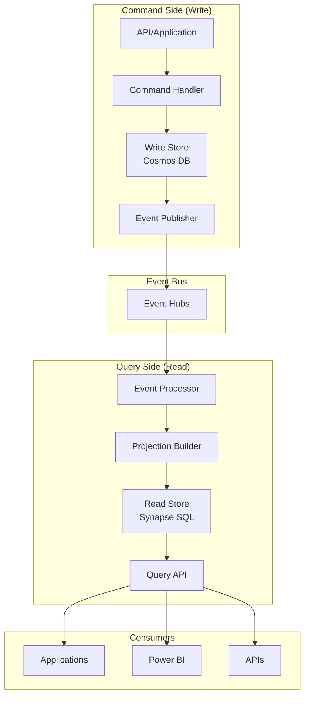

# 📊 CQRS Pattern

> __🏠 [Home](../../../README.md)__ | __🏗️ [Architecture](../README.md)__ | __📊 Data Patterns__ | __CQRS__


Command Query Responsibility Segregation (CQRS) pattern for Azure analytics architectures.

---

## 🎯 Overview

CQRS separates read and write operations into distinct models, enabling:

- **Optimized read models** for analytics queries
- **Scalable write models** for high-throughput ingestion
- **Independent scaling** of read and write workloads
- **Eventual consistency** with event-driven synchronization

---

## 🏗️ Architecture



---

## 🔧 Implementation

### Command Side (Write Model)

```python
# Azure Functions - Command Handler
import azure.functions as func
from azure.cosmos import CosmosClient
from azure.eventhub import EventHubProducerClient
import json

cosmos_client = CosmosClient.from_connection_string(os.environ["COSMOS_CONNECTION"])
database = cosmos_client.get_database_client("orders")
container = database.get_container_client("order-commands")

eventhub_producer = EventHubProducerClient.from_connection_string(
    os.environ["EVENTHUB_CONNECTION"],
    eventhub_name="order-events"
)

def main(req: func.HttpRequest) -> func.HttpResponse:
    command = req.get_json()

    # Validate command
    if command["type"] == "CreateOrder":
        # Process command
        order = {
            "id": str(uuid.uuid4()),
            "customerId": command["customerId"],
            "items": command["items"],
            "status": "Created",
            "createdAt": datetime.utcnow().isoformat()
        }

        # Store in write model
        container.create_item(body=order)

        # Publish event
        event = {
            "eventType": "OrderCreated",
            "data": order,
            "timestamp": datetime.utcnow().isoformat()
        }

        event_batch = eventhub_producer.create_batch()
        event_batch.add(EventData(json.dumps(event)))
        eventhub_producer.send_batch(event_batch)

        return func.HttpResponse(json.dumps(order), status_code=201)
```

### Event Processing (Projection Builder)

```python
# Databricks Structured Streaming - Event Processor
from pyspark.sql import SparkSession
from pyspark.sql.functions import *
from delta.tables import DeltaTable

spark = SparkSession.builder.appName("CQRS-Projections").getOrCreate()

# Read from Event Hubs
events_df = (spark.readStream
    .format("eventhubs")
    .options(**eventhub_config)
    .load()
    .select(
        get_json_object(col("body").cast("string"), "$.eventType").alias("event_type"),
        get_json_object(col("body").cast("string"), "$.data").alias("data"),
        col("enqueuedTime").alias("event_time")
    )
)

# Build read model projections
def update_order_projection(batch_df, batch_id):
    # Filter for order events
    orders = batch_df.filter(col("event_type").isin(["OrderCreated", "OrderUpdated"]))

    if orders.count() > 0:
        # Parse order data
        parsed_orders = orders.select(
            get_json_object(col("data"), "$.id").alias("order_id"),
            get_json_object(col("data"), "$.customerId").alias("customer_id"),
            get_json_object(col("data"), "$.status").alias("status"),
            col("event_time")
        )

        # Merge into read model
        read_model = DeltaTable.forPath(spark, "/read-models/orders")

        read_model.alias("target").merge(
            parsed_orders.alias("source"),
            "target.order_id = source.order_id"
        ).whenMatchedUpdateAll().whenNotMatchedInsertAll().execute()

# Start streaming
(events_df.writeStream
    .foreachBatch(update_order_projection)
    .option("checkpointLocation", "/checkpoints/order-projection")
    .start())
```

### Query Side (Read Model)

```sql
-- Synapse Serverless SQL - Read Model View
CREATE VIEW dbo.vw_order_summary AS
SELECT
    o.order_id,
    o.customer_id,
    c.customer_name,
    o.status,
    o.total_amount,
    o.item_count,
    o.created_date,
    o.updated_date
FROM OPENROWSET(
    BULK 'https://datalake.dfs.core.windows.net/read-models/orders/',
    FORMAT = 'DELTA'
) AS o
JOIN OPENROWSET(
    BULK 'https://datalake.dfs.core.windows.net/read-models/customers/',
    FORMAT = 'DELTA'
) AS c ON o.customer_id = c.customer_id;

-- Optimized for common query patterns
CREATE VIEW dbo.vw_daily_order_metrics AS
SELECT
    CAST(created_date AS DATE) AS order_date,
    COUNT(*) AS order_count,
    SUM(total_amount) AS total_revenue,
    AVG(total_amount) AS avg_order_value,
    COUNT(DISTINCT customer_id) AS unique_customers
FROM OPENROWSET(
    BULK 'https://datalake.dfs.core.windows.net/read-models/orders/',
    FORMAT = 'DELTA'
) AS o
GROUP BY CAST(created_date AS DATE);
```

---

## 🛡️ Best Practices

### 1. Event Design

```json
{
    "eventId": "uuid",
    "eventType": "OrderCreated",
    "aggregateId": "order-123",
    "aggregateType": "Order",
    "version": 1,
    "timestamp": "2025-01-15T10:30:00Z",
    "correlationId": "request-456",
    "causationId": "command-789",
    "data": {
        "orderId": "order-123",
        "customerId": "cust-001",
        "items": [...]
    },
    "metadata": {
        "userId": "user-001",
        "source": "web-app"
    }
}
```

### 2. Eventual Consistency

```python
# Track projection lag
def monitor_projection_lag():
    # Get latest event time from Event Hubs
    latest_event = spark.sql("""
        SELECT MAX(event_time) as latest_event
        FROM eventhub_events
    """).collect()[0]["latest_event"]

    # Get latest projection time
    latest_projection = spark.sql("""
        SELECT MAX(updated_at) as latest_update
        FROM delta.`/read-models/orders`
    """).collect()[0]["latest_update"]

    lag_seconds = (latest_event - latest_projection).total_seconds()

    # Alert if lag exceeds threshold
    if lag_seconds > 60:
        send_alert(f"CQRS projection lag: {lag_seconds}s")
```

---

## 📚 Related Documentation

- [Event Sourcing](event-sourcing.md)
- [Event Hubs Configuration](../../02-services/streaming-services/azure-event-hubs/README.md)
- [Cosmos DB Patterns](../../02-services/storage-services/azure-cosmos-db/README.md)

---

*Last Updated: January 2025*
