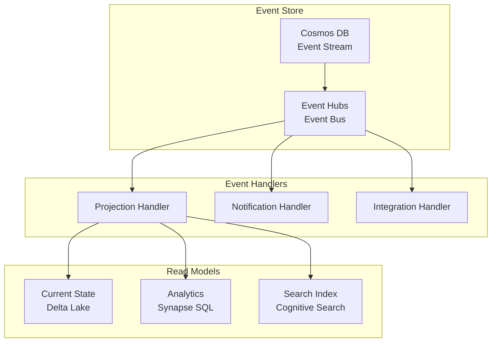

# 📝 Event Sourcing Pattern

> __🏠 [Home](../../../README.md)__ | __🏗️ [Architecture](../README.md)__ | __📊 Data Patterns__ | __Event Sourcing__


Event sourcing pattern implementation for Azure analytics and data platforms.

---

## 🎯 Overview

Event sourcing persists the state of a business entity as a sequence of events. Benefits include:

- **Complete audit trail** of all state changes
- **Time travel** - reconstruct state at any point in time
- **Event replay** - rebuild projections or fix bugs
- **Debugging** - understand exactly what happened and when

---

## 🏗️ Architecture



---

## 🔧 Implementation

### Event Store (Cosmos DB)

```python
from azure.cosmos import CosmosClient, PartitionKey
import json
from datetime import datetime
import uuid

class EventStore:
    def __init__(self, connection_string, database_name):
        client = CosmosClient.from_connection_string(connection_string)
        self.database = client.get_database_client(database_name)
        self.container = self.database.get_container_client("events")

    def append_event(self, aggregate_id: str, event_type: str, data: dict,
                     expected_version: int = None):
        """Append a new event to the event stream with optimistic concurrency."""

        # Get current version
        current_version = self._get_current_version(aggregate_id)

        # Optimistic concurrency check
        if expected_version is not None and current_version != expected_version:
            raise ConcurrencyError(
                f"Expected version {expected_version}, but current is {current_version}"
            )

        event = {
            "id": str(uuid.uuid4()),
            "aggregateId": aggregate_id,
            "eventType": event_type,
            "version": current_version + 1,
            "timestamp": datetime.utcnow().isoformat(),
            "data": data
        }

        self.container.create_item(body=event, partition_key=aggregate_id)
        return event

    def get_events(self, aggregate_id: str, from_version: int = 0):
        """Get all events for an aggregate from a specific version."""
        query = """
            SELECT * FROM c
            WHERE c.aggregateId = @aggregateId
              AND c.version > @fromVersion
            ORDER BY c.version ASC
        """

        parameters = [
            {"name": "@aggregateId", "value": aggregate_id},
            {"name": "@fromVersion", "value": from_version}
        ]

        return list(self.container.query_items(
            query=query,
            parameters=parameters,
            partition_key=aggregate_id
        ))

    def _get_current_version(self, aggregate_id: str) -> int:
        query = """
            SELECT VALUE MAX(c.version)
            FROM c
            WHERE c.aggregateId = @aggregateId
        """

        result = list(self.container.query_items(
            query=query,
            parameters=[{"name": "@aggregateId", "value": aggregate_id}],
            partition_key=aggregate_id
        ))

        return result[0] if result[0] else 0
```

### Aggregate Implementation

```python
from abc import ABC, abstractmethod
from typing import List, Dict, Any

class Aggregate(ABC):
    def __init__(self):
        self.id = None
        self.version = 0
        self._changes: List[Dict] = []

    @abstractmethod
    def apply(self, event: Dict) -> None:
        """Apply an event to update aggregate state."""
        pass

    def load_from_history(self, events: List[Dict]) -> None:
        """Reconstruct aggregate state from event history."""
        for event in events:
            self.apply(event)
            self.version = event["version"]

    def get_uncommitted_changes(self) -> List[Dict]:
        """Get events that haven't been persisted yet."""
        return self._changes

    def mark_changes_committed(self) -> None:
        """Clear uncommitted changes after persistence."""
        self._changes = []

    def _raise_event(self, event_type: str, data: Dict) -> None:
        """Raise a new domain event."""
        event = {
            "aggregateId": self.id,
            "eventType": event_type,
            "data": data,
            "version": self.version + len(self._changes) + 1
        }
        self._changes.append(event)
        self.apply(event)


class Order(Aggregate):
    def __init__(self):
        super().__init__()
        self.customer_id = None
        self.items = []
        self.status = None
        self.total_amount = 0

    # Commands
    def create(self, order_id: str, customer_id: str, items: List[Dict]):
        if self.id is not None:
            raise InvalidOperationError("Order already exists")

        self._raise_event("OrderCreated", {
            "orderId": order_id,
            "customerId": customer_id,
            "items": items,
            "totalAmount": sum(i["quantity"] * i["price"] for i in items)
        })

    def confirm(self):
        if self.status != "Created":
            raise InvalidOperationError(f"Cannot confirm order in {self.status} status")

        self._raise_event("OrderConfirmed", {
            "orderId": self.id
        })

    def ship(self, tracking_number: str):
        if self.status != "Confirmed":
            raise InvalidOperationError(f"Cannot ship order in {self.status} status")

        self._raise_event("OrderShipped", {
            "orderId": self.id,
            "trackingNumber": tracking_number
        })

    # Event handlers
    def apply(self, event: Dict) -> None:
        event_type = event["eventType"]
        data = event["data"]

        if event_type == "OrderCreated":
            self.id = data["orderId"]
            self.customer_id = data["customerId"]
            self.items = data["items"]
            self.total_amount = data["totalAmount"]
            self.status = "Created"

        elif event_type == "OrderConfirmed":
            self.status = "Confirmed"

        elif event_type == "OrderShipped":
            self.status = "Shipped"
```

### Event Projection (Databricks)

```python
from pyspark.sql import SparkSession
from pyspark.sql.functions import *
from delta.tables import DeltaTable

# Stream events from Cosmos DB change feed
events_df = (spark.readStream
    .format("cosmos.oltp.changeFeed")
    .options(**cosmos_config)
    .load()
)

def build_order_projection(batch_df, batch_id):
    """Build current state projection from events."""

    # Process each event type
    created_events = batch_df.filter(col("eventType") == "OrderCreated")
    confirmed_events = batch_df.filter(col("eventType") == "OrderConfirmed")
    shipped_events = batch_df.filter(col("eventType") == "OrderShipped")

    # Build current state view
    if created_events.count() > 0:
        new_orders = created_events.select(
            get_json_object(col("data"), "$.orderId").alias("order_id"),
            get_json_object(col("data"), "$.customerId").alias("customer_id"),
            get_json_object(col("data"), "$.totalAmount").cast("decimal(18,2)").alias("total_amount"),
            lit("Created").alias("status"),
            col("timestamp").alias("created_at"),
            col("timestamp").alias("updated_at")
        )

        # Insert new orders
        new_orders.write.format("delta").mode("append").save("/projections/orders")

    # Update statuses
    if confirmed_events.count() > 0:
        orders_table = DeltaTable.forPath(spark, "/projections/orders")

        for row in confirmed_events.collect():
            order_id = json.loads(row["data"])["orderId"]
            orders_table.update(
                condition=f"order_id = '{order_id}'",
                set={"status": lit("Confirmed"), "updated_at": lit(row["timestamp"])}
            )

# Start projection builder
(events_df.writeStream
    .foreachBatch(build_order_projection)
    .option("checkpointLocation", "/checkpoints/order-projection")
    .start())
```

### Time Travel Query

```python
def get_order_state_at(order_id: str, point_in_time: datetime) -> Order:
    """Reconstruct order state at a specific point in time."""

    events = event_store.get_events(order_id)

    # Filter events up to the point in time
    historical_events = [
        e for e in events
        if datetime.fromisoformat(e["timestamp"]) <= point_in_time
    ]

    # Reconstruct state
    order = Order()
    order.load_from_history(historical_events)

    return order

# Example: Get order state from yesterday
yesterday = datetime.utcnow() - timedelta(days=1)
historical_order = get_order_state_at("order-123", yesterday)
```

---

## 🛡️ Best Practices

### Event Schema Evolution

```json
{
    "eventType": "OrderCreated",
    "version": 2,
    "data": {
        "orderId": "string",
        "customerId": "string",
        "items": "array",
        "totalAmount": "decimal",
        "currency": "string (added in v2)"
    },
    "metadata": {
        "schemaVersion": 2,
        "upgradedFrom": 1
    }
}
```

### Snapshot Strategy

```python
class SnapshotStore:
    """Store periodic snapshots to speed up aggregate loading."""

    def save_snapshot(self, aggregate: Aggregate):
        snapshot = {
            "aggregateId": aggregate.id,
            "version": aggregate.version,
            "state": aggregate.__dict__,
            "timestamp": datetime.utcnow().isoformat()
        }
        self.container.upsert_item(snapshot)

    def load_aggregate(self, aggregate_id: str, aggregate_class) -> Aggregate:
        # Try to load from snapshot
        snapshot = self.get_latest_snapshot(aggregate_id)

        aggregate = aggregate_class()

        if snapshot:
            # Restore from snapshot
            aggregate.__dict__.update(snapshot["state"])
            from_version = snapshot["version"]
        else:
            from_version = 0

        # Apply events after snapshot
        events = self.event_store.get_events(aggregate_id, from_version)
        aggregate.load_from_history(events)

        return aggregate
```

---

## 📚 Related Documentation

- [CQRS Pattern](cqrs.md)
- [Event Hubs Configuration](../../02-services/streaming-services/azure-event-hubs/README.md)
- [Cosmos DB Patterns](../../02-services/storage-services/azure-cosmos-db/README.md)

---

*Last Updated: January 2025*
