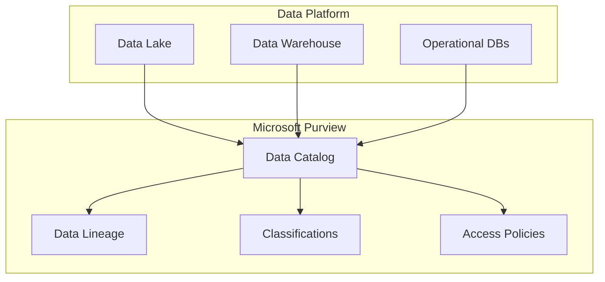
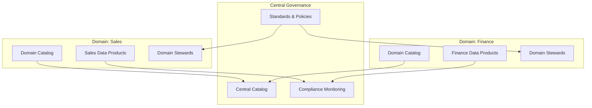

# 🔐 Data Governance Patterns

> __🏠 [Home](../../../README.md)__ | __🏗️ [Architecture](../README.md)__ | __🔐 Governance Patterns__


Architecture patterns for implementing data governance in Azure analytics platforms.

---

## 🎯 Overview

Data governance ensures data quality, security, and compliance across your analytics platform. Key concerns:

- **Data Quality**: Accuracy, completeness, consistency
- **Data Security**: Access control, encryption, masking
- **Data Lineage**: Tracking data origin and transformations
- **Data Catalog**: Discovery and documentation
- **Compliance**: Regulatory requirements (GDPR, HIPAA, etc.)

---

## 📊 Pattern Catalog

### Centralized Governance

Single governance platform managing all data assets.



### Federated Governance

Domain teams manage their own data with central coordination.



---

## 🔧 Implementation Patterns

### Access Control Pattern

```python
# Unity Catalog row-level security
from pyspark.sql import SparkSession

spark = SparkSession.builder.appName("Governance").getOrCreate()

# Create catalog and schema
spark.sql("CREATE CATALOG IF NOT EXISTS analytics")
spark.sql("USE CATALOG analytics")
spark.sql("CREATE SCHEMA IF NOT EXISTS sales")

# Create table with row filter
spark.sql("""
    CREATE TABLE sales.orders (
        order_id BIGINT,
        customer_id STRING,
        region STRING,
        amount DECIMAL(18,2)
    )
""")

# Create row filter function
spark.sql("""
    CREATE FUNCTION sales.region_filter(region STRING)
    RETURNS BOOLEAN
    RETURN (
        CASE
            WHEN is_account_group_member('admin_group') THEN true
            WHEN is_account_group_member('na_group') AND region = 'North America' THEN true
            WHEN is_account_group_member('eu_group') AND region = 'Europe' THEN true
            ELSE false
        END
    )
""")

# Apply row filter to table
spark.sql("""
    ALTER TABLE sales.orders
    SET ROW FILTER sales.region_filter ON (region)
""")
```

### Data Masking Pattern

```sql
-- Synapse dynamic data masking
CREATE TABLE dbo.customers (
    customer_id INT PRIMARY KEY,
    email VARCHAR(100) MASKED WITH (FUNCTION = 'email()'),
    ssn CHAR(11) MASKED WITH (FUNCTION = 'partial(0,"XXX-XX-",4)'),
    phone VARCHAR(20) MASKED WITH (FUNCTION = 'partial(0,"******",4)'),
    credit_card VARCHAR(19) MASKED WITH (FUNCTION = 'partial(0,"****-****-****-",4)')
);

-- Grant unmask permission to specific users
GRANT UNMASK TO [DataAnalyst];
```

### Data Quality Pattern

```python
from pyspark.sql import SparkSession
from pyspark.sql.functions import *

def validate_data_quality(df, rules):
    """Apply data quality rules and flag violations."""

    results = df

    for rule in rules:
        rule_name = rule["name"]
        condition = rule["condition"]

        # Add validation column
        results = results.withColumn(
            f"dq_{rule_name}",
            when(expr(condition), lit("PASS")).otherwise(lit("FAIL"))
        )

    return results

# Define quality rules
quality_rules = [
    {"name": "non_null_customer", "condition": "customer_id IS NOT NULL"},
    {"name": "valid_amount", "condition": "amount >= 0"},
    {"name": "valid_date", "condition": "order_date <= current_date()"},
    {"name": "valid_email", "condition": "email RLIKE '^[A-Za-z0-9._%+-]+@[A-Za-z0-9.-]+\\.[A-Za-z]{2,}$'"}
]

# Apply rules
validated_df = validate_data_quality(source_df, quality_rules)

# Separate valid and invalid records
valid_records = validated_df.filter(
    ~array_contains(
        array([col(c) for c in validated_df.columns if c.startswith("dq_")]),
        lit("FAIL")
    )
)

invalid_records = validated_df.filter(
    array_contains(
        array([col(c) for c in validated_df.columns if c.startswith("dq_")]),
        lit("FAIL")
    )
)

# Write to quarantine
invalid_records.write.format("delta").mode("append").save("/quarantine/orders")
```

---

## 📚 Related Documentation

- [Azure Purview Integration](../../02-services/data-governance/azure-purview/README.md)
- [Security Best Practices](../../05-best-practices/cross-cutting-concerns/security/README.md)
- [Data Quality Patterns](../../05-best-practices/cross-cutting-concerns/data-governance/README.md)

---

*Last Updated: January 2025*
