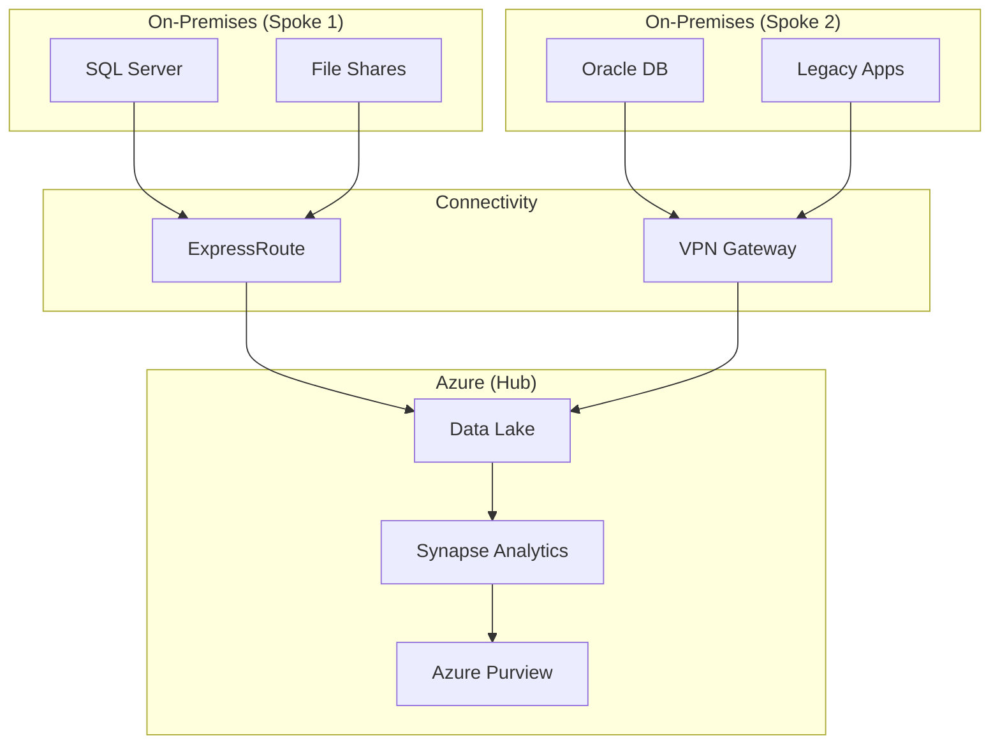
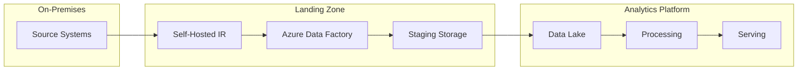

# 🔀 Hybrid Architecture Patterns

> __🏠 [Home](../../../README.md)__ | __🏗️ [Architecture](../README.md)__ | __🔀 Hybrid Architectures__


Architecture patterns for hybrid cloud and multi-cloud analytics deployments.

---

## 🎯 Overview

Hybrid architectures combine on-premises infrastructure with Azure cloud services, enabling:

- **Gradual migration** from legacy systems
- **Data sovereignty** compliance
- **Latency optimization** for edge workloads
- **Cost optimization** through workload placement
- **Disaster recovery** across environments

---

## 📊 Pattern Catalog

### [Global Data Distribution](global-data-distribution.md)

Patterns for distributing data across multiple Azure regions and on-premises locations.

### Hub-and-Spoke Hybrid

Central Azure hub with on-premises spokes.



### Data Landing Zone

Staged data ingestion from multiple sources.



---

## 🔧 Implementation

### Self-Hosted Integration Runtime

```json
{
    "name": "OnPremisesIR",
    "type": "Microsoft.DataFactory/factories/integrationRuntimes",
    "properties": {
        "type": "SelfHosted",
        "description": "Integration runtime for on-premises data sources"
    }
}
```

### ExpressRoute Configuration

```bicep
resource expressRouteCircuit 'Microsoft.Network/expressRouteCircuits@2023-05-01' = {
  name: 'er-hybrid-analytics'
  location: location
  sku: {
    name: 'Standard_MeteredData'
    tier: 'Standard'
    family: 'MeteredData'
  }
  properties: {
    serviceProviderProperties: {
      serviceProviderName: 'Equinix'
      peeringLocation: 'Washington DC'
      bandwidthInMbps: 1000
    }
  }
}
```

---

## 📚 Related Documentation

- [Global Data Distribution](global-data-distribution.md)
- [Network Security](../../05-best-practices/cross-cutting-concerns/networking/README.md)
- [Migration Strategies](../../05-best-practices/migration-strategies.md)

---

*Last Updated: January 2025*
