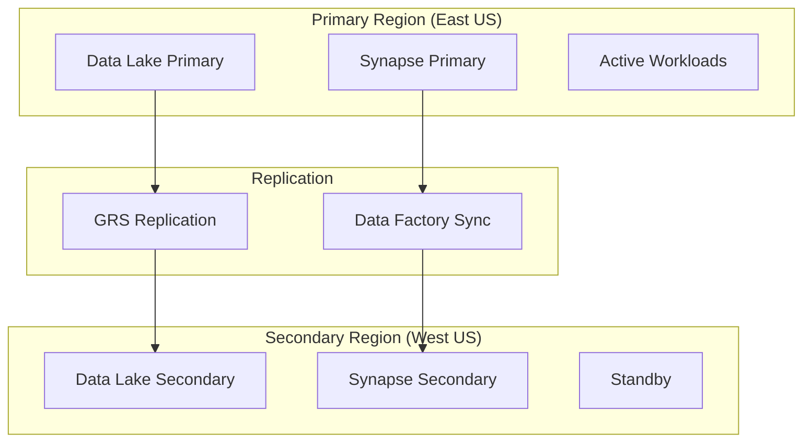
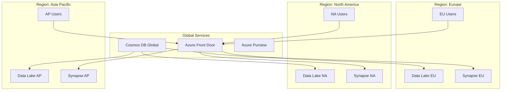
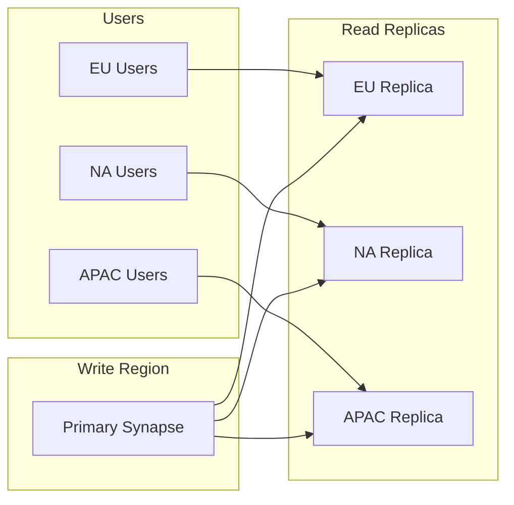

# 🌍 Global Data Distribution Patterns

> __🏠 [Home](../../../README.md)__ | __🏗️ [Architecture](../README.md)__ | __🔀 [Hybrid](README.md)__ | __🌍 Global Distribution__


Patterns for distributing analytics data across multiple Azure regions and geographies.

---

## 🎯 Overview

Global data distribution enables:

- **Low latency** access for users worldwide
- **Data residency** compliance (GDPR, data sovereignty)
- **Disaster recovery** with geo-redundancy
- **Load distribution** across regions

---

## 🏗️ Architecture Patterns

### Active-Passive Multi-Region



### Active-Active Multi-Region



---

## 🔧 Implementation

### Geo-Replicated Storage

```bicep
resource storageAccount 'Microsoft.Storage/storageAccounts@2023-01-01' = {
  name: 'datalakeglobal'
  location: 'eastus'
  sku: {
    name: 'Standard_GZRS'  // Geo-zone-redundant storage
  }
  kind: 'StorageV2'
  properties: {
    isHnsEnabled: true  // Enable hierarchical namespace for ADLS Gen2
    accessTier: 'Hot'
    supportsHttpsTrafficOnly: true
    minimumTlsVersion: 'TLS1_2'
  }
}
```

### Cross-Region Data Factory Pipeline

```json
{
    "name": "CrossRegionSync",
    "properties": {
        "activities": [
            {
                "name": "CopyToSecondaryRegion",
                "type": "Copy",
                "inputs": [
                    {
                        "referenceName": "PrimaryDataLake",
                        "type": "DatasetReference"
                    }
                ],
                "outputs": [
                    {
                        "referenceName": "SecondaryDataLake",
                        "type": "DatasetReference"
                    }
                ],
                "typeProperties": {
                    "source": {
                        "type": "ParquetSource"
                    },
                    "sink": {
                        "type": "ParquetSink"
                    },
                    "enableStaging": false
                }
            }
        ],
        "parameters": {
            "sourcePath": {
                "type": "string"
            },
            "sinkPath": {
                "type": "string"
            }
        }
    }
}
```

### Cosmos DB Multi-Region

```python
from azure.cosmos import CosmosClient

# Configure multi-region writes
client = CosmosClient(
    url="https://cosmos-global.documents.azure.com:443/",
    credential=credential,
    preferred_locations=["East US", "West Europe", "Southeast Asia"],
    enable_endpoint_discovery=True,
    multiple_write_locations=True
)

# Database operations automatically route to nearest region
database = client.get_database_client("analytics")
container = database.get_container_client("metrics")

# Writes go to nearest region, then replicate globally
container.upsert_item({
    "id": "metric-001",
    "region": "auto-detected",
    "value": 100,
    "timestamp": datetime.utcnow().isoformat()
})
```

---

## 🛡️ Data Residency Compliance

### Regional Data Boundaries

```python
def get_allowed_regions(data_classification: str, user_location: str) -> list:
    """Determine allowed Azure regions based on data classification and user location."""

    region_policies = {
        "pii_eu": ["westeurope", "northeurope", "francecentral", "germanywestcentral"],
        "pii_us": ["eastus", "westus2", "centralus"],
        "pii_apac": ["southeastasia", "australiaeast", "japaneast"],
        "public": ["*"],  # All regions allowed
        "confidential": ["eastus", "westeurope"]  # Restricted regions only
    }

    classification_key = f"{data_classification}_{user_location}"

    if classification_key in region_policies:
        return region_policies[classification_key]
    elif data_classification in region_policies:
        return region_policies[data_classification]
    else:
        return region_policies.get("public", ["eastus"])
```

### Geo-Fencing Queries

```sql
-- Synapse SQL view with region filtering
CREATE VIEW dbo.vw_regional_data AS
SELECT
    d.*,
    r.region_name,
    r.data_residency_zone
FROM dbo.data_records d
JOIN dbo.region_mapping r ON d.region_code = r.region_code
WHERE
    -- Apply geo-fencing based on user context
    r.data_residency_zone = SESSION_CONTEXT(N'user_zone')
    OR SESSION_CONTEXT(N'user_role') = 'GlobalAdmin';
```

---

## 📊 Latency Optimization

### Read Replica Strategy



### CDN for Analytics Assets

```bicep
resource cdnProfile 'Microsoft.Cdn/profiles@2023-05-01' = {
  name: 'cdn-analytics-assets'
  location: 'global'
  sku: {
    name: 'Standard_Microsoft'
  }
}

resource cdnEndpoint 'Microsoft.Cdn/profiles/endpoints@2023-05-01' = {
  parent: cdnProfile
  name: 'analytics-reports'
  location: 'global'
  properties: {
    originHostHeader: 'datalakeglobal.blob.core.windows.net'
    origins: [
      {
        name: 'datalake-origin'
        properties: {
          hostName: 'datalakeglobal.blob.core.windows.net'
        }
      }
    ]
    isHttpAllowed: false
    isHttpsAllowed: true
  }
}
```

---

## 📚 Related Documentation

- [Hybrid Architectures Overview](README.md)
- [Disaster Recovery](../../05-best-practices/operational-excellence/reliability.md)
- [Network Security](../../05-best-practices/cross-cutting-concerns/networking/README.md)

---

*Last Updated: January 2025*
