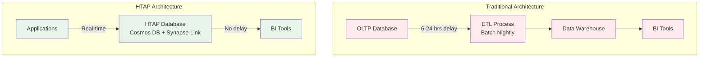
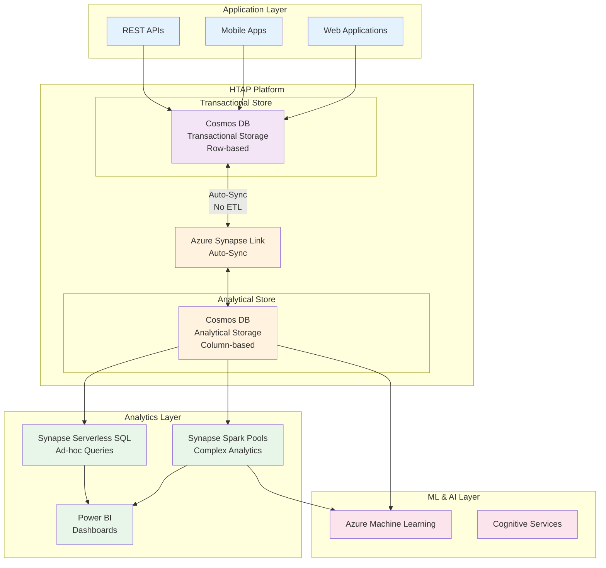
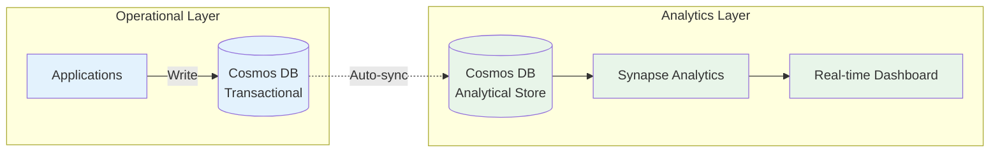
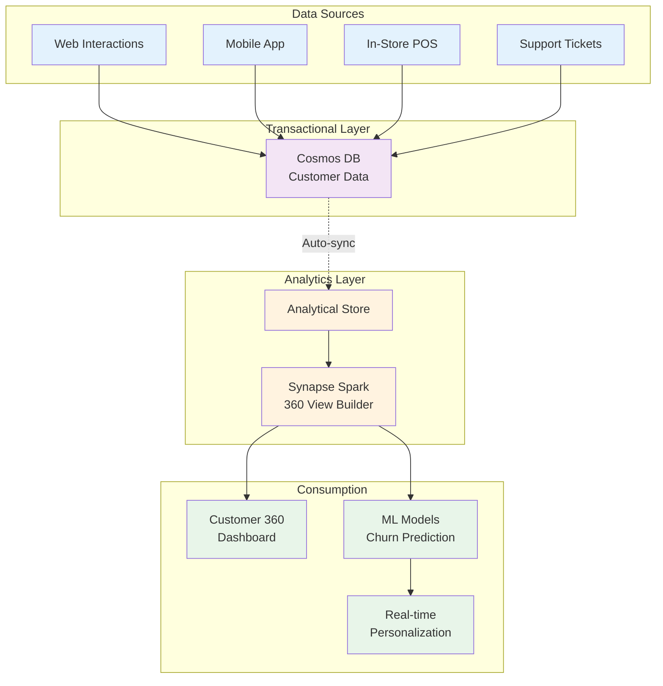

# 🔄 HTAP (Hybrid Transactional/Analytical Processing) Patterns

> __🏠 [Home](../../../README.md)__ | __📖 [Architecture Patterns](../README.md)__ | __🔄 Hybrid Architectures__ | __🔄 HTAP Patterns__


Enable real-time analytics on operational data without the complexity and latency of traditional ETL processes by combining transactional and analytical workloads on a unified platform.

---

## 📋 Table of Contents

- [Overview](#overview)
- [Architecture Components](#architecture-components)
- [Azure Service Mapping](#azure-service-mapping)
- [Implementation Patterns](#implementation-patterns)
- [Use Cases](#use-cases)
- [Performance Optimization](#performance-optimization)
- [Best Practices](#best-practices)
- [Cost Optimization](#cost-optimization)
- [Related Patterns](#related-patterns)

---

## 🎯 Overview

HTAP (Hybrid Transactional/Analytical Processing) enables organizations to run analytics directly on operational data in real-time, eliminating the need for traditional ETL processes and reducing data latency from hours to seconds.

### Core Principles

- __Unified Platform__: Single system for both OLTP and OLAP workloads
- __Real-time Analytics__: No ETL delay for analytical insights
- __Operational Intelligence__: Live business metrics and KPIs
- __Zero Data Duplication__: Analyze operational data in place
- __Workload Isolation__: Prevent analytics from impacting transactions

### Architecture Benefits

| Benefit | Description | Business Impact |
|---------|-------------|----------------|
| __Real-time Insights__ | Analytics on live data | Faster decision making |
| __Simplified Architecture__ | No separate data warehouse | Reduced complexity |
| __Cost Efficiency__ | No data duplication | Lower storage costs |
| __Operational Intelligence__ | Live business metrics | Improved operations |
| __Reduced Latency__ | Eliminate ETL delays | Fresh data always |

### Traditional vs HTAP Architecture



---

## 🏗️ Architecture Components



### Key Components

#### 1. Transactional Store (Row-based)

- Optimized for OLTP operations
- High-throughput writes
- Low-latency reads
- ACID transactions
- Global distribution

#### 2. Analytical Store (Column-based)

- Optimized for OLAP queries
- Columnar storage format
- Automatic schema inference
- Cost-effective storage
- No impact on transactional workload

#### 3. Auto-Synchronization

- Near real-time sync (typically < 2 minutes)
- No ETL coding required
- No impact on transactional RUs
- Schema evolution support
- TTL support for data lifecycle

---

## ☁️ Azure Service Mapping

### Primary HTAP Services

| Service | Component | Purpose | Key Features |
|---------|-----------|---------|--------------|
| __Cosmos DB__ | Transactional Store | OLTP operations | Global distribution, multi-model |
| __Synapse Link__ | Integration Layer | Auto-sync | No ETL, near real-time |
| __Synapse Spark__ | Analytics Engine | Complex analytics | Distributed processing |
| __Synapse Serverless SQL__ | Query Engine | Ad-hoc queries | Pay-per-query |
| __Power BI__ | Visualization | Dashboards | Real-time reports |
| __Azure ML__ | ML Platform | Predictive analytics | Integrated ML |

### Supporting Services

- __Azure Monitor__: Performance monitoring
- __Log Analytics__: Diagnostics and troubleshooting
- __Key Vault__: Secrets management
- __Azure Purview__: Data governance
- __Azure DevOps__: CI/CD pipelines

---

## 🔧 Implementation Patterns

### Pattern 1: Real-time Operational Analytics



__Implementation Steps__:

1. Enable Synapse Link on Cosmos DB account
2. Enable analytical store on containers
3. Create Synapse workspace
4. Create linked service to Cosmos DB
5. Query analytical store with Synapse

__Step 1: Enable Synapse Link on Cosmos DB__:

```python
from azure.cosmos import CosmosClient
from azure.mgmt.cosmosdb import CosmosDBManagementClient
from azure.identity import DefaultAzureCredential

# Create Cosmos DB account with Synapse Link enabled
credential = DefaultAzureCredential()
cosmos_management_client = CosmosDBManagementClient(
    credential=credential,
    subscription_id="your-subscription-id"
)

# Enable Synapse Link on account
cosmos_account_params = {
    "location": "East US",
    "enable_analytical_storage": True,
    "locations": [{
        "location_name": "East US",
        "failover_priority": 0
    }]
}

cosmos_management_client.database_accounts.begin_create_or_update(
    resource_group_name="your-rg",
    account_name="your-cosmos-account",
    create_update_parameters=cosmos_account_params
).result()
```

__Step 2: Enable Analytical Store on Container__:

```python
from azure.cosmos import CosmosClient, PartitionKey

cosmos_client = CosmosClient(
    url="https://your-account.documents.azure.com:443/",
    credential="your-cosmos-key"
)

database = cosmos_client.create_database_if_not_exists(id="retail-db")

# Create container with analytical store enabled
container = database.create_container_if_not_exists(
    id="transactions",
    partition_key=PartitionKey(path="/customerId"),
    analytical_storage_ttl=-1  # -1 for infinite retention, or specify days
)
```

__Step 3: Query Analytical Store with Synapse Spark__:

```python
# PySpark code to query Cosmos DB analytical store
from pyspark.sql import SparkSession

spark = SparkSession.builder \
    .appName("CosmosDBAnalytics") \
    .config("spark.synapse.linkedService", "CosmosDBLinkedService") \
    .getOrCreate()

# Read from analytical store
df = spark.read \
    .format("cosmos.olap") \
    .option("spark.synapse.linkedService", "CosmosDBLinkedService") \
    .option("spark.cosmos.database", "retail-db") \
    .option("spark.cosmos.container", "transactions") \
    .load()

# Real-time analytics query
result = df.filter(df.transactionDate >= "2025-01-01") \
    .groupBy("customerId", "productCategory") \
    .agg(
        {"transactionAmount": "sum", "transactionId": "count"}
    ) \
    .withColumnRenamed("sum(transactionAmount)", "totalSpent") \
    .withColumnRenamed("count(transactionId)", "transactionCount")

# Display results
result.show()

# Write to Delta Lake for further analysis
result.write \
    .format("delta") \
    .mode("overwrite") \
    .save("/mnt/analytics/customer-spending")
```

__Step 4: Query with Synapse Serverless SQL__:

```sql
-- Query Cosmos DB analytical store with T-SQL
USE master;
GO

-- Create database
CREATE DATABASE CosmosDBAnalytics;
GO

USE CosmosDBAnalytics;
GO

-- Create external data source
CREATE EXTERNAL DATA SOURCE CosmosDBAnalyticalStore
WITH (
    LOCATION = 'https://your-account.documents.azure.com:443/',
    CREDENTIAL = CosmosDBCredential
);

-- Query analytical store directly
SELECT
    customerId,
    productCategory,
    SUM(transactionAmount) AS totalSpent,
    COUNT(*) AS transactionCount,
    AVG(transactionAmount) AS avgTransactionAmount
FROM
    OPENROWSET(
        PROVIDER = 'CosmosDB',
        CONNECTION = 'Account=your-account;Database=retail-db',
        OBJECT = 'transactions'
    )
WITH (
    customerId VARCHAR(100),
    productCategory VARCHAR(50),
    transactionAmount DECIMAL(10,2),
    transactionDate DATE
) AS transactions
WHERE
    transactionDate >= '2025-01-01'
GROUP BY
    customerId,
    productCategory
ORDER BY
    totalSpent DESC;
```

### Pattern 2: Real-time Customer 360



__Customer 360 Implementation__:

```python
from pyspark.sql import SparkSession
from pyspark.sql.functions import col, sum, count, avg, max, min, datediff, current_date
from pyspark.sql.window import Window

spark = SparkSession.builder.appName("Customer360").getOrCreate()

# Read customer interactions from analytical store
interactions_df = spark.read \
    .format("cosmos.olap") \
    .option("spark.synapse.linkedService", "CosmosDBLinkedService") \
    .option("spark.cosmos.database", "crm-db") \
    .option("spark.cosmos.container", "customer-interactions") \
    .load()

# Build Customer 360 view
customer_360 = interactions_df.groupBy("customerId").agg(
    # Purchase metrics
    sum(col("transactionAmount")).alias("lifetimeValue"),
    count(col("transactionId")).alias("totalTransactions"),
    avg(col("transactionAmount")).alias("avgTransactionAmount"),
    max(col("transactionDate")).alias("lastPurchaseDate"),
    min(col("transactionDate")).alias("firstPurchaseDate"),

    # Engagement metrics
    count(col("webVisitId")).alias("totalWebVisits"),
    count(col("supportTicketId")).alias("totalSupportTickets"),
    count(col("mobileAppSession")).alias("totalMobileAppSessions"),

    # Channel preferences
    sum(col("webPurchases")).alias("webPurchases"),
    sum(col("mobilePurchases")).alias("mobilePurchases"),
    sum(col("storePurchases")).alias("storePurchases")
)

# Calculate derived metrics
customer_360 = customer_360.withColumn(
    "daysSinceLastPurchase",
    datediff(current_date(), col("lastPurchaseDate"))
).withColumn(
    "customerTenureDays",
    datediff(current_date(), col("firstPurchaseDate"))
).withColumn(
    "purchaseFrequency",
    col("totalTransactions") / (col("customerTenureDays") / 30.0)
)

# Segment customers
customer_360 = customer_360.withColumn(
    "customerSegment",
    when(col("lifetimeValue") > 10000, "VIP")
    .when(col("lifetimeValue") > 5000, "High Value")
    .when(col("lifetimeValue") > 1000, "Regular")
    .otherwise("New")
)

# Write to Delta Lake for consumption
customer_360.write \
    .format("delta") \
    .mode("overwrite") \
    .option("overwriteSchema", "true") \
    .save("/mnt/analytics/customer-360")

# Register as table for SQL queries
customer_360.createOrReplaceTempView("customer_360_view")

# Enable real-time Power BI dashboard
spark.sql("""
    CREATE OR REPLACE TABLE customer_360_bi
    AS SELECT * FROM customer_360_view
""")
```

### Pattern 3: Real-time Fraud Detection

```python
from pyspark.sql.functions import window, sum, count, avg, stddev
from pyspark.ml.feature import VectorAssembler
from pyspark.ml.classification import RandomForestClassifier
from pyspark.ml import Pipeline

# Read streaming transactions from analytical store
streaming_transactions = spark.readStream \
    .format("cosmos.olap") \
    .option("spark.synapse.linkedService", "CosmosDBLinkedService") \
    .option("spark.cosmos.database", "payments-db") \
    .option("spark.cosmos.container", "transactions") \
    .load()

# Feature engineering for fraud detection
fraud_features = streaming_transactions \
    .withWatermark("transactionTimestamp", "10 minutes") \
    .groupBy(
        window("transactionTimestamp", "5 minutes"),
        "customerId"
    ) \
    .agg(
        count("*").alias("transactionCount"),
        sum("amount").alias("totalAmount"),
        avg("amount").alias("avgAmount"),
        stddev("amount").alias("stdDevAmount"),
        count(when(col("merchantCategory") == "foreign", 1)).alias("foreignTransactions")
    )

# Apply fraud detection model
assembler = VectorAssembler(
    inputCols=["transactionCount", "totalAmount", "avgAmount", "stdDevAmount", "foreignTransactions"],
    outputCol="features"
)

# Load pre-trained model
from pyspark.ml import PipelineModel
fraud_model = PipelineModel.load("/mnt/models/fraud-detection")

# Apply model to streaming data
fraud_predictions = fraud_model.transform(fraud_features)

# Alert on high-risk transactions
high_risk_transactions = fraud_predictions.filter(col("prediction") == 1)

# Write alerts to Cosmos DB for immediate action
query = high_risk_transactions.writeStream \
    .format("cosmos.oltp") \
    .option("spark.synapse.linkedService", "CosmosDBLinkedService") \
    .option("spark.cosmos.database", "alerts-db") \
    .option("spark.cosmos.container", "fraud-alerts") \
    .outputMode("append") \
    .option("checkpointLocation", "/mnt/checkpoints/fraud-detection") \
    .start()

query.awaitTermination()
```

---

## 💼 Use Cases

### 1. Real-time Inventory Management

__Scenario__: E-commerce platform needs real-time inventory visibility across channels

__Implementation__:
- Write inventory updates to Cosmos DB transactional store
- Query analytical store for real-time inventory analytics
- Power BI dashboard shows live inventory levels
- ML models predict stockouts

__Benefits__:
- No inventory data lag
- Prevent stockouts and overselling
- Optimize inventory levels
- Real-time reorder triggers

### 2. Live Financial Dashboards

__Scenario__: Banking application requires real-time financial reporting

__Implementation__:
- Transactions written to Cosmos DB
- Analytical store enables instant aggregations
- Serverless SQL provides ad-hoc queries
- Power BI shows live financial metrics

__Benefits__:
- Instant financial visibility
- Real-time risk assessment
- Regulatory compliance
- No batch processing delays

### 3. Real-time Customer Personalization

__Scenario__: Retail application personalizes experience based on live behavior

__Implementation__:
- Customer interactions stored in Cosmos DB
- Analytical store powers ML models
- Real-time recommendations
- Live customer segmentation

__Benefits__:
- Immediate personalization
- Better customer experience
- Increased conversion rates
- Real-time insights

---

## ⚡ Performance Optimization

### 1. Partition Key Design

```python
# Optimize partition key for both OLTP and OLAP workloads
from azure.cosmos import PartitionKey

# Good partition key: High cardinality, even distribution
container = database.create_container_if_not_exists(
    id="transactions",
    partition_key=PartitionKey(path="/customerId"),
    analytical_storage_ttl=-1
)

# Avoid: Low cardinality partition keys
# Bad example: /country (only ~200 values)
# Bad example: /date (creates hot partitions)
```

### 2. Analytical Store TTL Configuration

```python
# Configure TTL for cost optimization
# Option 1: Infinite retention
analytical_storage_ttl = -1

# Option 2: Time-based retention (e.g., 365 days)
analytical_storage_ttl = 365 * 24 * 60 * 60  # in seconds

# Option 3: Disable analytical store
analytical_storage_ttl = 0

container = database.create_container_if_not_exists(
    id="transactions",
    partition_key=PartitionKey(path="/customerId"),
    analytical_storage_ttl=analytical_storage_ttl
)
```

### 3. Query Optimization

```sql
-- Use partition key in WHERE clause for better performance
SELECT
    customerId,
    SUM(amount) AS totalSpent
FROM
    OPENROWSET(
        PROVIDER = 'CosmosDB',
        CONNECTION = 'Account=your-account;Database=retail-db',
        OBJECT = 'transactions'
    )
WITH (
    customerId VARCHAR(100),
    amount DECIMAL(10,2),
    transactionDate DATE
) AS t
WHERE
    customerId IN ('CUST001', 'CUST002', 'CUST003')  -- Partition key filter
    AND transactionDate >= '2025-01-01'
GROUP BY
    customerId;
```

### 4. Spark Performance Tuning

```python
# Configure Spark for optimal analytical store queries
spark.conf.set("spark.cosmos.read.inferSchema.enabled", "false")
spark.conf.set("spark.cosmos.read.customSchema",
               "customerId STRING, amount DECIMAL(10,2), transactionDate DATE")
spark.conf.set("spark.sql.adaptive.enabled", "true")
spark.conf.set("spark.sql.adaptive.coalescePartitions.enabled", "true")

# Use partition pruning
df = spark.read \
    .format("cosmos.olap") \
    .option("spark.synapse.linkedService", "CosmosDBLinkedService") \
    .option("spark.cosmos.database", "retail-db") \
    .option("spark.cosmos.container", "transactions") \
    .option("spark.cosmos.read.partitioning.strategy", "Restrictive") \
    .load()
```

---

## ✅ Best Practices

### 1. Data Modeling

| Practice | Description | Impact |
|----------|-------------|--------|
| __Denormalization__ | Embed related data in documents | Fewer joins, better performance |
| __Partition Key__ | High cardinality, even distribution | Balanced workload |
| __Schema Design__ | Consistent schema for analytics | Easier querying |
| __TTL Management__ | Lifecycle policy for old data | Cost optimization |

### 2. Workload Isolation

```python
# Separate Synapse workspaces for different workload types
class HTAPWorkloadManager:
    """Manage HTAP workloads with isolation."""

    def __init__(self):
        self.spark_pools = {
            "interactive": "small-pool",  # Ad-hoc queries
            "batch": "large-pool",        # Large analytics jobs
            "ml": "gpu-pool"              # ML training
        }

    def submit_query(self, query_type: str, query: str):
        """Route query to appropriate Spark pool."""
        pool = self.spark_pools.get(query_type, "small-pool")

        spark = SparkSession.builder \
            .appName(f"{query_type}-query") \
            .config("spark.synapse.pool", pool) \
            .getOrCreate()

        return spark.sql(query)
```

### 3. Monitoring and Alerting

```python
from azure.monitor.query import LogsQueryClient, MetricsQueryClient
from datetime import timedelta

class HTAPMonitor:
    """Monitor HTAP performance and health."""

    def __init__(self, workspace_id: str, credentials):
        self.logs_client = LogsQueryClient(credentials)
        self.metrics_client = MetricsQueryClient(credentials)
        self.workspace_id = workspace_id

    def check_sync_lag(self):
        """Monitor Synapse Link sync lag."""
        query = """
        AzureDiagnostics
        | where ResourceProvider == "MICROSOFT.DOCUMENTDB"
        | where Category == "DataPlaneRequests"
        | where OperationName == "AnalyticalStorageReplication"
        | summarize avg(DurationMs) by bin(TimeGenerated, 5m)
        """

        response = self.logs_client.query_workspace(
            workspace_id=self.workspace_id,
            query=query,
            timespan=timedelta(hours=1)
        )

        return response.tables[0].rows

    def check_query_performance(self):
        """Monitor analytical query performance."""
        query = """
        SynapseSqlPoolExecRequests
        | where Status == "Completed"
        | summarize
            avg(TotalElapsedTime),
            max(TotalElapsedTime),
            count()
        by bin(SubmitTime, 15m)
        """

        response = self.logs_client.query_workspace(
            workspace_id=self.workspace_id,
            query=query,
            timespan=timedelta(hours=1)
        )

        return response.tables[0].rows
```

---

## 💰 Cost Optimization

### 1. Analytical Store Pricing Model

| Component | Pricing | Optimization Strategy |
|-----------|---------|----------------------|
| __Storage__ | $0.02/GB/month | Use TTL to limit retention |
| __Sync__ | No additional cost | Enabled by default |
| __Queries__ | Based on Synapse pricing | Use Serverless SQL for ad-hoc |
| __Transactional Store__ | RU-based | No impact from analytics |

### 2. Cost Optimization Strategies

```python
# Strategy 1: Implement data lifecycle management
def optimize_analytical_storage(container):
    """Configure TTL for cost-effective analytical storage."""

    # Keep recent data in analytical store
    recent_data_ttl = 90 * 24 * 60 * 60  # 90 days

    container.replace_container(
        partition_key=PartitionKey(path="/customerId"),
        analytical_storage_ttl=recent_data_ttl
    )

# Strategy 2: Use Serverless SQL for ad-hoc queries
# Pays only for data processed, not for idle time

# Strategy 3: Schedule large analytics jobs during off-peak
from datetime import datetime

def should_run_analytics_job():
    """Run expensive jobs during off-peak hours."""
    current_hour = datetime.now().hour
    return 2 <= current_hour <= 6  # 2 AM - 6 AM

# Strategy 4: Use result caching
spark.conf.set("spark.sql.cache.enabled", "true")

# Cache frequently accessed data
customer_360_df = spark.read.format("delta").load("/mnt/analytics/customer-360")
customer_360_df.cache()
```

---

## 🔗 Related Patterns

### Complementary Patterns

- [Lambda Architecture](../streaming-architectures/lambda-architecture.md): Batch + stream processing
- [Kappa Architecture](../streaming-architectures/kappa-architecture.md): Stream-first approach
- [Polyglot Persistence](polyglot-persistence.md): Multiple specialized databases
- [CQRS Pattern](../streaming-architectures/cqrs-pattern.md): Separate read/write models

### When to Choose HTAP

| Choose HTAP When | Choose Traditional ETL When |
|------------------|----------------------------|
| Need real-time analytics | Batch analytics sufficient |
| Operational intelligence required | Complex transformations needed |
| Simple transformations | Multiple source systems |
| Cost-sensitive | Mature ETL processes exist |
| Unified platform preferred | Specialized tools required |

---

## 📚 Additional Resources

### Documentation

- [Azure Synapse Link for Cosmos DB](https://docs.microsoft.com/azure/cosmos-db/synapse-link)
- [Cosmos DB Analytical Store](https://docs.microsoft.com/azure/cosmos-db/analytical-store-introduction)
- [Synapse Analytics Best Practices](../../best-practices/performance-optimization.md)

### Reference Architectures

- [Real-time Analytics](../reference-architectures/iot-analytics.md)
- [Retail Analytics](../reference-architectures/retail-analytics.md)
- [Financial Services](../reference-architectures/financial-services.md)

---

*Last Updated: 2025-01-28*
*Pattern Status: Active*
*Complexity: Advanced*
