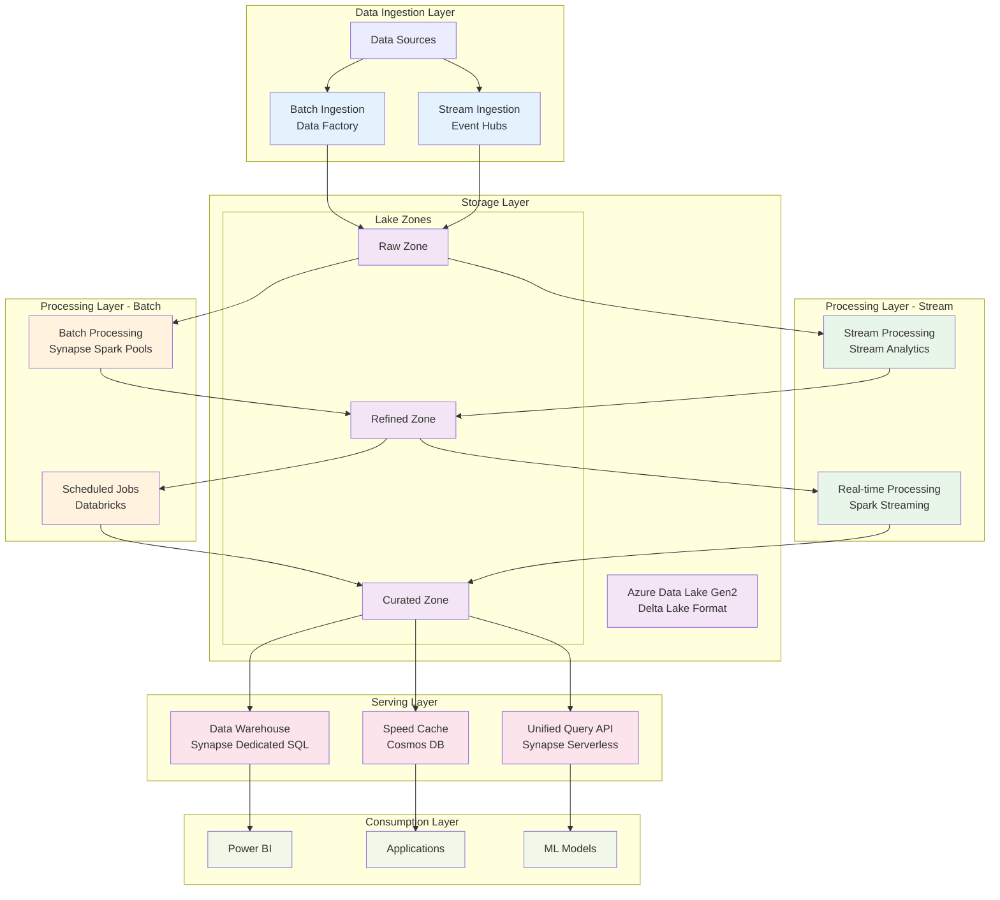
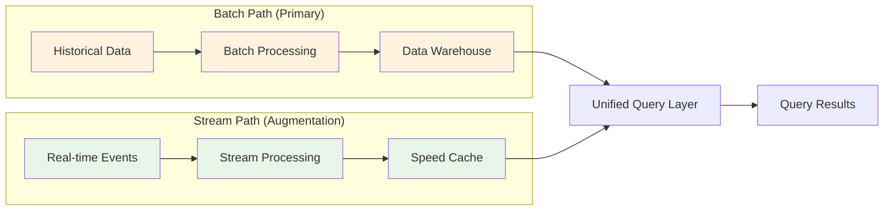
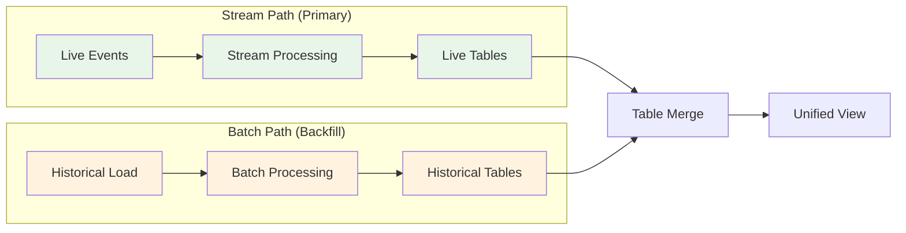
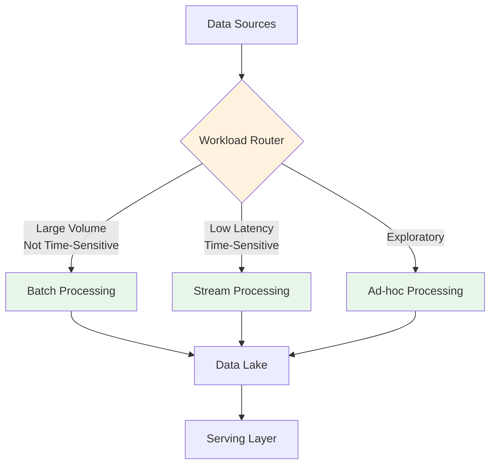

# ⚡🌊 Lambda-Kappa Hybrid Architecture

> __🏠 [Home](../../../README.md)__ | __📖 [Architecture Patterns](../README.md)__ | __🔄 Hybrid Architectures__ | __⚡🌊 Lambda-Kappa Hybrid__


Combines the strengths of both Lambda and Kappa architectures to provide flexible data processing capabilities for mixed batch and streaming workloads.

---

## 📋 Table of Contents

- [Overview](#overview)
- [Architecture Components](#architecture-components)
- [Azure Service Mapping](#azure-service-mapping)
- [Implementation Patterns](#implementation-patterns)
- [Use Cases](#use-cases)
- [Best Practices](#best-practices)
- [Performance Optimization](#performance-optimization)
- [Monitoring and Operations](#monitoring-and-operations)
- [Migration Strategy](#migration-strategy)
- [Related Patterns](#related-patterns)

---

## 🎯 Overview

The Lambda-Kappa Hybrid architecture combines batch and stream processing paradigms, allowing organizations to process data using the most appropriate method for each use case while maintaining a unified data platform.

### Key Principles

- __Flexible Processing__: Choose batch or stream based on workload characteristics
- __Unified Storage__: Single source of truth in a data lake
- __Multiple Compute Engines__: Optimized for different processing patterns
- __Incremental Adoption__: Migrate from batch to stream incrementally
- __Cost Optimization__: Use appropriate processing tier for each workload

### Architecture Benefits

| Benefit | Description | Business Impact |
|---------|-------------|----------------|
| __Flexibility__ | Support both batch and streaming workloads | Adapt to changing requirements |
| __Cost Efficiency__ | Choose appropriate processing model | Optimize compute costs |
| __Gradual Migration__ | Move from batch to stream incrementally | Reduce migration risk |
| __Unified Platform__ | Single data platform for all processing | Simplified operations |
| __Performance__ | Optimize each workload independently | Better SLAs |

---

## 🏗️ Architecture Components



### Core Components

#### 1. Ingestion Layer

__Batch Ingestion__:
- Azure Data Factory for scheduled data loads
- Bulk import from enterprise systems
- Historical data backfills
- Large file processing

__Stream Ingestion__:
- Azure Event Hubs for real-time events
- IoT Hub for device telemetry
- Kafka connectors for existing streams
- Change Data Capture (CDC) streams

#### 2. Storage Layer

__Unified Data Lake__:
- Azure Data Lake Gen2 as foundation
- Delta Lake format for ACID transactions
- Time travel capabilities
- Schema evolution support

__Zone Architecture__:
- __Raw Zone__: Immutable source data
- __Refined Zone__: Validated and cleaned data
- __Curated Zone__: Business-ready aggregates

#### 3. Processing Layer

__Batch Processing__:
- Synapse Spark pools for large-scale transformations
- Scheduled processing windows
- Complex aggregations and joins
- Historical analysis

__Stream Processing__:
- Azure Stream Analytics for SQL-based streaming
- Spark Structured Streaming for complex logic
- Real-time aggregations
- Event-time processing

#### 4. Serving Layer

__Multiple Query Patterns__:
- Synapse Dedicated SQL for data warehouse queries
- Cosmos DB for low-latency lookups
- Synapse Serverless SQL for ad-hoc queries
- Power BI for business intelligence

---

## ☁️ Azure Service Mapping

### Primary Services

| Layer | Service | Purpose | When to Use |
|-------|---------|---------|-------------|
| __Ingestion__ | Azure Data Factory | Batch ETL/ELT pipelines | Scheduled data movement |
| __Ingestion__ | Azure Event Hubs | Stream ingestion | Real-time events |
| __Storage__ | Data Lake Gen2 | Unified data storage | All data persistence |
| __Storage__ | Delta Lake | ACID transactions | Data quality requirements |
| __Processing__ | Synapse Spark Pools | Batch processing | Large-scale transformations |
| __Processing__ | Stream Analytics | Stream processing | SQL-based streaming |
| __Serving__ | Synapse Dedicated SQL | Data warehouse | BI and reporting |
| __Serving__ | Cosmos DB | Speed cache | Low-latency queries |
| __Serving__ | Synapse Serverless SQL | Ad-hoc queries | Data exploration |

### Supporting Services

- __Azure Purview__: Data governance and lineage
- __Azure Monitor__: Performance monitoring
- __Key Vault__: Secrets management
- __Azure DevOps__: CI/CD pipelines
- __Power BI__: Business intelligence

---

## 🔧 Implementation Patterns

### Pattern 1: Batch-First with Stream Augmentation



__Use Case__: Traditional enterprise with emerging real-time needs

__Implementation Steps__:

1. Establish batch data warehouse as foundation
2. Add stream ingestion for time-sensitive data
3. Create materialized views combining batch and stream
4. Implement query routing logic

__PySpark Example - Batch Processing__:

```python
from delta.tables import DeltaTable
from pyspark.sql import SparkSession
from pyspark.sql.functions import col, current_timestamp

spark = SparkSession.builder \
    .appName("BatchProcessing") \
    .config("spark.sql.extensions", "io.delta.sql.DeltaSparkSessionExtension") \
    .config("spark.sql.catalog.spark_catalog", "org.apache.spark.sql.delta.catalog.DeltaCatalog") \
    .getOrCreate()

# Read from raw zone
raw_data = spark.read.format("delta").load("/mnt/datalake/raw/transactions")

# Apply transformations
refined_data = raw_data \
    .filter(col("status") == "completed") \
    .withColumn("processed_timestamp", current_timestamp()) \
    .select("transaction_id", "customer_id", "amount", "transaction_date", "processed_timestamp")

# Write to refined zone with merge
delta_table = DeltaTable.forPath(spark, "/mnt/datalake/refined/transactions")

delta_table.alias("target") \
    .merge(
        refined_data.alias("source"),
        "target.transaction_id = source.transaction_id"
    ) \
    .whenMatchedUpdateAll() \
    .whenNotMatchedInsertAll() \
    .execute()
```

__Stream Processing Example__:

```sql
-- Azure Stream Analytics Query
WITH EnrichedEvents AS (
    SELECT
        event_id,
        customer_id,
        event_type,
        event_timestamp,
        System.Timestamp() AS processing_timestamp
    FROM
        EventHubInput TIMESTAMP BY event_timestamp
)

-- Real-time aggregation
SELECT
    customer_id,
    COUNT(*) as event_count,
    System.Timestamp() AS window_end
INTO
    CosmosDBOutput
FROM
    EnrichedEvents
GROUP BY
    customer_id,
    TumblingWindow(minute, 5)
```

### Pattern 2: Stream-First with Batch Backfill



__Use Case__: Modern applications with historical data requirements

__Implementation Steps__:

1. Build stream processing pipeline first
2. Design tables to support both stream and batch writes
3. Run batch backfill for historical data
4. Implement merge logic to unify views

__Delta Lake Merge Example__:

```python
from delta.tables import DeltaTable
from pyspark.sql.functions import col, when

# Stream processing output
stream_path = "/mnt/datalake/stream/user_events"
# Batch processing output
batch_path = "/mnt/datalake/batch/user_events"
# Unified output
unified_path = "/mnt/datalake/unified/user_events"

# Read both sources
stream_df = spark.read.format("delta").load(stream_path)
batch_df = spark.read.format("delta").load(batch_path)

# Create or get unified table
if DeltaTable.isDeltaTable(spark, unified_path):
    unified_table = DeltaTable.forPath(spark, unified_path)
else:
    stream_df.write.format("delta").save(unified_path)
    unified_table = DeltaTable.forPath(spark, unified_path)

# Merge stream data
unified_table.alias("target") \
    .merge(
        stream_df.alias("source"),
        "target.event_id = source.event_id"
    ) \
    .whenMatchedUpdate(
        condition = "source.event_timestamp > target.event_timestamp",
        set = {
            "event_type": "source.event_type",
            "user_id": "source.user_id",
            "event_timestamp": "source.event_timestamp",
            "source_system": "lit('stream')"
        }
    ) \
    .whenNotMatchedInsert(
        values = {
            "event_id": "source.event_id",
            "event_type": "source.event_type",
            "user_id": "source.user_id",
            "event_timestamp": "source.event_timestamp",
            "source_system": "lit('stream')"
        }
    ) \
    .execute()

# Merge batch data
unified_table.alias("target") \
    .merge(
        batch_df.alias("source"),
        "target.event_id = source.event_id"
    ) \
    .whenNotMatchedInsert(
        values = {
            "event_id": "source.event_id",
            "event_type": "source.event_type",
            "user_id": "source.user_id",
            "event_timestamp": "source.event_timestamp",
            "source_system": "lit('batch')"
        }
    ) \
    .execute()
```

### Pattern 3: Hybrid Processing with Workload Routing



__Use Case__: Mixed workload enterprise platform

__Routing Logic Example__:

```python
from pyspark.sql import DataFrame
from typing import Dict, Any

class WorkloadRouter:
    """Route data processing based on workload characteristics."""

    def __init__(self, spark):
        self.spark = spark
        self.routing_rules = {
            "batch": {
                "min_volume": 1000000,
                "max_latency_minutes": 60,
                "compute_type": "spark_batch"
            },
            "stream": {
                "max_latency_seconds": 30,
                "compute_type": "stream_analytics"
            },
            "adhoc": {
                "max_volume": 100000,
                "compute_type": "serverless_sql"
            }
        }

    def route_workload(self, df: DataFrame, metadata: Dict[str, Any]) -> str:
        """Determine appropriate processing path."""
        row_count = df.count()
        latency_requirement = metadata.get("latency_requirement_seconds", 3600)

        # Stream processing for low latency
        if latency_requirement < 60:
            return "stream"

        # Ad-hoc processing for small datasets
        if row_count < 100000:
            return "adhoc"

        # Batch processing for large datasets
        return "batch"

    def process(self, df: DataFrame, metadata: Dict[str, Any]):
        """Process data using appropriate engine."""
        route = self.route_workload(df, metadata)

        if route == "batch":
            return self._process_batch(df, metadata)
        elif route == "stream":
            return self._process_stream(df, metadata)
        else:
            return self._process_adhoc(df, metadata)

    def _process_batch(self, df: DataFrame, metadata: Dict[str, Any]):
        """Batch processing with Spark."""
        output_path = metadata.get("output_path")

        df.write \
            .format("delta") \
            .mode("append") \
            .partitionBy("date") \
            .option("mergeSchema", "true") \
            .save(output_path)

        return {"status": "success", "route": "batch", "records": df.count()}

    def _process_stream(self, df: DataFrame, metadata: Dict[str, Any]):
        """Stream processing with Structured Streaming."""
        output_path = metadata.get("output_path")
        checkpoint_path = metadata.get("checkpoint_path")

        query = df.writeStream \
            .format("delta") \
            .outputMode("append") \
            .option("checkpointLocation", checkpoint_path) \
            .start(output_path)

        return {"status": "streaming", "route": "stream", "query_id": query.id}

    def _process_adhoc(self, df: DataFrame, metadata: Dict[str, Any]):
        """Ad-hoc processing for exploration."""
        df.createOrReplaceTempView("adhoc_view")
        return {"status": "success", "route": "adhoc", "view": "adhoc_view"}

# Usage
router = WorkloadRouter(spark)

# Example: Large batch workload
large_df = spark.read.parquet("/mnt/data/large_dataset")
result = router.process(large_df, {
    "latency_requirement_seconds": 3600,
    "output_path": "/mnt/datalake/batch/output"
})

# Example: Real-time stream
stream_df = spark.readStream.format("delta").load("/mnt/datalake/stream/input")
result = router.process(stream_df, {
    "latency_requirement_seconds": 5,
    "output_path": "/mnt/datalake/stream/output",
    "checkpoint_path": "/mnt/checkpoints/stream1"
})
```

---

## 💼 Use Cases

### 1. E-commerce Analytics

__Scenario__: Combine batch order processing with real-time inventory updates

__Architecture__:
- __Batch Path__: Daily order analytics, customer segmentation
- __Stream Path__: Real-time inventory tracking, fraud detection
- __Hybrid__: Unified customer 360 view

### 2. Financial Services Risk Management

__Scenario__: Historical risk analysis with real-time monitoring

__Architecture__:
- __Batch Path__: Monthly risk reports, regulatory compliance
- __Stream Path__: Real-time transaction monitoring, fraud alerts
- __Hybrid__: Combined risk dashboard

### 3. Manufacturing IoT Analytics

__Scenario__: Equipment maintenance with production optimization

__Architecture__:
- __Batch Path__: Historical equipment performance analysis
- __Stream Path__: Real-time sensor monitoring, predictive maintenance
- __Hybrid__: Unified equipment health dashboard

---

## ✅ Best Practices

### 1. Data Lake Organization

```text
/mnt/datalake/
├── raw/
│   ├── batch/           # Batch ingested data
│   ├── stream/          # Stream ingested data
│   └── archive/         # Historical archives
├── refined/
│   ├── batch/           # Batch transformations
│   ├── stream/          # Stream transformations
│   └── merged/          # Combined views
└── curated/
    ├── warehouse/       # DW tables
    ├── cache/           # Speed layer cache
    └── ml/              # ML feature stores
```

### 2. Processing Guidelines

| Characteristic | Batch Processing | Stream Processing |
|----------------|------------------|-------------------|
| __Data Volume__ | > 1 million records | < 1 million records |
| __Latency SLA__ | > 1 hour | < 1 minute |
| __Complexity__ | Complex joins, aggregations | Simple transformations |
| __Cost__ | Lower per record | Higher per record |
| __Schedule__ | Fixed windows | Continuous |

### 3. Schema Management

```python
from pyspark.sql.types import StructType, StructField, StringType, TimestampType, DoubleType

# Define unified schema for batch and stream
unified_schema = StructType([
    StructField("event_id", StringType(), False),
    StructField("event_type", StringType(), False),
    StructField("user_id", StringType(), False),
    StructField("event_timestamp", TimestampType(), False),
    StructField("amount", DoubleType(), True),
    StructField("source_system", StringType(), False),
    StructField("processing_timestamp", TimestampType(), False)
])

# Use schema evolution with Delta Lake
spark.conf.set("spark.databricks.delta.schema.autoMerge.enabled", "true")
```

### 4. Monitoring and Alerting

```python
# Monitor batch and stream processing health
from azure.monitor.query import LogsQueryClient
from datetime import timedelta

def monitor_hybrid_pipeline():
    """Monitor both batch and stream processing."""
    metrics = {
        "batch": {
            "last_run": None,
            "records_processed": 0,
            "duration_minutes": 0,
            "status": "unknown"
        },
        "stream": {
            "current_lag": 0,
            "records_per_second": 0,
            "error_rate": 0.0,
            "status": "unknown"
        }
    }

    # Check batch processing
    batch_df = spark.sql("""
        SELECT MAX(processing_timestamp) as last_run,
               COUNT(*) as records_processed
        FROM delta.`/mnt/datalake/refined/batch/transactions`
        WHERE date = current_date()
    """)
    metrics["batch"].update(batch_df.first().asDict())

    # Check stream processing
    stream_df = spark.sql("""
        SELECT COUNT(*) as current_lag
        FROM delta.`/mnt/datalake/stream/input`
        WHERE processing_timestamp IS NULL
    """)
    metrics["stream"]["current_lag"] = stream_df.first()["current_lag"]

    return metrics
```

---

## ⚡ Performance Optimization

### 1. Batch Processing Optimization

```python
# Optimize batch processing with partitioning and Z-ordering
from delta.tables import DeltaTable

# Configure Spark for batch performance
spark.conf.set("spark.sql.adaptive.enabled", "true")
spark.conf.set("spark.sql.adaptive.coalescePartitions.enabled", "true")
spark.conf.set("spark.databricks.delta.optimizeWrite.enabled", "true")

# Write with optimal partitioning
df.write \
    .format("delta") \
    .mode("append") \
    .partitionBy("date", "region") \
    .save("/mnt/datalake/refined/transactions")

# Optimize table layout
delta_table = DeltaTable.forPath(spark, "/mnt/datalake/refined/transactions")
delta_table.optimize().executeZOrderBy("customer_id")
```

### 2. Stream Processing Optimization

```python
# Configure streaming for optimal performance
from pyspark.sql.streaming import DataStreamWriter

stream_query = spark.readStream \
    .format("delta") \
    .option("maxFilesPerTrigger", 1000) \
    .option("ignoreDeletes", "true") \
    .load("/mnt/datalake/stream/input") \
    .writeStream \
    .format("delta") \
    .outputMode("append") \
    .option("checkpointLocation", "/mnt/checkpoints/stream1") \
    .trigger(processingTime='30 seconds') \
    .start("/mnt/datalake/stream/output")
```

### 3. Query Performance

```sql
-- Optimize queries across batch and stream tables
-- Use table statistics
ANALYZE TABLE delta.`/mnt/datalake/refined/batch/transactions` COMPUTE STATISTICS;

-- Create materialized views combining batch and stream
CREATE OR REPLACE VIEW unified_transactions AS
SELECT
    t.*,
    'batch' as source_layer
FROM delta.`/mnt/datalake/refined/batch/transactions` t
WHERE processing_timestamp < date_sub(current_timestamp(), 1)

UNION ALL

SELECT
    t.*,
    'stream' as source_layer
FROM delta.`/mnt/datalake/refined/stream/transactions` t
WHERE processing_timestamp >= date_sub(current_timestamp(), 1);
```

---

## 📊 Monitoring and Operations

### Key Metrics

| Metric Category | Batch Metrics | Stream Metrics |
|-----------------|---------------|----------------|
| __Throughput__ | Records/hour | Records/second |
| __Latency__ | Job duration | End-to-end latency |
| __Quality__ | Error rate | Late event rate |
| __Cost__ | Compute hours | Streaming units |

### Operational Dashboard

```python
# Create operational metrics dashboard
import plotly.graph_objects as go
from plotly.subplots import make_subplots

def create_hybrid_dashboard(batch_metrics, stream_metrics):
    """Create operational dashboard for hybrid architecture."""

    fig = make_subplots(
        rows=2, cols=2,
        subplot_titles=('Batch Throughput', 'Stream Latency',
                       'Processing Costs', 'Error Rates')
    )

    # Batch throughput
    fig.add_trace(
        go.Scatter(x=batch_metrics['timestamps'],
                  y=batch_metrics['records_per_hour'],
                  name='Batch Throughput'),
        row=1, col=1
    )

    # Stream latency
    fig.add_trace(
        go.Scatter(x=stream_metrics['timestamps'],
                  y=stream_metrics['latency_ms'],
                  name='Stream Latency'),
        row=1, col=2
    )

    # Processing costs
    fig.add_trace(
        go.Bar(x=['Batch', 'Stream'],
              y=[batch_metrics['cost'], stream_metrics['cost']],
              name='Costs'),
        row=2, col=1
    )

    # Error rates
    fig.add_trace(
        go.Scatter(x=batch_metrics['timestamps'],
                  y=batch_metrics['error_rate'],
                  name='Batch Errors'),
        row=2, col=2
    )

    fig.update_layout(height=800, showlegend=True)
    return fig
```

---

## 🔄 Migration Strategy

### Phase 1: Assessment (Weeks 1-2)

1. Inventory current data pipelines
2. Classify workloads (batch vs stream candidates)
3. Identify dependencies
4. Define success criteria

### Phase 2: Foundation (Weeks 3-6)

1. Set up Data Lake Gen2 with zone architecture
2. Implement Delta Lake format
3. Configure Synapse workspace
4. Set up monitoring and governance

### Phase 3: Batch Migration (Weeks 7-10)

```python
# Migration script for batch workloads
def migrate_batch_pipeline(source_config, target_config):
    """Migrate existing batch pipeline to hybrid architecture."""

    # 1. Extract from legacy system
    legacy_df = spark.read.jdbc(
        url=source_config['jdbc_url'],
        table=source_config['table_name'],
        properties=source_config['properties']
    )

    # 2. Transform to Delta format
    legacy_df.write \
        .format("delta") \
        .mode("overwrite") \
        .partitionBy("date") \
        .save(target_config['raw_path'])

    # 3. Apply transformations
    transformed_df = spark.read.format("delta").load(target_config['raw_path'])
    transformed_df = apply_business_rules(transformed_df)

    # 4. Write to refined zone
    transformed_df.write \
        .format("delta") \
        .mode("append") \
        .save(target_config['refined_path'])

    return {"status": "migrated", "record_count": transformed_df.count()}
```

### Phase 4: Stream Addition (Weeks 11-14)

```python
# Add streaming capabilities
def add_stream_processing(stream_config):
    """Add stream processing to existing batch pipeline."""

    # 1. Set up stream ingestion
    stream_df = spark.readStream \
        .format("eventhubs") \
        .options(**stream_config['eventhub_config']) \
        .load()

    # 2. Apply same transformations as batch
    stream_transformed = apply_business_rules(stream_df)

    # 3. Write to stream output
    query = stream_transformed.writeStream \
        .format("delta") \
        .outputMode("append") \
        .option("checkpointLocation", stream_config['checkpoint']) \
        .start(stream_config['output_path'])

    return query
```

### Phase 5: Optimization (Weeks 15-16)

1. Tune batch and stream parameters
2. Implement query optimization
3. Set up automated monitoring
4. Document operational procedures

---

## 🔗 Related Patterns

### Complementary Patterns

- [Lambda Architecture](../streaming-architectures/lambda-architecture.md): Pure batch + stream approach
- [Kappa Architecture](../streaming-architectures/kappa-architecture.md): Stream-only processing
- [Medallion Architecture](../batch-architectures/medallion-architecture.md): Data lake organization
- [HTAP Patterns](htap-patterns.md): Transactional and analytical processing

### When to Choose

| Choose Hybrid When | Choose Lambda When | Choose Kappa When |
|-------------------|-------------------|-------------------|
| Mixed workload requirements | Need separate batch/stream logic | All workloads are streaming |
| Gradual migration needed | Mature batch processes exist | Starting fresh |
| Cost optimization important | Accuracy over speed | Speed over complexity |
| Organizational flexibility | Separate teams for batch/stream | Unified streaming team |

---

## 📚 Additional Resources

### Implementation Guides

- [Azure Synapse Analytics Documentation](https://docs.microsoft.com/azure/synapse-analytics/)
- [Delta Lake Best Practices](../../best-practices/delta-lake-optimization.md)
- [Stream Analytics Patterns](../../code-examples/serverless-sql-guide.md)

### Reference Architectures

- IoT Analytics - Real-time device data processing
- Retail Analytics - Customer behavior and sales analytics
- Enterprise Data Warehouse - Traditional DW with modern streaming

---

*Last Updated: 2025-01-28*
*Pattern Status: Active*
*Complexity: Advanced*
