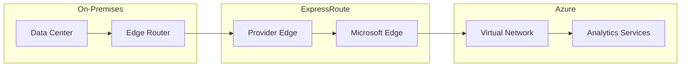

# 🔌 Hybrid Connectivity Patterns

> __🏠 [Home](../../../README.md)__ | __🏗️ [Architecture](../README.md)__ | __🔗 Integration Patterns__ | __Hybrid Connectivity__


Patterns for connecting on-premises systems with Azure analytics services.

---

## 🎯 Overview

Hybrid connectivity patterns enable secure data flow between on-premises infrastructure and Azure cloud services.

---

## 🏗️ Connectivity Options

### ExpressRoute

Private, dedicated connection with guaranteed bandwidth.



### Site-to-Site VPN

Encrypted tunnel over public internet.

```bicep
resource vpnGateway 'Microsoft.Network/virtualNetworkGateways@2023-05-01' = {
  name: 'vpn-analytics-gateway'
  location: location
  properties: {
    gatewayType: 'Vpn'
    vpnType: 'RouteBased'
    sku: {
      name: 'VpnGw2'
      tier: 'VpnGw2'
    }
    ipConfigurations: [
      {
        name: 'default'
        properties: {
          subnet: {
            id: gatewaySubnet.id
          }
          publicIPAddress: {
            id: publicIP.id
          }
        }
      }
    ]
  }
}
```

### Self-Hosted Integration Runtime

Agent-based connectivity for Data Factory.

```json
{
    "name": "OnPremisesIntegrationRuntime",
    "type": "SelfHosted",
    "properties": {
        "description": "Integration runtime for on-premises SQL Server",
        "linkedInfo": {
            "resourceId": "/subscriptions/{sub}/resourceGroups/{rg}/providers/Microsoft.DataFactory/factories/{factory}/integrationRuntimes/SharedIR"
        }
    }
}
```

---

## 🔧 Implementation Examples

### Data Factory Pipeline with On-Premises Source

```json
{
    "name": "HybridDataIngestion",
    "properties": {
        "activities": [
            {
                "name": "CopyFromOnPremSQL",
                "type": "Copy",
                "inputs": [
                    {
                        "referenceName": "OnPremSQLDataset",
                        "type": "DatasetReference"
                    }
                ],
                "outputs": [
                    {
                        "referenceName": "DataLakeDataset",
                        "type": "DatasetReference"
                    }
                ],
                "typeProperties": {
                    "source": {
                        "type": "SqlServerSource",
                        "sqlReaderQuery": "SELECT * FROM Sales WHERE ModifiedDate > @{pipeline().parameters.LastLoadDate}"
                    },
                    "sink": {
                        "type": "ParquetSink"
                    }
                },
                "policy": {
                    "timeout": "02:00:00",
                    "retry": 3
                }
            }
        ]
    }
}
```

### Private Endpoint Configuration

```bicep
resource privateEndpoint 'Microsoft.Network/privateEndpoints@2023-05-01' = {
  name: 'pe-synapse'
  location: location
  properties: {
    subnet: {
      id: privateEndpointSubnet.id
    }
    privateLinkServiceConnections: [
      {
        name: 'synapse-connection'
        properties: {
          privateLinkServiceId: synapseWorkspace.id
          groupIds: ['Sql']
        }
      }
    ]
  }
}
```

---

## 📚 Related Documentation

- [Hybrid Architectures](../hybrid-architectures/README.md)
- [Network Security Best Practices](../../05-best-practices/cross-cutting-concerns/networking/README.md)
- [Data Factory Integration Runtime](../../02-services/orchestration-services/azure-data-factory/integration-runtime/README.md)

---

*Last Updated: January 2025*
