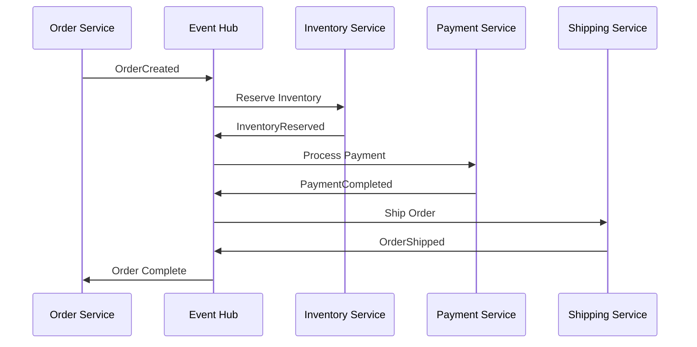
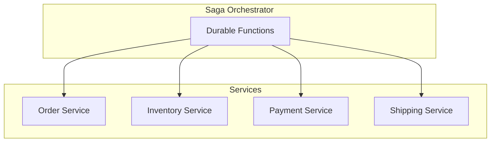

# 🔄 Saga Pattern

> __🏠 [Home](../../../README.md)__ | __🏗️ [Architecture](../README.md)__ | __🔗 Integration Patterns__ | __Saga Pattern__


Saga pattern implementation for distributed transactions in Azure analytics workflows.

---

## 🎯 Overview

The Saga pattern manages distributed transactions by breaking them into a sequence of local transactions, each with a compensating action for rollback.

---

## 🏗️ Architecture

### Choreography-Based Saga



### Orchestration-Based Saga



---

## 🔧 Implementation

### Durable Functions Orchestrator

```python
import azure.durable_functions as df

def orchestrator_function(context: df.DurableOrchestrationContext):
    """Saga orchestrator for order processing."""

    order_id = context.get_input()
    compensation_actions = []

    try:
        # Step 1: Create Order
        order = yield context.call_activity("CreateOrder", order_id)
        compensation_actions.append(("CancelOrder", order_id))

        # Step 2: Reserve Inventory
        inventory = yield context.call_activity("ReserveInventory", order)
        compensation_actions.append(("ReleaseInventory", inventory))

        # Step 3: Process Payment
        payment = yield context.call_activity("ProcessPayment", order)
        compensation_actions.append(("RefundPayment", payment))

        # Step 4: Ship Order
        shipment = yield context.call_activity("ShipOrder", order)

        return {"status": "completed", "order_id": order_id}

    except Exception as e:
        # Execute compensating transactions in reverse order
        for action, payload in reversed(compensation_actions):
            yield context.call_activity(action, payload)

        return {"status": "compensated", "error": str(e)}

main = df.Orchestrator.create(orchestrator_function)
```

### Activity Functions

```python
import azure.functions as func
from azure.cosmos import CosmosClient

def reserve_inventory(payload: dict) -> dict:
    """Reserve inventory for order items."""

    order = payload
    cosmos_client = CosmosClient.from_connection_string(os.environ["COSMOS_CONNECTION"])
    container = cosmos_client.get_database_client("inventory").get_container_client("items")

    reservations = []

    for item in order["items"]:
        # Check availability
        inventory_item = container.read_item(item["product_id"], item["product_id"])

        if inventory_item["available_quantity"] < item["quantity"]:
            raise InsufficientInventoryError(f"Not enough stock for {item['product_id']}")

        # Reserve inventory
        inventory_item["available_quantity"] -= item["quantity"]
        inventory_item["reserved_quantity"] += item["quantity"]

        container.replace_item(item["product_id"], inventory_item)
        reservations.append({"product_id": item["product_id"], "quantity": item["quantity"]})

    return {"order_id": order["order_id"], "reservations": reservations}


def release_inventory(payload: dict) -> dict:
    """Compensating action: Release reserved inventory."""

    cosmos_client = CosmosClient.from_connection_string(os.environ["COSMOS_CONNECTION"])
    container = cosmos_client.get_database_client("inventory").get_container_client("items")

    for reservation in payload["reservations"]:
        inventory_item = container.read_item(reservation["product_id"], reservation["product_id"])

        inventory_item["available_quantity"] += reservation["quantity"]
        inventory_item["reserved_quantity"] -= reservation["quantity"]

        container.replace_item(reservation["product_id"], inventory_item)

    return {"status": "released", "order_id": payload["order_id"]}
```

---

## 🛡️ Best Practices

### Idempotency

```python
def process_payment_idempotent(payload: dict) -> dict:
    """Idempotent payment processing with deduplication."""

    idempotency_key = f"payment_{payload['order_id']}"

    # Check if already processed
    existing = get_payment_by_idempotency_key(idempotency_key)
    if existing:
        return existing

    # Process payment
    payment_result = process_payment(payload)

    # Store with idempotency key
    save_payment_with_key(payment_result, idempotency_key)

    return payment_result
```

### Timeout Handling

```python
import asyncio
from datetime import timedelta

async def with_timeout(activity_func, payload, timeout_seconds=300):
    """Execute activity with timeout and retry."""

    try:
        result = await asyncio.wait_for(
            activity_func(payload),
            timeout=timeout_seconds
        )
        return result
    except asyncio.TimeoutError:
        raise SagaTimeoutError(f"Activity timed out after {timeout_seconds}s")
```

---

## 📚 Related Documentation

- [Event Sourcing](../data-patterns/event-sourcing.md)
- [Event Hubs](../../02-services/streaming-services/azure-event-hubs/README.md)
- [Durable Functions](../../02-services/orchestration-services/azure-functions/README.md)

---

*Last Updated: January 2025*
