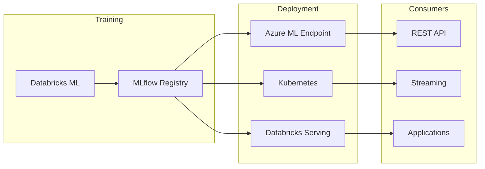
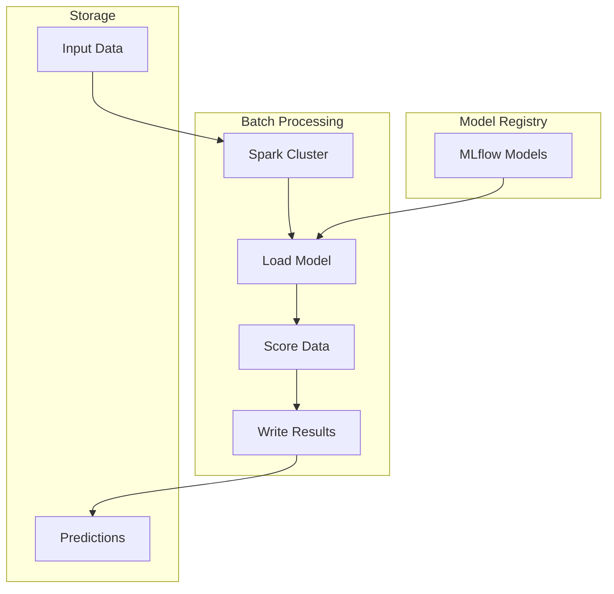

# 🤖 ML Model Deployment Patterns

> __🏠 [Home](../../../README.md)__ | __🏗️ [Architecture](../README.md)__ | __🤖 ML Patterns__ | __Model Deployment__


Architecture patterns for deploying machine learning models in Azure analytics platforms.

---

## 🎯 Overview

ML model deployment patterns enable:

- **Real-time inference** for online predictions
- **Batch scoring** for large-scale predictions
- **Model versioning** and rollback capabilities
- **A/B testing** for model comparison
- **Monitoring** for model drift detection

---

## 🏗️ Deployment Patterns

### Real-Time Inference



### Batch Scoring



---

## 🔧 Implementation

### MLflow Model Registration

```python
import mlflow
from mlflow.tracking import MlflowClient

# Configure MLflow
mlflow.set_tracking_uri("databricks")
mlflow.set_registry_uri("databricks-uc")

# Train and log model
with mlflow.start_run():
    # Train model
    model = train_model(X_train, y_train)

    # Log metrics
    mlflow.log_metric("accuracy", accuracy)
    mlflow.log_metric("f1_score", f1)

    # Log model with signature
    signature = mlflow.models.infer_signature(X_train, model.predict(X_train))

    mlflow.sklearn.log_model(
        model,
        artifact_path="model",
        signature=signature,
        registered_model_name="sales_prediction_model"
    )

# Transition to production
client = MlflowClient()
client.transition_model_version_stage(
    name="sales_prediction_model",
    version=1,
    stage="Production"
)
```

### Real-Time Endpoint (Databricks)

```python
from databricks.feature_engineering import FeatureEngineeringClient
from databricks.feature_engineering.entities.feature_lookup import FeatureLookup

fe = FeatureEngineeringClient()

# Create serving endpoint
endpoint_config = {
    "name": "sales-prediction-endpoint",
    "config": {
        "served_entities": [
            {
                "name": "sales-model",
                "entity_name": "sales_prediction_model",
                "entity_version": "1",
                "workload_size": "Small",
                "scale_to_zero_enabled": True
            }
        ],
        "traffic_config": {
            "routes": [
                {
                    "served_model_name": "sales-model",
                    "traffic_percentage": 100
                }
            ]
        }
    }
}

# Deploy endpoint
from databricks.sdk import WorkspaceClient

w = WorkspaceClient()
w.serving_endpoints.create_and_wait(**endpoint_config)
```

### Batch Scoring Pipeline

```python
from pyspark.sql import SparkSession
import mlflow

spark = SparkSession.builder.appName("BatchScoring").getOrCreate()

def batch_score_data(input_path: str, output_path: str, model_name: str):
    """Score large datasets using registered MLflow model."""

    # Load production model
    model_uri = f"models:/{model_name}/Production"
    model = mlflow.pyfunc.spark_udf(spark, model_uri)

    # Load input data
    input_df = spark.read.format("delta").load(input_path)

    # Generate predictions
    predictions_df = input_df.withColumn(
        "prediction",
        model(*input_df.columns)
    )

    # Add metadata
    predictions_df = predictions_df.withColumn(
        "scored_at", current_timestamp()
    ).withColumn(
        "model_version", lit(model_name)
    )

    # Write predictions
    (predictions_df.write
        .format("delta")
        .mode("append")
        .partitionBy("scored_date")
        .save(output_path))

# Schedule with Databricks Jobs
batch_score_data(
    input_path="/gold/features/sales_features",
    output_path="/gold/predictions/sales_predictions",
    model_name="sales_prediction_model"
)
```

### A/B Testing Configuration

```python
# Configure A/B test with traffic splitting
ab_test_config = {
    "name": "sales-prediction-ab-test",
    "config": {
        "served_entities": [
            {
                "name": "model-a",
                "entity_name": "sales_prediction_model",
                "entity_version": "1",
                "workload_size": "Small"
            },
            {
                "name": "model-b",
                "entity_name": "sales_prediction_model",
                "entity_version": "2",
                "workload_size": "Small"
            }
        ],
        "traffic_config": {
            "routes": [
                {"served_model_name": "model-a", "traffic_percentage": 80},
                {"served_model_name": "model-b", "traffic_percentage": 20}
            ]
        }
    }
}

# Analyze A/B test results
def analyze_ab_test(predictions_table: str):
    results = spark.sql(f"""
        SELECT
            model_version,
            COUNT(*) as prediction_count,
            AVG(CASE WHEN actual = prediction THEN 1.0 ELSE 0.0 END) as accuracy,
            AVG(response_time_ms) as avg_latency
        FROM {predictions_table}
        WHERE scored_at > current_date() - INTERVAL 7 DAYS
        GROUP BY model_version
    """)
    return results
```

---

## 📊 Model Monitoring

### Drift Detection

```python
from evidently.report import Report
from evidently.metric_preset import DataDriftPreset

def detect_model_drift(reference_data, current_data):
    """Detect data drift between training and production data."""

    report = Report(metrics=[DataDriftPreset()])
    report.run(reference_data=reference_data, current_data=current_data)

    # Extract drift metrics
    drift_results = report.as_dict()

    drift_detected = drift_results["metrics"][0]["result"]["dataset_drift"]

    if drift_detected:
        # Alert and potentially trigger retraining
        send_alert("Model drift detected - consider retraining")
        trigger_retraining_pipeline()

    return drift_results
```

### Performance Monitoring

```sql
-- Monitor model performance over time
CREATE VIEW ml_monitoring.model_performance AS
SELECT
    model_version,
    DATE(scored_at) as score_date,
    COUNT(*) as predictions,
    AVG(CASE WHEN actual = prediction THEN 1.0 ELSE 0.0 END) as accuracy,
    AVG(confidence_score) as avg_confidence,
    PERCENTILE(response_time_ms, 0.95) as p95_latency
FROM ml_predictions.sales_predictions p
JOIN ml_actuals.sales_actuals a ON p.id = a.id
GROUP BY model_version, DATE(scored_at);
```

---

## 📚 Related Documentation

- [MLflow Integration](../../02-services/analytics-compute/azure-databricks/mlflow-integration/README.md)
- [Feature Store](../../04-implementation-guides/databricks/feature-store-setup.md)
- [ML Operations Best Practices](../../05-best-practices/service-specific/databricks/mlops.md)

---

*Last Updated: January 2025*
