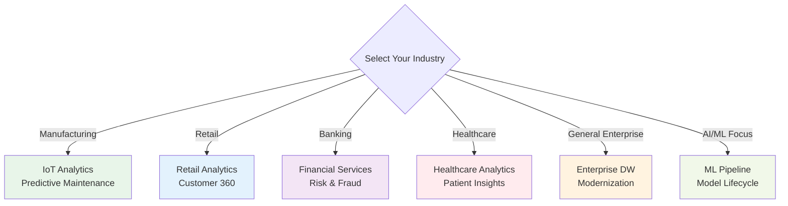
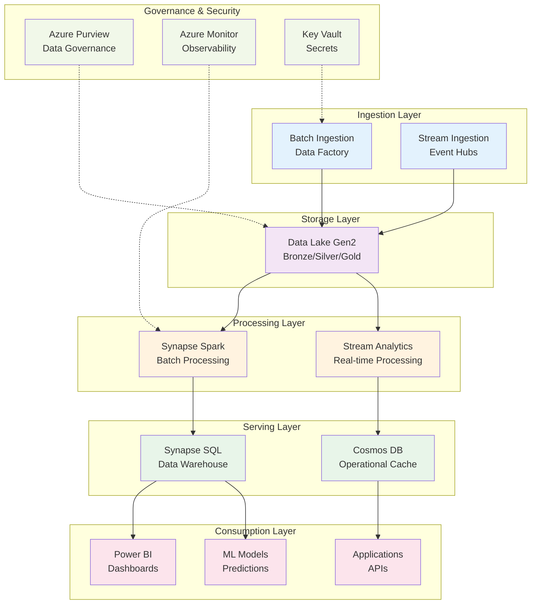
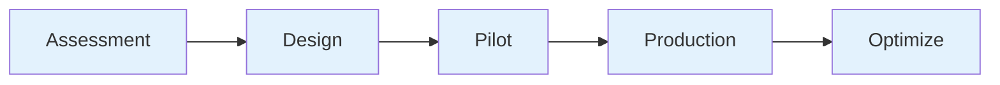

# 🌐 Reference Architectures by Industry

> __🏠 [Home](../../../README.md)__ | __📖 [Architecture Patterns](../README.md)__ | __🌐 Reference Architectures__


Industry-specific reference architectures combining Azure Cloud Scale Analytics services with domain-specific patterns, compliance requirements, and best practices.

---

## 📋 Table of Contents

- [Overview](#overview)
- [Architecture Index](#architecture-index)
- [Selection Guide](#selection-guide)
- [Common Components](#common-components)
- [Compliance Frameworks](#compliance-frameworks)
- [Getting Started](#getting-started)

---

## 🎯 Overview

Reference architectures provide proven, production-ready blueprints for implementing Cloud Scale Analytics solutions tailored to specific industries and use cases. Each architecture addresses unique industry requirements, compliance needs, and operational patterns.

### Key Features

- __Industry-Specific__: Tailored to vertical requirements
- __Compliance-Ready__: Built-in regulatory considerations
- __Production-Proven__: Based on real-world deployments
- __End-to-End__: Complete solution architectures
- __Scalable__: Designed for enterprise scale

---

## 🏢 Architecture Index

### Manufacturing & IoT

#### 🏭 [IoT Analytics Architecture](iot-analytics.md)


__Complete IoT data pipeline from device telemetry to predictive maintenance and operational insights.__

__Key Components__:
- IoT Hub for device connectivity
- Event Hubs for telemetry streaming
- Stream Analytics for real-time processing
- Time Series Insights for temporal analytics
- Azure Digital Twins for asset modeling

__Use Cases__:
- Predictive maintenance
- Equipment monitoring
- Quality control
- Supply chain optimization
- Energy management

__Compliance__: ISO 27001, SOC 2

---

### Retail & E-commerce

#### 🛒 [Retail Analytics Architecture](retail-analytics.md)


__Customer 360, inventory optimization, demand forecasting, and personalization at scale.__

__Key Components__:
- Synapse Analytics for data warehousing
- Cosmos DB for customer profiles
- Azure ML for demand forecasting
- Cognitive Services for personalization
- Power BI for business intelligence

__Use Cases__:
- Customer 360 view
- Inventory optimization
- Demand forecasting
- Price optimization
- Personalized recommendations

__Compliance__: PCI-DSS, GDPR

---

### Financial Services

#### 🏦 [Financial Services Architecture](financial-services.md)


__Risk management, fraud detection, regulatory compliance, and real-time trading analytics.__

__Key Components__:
- Event Hubs for transaction streaming
- Stream Analytics for fraud detection
- Synapse for risk analytics
- Azure Purview for compliance
- Confidential Computing for sensitive data

__Use Cases__:
- Real-time fraud detection
- Risk analytics
- Regulatory reporting
- Trading analytics
- Customer risk profiling

__Compliance__: PCI-DSS, SOX, Basel III, GDPR

---

### Healthcare & Life Sciences

#### 🏥 [Healthcare Analytics Architecture](healthcare-analytics.md)


__Patient analytics, clinical insights, operational optimization with HIPAA compliance.__

__Key Components__:
- FHIR Server for health data
- Synapse for clinical analytics
- Azure ML for predictive models
- Text Analytics for clinical notes
- Private endpoints for security

__Use Cases__:
- Patient risk stratification
- Clinical decision support
- Population health management
- Operational efficiency
- Research analytics

__Compliance__: HIPAA, HITRUST, GDPR

---

### Enterprise Data Management

#### 🏢 [Enterprise Data Warehouse Architecture](enterprise-data-warehouse.md)


__Modern data warehouse modernization from on-premises to cloud-native architecture.__

__Key Components__:
- Synapse Dedicated SQL Pools
- Data Factory for ETL/ELT
- Azure Purview for governance
- Power BI for reporting
- Delta Lake for data lake

__Use Cases__:
- Legacy DW modernization
- Enterprise reporting
- Self-service BI
- Data democratization
- Master data management

__Compliance__: SOC 2, ISO 27001

---

### AI & Machine Learning

#### 🤖 [ML Pipeline Architecture](ml-pipeline.md)


__End-to-end ML pipeline from data preparation to model deployment and monitoring.__

__Key Components__:
- Azure Machine Learning
- Synapse for data preparation
- MLflow for experiment tracking
- Kubernetes for model serving
- Application Insights for monitoring

__Use Cases__:
- ML model development
- AutoML pipelines
- Model deployment
- A/B testing
- Model monitoring

__Compliance__: Responsible AI, Model governance

---

## 🎯 Selection Guide

### By Industry Vertical



### By Use Case Priority

| Priority Use Case | Recommended Architecture | Key Benefits |
|-------------------|-------------------------|--------------|
| __Real-time Monitoring__ | IoT Analytics | Sub-second latency, scalable ingestion |
| __Customer Insights__ | Retail Analytics | Customer 360, personalization |
| __Risk Management__ | Financial Services | Real-time fraud, compliance |
| __Clinical Decision Support__ | Healthcare Analytics | HIPAA-compliant, FHIR integration |
| __Enterprise Reporting__ | Enterprise DW | Familiar BI tools, proven patterns |
| __Predictive Analytics__ | ML Pipeline | AutoML, MLOps best practices |

### By Compliance Requirements

| Compliance | Applicable Architectures | Key Controls |
|------------|-------------------------|--------------|
| __HIPAA__ | Healthcare Analytics | Encryption, audit logs, BAA |
| __PCI-DSS__ | Financial Services, Retail | Tokenization, network isolation |
| __GDPR__ | All architectures | Data sovereignty, right to delete |
| __SOX__ | Financial Services | Audit trails, change management |
| __ISO 27001__ | All architectures | Security controls, risk management |

---

## 🔧 Common Components

### Shared Architecture Patterns

All reference architectures leverage these common patterns:



### Standard Service Tiers

| Service | Development | Production | Enterprise |
|---------|-------------|------------|------------|
| __Synapse SQL__ | Serverless | Dedicated DW100c | Dedicated DW500c+ |
| __Spark Pools__ | Small (4 nodes) | Medium (8 nodes) | Large (16+ nodes) |
| __Event Hubs__ | Standard | Standard | Premium |
| __Cosmos DB__ | Serverless | Provisioned | Autoscale |
| __Data Lake__ | Standard | Standard + RA-GRS | Premium + GRS |

---

## 📋 Compliance Frameworks

### HIPAA (Healthcare)

__Required Controls__:
- Encryption at rest and in transit
- Audit logging (Azure Monitor)
- Access controls (Azure AD)
- Business Associate Agreement (BAA)
- Data residency controls

__Implementation__:
```python
# Enable HIPAA compliance features
from azure.mgmt.synapse import SynapseManagementClient
from azure.mgmt.storage import StorageManagementClient

def enable_hipaa_compliance(workspace_name, storage_account):
    """Enable HIPAA compliance controls."""

    # Enable encryption at rest
    storage_client.storage_accounts.update(
        resource_group_name="rg-healthcare",
        account_name=storage_account,
        parameters={
            "encryption": {
                "services": {
                    "blob": {"enabled": True},
                    "file": {"enabled": True}
                },
                "key_source": "Microsoft.Storage"
            }
        }
    )

    # Enable audit logging
    synapse_client.workspaces.update(
        resource_group_name="rg-healthcare",
        workspace_name=workspace_name,
        workspace_patch_info={
            "sql_auditing_policy": {
                "state": "Enabled",
                "storage_endpoint": f"https://{storage_account}.blob.core.windows.net",
                "retention_days": 90
            }
        }
    )

    # Enable private endpoints
    # Configure managed virtual network
    # Implement RBAC for least privilege
```

### PCI-DSS (Financial Services, Retail)

__Required Controls__:
- Tokenization of payment data
- Network segmentation
- Encryption of cardholder data
- Access logging and monitoring
- Regular security testing

### GDPR (All Industries)

__Required Controls__:
- Data sovereignty (regional storage)
- Right to be forgotten
- Consent management
- Data processing agreements
- Breach notification

---

## 🚀 Getting Started

### Step 1: Select Architecture

1. Review industry-specific architectures
2. Match to your use case requirements
3. Assess compliance needs
4. Evaluate complexity and team readiness

### Step 2: Plan Implementation



### Step 3: Deploy Foundation

```bash
# Clone reference architecture templates
git clone https://github.com/Azure/csa-reference-architectures.git

# Navigate to industry-specific template
cd csa-reference-architectures/healthcare

# Deploy using Azure CLI
az deployment group create \
  --resource-group rg-healthcare-prod \
  --template-file main.bicep \
  --parameters @parameters.json
```

### Step 4: Customize and Extend

- Adapt to specific business requirements
- Integrate with existing systems
- Implement custom security controls
- Add industry-specific features

### Step 5: Monitor and Optimize

- Set up Azure Monitor dashboards
- Configure alerts and notifications
- Implement cost tracking
- Continuous performance tuning

---

## 📚 Additional Resources

### Implementation Guides

- [Deployment Guide](../../tutorials/README.md)
- [Best Practices](../../best-practices/README.md)
- [Security Guide](../../security/README.md)

### Architecture Patterns

- [Streaming Patterns](../README.md#-streaming-architecture-patterns)
- [Batch Patterns](../README.md#-batch-architecture-patterns)
- [Hybrid Patterns](../README.md#-hybrid-architecture-patterns)

### Compliance Resources

- [Azure Compliance Documentation](https://docs.microsoft.com/azure/compliance/)
- [Trust Center](https://www.microsoft.com/trust-center)
- [Service Trust Portal](https://servicetrust.microsoft.com/)

---

*Last Updated: 2025-01-28*
*Architectures: 6+*
*Industries Covered: Healthcare, Financial Services, Retail, Manufacturing, Enterprise, AI/ML*
