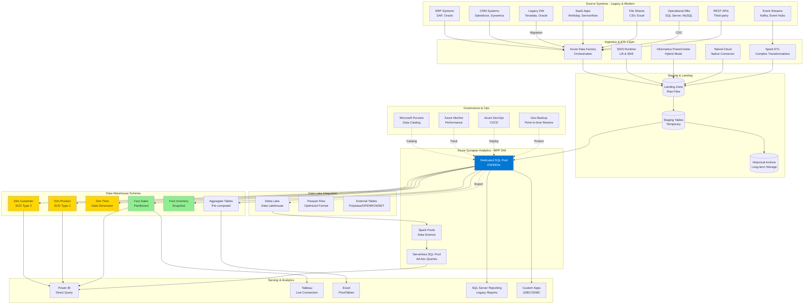

# Enterprise Data Warehouse Modernization Reference Architecture

## Overview

This reference architecture demonstrates modernizing a traditional enterprise data warehouse (EDW) to Azure Synapse Analytics, enabling cloud-scale analytics while maintaining compatibility with existing BI tools, ETL processes, and reporting systems.

### Business Drivers

- **Cost Reduction**: Reduce TCO by 40-60% through cloud economics
- **Performance**: Improve query performance by 10-100x with MPP architecture
- **Scalability**: Elastic compute and storage scaling
- **Agility**: Faster time-to-insight with self-service analytics
- **Modernization**: Migrate from legacy platforms (Teradata, Oracle Exadata, Netezza)
- **Hybrid Analytics**: Combine structured DW data with data lake analytics
- **Real-Time Insights**: Integrate streaming data with historical warehouse

### Key Capabilities

- Lift-and-shift migration with minimal code changes
- Petabyte-scale data warehousing
- Separation of compute and storage
- Workload isolation and resource governance
- Materialized views and result set caching
- Integration with Power BI, Tableau, Looker
- SQL-compatible with T-SQL extensions
- Support for existing ETL tools (Informatica, Talend, SSIS)

---

## Architecture Diagram



---

## Azure Service Mapping

| Component | Azure Service | Purpose | Migration Consideration |
|-----------|--------------|---------|------------------------|
| **MPP Data Warehouse** | Synapse Dedicated SQL Pool | Massively parallel processing DW | Direct replacement for Teradata/Exadata |
| **Ad-hoc Analytics** | Synapse Serverless SQL Pool | Query data lake with T-SQL | No compute when not in use |
| **ETL Orchestration** | Azure Data Factory | Pipeline orchestration | 100+ source connectors |
| **Legacy ETL Runtime** | Integration Runtime | Run existing SSIS packages | Lift-and-shift capability |
| **Data Science** | Synapse Spark Pools | Python/Scala transformations | Integrated with DW |
| **Data Lake Storage** | Azure Data Lake Gen2 | Staging and archive | 99.999999999% durability |
| **Delta Lakehouse** | Delta Lake on ADLS | ACID transactions on lake | Bridge DW and lake |
| **BI Tool** | Power BI | Self-service BI | Native integration with Synapse |
| **Data Catalog** | Microsoft Purview | Metadata and lineage | Auto-discovery, business glossary |
| **CI/CD** | Azure DevOps | Pipeline deployment | Git integration, automated testing |
| **Monitoring** | Azure Monitor | Performance monitoring | Workload management insights |
| **Backup** | Geo-redundant Backup | Disaster recovery | Auto snapshots, point-in-time restore |

---

## Migration Strategy

### Phase 1: Assessment & Planning

```python
# Automated workload assessment
from azure.synapse.artifacts import ArtifactsClient
from azure.identity import DefaultAzureCredential
import pandas as pd

class EDWMigrationAssessment:
    """Assess legacy DW for Synapse migration"""

    def __init__(self, source_connection):
        self.source_conn = source_connection

    def analyze_query_workload(self, days=30):
        """Analyze query patterns from source DW"""

        # Extract query logs (Teradata example)
        query_log = pd.read_sql(f"""
            SELECT
                QueryID,
                UserName,
                StatementType,
                QueryText,
                TotalIOCount,
                AMPCPUTime,
                NumResultRows,
                StartTime,
                FirstRespTime,
                LastRespTime,
                (LastRespTime - StartTime) as Duration
            FROM DBC.DBQLogTbl
            WHERE StartTime >= CURRENT_DATE - {days}
        """, self.source_conn)

        # Analyze complexity
        query_analysis = query_log.groupby('StatementType').agg({
            'QueryID': 'count',
            'Duration': ['mean', 'max', 'sum'],
            'TotalIOCount': ['mean', 'max'],
            'NumResultRows': ['mean', 'max']
        }).reset_index()

        # Identify long-running queries
        long_running = query_log[query_log['Duration'] > 300].sort_values('Duration', ascending=False)

        # Identify frequently executed queries
        frequent_queries = query_log.groupby('QueryText').size().sort_values(ascending=False).head(50)

        return {
            "total_queries": len(query_log),
            "query_analysis": query_analysis,
            "long_running_queries": long_running.to_dict('records'),
            "frequent_queries": frequent_queries.to_dict()
        }

    def assess_table_sizes(self):
        """Analyze table sizes and row counts"""

        table_stats = pd.read_sql("""
            SELECT
                DatabaseName,
                TableName,
                SUM(CurrentPerm) / 1024**3 as SizeGB,
                MAX(TableRows) as RowCount
            FROM DBC.TableSize
            WHERE DatabaseName NOT IN ('DBC', 'SYSLIB', 'SYSUDTLIB', 'SYSBAR')
            GROUP BY DatabaseName, TableName
            ORDER BY SizeGB DESC
        """, self.source_conn)

        return table_stats

    def identify_incompatibilities(self, ddl_scripts):
        """Identify potential migration issues"""

        incompatibilities = []

        for script in ddl_scripts:
            # Check for unsupported features
            issues = []

            if "MULTISET" in script.upper():
                issues.append("MULTISET tables need conversion to standard tables")

            if "COLLECT STATISTICS" in script.upper():
                issues.append("Statistics collection syntax differs in Synapse")

            if "VOLATILE TABLE" in script.upper():
                issues.append("Volatile tables map to temp tables (#temp)")

            if "QUALIFY" in script.upper():
                issues.append("QUALIFY clause not supported, use CTE with ROW_NUMBER()")

            if "COMPRESS" in script.upper():
                issues.append("Column compression syntax differs")

            if issues:
                incompatibilities.append({
                    "script": script[:100],
                    "issues": issues
                })

        return incompatibilities

    def generate_migration_plan(self):
        """Create migration wave plan"""

        tables = self.assess_table_sizes()

        # Categorize tables
        tables['migration_wave'] = pd.cut(
            tables['SizeGB'],
            bins=[-float('inf'), 10, 100, 1000, float('inf')],
            labels=['Wave 1: Small (<10GB)', 'Wave 2: Medium (10-100GB)',
                   'Wave 3: Large (100-1000GB)', 'Wave 4: XLarge (>1TB)']
        )

        # Prioritize by usage
        tables['priority'] = 'Low'
        # Logic to set priority based on query frequency
        # (requires query log analysis)

        migration_plan = tables.groupby('migration_wave').agg({
            'TableName': 'count',
            'SizeGB': 'sum',
            'RowCount': 'sum'
        }).reset_index()

        return migration_plan
```

### Phase 2: Schema Migration

```sql
-- Automated schema conversion (Teradata to Synapse)

-- Source Teradata DDL
/*
CREATE MULTISET TABLE Sales_Fact (
    sale_id INTEGER NOT NULL,
    sale_date DATE FORMAT 'YYYY-MM-DD',
    product_id INTEGER,
    customer_id INTEGER,
    quantity DECIMAL(10,2),
    amount DECIMAL(15,2),
    PRIMARY KEY (sale_id)
)
PRIMARY INDEX (sale_date, customer_id)
PARTITION BY RANGE_N(sale_date BETWEEN DATE '2020-01-01'
    AND DATE '2025-12-31' EACH INTERVAL '1' MONTH);
*/

-- Converted Synapse DDL
CREATE TABLE [dbo].[Sales_Fact]
(
    [sale_id] INT NOT NULL,
    [sale_date] DATE NOT NULL,
    [product_id] INT,
    [customer_id] INT,
    [quantity] DECIMAL(10,2),
    [amount] DECIMAL(15,2)
)
WITH
(
    DISTRIBUTION = HASH([customer_id]),  -- Equivalent to Primary Index
    CLUSTERED COLUMNSTORE INDEX,
    PARTITION
    (
        [sale_date] RANGE RIGHT FOR VALUES
        (
            '2020-01-01', '2020-02-01', '2020-03-01', '2020-04-01',
            '2020-05-01', '2020-06-01', '2020-07-01', '2020-08-01',
            '2020-09-01', '2020-10-01', '2020-11-01', '2020-12-01',
            '2021-01-01', '2021-02-01', '2021-03-01', '2021-04-01',
            '2021-05-01', '2021-06-01', '2021-07-01', '2021-08-01',
            '2021-09-01', '2021-10-01', '2021-11-01', '2021-12-01',
            '2022-01-01', '2022-02-01', '2022-03-01', '2022-04-01',
            '2022-05-01', '2022-06-01', '2022-07-01', '2022-08-01',
            '2022-09-01', '2022-10-01', '2022-11-01', '2022-12-01',
            '2023-01-01', '2023-02-01', '2023-03-01', '2023-04-01',
            '2023-05-01', '2023-06-01', '2023-07-01', '2023-08-01',
            '2023-09-01', '2023-10-01', '2023-11-01', '2023-12-01',
            '2024-01-01', '2024-02-01', '2024-03-01', '2024-04-01',
            '2024-05-01', '2024-06-01', '2024-07-01', '2024-08-01',
            '2024-09-01', '2024-10-01', '2024-11-01', '2024-12-01',
            '2025-01-01', '2025-02-01', '2025-03-01', '2025-04-01',
            '2025-05-01', '2025-06-01', '2025-07-01', '2025-08-01',
            '2025-09-01', '2025-10-01', '2025-11-01', '2025-12-01'
        )
    )
);

-- Create statistics (replaces COLLECT STATISTICS)
CREATE STATISTICS stat_sale_date ON [dbo].[Sales_Fact]([sale_date]);
CREATE STATISTICS stat_customer_id ON [dbo].[Sales_Fact]([customer_id]);
CREATE STATISTICS stat_product_id ON [dbo].[Sales_Fact]([product_id]);
```

### Phase 3: Data Migration

```python
# Parallel data migration using Azure Data Factory
from azure.mgmt.datafactory import DataFactoryManagementClient
from azure.mgmt.datafactory.models import *

class DataMigrationPipeline:
    """Create ADF pipelines for bulk data migration"""

    def __init__(self, adf_client, resource_group, factory_name):
        self.adf_client = adf_client
        self.resource_group = resource_group
        self.factory_name = factory_name

    def create_migration_pipeline(self, source_table, target_table, partition_column):
        """Create pipeline with parallel copy activities"""

        # Determine partition ranges
        partitions = self.calculate_partitions(source_table, partition_column, num_partitions=20)

        # Create copy activities for each partition
        copy_activities = []

        for i, partition in enumerate(partitions):
            copy_activity = CopyActivity(
                name=f"Copy_Partition_{i}",
                inputs=[
                    DatasetReference(reference_name="SourceDataset")
                ],
                outputs=[
                    DatasetReference(reference_name="SynapseDataset")
                ],
                source=SqlSource(
                    sql_reader_query=f"""
                        SELECT * FROM {source_table}
                        WHERE {partition_column} >= '{partition['start']}'
                          AND {partition_column} < '{partition['end']}'
                    """,
                    query_timeout="02:00:00"
                ),
                sink=SqlDWSink(
                    pre_copy_script=None,
                    write_batch_size=100000,
                    table_option="autoCreate",
                    disable_metrics_collection=False
                ),
                enable_staging=True,
                staging_settings=StagingSettings(
                    linked_service_name=LinkedServiceReference(
                        reference_name="AzureBlobStorageLinkedService"
                    ),
                    path="staging/migration"
                ),
                parallel_copies=4,
                data_integration_units=32  # High DIU for faster migration
            )

            copy_activities.append(copy_activity)

        # Create pipeline
        pipeline = PipelineResource(
            activities=copy_activities,
            parameters={
                "sourcetable": ParameterSpecification(type="String"),
                "targettable": ParameterSpecification(type="String")
            }
        )

        self.adf_client.pipelines.create_or_update(
            self.resource_group,
            self.factory_name,
            f"Migration_{source_table}",
            pipeline
        )

        return f"Migration_{source_table}"

    def calculate_partitions(self, table, column, num_partitions):
        """Calculate partition ranges for parallel copy"""

        # Get min and max values
        min_max_query = f"SELECT MIN({column}) as min_val, MAX({column}) as max_val FROM {table}"
        # Execute query and get results
        # (implementation depends on source system)

        # Calculate partition boundaries
        # Return list of {'start': value, 'end': value} dicts
        pass

    def monitor_migration(self, pipeline_run_id):
        """Monitor pipeline progress"""

        run = self.adf_client.pipeline_runs.get(
            self.resource_group,
            self.factory_name,
            pipeline_run_id
        )

        return {
            "status": run.status,
            "start_time": run.run_start,
            "duration": (run.run_end - run.run_start) if run.run_end else None,
            "message": run.message
        }
```

---

## Dimensional Modeling

### Star Schema Implementation

```sql
-- Dimension Tables with SCD Type 2

-- Customer Dimension (SCD Type 2)
CREATE TABLE [dbo].[Dim_Customer]
(
    [customer_key] BIGINT IDENTITY(1,1) NOT NULL,  -- Surrogate key
    [customer_id] INT NOT NULL,  -- Business key
    [customer_name] NVARCHAR(200),
    [email] NVARCHAR(100),
    [phone] NVARCHAR(20),
    [address] NVARCHAR(500),
    [city] NVARCHAR(100),
    [state] NVARCHAR(50),
    [zip_code] NVARCHAR(10),
    [country] NVARCHAR(50),
    [customer_segment] NVARCHAR(50),
    [credit_limit] DECIMAL(15,2),
    [effective_date] DATE NOT NULL,
    [expiration_date] DATE NOT NULL,
    [is_current] BIT NOT NULL,
    [source_system] NVARCHAR(50),
    [etl_insert_date] DATETIME2 DEFAULT GETDATE()
)
WITH
(
    DISTRIBUTION = REPLICATE,  -- Small dimension, replicate to all nodes
    CLUSTERED COLUMNSTORE INDEX
);

-- Product Dimension (SCD Type 2)
CREATE TABLE [dbo].[Dim_Product]
(
    [product_key] BIGINT IDENTITY(1,1) NOT NULL,
    [product_id] INT NOT NULL,
    [sku] NVARCHAR(50),
    [product_name] NVARCHAR(200),
    [product_description] NVARCHAR(1000),
    [category] NVARCHAR(100),
    [subcategory] NVARCHAR(100),
    [brand] NVARCHAR(100),
    [manufacturer] NVARCHAR(100),
    [unit_cost] DECIMAL(10,2),
    [list_price] DECIMAL(10,2),
    [product_status] NVARCHAR(20),
    [effective_date] DATE NOT NULL,
    [expiration_date] DATE NOT NULL,
    [is_current] BIT NOT NULL,
    [etl_insert_date] DATETIME2 DEFAULT GETDATE()
)
WITH
(
    DISTRIBUTION = REPLICATE,
    CLUSTERED COLUMNSTORE INDEX
);

-- Time Dimension (Date Table)
CREATE TABLE [dbo].[Dim_Time]
(
    [date_key] INT NOT NULL,  -- YYYYMMDD format
    [full_date] DATE NOT NULL,
    [day_of_month] INT,
    [day_of_week] INT,
    [day_of_year] INT,
    [day_name] NVARCHAR(10),
    [day_name_short] NVARCHAR(3),
    [week_of_year] INT,
    [month] INT,
    [month_name] NVARCHAR(10),
    [month_name_short] NVARCHAR(3),
    [quarter] INT,
    [quarter_name] NVARCHAR(2),
    [year] INT,
    [fiscal_year] INT,
    [fiscal_quarter] INT,
    [fiscal_month] INT,
    [is_weekend] BIT,
    [is_holiday] BIT,
    [holiday_name] NVARCHAR(50),
    [is_business_day] BIT
)
WITH
(
    DISTRIBUTION = REPLICATE,
    CLUSTERED INDEX ([date_key])
);

-- Sales Fact Table
CREATE TABLE [dbo].[Fact_Sales]
(
    [sale_key] BIGINT IDENTITY(1,1) NOT NULL,
    [date_key] INT NOT NULL,
    [customer_key] BIGINT NOT NULL,
    [product_key] BIGINT NOT NULL,
    [store_key] INT NOT NULL,
    [promotion_key] INT,
    [order_number] NVARCHAR(50),
    [line_number] INT,
    [quantity] DECIMAL(10,2),
    [unit_price] DECIMAL(10,2),
    [discount_amount] DECIMAL(10,2),
    [tax_amount] DECIMAL(10,2),
    [total_amount] DECIMAL(15,2),
    [cost_amount] DECIMAL(15,2),
    [profit_amount] DECIMAL(15,2),
    [etl_insert_date] DATETIME2 DEFAULT GETDATE()
)
WITH
(
    DISTRIBUTION = HASH([customer_key]),  -- Distribute by dimension with most joins
    CLUSTERED COLUMNSTORE INDEX,
    PARTITION
    (
        [date_key] RANGE RIGHT FOR VALUES
        (20230101, 20230201, 20230301, 20230401, 20230501, 20230601,
         20230701, 20230801, 20230901, 20231001, 20231101, 20231201,
         20240101, 20240201, 20240301, 20240401, 20240501, 20240601,
         20240701, 20240801, 20240901, 20241001, 20241101, 20241201)
    )
);

-- Inventory Snapshot Fact
CREATE TABLE [dbo].[Fact_Inventory_Snapshot]
(
    [snapshot_date_key] INT NOT NULL,
    [product_key] BIGINT NOT NULL,
    [warehouse_key] INT NOT NULL,
    [quantity_on_hand] DECIMAL(10,2),
    [quantity_available] DECIMAL(10,2),
    [quantity_on_order] DECIMAL(10,2),
    [reorder_point] DECIMAL(10,2),
    [reorder_quantity] DECIMAL(10,2),
    [unit_cost] DECIMAL(10,2),
    [inventory_value] DECIMAL(15,2),
    [days_on_hand] INT,
    [etl_insert_date] DATETIME2 DEFAULT GETDATE()
)
WITH
(
    DISTRIBUTION = HASH([product_key]),
    CLUSTERED COLUMNSTORE INDEX,
    PARTITION
    (
        [snapshot_date_key] RANGE RIGHT FOR VALUES
        (20230101, 20230201, 20230301, 20230401, 20230501, 20230601,
         20230701, 20230801, 20230901, 20231001, 20231101, 20231201,
         20240101, 20240201, 20240301, 20240401, 20240501, 20240601,
         20240701, 20240801, 20240901, 20241001, 20241101, 20241201)
    )
);

-- Create foreign key relationships (not enforced, for documentation)
ALTER TABLE [dbo].[Fact_Sales] ADD CONSTRAINT FK_Sales_Customer
    FOREIGN KEY ([customer_key]) REFERENCES [dbo].[Dim_Customer]([customer_key]) NOT ENFORCED;

ALTER TABLE [dbo].[Fact_Sales] ADD CONSTRAINT FK_Sales_Product
    FOREIGN KEY ([product_key]) REFERENCES [dbo].[Dim_Product]([product_key]) NOT ENFORCED;

ALTER TABLE [dbo].[Fact_Sales] ADD CONSTRAINT FK_Sales_Time
    FOREIGN KEY ([date_key]) REFERENCES [dbo].[Dim_Time]([date_key]) NOT ENFORCED;
```

### SCD Type 2 Implementation

```sql
-- Stored procedure for SCD Type 2 updates
CREATE PROCEDURE [dbo].[usp_Update_Customer_SCD2]
    @source_table NVARCHAR(128)
AS
BEGIN
    SET NOCOUNT ON;

    -- Create staging table
    CREATE TABLE #Customer_Stage WITH (DISTRIBUTION = ROUND_ROBIN, HEAP)
    AS
    SELECT * FROM [staging].[Customer_Updates];

    -- Expire changed records
    UPDATE dc
    SET
        dc.expiration_date = DATEADD(DAY, -1, GETDATE()),
        dc.is_current = 0
    FROM [dbo].[Dim_Customer] dc
    INNER JOIN #Customer_Stage cs
        ON dc.customer_id = cs.customer_id
        AND dc.is_current = 1
    WHERE
        -- Check if any attribute changed
        dc.customer_name <> cs.customer_name
        OR dc.email <> cs.email
        OR dc.phone <> cs.phone
        OR dc.address <> cs.address
        OR dc.city <> cs.city
        OR dc.state <> cs.state
        OR dc.customer_segment <> cs.customer_segment;

    -- Insert new versions of changed records
    INSERT INTO [dbo].[Dim_Customer]
    (
        customer_id, customer_name, email, phone, address, city, state,
        zip_code, country, customer_segment, credit_limit,
        effective_date, expiration_date, is_current, source_system
    )
    SELECT
        cs.customer_id,
        cs.customer_name,
        cs.email,
        cs.phone,
        cs.address,
        cs.city,
        cs.state,
        cs.zip_code,
        cs.country,
        cs.customer_segment,
        cs.credit_limit,
        CAST(GETDATE() AS DATE) as effective_date,
        CAST('9999-12-31' AS DATE) as expiration_date,
        1 as is_current,
        cs.source_system
    FROM #Customer_Stage cs
    WHERE EXISTS (
        SELECT 1
        FROM [dbo].[Dim_Customer] dc
        WHERE dc.customer_id = cs.customer_id
          AND dc.expiration_date = DATEADD(DAY, -1, GETDATE())
    );

    -- Insert new records (not in dimension yet)
    INSERT INTO [dbo].[Dim_Customer]
    (
        customer_id, customer_name, email, phone, address, city, state,
        zip_code, country, customer_segment, credit_limit,
        effective_date, expiration_date, is_current, source_system
    )
    SELECT
        cs.customer_id,
        cs.customer_name,
        cs.email,
        cs.phone,
        cs.address,
        cs.city,
        cs.state,
        cs.zip_code,
        cs.country,
        cs.customer_segment,
        cs.credit_limit,
        CAST(GETDATE() AS DATE) as effective_date,
        CAST('9999-12-31' AS DATE) as expiration_date,
        1 as is_current,
        cs.source_system
    FROM #Customer_Stage cs
    WHERE NOT EXISTS (
        SELECT 1
        FROM [dbo].[Dim_Customer] dc
        WHERE dc.customer_id = cs.customer_id
    );

    DROP TABLE #Customer_Stage;
END;
```

---

## Performance Optimization

### Distribution Strategies

```sql
-- Choose appropriate distribution strategy

-- 1. HASH Distribution (for large fact tables)
-- Distribute by column used in joins with dimensions
CREATE TABLE Fact_Orders
(
    order_id INT,
    customer_id INT,
    product_id INT,
    order_amount DECIMAL(15,2)
)
WITH (DISTRIBUTION = HASH(customer_id));

-- 2. ROUND_ROBIN Distribution (for staging/temporary tables)
-- Even distribution, no hot spots
CREATE TABLE Staging_Orders
(
    order_id INT,
    customer_id INT,
    product_id INT,
    order_amount DECIMAL(15,2)
)
WITH (DISTRIBUTION = ROUND_ROBIN);

-- 3. REPLICATE Distribution (for small dimension tables)
-- Copy entire table to all compute nodes
CREATE TABLE Dim_Country
(
    country_id INT,
    country_name NVARCHAR(100),
    region NVARCHAR(50)
)
WITH (DISTRIBUTION = REPLICATE);
```

### Indexing Strategies

```sql
-- Clustered Columnstore Index (default, best for DW)
CREATE TABLE Fact_Sales_CCI
(
    sale_id BIGINT,
    sale_date DATE,
    amount DECIMAL(15,2)
)
WITH (CLUSTERED COLUMNSTORE INDEX);

-- Clustered Index (for dimension lookups)
CREATE TABLE Dim_Product_CI
(
    product_id INT NOT NULL,
    product_name NVARCHAR(200)
)
WITH
(
    CLUSTERED INDEX (product_id),
    DISTRIBUTION = REPLICATE
);

-- Heap with non-clustered index (for staging)
CREATE TABLE Staging_Data
(
    id INT,
    data NVARCHAR(MAX)
)
WITH (HEAP, DISTRIBUTION = ROUND_ROBIN);

CREATE NONCLUSTERED INDEX idx_staging_id ON Staging_Data(id);
```

### Materialized Views

```sql
-- Pre-compute expensive aggregations
CREATE MATERIALIZED VIEW [dbo].[MV_Sales_Daily_Summary]
WITH (DISTRIBUTION = HASH([date_key]))
AS
SELECT
    fs.date_key,
    dc.customer_segment,
    dp.category,
    dp.subcategory,
    COUNT(*) as order_count,
    SUM(fs.quantity) as total_quantity,
    SUM(fs.total_amount) as total_sales,
    SUM(fs.cost_amount) as total_cost,
    SUM(fs.profit_amount) as total_profit,
    AVG(fs.total_amount) as avg_order_value
FROM [dbo].[Fact_Sales] fs
INNER JOIN [dbo].[Dim_Customer] dc
    ON fs.customer_key = dc.customer_key AND dc.is_current = 1
INNER JOIN [dbo].[Dim_Product] dp
    ON fs.product_key = dp.product_key AND dp.is_current = 1
GROUP BY
    fs.date_key,
    dc.customer_segment,
    dp.category,
    dp.subcategory;

-- Queries automatically use materialized view
SELECT
    date_key,
    customer_segment,
    SUM(total_sales) as sales
FROM [dbo].[MV_Sales_Daily_Summary]
WHERE date_key >= 20240101
GROUP BY date_key, customer_segment;
```

### Result Set Caching

```sql
-- Enable result set caching at database level
ALTER DATABASE [EnterpriseDataWarehouse]
SET RESULT_SET_CACHING ON;

-- Check if query used cache
SELECT
    request_id,
    command,
    result_cache_hit,
    start_time,
    total_elapsed_time
FROM sys.dm_pdw_exec_requests
WHERE command LIKE '%SELECT%'
ORDER BY start_time DESC;

-- Disable caching for specific queries
SELECT * FROM Fact_Sales
OPTION (LABEL = 'NoCache: ', NO_RESULT_SET_CACHE);
```

---

## Workload Management

### Resource Classes

```sql
-- Create workload groups for different user types
CREATE WORKLOAD GROUP DataScientists
WITH
(
    MIN_PERCENTAGE_RESOURCE = 20,
    CAP_PERCENTAGE_RESOURCE = 40,
    REQUEST_MIN_RESOURCE_GRANT_PERCENT = 3,
    REQUEST_MAX_RESOURCE_GRANT_PERCENT = 10,
    IMPORTANCE = NORMAL
);

CREATE WORKLOAD GROUP ReportingUsers
WITH
(
    MIN_PERCENTAGE_RESOURCE = 10,
    CAP_PERCENTAGE_RESOURCE = 30,
    REQUEST_MIN_RESOURCE_GRANT_PERCENT = 1,
    REQUEST_MAX_RESOURCE_GRANT_PERCENT = 5,
    IMPORTANCE = BELOW_NORMAL
);

CREATE WORKLOAD GROUP ETLJobs
WITH
(
    MIN_PERCENTAGE_RESOURCE = 30,
    CAP_PERCENTAGE_RESOURCE = 60,
    REQUEST_MIN_RESOURCE_GRANT_PERCENT = 10,
    REQUEST_MAX_RESOURCE_GRANT_PERCENT = 25,
    IMPORTANCE = HIGH
);

-- Create classifiers to route users to workload groups
CREATE WORKLOAD CLASSIFIER DataScienceClassifier
WITH
(
    WORKLOAD_GROUP = 'DataScientists',
    MEMBERNAME = 'DataScienceTeam',
    IMPORTANCE = NORMAL
);

CREATE WORKLOAD CLASSIFIER ReportingClassifier
WITH
(
    WORKLOAD_GROUP = 'ReportingUsers',
    MEMBERNAME = 'ReportingUsers',
    WLM_LABEL = 'Reporting',
    IMPORTANCE = BELOW_NORMAL
);

CREATE WORKLOAD CLASSIFIER ETLClassifier
WITH
(
    WORKLOAD_GROUP = 'ETLJobs',
    MEMBERNAME = 'ETLServiceAccount',
    WLM_LABEL = 'ETL',
    START_TIME = '22:00',
    END_TIME = '06:00',
    IMPORTANCE = HIGH
);
```

---

## BI Tool Integration

### Power BI DirectQuery

```sql
-- Optimize views for Power BI DirectQuery
CREATE VIEW [dbo].[vw_PowerBI_Sales_Analysis]
AS
SELECT
    dt.full_date,
    dt.year,
    dt.quarter,
    dt.month_name,
    dc.customer_name,
    dc.customer_segment,
    dc.city,
    dc.state,
    dp.product_name,
    dp.category,
    dp.subcategory,
    fs.quantity,
    fs.total_amount,
    fs.cost_amount,
    fs.profit_amount
FROM [dbo].[Fact_Sales] fs
INNER JOIN [dbo].[Dim_Time] dt ON fs.date_key = dt.date_key
INNER JOIN [dbo].[Dim_Customer] dc ON fs.customer_key = dc.customer_key AND dc.is_current = 1
INNER JOIN [dbo].[Dim_Product] dp ON fs.product_key = dp.product_key AND dp.is_current = 1;

-- Create statistics for better query performance
CREATE STATISTICS stat_sales_date ON [dbo].[vw_PowerBI_Sales_Analysis](full_date);
CREATE STATISTICS stat_sales_customer ON [dbo].[vw_PowerBI_Sales_Analysis](customer_name);
CREATE STATISTICS stat_sales_product ON [dbo].[vw_PowerBI_Sales_Analysis](product_name);
```

---

## Data Quality & Testing

```python
# Automated data quality checks
from great_expectations.data_context import DataContext
import pandas as pd

class DataWarehouseQualityTests:
    """Data quality validation for DW"""

    def __init__(self, synapse_connection):
        self.connection = synapse_connection
        self.ge_context = DataContext()

    def validate_dimension_integrity(self):
        """Ensure dimension table integrity"""

        checks = {
            "Dim_Customer": {
                "no_nulls": ["customer_key", "customer_id"],
                "unique": ["customer_key"],
                "current_records": "SELECT COUNT(*) FROM Dim_Customer WHERE is_current = 1 GROUP BY customer_id HAVING COUNT(*) > 1"
            },
            "Dim_Product": {
                "no_nulls": ["product_key", "product_id"],
                "unique": ["product_key"],
                "current_records": "SELECT COUNT(*) FROM Dim_Product WHERE is_current = 1 GROUP BY product_id HAVING COUNT(*) > 1"
            }
        }

        results = []

        for table, rules in checks.items():
            # Check for nulls
            for column in rules.get("no_nulls", []):
                null_count = pd.read_sql(
                    f"SELECT COUNT(*) as cnt FROM {table} WHERE {column} IS NULL",
                    self.connection
                )
                if null_count['cnt'][0] > 0:
                    results.append({
                        "table": table,
                        "check": "no_nulls",
                        "column": column,
                        "status": "FAILED",
                        "null_count": null_count['cnt'][0]
                    })

            # Check for duplicates in SCD current records
            if "current_records" in rules:
                duplicates = pd.read_sql(rules["current_records"], self.connection)
                if len(duplicates) > 0:
                    results.append({
                        "table": table,
                        "check": "scd_integrity",
                        "status": "FAILED",
                        "duplicate_count": len(duplicates)
                    })

        return results

    def validate_referential_integrity(self):
        """Check foreign key relationships"""

        orphan_checks = [
            {
                "name": "Sales without Customer",
                "query": """
                    SELECT COUNT(*) as orphan_count
                    FROM Fact_Sales fs
                    LEFT JOIN Dim_Customer dc ON fs.customer_key = dc.customer_key
                    WHERE dc.customer_key IS NULL
                """
            },
            {
                "name": "Sales without Product",
                "query": """
                    SELECT COUNT(*) as orphan_count
                    FROM Fact_Sales fs
                    LEFT JOIN Dim_Product dp ON fs.product_key = dp.product_key
                    WHERE dp.product_key IS NULL
                """
            }
        ]

        results = []

        for check in orphan_checks:
            orphan_count = pd.read_sql(check["query"], self.connection)
            if orphan_count['orphan_count'][0] > 0:
                results.append({
                    "check": check["name"],
                    "status": "FAILED",
                    "orphan_count": orphan_count['orphan_count'][0]
                })

        return results
```

---

## Cost Optimization

### DWU Sizing Recommendations

| Workload Type | DWU Size | Use Case | Monthly Cost (East US) |
|---------------|----------|----------|------------------------|
| **Development** | DW100c | Dev/test environments | ~$1,200 |
| **Small Production** | DW500c | <1TB data, <50 users | ~$6,000 |
| **Medium Production** | DW1000c | 1-10TB data, 50-200 users | ~$12,000 |
| **Large Production** | DW3000c | 10-100TB data, 200-500 users | ~$36,000 |
| **Enterprise** | DW6000c+ | >100TB data, >500 users | ~$72,000+ |

### Auto-Pause & Auto-Resume

```python
# Implement auto-pause for non-production environments
from azure.mgmt.synapse import SynapseManagementClient
from azure.identity import DefaultAzureCredential

credential = DefaultAzureCredential()
synapse_client = SynapseManagementClient(credential, subscription_id)

# Enable auto-pause after 60 minutes of inactivity
synapse_client.sql_pools.create_or_update(
    resource_group_name="rg-datawarehouse",
    workspace_name="synapse-edw",
    sql_pool_name="DedicatedPool1",
    sql_pool_info={
        "sku": {"name": "DW500c"},
        "auto_pause_settings": {
            "enabled": True,
            "delay_in_minutes": 60
        }
    }
)
```

---

## Monitoring & Troubleshooting

```sql
-- Monitor long-running queries
SELECT
    r.request_id,
    r.status,
    r.submit_time,
    r.start_time,
    DATEDIFF(second, r.start_time, GETDATE()) as runtime_seconds,
    r.command,
    r.resource_class,
    r.importance,
    s.session_id,
    s.login_name,
    r.total_elapsed_time
FROM sys.dm_pdw_exec_requests r
INNER JOIN sys.dm_pdw_exec_sessions s ON r.session_id = s.session_id
WHERE r.status IN ('Running', 'Suspended')
ORDER BY runtime_seconds DESC;

-- Identify table skew
SELECT
    t.name as table_name,
    pnp.partition_number,
    nps.distribution_id,
    nps.row_count,
    AVG(nps.row_count) OVER(PARTITION BY t.name) as avg_rows,
    nps.row_count - AVG(nps.row_count) OVER(PARTITION BY t.name) as row_diff,
    ((nps.row_count - AVG(nps.row_count) OVER(PARTITION BY t.name)) /
     AVG(nps.row_count) OVER(PARTITION BY t.name)) * 100 as skew_pct
FROM sys.tables t
INNER JOIN sys.pdw_table_mappings tm ON t.object_id = tm.object_id
INNER JOIN sys.pdw_nodes_tables nt ON tm.physical_name = nt.name
INNER JOIN sys.dm_pdw_nodes_db_partition_stats nps ON nt.object_id = nps.object_id
    AND nt.pdw_node_id = nps.pdw_node_id
INNER JOIN sys.pdw_nodes_partitions pnp ON nps.partition_id = pnp.partition_id
    AND nps.distribution_id = pnp.distribution_id
WHERE t.name = 'Fact_Sales'
ORDER BY ABS(skew_pct) DESC;
```

---

## Related Resources

### Internal Documentation
- [Data Factory ETL Patterns](../../code-examples/integration/azure-data-factory/README.md)
- [Performance Tuning Guide](../../best-practices/performance-optimization/README.md)
- [SQL Best Practices](../../best-practices/sql-performance/README.md)

### External References
- [Synapse Analytics Documentation](https://docs.microsoft.com/azure/synapse-analytics/)
- [Data Warehouse Migration Guide](https://docs.microsoft.com/azure/synapse-analytics/migration-guides/)
- [MPP Architecture](https://docs.microsoft.com/azure/synapse-analytics/sql-data-warehouse/massively-parallel-processing-mpp-architecture)

---

## Next Steps

1. Review [Retail Analytics Architecture](./retail-analytics.md)
2. Explore [ML Pipeline Architecture](./ml-pipeline.md)
3. Learn about [Healthcare Analytics](./healthcare-analytics.md)
