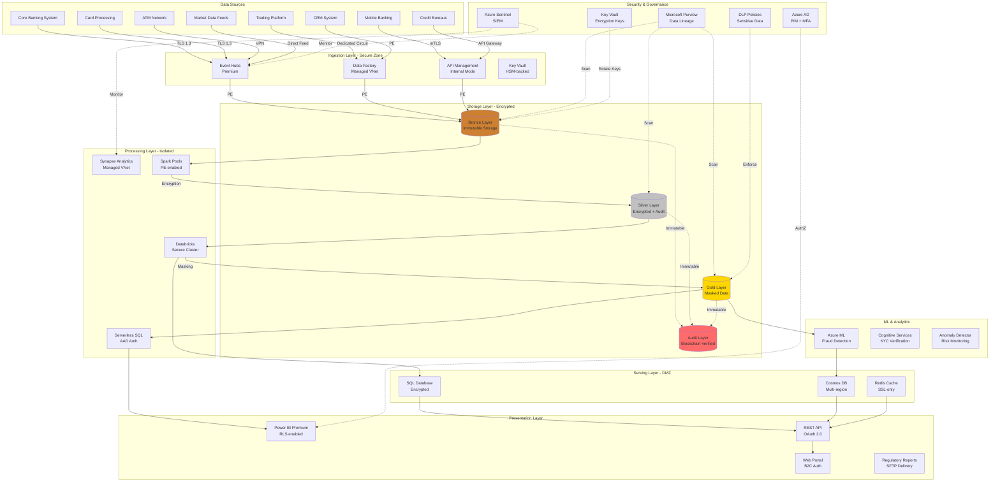

# Financial Services Reference Architecture

## Overview

This reference architecture demonstrates an enterprise-grade financial services analytics platform built on Azure Cloud Scale Analytics (CSA), designed to meet stringent regulatory compliance requirements while delivering real-time fraud detection, risk analytics, and regulatory reporting capabilities.

### Business Drivers

- **Regulatory Compliance**: Meet SOX, Basel III, GDPR, and PCI-DSS requirements
- **Fraud Detection**: Real-time transaction monitoring and anomaly detection
- **Risk Management**: Credit risk, market risk, and operational risk analytics
- **Customer Analytics**: 360-degree customer view with privacy controls
- **Trading Analytics**: High-frequency market data processing
- **Regulatory Reporting**: Automated compliance reporting (CCAR, Dodd-Frank)
- **Anti-Money Laundering (AML)**: Transaction pattern analysis and suspicious activity detection

### Key Capabilities

- Sub-second fraud detection on transaction streams
- Immutable audit trail with cryptographic verification
- Fine-grained access controls with attribute-based policies
- Real-time risk calculations and stress testing
- Automated regulatory report generation
- Customer PII protection with data masking
- Multi-region disaster recovery with RPO < 1 minute

---

## Architecture Diagram



---

## Azure Service Mapping

| Component | Azure Service | Purpose | Compliance Feature |
|-----------|--------------|---------|-------------------|
| **Stream Ingestion** | Event Hubs Premium | Transaction streams with geo-DR | Availability zones, auto-failover |
| **Batch Ingestion** | Azure Data Factory | Batch loads via managed VNet | Private endpoints, CMK encryption |
| **API Gateway** | API Management | Internal API with OAuth | JWT validation, rate limiting, IP filtering |
| **Data Lake** | ADLS Gen2 | Immutable storage with versioning | Legal hold, WORM, audit logs |
| **Big Data Processing** | Synapse Spark Pools | PII detection and masking | Managed VNet, customer-managed keys |
| **Advanced Analytics** | Azure Databricks | ML model training with isolation | Customer-managed VNet, SCIM provisioning |
| **SQL Analytics** | Synapse Serverless SQL | Ad-hoc analysis with AAD auth | Row-level security, column encryption |
| **Machine Learning** | Azure Machine Learning | Fraud models with explainability | Private endpoints, managed identities |
| **Real-Time DB** | Cosmos DB | Global distribution with encryption | Multi-region writes, point-in-time restore |
| **Relational DB** | Azure SQL Database | OLTP with TDE | Always Encrypted, dynamic masking, auditing |
| **Caching** | Azure Cache for Redis | Session state with SSL | VNet injection, geo-replication |
| **Visualization** | Power BI Premium | RLS and OLS enforcement | Sensitivity labels, audit logs |
| **HSM** | Azure Key Vault Premium | FIPS 140-2 Level 3 HSMs | Managed HSM, key rotation |
| **Data Governance** | Microsoft Purview | Data catalog with lineage | Sensitivity scanning, access policies |
| **SIEM** | Azure Sentinel | Security monitoring | Threat intelligence, automated playbooks |
| **DLP** | Microsoft Purview DLP | PII and PCI protection | Content inspection, policy enforcement |
| **Identity** | Azure AD Premium P2 | PIM, MFA, conditional access | Identity protection, access reviews |

---

## Compliance Requirements

### SOX (Sarbanes-Oxley)

**Requirements**:
- Immutable audit trail of all data changes
- Segregation of duties
- Change management controls
- Access logging and monitoring

**Implementation**:

```python
# Immutable audit logging with blockchain verification
from azure.storage.blob import BlobServiceClient, ImmutabilityPolicy
from datetime import datetime, timedelta
import hashlib
import json

class SOXAuditLogger:
    def __init__(self, connection_string):
        self.blob_service = BlobServiceClient.from_connection_string(connection_string)
        self.container = self.blob_service.get_container_client("audit-logs")

    def log_data_change(self, user, action, table, record_id, before_value, after_value):
        """Log data changes with immutability and blockchain verification"""

        audit_record = {
            "timestamp": datetime.utcnow().isoformat(),
            "user": user,
            "action": action,
            "table": table,
            "record_id": record_id,
            "before": before_value,
            "after": after_value,
            "ip_address": self.get_client_ip(),
            "session_id": self.get_session_id()
        }

        # Calculate hash for blockchain
        record_json = json.dumps(audit_record, sort_keys=True)
        audit_record["hash"] = hashlib.sha256(record_json.encode()).hexdigest()
        audit_record["previous_hash"] = self.get_last_hash()

        # Store with immutability policy
        blob_name = f"{datetime.utcnow().strftime('%Y/%m/%d/%H')}/{audit_record['hash']}.json"
        blob_client = self.container.get_blob_client(blob_name)

        blob_client.upload_blob(
            json.dumps(audit_record),
            overwrite=False  # Prevent overwrites
        )

        # Set immutability policy (7 years for SOX)
        immutability_policy = ImmutabilityPolicy(
            expiry_time=datetime.utcnow() + timedelta(days=2555),  # 7 years
            policy_mode="Locked"
        )
        blob_client.set_immutability_policy(immutability_policy)

        # Set legal hold for ongoing investigations
        if self.is_under_investigation(record_id):
            blob_client.set_legal_hold(True)

        return audit_record["hash"]

    def verify_audit_chain(self, from_date, to_date):
        """Verify blockchain integrity of audit logs"""
        blobs = self.container.list_blobs()
        previous_hash = None

        for blob in blobs:
            audit_record = json.loads(
                self.container.download_blob(blob.name).readall()
            )

            if previous_hash and audit_record["previous_hash"] != previous_hash:
                raise ValueError(f"Audit chain broken at {blob.name}")

            # Verify hash
            temp_record = audit_record.copy()
            stored_hash = temp_record.pop("hash")
            temp_record.pop("previous_hash")
            calculated_hash = hashlib.sha256(
                json.dumps(temp_record, sort_keys=True).encode()
            ).hexdigest()

            if stored_hash != calculated_hash:
                raise ValueError(f"Hash mismatch in {blob.name}")

            previous_hash = stored_hash

        return True
```

### PCI-DSS (Payment Card Industry)

**Requirements**:
- Encrypt cardholder data at rest and in transit
- Tokenization of primary account numbers (PAN)
- Network segmentation
- Quarterly vulnerability scans

**Implementation**:

```python
# PCI-DSS compliant card tokenization
from azure.keyvault.keys import KeyClient
from azure.keyvault.keys.crypto import CryptographyClient, EncryptionAlgorithm
from azure.identity import DefaultAzureCredential
import secrets
import hashlib

class PCITokenizationService:
    def __init__(self, vault_url):
        credential = DefaultAzureCredential()
        self.key_client = KeyClient(vault_url, credential)
        self.encryption_key = self.key_client.get_key("card-encryption-key")
        self.crypto_client = CryptographyClient(self.encryption_key, credential)

    def tokenize_pan(self, pan):
        """Tokenize PAN with Format-Preserving Encryption"""

        # Validate PAN
        if not self.luhn_check(pan):
            raise ValueError("Invalid PAN")

        # Generate token
        token = self.generate_token()

        # Encrypt PAN
        encrypted_pan = self.crypto_client.encrypt(
            EncryptionAlgorithm.rsa_oaep_256,
            pan.encode()
        ).ciphertext

        # Store mapping in Key Vault (HSM-protected)
        self.key_client.get_key_vault_secret(
            f"pan-token-{token}",
            value=encrypted_pan.hex(),
            tags={
                "bin": pan[:6],  # Bank Identification Number
                "last4": pan[-4:],
                "token_date": datetime.utcnow().isoformat()
            }
        )

        return {
            "token": token,
            "bin": pan[:6],
            "last4": pan[-4:],
            "expiry_date": self.calculate_expiry()
        }

    def detokenize_pan(self, token):
        """Detokenize PAN (audit logged)"""

        # Log access
        self.log_pan_access(token)

        # Retrieve encrypted PAN
        secret = self.key_client.get_secret(f"pan-token-{token}")
        encrypted_pan = bytes.fromhex(secret.value)

        # Decrypt
        decrypted = self.crypto_client.decrypt(
            EncryptionAlgorithm.rsa_oaep_256,
            encrypted_pan
        ).plaintext

        return decrypted.decode()

    @staticmethod
    def luhn_check(pan):
        """Validate PAN using Luhn algorithm"""
        def digits_of(n):
            return [int(d) for d in str(n)]

        digits = digits_of(pan)
        odd_digits = digits[-1::-2]
        even_digits = digits[-2::-2]
        checksum = sum(odd_digits)
        for d in even_digits:
            checksum += sum(digits_of(d * 2))
        return checksum % 10 == 0
```

### Basel III (Capital Requirements)

**Requirements**:
- Real-time risk-weighted asset (RWA) calculations
- Stress testing capabilities
- Credit exposure monitoring
- Liquidity coverage ratio (LCR) reporting

**Implementation**:

```sql
-- Basel III RWA calculation in Synapse
CREATE VIEW gold.risk_weighted_assets AS
WITH exposure_categories AS (
    SELECT
        exposure_id,
        counterparty_id,
        exposure_amount,
        exposure_type,
        CASE
            -- Sovereign exposures
            WHEN counterparty_type = 'Sovereign' AND credit_rating >= 'AA-' THEN 0.00
            WHEN counterparty_type = 'Sovereign' AND credit_rating >= 'A-' THEN 0.20
            WHEN counterparty_type = 'Sovereign' THEN 1.00

            -- Bank exposures
            WHEN counterparty_type = 'Bank' AND credit_rating >= 'AA-' THEN 0.20
            WHEN counterparty_type = 'Bank' AND credit_rating >= 'A-' THEN 0.50
            WHEN counterparty_type = 'Bank' THEN 1.00

            -- Corporate exposures
            WHEN counterparty_type = 'Corporate' AND credit_rating >= 'AA-' THEN 0.20
            WHEN counterparty_type = 'Corporate' AND credit_rating >= 'A-' THEN 0.50
            WHEN counterparty_type = 'Corporate' AND credit_rating >= 'BBB-' THEN 1.00
            WHEN counterparty_type = 'Corporate' THEN 1.50

            -- Retail exposures
            WHEN exposure_type = 'Retail' THEN 0.75

            -- Residential mortgages
            WHEN exposure_type = 'Residential Mortgage' AND ltv_ratio <= 0.80 THEN 0.35
            WHEN exposure_type = 'Residential Mortgage' THEN 0.75

            -- Commercial real estate
            WHEN exposure_type = 'Commercial RE' THEN 1.00

            ELSE 1.50  -- Default
        END as risk_weight,

        -- Credit Valuation Adjustment (CVA)
        CASE
            WHEN derivative_flag = 1 THEN exposure_amount * 0.075
            ELSE 0
        END as cva_charge

    FROM silver.credit_exposures e
    LEFT JOIN silver.counterparties c ON e.counterparty_id = c.counterparty_id
    LEFT JOIN silver.credit_ratings r ON c.counterparty_id = r.counterparty_id
)
SELECT
    SUM(exposure_amount * risk_weight) as total_rwa,
    SUM(cva_charge) as total_cva,
    SUM(exposure_amount * risk_weight) + SUM(cva_charge) as total_credit_rwa,

    -- Capital requirement (8% of RWA)
    (SUM(exposure_amount * risk_weight) + SUM(cva_charge)) * 0.08 as minimum_capital_requirement,

    -- Capital buffers
    (SUM(exposure_amount * risk_weight) + SUM(cva_charge)) * 0.025 as capital_conservation_buffer,
    (SUM(exposure_amount * risk_weight) + SUM(cva_charge)) * 0.02 as countercyclical_buffer

FROM exposure_categories;

-- Liquidity Coverage Ratio
CREATE VIEW gold.liquidity_coverage_ratio AS
WITH hqla AS (
    SELECT
        SUM(CASE
            WHEN asset_type = 'Cash' THEN market_value * 1.00
            WHEN asset_type = 'Central Bank Reserves' THEN market_value * 1.00
            WHEN asset_type = 'Level 1 Securities' THEN market_value * 1.00
            WHEN asset_type = 'Level 2A Securities' THEN market_value * 0.85
            WHEN asset_type = 'Level 2B Securities' THEN market_value * 0.50
            ELSE 0
        END) as total_hqla
    FROM silver.liquid_assets
    WHERE as_of_date = CURRENT_DATE
),
net_outflows AS (
    SELECT
        SUM(expected_outflow * outflow_rate) - SUM(expected_inflow * inflow_rate) as net_cash_outflow_30d
    FROM silver.cash_flows
    WHERE flow_date BETWEEN CURRENT_DATE AND DATEADD(day, 30, CURRENT_DATE)
)
SELECT
    h.total_hqla,
    n.net_cash_outflow_30d,
    h.total_hqla / NULLIF(n.net_cash_outflow_30d, 0) as lcr_ratio,
    CASE
        WHEN h.total_hqla / NULLIF(n.net_cash_outflow_30d, 0) >= 1.00 THEN 'Compliant'
        ELSE 'Non-Compliant'
    END as compliance_status
FROM hqla h
CROSS JOIN net_outflows n;
```

### GDPR (Privacy Protection)

**Requirements**:
- Right to be forgotten
- Data portability
- Privacy by design
- Consent management

**Implementation**:

```python
# GDPR compliance implementation
from azure.purview.catalog import PurviewCatalogClient
from azure.identity import DefaultAzureCredential
from datetime import datetime
import json

class GDPRComplianceManager:
    def __init__(self, purview_endpoint, storage_account):
        self.purview_client = PurviewCatalogClient(
            purview_endpoint,
            DefaultAzureCredential()
        )
        self.storage_account = storage_account

    def right_to_be_forgotten(self, customer_id):
        """Erase all customer PII across data estate"""

        # 1. Find all assets containing customer data
        assets = self.purview_client.discovery.query(
            keywords=customer_id,
            filter={
                "classifications": ["PII", "Customer Data"]
            }
        )

        deletion_log = {
            "customer_id": customer_id,
            "request_date": datetime.utcnow().isoformat(),
            "deleted_records": []
        }

        # 2. Delete from each identified location
        for asset in assets:
            if asset["entityType"] == "azure_datalake_gen2_path":
                self.delete_from_data_lake(asset["qualifiedName"], customer_id)
            elif asset["entityType"] == "azure_sql_table":
                self.delete_from_sql(asset["qualifiedName"], customer_id)
            elif asset["entityType"] == "azure_cosmosdb_collection":
                self.delete_from_cosmos(asset["qualifiedName"], customer_id)

            deletion_log["deleted_records"].append({
                "asset": asset["name"],
                "location": asset["qualifiedName"],
                "deleted_at": datetime.utcnow().isoformat()
            })

        # 3. Create immutable deletion certificate
        self.create_deletion_certificate(deletion_log)

        return deletion_log

    def data_portability(self, customer_id, export_format="json"):
        """Export all customer data in machine-readable format"""

        # Find all customer data
        customer_data = {}

        # Profile data
        customer_data["profile"] = self.export_customer_profile(customer_id)

        # Transaction history
        customer_data["transactions"] = self.export_transactions(customer_id)

        # Account information
        customer_data["accounts"] = self.export_accounts(customer_id)

        # Consents
        customer_data["consents"] = self.export_consents(customer_id)

        # Generate export file
        export_file = f"customer-data-{customer_id}-{datetime.utcnow().strftime('%Y%m%d')}.{export_format}"

        if export_format == "json":
            return json.dumps(customer_data, indent=2)
        elif export_format == "xml":
            return self.to_xml(customer_data)
        else:
            raise ValueError(f"Unsupported format: {export_format}")

    def consent_management(self, customer_id, consent_type, action):
        """Manage customer consent with audit trail"""

        consent_record = {
            "customer_id": customer_id,
            "consent_type": consent_type,
            "action": action,  # granted, revoked, updated
            "timestamp": datetime.utcnow().isoformat(),
            "ip_address": self.get_client_ip(),
            "user_agent": self.get_user_agent()
        }

        # Store consent with blockchain verification
        self.store_consent_record(consent_record)

        # Update data processing rules
        if action == "revoked":
            self.revoke_processing_rights(customer_id, consent_type)

        return consent_record
```

---

## Fraud Detection Use Case

### Real-Time Fraud Scoring

```python
# Real-time fraud detection with Azure ML
from azureml.core import Workspace, Model
from azureml.core.webservice import Webservice
import pandas as pd
import numpy as np

class FraudDetectionService:
    def __init__(self, workspace_name, model_name):
        self.ws = Workspace.from_config()
        self.model = Model(self.ws, model_name)
        self.service = Webservice(self.ws, f"{model_name}-service")

    def score_transaction(self, transaction):
        """Score transaction for fraud in real-time (<100ms)"""

        # Feature engineering
        features = self.engineer_features(transaction)

        # Get model prediction
        fraud_probability = self.service.run(input_data=json.dumps({
            "data": [features]
        }))

        # Risk-based decision
        if fraud_probability > 0.95:
            decision = "BLOCK"
            action = "block_transaction"
        elif fraud_probability > 0.75:
            decision = "CHALLENGE"
            action = "request_3ds_authentication"
        elif fraud_probability > 0.50:
            decision = "REVIEW"
            action = "flag_for_manual_review"
        else:
            decision = "APPROVE"
            action = "approve_transaction"

        # Log decision for model monitoring
        self.log_decision({
            "transaction_id": transaction["id"],
            "fraud_score": fraud_probability,
            "decision": decision,
            "latency_ms": self.get_latency()
        })

        return {
            "fraud_score": fraud_probability,
            "decision": decision,
            "action": action,
            "reasons": self.explain_prediction(features, fraud_probability)
        }

    def engineer_features(self, transaction):
        """Real-time feature engineering"""

        # Transaction features
        features = {
            "amount": transaction["amount"],
            "merchant_category": transaction["merchant_category_code"],
            "country": transaction["country_code"],
            "channel": transaction["channel"],
        }

        # Velocity features (from cache)
        customer_id = transaction["customer_id"]
        card_id = transaction["card_id"]

        features["txn_count_24h"] = self.get_txn_count(customer_id, hours=24)
        features["txn_count_1h"] = self.get_txn_count(customer_id, hours=1)
        features["amount_sum_24h"] = self.get_amount_sum(customer_id, hours=24)

        # Card features
        features["card_age_days"] = self.get_card_age(card_id)
        features["international_txn_ratio"] = self.get_international_ratio(card_id)

        # Behavioral features
        features["hour_of_day"] = transaction["timestamp"].hour
        features["day_of_week"] = transaction["timestamp"].weekday()
        features["is_unusual_merchant"] = self.check_unusual_merchant(customer_id, transaction["merchant_id"])
        features["is_unusual_location"] = self.check_unusual_location(customer_id, transaction["location"])

        # Network features
        features["device_reputation"] = self.get_device_reputation(transaction["device_id"])
        features["ip_reputation"] = self.get_ip_reputation(transaction["ip_address"])

        return features

    def explain_prediction(self, features, fraud_score):
        """Generate human-readable fraud indicators"""

        reasons = []

        if features["txn_count_1h"] > 5:
            reasons.append("High velocity: Multiple transactions in short time")

        if features["amount"] > 1000 and features["amount_sum_24h"] / features["amount"] < 2:
            reasons.append("Large transaction: Unusual amount for customer")

        if features["is_unusual_location"]:
            reasons.append("Location anomaly: Transaction from new location")

        if features["device_reputation"] < 0.5:
            reasons.append("Device risk: Suspicious device characteristics")

        if features["international_txn_ratio"] < 0.1 and features["country"] != "US":
            reasons.append("International: Rare international transaction")

        return reasons[:3]  # Top 3 reasons
```

### Fraud Pattern Detection

```sql
-- Detect fraud patterns using graph analytics
WITH transaction_network AS (
    SELECT
        t1.transaction_id as txn1,
        t2.transaction_id as txn2,
        t1.card_id,
        t1.merchant_id,
        t1.device_id,
        t1.ip_address,
        ABS(DATEDIFF(second, t1.transaction_time, t2.transaction_time)) as time_diff_seconds
    FROM silver.transactions t1
    JOIN silver.transactions t2
        ON (t1.card_id = t2.card_id
            OR t1.device_id = t2.device_id
            OR t1.ip_address = t2.ip_address)
        AND t1.transaction_id <> t2.transaction_id
        AND t1.transaction_time >= DATEADD(hour, -24, GETDATE())
        AND t2.transaction_time >= DATEADD(hour, -24, GETDATE())
),
suspicious_patterns AS (
    SELECT
        card_id,
        COUNT(DISTINCT merchant_id) as merchant_count,
        COUNT(DISTINCT device_id) as device_count,
        COUNT(DISTINCT ip_address) as ip_count,
        MIN(time_diff_seconds) as min_time_between_txns
    FROM transaction_network
    GROUP BY card_id
    HAVING
        COUNT(DISTINCT device_id) > 3  -- Multiple devices
        OR COUNT(DISTINCT ip_address) > 5  -- Multiple IPs
        OR MIN(time_diff_seconds) < 60  -- Transactions within 1 minute
)
SELECT
    s.*,
    t.transaction_id,
    t.amount,
    t.merchant_name,
    t.country_code,
    f.fraud_label  -- Known fraud cases
FROM suspicious_patterns s
JOIN silver.transactions t ON s.card_id = t.card_id
LEFT JOIN gold.fraud_labels f ON t.transaction_id = f.transaction_id
WHERE t.transaction_time >= DATEADD(hour, -24, GETDATE())
ORDER BY s.device_count DESC, s.ip_count DESC;
```

---

## Performance & Scaling

### High-Frequency Trading Analytics

```python
# Process market data at scale
from pyspark.sql import SparkSession
from pyspark.sql.functions import *
from pyspark.sql.window import Window

spark = SparkSession.builder \
    .appName("HFT-Analytics") \
    .config("spark.sql.adaptive.enabled", "true") \
    .config("spark.sql.adaptive.coalescePartitions.enabled", "true") \
    .config("spark.sql.adaptive.skewJoin.enabled", "true") \
    .config("spark.sql.shuffle.partitions", "400") \
    .getOrCreate()

# Read tick data (billions of records)
tick_data = (spark
    .read
    .format("delta")
    .load("/silver/market_data/ticks")
    .where(col("trade_date") == current_date())
)

# Calculate VWAP by symbol
vwap_window = Window.partitionBy("symbol").orderBy("timestamp") \
    .rowsBetween(Window.unboundedPreceding, Window.currentRow)

vwap_data = tick_data.withColumn(
    "vwap",
    sum(col("price") * col("volume")).over(vwap_window) /
    sum(col("volume")).over(vwap_window)
)

# Calculate tick imbalance
imbalance_window = Window.partitionBy("symbol").orderBy("timestamp") \
    .rowsBetween(-100, 0)

imbalance_data = vwap_data.withColumn(
    "buy_volume_100",
    sum(when(col("side") == "BUY", col("volume")).otherwise(0)).over(imbalance_window)
).withColumn(
    "sell_volume_100",
    sum(when(col("side") == "SELL", col("volume")).otherwise(0)).over(imbalance_window)
).withColumn(
    "imbalance_ratio",
    col("buy_volume_100") / (col("buy_volume_100") + col("sell_volume_100"))
)

# Write to gold layer with Z-ordering
(imbalance_data
    .write
    .format("delta")
    .mode("overwrite")
    .option("overwriteSchema", "true")
    .partitionBy("trade_date", "exchange")
    .save("/gold/market_analytics/vwap_imbalance")
)

# Optimize table
spark.sql("""
    OPTIMIZE delta.`/gold/market_analytics/vwap_imbalance`
    ZORDER BY (symbol, timestamp)
""")
```

---

## Disaster Recovery

### Multi-Region Failover Strategy

```python
# Multi-region DR with automated failover
from azure.cosmos import CosmosClient, PartitionKey
from azure.mgmt.cosmosdb import CosmosDBManagementClient
from azure.identity import DefaultAzureCredential

class DisasterRecoveryManager:
    def __init__(self, subscription_id, resource_group):
        self.credential = DefaultAzureCredential()
        self.cosmos_mgmt = CosmosDBManagementClient(self.credential, subscription_id)
        self.resource_group = resource_group

    def configure_multi_region(self, account_name):
        """Configure multi-region writes with automatic failover"""

        locations = [
            {"locationName": "East US", "failoverPriority": 0, "isZoneRedundant": True},
            {"locationName": "West US 2", "failoverPriority": 1, "isZoneRedundant": True},
            {"locationName": "UK South", "failoverPriority": 2, "isZoneRedundant": True}
        ]

        self.cosmos_mgmt.database_accounts.begin_create_or_update(
            self.resource_group,
            account_name,
            {
                "location": "East US",
                "locations": locations,
                "enableMultipleWriteLocations": True,
                "enableAutomaticFailover": True,
                "consistencyPolicy": {
                    "defaultConsistencyLevel": "BoundedStaleness",
                    "maxStalenessPrefix": 100,
                    "maxIntervalInSeconds": 5
                },
                "backupPolicy": {
                    "type": "Continuous",
                    "continuousModeProperties": {
                        "tier": "Continuous7Days"
                    }
                }
            }
        )

    def test_failover(self, account_name):
        """Test regional failover"""

        # Trigger manual failover
        self.cosmos_mgmt.database_accounts.begin_failover_priority_change(
            self.resource_group,
            account_name,
            {
                "failoverPolicies": [
                    {"locationName": "West US 2", "failoverPriority": 0},
                    {"locationName": "East US", "failoverPriority": 1},
                    {"locationName": "UK South", "failoverPriority": 2}
                ]
            }
        )

    def point_in_time_restore(self, account_name, restore_timestamp):
        """Restore account to specific point in time"""

        restore_account_name = f"{account_name}-restored"

        self.cosmos_mgmt.database_accounts.begin_create_or_update(
            self.resource_group,
            restore_account_name,
            {
                "location": "East US",
                "createMode": "Restore",
                "restoreParameters": {
                    "restoreMode": "PointInTime",
                    "restoreSource": f"/subscriptions/{subscription_id}/resourceGroups/{self.resource_group}/providers/Microsoft.DocumentDB/databaseAccounts/{account_name}",
                    "restoreTimestampInUtc": restore_timestamp
                }
            }
        )
```

---

## Cost Optimization

### Financial Services Workload Costs

| Component | Configuration | Monthly Cost | Optimization Strategy |
|-----------|--------------|--------------|----------------------|
| **Event Hubs Premium** | 8 PUs, 90-day retention | $10,800 | Use Standard tier for non-critical streams |
| **Synapse Dedicated Pool** | DW500c, 8 hours/day | $3,600 | Auto-pause, use serverless for ad-hoc |
| **Databricks Premium** | 10-node cluster, 12 hours/day | $12,000 | Use spot instances, optimize cluster size |
| **Cosmos DB** | 50K RU/s, multi-region | $29,200 | Use autoscale, optimize partition keys |
| **SQL Database** | Business Critical, 16 vCores | $9,600 | Use General Purpose for non-prod |
| **Key Vault Premium** | HSM-backed keys | $5 per key/month | Consolidate keys where possible |
| **Purview** | 10 vCore hours/day | $1,200 | Schedule scans during off-peak |
| **Total** | | **~$66,000/month** | |

---

## Deployment

### Bicep Template for Financial Services

```bicep
// financial-services-infrastructure.bicep

param location string = resourceGroup().location
param environment string = 'prod'
param vnetAddressPrefix string = '10.0.0.0/16'

// Virtual Network with NSGs
resource vnet 'Microsoft.Network/virtualNetworks@2021-05-01' = {
  name: 'finservices-vnet-${environment}'
  location: location
  properties: {
    addressSpace: {
      addressPrefixes: [vnetAddressPrefix]
    }
    subnets: [
      {
        name: 'synapse-subnet'
        properties: {
          addressPrefix: '10.0.1.0/24'
          privateEndpointNetworkPolicies: 'Disabled'
          privateLinkServiceNetworkPolicies: 'Disabled'
        }
      }
      {
        name: 'databricks-private-subnet'
        properties: {
          addressPrefix: '10.0.2.0/24'
          delegations: [
            {
              name: 'databricks-delegation'
              properties: {
                serviceName: 'Microsoft.Databricks/workspaces'
              }
            }
          ]
        }
      }
    ]
  }
}

// Data Lake with encryption and immutability
resource dataLake 'Microsoft.Storage/storageAccounts@2021-09-01' = {
  name: 'findata${environment}${uniqueString(resourceGroup().id)}'
  location: location
  kind: 'StorageV2'
  sku: {
    name: 'Standard_GRS'  // Geo-redundant
  }
  properties: {
    isHnsEnabled: true
    minimumTlsVersion: 'TLS1_2'
    supportsHttpsTrafficOnly: true
    encryption: {
      requireInfrastructureEncryption: true
      services: {
        blob: {
          enabled: true
          keyType: 'Account'
        }
      }
      keySource: 'Microsoft.Keyvault'
      keyvaultproperties: {
        keyname: 'storage-encryption-key'
        keyvaulturi: keyVault.properties.vaultUri
      }
    }
    immutableStorageWithVersioning: {
      enabled: true
      immutabilityPolicy: {
        allowProtectedAppendWrites: false
        immutabilityPeriodSinceCreationInDays: 2555  // 7 years for SOX
      }
    }
  }
}

// Key Vault Premium with HSM
resource keyVault 'Microsoft.KeyVault/vaults@2021-10-01' = {
  name: 'finkeyvault-${environment}'
  location: location
  properties: {
    sku: {
      family: 'A'
      name: 'premium'  // HSM-backed
    }
    tenantId: subscription().tenantId
    enabledForDeployment: true
    enabledForDiskEncryption: true
    enabledForTemplateDeployment: true
    enableSoftDelete: true
    softDeleteRetentionInDays: 90
    enablePurgeProtection: true
    enableRbacAuthorization: true
    networkAcls: {
      defaultAction: 'Deny'
      bypass: 'AzureServices'
      virtualNetworkRules: [
        {
          id: '${vnet.id}/subnets/synapse-subnet'
        }
      ]
    }
  }
}

// Synapse with Managed VNet
resource synapseWorkspace 'Microsoft.Synapse/workspaces@2021-06-01' = {
  name: 'finsynapse-${environment}'
  location: location
  identity: {
    type: 'SystemAssigned'
  }
  properties: {
    defaultDataLakeStorage: {
      accountUrl: dataLake.properties.primaryEndpoints.dfs
      filesystem: 'synapse'
    }
    managedVirtualNetwork: 'default'
    managedVirtualNetworkSettings: {
      preventDataExfiltration: true
      allowedAadTenantIdsForLinking: [subscription().tenantId]
    }
    encryption: {
      cmk: {
        key: {
          name: 'synapse-encryption-key'
          keyVaultUrl: keyVault.properties.vaultUri
        }
      }
    }
    sqlAdministratorLogin: 'sqladmin'
    sqlAdministratorLoginPassword: keyVault.getSecret('sql-admin-password')
  }
}

// Cosmos DB with multi-region writes
resource cosmosDb 'Microsoft.DocumentDB/databaseAccounts@2022-05-15' = {
  name: 'fincos mos-${environment}'
  location: location
  kind: 'GlobalDocumentDB'
  properties: {
    databaseAccountOfferType: 'Standard'
    consistencyPolicy: {
      defaultConsistencyLevel: 'BoundedStaleness'
      maxStalenessPrefix: 100
      maxIntervalInSeconds: 5
    }
    enableMultipleWriteLocations: true
    enableAutomaticFailover: true
    locations: [
      {locationName: 'East US', failoverPriority: 0, isZoneRedundant: true}
      {locationName: 'West US 2', failoverPriority: 1, isZoneRedundant: true}
    ]
    backupPolicy: {
      type: 'Continuous'
      continuousModeProperties: {
        tier: 'Continuous7Days'
      }
    }
    networkAclBypass: 'None'
    publicNetworkAccess: 'Disabled'
  }
}

// Azure Sentinel for SIEM
resource logAnalytics 'Microsoft.OperationalInsights/workspaces@2021-06-01' = {
  name: 'finlogs-${environment}'
  location: location
  properties: {
    sku: {
      name: 'PerGB2018'
    }
    retentionInDays: 730  // 2 years for compliance
  }
}

resource sentinel 'Microsoft.SecurityInsights/onboardingStates@2021-10-01' = {
  name: 'default'
  scope: logAnalytics
  properties: {}
}
```

---

## Related Resources

### Internal Documentation
- [Data Governance Guide](../../best-practices/data-governance/README.md)
- [Security Best Practices](../../best-practices/security/README.md)
- [Network Security Patterns](../../best-practices/network-security/README.md)

### External References
- [Azure Financial Services Compliance](https://docs.microsoft.com/azure/compliance/offerings/)
- [PCI-DSS on Azure](https://docs.microsoft.com/azure/compliance/offerings/offering-pci-dss)
- [GDPR Compliance Guide](https://docs.microsoft.com/azure/compliance/offerings/offering-gdpr)

---

## Next Steps

1. Review [Healthcare Analytics Architecture](./healthcare-analytics.md)
2. Explore [Enterprise Data Warehouse](./enterprise-data-warehouse.md)
3. Implement [ML Pipeline Architecture](./ml-pipeline.md)
