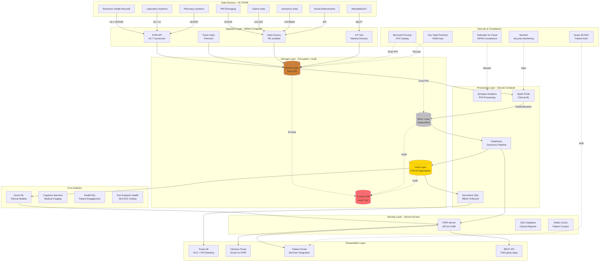

# Healthcare Analytics Reference Architecture

## Overview

This reference architecture demonstrates a HIPAA-compliant healthcare analytics platform built on Azure Cloud Scale Analytics (CSA), designed for clinical analytics, population health management, and precision medicine while ensuring patient data privacy and regulatory compliance.

### Business Drivers

- **Clinical Decision Support**: Real-time insights for improved patient outcomes
- **Population Health Management**: Identify at-risk populations and care gaps
- **Precision Medicine**: Genomics and personalized treatment planning
- **Operational Excellence**: Resource optimization and cost reduction
- **Regulatory Compliance**: HIPAA, HITECH, FDA 21 CFR Part 11
- **Research & Innovation**: Enable clinical trials and medical research
- **Interoperability**: HL7 FHIR integration across healthcare systems

### Key Capabilities

- Protected Health Information (PHI) encryption and access controls
- Real-time patient monitoring and alerting
- Clinical pathway analytics and outcomes measurement
- Drug interaction and adverse event detection
- Medical image analytics with AI
- Social determinants of health (SDOH) integration
- Value-based care and quality metrics reporting

---

## Architecture Diagram



---

## Azure Service Mapping

| Component | Azure Service | Purpose | HIPAA Feature |
|-----------|--------------|---------|--------------|
| **FHIR Integration** | Azure API for FHIR | HL7 FHIR R4 server | BAA-eligible, PHI storage |
| **Stream Ingestion** | Event Hubs Premium | Medical device telemetry | Geo-DR, encryption at rest |
| **IoT Ingestion** | IoT Hub | Wearables, remote monitoring | Per-device authentication, DPS |
| **Batch Ingestion** | Azure Data Factory | Claims, imaging, genomics | CMK encryption, private endpoints |
| **Data Lake** | ADLS Gen2 | PHI storage with encryption | Customer-managed keys, immutability |
| **Big Data Processing** | Synapse Spark Pools | PHI processing and ML | Managed VNet, no public IP |
| **Advanced Analytics** | Azure Databricks | Genomics pipelines | Customer-managed VNet, SCIM |
| **SQL Analytics** | Synapse Serverless SQL | Clinical reporting | AAD auth, dynamic masking |
| **Machine Learning** | Azure Machine Learning | Clinical prediction models | Private endpoints, RBAC |
| **Medical Imaging AI** | Cognitive Services | X-ray/CT/MRI analysis | HIPAA-compliant containers |
| **Clinical NLP** | Text Analytics for Health | ICD-10 coding, entity extraction | PHI-aware, BAA-eligible |
| **Patient Engagement** | Azure Health Bot | Symptom checker, triage | HIPAA-compliant bot framework |
| **FHIR Server** | Azure API for FHIR | Interoperability standard | SMART on FHIR, OAuth 2.0 |
| **Clinical DB** | Azure SQL Database | Structured clinical data | Always Encrypted, TDE, auditing |
| **Caching** | Azure Cache for Redis | Patient context, sessions | VNet injection, SSL-only |
| **Visualization** | Power BI Premium | Clinical dashboards | RLS, sensitivity labels, audit |
| **PHI Encryption** | Azure Key Vault Premium | Patient data encryption | FIPS 140-2 Level 3 HSM |
| **Data Governance** | Microsoft Purview | PHI classification | Auto-labeling, lineage tracking |
| **Security Monitoring** | Microsoft Sentinel | HIPAA breach detection | ML-based anomaly detection |
| **Compliance** | Microsoft Defender for Cloud | HIPAA/HITRUST compliance | Regulatory compliance dashboard |
| **Patient Identity** | Azure AD B2C | Patient portal authentication | MFA, FIDO2, risk-based auth |

---

## HIPAA Compliance

### Business Associate Agreement (BAA)

Azure services with BAA eligibility for PHI:
- Azure API for FHIR
- Azure Storage (ADLS Gen2)
- Azure SQL Database
- Azure Synapse Analytics
- Azure Machine Learning
- Azure Cognitive Services
- Event Hubs, IoT Hub
- Key Vault, Azure Monitor

### Technical Safeguards

```python
# HIPAA-compliant PHI encryption
from azure.keyvault.keys import KeyClient
from azure.keyvault.keys.crypto import CryptographyClient, EncryptionAlgorithm
from azure.identity import DefaultAzureCredential
from azure.storage.blob import BlobServiceClient, CustomerProvidedEncryptionKey
import hashlib
import os

class HIPAAEncryptionService:
    """HIPAA-compliant encryption for PHI"""

    def __init__(self, vault_url):
        credential = DefaultAzureCredential()
        self.key_client = KeyClient(vault_url, credential)
        self.encryption_key = self.key_client.get_key("phi-encryption-key")
        self.crypto_client = CryptographyClient(self.encryption_key, credential)

    def encrypt_phi_field(self, phi_value, patient_id):
        """Encrypt individual PHI field with patient-specific key"""

        # Derive patient-specific key
        patient_key = self.derive_patient_key(patient_id)

        # Encrypt using AES-256-GCM
        encrypted_data = self.crypto_client.encrypt(
            EncryptionAlgorithm.rsa_oaep_256,
            phi_value.encode()
        )

        return {
            "ciphertext": encrypted_data.ciphertext.hex(),
            "key_id": encrypted_data.key_id,
            "algorithm": encrypted_data.algorithm.name,
            "patient_id_hash": hashlib.sha256(patient_id.encode()).hexdigest()
        }

    def decrypt_phi_field(self, encrypted_field, patient_id, audit_reason):
        """Decrypt PHI with mandatory audit logging"""

        # Log access
        self.log_phi_access(
            patient_id=patient_id,
            accessed_by=self.get_current_user(),
            reason=audit_reason,
            field_type="sensitive"
        )

        # Decrypt
        ciphertext = bytes.fromhex(encrypted_field["ciphertext"])
        decrypted = self.crypto_client.decrypt(
            EncryptionAlgorithm.rsa_oaep_256,
            ciphertext
        )

        return decrypted.plaintext.decode()

    def deidentify_dataset(self, df, quasi_identifiers, sensitive_attributes):
        """K-anonymity deidentification for research datasets"""

        from pyspark.sql.functions import col, concat_ws, md5

        # Remove direct identifiers
        direct_identifiers = ["mrn", "ssn", "name", "address", "phone", "email"]
        df_deidentified = df.drop(*direct_identifiers)

        # Generalize quasi-identifiers
        df_deidentified = df_deidentified \
            .withColumn("age_group", self.generalize_age(col("age"))) \
            .withColumn("zipcode_3digit", col("zipcode").substr(1, 3)) \
            .drop("age", "zipcode")

        # Pseudonymize patient ID
        df_deidentified = df_deidentified.withColumn(
            "patient_pseudo_id",
            md5(concat_ws("_", col("patient_id"), col("salt")))
        ).drop("patient_id", "salt")

        # Verify k-anonymity (k >= 5)
        if not self.verify_k_anonymity(df_deidentified, quasi_identifiers, k=5):
            raise ValueError("Dataset does not meet k-anonymity requirements")

        return df_deidentified

    @staticmethod
    def generalize_age(age_col):
        """Generalize age to 5-year buckets"""
        from pyspark.sql.functions import when

        return when(age_col < 5, "0-4") \
            .when(age_col < 10, "5-9") \
            .when(age_col < 15, "10-14") \
            .when(age_col < 20, "15-19") \
            .when(age_col < 25, "20-24") \
            .when(age_col < 30, "25-29") \
            .when(age_col < 35, "30-34") \
            .when(age_col < 40, "35-39") \
            .when(age_col < 45, "40-44") \
            .when(age_col < 50, "45-49") \
            .when(age_col < 55, "50-54") \
            .when(age_col < 60, "55-59") \
            .when(age_col < 65, "60-64") \
            .when(age_col < 70, "65-69") \
            .when(age_col < 75, "70-74") \
            .when(age_col < 80, "75-79") \
            .when(age_col < 85, "80-84") \
            .otherwise("85+")
```

### Administrative Safeguards

```python
# Role-Based Access Control (RBAC) for healthcare roles
from azure.mgmt.authorization import AuthorizationManagementClient
from azure.identity import DefaultAzureCredential

class HIPAARBACManager:
    """Manage HIPAA-compliant access controls"""

    # Healthcare role definitions
    HEALTHCARE_ROLES = {
        "physician": {
            "full_patient_access": True,
            "can_prescribe": True,
            "can_order_labs": True,
            "phi_fields": ["*"]
        },
        "nurse": {
            "full_patient_access": True,
            "can_prescribe": False,
            "can_order_labs": False,
            "phi_fields": ["demographics", "vitals", "medications", "allergies"]
        },
        "medical_assistant": {
            "full_patient_access": False,
            "can_prescribe": False,
            "can_order_labs": False,
            "phi_fields": ["demographics", "vitals", "appointments"]
        },
        "billing": {
            "full_patient_access": False,
            "can_prescribe": False,
            "can_order_labs": False,
            "phi_fields": ["demographics", "insurance", "claims"]
        },
        "researcher": {
            "full_patient_access": False,
            "can_prescribe": False,
            "can_order_labs": False,
            "phi_fields": [],  # Only deidentified data
            "requires_irb_approval": True
        }
    }

    def __init__(self, subscription_id):
        self.auth_client = AuthorizationManagementClient(
            DefaultAzureCredential(),
            subscription_id
        )

    def enforce_minimum_necessary(self, user_role, requested_fields):
        """Enforce minimum necessary principle"""

        allowed_fields = self.HEALTHCARE_ROLES[user_role]["phi_fields"]

        if "*" in allowed_fields:
            return requested_fields  # Full access

        # Filter to only allowed fields
        filtered_fields = [f for f in requested_fields if f in allowed_fields]

        # Log denied access
        denied_fields = set(requested_fields) - set(filtered_fields)
        if denied_fields:
            self.log_access_denial(user_role, denied_fields)

        return filtered_fields

    def implement_break_glass(self, user_id, patient_id, emergency_reason):
        """Emergency access with heightened audit logging"""

        # Grant temporary elevated access
        self.grant_temporary_access(
            user_id=user_id,
            patient_id=patient_id,
            duration_minutes=60,
            access_level="emergency_full_access"
        )

        # Alert security team
        self.send_break_glass_alert(
            user_id=user_id,
            patient_id=patient_id,
            reason=emergency_reason,
            timestamp=datetime.utcnow()
        )

        # Log to immutable audit trail
        self.log_break_glass_access(
            user_id=user_id,
            patient_id=patient_id,
            reason=emergency_reason
        )
```

### Physical Safeguards

```bicep
// Network isolation and private endpoints
resource privateDnsZone 'Microsoft.Network/privateDnsZones@2020-06-01' = {
  name: 'privatelink.blob.core.windows.net'
  location: 'global'
}

resource privateEndpoint 'Microsoft.Network/privateEndpoints@2021-05-01' = {
  name: 'healthcare-data-pe'
  location: location
  properties: {
    subnet: {
      id: subnet.id
    }
    privateLinkServiceConnections: [
      {
        name: 'blob-connection'
        properties: {
          privateLinkServiceId: storageAccount.id
          groupIds: ['blob']
        }
      }
    ]
  }
}

// Disable public network access
resource storageAccount 'Microsoft.Storage/storageAccounts@2021-09-01' = {
  name: 'healthcarephi'
  location: location
  properties: {
    publicNetworkAccess: 'Disabled'
    allowBlobPublicAccess: false
    networkAcls: {
      defaultAction: 'Deny'
      bypass: 'None'
    }
  }
}
```

---

## Clinical Analytics Use Cases

### 1. Real-Time Patient Monitoring

```python
# Real-time patient vitals monitoring with alerts
from pyspark.sql.functions import *
from pyspark.sql.types import *

# Define alert thresholds
CRITICAL_THRESHOLDS = {
    "heart_rate": {"low": 40, "high": 130},
    "blood_pressure_systolic": {"low": 90, "high": 180},
    "blood_pressure_diastolic": {"low": 60, "high": 110},
    "oxygen_saturation": {"low": 90, "high": 100},
    "respiratory_rate": {"low": 8, "high": 30},
    "temperature": {"low": 95.0, "high": 103.0}
}

# Read streaming vitals from IoT devices
vitals_stream = (spark
    .readStream
    .format("eventhubs")
    .options(**eventhubs_config)
    .load()
    .select(from_json(col("body").cast("string"), vitals_schema).alias("data"))
    .select("data.*")
)

# Detect critical values
def check_critical_vitals(vitals_df):
    """Flag vitals outside normal ranges"""

    critical_conditions = []

    for vital, thresholds in CRITICAL_THRESHOLDS.items():
        if vital in vitals_df.columns:
            critical_conditions.append(
                (col(vital) < thresholds["low"]) |
                (col(vital) > thresholds["high"])
            )

    critical_vitals = vitals_df.withColumn(
        "is_critical",
        reduce(lambda x, y: x | y, critical_conditions)
    )

    return critical_vitals

# Detect rapid deterioration (NEWS2 score)
def calculate_news2_score(vitals_df):
    """Calculate National Early Warning Score 2"""

    return vitals_df \
        .withColumn("rr_score", when(col("respiratory_rate") <= 8, 3)
            .when(col("respiratory_rate") <= 11, 1)
            .when(col("respiratory_rate") <= 20, 0)
            .when(col("respiratory_rate") <= 24, 2)
            .otherwise(3)) \
        .withColumn("spo2_score", when(col("oxygen_saturation") <= 91, 3)
            .when(col("oxygen_saturation") <= 93, 2)
            .when(col("oxygen_saturation") <= 95, 1)
            .otherwise(0)) \
        .withColumn("bp_score", when(col("blood_pressure_systolic") <= 90, 3)
            .when(col("blood_pressure_systolic") <= 100, 2)
            .when(col("blood_pressure_systolic") <= 110, 1)
            .when(col("blood_pressure_systolic") <= 219, 0)
            .otherwise(3)) \
        .withColumn("hr_score", when(col("heart_rate") <= 40, 3)
            .when(col("heart_rate") <= 50, 1)
            .when(col("heart_rate") <= 90, 0)
            .when(col("heart_rate") <= 110, 1)
            .when(col("heart_rate") <= 130, 2)
            .otherwise(3)) \
        .withColumn("news2_total",
            col("rr_score") + col("spo2_score") + col("bp_score") + col("hr_score"))

# Alert on critical NEWS2 scores
critical_patients = calculate_news2_score(vitals_stream) \
    .where(col("news2_total") >= 7)  # High risk

# Write to Cosmos DB for real-time dashboard
(critical_patients
    .writeStream
    .format("cosmos.oltp")
    .option("spark.cosmos.connection string", cosmos_connection)
    .option("spark.cosmos.container", "critical_patients")
    .option("checkpointLocation", "/checkpoints/critical_patients")
    .start()
)

# Send alerts to care team
(critical_patients
    .writeStream
    .foreach(lambda row: send_alert_to_care_team(row))
    .start()
)
```

### 2. Population Health Management

```sql
-- Identify patients with care gaps
CREATE VIEW gold.care_gaps AS
WITH patient_conditions AS (
    SELECT
        p.patient_id,
        p.age,
        p.gender,
        STRING_AGG(c.condition_code, ',') as conditions,
        MAX(CASE WHEN c.condition_code IN ('E11', 'E11.9') THEN 1 ELSE 0 END) as has_diabetes,
        MAX(CASE WHEN c.condition_code LIKE 'I10%' THEN 1 ELSE 0 END) as has_hypertension,
        MAX(CASE WHEN c.condition_code LIKE 'E78%' THEN 1 ELSE 0 END) as has_hyperlipidemia
    FROM silver.patients p
    LEFT JOIN silver.conditions c ON p.patient_id = c.patient_id
    WHERE c.status = 'active'
    GROUP BY p.patient_id, p.age, p.gender
),
recent_visits AS (
    SELECT
        patient_id,
        MAX(encounter_date) as last_visit_date
    FROM silver.encounters
    WHERE encounter_date >= DATEADD(year, -2, GETDATE())
    GROUP BY patient_id
),
recent_labs AS (
    SELECT
        patient_id,
        MAX(CASE WHEN observation_code = '4548-4' THEN observation_date END) as last_a1c_date,
        MAX(CASE WHEN observation_code = '2093-3' THEN observation_date END) as last_cholesterol_date,
        MAX(CASE WHEN observation_code = '85354-9' THEN observation_date END) as last_bp_date
    FROM silver.observations
    WHERE observation_date >= DATEADD(year, -2, GETDATE())
    GROUP BY patient_id
)
SELECT
    pc.patient_id,
    pc.age,
    pc.gender,
    pc.conditions,

    -- Diabetes care gaps
    CASE
        WHEN pc.has_diabetes = 1 AND
             DATEDIFF(month, rl.last_a1c_date, GETDATE()) > 6
        THEN 'A1C overdue'
    END as diabetes_gap,

    -- Hypertension care gaps
    CASE
        WHEN pc.has_hypertension = 1 AND
             DATEDIFF(month, rl.last_bp_date, GETDATE()) > 3
        THEN 'Blood pressure check overdue'
    END as hypertension_gap,

    -- Cholesterol monitoring
    CASE
        WHEN pc.has_hyperlipidemia = 1 AND
             DATEDIFF(year, rl.last_cholesterol_date, GETDATE()) > 1
        THEN 'Lipid panel overdue'
    END as cholesterol_gap,

    -- Preventive care gaps
    CASE
        WHEN pc.age >= 50 AND pc.gender = 'F' AND
             NOT EXISTS (
                 SELECT 1 FROM silver.procedures pr
                 WHERE pr.patient_id = pc.patient_id
                   AND pr.procedure_code = '77067'  -- Mammogram
                   AND pr.procedure_date >= DATEADD(year, -2, GETDATE())
             )
        THEN 'Mammogram overdue'
    END as preventive_gap,

    rv.last_visit_date

FROM patient_conditions pc
LEFT JOIN recent_visits rv ON pc.patient_id = rv.patient_id
LEFT JOIN recent_labs rl ON pc.patient_id = rl.patient_id

WHERE
    (pc.has_diabetes = 1 AND DATEDIFF(month, rl.last_a1c_date, GETDATE()) > 6)
    OR (pc.has_hypertension = 1 AND DATEDIFF(month, rl.last_bp_date, GETDATE()) > 3)
    OR (pc.has_hyperlipidemia = 1 AND DATEDIFF(year, rl.last_cholesterol_date, GETDATE()) > 1);
```

### 3. Readmission Risk Prediction

```python
# Predict 30-day readmission risk using Azure ML
from azureml.core import Workspace, Dataset, Experiment
from azureml.train.automl import AutoMLConfig
from azureml.explain.model import ExplanationClient

# Load readmission training data
training_query = """
    SELECT
        e.patient_id,
        e.encounter_id,
        p.age,
        p.gender,
        e.admission_type,
        e.length_of_stay,
        e.discharge_disposition,

        -- Comorbidity count (Charlson index)
        (SELECT COUNT(DISTINCT condition_code)
         FROM silver.conditions c
         WHERE c.patient_id = e.patient_id
           AND c.onset_date <= e.discharge_date) as comorbidity_count,

        -- Prior admissions
        (SELECT COUNT(*)
         FROM silver.encounters e2
         WHERE e2.patient_id = e.patient_id
           AND e2.encounter_date < e.admission_date
           AND e2.encounter_date >= DATEADD(year, -1, e.admission_date)) as prior_admissions_1yr,

        -- Medication count
        (SELECT COUNT(DISTINCT medication_code)
         FROM silver.medications m
         WHERE m.patient_id = e.patient_id
           AND m.start_date <= e.discharge_date
           AND (m.end_date IS NULL OR m.end_date >= e.discharge_date)) as active_medications,

        -- Emergency department visits
        (SELECT COUNT(*)
         FROM silver.encounters e3
         WHERE e3.patient_id = e.patient_id
           AND e3.encounter_type = 'emergency'
           AND e3.encounter_date BETWEEN DATEADD(month, -6, e.admission_date) AND e.admission_date) as ed_visits_6mo,

        -- Lab abnormalities
        (SELECT COUNT(*)
         FROM silver.observations o
         WHERE o.patient_id = e.patient_id
           AND o.observation_date BETWEEN e.admission_date AND e.discharge_date
           AND o.interpretation = 'abnormal') as abnormal_labs,

        -- Target: Readmitted within 30 days
        CASE
            WHEN EXISTS (
                SELECT 1 FROM silver.encounters e4
                WHERE e4.patient_id = e.patient_id
                  AND e4.admission_date BETWEEN e.discharge_date AND DATEADD(day, 30, e.discharge_date)
            ) THEN 1
            ELSE 0
        END as readmitted_30d

    FROM silver.encounters e
    JOIN silver.patients p ON e.patient_id = p.patient_id
    WHERE e.encounter_type = 'inpatient'
      AND e.discharge_date >= DATEADD(year, -2, GETDATE())
      AND e.discharge_date <= DATEADD(day, -30, GETDATE())  -- Allow 30-day follow-up
"""

dataset = Dataset.Tabular.from_sql_query(training_query, query_timeout=600)

# Configure AutoML for classification
automl_config = AutoMLConfig(
    task='classification',
    primary_metric='AUC_weighted',
    training_data=dataset,
    label_column_name='readmitted_30d',
    n_cross_validations=5,
    enable_early_stopping=True,
    experiment_timeout_minutes=120,
    max_concurrent_iterations=4,
    model_explainability=True,
    blocked_models=['XGBoostClassifier'],  # For interpretability
    enable_onnx_compatible_models=True
)

# Train model
ws = Workspace.from_config()
experiment = Experiment(ws, 'readmission-prediction')
run = experiment.submit(automl_config, show_output=True)
best_run, fitted_model = run.get_output()

# Generate model explanations for clinical transparency
client = ExplanationClient.from_run(best_run)
global_explanation = client.download_model_explanation().get_feature_importance_dict()

print("Top risk factors for readmission:")
for feature, importance in sorted(global_explanation.items(), key=lambda x: x[1], reverse=True)[:10]:
    print(f"{feature}: {importance:.4f}")

# Deploy model with FHIR integration
from azureml.core.model import InferenceConfig, Model
from azureml.core.webservice import AciWebservice

inference_config = InferenceConfig(
    entry_script="score_fhir.py",
    environment=best_run.get_environment()
)

deployment_config = AciWebservice.deploy_configuration(
    cpu_cores=2,
    memory_gb=4,
    auth_enabled=True,
    enable_app_insights=True,
    tags={'model': 'readmission', 'version': '1.0', 'hipaa': 'compliant'}
)

service = Model.deploy(
    workspace=ws,
    name='readmission-risk-service',
    models=[best_run.register_model()],
    inference_config=inference_config,
    deployment_config=deployment_config
)

service.wait_for_deployment(show_output=True)
print(f"Scoring endpoint: {service.scoring_uri}")
```

### 4. Clinical NLP and ICD Coding

```python
# Automated ICD-10 coding from clinical notes
from azure.ai.textanalytics import TextAnalyticsClient
from azure.core.credentials import AzureKeyCredential

class ClinicalNLPService:
    """Extract medical entities and suggest ICD-10 codes"""

    def __init__(self, endpoint, key):
        self.client = TextAnalyticsClient(endpoint, AzureKeyCredential(key))

    def analyze_clinical_note(self, note_text):
        """Extract entities from clinical documentation"""

        # Healthcare-specific entity recognition
        poller = self.client.begin_analyze_healthcare_entities([note_text])
        result = poller.result()

        entities = {
            "diagnoses": [],
            "medications": [],
            "procedures": [],
            "symptoms": [],
            "body_structures": [],
            "lab_values": []
        }

        for doc in result:
            for entity in doc.entities:
                entity_data = {
                    "text": entity.text,
                    "category": entity.category,
                    "subcategory": entity.subcategory,
                    "confidence": entity.confidence_score,
                    "offset": entity.offset,
                    "length": entity.length
                }

                # Extract ICD-10 codes
                for link in entity.data_sources:
                    if link.name == "ICD10CM":
                        entity_data["icd10_code"] = link.entity_id

                # Extract RxNorm codes
                if entity.category == "MedicationName":
                    for link in entity.data_sources:
                        if link.name == "RXNORM":
                            entity_data["rxnorm_code"] = link.entity_id

                # Categorize entity
                if entity.category == "Diagnosis":
                    entities["diagnoses"].append(entity_data)
                elif entity.category == "MedicationName":
                    entities["medications"].append(entity_data)
                elif entity.category == "TreatmentName":
                    entities["procedures"].append(entity_data)
                elif entity.category == "SymptomOrSign":
                    entities["symptoms"].append(entity_data)
                elif entity.category == "BodyStructure":
                    entities["body_structures"].append(entity_data)
                elif entity.category == "ExaminationName":
                    entities["lab_values"].append(entity_data)

        return entities

    def suggest_icd10_codes(self, clinical_note):
        """Suggest ICD-10 codes with confidence scores"""

        entities = self.analyze_clinical_note(clinical_note)

        suggested_codes = []

        for diagnosis in entities["diagnoses"]:
            if "icd10_code" in diagnosis:
                suggested_codes.append({
                    "icd10_code": diagnosis["icd10_code"],
                    "description": diagnosis["text"],
                    "confidence": diagnosis["confidence"],
                    "supporting_text": self.extract_context(
                        clinical_note,
                        diagnosis["offset"],
                        diagnosis["length"]
                    )
                })

        return sorted(suggested_codes, key=lambda x: x["confidence"], reverse=True)

# Example usage
nlp_service = ClinicalNLPService(endpoint, key)

clinical_note = """
Patient presents with chest pain radiating to left arm, shortness of breath,
and diaphoresis. ECG shows ST-segment elevation. Troponin elevated at 2.5 ng/mL.
Diagnosis: ST-elevation myocardial infarction (STEMI).
Started on aspirin 325mg, clopidogrel 600mg loading dose, and heparin drip.
Patient taken for emergent cardiac catheterization.
"""

icd10_suggestions = nlp_service.suggest_icd10_codes(clinical_note)

for suggestion in icd10_suggestions:
    print(f"ICD-10: {suggestion['icd10_code']} - {suggestion['description']}")
    print(f"Confidence: {suggestion['confidence']:.2%}")
    print(f"Context: {suggestion['supporting_text']}\n")
```

---

## Genomics Pipeline

### Variant Calling and Analysis

```python
# Genomics pipeline using Databricks and Azure Genomics
from pyspark.sql.functions import *
import glow

# Register Glow functions for genomics
spark = glow.register(spark)

# Read VCF files (variant call format)
variants = spark.read.format("vcf").load("abfss://genomics@storage/vcf/*.vcf.gz")

# Quality filtering
filtered_variants = variants.where(
    (col("qual") > 30) &
    (col("INFO_DP") > 10)  # Depth of coverage
)

# Annotate variants with clinical significance
from databricks.bio.annotate import annotate_variants

annotated_variants = annotate_variants(
    filtered_variants,
    reference_genome="GRCh38",
    annotation_sources=["ClinVar", "dbSNP", "gnomAD"]
)

# Filter for clinically significant variants
pathogenic_variants = annotated_variants.where(
    col("ClinVar_ClinicalSignificance").isin(["Pathogenic", "Likely_pathogenic"])
)

# Pharmacogenomics: Drug-gene interactions
pgx_genes = ["CYP2D6", "CYP2C19", "CYP2C9", "VKORC1", "SLCO1B1", "TPMT"]

pgx_variants = annotated_variants.where(
    col("Gene").isin(pgx_genes)
)

# Generate clinical report
def generate_genomics_report(patient_id, variants_df):
    """Create personalized genomics report"""

    report = {
        "patient_id": patient_id,
        "report_date": datetime.now().isoformat(),
        "pathogenic_variants": [],
        "pharmacogenomics": [],
        "carrier_status": []
    }

    # Pathogenic variants
    for row in variants_df.where(col("ClinVar_ClinicalSignificance") == "Pathogenic").collect():
        report["pathogenic_variants"].append({
            "gene": row["Gene"],
            "variant": f"{row['contigName']}:{row['start']}:{row['referenceAllele']}>{row['alternateAlleles'][0]}",
            "condition": row["ClinVar_PhenotypeList"],
            "inheritance": row["ClinVar_InheritanceMode"]
        })

    # PGx recommendations
    for row in pgx_variants.collect():
        report["pharmacogenomics"].append({
            "gene": row["Gene"],
            "variant": row["rsid"],
            "drugs_affected": get_affected_drugs(row["Gene"], row["genotype"]),
            "recommendation": get_pgx_recommendation(row["Gene"], row["genotype"])
        })

    return report

# Write results to Delta Lake
(pathogenic_variants
    .write
    .format("delta")
    .mode("append")
    .partitionBy("patient_id")
    .save("abfss://genomics@storage/gold/pathogenic_variants")
)
```

---

## Security Monitoring

### HIPAA Breach Detection

```python
# Azure Sentinel playbook for breach detection
from azure.mgmt.securityinsights import SecurityInsights
from azure.mgmt.securityinsights.models import *

class HIPAABreachDetector:
    """Detect potential HIPAA breaches using Sentinel"""

    BREACH_INDICATORS = [
        {
            "name": "Excessive PHI Access",
            "query": """
                SecurityEvent
                | where TimeGenerated > ago(1h)
                | where Activity contains "phi" or Activity contains "patient"
                | summarize AccessCount = count() by Account, Computer
                | where AccessCount > 100
            """,
            "severity": "High"
        },
        {
            "name": "Unusual Time Access",
            "query": """
                SigninLogs
                | where TimeGenerated > ago(24h)
                | where ResultType == "0"
                | extend Hour = hourofday(TimeGenerated)
                | where Hour >= 22 or Hour <= 6
                | join kind=inner (
                    SigninLogs
                    | summarize AvgHourlyAccess = avg(hourofday(TimeGenerated)) by UserPrincipalName
                ) on UserPrincipalName
                | where abs(Hour - AvgHourlyAccess) > 4
            """,
            "severity": "Medium"
        },
        {
            "name": "Geographic Anomaly",
            "query": """
                SigninLogs
                | where TimeGenerated > ago(1h)
                | extend Distance = geo_distance_2points(
                    prev_longitude, prev_latitude,
                    toreal(LocationDetails.geoCoordinates.longitude),
                    toreal(LocationDetails.geoCoordinates.latitude)
                )
                | where Distance > 500000  // 500 km
            """,
            "severity": "High"
        },
        {
            "name": "Bulk PHI Export",
            "query": """
                StorageBlobLogs
                | where TimeGenerated > ago(1h)
                | where OperationName == "GetBlob"
                | where Uri contains "phi" or Uri contains "patient"
                | summarize ExportedFiles = dcount(Uri), TotalBytes = sum(ResponseBodySize)
                    by CallerIpAddress, Identity
                | where ExportedFiles > 50 or TotalBytes > 1000000000
            """,
            "severity": "Critical"
        }
    ]

    def create_breach_detection_rules(self, workspace_id):
        """Deploy breach detection rules to Sentinel"""

        for indicator in self.BREACH_INDICATORS:
            alert_rule = ScheduledAlertRule(
                display_name=indicator["name"],
                description=f"Detect {indicator['name']} as potential HIPAA breach",
                severity=indicator["severity"],
                enabled=True,
                query=indicator["query"],
                query_frequency="PT1H",
                query_period="PT1H",
                trigger_operator="GreaterThan",
                trigger_threshold=0,
                suppression_duration="PT5H",
                suppression_enabled=False,
                tactics=["CredentialAccess", "Exfiltration"],
                incident_configuration={
                    "createIncident": True,
                    "groupingConfiguration": {
                        "enabled": True,
                        "reopenClosedIncident": False,
                        "lookbackDuration": "PT5H",
                        "matchingMethod": "Selected",
                        "groupByEntities": ["Account", "IP"]
                    }
                }
            )

            self.security_insights.alert_rules.create_or_update(
                resource_group_name=self.resource_group,
                workspace_name=workspace_id,
                rule_id=f"breach-{indicator['name'].lower().replace(' ', '-')}",
                alert_rule=alert_rule
            )
```

---

## Performance Optimization

### Query Optimization for Clinical Data

```sql
-- Optimize patient encounter queries
-- Create columnstore index for analytics
CREATE COLUMNSTORE INDEX cci_encounters
ON silver.encounters (patient_id, encounter_date, encounter_type, provider_id, facility_id)
WITH (DROP_EXISTING = ON);

-- Partition by month for time-series queries
CREATE PARTITION FUNCTION pf_encounter_month (datetime2)
AS RANGE RIGHT FOR VALUES (
    '2023-01-01', '2023-02-01', '2023-03-01', '2023-04-01',
    '2023-05-01', '2023-06-01', '2023-07-01', '2023-08-01',
    '2023-09-01', '2023-10-01', '2023-11-01', '2023-12-01',
    '2024-01-01'
);

CREATE PARTITION SCHEME ps_encounter_month
AS PARTITION pf_encounter_month
ALL TO ([PRIMARY]);

-- Materialized view for common aggregations
CREATE MATERIALIZED VIEW gold.patient_encounter_summary
WITH (DISTRIBUTION = HASH(patient_id))
AS
SELECT
    patient_id,
    COUNT(DISTINCT encounter_id) as total_encounters,
    COUNT(DISTINCT CASE WHEN encounter_type = 'inpatient' THEN encounter_id END) as inpatient_visits,
    COUNT(DISTINCT CASE WHEN encounter_type = 'outpatient' THEN encounter_id END) as outpatient_visits,
    COUNT(DISTINCT CASE WHEN encounter_type = 'emergency' THEN encounter_id END) as ed_visits,
    MAX(encounter_date) as last_encounter_date,
    SUM(total_charge_amount) as lifetime_charges
FROM silver.encounters
GROUP BY patient_id;
```

---

## Cost Optimization

| Component | Configuration | Monthly Cost | HIPAA Consideration |
|-----------|--------------|--------------|---------------------|
| **FHIR Server** | Standard, 10K RU/s | $5,840 | BAA-eligible, required for interop |
| **Synapse Spark** | Medium, 8 hrs/day | $4,800 | PHI processing, managed VNet |
| **Databricks** | 6-node cluster, 70% spot | $7,200 | Genomics pipeline, high compute |
| **Key Vault Premium** | HSM-backed keys | $1/key/mo | Required for PHI encryption |
| **ADLS Gen2** | 100TB, geo-redundant | $4,200 | PHI storage, 7-year retention |
| **Azure SQL DB** | Business Critical, 8 vCores | $4,800 | Clinical reporting, always encrypted |
| **Total** | | **~$27,000/month** | |

---

## Related Resources

### Internal Documentation
- [Security Best Practices](../../best-practices/security/README.md)
- [Data Governance Guide](../../best-practices/data-governance/README.md)
- [Compliance Checklist](../../reference/security-checklist/README.md)

### External References
- [Azure Health Data Services](https://docs.microsoft.com/azure/healthcare-apis/)
- [HIPAA Compliance on Azure](https://docs.microsoft.com/azure/compliance/offerings/offering-hipaa-us)
- [HL7 FHIR Standard](https://www.hl7.org/fhir/)

---

## Next Steps

1. Review [Financial Services Architecture](./financial-services.md)
2. Explore [Enterprise Data Warehouse](./enterprise-data-warehouse.md)
3. Implement [ML Pipeline Architecture](./ml-pipeline.md)
