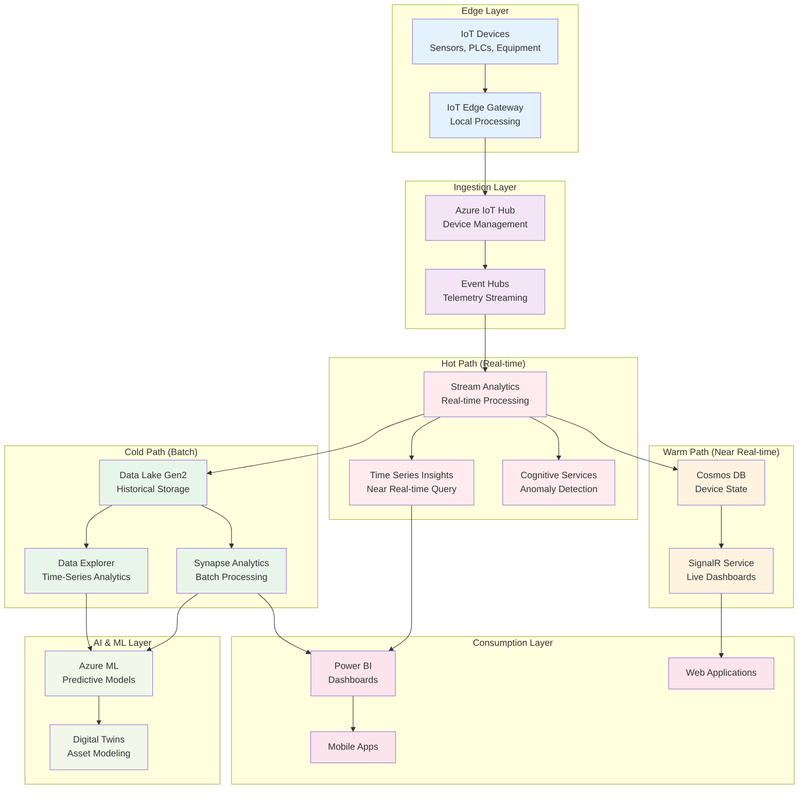
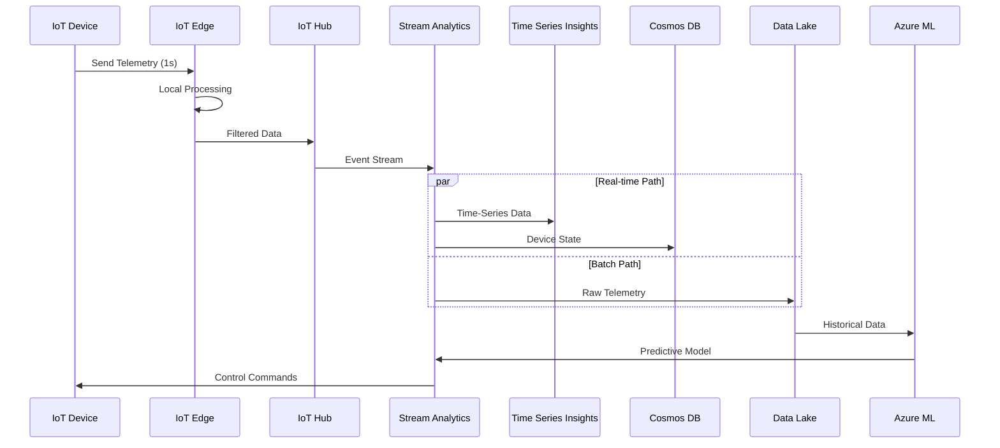
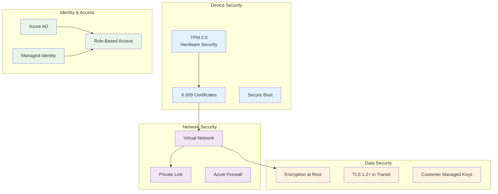

# 🏭 IoT Analytics Reference Architecture

> __🏠 [Home](../../../README.md)__ | __📖 [Architecture Patterns](../README.md)__ | __🌐 [Reference Architectures](README.md)__ | __🏭 IoT Analytics__


Complete IoT analytics solution from device connectivity through real-time processing to predictive maintenance and operational insights.

---

## 📋 Table of Contents

- [Overview](#-overview)
- [Architecture](#-architecture)
- [Azure Services](#-azure-services)
- [Implementation](#-implementation)
- [Use Cases](#-use-cases)
- [Security & Compliance](#-security--compliance)
- [Deployment](#-deployment)
- [Monitoring](#-monitoring)

---

## 🎯 Overview

This reference architecture provides a complete blueprint for building scalable IoT analytics solutions that handle millions of devices, process telemetry in real-time, and deliver actionable insights for predictive maintenance and operational optimization.

### Business Drivers

- __Predictive Maintenance__: Reduce unplanned downtime by 30-50%
- __Operational Efficiency__: Optimize equipment performance and energy usage
- __Quality Control__: Detect anomalies and defects in real-time
- __Asset Utilization__: Maximize equipment uptime and productivity
- __Cost Reduction__: Lower maintenance costs through predictive insights

### Key Capabilities

| Capability | Description | Business Value |
|------------|-------------|----------------|
| __Massive Scale__ | Handle millions of devices, billions of events | Support global operations |
| __Real-time Processing__ | Sub-second latency for critical alerts | Prevent failures |
| __Predictive Analytics__ | ML-powered failure prediction | Reduce downtime 40%+ |
| __Time-Series Analytics__ | Historical trend analysis | Optimize operations |
| __Edge Computing__ | Process data at the edge | Reduce bandwidth 60%+ |

---

## 🏗️ Architecture

### High-Level Architecture



### Data Flow Architecture



---

## ☁️ Azure Services

### Core Services

| Service | Purpose | Configuration | Scale |
|---------|---------|---------------|-------|
| __IoT Hub__ | Device connectivity | S3 tier | 300M messages/day |
| __IoT Edge__ | Edge processing | Standard modules | 1000s of devices |
| __Event Hubs__ | Telemetry streaming | Premium tier | 1M events/sec |
| __Stream Analytics__ | Real-time processing | 100 SUs | Sub-second latency |
| __Time Series Insights__ | Time-series storage | Gen2 | 1 year retention |
| __Data Lake Gen2__ | Historical storage | Premium tier | Unlimited |
| __Data Explorer__ | Time-series analytics | 16 node cluster | Billions of events |
| __Synapse Analytics__ | Batch processing | Spark pools | Petabyte scale |
| __Azure ML__ | Predictive models | GPU clusters | AutoML enabled |

### Supporting Services

- __Cosmos DB__: Device state and metadata
- __SignalR Service__: Real-time dashboard updates
- __Cognitive Services__: Anomaly detection
- __Digital Twins__: Asset modeling
- __Power BI__: Business intelligence
- __Azure Monitor__: Observability
- __Key Vault__: Secrets management

---

## 🔧 Implementation

### 1. Device Connectivity

__IoT Device Code (C# Example)__:

```csharp
using Microsoft.Azure.Devices.Client;
using System;
using System.Text;
using System.Threading.Tasks;
using Newtonsoft.Json;

public class IoTDevice
{
    private readonly DeviceClient _deviceClient;
    private readonly string _deviceId;

    public IoTDevice(string deviceId, string connectionString)
    {
        _deviceId = deviceId;
        _deviceClient = DeviceClient.CreateFromConnectionString(
            connectionString,
            TransportType.Mqtt
        );
    }

    public async Task SendTelemetryAsync(DeviceTelemetry telemetry)
    {
        var messageString = JsonConvert.SerializeObject(telemetry);
        var message = new Message(Encoding.UTF8.GetBytes(messageString))
        {
            ContentType = "application/json",
            ContentEncoding = "utf-8"
        };

        // Add message properties for routing
        message.Properties.Add("deviceType", telemetry.DeviceType);
        message.Properties.Add("priority", telemetry.Priority);

        await _deviceClient.SendEventAsync(message);
    }

    public async Task HandleCloudToDeviceMessages()
    {
        while (true)
        {
            var receivedMessage = await _deviceClient.ReceiveAsync();
            if (receivedMessage != null)
            {
                var messageData = Encoding.UTF8.GetString(receivedMessage.GetBytes());
                Console.WriteLine($"Received command: {messageData}");

                // Process command
                await ProcessCommand(messageData);

                // Complete the message
                await _deviceClient.CompleteAsync(receivedMessage);
            }
        }
    }

    private async Task ProcessCommand(string command)
    {
        // Implement command processing logic
        // e.g., adjust operating parameters, restart, etc.
        await Task.CompletedTask;
    }
}

public class DeviceTelemetry
{
    public string DeviceId { get; set; }
    public string DeviceType { get; set; }
    public DateTime Timestamp { get; set; }
    public double Temperature { get; set; }
    public double Pressure { get; set; }
    public double Vibration { get; set; }
    public string Priority { get; set; }
    public Dictionary<string, object> CustomMetrics { get; set; }
}
```

### 2. IoT Edge Processing

__Edge Module (Python)__:

```python
import asyncio
from azure.iot.device import IoTHubModuleClient, Message
import json
from datetime import datetime

class EdgeProcessor:
    def __init__(self):
        self.client = IoTHubModuleClient.create_from_edge_environment()
        self.threshold_temp = 80.0  # Alert threshold

    async def process_telemetry(self, message):
        """Process telemetry at the edge before sending to cloud."""
        try:
            data = json.loads(message.data.decode('utf-8'))

            # Local processing: Anomaly detection
            if data['temperature'] > self.threshold_temp:
                # Send alert immediately
                alert = {
                    'deviceId': data['deviceId'],
                    'alertType': 'HIGH_TEMPERATURE',
                    'value': data['temperature'],
                    'timestamp': datetime.utcnow().isoformat()
                }
                await self.send_alert(alert)

            # Aggregation: Send summary instead of raw data
            if self.should_aggregate(data):
                aggregated = self.aggregate_data(data)
                await self.send_to_cloud(aggregated)
            else:
                await self.send_to_cloud(data)

        except Exception as e:
            print(f"Error processing telemetry: {e}")

    async def send_alert(self, alert):
        """Send high-priority alert to cloud."""
        message = Message(json.dumps(alert))
        message.custom_properties['priority'] = 'high'
        message.custom_properties['messageType'] = 'alert'
        await self.client.send_message_to_output(message, "alerts")

    async def send_to_cloud(self, data):
        """Send processed data to cloud."""
        message = Message(json.dumps(data))
        message.custom_properties['processed'] = 'true'
        await self.client.send_message_to_output(message, "telemetry")

    def should_aggregate(self, data):
        """Determine if data should be aggregated."""
        # Implement aggregation logic
        return False

    def aggregate_data(self, data):
        """Aggregate telemetry data."""
        # Implement aggregation
        return data

async def main():
    processor = EdgeProcessor()

    # Set message handler
    processor.client.on_message_received = processor.process_telemetry

    # Keep the module running
    await asyncio.Event().wait()

if __name__ == "__main__":
    asyncio.run(main())
```

### 3. Real-time Stream Processing

__Stream Analytics Query__:

```sql
-- Process incoming telemetry stream
WITH EnrichedTelemetry AS (
    SELECT
        DeviceId,
        DeviceType,
        EventEnqueuedUtcTime AS EventTime,
        Temperature,
        Pressure,
        Vibration,
        System.Timestamp() AS ProcessingTime
    FROM
        IoTHubInput TIMESTAMP BY EventEnqueuedUtcTime
)

-- Detect anomalies using ML model
, AnomalyDetection AS (
    SELECT
        DeviceId,
        EventTime,
        Temperature,
        AnomalyDetection_SpikeAndDip(Temperature, 95, 120, 'spikesanddips')
            OVER(LIMIT DURATION(hour, 2)) AS AnomalyScore
    FROM
        EnrichedTelemetry
)

-- Real-time aggregations for Time Series Insights
, RealTimeAggregates AS (
    SELECT
        DeviceId,
        DeviceType,
        System.Timestamp() AS WindowEnd,
        AVG(Temperature) AS AvgTemperature,
        MAX(Temperature) AS MaxTemperature,
        MIN(Temperature) AS MinTemperature,
        AVG(Pressure) AS AvgPressure,
        AVG(Vibration) AS AvgVibration,
        COUNT(*) AS EventCount
    FROM
        EnrichedTelemetry
    GROUP BY
        DeviceId,
        DeviceType,
        TumblingWindow(minute, 1)
)

-- Output to Time Series Insights
SELECT *
INTO TimeSeriesInsightsOutput
FROM RealTimeAggregates;

-- Output anomalies to Cosmos DB for alerts
SELECT
    DeviceId,
    EventTime,
    Temperature,
    AnomalyScore
INTO
    CosmosDBOutput
FROM
    AnomalyDetection
WHERE
    AnomalyScore > 0.8;

-- Output raw data to Data Lake for historical analysis
SELECT *
INTO DataLakeOutput
FROM EnrichedTelemetry;

-- Predictive maintenance alerts
WITH MaintenancePrediction AS (
    SELECT
        DeviceId,
        AVG(Vibration) AS AvgVibration,
        STDEV(Vibration) AS StdDevVibration,
        System.Timestamp() AS WindowEnd
    FROM
        EnrichedTelemetry
    GROUP BY
        DeviceId,
        TumblingWindow(hour, 1)
)

SELECT
    DeviceId,
    WindowEnd,
    AvgVibration,
    StdDevVibration,
    CASE
        WHEN AvgVibration > 50 AND StdDevVibration > 10 THEN 'CRITICAL'
        WHEN AvgVibration > 40 AND StdDevVibration > 5 THEN 'WARNING'
        ELSE 'NORMAL'
    END AS MaintenanceStatus
INTO
    MaintenanceAlertsOutput
FROM
    MaintenancePrediction
WHERE
    AvgVibration > 40;
```

### 4. Predictive Maintenance Model

__Azure ML Training Pipeline (Python)__:

```python
from azureml.core import Workspace, Dataset, Experiment
from azureml.train.automl import AutoMLConfig
from azureml.core.compute import AmlCompute
import pandas as pd

# Connect to workspace
ws = Workspace.from_config()

# Load historical telemetry data
dataset = Dataset.get_by_name(ws, 'equipment-telemetry')
df = dataset.to_pandas_dataframe()

# Feature engineering
def engineer_features(df):
    """Create features for predictive maintenance."""
    # Rolling statistics
    df['temp_rolling_mean_6h'] = df.groupby('device_id')['temperature'].transform(
        lambda x: x.rolling(window=360, min_periods=1).mean()
    )
    df['vibration_rolling_std_6h'] = df.groupby('device_id')['vibration'].transform(
        lambda x: x.rolling(window=360, min_periods=1).std()
    )

    # Time-based features
    df['hour'] = pd.to_datetime(df['timestamp']).dt.hour
    df['day_of_week'] = pd.to_datetime(df['timestamp']).dt.dayofweek

    # Equipment age
    df['days_since_maintenance'] = (
        pd.to_datetime(df['timestamp']) -
        df.groupby('device_id')['last_maintenance_date'].transform('first')
    ).dt.days

    return df

# Prepare training data
df_features = engineer_features(df)

# Split features and target
X = df_features.drop(['failure', 'timestamp', 'device_id'], axis=1)
y = df_features['failure']

# Configure AutoML
automl_config = AutoMLConfig(
    task='classification',
    primary_metric='AUC_weighted',
    training_data=X,
    label_column_name='failure',
    n_cross_validations=5,
    enable_early_stopping=True,
    iteration_timeout_minutes=20,
    max_concurrent_iterations=4,
    compute_target='cpu-cluster',
    experiment_timeout_hours=2
)

# Run experiment
experiment = Experiment(ws, 'predictive-maintenance')
run = experiment.submit(automl_config, show_output=True)

# Get best model
best_run, fitted_model = run.get_output()

# Register model
model = best_run.register_model(
    model_name='equipment-failure-predictor',
    model_path='outputs/model.pkl',
    tags={'type': 'predictive-maintenance', 'version': '1.0'}
)
```

### 5. Time-Series Analytics

__Azure Data Explorer Query__:

```kusto
// Query device telemetry for anomaly patterns
DeviceTelemetry
| where Timestamp > ago(7d)
| where DeviceType == "CNC-Machine"
| make-series
    AvgTemperature=avg(Temperature),
    AvgVibration=avg(Vibration),
    AvgPressure=avg(Pressure)
    on Timestamp
    step 1h
    by DeviceId
| extend
    TempAnomaly = series_decompose_anomalies(AvgTemperature, 1.5),
    VibrationAnomaly = series_decompose_anomalies(AvgVibration, 1.5)
| mv-expand Timestamp, AvgTemperature, TempAnomaly, AvgVibration, VibrationAnomaly
| where TempAnomaly <> 0 or VibrationAnomaly <> 0
| project
    DeviceId,
    Timestamp,
    AvgTemperature,
    TempAnomaly,
    AvgVibration,
    VibrationAnomaly
| order by Timestamp desc
```

---

## 💼 Use Cases

### 1. Predictive Maintenance

__Scenario__: Manufacturing plant with 500+ machines

__Implementation__:
- IoT sensors on critical equipment
- Real-time vibration and temperature monitoring
- ML models predict failures 7-14 days in advance
- Automated work order generation

__Results__:
- 45% reduction in unplanned downtime
- 30% lower maintenance costs
- 25% increase in equipment lifespan

### 2. Quality Control

__Scenario__: Production line quality monitoring

__Implementation__:
- Vision AI for defect detection
- Real-time process monitoring
- Automated quality alerts
- Root cause analysis

__Results__:
- 60% reduction in defects
- 99.5% quality score
- Real-time production adjustments

### 3. Energy Management

__Scenario__: Industrial facility energy optimization

__Implementation__:
- Smart meters and sensors
- Real-time energy monitoring
- Predictive load management
- Automated controls

__Results__:
- 20% energy cost reduction
- Peak load optimization
- Carbon footprint reduction

---

## 🔒 Security & Compliance

### Security Architecture



### Compliance Standards

| Standard | Requirements | Implementation |
|----------|-------------|----------------|
| __ISO 27001__ | Information security | Azure Security Center |
| __SOC 2__ | Service organization controls | Azure compliance |
| __IEC 62443__ | Industrial automation security | Network segmentation |
| __GDPR__ | Data protection | Data residency, encryption |

---

## 🚀 Deployment

### Infrastructure as Code (Bicep)

```bicep
// IoT Analytics Infrastructure
param location string = resourceGroup().location
param iotHubName string
param eventHubNamespace string
param streamAnalyticsJobName string

// IoT Hub
resource iotHub 'Microsoft.Devices/IotHubs@2021-07-02' = {
  name: iotHubName
  location: location
  sku: {
    name: 'S3'
    capacity: 2
  }
  properties: {
    eventHubEndpoints: {
      events: {
        retentionTimeInDays: 7
        partitionCount: 32
      }
    }
    routing: {
      endpoints: {
        eventHubs: [
          {
            name: 'telemetry-endpoint'
            connectionString: eventHubConnection
          }
        ]
      }
      routes: [
        {
          name: 'telemetry-route'
          source: 'DeviceMessages'
          condition: 'true'
          endpointNames: ['telemetry-endpoint']
          isEnabled: true
        }
      ]
    }
  }
}

// Event Hub for telemetry
resource eventHubNamespace 'Microsoft.EventHub/namespaces@2021-11-01' = {
  name: eventHubNamespace
  location: location
  sku: {
    name: 'Premium'
    tier: 'Premium'
    capacity: 1
  }
  properties: {
    isAutoInflateEnabled: true
    maximumThroughputUnits: 20
  }
}

// Stream Analytics Job
resource streamAnalyticsJob 'Microsoft.StreamAnalytics/streamingjobs@2021-10-01-preview' = {
  name: streamAnalyticsJobName
  location: location
  properties: {
    sku: {
      name: 'Standard'
    }
    outputStartMode: 'JobStartTime'
    eventsOutOfOrderPolicy: 'Adjust'
    eventsLateArrivalMaxDelayInSeconds: 5
    dataLocale: 'en-US'
    compatibilityLevel: '1.2'
    contentStoragePolicy: 'SystemAccount'
  }
}
```

---

## 📊 Monitoring

### Key Metrics

| Metric | Target | Alert Threshold |
|--------|--------|----------------|
| __Device Connectivity__ | 99.9% | < 95% |
| __Message Latency__ | < 1s | > 5s |
| __Processing Throughput__ | 1M msg/sec | < 800K msg/sec |
| __ML Model Accuracy__ | > 95% | < 90% |
| __Alert Response Time__ | < 30s | > 60s |

---

## 📚 Related Resources

- [Lambda Architecture](../streaming-architectures/lambda-architecture.md)
- [Time-Series Patterns](../../best-practices/performance-optimization.md)
- [Edge Computing Guide](../../tutorials/README.md)

---

*Last Updated: 2025-01-28*
*Architecture Status: Production Ready*
*Industry: Manufacturing, Energy, Transportation*
