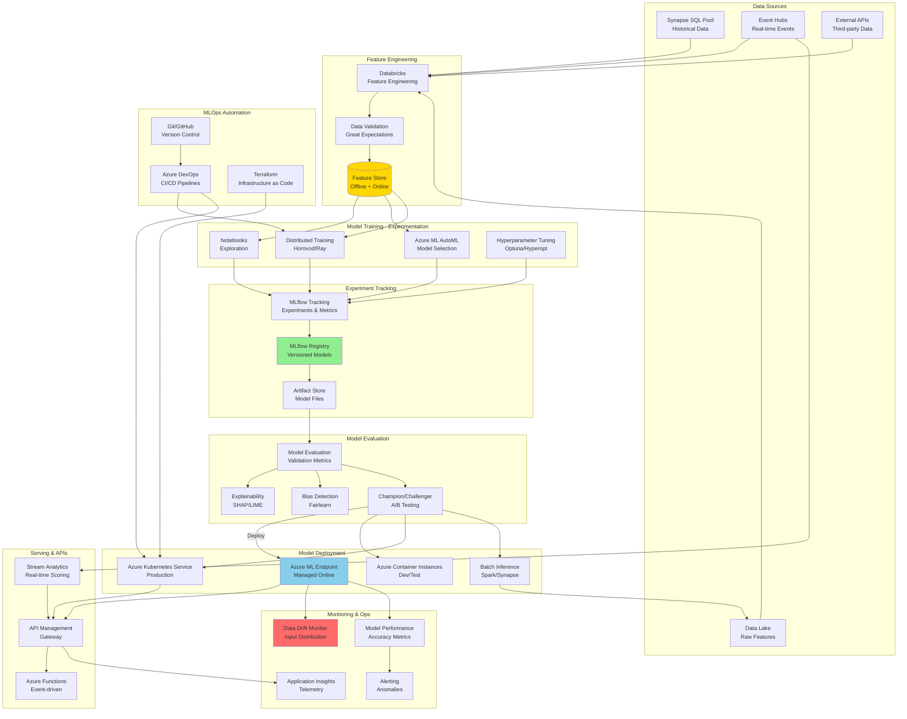

# ML Pipeline Reference Architecture

## Overview

This reference architecture demonstrates an end-to-end machine learning pipeline built on Azure, integrating Azure ML, Databricks MLflow, and Synapse Analytics for scalable model training, deployment, and monitoring in production environments.

### Business Drivers

- **ML Operations (MLOps)**: Automate model lifecycle from training to deployment
- **Feature Engineering**: Centralized feature store for consistency
- **Model Governance**: Track experiments, lineage, and compliance
- **Scalability**: Train models on petabytes of data
- **Real-Time Scoring**: Low-latency predictions (<100ms)
- **Monitoring**: Detect model drift and performance degradation
- **Collaboration**: Enable data scientists and engineers to work together

### Key Capabilities

- Distributed training on Spark clusters
- Automated hyperparameter tuning (AutoML)
- Model versioning and registry
- A/B testing and champion/challenger patterns
- Batch and real-time inference
- Feature store with point-in-time correctness
- Explainable AI and bias detection
- CI/CD for ML models

---

## Architecture Diagram



---

## Azure Service Mapping

| Component | Azure Service | Purpose | ML Capability |
|-----------|--------------|---------|---------------|
| **Feature Engineering** | Azure Databricks | Large-scale data transformation | Unity Catalog feature store |
| **AutoML** | Azure Machine Learning | Automated model selection | 100+ algorithms, neural architecture search |
| **Distributed Training** | Azure ML Compute | GPU/CPU clusters | PyTorch, TensorFlow, scikit-learn |
| **Experiment Tracking** | MLflow on Databricks | Log metrics, parameters, artifacts | Integration with Databricks |
| **Model Registry** | MLflow Model Registry | Version control for models | Stage transitions (Dev/Staging/Prod) |
| **Managed Endpoints** | Azure ML Online Endpoints | Real-time scoring | Auto-scaling, A/B testing |
| **Batch Inference** | Synapse Spark Pools | Large-scale batch scoring | Integration with data lake |
| **API Gateway** | Azure API Management | Unified API layer | Rate limiting, OAuth, caching |
| **Stream Scoring** | Azure Stream Analytics | Real-time predictions | Event-driven inference |
| **Model Monitoring** | Azure ML Model Monitor | Drift and performance tracking | Data distribution comparison |
| **Explainability** | Azure ML Responsible AI | Model interpretability | SHAP, LIME, error analysis |
| **CI/CD** | Azure DevOps / GitHub Actions | Automated deployment | ML pipeline orchestration |
| **Infrastructure** | Terraform / Bicep | IaC for ML resources | Reproducible environments |

---

## Feature Store Architecture

### Feature Engineering Pipeline

```python
# Databricks feature engineering with Delta Live Tables
from databricks import feature_store
from databricks.feature_store import FeatureStoreClient
from pyspark.sql.functions import *
from pyspark.sql.window import Window
import dlt

# Initialize feature store
fs = FeatureStoreClient()

# Define feature table
@dlt.table(
    name="customer_features",
    comment="Customer behavioral features for churn prediction",
    table_properties={
        "quality": "gold",
        "pipelines.autoOptimize.managed": "true"
    }
)
def create_customer_features():
    """
    Compute customer features with point-in-time correctness
    """

    # Read transactions
    transactions = spark.table("silver.transactions")

    # Time-based window features
    window_30d = Window.partitionBy("customer_id").orderBy("transaction_date") \
        .rangeBetween(-2592000, 0)  # 30 days in seconds
    window_90d = Window.partitionBy("customer_id").orderBy("transaction_date") \
        .rangeBetween(-7776000, 0)  # 90 days

    features = transactions.groupBy("customer_id").agg(
        # Recency
        datediff(current_date(), max("transaction_date")).alias("days_since_last_purchase"),

        # Frequency
        count("transaction_id").alias("total_transactions"),
        countDistinct(month("transaction_date")).alias("active_months"),

        # Monetary
        sum("amount").alias("lifetime_value"),
        avg("amount").alias("avg_transaction_amount"),
        max("amount").alias("max_transaction_amount"),

        # Trends
        sum(when(col("transaction_date") >= date_sub(current_date(), 30), col("amount"))
            .otherwise(0)).alias("amount_last_30d"),
        count(when(col("transaction_date") >= date_sub(current_date(), 30), 1)
              .otherwise(None)).alias("transactions_last_30d"),

        sum(when(col("transaction_date") >= date_sub(current_date(), 90), col("amount"))
            .otherwise(0)).alias("amount_last_90d"),

        # Product diversity
        countDistinct("product_category").alias("unique_categories_purchased"),

        # Channel preferences
        sum(when(col("channel") == "online", 1).otherwise(0)).alias("online_transactions"),
        sum(when(col("channel") == "mobile", 1).otherwise(0)).alias("mobile_transactions"),
        sum(when(col("channel") == "store", 1).otherwise(0)).alias("store_transactions")
    )

    # Calculate derived features
    features = features.withColumn(
        "avg_amount_per_month",
        col("lifetime_value") / greatest(col("active_months"), lit(1))
    ).withColumn(
        "amount_trend",
        (col("amount_last_30d") - col("amount_last_90d") / 3) / greatest(col("amount_last_90d") / 3, lit(1))
    ).withColumn(
        "online_preference_ratio",
        col("online_transactions") / greatest(col("total_transactions"), lit(1))
    )

    # Add timestamp for point-in-time lookup
    features = features.withColumn("feature_timestamp", current_timestamp())

    return features

# Create feature table
fs.create_table(
    name="ml_features.customer_features",
    primary_keys=["customer_id"],
    timestamp_keys=["feature_timestamp"],
    df=create_customer_features(),
    description="Customer behavioral features for predictive modeling"
)

# Product features
@dlt.table(name="product_features")
def create_product_features():
    """Product performance and characteristics"""

    products = spark.table("silver.products")
    sales = spark.table("silver.transaction_lines")

    product_stats = sales.groupBy("product_id").agg(
        count("*").alias("total_sales_count"),
        sum("quantity").alias("total_units_sold"),
        sum("line_total").alias("total_revenue"),
        avg("unit_price").alias("avg_selling_price"),
        countDistinct("transaction_id").alias("unique_transactions"),
        approx_percentile("unit_price", 0.5).alias("median_price")
    )

    product_features = products.join(product_stats, "product_id", "left").select(
        "product_id",
        "category",
        "brand",
        "list_price",
        "cost",
        col("list_price") - col("cost").alias("margin"),
        (col("list_price") - col("cost")) / col("list_price").alias("margin_pct"),
        coalesce("total_sales_count", lit(0)).alias("sales_count"),
        coalesce("total_revenue", lit(0)).alias("revenue"),
        coalesce("avg_selling_price", col("list_price")).alias("avg_price"),
        current_timestamp().alias("feature_timestamp")
    )

    return product_features

# Online feature store (for low-latency serving)
def publish_to_online_store():
    """Sync features to online store (Cosmos DB)"""

    from azure.cosmos import CosmosClient

    # Read latest features
    customer_features = spark.table("ml_features.customer_features")

    # Write to Cosmos DB for low-latency serving
    customer_features.write \
        .format("cosmos.oltp") \
        .option("spark.cosmos.accountEndpoint", cosmos_endpoint) \
        .option("spark.cosmos.accountKey", cosmos_key) \
        .option("spark.cosmos.database", "features") \
        .option("spark.cosmos.container", "customer_features") \
        .mode("overwrite") \
        .save()
```

---

## Model Training Pipeline

### Distributed Training with Horovod

```python
# Distributed deep learning training
import horovod.torch as hvd
import torch
import torch.nn as nn
from torch.utils.data import DataLoader
from azureml.core import Run
import mlflow

# Initialize Horovod
hvd.init()
torch.cuda.set_device(hvd.local_rank())

# Get run context
run = Run.get_context()

class CustomerChurnModel(nn.Module):
    """Neural network for churn prediction"""

    def __init__(self, input_dim, hidden_dims=[256, 128, 64]):
        super().__init__()

        layers = []
        prev_dim = input_dim

        for hidden_dim in hidden_dims:
            layers.extend([
                nn.Linear(prev_dim, hidden_dim),
                nn.BatchNorm1d(hidden_dim),
                nn.ReLU(),
                nn.Dropout(0.3)
            ])
            prev_dim = hidden_dim

        layers.append(nn.Linear(prev_dim, 1))
        layers.append(nn.Sigmoid())

        self.network = nn.Sequential(*layers)

    def forward(self, x):
        return self.network(x)

def train_distributed():
    """Train model with Horovod"""

    # Load features from feature store
    fs = FeatureStoreClient()
    training_df = fs.read_table(name="ml_features.customer_features")

    # Prepare data
    feature_columns = [
        "days_since_last_purchase", "total_transactions", "lifetime_value",
        "avg_transaction_amount", "amount_last_30d", "transactions_last_30d",
        "unique_categories_purchased", "online_preference_ratio"
    ]

    X = training_df.select(feature_columns).toPandas().values
    y = training_df.select("churned").toPandas().values

    # Create data loaders
    dataset = torch.utils.data.TensorDataset(
        torch.FloatTensor(X),
        torch.FloatTensor(y)
    )

    # Partition dataset among workers
    sampler = torch.utils.data.distributed.DistributedSampler(
        dataset,
        num_replicas=hvd.size(),
        rank=hvd.rank()
    )

    dataloader = DataLoader(
        dataset,
        batch_size=256,
        sampler=sampler
    )

    # Initialize model
    model = CustomerChurnModel(input_dim=len(feature_columns))
    model = model.cuda()

    # Horovod: scale learning rate by number of workers
    optimizer = torch.optim.Adam(model.parameters(), lr=0.001 * hvd.size())

    # Horovod: wrap optimizer with DistributedOptimizer
    optimizer = hvd.DistributedOptimizer(
        optimizer,
        named_parameters=model.named_parameters()
    )

    # Horovod: broadcast parameters & optimizer state
    hvd.broadcast_parameters(model.state_dict(), root_rank=0)
    hvd.broadcast_optimizer_state(optimizer, root_rank=0)

    # Training loop
    criterion = nn.BCELoss()

    for epoch in range(100):
        model.train()
        epoch_loss = 0

        for batch_idx, (data, target) in enumerate(dataloader):
            data, target = data.cuda(), target.cuda()

            optimizer.zero_grad()
            output = model(data)
            loss = criterion(output, target)
            loss.backward()
            optimizer.step()

            epoch_loss += loss.item()

        # Log metrics (only rank 0)
        if hvd.rank() == 0:
            avg_loss = epoch_loss / len(dataloader)
            mlflow.log_metric("train_loss", avg_loss, step=epoch)
            run.log("train_loss", avg_loss)

            print(f"Epoch {epoch}: Loss = {avg_loss:.4f}")

    # Save model (only rank 0)
    if hvd.rank() == 0:
        mlflow.pytorch.log_model(model, "model")
        run.upload_file("outputs/model.pth", "model.pth")

    return model

if __name__ == "__main__":
    # Start MLflow run
    mlflow.start_run()

    # Train model
    model = train_distributed()

    mlflow.end_run()
```

### AutoML for Model Selection

```python
# Automated machine learning with Azure ML
from azureml.core import Workspace, Dataset, Experiment
from azureml.train.automl import AutoMLConfig
from azureml.automl.core.featurization import FeaturizationConfig
from databricks.feature_store import FeatureStoreClient

# Load training data from feature store
fs = FeatureStoreClient()

# Create training dataset
training_set = fs.create_training_set(
    df=spark.table("silver.customers"),
    feature_lookups=[
        {
            "table_name": "ml_features.customer_features",
            "lookup_key": "customer_id"
        },
        {
            "table_name": "ml_features.product_features",
            "lookup_key": "product_id"
        }
    ],
    label="churned",
    exclude_columns=["customer_id"]
)

training_df = training_set.load_df()

# Convert to Pandas for Azure ML
training_pd = training_df.toPandas()

# Register dataset
ws = Workspace.from_config()
dataset = Dataset.Tabular.register_pandas_dataframe(
    training_pd,
    target=(ws.get_default_datastore(), "training_data"),
    name="churn_training_data"
)

# Configure AutoML
automl_config = AutoMLConfig(
    task='classification',
    primary_metric='AUC_weighted',
    training_data=dataset,
    label_column_name='churned',
    compute_target='ml-compute-cluster',
    n_cross_validations=5,
    enable_early_stopping=True,
    experiment_timeout_hours=3,
    max_concurrent_iterations=10,
    max_cores_per_iteration=-1,
    enable_onnx_compatible_models=True,
    model_explainability=True,

    # Feature engineering
    featurization=FeaturizationConfig(
        dataset_language='en',
        blocked_transformers=['LabelEncoder'],
        drop_columns=['customer_id'],
        imputation_strategies={
            'days_since_last_purchase': 'mean',
            'amount_last_30d': 'zero'
        }
    ),

    # Ensemble settings
    enable_voting_ensemble=True,
    enable_stack_ensemble=True,
    stack_meta_learner_type='LogisticRegressionCV',

    # Model selection
    allowed_models=[
        'XGBoostClassifier',
        'LightGBM',
        'RandomForest',
        'ExtremeRandomTrees',
        'GradientBoosting',
        'LogisticRegression'
    ]
)

# Run AutoML experiment
experiment = Experiment(ws, 'churn-prediction-automl')
run = experiment.submit(automl_config, show_output=True)

# Get best model
best_run, fitted_model = run.get_output()

# Register model
model = best_run.register_model(
    model_name='churn-prediction-model',
    model_path='outputs/model.pkl',
    model_framework='ScikitLearn',
    tags={
        'algorithm': fitted_model.__class__.__name__,
        'auc': best_run.get_metrics()['AUC_weighted'],
        'feature_store_version': 'v1'
    }
)

# Log to MLflow
import mlflow
from mlflow.tracking import MlflowClient

mlflow.set_tracking_uri(databricks_workspace_url)
mlflow.set_experiment("/Shared/churn-prediction")

with mlflow.start_run():
    mlflow.log_param("framework", "AutoML")
    mlflow.log_param("primary_metric", "AUC_weighted")
    mlflow.log_metrics(best_run.get_metrics())
    mlflow.sklearn.log_model(fitted_model, "model")

    # Register in MLflow Model Registry
    mlflow.register_model(
        f"runs:/{mlflow.active_run().info.run_id}/model",
        "churn-prediction"
    )
```

---

## Model Evaluation & Explainability

### Comprehensive Model Evaluation

```python
# Model evaluation with multiple metrics
from sklearn.metrics import *
import matplotlib.pyplot as plt
import seaborn as sns
from azureml.interpret import ExplanationClient
import shap

class ModelEvaluator:
    """Comprehensive model evaluation"""

    def __init__(self, model, X_test, y_test):
        self.model = model
        self.X_test = X_test
        self.y_test = y_test
        self.y_pred = model.predict(X_test)
        self.y_pred_proba = model.predict_proba(X_test)[:, 1]

    def evaluate_classification_metrics(self):
        """Calculate classification metrics"""

        metrics = {
            "accuracy": accuracy_score(self.y_test, self.y_pred),
            "precision": precision_score(self.y_test, self.y_pred),
            "recall": recall_score(self.y_test, self.y_pred),
            "f1_score": f1_score(self.y_test, self.y_pred),
            "auc_roc": roc_auc_score(self.y_test, self.y_pred_proba),
            "avg_precision": average_precision_score(self.y_test, self.y_pred_proba),
            "log_loss": log_loss(self.y_test, self.y_pred_proba)
        }

        # Log to MLflow
        mlflow.log_metrics(metrics)

        return metrics

    def plot_confusion_matrix(self):
        """Visualize confusion matrix"""

        cm = confusion_matrix(self.y_test, self.y_pred)

        plt.figure(figsize=(8, 6))
        sns.heatmap(cm, annot=True, fmt='d', cmap='Blues')
        plt.title('Confusion Matrix')
        plt.ylabel('True Label')
        plt.xlabel('Predicted Label')

        mlflow.log_figure(plt.gcf(), "confusion_matrix.png")
        plt.close()

    def plot_roc_curve(self):
        """Plot ROC curve"""

        fpr, tpr, thresholds = roc_curve(self.y_test, self.y_pred_proba)
        auc_score = auc(fpr, tpr)

        plt.figure(figsize=(8, 6))
        plt.plot(fpr, tpr, label=f'ROC Curve (AUC = {auc_score:.3f})')
        plt.plot([0, 1], [0, 1], 'k--', label='Random')
        plt.xlabel('False Positive Rate')
        plt.ylabel('True Positive Rate')
        plt.title('ROC Curve')
        plt.legend()

        mlflow.log_figure(plt.gcf(), "roc_curve.png")
        plt.close()

    def plot_precision_recall_curve(self):
        """Plot precision-recall curve"""

        precision, recall, thresholds = precision_recall_curve(
            self.y_test,
            self.y_pred_proba
        )

        plt.figure(figsize=(8, 6))
        plt.plot(recall, precision)
        plt.xlabel('Recall')
        plt.ylabel('Precision')
        plt.title('Precision-Recall Curve')

        mlflow.log_figure(plt.gcf(), "precision_recall_curve.png")
        plt.close()

    def explain_model_shap(self, feature_names):
        """Generate SHAP explanations"""

        # Create SHAP explainer
        explainer = shap.TreeExplainer(self.model)
        shap_values = explainer.shap_values(self.X_test)

        # Summary plot
        plt.figure(figsize=(10, 8))
        shap.summary_plot(shap_values, self.X_test, feature_names=feature_names, show=False)
        mlflow.log_figure(plt.gcf(), "shap_summary.png")
        plt.close()

        # Feature importance
        feature_importance = pd.DataFrame({
            'feature': feature_names,
            'importance': np.abs(shap_values).mean(axis=0)
        }).sort_values('importance', ascending=False)

        plt.figure(figsize=(10, 6))
        sns.barplot(data=feature_importance.head(20), x='importance', y='feature')
        plt.title('Top 20 Feature Importances (SHAP)')
        mlflow.log_figure(plt.gcf(), "feature_importance.png")
        plt.close()

        return shap_values

    def check_fairness(self, sensitive_feature):
        """Evaluate model fairness"""

        from fairlearn.metrics import MetricFrame, selection_rate

        # Calculate metrics by sensitive group
        metric_frame = MetricFrame(
            metrics={
                'accuracy': accuracy_score,
                'precision': precision_score,
                'recall': recall_score,
                'selection_rate': selection_rate
            },
            y_true=self.y_test,
            y_pred=self.y_pred,
            sensitive_features=sensitive_feature
        )

        print("Fairness Metrics by Group:")
        print(metric_frame.by_group)

        # Log fairness metrics
        mlflow.log_dict(metric_frame.by_group.to_dict(), "fairness_metrics.json")

        return metric_frame

# Usage
evaluator = ModelEvaluator(model, X_test, y_test)
metrics = evaluator.evaluate_classification_metrics()
evaluator.plot_confusion_matrix()
evaluator.plot_roc_curve()
evaluator.plot_precision_recall_curve()
shap_values = evaluator.explain_model_shap(feature_names)
fairness_metrics = evaluator.check_fairness(sensitive_feature)
```

---

## Model Deployment

### Real-Time Endpoint Deployment

```python
# Deploy model to Azure ML managed endpoint
from azureml.core import Workspace, Model, Environment
from azureml.core.model import InferenceConfig
from azureml.core.webservice import AciWebservice, AksWebservice
from azureml.core.compute import AksCompute, ComputeTarget

# Get workspace
ws = Workspace.from_config()

# Get registered model
model = Model(ws, name='churn-prediction-model')

# Create inference environment
env = Environment.from_conda_specification(
    name='churn-inference-env',
    file_path='conda_env.yml'
)

# Create scoring script
scoring_script = """
import json
import numpy as np
import pandas as pd
from azureml.core.model import Model
import joblib

def init():
    global model
    model_path = Model.get_model_path('churn-prediction-model')
    model = joblib.load(model_path)

def run(raw_data):
    try:
        data = json.loads(raw_data)
        df = pd.DataFrame(data['data'])

        # Get predictions
        predictions = model.predict_proba(df)[:, 1]

        # Get feature importance (if supported)
        if hasattr(model, 'feature_importances_'):
            importance = model.feature_importances_.tolist()
        else:
            importance = None

        return {
            'predictions': predictions.tolist(),
            'feature_importance': importance
        }
    except Exception as e:
        return {'error': str(e)}
"""

with open('score.py', 'w') as f:
    f.write(scoring_script)

# Create inference config
inference_config = InferenceConfig(
    entry_script='score.py',
    environment=env
)

# Deploy to AKS for production
aks_name = 'ml-inference-cluster'
aks_target = ComputeTarget(ws, aks_name)

# Production deployment config
deployment_config = AksWebservice.deploy_configuration(
    cpu_cores=2,
    memory_gb=4,
    autoscale_enabled=True,
    autoscale_min_replicas=2,
    autoscale_max_replicas=10,
    autoscale_target_utilization=70,
    auth_enabled=True,
    enable_app_insights=True,
    scoring_timeout_ms=5000,
    collect_model_data=True  # Enable model monitoring
)

# Deploy service
service = Model.deploy(
    workspace=ws,
    name='churn-prediction-service',
    models=[model],
    inference_config=inference_config,
    deployment_config=deployment_config,
    deployment_target=aks_target,
    overwrite=True
)

service.wait_for_deployment(show_output=True)

print(f"Scoring URI: {service.scoring_uri}")
print(f"Swagger URI: {service.swagger_uri}")
```

### Batch Inference Pipeline

```python
# Batch scoring with Synapse Spark
from pyspark.sql.functions import *
import mlflow
import mlflow.pyfunc

# Load model from MLflow
model_uri = "models:/churn-prediction/Production"
loaded_model = mlflow.pyfunc.spark_udf(
    spark,
    model_uri=model_uri,
    result_type="double"
)

# Load features for scoring
fs = FeatureStoreClient()
customers_to_score = spark.table("silver.customers") \
    .where(col("churn_score_date").isNull())

# Get features from feature store
scoring_df = fs.create_training_set(
    df=customers_to_score,
    feature_lookups=[
        {
            "table_name": "ml_features.customer_features",
            "lookup_key": "customer_id"
        }
    ],
    exclude_columns=["customer_id", "churn_score_date"]
).load_df()

# Prepare feature vector
feature_cols = [
    "days_since_last_purchase", "total_transactions", "lifetime_value",
    "avg_transaction_amount", "amount_last_30d", "transactions_last_30d",
    "unique_categories_purchased", "online_preference_ratio"
]

# Apply model
predictions = scoring_df.withColumn(
    "churn_probability",
    loaded_model(*feature_cols)
).withColumn(
    "churn_risk_category",
    when(col("churn_probability") >= 0.75, "High")
    .when(col("churn_probability") >= 0.50, "Medium")
    .when(col("churn_probability") >= 0.25, "Low")
    .otherwise("Very Low")
).withColumn(
    "score_date",
    current_date()
)

# Write predictions
(predictions
    .select("customer_id", "churn_probability", "churn_risk_category", "score_date")
    .write
    .format("delta")
    .mode("append")
    .partitionBy("score_date")
    .saveAsTable("gold.customer_churn_scores")
)

# Update feature store
spark.sql("""
    UPDATE silver.customers c
    SET churn_score_date = CURRENT_DATE
    WHERE EXISTS (
        SELECT 1 FROM gold.customer_churn_scores s
        WHERE s.customer_id = c.customer_id
          AND s.score_date = CURRENT_DATE
    )
""")
```

---

## Model Monitoring

### Data Drift Detection

```python
# Monitor data drift using Azure ML
from azureml.datadrift import DataDriftDetector
from azureml.core import Workspace, Dataset

ws = Workspace.from_config()

# Create baseline dataset (training data)
baseline_dataset = Dataset.get_by_name(ws, 'churn_training_data')

# Create target dataset (recent production data)
target_dataset = Dataset.get_by_name(ws, 'churn_scoring_data_recent')

# Create data drift detector
monitor = DataDriftDetector.create_from_datasets(
    workspace=ws,
    name='churn_model_datadrift',
    baseline_data_set=baseline_dataset,
    target_data_set=target_dataset,
    compute_target='ml-compute-cluster',
    frequency='Week',
    feature_list=[
        'days_since_last_purchase', 'total_transactions', 'lifetime_value',
        'avg_transaction_amount', 'amount_last_30d', 'transactions_last_30d'
    ],
    drift_threshold=0.3,
    latency=24  # Hours
)

# Run drift detection
drift_run = monitor.run(
    target_date=datetime.now(),
    services=['AmlCompute']
)

# Get drift results
drift_metrics = drift_run.get_metrics()

print(f"Overall drift score: {drift_metrics['drift_coefficient']}")
print(f"Drifted features:")
for feature, drift_score in drift_metrics['feature_drift_scores'].items():
    if drift_score > 0.3:
        print(f"  {feature}: {drift_score:.3f}")
```

### Model Performance Monitoring

```python
# Track model performance over time
from azureml.core import Run
from datetime import datetime, timedelta
import pandas as pd

class ModelPerformanceMonitor:
    """Monitor deployed model performance"""

    def __init__(self, workspace, model_name):
        self.ws = workspace
        self.model_name = model_name

    def collect_prediction_data(self, days=7):
        """Collect predictions and actuals from Application Insights"""

        from azure.monitor.query import LogsQueryClient

        logs_client = LogsQueryClient(credential=DefaultAzureCredential())

        # Query predictions
        predictions_query = f"""
            requests
            | where timestamp > ago({days}d)
            | where name == "{self.model_name}"
            | extend prediction = toreal(customDimensions["prediction"])
            | extend customer_id = tostring(customDimensions["customer_id"])
            | project timestamp, customer_id, prediction
        """

        predictions = logs_client.query_workspace(
            workspace_id=app_insights_workspace_id,
            query=predictions_query,
            timespan=timedelta(days=days)
        )

        # Get actuals (from feedback/labels)
        actuals_df = spark.sql(f"""
            SELECT customer_id, churned as actual, churn_date
            FROM silver.customers
            WHERE churn_date >= DATEADD(day, -{days}, CURRENT_DATE)
        """).toPandas()

        # Join predictions with actuals
        df = predictions.merge(actuals_df, on='customer_id', how='inner')

        return df

    def calculate_performance_metrics(self, df):
        """Calculate ongoing performance metrics"""

        from sklearn.metrics import accuracy_score, precision_score, recall_score, roc_auc_score

        y_true = df['actual']
        y_pred = (df['prediction'] >= 0.5).astype(int)
        y_pred_proba = df['prediction']

        metrics = {
            "timestamp": datetime.now(),
            "sample_size": len(df),
            "accuracy": accuracy_score(y_true, y_pred),
            "precision": precision_score(y_true, y_pred, zero_division=0),
            "recall": recall_score(y_true, y_pred, zero_division=0),
            "auc_roc": roc_auc_score(y_true, y_pred_proba) if len(y_true.unique()) > 1 else None
        }

        return metrics

    def detect_performance_degradation(self, current_metrics, baseline_metrics):
        """Alert if performance degrades"""

        degradation_threshold = 0.05  # 5% drop

        alerts = []

        for metric, current_value in current_metrics.items():
            if metric in baseline_metrics and current_value is not None:
                baseline_value = baseline_metrics[metric]
                if isinstance(baseline_value, (int, float)) and isinstance(current_value, (int, float)):
                    drop = baseline_value - current_value

                    if drop > degradation_threshold:
                        alerts.append({
                            "metric": metric,
                            "baseline": baseline_value,
                            "current": current_value,
                            "drop": drop,
                            "severity": "High" if drop > 0.10 else "Medium"
                        })

        return alerts

    def trigger_retraining(self):
        """Trigger model retraining pipeline"""

        from azure.devops.connection import Connection
        from msrest.authentication import BasicAuthentication

        # Trigger Azure DevOps pipeline
        credentials = BasicAuthentication('', azure_devops_pat)
        connection = Connection(base_url=org_url, creds=credentials)

        build_client = connection.clients.get_build_client()

        build = build_client.queue_build(
            build={
                "definition": {"id": retrain_pipeline_id},
                "parameters": json.dumps({
                    "reason": "performance_degradation",
                    "trigger_time": datetime.now().isoformat()
                })
            },
            project=project_name
        )

        print(f"Retraining pipeline triggered: Build ID {build.id}")

        return build.id

# Usage
monitor = ModelPerformanceMonitor(ws, 'churn-prediction-service')
data = monitor.collect_prediction_data(days=7)
current_metrics = monitor.calculate_performance_metrics(data)

# Compare with baseline
baseline_metrics = {
    "accuracy": 0.85,
    "precision": 0.82,
    "recall": 0.78,
    "auc_roc": 0.89
}

alerts = monitor.detect_performance_degradation(current_metrics, baseline_metrics)

if alerts:
    print("Performance degradation detected:")
    for alert in alerts:
        print(f"  {alert['metric']}: {alert['baseline']:.3f} -> {alert['current']:.3f} ({alert['drop']:.3f} drop)")

    # Trigger retraining
    monitor.trigger_retraining()
```

---

## MLOps CI/CD Pipeline

### Azure DevOps YAML Pipeline

```yaml
# azure-pipelines-ml.yml
trigger:
  branches:
    include:
      - main
      - develop
  paths:
    include:
      - src/ml/**
      - tests/ml/**

variables:
  - group: ml-pipeline-variables
  - name: python.version
    value: '3.9'

stages:
  - stage: DataValidation
    displayName: 'Validate Training Data'
    jobs:
      - job: ValidateData
        pool:
          vmImage: 'ubuntu-latest'
        steps:
          - task: UsePythonVersion@0
            inputs:
              versionSpec: '$(python.version)'

          - script: |
              pip install great-expectations databricks-cli
              great_expectations checkpoint run training_data_checkpoint
            displayName: 'Run Data Quality Checks'

  - stage: ModelTraining
    displayName: 'Train ML Model'
    dependsOn: DataValidation
    jobs:
      - job: TrainModel
        pool:
          vmImage: 'ubuntu-latest'
        steps:
          - task: UsePythonVersion@0
            inputs:
              versionSpec: '$(python.version)'

          - script: |
              pip install azureml-sdk databricks-cli mlflow
              python src/ml/train.py \
                --experiment-name churn-prediction \
                --compute-target ml-compute-cluster
            displayName: 'Train Model'
            env:
              AZURE_ML_WORKSPACE: $(ML_WORKSPACE_NAME)
              AZURE_SUBSCRIPTION_ID: $(AZURE_SUBSCRIPTION_ID)

          - task: PublishTestResults@2
            inputs:
              testResultsFiles: '**/test-results.xml'
              testRunTitle: 'Model Training Tests'

  - stage: ModelEvaluation
    displayName: 'Evaluate Model'
    dependsOn: ModelTraining
    jobs:
      - job: EvaluateModel
        pool:
          vmImage: 'ubuntu-latest'
        steps:
          - script: |
              python src/ml/evaluate.py \
                --model-name churn-prediction-model \
                --baseline-auc 0.85
            displayName: 'Evaluate Model Performance'

          - script: |
              python src/ml/explain.py \
                --model-name churn-prediction-model
            displayName: 'Generate Model Explanations'

          - task: PublishBuildArtifacts@1
            inputs:
              pathToPublish: 'outputs/evaluation'
              artifactName: 'model-evaluation'

  - stage: DeployStaging
    displayName: 'Deploy to Staging'
    dependsOn: ModelEvaluation
    condition: and(succeeded(), eq(variables['Build.SourceBranch'], 'refs/heads/develop'))
    jobs:
      - deployment: DeployStaging
        environment: 'ml-staging'
        strategy:
          runOnce:
            deploy:
              steps:
                - script: |
                    python src/ml/deploy.py \
                      --model-name churn-prediction-model \
                      --environment staging \
                      --compute-type aci
                  displayName: 'Deploy to Staging'

  - stage: IntegrationTests
    displayName: 'Integration Tests'
    dependsOn: DeployStaging
    jobs:
      - job: TestEndpoint
        pool:
          vmImage: 'ubuntu-latest'
        steps:
          - script: |
              python tests/integration/test_endpoint.py \
                --endpoint-url $(STAGING_ENDPOINT_URL)
            displayName: 'Test Staging Endpoint'

  - stage: DeployProduction
    displayName: 'Deploy to Production'
    dependsOn: IntegrationTests
    condition: and(succeeded(), eq(variables['Build.SourceBranch'], 'refs/heads/main'))
    jobs:
      - deployment: DeployProduction
        environment: 'ml-production'
        strategy:
          runOnce:
            deploy:
              steps:
                - script: |
                    python src/ml/deploy.py \
                      --model-name churn-prediction-model \
                      --environment production \
                      --compute-type aks \
                      --min-replicas 2 \
                      --max-replicas 10
                  displayName: 'Deploy to Production AKS'

                - script: |
                    python src/ml/enable_monitoring.py \
                      --service-name churn-prediction-service \
                      --enable-data-drift true \
                      --enable-model-perf true
                  displayName: 'Enable Monitoring'
```

---

## Cost Optimization

### ML Infrastructure Costs

| Component | Configuration | Monthly Cost | Usage Pattern |
|-----------|--------------|--------------|---------------|
| **Databricks (Training)** | 8-node GPU cluster (NC6s_v3) | $12,000 | 8 hours/day, 70% spot instances |
| **Azure ML Compute** | 10-node CPU cluster (D13_v2) | $3,600 | Auto-scaling, training only |
| **AKS (Inference)** | 3 nodes (D4s_v3), auto-scale to 10 | $900 | Production inference cluster |
| **MLflow Tracking** | Databricks managed | Included | Part of Databricks workspace |
| **Feature Store** | Delta Lake on ADLS Gen2 | $500 | 5TB storage, frequent access |
| **Model Registry** | Cosmos DB (1K RU/s) | $60 | Metadata storage |
| **Monitoring** | Application Insights | $250 | 50GB/month telemetry |
| **Total** | | **~$17,000/month** | |

### Cost Optimization Strategies

```python
# 1. Use spot instances for training
databricks_cluster_config = {
    "cluster_name": "ml-training-cluster",
    "spark_version": "11.3.x-gpu-ml-scala2.12",
    "node_type_id": "Standard_NC6s_v3",
    "num_workers": 8,
    "azure_attributes": {
        "availability": "SPOT_WITH_FALLBACK_AZURE",
        "spot_bid_max_price": -1  # Pay up to on-demand price
    },
    "autotermination_minutes": 30  # Auto-terminate when idle
}

# 2. Use low-priority VMs for Azure ML compute
from azureml.core.compute import AmlCompute, ComputeTarget

compute_config = AmlCompute.provisioning_configuration(
    vm_size='STANDARD_D13_V2',
    min_nodes=0,  # Scale to zero when idle
    max_nodes=10,
    vm_priority='lowpriority',  # 80% discount
    idle_seconds_before_scaledown=300
)

# 3. Cache intermediate results
@dlt.table(
    name="cached_features",
    table_properties={
        "pipelines.cache.enabled": "true"
    }
)
def expensive_features():
    # Expensive feature engineering
    pass

# 4. Use serverless SQL for ad-hoc queries
# Instead of dedicated pool
```

---

## Related Resources

### Internal Documentation
- [Databricks ML Guide](../../code-examples/delta-lake/README.md)
- [Azure ML Best Practices](../../best-practices/ml-operations/README.md)
- [Feature Engineering Patterns](../../architecture/feature-store/README.md)

### External References
- [Azure Machine Learning](https://docs.microsoft.com/azure/machine-learning/)
- [MLflow Documentation](https://mlflow.org/docs/latest/index.html)
- [Databricks ML Runtime](https://docs.databricks.com/runtime/mlruntime.html)

---

## Next Steps

1. Review [Retail Analytics Architecture](./retail-analytics.md)
2. Explore [Financial Services Architecture](./financial-services.md)
3. Learn about [Healthcare Analytics](./healthcare-analytics.md)
4. Implement [Enterprise Data Warehouse](./enterprise-data-warehouse.md)
