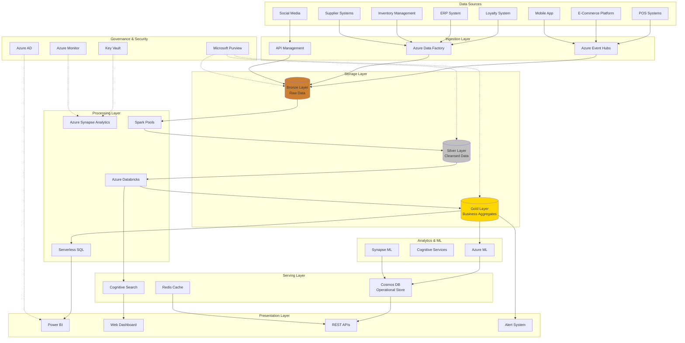
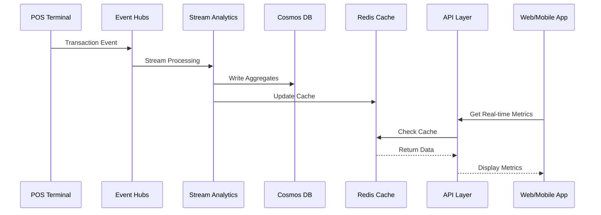
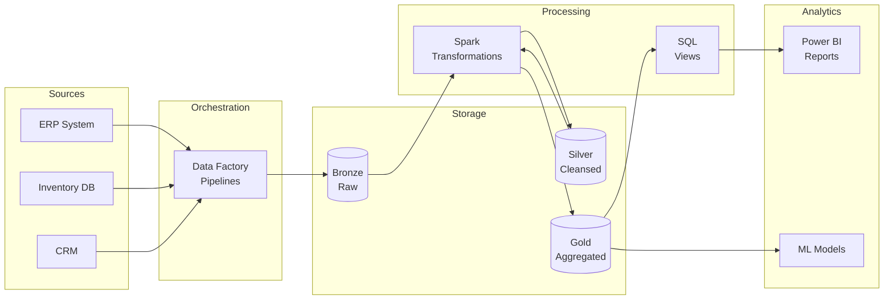
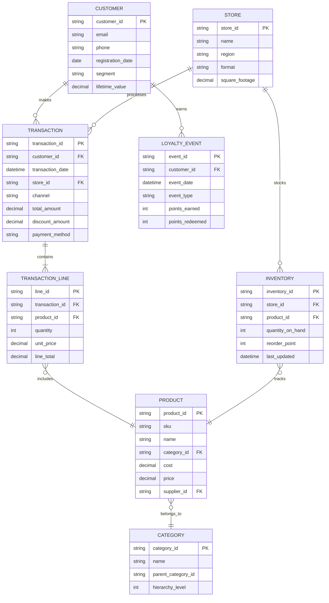

# Retail Analytics Reference Architecture

## Overview

This reference architecture demonstrates a comprehensive retail analytics solution built on Azure Cloud Scale Analytics (CSA) services. It addresses common retail challenges including inventory optimization, sales forecasting, customer analytics, and omnichannel integration while providing real-time insights and advanced analytics capabilities.

### Business Drivers

- **Inventory Optimization**: Reduce stockouts and overstock situations through predictive analytics
- **Customer 360**: Unified view of customer interactions across all channels
- **Sales Forecasting**: Accurate demand prediction for better planning
- **Personalization**: Real-time product recommendations and targeted marketing
- **Operational Excellence**: Store performance analytics and workforce optimization
- **Supply Chain Visibility**: End-to-end tracking and optimization

### Key Capabilities

- Real-time point-of-sale (POS) data ingestion
- Customer behavior analytics across online and offline channels
- Inventory level monitoring and forecasting
- Price optimization and markdown analysis
- Market basket analysis and product affinity
- Store performance benchmarking
- Supply chain analytics and supplier performance

---

## Architecture Diagram



---

## Azure Service Mapping

| Component | Azure Service | Purpose | Key Features |
|-----------|--------------|---------|--------------|
| **Stream Ingestion** | Azure Event Hubs | Real-time POS and clickstream data | Partition-based scaling, 7-day retention |
| **Batch Ingestion** | Azure Data Factory | ERP, CRM, inventory batch loads | 90+ connectors, mapping data flows |
| **API Gateway** | Azure API Management | Third-party integrations | Rate limiting, caching, OAuth |
| **Data Lake** | Azure Data Lake Storage Gen2 | Medallion architecture storage | Hierarchical namespace, ACLs |
| **Big Data Processing** | Azure Synapse Spark Pools | Large-scale transformations | Auto-scaling, Delta Lake support |
| **Advanced Analytics** | Azure Databricks | ML model training, complex analytics | MLflow, collaborative notebooks |
| **SQL Analytics** | Synapse Serverless SQL | Ad-hoc querying, reporting | Pay-per-query, T-SQL interface |
| **Machine Learning** | Azure Machine Learning | Demand forecasting, churn prediction | AutoML, MLOps, managed endpoints |
| **Cognitive AI** | Azure Cognitive Services | Sentiment analysis, image recognition | Pre-trained models, custom vision |
| **Operational Store** | Azure Cosmos DB | Product recommendations, session state | Global distribution, sub-10ms latency |
| **Caching** | Azure Cache for Redis | API response caching | Geo-replication, persistence |
| **Search** | Azure Cognitive Search | Product catalog search | AI enrichment, faceted navigation |
| **Visualization** | Power BI | Executive dashboards, self-service | Embedded analytics, mobile apps |
| **Data Governance** | Microsoft Purview | Data catalog, lineage tracking | Auto-discovery, sensitivity labels |
| **Monitoring** | Azure Monitor | Platform health, performance | Log Analytics, Application Insights |
| **Security** | Azure Key Vault | Secrets, certificates, keys | RBAC, audit logging |
| **Identity** | Azure Active Directory | Authentication, authorization | B2C integration, MFA |

---

## Data Flow Architecture

### Real-Time Path (Hot Path)



**Components:**
1. **Event Capture**: POS transactions streamed to Event Hubs
2. **Stream Processing**: Azure Stream Analytics for windowing aggregations
3. **Operational Store**: Cosmos DB for low-latency reads
4. **Caching**: Redis for frequently accessed data
5. **API Layer**: Low-latency API responses (<100ms)

### Batch Path (Cold Path)



**Components:**
1. **Extraction**: Daily/hourly batch extracts from source systems
2. **Bronze Layer**: Raw data in original format (Parquet/CSV)
3. **Silver Layer**: Validated, deduplicated, conformed data
4. **Gold Layer**: Business-level aggregates and dimensions
5. **Serving**: SQL views for reporting, ML features for models

---

## Data Model

### Conceptual Model



### Storage Structure

```
/retail-analytics/
├── bronze/
│   ├── pos/
│   │   └── year=2024/month=01/day=15/*.parquet
│   ├── ecommerce/
│   │   └── year=2024/month=01/day=15/*.parquet
│   ├── inventory/
│   │   └── snapshot_date=2024-01-15/*.parquet
│   └── crm/
│       └── extract_date=2024-01-15/*.parquet
├── silver/
│   ├── transactions/
│   │   └── year=2024/month=01/day=15/*.delta
│   ├── customers/
│   │   └── *.delta (SCD Type 2)
│   ├── products/
│   │   └── *.delta (SCD Type 2)
│   └── inventory_snapshots/
│       └── snapshot_date=2024-01-15/*.delta
└── gold/
    ├── sales_daily/
    │   └── year=2024/month=01/*.delta
    ├── customer_metrics/
    │   └── *.delta
    ├── product_performance/
    │   └── year=2024/month=01/*.delta
    └── inventory_positions/
        └── snapshot_date=2024-01-15/*.delta
```

---

## Key Use Cases

### 1. Real-Time Inventory Monitoring

**Scenario**: Track inventory levels across all stores in real-time to prevent stockouts

**Implementation**:

```python
# Spark Structured Streaming for inventory updates
from pyspark.sql.functions import *
from delta.tables import *

# Read POS transaction stream
pos_stream = (spark
    .readStream
    .format("eventhubs")
    .options(**eventhubs_config)
    .load()
)

# Parse and extract inventory impact
inventory_deltas = (pos_stream
    .select(
        col("body").cast("string").alias("json_data")
    )
    .select(from_json(col("json_data"), transaction_schema).alias("data"))
    .select("data.*")
    .select(
        col("store_id"),
        col("product_id"),
        col("quantity").cast("int").alias("quantity_sold"),
        current_timestamp().alias("processed_time")
    )
    .groupBy(
        window(col("processed_time"), "5 minutes"),
        col("store_id"),
        col("product_id")
    )
    .agg(sum("quantity_sold").alias("total_sold"))
)

# Update Delta table with inventory changes
delta_table = DeltaTable.forPath(spark, "/gold/inventory_positions")

(inventory_deltas
    .writeStream
    .foreachBatch(lambda batch_df, batch_id:
        delta_table.alias("target").merge(
            batch_df.alias("updates"),
            "target.store_id = updates.store_id AND target.product_id = updates.product_id"
        )
        .whenMatchedUpdate(set = {
            "quantity_on_hand": "target.quantity_on_hand - updates.total_sold",
            "last_updated": "updates.window.end"
        })
        .execute()
    )
    .start()
)
```

### 2. Customer 360 View

**Scenario**: Unified customer profile combining online and offline interactions

**Implementation**:

```sql
-- Synapse Serverless SQL View
CREATE VIEW gold.customer_360 AS
SELECT
    c.customer_id,
    c.email,
    c.registration_date,
    c.segment,

    -- Transaction metrics
    COUNT(DISTINCT t.transaction_id) as total_transactions,
    SUM(t.total_amount) as lifetime_value,
    MAX(t.transaction_date) as last_purchase_date,
    DATEDIFF(day, MAX(t.transaction_date), GETDATE()) as days_since_purchase,

    -- Channel preferences
    SUM(CASE WHEN t.channel = 'Online' THEN 1 ELSE 0 END) as online_transactions,
    SUM(CASE WHEN t.channel = 'Store' THEN 1 ELSE 0 END) as store_transactions,
    SUM(CASE WHEN t.channel = 'Mobile' THEN 1 ELSE 0 END) as mobile_transactions,

    -- Product preferences
    STRING_AGG(DISTINCT p.category_id, ',')
        WITHIN GROUP (ORDER BY p.category_id) as preferred_categories,

    -- Loyalty metrics
    SUM(l.points_earned) as total_points_earned,
    SUM(l.points_redeemed) as total_points_redeemed,

    -- Behavioral segments
    CASE
        WHEN DATEDIFF(day, MAX(t.transaction_date), GETDATE()) <= 30
            AND COUNT(DISTINCT t.transaction_id) >= 4 THEN 'Champion'
        WHEN DATEDIFF(day, MAX(t.transaction_date), GETDATE()) <= 90
            AND SUM(t.total_amount) > 1000 THEN 'Loyal'
        WHEN DATEDIFF(day, MAX(t.transaction_date), GETDATE()) > 180 THEN 'At Risk'
        ELSE 'Potential'
    END as rfm_segment

FROM silver.customers c
LEFT JOIN silver.transactions t ON c.customer_id = t.customer_id
LEFT JOIN silver.transaction_lines tl ON t.transaction_id = tl.transaction_id
LEFT JOIN silver.products p ON tl.product_id = p.product_id
LEFT JOIN silver.loyalty_events l ON c.customer_id = l.customer_id

GROUP BY
    c.customer_id,
    c.email,
    c.registration_date,
    c.segment
```

### 3. Demand Forecasting

**Scenario**: Predict product demand for next 30 days at store level

**Implementation**:

```python
# Azure ML training pipeline
from azureml.core import Workspace, Dataset, Experiment
from azureml.train.automl import AutoMLConfig
from azureml.core.compute import ComputeTarget

# Connect to workspace
ws = Workspace.from_config()

# Load training data from Synapse
dataset = Dataset.Tabular.from_sql_query(
    query="""
        SELECT
            product_id,
            store_id,
            sale_date,
            quantity_sold,
            price,
            promotion_flag,
            day_of_week,
            is_holiday,
            temperature,
            precipitation
        FROM gold.sales_daily
        WHERE sale_date >= DATEADD(year, -2, GETDATE())
    """,
    query_timeout=600,
    workspace=ws
)

# Configure AutoML
automl_config = AutoMLConfig(
    task='forecasting',
    primary_metric='normalized_root_mean_squared_error',
    experiment_timeout_minutes=60,
    training_data=dataset,
    label_column_name='quantity_sold',
    n_cross_validations=5,
    enable_early_stopping=True,
    forecasting_parameters={
        'time_column_name': 'sale_date',
        'forecast_horizon': 30,
        'target_lags': [1, 7, 14, 28],
        'target_rolling_window_size': 7,
        'freq': 'D',
        'group_columns': ['product_id', 'store_id']
    },
    compute_target='ml-compute-cluster'
)

# Run experiment
experiment = Experiment(ws, 'demand-forecasting')
run = experiment.submit(automl_config, show_output=True)
best_run, fitted_model = run.get_output()

# Deploy model
from azureml.core.model import Model, InferenceConfig
from azureml.core.webservice import AciWebservice

model = best_run.register_model(
    model_name='demand-forecast-model',
    model_path='outputs/model.pkl'
)

inference_config = InferenceConfig(
    entry_script='score.py',
    environment=best_run.get_environment()
)

deployment_config = AciWebservice.deploy_configuration(
    cpu_cores=2,
    memory_gb=4,
    auth_enabled=True,
    enable_app_insights=True
)

service = Model.deploy(
    workspace=ws,
    name='demand-forecast-service',
    models=[model],
    inference_config=inference_config,
    deployment_config=deployment_config
)
```

### 4. Market Basket Analysis

**Scenario**: Identify product affinity for cross-selling and store layout optimization

**Implementation**:

```python
# Databricks notebook for association rules
from pyspark.sql.functions import *
from pyspark.ml.fpm import FPGrowth

# Prepare transaction baskets
baskets = (spark.table("silver.transaction_lines")
    .join(spark.table("silver.products"), "product_id")
    .groupBy("transaction_id")
    .agg(collect_set("product_id").alias("items"))
    .where(size("items") > 1)  # Multi-item baskets only
)

# FP-Growth algorithm
fpGrowth = FPGrowth(
    itemsCol="items",
    minSupport=0.01,  # 1% of transactions
    minConfidence=0.3  # 30% confidence
)

model = fpGrowth.fit(baskets)

# Frequent itemsets
frequent_itemsets = model.freqItemsets
frequent_itemsets.write.mode("overwrite").saveAsTable("gold.frequent_itemsets")

# Association rules
rules = model.associationRules
rules.write.mode("overwrite").saveAsTable("gold.association_rules")

# Example: Products to recommend with milk
milk_recommendations = (rules
    .where(array_contains("antecedent", "PROD_MILK_001"))
    .orderBy(desc("lift"))
    .select(
        "consequent",
        "confidence",
        "lift",
        "support"
    )
    .limit(10)
)

milk_recommendations.show()
```

### 5. Price Optimization

**Scenario**: Dynamic pricing based on demand elasticity and competitor pricing

**Implementation**:

```python
# Price elasticity calculation
price_elasticity = spark.sql("""
    WITH price_changes AS (
        SELECT
            product_id,
            sale_date,
            price,
            quantity_sold,
            LAG(price) OVER (PARTITION BY product_id ORDER BY sale_date) as prev_price,
            LAG(quantity_sold) OVER (PARTITION BY product_id ORDER BY sale_date) as prev_quantity
        FROM gold.sales_daily
        WHERE promotion_flag = false
    )
    SELECT
        product_id,
        AVG(
            ((quantity_sold - prev_quantity) / prev_quantity) /
            ((price - prev_price) / prev_price)
        ) as price_elasticity,
        STDDEV(
            ((quantity_sold - prev_quantity) / prev_quantity) /
            ((price - prev_price) / prev_price)
        ) as elasticity_stddev,
        COUNT(*) as price_change_events
    FROM price_changes
    WHERE prev_price IS NOT NULL
        AND prev_quantity > 0
        AND ABS((price - prev_price) / prev_price) > 0.01  -- >1% price change
    GROUP BY product_id
    HAVING COUNT(*) >= 10  -- Sufficient data points
""")

# Optimal price recommendation
optimal_pricing = spark.sql("""
    WITH current_metrics AS (
        SELECT
            p.product_id,
            p.current_price,
            p.cost,
            e.price_elasticity,
            AVG(s.quantity_sold) as avg_daily_quantity,
            MAX(c.competitor_price) as competitor_price
        FROM silver.products p
        JOIN price_elasticity e ON p.product_id = e.product_id
        JOIN gold.sales_daily s ON p.product_id = s.product_id
        LEFT JOIN external.competitor_prices c ON p.sku = c.sku
        WHERE s.sale_date >= DATEADD(day, -30, GETDATE())
        GROUP BY p.product_id, p.current_price, p.cost, e.price_elasticity
    )
    SELECT
        product_id,
        current_price,
        competitor_price,
        CASE
            WHEN price_elasticity < -1.5 THEN current_price * 0.95  -- Elastic, reduce
            WHEN price_elasticity > -0.5 THEN current_price * 1.05  -- Inelastic, increase
            ELSE current_price  -- Keep current
        END as recommended_price,
        (recommended_price - cost) * avg_daily_quantity * 365 as projected_annual_margin
    FROM current_metrics
    WHERE recommended_price > cost * 1.1  -- Maintain minimum margin
""")
```

---

## Performance Optimization

### Synapse Spark Configuration

```python
# Optimized Spark configuration for retail workloads
spark.conf.set("spark.sql.adaptive.enabled", "true")
spark.conf.set("spark.sql.adaptive.coalescePartitions.enabled", "true")
spark.conf.set("spark.sql.adaptive.skewJoin.enabled", "true")

# Delta Lake optimizations
spark.conf.set("spark.databricks.delta.properties.defaults.autoOptimize.optimizeWrite", "true")
spark.conf.set("spark.databricks.delta.properties.defaults.autoOptimize.autoCompact", "true")
spark.conf.set("spark.databricks.delta.optimizeWrite.enabled", "true")
spark.conf.set("spark.databricks.delta.autoCompact.enabled", "true")

# Partition pruning
spark.conf.set("spark.sql.sources.partitionOverwriteMode", "dynamic")

# Z-ordering for transaction table
spark.sql("""
    OPTIMIZE silver.transactions
    ZORDER BY (transaction_date, store_id, customer_id)
""")

# Vacuum old versions
spark.sql("VACUUM silver.transactions RETAIN 168 HOURS")  # 7 days
```

### Serverless SQL Optimizations

```sql
-- Partitioning strategy
CREATE EXTERNAL TABLE gold.sales_daily
WITH (
    LOCATION = '/gold/sales_daily/',
    DATA_SOURCE = DataLakeStorage,
    FILE_FORMAT = ParquetFormat
)
AS
SELECT *
FROM OPENROWSET(
    BULK '/gold/sales_daily/year=*/month=*/*.parquet',
    FORMAT = 'PARQUET'
) AS rows
WHERE year >= 2023;

-- Materialized views for common queries
CREATE MATERIALIZED VIEW gold.sales_summary AS
SELECT
    sale_date,
    store_id,
    category_id,
    SUM(total_amount) as total_sales,
    SUM(quantity_sold) as total_units,
    COUNT(DISTINCT transaction_id) as transaction_count,
    COUNT(DISTINCT customer_id) as unique_customers
FROM gold.sales_daily
GROUP BY sale_date, store_id, category_id;

-- Statistics for query optimization
CREATE STATISTICS sales_date_stats ON gold.sales_daily(sale_date);
CREATE STATISTICS store_stats ON gold.sales_daily(store_id);
CREATE STATISTICS customer_stats ON gold.sales_daily(customer_id);
```

### Cosmos DB Indexing

```json
{
  "indexingMode": "consistent",
  "automatic": true,
  "includedPaths": [
    {
      "path": "/customer_id/?"
    },
    {
      "path": "/product_id/?"
    },
    {
      "path": "/recommendation_score/?"
    }
  ],
  "excludedPaths": [
    {
      "path": "/metadata/*"
    },
    {
      "path": "/_etag/?"
    }
  ],
  "compositeIndexes": [
    [
      {
        "path": "/customer_id",
        "order": "ascending"
      },
      {
        "path": "/recommendation_score",
        "order": "descending"
      }
    ]
  ]
}
```

---

## Security & Compliance

### Data Classification

```python
# Microsoft Purview sensitivity labels
from azure.purview.catalog import PurviewCatalogClient
from azure.identity import DefaultAzureCredential

credential = DefaultAzureCredential()
client = PurviewCatalogClient(
    endpoint="https://<purview-account>.purview.azure.com",
    credential=credential
)

# Apply labels to datasets
sensitivity_labels = {
    "silver.customers": "Confidential - PII",
    "silver.transactions": "Internal - Financial",
    "silver.products": "General",
    "gold.customer_360": "Highly Confidential - Customer Data"
}

for table, label in sensitivity_labels.items():
    client.entity.create_or_update(
        entity={
            "typeName": "azure_datalake_gen2_path",
            "attributes": {
                "qualifiedName": f"abfss://data@storage.dfs.core.windows.net/{table}",
                "name": table,
                "classifications": [{
                    "typeName": label.replace(" - ", "_")
                }]
            }
        }
    )
```

### PCI-DSS Compliance for Payment Data

**Requirements**:
- Encrypt payment data at rest and in transit
- Tokenize credit card numbers
- Implement access controls and audit logging
- Maintain secure network architecture

**Implementation**:

```python
# Payment data tokenization
from azure.keyvault.secrets import SecretClient
from hashlib import sha256
import uuid

def tokenize_card_number(card_number, key_vault_client):
    """Replace card number with token, store mapping in Key Vault"""

    # Generate token
    token = str(uuid.uuid4())

    # Hash for verification
    card_hash = sha256(card_number.encode()).hexdigest()

    # Store in Key Vault (encrypted at rest)
    key_vault_client.set_secret(
        name=f"card-token-{token}",
        value=card_number,
        tags={"type": "payment_token", "hash": card_hash}
    )

    # Return token and last 4 digits for display
    return {
        "token": token,
        "last_four": card_number[-4:],
        "card_type": detect_card_type(card_number)
    }

# Store only tokens in data lake
transaction_data = {
    "transaction_id": "TXN_12345",
    "customer_id": "CUST_67890",
    "payment_token": "a1b2c3d4-e5f6-g7h8-i9j0-k1l2m3n4o5p6",
    "last_four": "4532",
    "amount": 149.99
}
```

### RBAC Configuration

```python
# Azure role assignments
from azure.mgmt.authorization import AuthorizationManagementClient
from azure.identity import DefaultAzureCredential

credential = DefaultAzureCredential()
auth_client = AuthorizationManagementClient(credential, subscription_id)

# Data Engineer role
role_assignments = {
    "data-engineers": {
        "role": "Storage Blob Data Contributor",
        "scope": "/subscriptions/{sub}/resourceGroups/{rg}/providers/Microsoft.Storage/storageAccounts/{storage}",
        "paths": ["/bronze", "/silver"]
    },
    "data-analysts": {
        "role": "Storage Blob Data Reader",
        "scope": "/subscriptions/{sub}/resourceGroups/{rg}/providers/Microsoft.Storage/storageAccounts/{storage}",
        "paths": ["/gold"]
    },
    "ml-engineers": {
        "role": "Storage Blob Data Contributor",
        "scope": "/subscriptions/{sub}/resourceGroups/{rg}/providers/Microsoft.Storage/storageAccounts/{storage}",
        "paths": ["/gold", "/ml-features"]
    }
}
```

### Audit Logging

```sql
-- Synapse audit queries
SELECT
    event_time,
    user_name,
    client_ip,
    resource_type,
    operation_name,
    result_signature,
    duration_ms
FROM sys.fn_get_audit_file(
    'https://<storage>.blob.core.windows.net/audit-logs/*/audit/*.xel',
    DEFAULT,
    DEFAULT
)
WHERE event_time >= DATEADD(day, -7, GETDATE())
    AND operation_name IN ('SELECT', 'UPDATE', 'DELETE')
    AND resource_type = 'DATABASE'
ORDER BY event_time DESC;
```

---

## Cost Optimization

### Resource Sizing Recommendations

| Workload Type | Service Tier | Configuration | Estimated Monthly Cost |
|---------------|--------------|---------------|------------------------|
| **Event Hubs** | Standard | 10 TUs, 7-day retention | $2,500 |
| **Synapse Spark** | Memory Optimized | 3 nodes (16 cores), auto-pause | $3,200 |
| **Databricks** | Standard | 5-node cluster, 70% spot instances | $4,800 |
| **Cosmos DB** | Standard | 10K RU/s, 500GB storage | $5,840 |
| **Data Lake Gen2** | Hot/Cool tiers | 50TB hot, 200TB cool | $2,100 |
| **Azure ML** | Standard | 10 compute hours/day | $1,500 |
| **Power BI Premium** | P1 | 8 v-cores | $4,995 |
| **Total** | | | **~$25,000/month** |

### Cost Reduction Strategies

```python
# 1. Auto-pause Spark pools when idle
spark_config = {
    "auto_pause": {
        "enabled": True,
        "delay_in_minutes": 15
    },
    "auto_scale": {
        "enabled": True,
        "min_nodes": 3,
        "max_nodes": 10
    }
}

# 2. Use spot instances for non-critical workloads
databricks_cluster = {
    "node_type_id": "Standard_D16s_v3",
    "num_workers": 5,
    "azure_attributes": {
        "availability": "SPOT_WITH_FALLBACK_AZURE",
        "spot_bid_max_price": -1  # Pay up to on-demand price
    }
}

# 3. Partition pruning to reduce data scanning
sales_query = """
    SELECT *
    FROM gold.sales_daily
    WHERE year = 2024
        AND month = 1
        AND store_id IN ('STORE_001', 'STORE_002')
"""
# Scans only 2 stores in January 2024, not entire dataset

# 4. Serverless SQL for infrequent queries
# Pay only for data processed, not compute time

# 5. Data lifecycle management
lifecycle_policy = {
    "rules": [
        {
            "name": "move-to-cool",
            "type": "Lifecycle",
            "definition": {
                "filters": {
                    "blobTypes": ["blockBlob"],
                    "prefixMatch": ["bronze/"]
                },
                "actions": {
                    "baseBlob": {
                        "tierToCool": {"daysAfterModificationGreaterThan": 30},
                        "tierToArchive": {"daysAfterModificationGreaterThan": 180}
                    }
                }
            }
        }
    ]
}
```

---

## Monitoring & Alerting

### Key Metrics

```python
# Azure Monitor metrics for retail analytics
from azure.monitor.query import MetricsQueryClient, MetricAggregationType

metrics_to_track = {
    "event_hubs": [
        "IncomingMessages",
        "OutgoingMessages",
        "ThrottledRequests",
        "ActiveConnections"
    ],
    "synapse_spark": [
        "SparkJobsRunning",
        "SparkJobsSucceeded",
        "SparkJobsFailed",
        "SparkPoolCPUUtilization"
    ],
    "cosmos_db": [
        "TotalRequests",
        "TotalRequestUnits",
        "ServerSideLatency",
        "AvailabilityPercentage"
    ],
    "data_factory": [
        "PipelineSucceededRuns",
        "PipelineFailedRuns",
        "ActivitySucceededRuns",
        "TriggerSucceededRuns"
    ]
}

# Alert rules
alert_rules = {
    "high_latency": {
        "metric": "ServerSideLatency",
        "threshold": 100,  # ms
        "operator": "GreaterThan",
        "severity": "Warning"
    },
    "low_availability": {
        "metric": "AvailabilityPercentage",
        "threshold": 99.9,
        "operator": "LessThan",
        "severity": "Critical"
    },
    "pipeline_failures": {
        "metric": "PipelineFailedRuns",
        "threshold": 3,
        "operator": "GreaterThan",
        "window": "PT15M",
        "severity": "Error"
    }
}
```

### Custom Application Insights

```python
from applicationinsights import TelemetryClient
from applicationinsights.exceptions import enable

# Initialize client
tc = TelemetryClient(instrumentation_key='<key>')
enable(instrumentation_key='<key>')

# Track custom events
tc.track_event('InventoryAlert', {
    'product_id': 'PROD_12345',
    'store_id': 'STORE_001',
    'current_quantity': 5,
    'reorder_point': 10,
    'alert_type': 'Low Stock'
})

# Track custom metrics
tc.track_metric('DailyRevenue', 45623.50, properties={
    'store_id': 'STORE_001',
    'date': '2024-01-15'
})

# Track dependencies
tc.track_dependency('CosmosDB', 'GetRecommendations',
    duration=45, success=True)

tc.flush()
```

---

## Deployment

### Infrastructure as Code (Bicep)

```bicep
// retail-analytics-infrastructure.bicep

param location string = resourceGroup().location
param environment string = 'prod'

// Data Lake Storage
resource dataLake 'Microsoft.Storage/storageAccounts@2021-09-01' = {
  name: 'retaildatalake${environment}'
  location: location
  kind: 'StorageV2'
  sku: {
    name: 'Standard_LRS'
  }
  properties: {
    isHnsEnabled: true
    minimumTlsVersion: 'TLS1_2'
    supportsHttpsTrafficOnly: true
  }
}

// Synapse Workspace
resource synapseWorkspace 'Microsoft.Synapse/workspaces@2021-06-01' = {
  name: 'retail-synapse-${environment}'
  location: location
  identity: {
    type: 'SystemAssigned'
  }
  properties: {
    defaultDataLakeStorage: {
      accountUrl: dataLake.properties.primaryEndpoints.dfs
      filesystem: 'synapse'
    }
    managedVirtualNetwork: 'default'
    managedVirtualNetworkSettings: {
      preventDataExfiltration: true
    }
  }
}

// Event Hubs Namespace
resource eventHubNamespace 'Microsoft.EventHub/namespaces@2021-11-01' = {
  name: 'retail-events-${environment}'
  location: location
  sku: {
    name: 'Standard'
    tier: 'Standard'
    capacity: 10
  }
  properties: {
    isAutoInflateEnabled: true
    maximumThroughputUnits: 20
  }
}

// Cosmos DB Account
resource cosmosDb 'Microsoft.DocumentDB/databaseAccounts@2022-05-15' = {
  name: 'retail-cosmos-${environment}'
  location: location
  kind: 'GlobalDocumentDB'
  properties: {
    databaseAccountOfferType: 'Standard'
    consistencyPolicy: {
      defaultConsistencyLevel: 'Session'
    }
    locations: [
      {
        locationName: location
        failoverPriority: 0
      }
    ]
  }
}
```

### Deployment Script

```bash
#!/bin/bash
# deploy-retail-analytics.sh

RESOURCE_GROUP="retail-analytics-rg"
LOCATION="eastus"
ENVIRONMENT="prod"

# Create resource group
az group create \
    --name $RESOURCE_GROUP \
    --location $LOCATION

# Deploy infrastructure
az deployment group create \
    --resource-group $RESOURCE_GROUP \
    --template-file retail-analytics-infrastructure.bicep \
    --parameters environment=$ENVIRONMENT

# Deploy Synapse artifacts
az synapse workspace deploy \
    --workspace-name retail-synapse-$ENVIRONMENT \
    --artifacts-folder ./synapse-artifacts \
    --resource-group $RESOURCE_GROUP

# Deploy Data Factory pipelines
az datafactory pipeline create \
    --resource-group $RESOURCE_GROUP \
    --factory-name retail-adf-$ENVIRONMENT \
    --name daily-batch-load \
    --pipeline @pipelines/daily-batch-load.json

echo "Deployment complete!"
```

---

## Best Practices

### Data Quality

1. **Schema Validation**: Enforce schemas at ingestion using Delta Lake
2. **Deduplication**: Implement deduplication logic for transaction data
3. **Referential Integrity**: Validate foreign keys between tables
4. **Data Profiling**: Regular profiling to detect anomalies
5. **Automated Testing**: Unit tests for transformation logic

### Performance

1. **Partitioning**: Partition by date and store_id
2. **Z-Ordering**: Optimize for common query patterns
3. **Caching**: Cache frequently accessed data in Redis
4. **Indexing**: Proper indexes on Cosmos DB collections
5. **Batch Sizing**: Optimize batch sizes for throughput

### Operations

1. **CI/CD**: Automated deployment pipelines
2. **Monitoring**: Comprehensive monitoring and alerting
3. **Backup**: Regular backups of critical data
4. **Disaster Recovery**: Multi-region failover capability
5. **Documentation**: Maintain up-to-date documentation

---

## Related Resources

### Internal Documentation
- [Delta Lakehouse Architecture](../../02-services/analytics-compute/azure-synapse/spark-pools/delta-lakehouse/README.md)
- [Serverless SQL Best Practices](../../best-practices/serverless-sql-best-practices/README.md)
- [Performance Optimization Guide](../../best-practices/performance-optimization/README.md)

### External References
- [Azure Retail Analytics](https://docs.microsoft.com/azure/architecture/industries/retail/)
- [Delta Lake Best Practices](https://docs.delta.io/latest/best-practices.html)
- [PCI-DSS Compliance on Azure](https://docs.microsoft.com/azure/compliance/offerings/offering-pci-dss)

---

## Next Steps

1. Review the [IoT Analytics Reference Architecture](./iot-analytics.md)
2. Explore [Financial Services Architecture](./financial-services.md)
3. Learn about [ML Pipeline Architecture](./ml-pipeline.md)
4. Implement [Cost Optimization Strategies](../../best-practices/cost-optimization/README.md)
