# Streaming Architecture Patterns for Cloud Scale Analytics

> **🏠 [Home](../../../README.md)** | **📖 [Architecture Patterns](../README.md)** | **⚡ Streaming Architectures**


Comprehensive guide to streaming architecture patterns for real-time data processing on Azure Cloud Scale Analytics platforms.

---

## Overview

Streaming architectures enable organizations to process and analyze data in real-time, providing immediate insights and enabling event-driven decision making. This section covers four fundamental streaming patterns, each optimized for different use cases and organizational requirements.

### Why Streaming Architectures?

Modern enterprises require real-time insights to:

- Detect fraud and security threats immediately
- Monitor IoT devices and respond to anomalies
- Provide personalized customer experiences
- Enable real-time operational dashboards
- Process high-velocity event streams
- Maintain audit trails with complete event history

---

## Architecture Patterns Overview

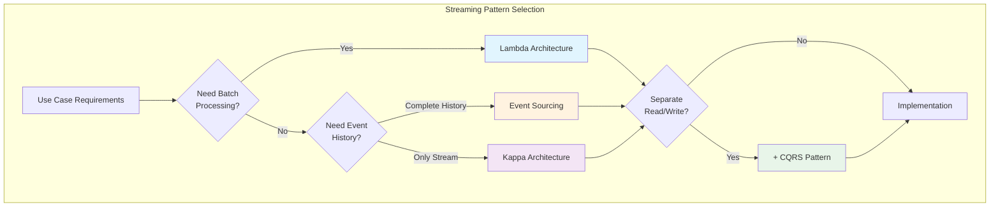

---

## Pattern Catalog

### Lambda Architecture


**Dual-layer architecture combining batch and stream processing for comprehensive analytics.**

**Key Components:**
- **Batch Layer**: Historical data processing with high accuracy
- **Speed Layer**: Real-time stream processing for low latency
- **Serving Layer**: Unified query interface merging both views

**When to Use:**
- Need both real-time and historical analytics
- Require different processing SLAs for different data
- Complex transformations benefit from batch processing
- Can tolerate some data duplication between layers

**Azure Implementation:**
- Batch: Synapse Spark Pools + Delta Lake
- Speed: Stream Analytics + Event Hubs
- Serving: Synapse SQL Pools + Power BI

[View Detailed Guide →](lambda-architecture.md)

---

### Kappa Architecture


**Stream-first architecture that processes all data as continuous, infinite streams.**

**Key Components:**
- **Stream Processing Layer**: Single processing paradigm for all data
- **Storage Layer**: Immutable event log with replay capability
- **Serving Layer**: Materialized views derived from streams

**When to Use:**
- All processing can be expressed as stream operations
- Want to avoid maintaining separate batch/stream code
- Need to reprocess data by replaying event log
- Simpler architecture is preferred over Lambda

**Azure Implementation:**
- Streaming: Event Hubs + Databricks Structured Streaming
- Storage: Event Hubs Capture + Data Lake
- Serving: Cosmos DB + Synapse Link

[View Detailed Guide →](kappa-architecture.md)

---

### Event Sourcing


**Store all changes to application state as an immutable sequence of events.**

**Key Components:**
- **Event Store**: Append-only log of all state changes
- **Event Processors**: Reconstruct current state from event history
- **Read Models**: Materialized views for efficient querying
- **Event Replay**: Ability to rebuild state from events

**When to Use:**
- Need complete audit trail of all changes
- Temporal queries (state at any point in time)
- Event-driven microservices architecture
- Regulatory compliance requirements
- Complex business logic with state transitions

**Azure Implementation:**
- Event Store: Event Hubs + Cosmos DB
- Processors: Azure Functions + Durable Functions
- Read Models: Cosmos DB + Synapse Analytics

[View Detailed Guide →](event-sourcing.md)

---

### CQRS Pattern


**Command Query Responsibility Segregation - separate read and write data models.**

**Key Components:**
- **Command Side**: Optimized for write operations and business logic
- **Query Side**: Optimized for read operations and reporting
- **Event Bus**: Synchronizes changes between command and query sides
- **Read Models**: Denormalized views for efficient queries

**When to Use:**
- Read and write workloads have different patterns
- Need to optimize queries independently from writes
- Complex business logic on write side
- High scalability requirements
- Often combined with Event Sourcing

**Azure Implementation:**
- Commands: Cosmos DB (transactional) + Azure Functions
- Queries: Synapse SQL Pools + Cosmos DB (analytical)
- Event Bus: Event Grid + Event Hubs
- Sync: Change Feed + Stream Analytics

[View Detailed Guide →](cqrs-pattern.md)

---

## Pattern Comparison Matrix

| Pattern | Latency | Complexity | Consistency | Scalability | Use Case Fit |
|---------|---------|------------|-------------|-------------|--------------|
| **Lambda** | Mixed (ms-minutes) | High | Eventual | Very High | Real-time + Historical |
| **Kappa** | Low (ms-seconds) | Medium | Eventual | High | Stream-first |
| **Event Sourcing** | Low (ms) | High | Strong | High | Audit & Temporal |
| **CQRS** | Low-Medium | High | Eventual/Strong | Very High | Read/Write Optimization |

### Detailed Comparison

#### Data Processing Model

| Pattern | Batch Processing | Stream Processing | Event History |
|---------|-----------------|-------------------|---------------|
| Lambda | ✅ Primary | ✅ Primary | ⚠️ Optional |
| Kappa | ❌ None | ✅ Only | ✅ Via Replay |
| Event Sourcing | ⚠️ Via Replay | ✅ Primary | ✅ Complete |
| CQRS | ⚠️ Optional | ✅ Sync | ⚠️ Optional |

#### Implementation Characteristics

| Pattern | Code Complexity | Operational Overhead | Learning Curve | Tooling Maturity |
|---------|----------------|---------------------|----------------|------------------|
| Lambda | High (2 systems) | High | Steep | Mature |
| Kappa | Medium | Medium | Moderate | Mature |
| Event Sourcing | High | Medium-High | Steep | Growing |
| CQRS | Very High | High | Very Steep | Moderate |

---

## Azure Service Mapping

### Core Streaming Services

| Service | Primary Use | Pattern Fit | Key Features |
|---------|-------------|-------------|--------------|
| **Event Hubs** | Event ingestion | All patterns | High throughput, partitioning, capture |
| **Stream Analytics** | Real-time processing | Lambda, Kappa | SQL-based, windowing, built-in ML |
| **Databricks** | Advanced streaming | Kappa, Lambda | Structured Streaming, Delta Lake |
| **Event Grid** | Event routing | CQRS, Event Sourcing | Pub/sub, filtering, webhooks |
| **Cosmos DB** | Event store/serving | Event Sourcing, CQRS | Multi-model, global distribution |

### Supporting Services

| Service | Role | Pattern Support |
|---------|------|----------------|
| **Azure Functions** | Event processing | Event Sourcing, CQRS |
| **Synapse Spark** | Batch processing | Lambda |
| **Synapse SQL** | Serving layer | Lambda, CQRS |
| **Data Lake Gen2** | Long-term storage | All patterns |
| **Service Bus** | Reliable messaging | CQRS, Event Sourcing |

---

## Pattern Selection Guide

### By Business Requirements

#### Real-time Analytics with Historical Context
**Recommended: Lambda Architecture**

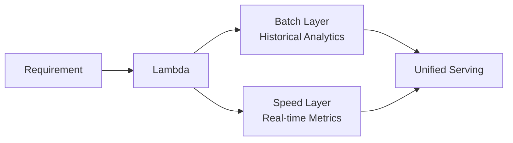

**Use When:**
- Dashboards need both real-time and historical data
- Complex batch computations (ML models, aggregations)
- Different SLAs for real-time vs batch queries

---

#### Pure Stream Processing
**Recommended: Kappa Architecture**

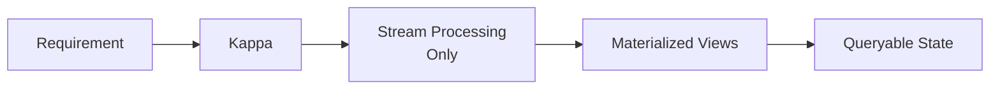

**Use When:**
- All processing is stream-compatible
- Simplicity is priority
- Want to avoid maintaining dual systems
- Replay capability needed

---

#### Complete Audit Trail
**Recommended: Event Sourcing**

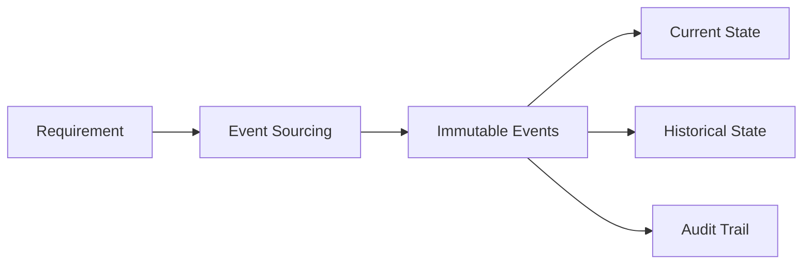

**Use When:**
- Regulatory compliance requires complete history
- Need temporal queries (state at point in time)
- Event-driven microservices
- Complex state transitions

---

#### Performance Optimization
**Recommended: CQRS**

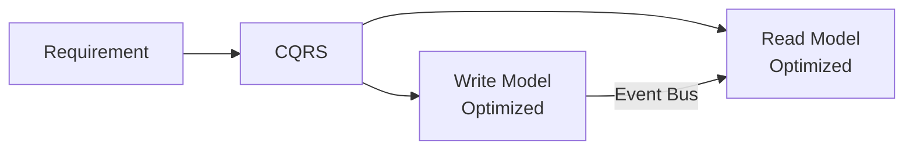

**Use When:**
- Read/write patterns very different
- High query performance critical
- Complex business logic on writes
- Independent scaling needed

---

## Implementation Patterns

### Combining Patterns

Patterns can be combined for enhanced capabilities:

#### Event Sourcing + CQRS

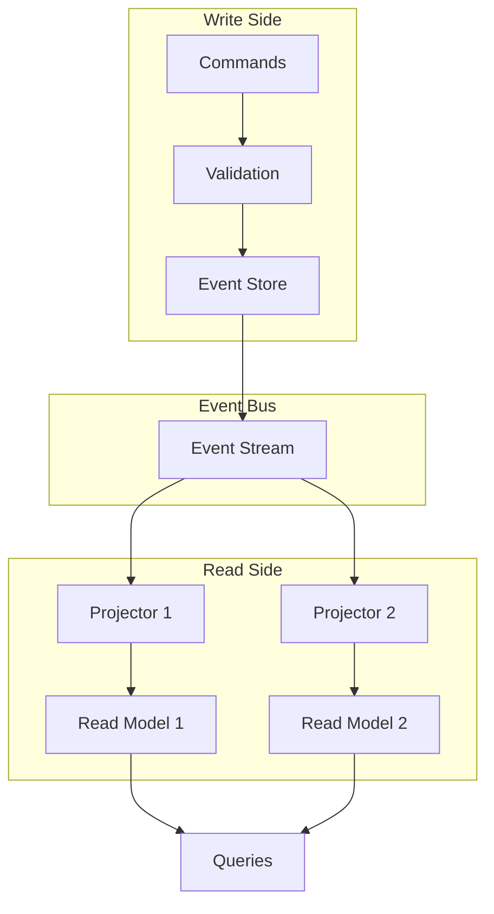

**Benefits:**
- Complete audit trail from Event Sourcing
- Optimized read models from CQRS
- Independent scaling of read/write
- Multiple specialized read models

**Challenges:**
- Highest complexity of any combination
- Eventually consistent reads
- Operational overhead

---

#### Lambda + CQRS

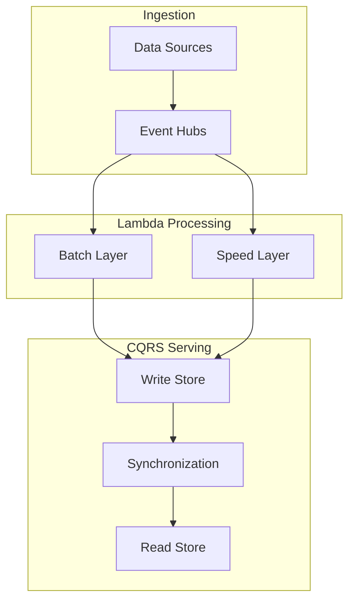

**Benefits:**
- Real-time and batch processing
- Optimized query performance
- Separation of concerns

**Challenges:**
- Complex architecture
- Multiple sync points
- Operational complexity

---

## Performance Considerations

### Latency Requirements

| Pattern | Typical Latency | Throughput | Best For |
|---------|----------------|------------|----------|
| Lambda Speed | < 100ms | Very High | Real-time alerts |
| Lambda Batch | Minutes-Hours | Extremely High | Historical analysis |
| Kappa | < 1s | High | Near real-time |
| Event Sourcing | < 10ms | Medium-High | Transaction processing |
| CQRS Writes | < 10ms | Medium-High | Transactional |
| CQRS Reads | < 100ms | Very High | Analytics queries |

### Scalability Patterns

#### Horizontal Scaling

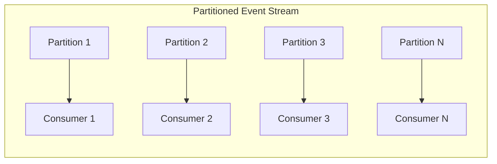

**Best Practices:**
- Use Event Hubs partitions for parallelism
- Partition by key for related events
- Scale consumers to match partitions
- Monitor partition lag

#### Vertical Scaling

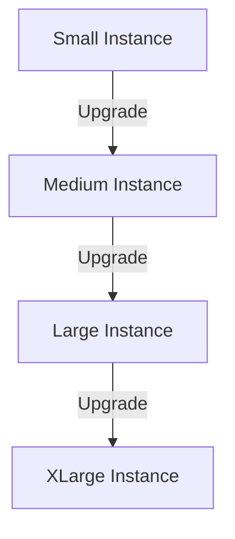

**Best Practices:**
- Start small, measure, then scale
- Use auto-scaling for variable workloads
- Consider cost vs performance tradeoffs

---

## Cost Optimization

### Cost Drivers by Pattern

| Pattern | Primary Costs | Optimization Strategies |
|---------|--------------|------------------------|
| **Lambda** | Compute (2 systems), Storage | Auto-pause Spark, optimize batch schedules |
| **Kappa** | Streaming compute, Event Hub | Right-size throughput units, retention |
| **Event Sourcing** | Storage (events), Cosmos DB | Event archival, compact snapshots |
| **CQRS** | Dual storage, Sync overhead | Selective projections, eventual consistency |

### Cost Optimization Strategies

#### Event Hubs Optimization

```python
# Configure appropriate retention and throughput
event_hub_config = {
    "partition_count": 4,  # Match expected parallelism
    "message_retention_days": 1,  # Minimize unless replay needed
    "throughput_units": 2,  # Auto-inflate for spikes
    "enable_auto_inflate": True,
    "maximum_throughput_units": 10
}
```

#### Spark Pool Optimization

```python
# Configure auto-pause and right-size nodes
spark_pool_config = {
    "node_size": "Medium",  # Start small
    "min_nodes": 3,
    "max_nodes": 10,
    "auto_pause_minutes": 15,  # Pause when idle
    "auto_scale_enabled": True
}
```

#### Cosmos DB Optimization

```python
# Use appropriate consistency and TTL
cosmos_config = {
    "consistency_level": "Session",  # Balance performance/cost
    "time_to_live": 86400 * 30,  # 30 days, not forever
    "indexing_mode": "Lazy",  # For write-heavy workloads
    "partition_key": "/deviceId"  # Distribute load
}
```

---

## Security Patterns

### Authentication & Authorization

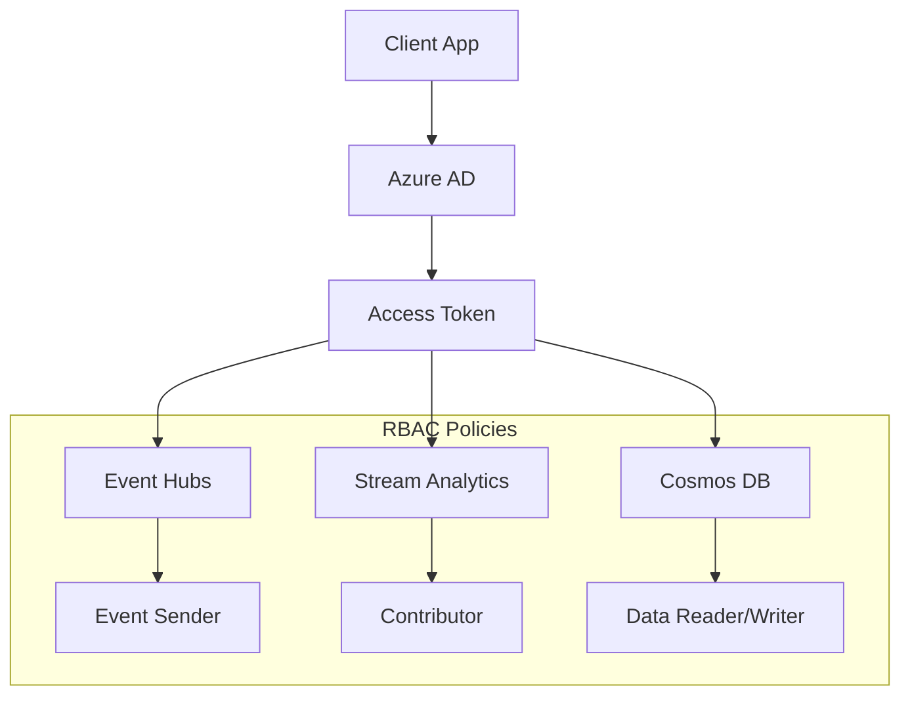

### Data Protection

| Pattern | Encryption at Rest | Encryption in Transit | Key Management |
|---------|-------------------|----------------------|----------------|
| All | Azure Storage Service Encryption | TLS 1.2+ | Azure Key Vault |
| Event Sourcing | Cosmos DB encryption | HTTPS only | Customer-managed keys |
| CQRS | Multi-store encryption | Private endpoints | Separate keys per store |

### Network Security

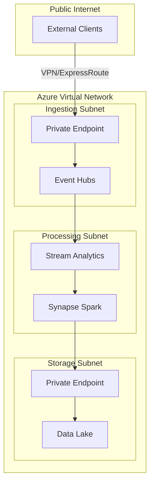

---

## Monitoring & Observability

### Key Metrics by Pattern

#### Lambda Architecture Metrics

```python
lambda_metrics = {
    "batch_layer": [
        "batch_job_duration",
        "batch_job_success_rate",
        "data_freshness_hours"
    ],
    "speed_layer": [
        "stream_lag_seconds",
        "events_per_second",
        "processing_latency_ms"
    ],
    "serving_layer": [
        "query_latency_ms",
        "cache_hit_rate",
        "merge_conflicts"
    ]
}
```

#### Kappa Architecture Metrics

```python
kappa_metrics = {
    "streaming": [
        "checkpoint_interval",
        "replay_lag",
        "backpressure_indicator"
    ],
    "state_store": [
        "state_size_bytes",
        "compaction_rate",
        "read_write_ratio"
    ]
}
```

#### Event Sourcing Metrics

```python
event_sourcing_metrics = {
    "event_store": [
        "event_write_rate",
        "storage_growth_rate",
        "event_stream_lag"
    ],
    "projections": [
        "projection_lag_seconds",
        "rebuild_duration",
        "snapshot_frequency"
    ]
}
```

#### CQRS Metrics

```python
cqrs_metrics = {
    "command_side": [
        "command_processing_time",
        "validation_failures",
        "event_publication_lag"
    ],
    "query_side": [
        "read_model_staleness",
        "query_performance",
        "synchronization_lag"
    ]
}
```

### Monitoring Dashboard Example

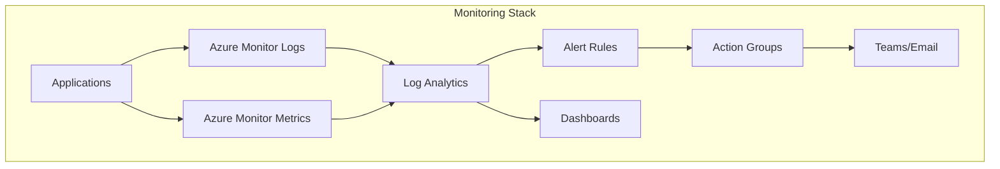

---

## Getting Started

### Quick Start by Pattern

#### 1. Lambda Architecture
```bash
# Deploy Lambda architecture starter template
az deployment group create \
  --resource-group rg-streaming \
  --template-file lambda-template.json \
  --parameters environment=dev
```

#### 2. Kappa Architecture
```bash
# Deploy Kappa architecture starter template
az deployment group create \
  --resource-group rg-streaming \
  --template-file kappa-template.json \
  --parameters environment=dev
```

#### 3. Event Sourcing
```bash
# Deploy Event Sourcing infrastructure
az deployment group create \
  --resource-group rg-streaming \
  --template-file event-sourcing-template.json \
  --parameters environment=dev
```

#### 4. CQRS
```bash
# Deploy CQRS infrastructure
az deployment group create \
  --resource-group rg-streaming \
  --template-file cqrs-template.json \
  --parameters environment=dev
```

---

## Learning Path

### Beginner Path

1. **Start with Kappa** - Simplest streaming pattern
2. **Read**: [Kappa Architecture Guide](kappa-architecture.md)
3. **Implement**: Simple event processing pipeline
4. **Monitor**: Set up basic metrics and alerts

### Intermediate Path

1. **Understand Lambda** - Add batch processing capability
2. **Read**: [Lambda Architecture Guide](lambda-architecture.md)
3. **Implement**: Hybrid batch/stream pipeline
4. **Optimize**: Performance tuning and cost optimization

### Advanced Path

1. **Master Event Sourcing** - Complete event history
2. **Read**: [Event Sourcing Guide](event-sourcing.md)
3. **Combine with CQRS** - Optimized read/write models
4. **Read**: [CQRS Pattern Guide](cqrs-pattern.md)
5. **Implement**: Full event-driven architecture

---

## Additional Resources

### Documentation
- [Lambda Architecture Detailed Guide](lambda-architecture.md)
- [Kappa Architecture Detailed Guide](kappa-architecture.md)
- [Event Sourcing Detailed Guide](event-sourcing.md)
- [CQRS Pattern Detailed Guide](cqrs-pattern.md)
- [Time Series Analytics](time-series-analytics.md)

### Azure Services
- [Azure Event Hubs Documentation](https://docs.microsoft.com/azure/event-hubs/)
- [Azure Stream Analytics Documentation](https://docs.microsoft.com/azure/stream-analytics/)
- [Azure Databricks Structured Streaming](https://docs.microsoft.com/azure/databricks/structured-streaming/)
- [Azure Cosmos DB Change Feed](https://docs.microsoft.com/azure/cosmos-db/change-feed)

### Best Practices
- [Cost Optimization Guide](../../05-best-practices/cross-cutting-concerns/cost-optimization/README.md)
- [Security Best Practices](../../05-best-practices/cross-cutting-concerns/security/README.md)
- [Performance Optimization](../../05-best-practices/cross-cutting-concerns/performance/README.md)

### Code Examples
- Implementation examples are provided throughout each architecture pattern guide
- [Azure Samples Repository](https://github.com/Azure-Samples/)

---

**Last Updated**: 2025-01-28
**Pattern Count**: 4
**Maturity**: Production Ready
