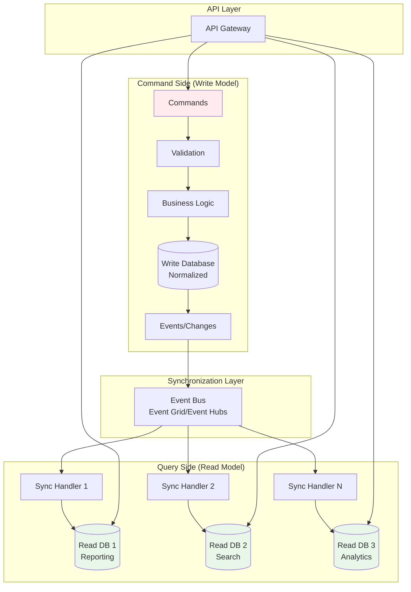
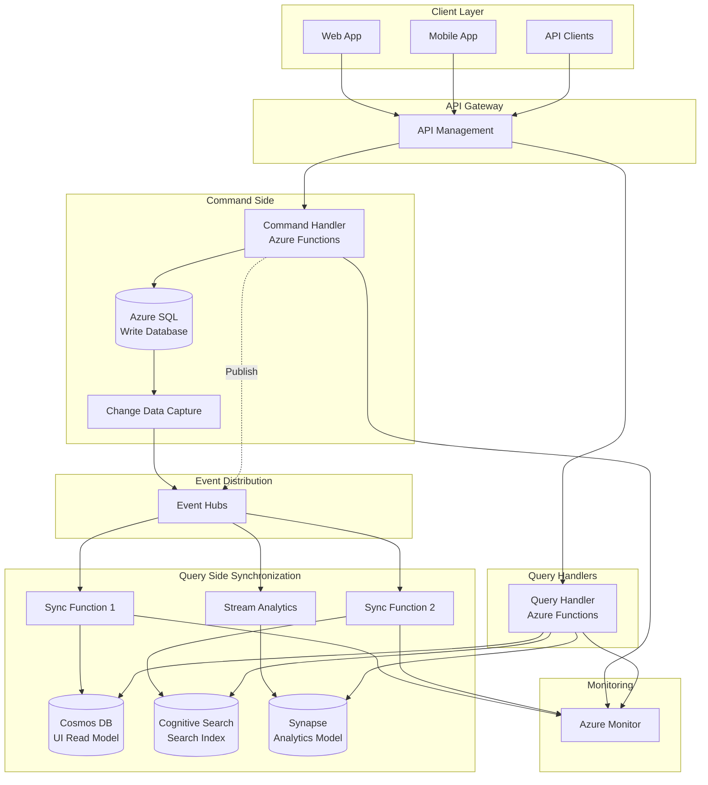

# CQRS (Command Query Responsibility Segregation) Pattern

> **🏠 [Home](../../../README.md)** | **📖 [Architecture Patterns](../README.md)** | **⚡ [Streaming Architectures](README.md)** | **CQRS Pattern**


Separate read and write data models to optimize performance, scalability, and security by treating queries and commands as fundamentally different operations.

---

## Table of Contents

- [Overview](#overview)
- [Core Concepts](#core-concepts)
- [Architecture Components](#architecture-components)
- [Azure Implementation](#azure-implementation)
- [Implementation Patterns](#implementation-patterns)
- [Code Examples](#code-examples)
- [Best Practices](#best-practices)
- [Common Challenges](#common-challenges)
- [Performance Optimization](#performance-optimization)
- [Security Considerations](#security-considerations)
- [Monitoring and Operations](#monitoring-and-operations)

---

## Overview

Command Query Responsibility Segregation (CQRS) is an architectural pattern that separates the read and write operations of a data store. Commands handle updates and are responsible for business logic, while queries handle data retrieval and are optimized for specific read scenarios.

### Key Principles

**Separation of Concerns**: Commands and queries use different models and potentially different data stores.

**Optimized Operations**: Read models optimized for queries, write models optimized for updates.

**Eventual Consistency**: Acceptable lag between write and read models.

**Scalability**: Independent scaling of read and write workloads.

### When to Use CQRS


**✅ Ideal For:**

- Applications with vastly different read and write patterns
- High-performance read requirements
- Complex business logic on the write side
- Multiple read model representations needed
- Independent scaling of reads and writes
- Systems where reads vastly outnumber writes

**❌ Not Ideal For:**

- Simple CRUD applications
- Applications where reads and writes are similar
- Systems requiring strong consistency
- Teams unfamiliar with eventual consistency
- Small-scale applications

### Architecture Diagram



---

## Core Concepts

### Commands

**Definition**: Requests to perform actions that change system state.

**Characteristics:**

- **Intent-revealing names**: PlaceOrder, CancelSubscription
- **Validation**: Business rule enforcement
- **Asynchronous**: Often processed asynchronously
- **Result**: Success/failure, not data
- **Side effects**: Change state, emit events

**Command Structure:**

```json
{
  "commandId": "cmd_123456",
  "commandType": "PlaceOrder",
  "timestamp": "2025-01-15T10:30:00Z",
  "userId": "user_456",
  "aggregateId": "order_789",
  "data": {
    "customerId": "cust_123",
    "items": [
      {
        "productId": "prod_001",
        "quantity": 2,
        "price": 29.99
      }
    ],
    "shippingAddress": {
      "street": "123 Main St",
      "city": "Seattle",
      "state": "WA",
      "zip": "98101"
    }
  },
  "metadata": {
    "correlationId": "corr_abc",
    "clientId": "web_app",
    "ipAddress": "192.168.1.100"
  }
}
```

### Queries

**Definition**: Requests to retrieve data without changing state.

**Characteristics:**

- **Idempotent**: No side effects
- **Optimized**: Denormalized for performance
- **Multiple models**: Different views for different needs
- **Fast**: Pre-computed aggregations
- **Eventually consistent**: May lag behind writes

**Query Structure:**

```json
{
  "queryId": "qry_123456",
  "queryType": "GetOrderDetails",
  "timestamp": "2025-01-15T10:35:00Z",
  "userId": "user_456",
  "parameters": {
    "orderId": "order_789",
    "includeHistory": true,
    "includeTracking": true
  }
}
```

### Write Model

**Purpose**: Enforce business rules and maintain consistency.

**Characteristics:**

- Normalized schema
- Transactional integrity
- Business logic validation
- Event generation
- Audit trail

### Read Models

**Purpose**: Optimized data structures for specific query patterns.

**Types:**

- **Reporting Models**: Aggregated data for reports
- **Search Models**: Optimized for search queries
- **UI Models**: Denormalized for UI display
- **Analytics Models**: Dimensional models for analytics

---

## Architecture Components

### 1. Command Handlers

Process commands and update write model.

```python
from dataclasses import dataclass
from typing import List, Optional
from datetime import datetime
import uuid

@dataclass
class PlaceOrderCommand:
    order_id: str
    customer_id: str
    items: List[dict]
    shipping_address: dict
    user_id: str

class OrderCommandHandler:
    def __init__(self, write_db, event_publisher):
        self.write_db = write_db
        self.event_publisher = event_publisher

    async def handle(self, command: PlaceOrderCommand) -> dict:
        """Handle PlaceOrder command."""

        # Validate command
        await self._validate(command)

        # Create order in write database
        order = {
            "id": command.order_id,
            "customer_id": command.customer_id,
            "status": "pending",
            "items": command.items,
            "shipping_address": command.shipping_address,
            "created_at": datetime.utcnow().isoformat(),
            "created_by": command.user_id,
            "total_amount": sum(
                item["price"] * item["quantity"]
                for item in command.items
            )
        }

        # Save to write database
        await self.write_db.create_order(order)

        # Publish event for read model synchronization
        event = {
            "eventId": str(uuid.uuid4()),
            "eventType": "OrderPlaced",
            "aggregateId": command.order_id,
            "timestamp": datetime.utcnow().isoformat(),
            "data": order
        }

        await self.event_publisher.publish("order-events", event)

        return {
            "orderId": command.order_id,
            "status": "accepted"
        }

    async def _validate(self, command: PlaceOrderCommand):
        """Validate business rules."""

        # Validate customer exists
        customer = await self.write_db.get_customer(command.customer_id)
        if not customer:
            raise ValueError(f"Customer {command.customer_id} not found")

        # Validate items in stock
        for item in command.items:
            stock = await self.write_db.get_stock(item["productId"])
            if stock < item["quantity"]:
                raise ValueError(
                    f"Insufficient stock for product {item['productId']}"
                )

        # Validate customer credit
        if customer["credit_limit"] < sum(
            item["price"] * item["quantity"]
            for item in command.items
        ):
            raise ValueError("Customer credit limit exceeded")
```

### 2. Query Handlers

Retrieve data from read models.

```python
from azure.cosmos import CosmosClient
from typing import List, Optional

class OrderQueryHandler:
    def __init__(self, read_db_connection: str):
        self.client = CosmosClient.from_connection_string(
            read_db_connection
        )
        self.container = self.client.get_database_client(
            "CQRSDB"
        ).get_container_client("order_read_model")

    async def get_order_details(
        self,
        order_id: str,
        include_history: bool = False
    ) -> dict:
        """Get order details from read model."""

        # Query optimized read model
        query = """
            SELECT
                o.id,
                o.customer_name,
                o.customer_email,
                o.status,
                o.items,
                o.total_amount,
                o.shipping_address,
                o.tracking_number,
                o.placed_at,
                o.shipped_at
            FROM orders o
            WHERE o.id = @orderId
        """

        parameters = [{"name": "@orderId", "value": order_id}]

        results = list(self.container.query_items(
            query=query,
            parameters=parameters,
            partition_key=order_id
        ))

        if not results:
            raise ValueError(f"Order {order_id} not found")

        order = results[0]

        # Include history if requested
        if include_history:
            order["history"] = await self._get_order_history(order_id)

        return order

    async def get_customer_orders(
        self,
        customer_id: str,
        status: Optional[str] = None,
        limit: int = 10
    ) -> List[dict]:
        """Get customer's orders from read model."""

        query = """
            SELECT
                o.id,
                o.status,
                o.total_amount,
                o.placed_at
            FROM orders o
            WHERE o.customer_id = @customerId
        """

        parameters = [{"name": "@customerId", "value": customer_id}]

        if status:
            query += " AND o.status = @status"
            parameters.append({"name": "@status", "value": status})

        query += " ORDER BY o.placed_at DESC"
        query += f" OFFSET 0 LIMIT {limit}"

        results = list(self.container.query_items(
            query=query,
            parameters=parameters,
            partition_key=customer_id
        ))

        return results

    async def search_orders(
        self,
        search_term: str,
        filters: Optional[dict] = None
    ) -> List[dict]:
        """Search orders using search-optimized read model."""

        # Query search index (e.g., Azure Cognitive Search)
        # This is a simplified example
        query = """
            SELECT
                o.id,
                o.customer_name,
                o.status,
                o.total_amount,
                o.placed_at
            FROM orders o
            WHERE CONTAINS(o.customer_name, @searchTerm)
               OR CONTAINS(o.id, @searchTerm)
        """

        parameters = [{"name": "@searchTerm", "value": search_term}]

        results = list(self.container.query_items(
            query=query,
            parameters=parameters
        ))

        return results
```

### 3. Synchronization Handlers

Keep read models synchronized with write model.

```python
from azure.eventhub import EventHubConsumerClient
from azure.cosmos import CosmosClient
import json

class OrderReadModelSynchronizer:
    def __init__(
        self,
        event_hub_connection: str,
        read_db_connection: str
    ):
        self.consumer = EventHubConsumerClient.from_connection_string(
            event_hub_connection,
            consumer_group="order_read_model",
            eventhub_name="order-events"
        )

        self.cosmos = CosmosClient.from_connection_string(
            read_db_connection
        )
        self.container = self.cosmos.get_database_client(
            "CQRSDB"
        ).get_container_client("order_read_model")

    async def start(self):
        """Start synchronizing read model."""
        await self.consumer.receive(
            on_event=self._process_event,
            on_error=self._on_error
        )

    async def _process_event(self, partition_context, event):
        """Process event and update read model."""

        event_data = json.loads(event.body_as_str())
        event_type = event_data["eventType"]

        handlers = {
            "OrderPlaced": self._handle_order_placed,
            "OrderShipped": self._handle_order_shipped,
            "OrderCancelled": self._handle_order_cancelled,
            "OrderDelivered": self._handle_order_delivered
        }

        handler = handlers.get(event_type)
        if handler:
            await handler(event_data)

        # Update checkpoint
        await partition_context.update_checkpoint(event)

    async def _handle_order_placed(self, event_data: dict):
        """Handle OrderPlaced event - create read model."""

        data = event_data["data"]

        # Enrich with customer data (denormalization)
        customer = await self._get_customer_data(data["customer_id"])

        # Create denormalized read model
        read_model = {
            "id": data["id"],
            "order_id": data["id"],
            "customer_id": data["customer_id"],
            "customer_name": customer["name"],
            "customer_email": customer["email"],
            "customer_phone": customer["phone"],
            "status": data["status"],
            "items": data["items"],
            "item_count": len(data["items"]),
            "total_amount": data["total_amount"],
            "shipping_address": data["shipping_address"],
            "placed_at": event_data["timestamp"],
            "last_updated": event_data["timestamp"]
        }

        await self.container.upsert_item(body=read_model)

    async def _handle_order_shipped(self, event_data: dict):
        """Handle OrderShipped event - update read model."""

        data = event_data["data"]
        order_id = data["order_id"]

        # Read current model
        order = await self.container.read_item(
            item=order_id,
            partition_key=order_id
        )

        # Update fields
        order["status"] = "shipped"
        order["shipped_at"] = event_data["timestamp"]
        order["tracking_number"] = data["tracking_number"]
        order["last_updated"] = event_data["timestamp"]

        # Write updated model
        await self.container.upsert_item(body=order)

    async def _handle_order_cancelled(self, event_data: dict):
        """Handle OrderCancelled event - update read model."""

        data = event_data["data"]
        order_id = data["order_id"]

        # Read current model
        order = await self.container.read_item(
            item=order_id,
            partition_key=order_id
        )

        # Update fields
        order["status"] = "cancelled"
        order["cancellation_reason"] = data.get("reason")
        order["cancelled_at"] = event_data["timestamp"]
        order["last_updated"] = event_data["timestamp"]

        # Write updated model
        await self.container.upsert_item(body=order)

    async def _get_customer_data(self, customer_id: str) -> dict:
        """Fetch customer data for denormalization."""
        # Implementation would query customer service/database
        pass

    async def _on_error(self, partition_context, error):
        """Handle errors in event processing."""
        print(f"Error processing events: {error}")
```

---

## Azure Implementation

### Azure Service Mapping

| Component | Azure Service | Purpose |
|-----------|---------------|---------|
| **Write Database** | Azure SQL / Cosmos DB | Transactional write operations |
| **Read Databases** | Cosmos DB / Azure SQL / Cognitive Search | Optimized read models |
| **Event Bus** | Event Hubs / Event Grid | Event distribution |
| **Command Handlers** | Azure Functions / App Service | Process commands |
| **Query Handlers** | Azure Functions / App Service | Handle queries |
| **Sync Handlers** | Azure Functions / Stream Analytics | Synchronize read models |
| **API Gateway** | API Management | Unified API entry point |

### Reference Architecture



### Deployment Template

```bicep
// CQRS Infrastructure - Bicep Template

param location string = resourceGroup().location
param environmentName string = 'dev'

// Write Database - Azure SQL
resource sqlServer 'Microsoft.Sql/servers@2022-05-01-preview' = {
  name: 'sql-cqrs-write-${environmentName}'
  location: location
  properties: {
    administratorLogin: 'sqladmin'
    administratorLoginPassword: '${uniqueString(resourceGroup().id)}!Aa1'
    version: '12.0'
  }
}

resource writeDatabase 'Microsoft.Sql/servers/databases@2022-05-01-preview' = {
  parent: sqlServer
  name: 'OrderWriteDB'
  location: location
  sku: {
    name: 'S0'
    tier: 'Standard'
  }
}

// Read Database - Cosmos DB
resource cosmosAccount 'Microsoft.DocumentDB/databaseAccounts@2023-04-15' = {
  name: 'cosmos-cqrs-read-${environmentName}'
  location: location
  kind: 'GlobalDocumentDB'
  properties: {
    databaseAccountOfferType: 'Standard'
    consistencyPolicy: {
      defaultConsistencyLevel: 'Session'
    }
    locations: [
      {
        locationName: location
        failoverPriority: 0
      }
    ]
  }
}

resource readDatabase 'Microsoft.DocumentDB/databaseAccounts/sqlDatabases@2023-04-15' = {
  parent: cosmosAccount
  name: 'CQRSDB'
  properties: {
    resource: {
      id: 'CQRSDB'
    }
  }
}

resource readModelContainer 'Microsoft.DocumentDB/databaseAccounts/sqlDatabases/containers@2023-04-15' = {
  parent: readDatabase
  name: 'order_read_model'
  properties: {
    resource: {
      id: 'order_read_model'
      partitionKey: {
        paths: ['/id']
        kind: 'Hash'
      }
    }
  }
}

// Event Hubs for event distribution
resource eventHubNamespace 'Microsoft.EventHub/namespaces@2022-10-01-preview' = {
  name: 'ehns-cqrs-${environmentName}'
  location: location
  sku: {
    name: 'Standard'
    tier: 'Standard'
    capacity: 1
  }
}

resource eventHub 'Microsoft.EventHub/namespaces/eventhubs@2022-10-01-preview' = {
  parent: eventHubNamespace
  name: 'order-events'
  properties: {
    messageRetentionInDays: 7
    partitionCount: 4
  }
}

// Azure Functions for command handlers
resource commandFunctionApp 'Microsoft.Web/sites@2022-09-01' = {
  name: 'func-commands-${environmentName}'
  location: location
  kind: 'functionapp'
  properties: {
    serverFarmId: commandAppServicePlan.id
    siteConfig: {
      appSettings: [
        {
          name: 'FUNCTIONS_WORKER_RUNTIME'
          value: 'python'
        }
        {
          name: 'WriteDB__ConnectionString'
          value: 'Server=tcp:${sqlServer.properties.fullyQualifiedDomainName},1433;Database=${writeDatabase.name};'
        }
        {
          name: 'EventHub__ConnectionString'
          value: listKeys(eventHub.id, eventHub.apiVersion).primaryConnectionString
        }
      ]
    }
  }
}

resource commandAppServicePlan 'Microsoft.Web/serverfarms@2022-09-01' = {
  name: 'asp-commands-${environmentName}'
  location: location
  sku: {
    name: 'Y1'
    tier: 'Dynamic'
  }
}

// Azure Functions for query handlers
resource queryFunctionApp 'Microsoft.Web/sites@2022-09-01' = {
  name: 'func-queries-${environmentName}'
  location: location
  kind: 'functionapp'
  properties: {
    serverFarmId: queryAppServicePlan.id
    siteConfig: {
      appSettings: [
        {
          name: 'FUNCTIONS_WORKER_RUNTIME'
          value: 'python'
        }
        {
          name: 'ReadDB__ConnectionString'
          value: cosmosAccount.listConnectionStrings().connectionStrings[0].connectionString
        }
      ]
    }
  }
}

resource queryAppServicePlan 'Microsoft.Web/serverfarms@2022-09-01' = {
  name: 'asp-queries-${environmentName}'
  location: location
  sku: {
    name: 'Y1'
    tier: 'Dynamic'
  }
}

output writeDbEndpoint string = sqlServer.properties.fullyQualifiedDomainName
output readDbEndpoint string = cosmosAccount.properties.documentEndpoint
output eventHubNamespace string = eventHubNamespace.name
```

---

## Implementation Patterns

### Pattern 1: Simple CQRS

**Use Case**: Basic read/write separation with eventual consistency.

```python
# Simple command handler
class SimpleCommandHandler:
    def __init__(self, write_db, event_bus):
        self.write_db = write_db
        self.event_bus = event_bus

    async def create_order(self, command: dict) -> str:
        # Write to database
        order_id = await self.write_db.insert_order(command)

        # Publish event
        await self.event_bus.publish({
            "type": "OrderCreated",
            "orderId": order_id,
            "data": command
        })

        return order_id

# Simple query handler
class SimpleQueryHandler:
    def __init__(self, read_db):
        self.read_db = read_db

    async def get_order(self, order_id: str) -> dict:
        return await self.read_db.get_order(order_id)
```

### Pattern 2: CQRS with Event Sourcing

**Use Case**: Complete audit trail with optimized read models.

**See Also**: [Event Sourcing Pattern](event-sourcing.md)

```python
class EventSourcedCQRS:
    def __init__(self, event_store, read_model):
        self.event_store = event_store
        self.read_model = read_model

    async def handle_command(self, command: dict):
        # Load aggregate from event store
        events = await self.event_store.get_events(
            command["aggregateId"]
        )

        # Reconstruct state
        aggregate = self._rebuild_from_events(events)

        # Execute command
        new_events = aggregate.execute(command)

        # Store new events
        await self.event_store.append_events(new_events)

        # Events automatically sync to read models via event bus

    async def query(self, query: dict):
        # Query optimized read model
        return await self.read_model.query(query)
```

### Pattern 3: Multi-Model CQRS

**Use Case**: Multiple specialized read models for different use cases.

```python
class MultiModelCQRS:
    def __init__(
        self,
        write_db,
        ui_read_model,
        search_index,
        analytics_db,
        event_bus
    ):
        self.write_db = write_db
        self.ui_read_model = ui_read_model
        self.search_index = search_index
        self.analytics_db = analytics_db
        self.event_bus = event_bus

    async def handle_command(self, command: dict):
        # Update write model
        result = await self.write_db.execute(command)

        # Publish event to sync all read models
        await self.event_bus.publish({
            "type": command["type"],
            "data": result
        })

        return result

    async def query_ui(self, query: dict):
        """Query for UI - fast, denormalized."""
        return await self.ui_read_model.query(query)

    async def search(self, search_term: str):
        """Full-text search."""
        return await self.search_index.search(search_term)

    async def analytics_query(self, query: dict):
        """Complex analytics query."""
        return await self.analytics_db.query(query)
```

---

## Code Examples

### Complete CQRS Implementation

```python
# main.py - Complete CQRS example
from azure.functions import HttpRequest, HttpResponse
from azure.cosmos import CosmosClient
from azure.eventhub import EventHubProducerClient, EventData
import pyodbc
import json
import os

# Initialize clients
write_db_conn = pyodbc.connect(
    os.environ["WriteDB__ConnectionString"]
)

read_db_client = CosmosClient.from_connection_string(
    os.environ["ReadDB__ConnectionString"]
)
read_container = read_db_client.get_database_client(
    "CQRSDB"
).get_container_client("order_read_model")

event_hub_client = EventHubProducerClient.from_connection_string(
    os.environ["EventHub__ConnectionString"],
    eventhub_name="order-events"
)

# Command endpoint
async def handle_command(req: HttpRequest) -> HttpResponse:
    """Handle order command (write operation)."""

    try:
        command = req.get_json()
        command_type = command.get("type")

        if command_type == "PlaceOrder":
            result = await place_order(command)
        elif command_type == "CancelOrder":
            result = await cancel_order(command)
        else:
            return HttpResponse(
                json.dumps({"error": "Unknown command type"}),
                status_code=400
            )

        return HttpResponse(
            json.dumps(result),
            mimetype="application/json",
            status_code=202
        )

    except Exception as e:
        return HttpResponse(
            json.dumps({"error": str(e)}),
            status_code=500
        )

async def place_order(command: dict) -> dict:
    """Place order - write to write database and publish event."""

    cursor = write_db_conn.cursor()

    # Insert into write database (normalized)
    cursor.execute("""
        INSERT INTO Orders (OrderId, CustomerId, Status, CreatedAt)
        VALUES (?, ?, ?, GETDATE())
    """, (
        command["orderId"],
        command["customerId"],
        "pending"
    ))

    for item in command["items"]:
        cursor.execute("""
            INSERT INTO OrderItems (OrderId, ProductId, Quantity, Price)
            VALUES (?, ?, ?, ?)
        """, (
            command["orderId"],
            item["productId"],
            item["quantity"],
            item["price"]
        ))

    write_db_conn.commit()

    # Publish event for read model sync
    event = {
        "eventType": "OrderPlaced",
        "orderId": command["orderId"],
        "data": command
    }

    event_data = EventData(json.dumps(event))
    await event_hub_client.send_batch([event_data])

    return {
        "orderId": command["orderId"],
        "status": "accepted"
    }

# Query endpoint
async def handle_query(req: HttpRequest) -> HttpResponse:
    """Handle order query (read operation)."""

    try:
        order_id = req.params.get("orderId")

        if not order_id:
            return HttpResponse(
                json.dumps({"error": "orderId required"}),
                status_code=400
            )

        # Query read model (denormalized, optimized)
        order = await read_container.read_item(
            item=order_id,
            partition_key=order_id
        )

        return HttpResponse(
            json.dumps(order),
            mimetype="application/json"
        )

    except Exception as e:
        return HttpResponse(
            json.dumps({"error": str(e)}),
            status_code=404
        )

# Sync function (Event Hub trigger)
async def sync_read_model(events: List[EventData]):
    """Synchronize read model when events arrive."""

    for event in events:
        event_data = json.loads(event.body_as_str())
        event_type = event_data["eventType"]

        if event_type == "OrderPlaced":
            await sync_order_placed(event_data)
        elif event_type == "OrderCancelled":
            await sync_order_cancelled(event_data)

async def sync_order_placed(event_data: dict):
    """Sync OrderPlaced event to read model."""

    data = event_data["data"]

    # Create denormalized read model
    read_model = {
        "id": data["orderId"],
        "customerId": data["customerId"],
        "status": "pending",
        "items": data["items"],
        "totalAmount": sum(
            item["price"] * item["quantity"]
            for item in data["items"]
        ),
        "placedAt": event_data.get("timestamp")
    }

    await read_container.upsert_item(body=read_model)
```

---

## Best Practices

### 1. Command Design

**✅ Do:**

- Use task-based commands (PlaceOrder, not CreateOrder)
- Validate commands before execution
- Make commands idempotent when possible
- Include all necessary data in commands
- Use correlation IDs for tracking

**❌ Don't:**

- Return query data from commands
- Execute queries in command handlers
- Allow commands to fail silently
- Use generic command names

### 2. Query Design

**✅ Do:**

- Optimize read models for specific queries
- Denormalize data in read models
- Cache frequently accessed data
- Use appropriate indexes
- Handle stale data gracefully

**❌ Don't:**

- Query write database directly
- Normalize read models
- Expect strong consistency
- Ignore read model lag

### 3. Synchronization

**✅ Do:**

- Use event-driven synchronization
- Handle events idempotently
- Monitor sync lag
- Implement retry logic
- Log sync failures

**❌ Don't:**

- Use polling for synchronization
- Skip event ordering
- Ignore failed syncs
- Allow unbounded lag

---

## Common Challenges

### Challenge 1: Eventual Consistency

**Problem**: Read models lag behind writes.

**Solutions:**

1. **Embrace Eventual Consistency**: Design UI to handle stale data
2. **Optimistic UI Updates**: Update UI immediately, sync in background
3. **Polling**: Check for updates after commands
4. **WebSockets**: Push updates to clients

```python
# Optimistic UI pattern
async def place_order_with_optimistic_ui(command: dict) -> dict:
    # Return immediately with optimistic result
    optimistic_result = {
        "orderId": command["orderId"],
        "status": "pending",
        "estimatedSyncTime": 2  # seconds
    }

    # Process command asynchronously
    await event_bus.publish({
        "type": "PlaceOrder",
        "data": command
    })

    return optimistic_result
```

### Challenge 2: Read Model Rebuilding

**Problem**: Need to rebuild read models from scratch.

**Solution**: Implement replay capability

```python
class ReadModelRebuilder:
    def __init__(self, event_store, read_model):
        self.event_store = event_store
        self.read_model = read_model

    async def rebuild(self):
        """Rebuild read model from event store."""

        # Clear existing read model
        await self.read_model.clear()

        # Replay all events
        checkpoint = None
        while True:
            events = await self.event_store.get_events(
                from_checkpoint=checkpoint,
                limit=1000
            )

            if not events:
                break

            for event in events:
                await self.read_model.apply_event(event)

            checkpoint = events[-1]["id"]

        print(f"Rebuild complete. Processed {checkpoint} events")
```

### Challenge 3: Data Duplication

**Problem**: Same data stored in multiple places.

**Solutions:**

1. **Accept Duplication**: Storage is cheap, optimize for reads
2. **Selective Denormalization**: Only denormalize what's needed
3. **Event Sourcing**: Single source of truth (events)

---

## Performance Optimization

### Optimization Strategies

#### 1. Read Model Caching

```python
from azure.core.credentials import AzureKeyCredential
from azure.data.tables import TableServiceClient
import hashlib

class CachedQueryHandler:
    def __init__(self, read_db, cache_connection):
        self.read_db = read_db
        self.cache = TableServiceClient.from_connection_string(
            cache_connection
        ).get_table_client("query_cache")
        self.cache_ttl = 300  # 5 minutes

    async def query(self, query: dict) -> dict:
        """Query with caching."""

        # Generate cache key
        cache_key = hashlib.md5(
            json.dumps(query, sort_keys=True).encode()
        ).hexdigest()

        # Try cache
        try:
            cached = self.cache.get_entity(
                partition_key="query",
                row_key=cache_key
            )

            # Check TTL
            if self._is_fresh(cached):
                return json.loads(cached["data"])
        except:
            pass

        # Execute query
        result = await self.read_db.query(query)

        # Update cache
        self.cache.upsert_entity({
            "PartitionKey": "query",
            "RowKey": cache_key,
            "data": json.dumps(result),
            "timestamp": datetime.utcnow().isoformat()
        })

        return result

    def _is_fresh(self, cached_entity: dict) -> bool:
        """Check if cached data is still fresh."""
        cached_time = datetime.fromisoformat(cached_entity["timestamp"])
        age = (datetime.utcnow() - cached_time).total_seconds()
        return age < self.cache_ttl
```

#### 2. Batch Processing

```python
class BatchedSynchronizer:
    def __init__(self, read_model, batch_size=100):
        self.read_model = read_model
        self.batch_size = batch_size
        self.batch = []

    async def process_event(self, event: dict):
        """Process event with batching."""

        self.batch.append(event)

        if len(self.batch) >= self.batch_size:
            await self._flush_batch()

    async def _flush_batch(self):
        """Flush batch to read model."""

        if not self.batch:
            return

        # Process batch in parallel
        tasks = [
            self.read_model.apply_event(event)
            for event in self.batch
        ]

        await asyncio.gather(*tasks)

        self.batch.clear()
```

#### 3. Query Optimization

```python
# Pre-compute aggregations in read model
class OptimizedReadModel:
    async def update_order_stats(self, event: dict):
        """Update pre-computed statistics."""

        data = event["data"]
        customer_id = data["customerId"]

        # Update customer stats
        stats = await self.get_customer_stats(customer_id)

        stats["total_orders"] += 1
        stats["total_spent"] += data["totalAmount"]
        stats["last_order_date"] = event["timestamp"]

        await self.save_customer_stats(customer_id, stats)

    async def get_customer_summary(self, customer_id: str) -> dict:
        """Get customer summary - instant, no aggregation needed."""
        return await self.get_customer_stats(customer_id)
```

---

## Security Considerations

### 1. Command Authorization

```python
from azure.identity import DefaultAzureCredential
from azure.keyvault.secrets import SecretClient

class SecureCommandHandler:
    def __init__(self, write_db, event_bus, key_vault_url):
        self.write_db = write_db
        self.event_bus = event_bus
        self.credential = DefaultAzureCredential()
        self.key_vault = SecretClient(
            vault_url=key_vault_url,
            credential=self.credential
        )

    async def handle_command(
        self,
        command: dict,
        user_context: dict
    ) -> dict:
        """Handle command with authorization."""

        # Validate user permissions
        if not await self._authorize_command(command, user_context):
            raise PermissionError(
                f"User {user_context['user_id']} not authorized "
                f"for command {command['type']}"
            )

        # Execute command
        return await self._execute_command(command)

    async def _authorize_command(
        self,
        command: dict,
        user_context: dict
    ) -> bool:
        """Check if user can execute command."""

        command_type = command["type"]
        user_id = user_context["user_id"]
        user_roles = user_context.get("roles", [])

        # Define command permissions
        permissions = {
            "PlaceOrder": ["customer", "admin"],
            "CancelOrder": ["customer", "admin"],
            "RefundOrder": ["admin"]
        }

        required_roles = permissions.get(command_type, [])

        return any(role in user_roles for role in required_roles)
```

### 2. Data Encryption

```python
from cryptography.fernet import Fernet

class EncryptedEventPublisher:
    def __init__(self, event_bus, encryption_key: str):
        self.event_bus = event_bus
        self.cipher = Fernet(encryption_key.encode())

    async def publish(self, event: dict):
        """Publish event with encrypted sensitive data."""

        # Encrypt sensitive fields
        if "creditCard" in event.get("data", {}):
            event["data"]["creditCard"] = self.cipher.encrypt(
                event["data"]["creditCard"].encode()
            ).decode()

        await self.event_bus.publish(event)
```

---

## Monitoring and Operations

### Key Metrics

| Metric | Description | Target | Alert Threshold |
|--------|-------------|--------|-----------------|
| **Command Latency** | Time to process commands | < 100ms | > 500ms |
| **Query Latency** | Time to execute queries | < 50ms | > 200ms |
| **Sync Lag** | Time between write and read sync | < 2s | > 10s |
| **Command Failure Rate** | % of failed commands | < 0.1% | > 1% |
| **Read Model Freshness** | Age of read model data | < 5s | > 30s |

### Monitoring Implementation

```python
from azure.monitor.opentelemetry import configure_azure_monitor
from opentelemetry import metrics

# Configure monitoring
configure_azure_monitor(
    connection_string=os.environ["APPLICATIONINSIGHTS_CONNECTION_STRING"]
)

meter = metrics.get_meter(__name__)

command_counter = meter.create_counter(
    "cqrs.commands",
    description="Number of commands processed"
)

command_duration = meter.create_histogram(
    "cqrs.command_duration",
    description="Command processing duration in ms"
)

sync_lag_gauge = meter.create_gauge(
    "cqrs.sync_lag",
    description="Read model sync lag in seconds"
)

# Instrument handlers
class MonitoredCommandHandler:
    def __init__(self, command_handler):
        self.command_handler = command_handler

    async def handle(self, command: dict) -> dict:
        """Handle command with metrics."""

        start_time = time.time()

        try:
            result = await self.command_handler.handle(command)

            # Record success metrics
            command_counter.add(1, {
                "command_type": command["type"],
                "status": "success"
            })

            duration = (time.time() - start_time) * 1000
            command_duration.record(duration, {
                "command_type": command["type"]
            })

            return result

        except Exception as e:
            # Record error metrics
            command_counter.add(1, {
                "command_type": command["type"],
                "status": "error",
                "error_type": type(e).__name__
            })
            raise
```

---

## Additional Resources

### Documentation

- [Event Sourcing Pattern](event-sourcing.md) - Complementary pattern
- [Lambda Architecture](lambda-architecture.md) - Batch and stream processing
- [Best Practices](../../best-practices/README.md) - General best practices

### Azure Services

- [Azure Cosmos DB Documentation](https://docs.microsoft.com/azure/cosmos-db/)
- [Azure Event Hubs Documentation](https://docs.microsoft.com/azure/event-hubs/)
- [Azure SQL Database Documentation](https://docs.microsoft.com/azure/azure-sql/)
- [Azure Cognitive Search](https://docs.microsoft.com/azure/search/)

### External Resources

- [CQRS Pattern - Martin Fowler](https://martinfowler.com/bliki/CQRS.html)
- [Microsoft CQRS Journey](https://docs.microsoft.com/previous-versions/msp-n-p/jj554200(v=pandp.10))
- [Azure Architecture Center - CQRS](https://docs.microsoft.com/azure/architecture/patterns/cqrs)

---

**Last Updated**: 2025-01-28
**Pattern Status**: Production Ready
**Complexity Level**: Advanced
