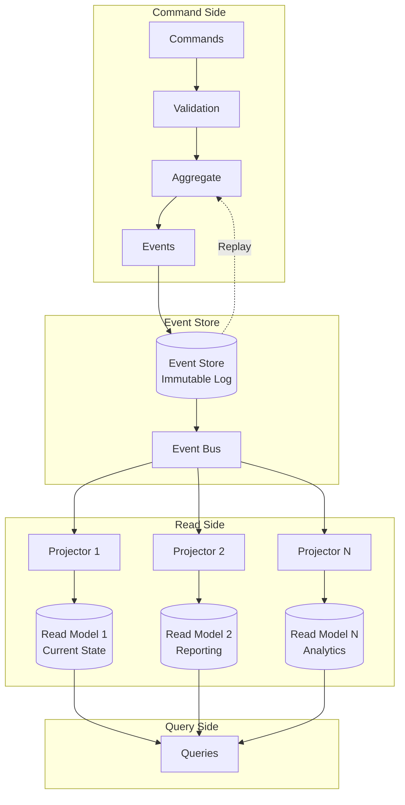
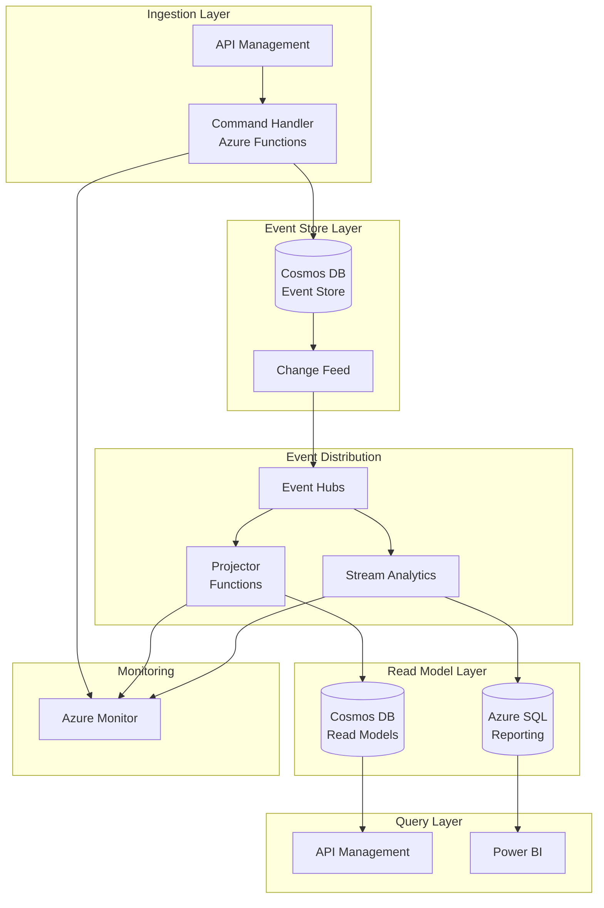

# Event Sourcing Architecture Pattern

> **🏠 [Home](../../../README.md)** | **📖 [Architecture Patterns](../README.md)** | **⚡ [Streaming Architectures](README.md)** | **Event Sourcing**


Store all changes to application state as an immutable sequence of events, enabling complete audit trails, temporal queries, and event replay capabilities.

---

## Table of Contents

- [Overview](#overview)
- [Core Concepts](#core-concepts)
- [Architecture Components](#architecture-components)
- [Azure Implementation](#azure-implementation)
- [Implementation Patterns](#implementation-patterns)
- [Code Examples](#code-examples)
- [Best Practices](#best-practices)
- [Common Challenges](#common-challenges)
- [Performance Optimization](#performance-optimization)
- [Security Considerations](#security-considerations)
- [Monitoring and Operations](#monitoring-and-operations)

---

## Overview

Event Sourcing is an architectural pattern where all changes to application state are stored as a sequence of immutable events. Instead of storing just the current state, Event Sourcing stores the complete history of events that led to the current state.

### Key Principles

**Immutable Event Log**: All state changes are captured as events that are never modified or deleted.

**Event Store as Source of Truth**: The event log is the authoritative source for application state.

**State Reconstruction**: Current state is derived by replaying events from the event store.

**Temporal Queries**: Query state at any point in time by replaying events up to that moment.

### When to Use Event Sourcing


**✅ Ideal For:**

- Financial systems requiring complete audit trails
- Regulatory compliance with audit requirements
- Systems needing temporal queries (state at point in time)
- Event-driven microservices architectures
- Complex business logic with state transitions
- Debugging and troubleshooting production issues

**❌ Not Ideal For:**

- Simple CRUD applications
- Systems with minimal audit requirements
- Applications with large binary data
- Real-time systems with very low latency needs
- Teams unfamiliar with event-driven patterns

### Architecture Diagram



---

## Core Concepts

### Events

**Definition**: Immutable records of facts that have occurred in the system.

**Characteristics:**

- **Immutable**: Once written, events are never modified
- **Append-Only**: New events are always appended to the end
- **Time-Ordered**: Events maintain chronological order
- **Self-Describing**: Events contain all necessary context

**Event Structure Example:**

```json
{
  "eventId": "evt_123456",
  "eventType": "OrderPlaced",
  "aggregateId": "order_789",
  "timestamp": "2025-01-15T10:30:00Z",
  "version": 1,
  "userId": "user_456",
  "data": {
    "orderId": "order_789",
    "customerId": "cust_123",
    "items": [
      {
        "productId": "prod_001",
        "quantity": 2,
        "price": 29.99
      }
    ],
    "totalAmount": 59.98
  },
  "metadata": {
    "correlationId": "corr_abc",
    "causationId": "cmd_xyz",
    "userId": "user_456",
    "ipAddress": "192.168.1.100"
  }
}
```

### Event Store

**Purpose**: Persistent storage for the immutable event log.

**Requirements:**

- Append-only operations
- Sequential read capability
- Event versioning support
- Snapshot storage
- Optimistic concurrency control

### Aggregates

**Definition**: Domain entities that ensure business rule consistency and generate events.

**Responsibilities:**

- Validate commands
- Enforce business rules
- Generate domain events
- Maintain consistency boundaries

### Projections (Read Models)

**Purpose**: Materialized views of event data optimized for queries.

**Types:**

- **Current State Projections**: Latest state of entities
- **Reporting Projections**: Aggregated data for reports
- **Search Projections**: Optimized for search queries
- **Audit Projections**: Complete event history

---

## Architecture Components

### 1. Command Handlers

Process user commands and generate events.

```python
from dataclasses import dataclass
from typing import List
from datetime import datetime

@dataclass
class PlaceOrderCommand:
    order_id: str
    customer_id: str
    items: List[dict]

class OrderCommandHandler:
    def __init__(self, event_store, event_bus):
        self.event_store = event_store
        self.event_bus = event_bus

    async def handle_place_order(self, command: PlaceOrderCommand):
        # Load aggregate from event store
        order = await self._load_aggregate(command.order_id)

        # Execute business logic
        events = order.place_order(
            customer_id=command.customer_id,
            items=command.items
        )

        # Persist events
        await self.event_store.append_events(
            aggregate_id=command.order_id,
            events=events,
            expected_version=order.version
        )

        # Publish events
        for event in events:
            await self.event_bus.publish(event)

        return order.order_id

    async def _load_aggregate(self, aggregate_id: str):
        # Load events for aggregate
        events = await self.event_store.get_events(aggregate_id)

        # Reconstruct state from events
        order = Order()
        for event in events:
            order.apply_event(event)

        return order
```

### 2. Event Store

Persists and retrieves events.

```python
from azure.cosmos import CosmosClient, PartitionKey
from typing import List, Optional

class CosmosEventStore:
    def __init__(self, connection_string: str, database_name: str):
        self.client = CosmosClient.from_connection_string(connection_string)
        self.database = self.client.get_database_client(database_name)
        self.container = self.database.get_container_client("events")

    async def append_events(
        self,
        aggregate_id: str,
        events: List[dict],
        expected_version: int
    ):
        """Append events with optimistic concurrency control."""

        # Get current version
        current_version = await self._get_version(aggregate_id)

        # Check concurrency
        if current_version != expected_version:
            raise ConcurrencyException(
                f"Expected version {expected_version}, "
                f"but current version is {current_version}"
            )

        # Append events
        for i, event in enumerate(events):
            event_doc = {
                "id": event["eventId"],
                "aggregateId": aggregate_id,
                "eventType": event["eventType"],
                "version": expected_version + i + 1,
                "timestamp": event["timestamp"],
                "data": event["data"],
                "metadata": event.get("metadata", {})
            }

            await self.container.create_item(body=event_doc)

    async def get_events(
        self,
        aggregate_id: str,
        from_version: Optional[int] = None
    ) -> List[dict]:
        """Retrieve events for an aggregate."""

        query = """
            SELECT * FROM c
            WHERE c.aggregateId = @aggregateId
        """

        parameters = [{"name": "@aggregateId", "value": aggregate_id}]

        if from_version:
            query += " AND c.version > @fromVersion"
            parameters.append({
                "name": "@fromVersion",
                "value": from_version
            })

        query += " ORDER BY c.version ASC"

        items = self.container.query_items(
            query=query,
            parameters=parameters,
            partition_key=aggregate_id
        )

        return [item for item in items]

    async def _get_version(self, aggregate_id: str) -> int:
        """Get current version of aggregate."""

        query = """
            SELECT VALUE MAX(c.version)
            FROM c
            WHERE c.aggregateId = @aggregateId
        """

        results = list(self.container.query_items(
            query=query,
            parameters=[{"name": "@aggregateId", "value": aggregate_id}],
            partition_key=aggregate_id
        ))

        return results[0] if results and results[0] else 0
```

### 3. Event Projectors

Build read models from events.

```python
from azure.eventhub import EventHubConsumerClient
from azure.cosmos import CosmosClient

class OrderProjector:
    def __init__(
        self,
        event_hub_connection: str,
        cosmos_connection: str,
        database_name: str
    ):
        self.consumer = EventHubConsumerClient.from_connection_string(
            event_hub_connection,
            consumer_group="$Default",
            eventhub_name="orders"
        )

        self.cosmos_client = CosmosClient.from_connection_string(
            cosmos_connection
        )
        self.read_model = self.cosmos_client.get_database_client(
            database_name
        ).get_container_client("order_read_model")

    async def start(self):
        """Start processing events and building read model."""
        await self.consumer.receive(
            on_event=self._process_event,
            on_error=self._on_error
        )

    async def _process_event(self, partition_context, event):
        """Process individual event and update read model."""

        event_data = event.body_as_json()
        event_type = event_data["eventType"]

        handlers = {
            "OrderPlaced": self._handle_order_placed,
            "OrderShipped": self._handle_order_shipped,
            "OrderCancelled": self._handle_order_cancelled
        }

        handler = handlers.get(event_type)
        if handler:
            await handler(event_data)

        # Update checkpoint
        await partition_context.update_checkpoint(event)

    async def _handle_order_placed(self, event_data: dict):
        """Handle OrderPlaced event."""

        data = event_data["data"]

        order_doc = {
            "id": data["orderId"],
            "customerId": data["customerId"],
            "status": "placed",
            "items": data["items"],
            "totalAmount": data["totalAmount"],
            "placedAt": event_data["timestamp"],
            "version": event_data["version"]
        }

        await self.read_model.upsert_item(body=order_doc)

    async def _handle_order_shipped(self, event_data: dict):
        """Handle OrderShipped event."""

        data = event_data["data"]
        order_id = data["orderId"]

        # Read current state
        order = await self.read_model.read_item(
            item=order_id,
            partition_key=order_id
        )

        # Update state
        order["status"] = "shipped"
        order["shippedAt"] = event_data["timestamp"]
        order["trackingNumber"] = data["trackingNumber"]
        order["version"] = event_data["version"]

        # Write updated state
        await self.read_model.upsert_item(body=order)

    async def _on_error(self, partition_context, error):
        """Handle errors in event processing."""
        print(f"Error processing events: {error}")
```

### 4. Snapshot Management

Optimize aggregate loading with snapshots.

```python
class SnapshotStore:
    def __init__(self, cosmos_client, database_name: str):
        self.container = cosmos_client.get_database_client(
            database_name
        ).get_container_client("snapshots")
        self.snapshot_interval = 100  # Snapshot every 100 events

    async def save_snapshot(
        self,
        aggregate_id: str,
        state: dict,
        version: int
    ):
        """Save snapshot of aggregate state."""

        snapshot = {
            "id": f"{aggregate_id}_{version}",
            "aggregateId": aggregate_id,
            "version": version,
            "state": state,
            "timestamp": datetime.utcnow().isoformat()
        }

        await self.container.upsert_item(body=snapshot)

    async def get_snapshot(
        self,
        aggregate_id: str
    ) -> Optional[dict]:
        """Get latest snapshot for aggregate."""

        query = """
            SELECT TOP 1 * FROM c
            WHERE c.aggregateId = @aggregateId
            ORDER BY c.version DESC
        """

        results = list(self.container.query_items(
            query=query,
            parameters=[{"name": "@aggregateId", "value": aggregate_id}],
            partition_key=aggregate_id
        ))

        return results[0] if results else None

    def should_snapshot(self, version: int) -> bool:
        """Determine if snapshot should be created."""
        return version % self.snapshot_interval == 0
```

---

## Azure Implementation

### Azure Service Mapping

| Component | Azure Service | Purpose |
|-----------|---------------|---------|
| **Event Store** | Cosmos DB | Persistent event storage with partitioning |
| **Event Bus** | Event Hubs | Event distribution to projectors |
| **Command Handlers** | Azure Functions | Serverless command processing |
| **Projectors** | Azure Functions / Stream Analytics | Build read models from events |
| **Read Models** | Cosmos DB / Azure SQL | Optimized query stores |
| **Snapshots** | Cosmos DB / Blob Storage | Aggregate state snapshots |

### Reference Architecture



### Deployment Template

```bicep
// Event Sourcing Infrastructure - Bicep Template

param location string = resourceGroup().location
param environmentName string = 'dev'

// Cosmos DB for Event Store
resource cosmosAccount 'Microsoft.DocumentDB/databaseAccounts@2023-04-15' = {
  name: 'cosmos-eventstore-${environmentName}'
  location: location
  kind: 'GlobalDocumentDB'
  properties: {
    databaseAccountOfferType: 'Standard'
    consistencyPolicy: {
      defaultConsistencyLevel: 'Session'
    }
    locations: [
      {
        locationName: location
        failoverPriority: 0
      }
    ]
    capabilities: [
      {
        name: 'EnableServerless'
      }
    ]
  }
}

resource database 'Microsoft.DocumentDB/databaseAccounts/sqlDatabases@2023-04-15' = {
  parent: cosmosAccount
  name: 'EventSourcingDB'
  properties: {
    resource: {
      id: 'EventSourcingDB'
    }
  }
}

resource eventStoreContainer 'Microsoft.DocumentDB/databaseAccounts/sqlDatabases/containers@2023-04-15' = {
  parent: database
  name: 'events'
  properties: {
    resource: {
      id: 'events'
      partitionKey: {
        paths: ['/aggregateId']
        kind: 'Hash'
      }
      indexingPolicy: {
        indexingMode: 'consistent'
        includedPaths: [
          {
            path: '/*'
          }
        ]
      }
    }
  }
}

// Event Hubs for Event Distribution
resource eventHubNamespace 'Microsoft.EventHub/namespaces@2022-10-01-preview' = {
  name: 'ehns-events-${environmentName}'
  location: location
  sku: {
    name: 'Standard'
    tier: 'Standard'
    capacity: 1
  }
  properties: {
    zoneRedundant: false
  }
}

resource eventHub 'Microsoft.EventHub/namespaces/eventhubs@2022-10-01-preview' = {
  parent: eventHubNamespace
  name: 'domain-events'
  properties: {
    messageRetentionInDays: 7
    partitionCount: 4
  }
}

// Azure Functions for Command Handlers
resource functionApp 'Microsoft.Web/sites@2022-09-01' = {
  name: 'func-commands-${environmentName}'
  location: location
  kind: 'functionapp'
  properties: {
    serverFarmId: appServicePlan.id
    siteConfig: {
      appSettings: [
        {
          name: 'FUNCTIONS_WORKER_RUNTIME'
          value: 'python'
        }
        {
          name: 'CosmosDB__ConnectionString'
          value: cosmosAccount.listConnectionStrings().connectionStrings[0].connectionString
        }
        {
          name: 'EventHub__ConnectionString'
          value: listKeys(eventHub.id, eventHub.apiVersion).primaryConnectionString
        }
      ]
    }
  }
}

resource appServicePlan 'Microsoft.Web/serverfarms@2022-09-01' = {
  name: 'asp-eventstore-${environmentName}'
  location: location
  sku: {
    name: 'Y1'
    tier: 'Dynamic'
  }
}

output eventStoreEndpoint string = cosmosAccount.properties.documentEndpoint
output eventHubNamespace string = eventHubNamespace.name
output functionAppName string = functionApp.name
```

---

## Implementation Patterns

### Pattern 1: Simple Event Sourcing

**Use Case**: Basic event sourcing with single aggregate type.

**Implementation:**

```python
class Order:
    def __init__(self):
        self.order_id = None
        self.customer_id = None
        self.status = None
        self.items = []
        self.version = 0

    def place_order(self, customer_id: str, items: List[dict]) -> List[dict]:
        """Place new order and return events."""

        # Validate
        if self.status is not None:
            raise ValueError("Order already placed")

        # Generate event
        event = {
            "eventId": str(uuid.uuid4()),
            "eventType": "OrderPlaced",
            "aggregateId": self.order_id,
            "timestamp": datetime.utcnow().isoformat(),
            "version": self.version + 1,
            "data": {
                "orderId": self.order_id,
                "customerId": customer_id,
                "items": items,
                "totalAmount": sum(item["price"] * item["quantity"]
                                  for item in items)
            }
        }

        # Apply event to update state
        self.apply_event(event)

        return [event]

    def apply_event(self, event: dict):
        """Apply event to update aggregate state."""

        event_type = event["eventType"]
        data = event["data"]

        if event_type == "OrderPlaced":
            self.order_id = data["orderId"]
            self.customer_id = data["customerId"]
            self.items = data["items"]
            self.status = "placed"
        elif event_type == "OrderShipped":
            self.status = "shipped"
        elif event_type == "OrderCancelled":
            self.status = "cancelled"

        self.version = event["version"]
```

### Pattern 2: Event Sourcing with Snapshots

**Use Case**: Optimize performance for aggregates with many events.

**Implementation:**

```python
class OptimizedOrderLoader:
    def __init__(self, event_store, snapshot_store):
        self.event_store = event_store
        self.snapshot_store = snapshot_store

    async def load_order(self, order_id: str) -> Order:
        """Load order efficiently using snapshots."""

        # Try to load latest snapshot
        snapshot = await self.snapshot_store.get_snapshot(order_id)

        if snapshot:
            # Reconstruct from snapshot
            order = Order()
            order.order_id = snapshot["state"]["order_id"]
            order.customer_id = snapshot["state"]["customer_id"]
            order.status = snapshot["state"]["status"]
            order.items = snapshot["state"]["items"]
            order.version = snapshot["version"]

            # Load events after snapshot
            events = await self.event_store.get_events(
                order_id,
                from_version=snapshot["version"]
            )
        else:
            # Load all events
            order = Order()
            order.order_id = order_id
            events = await self.event_store.get_events(order_id)

        # Apply remaining events
        for event in events:
            order.apply_event(event)

        # Create snapshot if needed
        if self.snapshot_store.should_snapshot(order.version):
            await self.snapshot_store.save_snapshot(
                order_id,
                {
                    "order_id": order.order_id,
                    "customer_id": order.customer_id,
                    "status": order.status,
                    "items": order.items
                },
                order.version
            )

        return order
```

### Pattern 3: Event Sourcing with CQRS

**Use Case**: Separate read and write models for optimal performance.

**See Also**: [CQRS Pattern Guide](cqrs-pattern.md)

---

## Code Examples

### Complete Command Handler Example

```python
from azure.functions import HttpRequest, HttpResponse
from azure.cosmos import CosmosClient
from azure.eventhub import EventHubProducerClient, EventData
import json
import os

# Initialize clients
cosmos_client = CosmosClient.from_connection_string(
    os.environ["CosmosDB__ConnectionString"]
)
event_hub_client = EventHubProducerClient.from_connection_string(
    os.environ["EventHub__ConnectionString"],
    eventhub_name="domain-events"
)

event_store = CosmosEventStore(cosmos_client, "EventSourcingDB")

async def main(req: HttpRequest) -> HttpResponse:
    """Azure Function HTTP trigger for placing orders."""

    try:
        # Parse request
        req_body = req.get_json()
        command = PlaceOrderCommand(
            order_id=req_body.get("orderId"),
            customer_id=req_body.get("customerId"),
            items=req_body.get("items")
        )

        # Load aggregate
        order = Order()
        order.order_id = command.order_id
        events_history = await event_store.get_events(command.order_id)

        for event in events_history:
            order.apply_event(event)

        # Execute command
        new_events = order.place_order(
            customer_id=command.customer_id,
            items=command.items
        )

        # Persist events
        await event_store.append_events(
            aggregate_id=command.order_id,
            events=new_events,
            expected_version=order.version - len(new_events)
        )

        # Publish to Event Hub
        event_batch = await event_hub_client.create_batch()
        for event in new_events:
            event_batch.add(EventData(json.dumps(event)))

        await event_hub_client.send_batch(event_batch)

        return HttpResponse(
            json.dumps({"orderId": order.order_id, "status": "success"}),
            mimetype="application/json",
            status_code=201
        )

    except ValueError as e:
        return HttpResponse(
            json.dumps({"error": str(e)}),
            mimetype="application/json",
            status_code=400
        )
    except ConcurrencyException as e:
        return HttpResponse(
            json.dumps({"error": "Concurrency conflict", "details": str(e)}),
            mimetype="application/json",
            status_code=409
        )
```

---

## Best Practices

### 1. Event Design

**✅ Do:**

- Use past tense for event names (OrderPlaced, not PlaceOrder)
- Include all necessary data in events (no external dependencies)
- Version your events for schema evolution
- Include metadata (correlationId, causationId, userId)
- Keep events granular and focused

**❌ Don't:**

- Store large binary data in events
- Reference external entities without IDs
- Delete or modify events
- Use generic event types

### 2. Aggregate Design

**Guidelines:**

- Keep aggregates small and focused
- Enforce consistency boundaries within aggregates
- Load full aggregate history (or use snapshots)
- Use optimistic concurrency control
- Validate commands before generating events

### 3. Event Store Management

**Best Practices:**

- Use append-only storage
- Partition by aggregate ID
- Index by aggregate ID and version
- Implement optimistic concurrency
- Archive old events if needed

### 4. Read Model Strategies

**Approaches:**

- **Eventually Consistent**: Accept lag between writes and reads
- **Multiple Projections**: Create specialized read models per use case
- **Rebuilding**: Be able to rebuild read models from events
- **Caching**: Cache read models for performance

---

## Common Challenges

### Challenge 1: Event Schema Evolution

**Problem**: Events are immutable but schema needs to change.

**Solutions:**

**Versioned Events:**

```python
# Version 1
{
  "eventType": "OrderPlaced",
  "version": 1,
  "data": {
    "orderId": "123",
    "amount": 100.00
  }
}

# Version 2 - adds currency field
{
  "eventType": "OrderPlaced",
  "version": 2,
  "data": {
    "orderId": "123",
    "amount": 100.00,
    "currency": "USD"  # New field
  }
}
```

**Upcasting:**

```python
class EventUpcaster:
    def upcast_event(self, event: dict) -> dict:
        """Upcast old events to latest version."""

        event_type = event["eventType"]
        version = event.get("version", 1)

        if event_type == "OrderPlaced":
            if version == 1:
                # Add default currency
                event["data"]["currency"] = "USD"
                event["version"] = 2

        return event
```

### Challenge 2: Event Store Size Growth

**Problem**: Event store grows unbounded.

**Solutions:**

1. **Snapshots**: Store periodic state snapshots
2. **Archival**: Move old events to cold storage
3. **Compaction**: Combine events where possible
4. **Time-based Partitioning**: Partition by time for easier archival

### Challenge 3: Read Model Consistency

**Problem**: Read models lag behind writes (eventual consistency).

**Solutions:**

1. **Embrace Eventual Consistency**: Design UI to handle stale data
2. **Read Your Writes**: Return data from command side
3. **Correlation IDs**: Track event processing status
4. **Optimistic UI**: Update UI optimistically

---

## Performance Optimization

### Optimization Strategies

#### 1. Snapshot Strategy

```python
# Configure snapshot frequency based on load patterns
SNAPSHOT_CONFIG = {
    "high_activity_aggregates": 50,   # Snapshot every 50 events
    "normal_aggregates": 100,          # Snapshot every 100 events
    "low_activity_aggregates": 500     # Snapshot every 500 events
}

def get_snapshot_interval(aggregate_type: str) -> int:
    """Determine snapshot interval based on aggregate type."""
    return SNAPSHOT_CONFIG.get(aggregate_type, 100)
```

#### 2. Parallel Event Processing

```python
# Process events in parallel using consumer groups
consumer_configs = [
    {
        "consumer_group": "order_projector",
        "handler": OrderProjector()
    },
    {
        "consumer_group": "analytics_projector",
        "handler": AnalyticsProjector()
    },
    {
        "consumer_group": "notification_handler",
        "handler": NotificationHandler()
    }
]

# Each consumer processes independently
for config in consumer_configs:
    consumer = EventHubConsumerClient.from_connection_string(
        connection_string,
        consumer_group=config["consumer_group"],
        eventhub_name="domain-events"
    )
    await consumer.receive(on_event=config["handler"].process)
```

#### 3. Caching Read Models

```python
from azure.core.credentials import AzureKeyCredential
from azure.data.tables import TableServiceClient

class CachedReadModel:
    def __init__(self, cosmos_client, cache_connection_string):
        self.read_model = cosmos_client.get_container_client(
            "EventSourcingDB", "orders"
        )
        self.cache = TableServiceClient.from_connection_string(
            cache_connection_string
        ).get_table_client("order_cache")

    async def get_order(self, order_id: str) -> dict:
        """Get order with caching."""

        # Try cache first
        try:
            cached = self.cache.get_entity(
                partition_key="order",
                row_key=order_id
            )
            return cached
        except:
            pass

        # Load from Cosmos
        order = await self.read_model.read_item(
            item=order_id,
            partition_key=order_id
        )

        # Update cache
        self.cache.upsert_entity({
            "PartitionKey": "order",
            "RowKey": order_id,
            **order
        })

        return order
```

---

## Security Considerations

### 1. Event Encryption

**Encrypt Sensitive Data in Events:**

```python
from azure.keyvault.secrets import SecretClient
from azure.identity import DefaultAzureCredential
from cryptography.fernet import Fernet

class EncryptedEventStore:
    def __init__(self, event_store, key_vault_url: str):
        self.event_store = event_store
        self.credential = DefaultAzureCredential()
        self.key_client = SecretClient(
            vault_url=key_vault_url,
            credential=self.credential
        )

        # Get encryption key from Key Vault
        encryption_key = self.key_client.get_secret("event-encryption-key")
        self.cipher = Fernet(encryption_key.value.encode())

    def encrypt_sensitive_data(self, event: dict) -> dict:
        """Encrypt sensitive fields in event."""

        sensitive_fields = ["creditCard", "ssn", "password"]

        for field in sensitive_fields:
            if field in event["data"]:
                value = event["data"][field]
                encrypted = self.cipher.encrypt(value.encode())
                event["data"][field] = encrypted.decode()

        return event

    def decrypt_sensitive_data(self, event: dict) -> dict:
        """Decrypt sensitive fields in event."""

        sensitive_fields = ["creditCard", "ssn", "password"]

        for field in sensitive_fields:
            if field in event["data"]:
                encrypted_value = event["data"][field].encode()
                decrypted = self.cipher.decrypt(encrypted_value)
                event["data"][field] = decrypted.decode()

        return event
```

### 2. Access Control

**Implement RBAC for Event Store:**

```python
from azure.identity import DefaultAzureCredential
from azure.cosmos import CosmosClient

# Use Managed Identity for access
credential = DefaultAzureCredential()

cosmos_client = CosmosClient(
    url="https://cosmos-eventstore.documents.azure.com:443/",
    credential=credential
)

# Configure RBAC at container level
# Users/apps get appropriate roles:
# - Cosmos DB Built-in Data Contributor (write events)
# - Cosmos DB Built-in Data Reader (read events)
```

### 3. Audit Trail

**Track Event Access:**

```python
class AuditedEventStore:
    def __init__(self, event_store, audit_logger):
        self.event_store = event_store
        self.audit_logger = audit_logger

    async def get_events(
        self,
        aggregate_id: str,
        user_context: dict
    ) -> List[dict]:
        """Get events with audit logging."""

        # Log access
        await self.audit_logger.log({
            "action": "read_events",
            "aggregateId": aggregate_id,
            "userId": user_context["user_id"],
            "timestamp": datetime.utcnow().isoformat(),
            "ipAddress": user_context.get("ip_address")
        })

        # Retrieve events
        return await self.event_store.get_events(aggregate_id)
```

---

## Monitoring and Operations

### Key Metrics

| Metric | Description | Target | Alert Threshold |
|--------|-------------|--------|-----------------|
| **Event Write Latency** | Time to append events | < 50ms | > 200ms |
| **Event Store Size** | Total size of event store | N/A | Monitor growth |
| **Projection Lag** | Time behind event stream | < 5s | > 30s |
| **Snapshot Hit Rate** | % of loads using snapshots | > 80% | < 60% |
| **Concurrency Conflicts** | Failed optimistic concurrency | < 1% | > 5% |
| **Event Processing Rate** | Events processed per second | Varies | < expected rate |

### Monitoring Implementation

```python
from azure.monitor.opentelemetry import configure_azure_monitor
from opentelemetry import metrics

# Configure Azure Monitor
configure_azure_monitor(
    connection_string=os.environ["APPLICATIONINSIGHTS_CONNECTION_STRING"]
)

# Create metrics
meter = metrics.get_meter(__name__)

event_write_counter = meter.create_counter(
    "event_store.writes",
    description="Number of events written"
)

event_write_duration = meter.create_histogram(
    "event_store.write_duration",
    description="Event write duration in ms"
)

projection_lag_gauge = meter.create_gauge(
    "projection.lag_seconds",
    description="Projection lag in seconds"
)

# Instrument code
class InstrumentedEventStore:
    def __init__(self, event_store):
        self.event_store = event_store

    async def append_events(self, aggregate_id: str, events: List[dict], expected_version: int):
        """Append events with metrics."""

        start_time = time.time()

        try:
            await self.event_store.append_events(
                aggregate_id,
                events,
                expected_version
            )

            # Record success metrics
            event_write_counter.add(
                len(events),
                {"aggregate_type": events[0]["eventType"].split("_")[0]}
            )

            duration_ms = (time.time() - start_time) * 1000
            event_write_duration.record(
                duration_ms,
                {"aggregate_type": events[0]["eventType"].split("_")[0]}
            )

        except Exception as e:
            # Record error metrics
            event_write_counter.add(
                0,
                {
                    "aggregate_type": events[0]["eventType"].split("_")[0],
                    "error": type(e).__name__
                }
            )
            raise
```

### Operational Runbook

#### Event Store Maintenance

```bash
# Monitor event store size
az cosmosdb sql container show \
  --account-name cosmos-eventstore \
  --database-name EventSourcingDB \
  --name events \
  --query "resource.id"

# Monitor throughput
az monitor metrics list \
  --resource /subscriptions/{sub}/resourceGroups/{rg}/providers/Microsoft.DocumentDB/databaseAccounts/cosmos-eventstore \
  --metric TotalRequests \
  --interval PT1M

# Archive old events (example: move to blob storage)
# Run as scheduled job
python archive_old_events.py --older-than-days 365
```

#### Projection Rebuilding

```bash
# Stop current projector
az functionapp stop --name func-projector

# Clear read model
az cosmosdb sql container delete \
  --account-name cosmos-eventstore \
  --database-name EventSourcingDB \
  --name order_read_model

# Recreate container
az cosmosdb sql container create \
  --account-name cosmos-eventstore \
  --database-name EventSourcingDB \
  --name order_read_model \
  --partition-key-path /id

# Restart projector (will replay all events)
az functionapp start --name func-projector
```

---

## Additional Resources

### Documentation

- [CQRS Pattern Guide](cqrs-pattern.md) - Complementary pattern for read/write separation
- [Lambda Architecture](lambda-architecture.md) - Batch and stream processing
- [Best Practices](../../best-practices/README.md) - General best practices

### Azure Services

- [Azure Cosmos DB Documentation](https://docs.microsoft.com/azure/cosmos-db/)
- [Azure Event Hubs Documentation](https://docs.microsoft.com/azure/event-hubs/)
- [Azure Functions Documentation](https://docs.microsoft.com/azure/azure-functions/)

### External Resources

- [Event Sourcing Pattern - Martin Fowler](https://martinfowler.com/eaaDev/EventSourcing.html)
- [Event Store Documentation](https://www.eventstore.com/event-sourcing)
- [Microsoft Cloud Design Patterns](https://docs.microsoft.com/azure/architecture/patterns/event-sourcing)

---

**Last Updated**: 2025-01-28
**Pattern Status**: Production Ready
**Complexity Level**: Advanced
