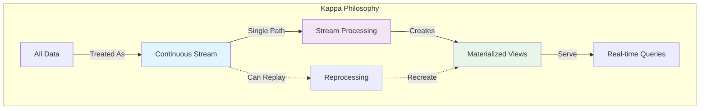
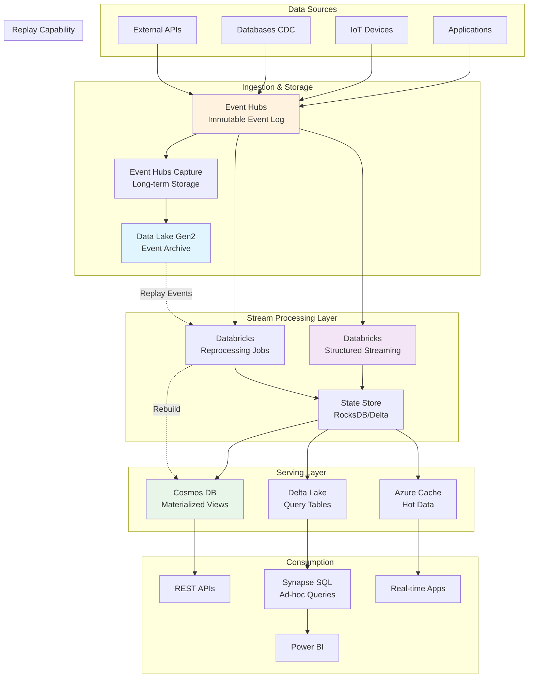
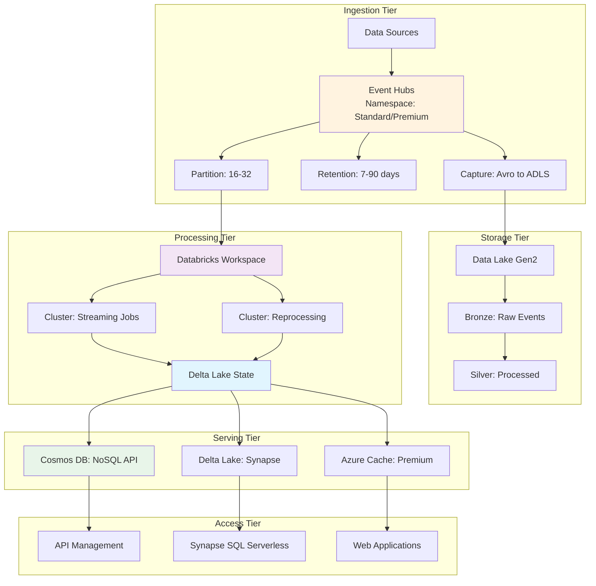
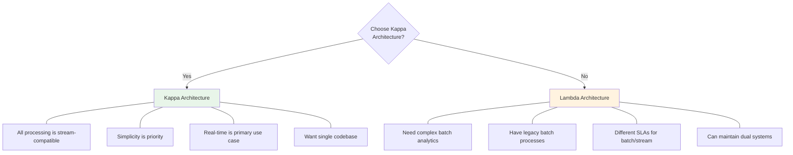
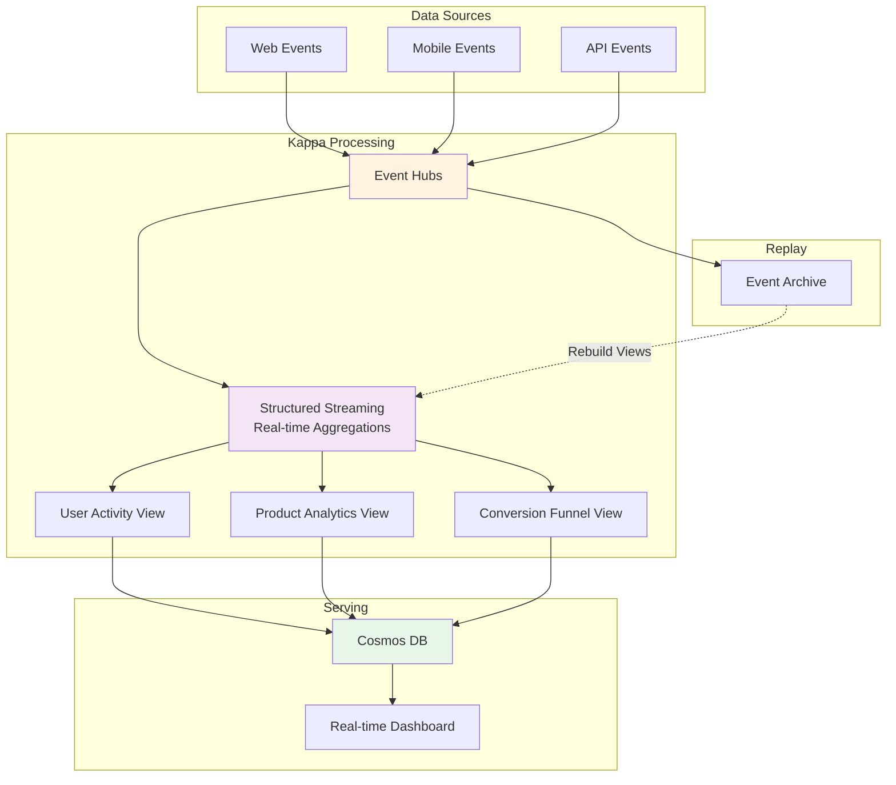
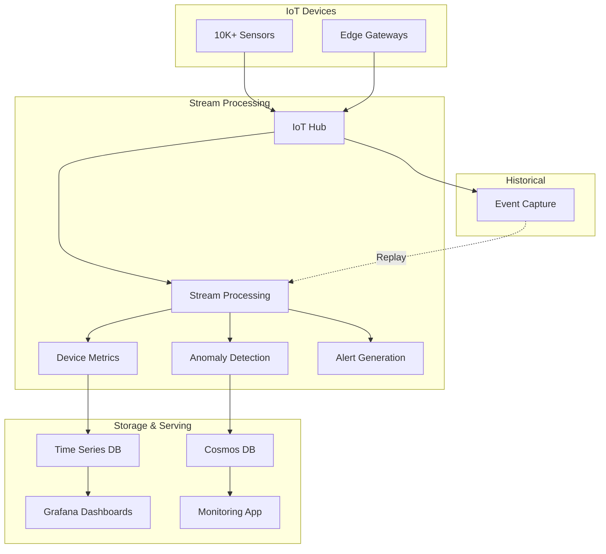

# Kappa Architecture Pattern

> **🏠 [Home](../../../README.md)** | **📖 [Architecture Patterns](../README.md)** | **⚡ [Streaming Architectures](README.md)** | **Kappa Architecture**


Stream-first architecture that processes all data as continuous, infinite streams - a simpler alternative to Lambda Architecture.

---

## Table of Contents

- [Overview](#overview)
- [Architecture Components](#architecture-components)
- [Azure Implementation](#azure-implementation)
- [Stream Processing Patterns](#stream-processing-patterns)
- [Performance Optimization](#performance-optimization)
- [Monitoring & Operations](#monitoring-operations)
- [Best Practices](#best-practices)
- [Kappa vs Lambda](#kappa-vs-lambda)
- [Use Cases](#use-cases)

---

## Overview

### What is Kappa Architecture?

Kappa Architecture, proposed by Jay Kreps (LinkedIn), simplifies Lambda Architecture by removing the batch processing layer. Instead, **all data processing is performed using a single stream processing engine**, and historical data is reprocessed by replaying the event stream.

### Core Concept

> "Everything is a stream. The stream is the source of truth."



### Key Principles

1. **Single Processing Paradigm**: Only stream processing, no separate batch layer
2. **Immutable Event Log**: Complete event history stored for replay
3. **Replayability**: Recreate views by reprocessing event stream
4. **Simplicity**: Eliminates complexity of maintaining dual systems

---

## Architecture Components

### High-Level Architecture



---

## Azure Implementation

### Reference Architecture

#### Core Components

| Component | Azure Service | Purpose | Key Features |
|-----------|---------------|---------|--------------|
| **Event Log** | Event Hubs | Immutable event stream | Partitioning, retention, capture |
| **Long-term Storage** | Data Lake Gen2 | Event archive for replay | Cost-effective, scalable |
| **Stream Processing** | Databricks Structured Streaming | Real-time processing | Exactly-once, stateful, fault-tolerant |
| **State Store** | Delta Lake / RocksDB | Stream processing state | ACID, versioning, time travel |
| **Serving Views** | Cosmos DB | Low-latency queries | Global distribution, multi-model |
| **Analytics** | Synapse Analytics | Ad-hoc analysis | SQL, Spark, integration |
| **Caching** | Azure Cache for Redis | Sub-ms reads | In-memory, high throughput |

#### Architecture Diagram with Services



---

## Stream Processing Patterns

### Pattern 1: Stateful Stream Processing

```python
# Databricks Structured Streaming - Stateful Processing
from pyspark.sql import SparkSession
from pyspark.sql.functions import *
from pyspark.sql.types import *

class KappaStreamProcessor:
    """
    Kappa architecture stream processor
    All processing as continuous streams
    """

    def __init__(self, spark: SparkSession):
        self.spark = spark
        self.checkpoint_path = "abfss://checkpoints@datalake.dfs.core.windows.net/kappa"
        self.output_path = "abfss://serving@datalake.dfs.core.windows.net/views"

    def process_event_stream(self):
        """
        Process event stream with stateful aggregations
        Maintains running aggregates in state store
        """

        # Define event schema
        event_schema = StructType([
            StructField("eventId", StringType(), False),
            StructField("deviceId", StringType(), False),
            StructField("userId", StringType(), True),
            StructField("eventType", StringType(), False),
            StructField("eventTimestamp", TimestampType(), False),
            StructField("temperature", DoubleType(), True),
            StructField("humidity", DoubleType(), True),
            StructField("pressure", DoubleType(), True),
            StructField("metadata", MapType(StringType(), StringType()), True)
        ])

        # Read from Event Hubs
        event_stream = self.spark.readStream \
            .format("eventhubs") \
            .option("eventhubs.connectionString", self._get_eh_config()) \
            .option("eventhubs.consumerGroup", "$Default") \
            .option("maxEventsPerTrigger", 10000) \
            .option("startingPosition", "latest") \
            .load()

        # Parse events
        parsed_events = event_stream.select(
            from_json(col("body").cast("string"), event_schema).alias("event"),
            col("enqueuedTime"),
            col("offset"),
            col("sequenceNumber"),
            col("partition")
        ).select("event.*", "enqueuedTime", "partition")

        # Apply watermarking for late data handling
        watermarked = parsed_events.withWatermark("eventTimestamp", "10 minutes")

        # Compute stateful aggregations
        aggregated = self._compute_aggregations(watermarked)

        # Write to multiple sinks
        self._write_to_serving_layer(aggregated)

        return aggregated

    def _compute_aggregations(self, events_df):
        """
        Compute various aggregations using different window types
        """

        # 1. Tumbling window aggregations (non-overlapping)
        tumbling_metrics = events_df.groupBy(
            "deviceId",
            window("eventTimestamp", "5 minutes")
        ).agg(
            count("*").alias("eventCount"),
            avg("temperature").alias("avgTemp"),
            max("temperature").alias("maxTemp"),
            min("temperature").alias("minTemp"),
            stddev("temperature").alias("stddevTemp"),
            avg("humidity").alias("avgHumidity"),
            avg("pressure").alias("avgPressure"),
            collect_set("eventType").alias("eventTypes")
        ).select(
            col("deviceId"),
            col("window.start").alias("windowStart"),
            col("window.end").alias("windowEnd"),
            "*"
        ).drop("window")

        # 2. Session window aggregations (event bursts)
        session_metrics = events_df.groupBy(
            "userId",
            session_window("eventTimestamp", "30 minutes")
        ).agg(
            count("*").alias("sessionEvents"),
            countDistinct("deviceId").alias("devicesUsed"),
            collect_list("eventType").alias("eventSequence"),
            first("eventTimestamp").alias("sessionStart"),
            last("eventTimestamp").alias("sessionEnd")
        )

        # 3. Global aggregations (running totals)
        global_metrics = events_df.groupBy("deviceId").agg(
            count("*").alias("totalEvents"),
            approx_count_distinct("userId").alias("uniqueUsers"),
            avg("temperature").alias("lifetimeAvgTemp")
        )

        return tumbling_metrics  # Can return multiple streams

    def _write_to_serving_layer(self, stream_df):
        """
        Write stream to multiple serving stores
        """

        # Output 1: Delta Lake (for SQL queries)
        delta_query = stream_df.writeStream \
            .format("delta") \
            .outputMode("append") \
            .option("checkpointLocation", f"{self.checkpoint_path}/delta") \
            .option("path", f"{self.output_path}/device_metrics") \
            .partitionBy("windowStart") \
            .trigger(processingTime="1 minute") \
            .start()

        # Output 2: Cosmos DB (for low-latency queries)
        cosmos_query = stream_df.writeStream \
            .format("cosmos.oltp") \
            .outputMode("append") \
            .option("spark.synapse.linkedService", "CosmosDBLinkedService") \
            .option("spark.cosmos.container", "device_metrics") \
            .option("checkpointLocation", f"{self.checkpoint_path}/cosmos") \
            .trigger(processingTime="30 seconds") \
            .start()

        # Output 3: Console (for debugging)
        console_query = stream_df.writeStream \
            .format("console") \
            .outputMode("append") \
            .option("truncate", False) \
            .option("numRows", 10) \
            .start()

        return [delta_query, cosmos_query, console_query]

    def _get_eh_config(self):
        """Get Event Hubs connection string"""
        # In production, retrieve from Key Vault
        return "Endpoint=sb://..."
```

### Pattern 2: Event Replay for Reprocessing

```python
# Replay events from Data Lake to rebuild views
class EventReplayProcessor:
    """
    Replay historical events to rebuild materialized views
    Core capability of Kappa Architecture
    """

    def __init__(self, spark: SparkSession):
        self.spark = spark
        self.event_archive_path = "abfss://archive@datalake.dfs.core.windows.net/events"
        self.checkpoint_path = "abfss://checkpoints@datalake.dfs.core.windows.net/replay"

    def replay_events(self, start_date: str, end_date: str, view_name: str):
        """
        Replay events from archive to rebuild view

        Args:
            start_date: Start date for replay (YYYY-MM-DD)
            end_date: End date for replay (YYYY-MM-DD)
            view_name: Name of view to rebuild
        """
        print(f"Starting replay for {view_name}")
        print(f"Date range: {start_date} to {end_date}")

        # Read archived events (from Event Hubs Capture)
        archived_events = self.spark.read \
            .format("avro") \
            .load(f"{self.event_archive_path}/*/*/{start_date}/*") \
            .union(
                self.spark.read.format("avro")
                .load(f"{self.event_archive_path}/*/*/{end_date}/*")
            )

        # Parse event bodies
        from pyspark.sql.functions import from_json, col
        parsed = archived_events.select(
            from_json(col("Body").cast("string"), self._get_event_schema()).alias("event")
        ).select("event.*")

        # Apply same processing logic as streaming
        processed = self._apply_view_logic(parsed, view_name)

        # Write to new version of view
        output_path = f"abfss://serving@datalake.dfs.core.windows.net/views/{view_name}_v2"

        processed.write \
            .format("delta") \
            .mode("overwrite") \
            .partitionBy("date") \
            .save(output_path)

        print(f"Replay complete. New view at: {output_path}")

        # Atomically swap old and new views
        self._atomic_swap(view_name, output_path)

    def _apply_view_logic(self, events_df, view_name: str):
        """
        Apply same transformation logic used in streaming
        Ensures batch replay produces identical results
        """
        if view_name == "device_metrics":
            return events_df.groupBy("deviceId", "date").agg(
                count("*").alias("eventCount"),
                avg("temperature").alias("avgTemp"),
                max("temperature").alias("maxTemp"),
                min("temperature").alias("minTemp")
            )
        elif view_name == "user_activity":
            return events_df.groupBy("userId", "date").agg(
                count("*").alias("eventCount"),
                countDistinct("deviceId").alias("uniqueDevices"),
                sum("duration").alias("totalDuration")
            )
        else:
            raise ValueError(f"Unknown view: {view_name}")

    def _atomic_swap(self, view_name: str, new_path: str):
        """
        Atomically swap old view with new using Delta Lake
        Zero-downtime view replacement
        """
        from delta.tables import DeltaTable

        old_path = f"abfss://serving@datalake.dfs.core.windows.net/views/{view_name}"

        # Create external table pointing to new location
        self.spark.sql(f"""
            CREATE OR REPLACE TABLE {view_name}
            USING DELTA
            LOCATION '{new_path}'
        """)

        print(f"View {view_name} now points to {new_path}")
```

### Pattern 3: Multi-Version Concurrent Processing

```python
# Run multiple versions of processing logic simultaneously
class MultiVersionProcessor:
    """
    Run multiple versions of stream processing in parallel
    Useful for testing new logic before switching over
    """

    def __init__(self, spark: SparkSession):
        self.spark = spark

    def run_multi_version(self, versions: list):
        """
        Run multiple versions of processing logic concurrently

        Args:
            versions: List of dicts with 'name', 'logic', 'output' keys
        """
        queries = []

        for version in versions:
            print(f"Starting version: {version['name']}")

            # Read same source stream
            source_stream = self._get_source_stream()

            # Apply version-specific logic
            processed = version['logic'](source_stream)

            # Write to version-specific output
            query = processed.writeStream \
                .format("delta") \
                .outputMode("append") \
                .option("checkpointLocation", f"/checkpoints/{version['name']}") \
                .option("path", version['output']) \
                .start()

            queries.append(query)

        # Wait for all queries
        for q in queries:
            q.awaitTermination()

    def compare_versions(self, v1_path: str, v2_path: str):
        """
        Compare outputs from two versions
        Validate new logic before switching
        """
        v1 = self.spark.read.format("delta").load(v1_path)
        v2 = self.spark.read.format("delta").load(v2_path)

        # Compare row counts
        v1_count = v1.count()
        v2_count = v2.count()

        print(f"V1 row count: {v1_count}")
        print(f"V2 row count: {v2_count}")

        # Compare aggregates
        v1_stats = v1.select(
            avg("value").alias("avg_v1"),
            sum("value").alias("sum_v1")
        ).first()

        v2_stats = v2.select(
            avg("value").alias("avg_v2"),
            sum("value").alias("sum_v2")
        ).first()

        print(f"V1 stats: {v1_stats}")
        print(f"V2 stats: {v2_stats}")

        # Find differences
        differences = v1.join(v2, "id", "full_outer") \
            .where("v1.value != v2.value OR v1.value IS NULL OR v2.value IS NULL")

        diff_count = differences.count()
        print(f"Differences found: {diff_count}")

        return diff_count == 0  # True if identical
```

---

## Performance Optimization

### Optimizing Event Hubs

```python
# Event Hubs configuration for optimal performance
event_hub_config = {
    "partition_count": 32,  # Higher parallelism
    "message_retention_days": 7,  # Balance cost vs replay capability
    "throughput_units": {
        "standard": 20,  # 20 MB/s ingress, 40 MB/s egress
        "auto_inflate": True,
        "max_throughput_units": 40
    },
    "capture": {
        "enabled": True,
        "encoding": "Avro",
        "interval_seconds": 300,  # 5 minutes
        "size_limit_bytes": 314572800,  # 300 MB
        "skip_empty_archives": True
    },
    "kafka_enabled": True  # For Kafka clients
}
```

### Optimizing Databricks Clusters

```python
# Databricks cluster configuration for streaming
streaming_cluster_config = {
    "cluster_name": "kappa-streaming-cluster",
    "spark_version": "13.3.x-scala2.12",
    "node_type_id": "Standard_DS4_v2",  # 8 cores, 28GB RAM
    "driver_node_type_id": "Standard_DS5_v2",  # 16 cores, 56GB RAM
    "autoscale": {
        "min_workers": 4,
        "max_workers": 20
    },
    "auto_termination_minutes": 0,  # Never terminate streaming cluster
    "spark_conf": {
        # Structured Streaming optimizations
        "spark.streaming.backpressure.enabled": "true",
        "spark.streaming.kafka.maxRatePerPartition": "10000",

        # State store optimizations
        "spark.sql.streaming.stateStore.providerClass":
            "org.apache.spark.sql.execution.streaming.state.HDFSBackedStateStoreProvider",
        "spark.sql.streaming.stateStore.compression.codec": "lz4",

        # Adaptive query execution
        "spark.sql.adaptive.enabled": "true",
        "spark.sql.adaptive.coalescePartitions.enabled": "true",

        # Memory optimizations
        "spark.memory.fraction": "0.8",
        "spark.memory.storageFraction": "0.3",

        # Delta Lake optimizations
        "spark.databricks.delta.optimizeWrite.enabled": "true",
        "spark.databricks.delta.autoCompact.enabled": "true"
    },
    "custom_tags": {
        "environment": "production",
        "workload": "kappa-streaming",
        "cost_center": "analytics"
    }
}
```

### State Store Optimization

```python
# Optimize stateful streaming operations
class StateStoreOptimization:
    """Optimize state management in streaming queries"""

    @staticmethod
    def configure_state_store(spark: SparkSession):
        """Configure state store for optimal performance"""

        # Use RocksDB for large state
        spark.conf.set(
            "spark.sql.streaming.stateStore.providerClass",
            "com.databricks.sql.streaming.state.RocksDBStateStoreProvider"
        )

        # Enable compression
        spark.conf.set("spark.sql.streaming.stateStore.compression.codec", "lz4")

        # Set checkpoint interval
        spark.conf.set("spark.streaming.checkpointInterval", "10000")  # 10 seconds

    @staticmethod
    def optimize_stateful_query(events_df):
        """
        Optimize stateful aggregations with:
        - Watermarking to limit state growth
        - Appropriate window sizes
        - State pruning
        """

        # Apply watermark (critical for state management)
        watermarked = events_df.withWatermark("eventTimestamp", "1 hour")

        # Use appropriate window size
        # Smaller windows = less state, more granular data
        # Larger windows = more state, less data volume
        aggregated = watermarked.groupBy(
            "deviceId",
            window("eventTimestamp", "5 minutes")  # Balance granularity vs state size
        ).agg(
            count("*").alias("count"),
            avg("temperature").alias("avgTemp")
        )

        # Enable state pruning with watermark
        return aggregated.where("windowEnd > current_timestamp() - interval 24 hours")
```

### Partitioning Strategies

```python
# Optimal partitioning for Kappa architecture
class PartitioningStrategy:
    """Partition data for optimal processing and querying"""

    @staticmethod
    def partition_event_stream(events_df):
        """
        Partition stream by:
        1. Time (for efficient range scans)
        2. Key (for even distribution)
        """

        # Add partitioning columns
        partitioned = events_df \
            .withColumn("year", year("eventTimestamp")) \
            .withColumn("month", month("eventTimestamp")) \
            .withColumn("day", dayofmonth("eventTimestamp")) \
            .withColumn("hour", hour("eventTimestamp"))

        return partitioned

    @staticmethod
    def write_partitioned(df, output_path: str):
        """Write with optimal partitioning"""

        df.write \
            .format("delta") \
            .mode("append") \
            .partitionBy("year", "month", "day") \
            .option("optimizeWrite", "true") \
            .option("autoCompact", "true") \
            .save(output_path)

    @staticmethod
    def z_order_for_queries(spark: SparkSession, table_path: str):
        """Z-order data for common query patterns"""
        from delta.tables import DeltaTable

        delta_table = DeltaTable.forPath(spark, table_path)

        # Z-order by commonly filtered columns
        delta_table.optimize().executeZOrderBy("deviceId", "eventType")
```

---

## Monitoring & Operations

### Key Metrics

```python
# Comprehensive monitoring for Kappa architecture
kappa_monitoring_metrics = {
    "stream_processing": {
        "input_rate": {
            "metric": "events_per_second",
            "threshold": 100000,
            "aggregation": "avg"
        },
        "processing_rate": {
            "metric": "processed_events_per_second",
            "threshold": 100000,
            "aggregation": "avg"
        },
        "lag": {
            "metric": "seconds_behind_latest",
            "threshold": 60,
            "aggregation": "max"
        },
        "batch_duration": {
            "metric": "trigger_execution_ms",
            "threshold": 30000,
            "aggregation": "p95"
        }
    },
    "state_management": {
        "state_size": {
            "metric": "state_size_bytes",
            "threshold": 100 * 1024**3,  # 100GB
            "aggregation": "max"
        },
        "num_state_rows": {
            "metric": "state_row_count",
            "threshold": 10000000,
            "aggregation": "max"
        },
        "checkpoint_duration": {
            "metric": "checkpoint_write_ms",
            "threshold": 10000,
            "aggregation": "p95"
        }
    },
    "data_quality": {
        "late_events": {
            "metric": "late_events_dropped",
            "threshold": 100,
            "aggregation": "sum"
        },
        "null_values": {
            "metric": "null_value_percentage",
            "threshold": 0.05,
            "aggregation": "avg"
        }
    },
    "resource_utilization": {
        "cpu_usage": {
            "metric": "cpu_percentage",
            "threshold": 80,
            "aggregation": "avg"
        },
        "memory_usage": {
            "metric": "memory_percentage",
            "threshold": 85,
            "aggregation": "avg"
        },
        "shuffle_read": {
            "metric": "shuffle_read_bytes",
            "threshold": 10 * 1024**3,  # 10GB
            "aggregation": "sum"
        }
    }
}
```

### Monitoring Dashboard

```python
# Create monitoring dashboard with Azure Monitor
class KappaMonitoringDashboard:
    """Set up comprehensive monitoring for Kappa architecture"""

    def __init__(self, workspace_id: str):
        self.workspace_id = workspace_id

    def create_streaming_dashboard(self):
        """Create dashboard for streaming metrics"""

        kusto_queries = {
            "stream_lag": """
                SparkMetrics_CL
                | where MetricName == "streaming.lag"
                | summarize AvgLag = avg(MetricValue), MaxLag = max(MetricValue)
                    by bin(TimeGenerated, 1m)
                | render timechart
            """,

            "processing_rate": """
                SparkMetrics_CL
                | where MetricName == "streaming.processedRowsPerSecond"
                | summarize Rate = avg(MetricValue) by bin(TimeGenerated, 1m)
                | render timechart
            """,

            "state_size": """
                SparkMetrics_CL
                | where MetricName == "streaming.stateStoreSizeBytes"
                | summarize StateSize = max(MetricValue) / (1024*1024*1024)
                    by bin(TimeGenerated, 5m)
                | render timechart
            """,

            "error_rate": """
                SparkLogs_CL
                | where Level == "ERROR"
                | summarize ErrorCount = count() by bin(TimeGenerated, 5m)
                | render timechart
            """
        }

        return kusto_queries

    def create_alerts(self):
        """Create alerts for critical conditions"""

        alerts = [
            {
                "name": "High Stream Lag",
                "condition": "lag_seconds > 300",
                "severity": "critical",
                "action": "page_oncall"
            },
            {
                "name": "State Store Too Large",
                "condition": "state_size_gb > 100",
                "severity": "warning",
                "action": "send_email"
            },
            {
                "name": "Processing Rate Dropped",
                "condition": "rate < 10000",
                "severity": "warning",
                "action": "send_teams_message"
            },
            {
                "name": "High Error Rate",
                "condition": "error_rate > 100",
                "severity": "critical",
                "action": "page_oncall"
            }
        ]

        return alerts
```

---

## Best Practices

### 1. Event Design

```python
# Design events for stream processing
class EventDesignPatterns:
    """Best practices for event design in Kappa architecture"""

    @staticmethod
    def create_well_designed_event():
        """
        Good event design includes:
        - Unique event ID (idempotency)
        - Timestamp (ordering, windowing)
        - Schema version (evolution)
        - Correlation ID (tracing)
        - Complete context (no lookups needed)
        """
        return {
            "eventId": "evt_123456789",  # Unique identifier
            "eventType": "sensor_reading",
            "eventVersion": "1.0",  # Schema version
            "timestamp": "2025-01-28T10:30:00Z",  # ISO 8601
            "correlationId": "trace_abc123",  # For distributed tracing

            # Event payload - complete, self-contained
            "data": {
                "deviceId": "device_001",
                "sensorId": "temp_sensor_1",
                "temperature": 23.5,
                "humidity": 65.2,
                "location": {
                    "lat": 47.6062,
                    "lon": -122.3321
                },
                "metadata": {
                    "firmwareVersion": "2.1.0",
                    "batteryLevel": 87
                }
            },

            # Source system info
            "source": {
                "system": "iot_platform",
                "region": "us-west-2"
            }
        }

    @staticmethod
    def bad_event_design():
        """
        Anti-patterns to avoid:
        - No ID (can't deduplicate)
        - No timestamp (can't order)
        - Incomplete data (requires lookups)
        - No version (breaks when schema changes)
        """
        return {
            "temp": 23.5,  # No context
            "device": "001"  # Need to look up device details
        }
```

### 2. Idempotent Processing

```python
# Ensure idempotent processing
class IdempotentProcessing:
    """Process events idempotently - same result if processed multiple times"""

    def __init__(self, spark: SparkSession):
        self.spark = spark

    def process_with_deduplication(self, events_df):
        """
        Deduplicate events before processing
        Handle exactly-once semantics
        """

        # Method 1: Deduplicate within stream using watermark
        deduplicated = events_df \
            .withWatermark("eventTimestamp", "1 hour") \
            .dropDuplicates(["eventId"])

        # Method 2: Check against processed events (for critical data)
        processed_events_path = "abfss://state@datalake.dfs.core.windows.net/processed_ids"

        # Read already processed event IDs
        try:
            processed_ids = self.spark.read.format("delta").load(processed_events_path)
        except:
            # First run - no processed IDs yet
            processed_ids = self.spark.createDataFrame([], "eventId string")

        # Filter out already processed
        new_events = events_df.join(
            processed_ids,
            "eventId",
            "left_anti"  # Keep only unmatched (new) events
        )

        return new_events

    def write_with_exactly_once(self, df, output_path: str):
        """
        Write with exactly-once semantics using Delta Lake
        """
        df.write \
            .format("delta") \
            .mode("append") \
            .option("txnAppId", "kappa_processor") \
            .option("txnVersion", "1") \
            .save(output_path)
```

### 3. Schema Evolution

```python
# Handle schema evolution gracefully
class SchemaEvolution:
    """Manage schema changes in stream processing"""

    def __init__(self, spark: SparkSession):
        self.spark = spark

    def read_with_schema_evolution(self, source_path: str):
        """
        Read data with schema evolution support
        Handle missing fields, new fields, type changes
        """

        # Enable schema evolution in Delta
        df = self.spark.readStream \
            .format("delta") \
            .option("ignoreChanges", "true") \
            .option("ignoreDeletes", "true") \
            .load(source_path)

        return df

    def handle_schema_versions(self, events_df):
        """
        Handle multiple schema versions in same stream
        """
        from pyspark.sql.functions import when, col

        # Parse based on schema version
        normalized = events_df.withColumn(
            "temperature",
            when(col("schemaVersion") == "1.0", col("data.temp"))
            .when(col("schemaVersion") == "2.0", col("data.temperature"))
            .otherwise(None)
        )

        return normalized

    def write_with_schema_evolution(self, df, output_path: str):
        """
        Write allowing schema evolution
        """
        df.write \
            .format("delta") \
            .mode("append") \
            .option("mergeSchema", "true") \
            .save(output_path)
```

---

## Kappa vs Lambda

### Comparison Table

| Aspect | Kappa Architecture | Lambda Architecture |
|--------|-------------------|---------------------|
| **Processing Layers** | Single (Stream only) | Dual (Batch + Stream) |
| **Complexity** | Lower | Higher |
| **Code Maintenance** | One codebase | Two codebases |
| **Latency** | Consistent (low) | Mixed (low/high) |
| **Accuracy** | Eventual consistency | Batch layer is exact |
| **Reprocessing** | Replay event stream | Rerun batch jobs |
| **Best For** | Stream-native workloads | Mixed workloads |
| **Learning Curve** | Moderate | Steep |

### When to Choose Kappa



### Migration from Lambda to Kappa

```python
# Migrate from Lambda to Kappa
class LambdaToKappaMigration:
    """Migrate existing Lambda architecture to Kappa"""

    def __init__(self, spark: SparkSession):
        self.spark = spark

    def convert_batch_to_stream(self, batch_logic):
        """
        Convert batch processing logic to streaming
        Key changes:
        1. Replace batch reads with readStream
        2. Replace batch writes with writeStream
        3. Add watermarking for state management
        4. Add checkpoint locations
        """

        # Before (Batch)
        # df = spark.read.format("delta").load(path)
        # processed = batch_logic(df)
        # processed.write.format("delta").mode("append").save(output)

        # After (Stream)
        df = self.spark.readStream.format("delta").load(path)
        processed = self._adapt_batch_logic_to_stream(batch_logic, df)

        query = processed.writeStream \
            .format("delta") \
            .outputMode("append") \
            .option("checkpointLocation", checkpoint_path) \
            .start(output)

        return query

    def _adapt_batch_logic_to_stream(self, batch_logic, stream_df):
        """
        Adapt batch transformations for streaming:
        - Add watermarks where needed
        - Convert global aggregations to windowed
        - Handle late data
        """
        # Add watermark if time-based operations
        if "timestamp" in stream_df.columns:
            stream_df = stream_df.withWatermark("timestamp", "10 minutes")

        # Apply batch logic (if compatible)
        # Most DataFrame operations work in both batch and streaming
        processed = batch_logic(stream_df)

        return processed
```

---

## Use Cases

### Use Case 1: Real-time Analytics Platform



### Use Case 2: IoT Monitoring



### Use Case 3: Financial Transaction Processing

```python
# Financial transaction processing with Kappa
class FinancialTransactionProcessor:
    """
    Process financial transactions with:
    - Real-time fraud detection
    - Account balance updates
    - Audit trail
    """

    def __init__(self, spark: SparkSession):
        self.spark = spark

    def process_transactions(self):
        """Process transaction stream"""

        # Read transaction stream
        transactions = self.spark.readStream \
            .format("eventhubs") \
            .option("eventhubs.connectionString", eh_config) \
            .load()

        # Parse transactions
        parsed = self._parse_transactions(transactions)

        # Enrich with fraud scores
        enriched = self._detect_fraud(parsed)

        # Update account balances (stateful)
        balances = self._update_balances(enriched)

        # Write to multiple outputs
        # 1. Approved transactions -> Cosmos DB
        # 2. Flagged transactions -> Alert system
        # 3. All transactions -> Audit log

        self._write_to_outputs(enriched, balances)

    def _detect_fraud(self, transactions_df):
        """Real-time fraud detection"""
        from pyspark.sql.functions import col, when

        # Simple rule-based fraud detection
        # In production, use ML models
        return transactions_df.withColumn(
            "fraudScore",
            when(col("amount") > 10000, 0.9)
            .when(col("merchant_category") == "high_risk", 0.7)
            .otherwise(0.1)
        ).withColumn(
            "status",
            when(col("fraudScore") > 0.8, "FLAGGED")
            .otherwise("APPROVED")
        )

    def _update_balances(self, transactions_df):
        """
        Update account balances using stateful streaming
        Maintain running balance per account
        """
        from pyspark.sql.functions import sum as spark_sum

        balances = transactions_df \
            .withWatermark("timestamp", "1 minute") \
            .groupBy("accountId") \
            .agg(
                spark_sum(
                    when(col("type") == "DEBIT", -col("amount"))
                    .otherwise(col("amount"))
                ).alias("balance_change")
            )

        return balances
```

---

## Additional Resources

### Documentation

- [Databricks Structured Streaming Guide](https://docs.databricks.com/structured-streaming/)
- [Azure Event Hubs Documentation](https://docs.microsoft.com/azure/event-hubs/)
- [Delta Lake Streaming](https://docs.delta.io/latest/delta-streaming.html)
- [Spark Structured Streaming Programming Guide](https://spark.apache.org/docs/latest/structured-streaming-programming-guide.html)

### Code Examples

- [Kappa Architecture Samples](../../code-examples/kappa-architecture/)
- [Structured Streaming Examples](../../code-examples/structured-streaming/)
- [Event Replay Patterns](../../code-examples/event-replay/)

### Related Patterns

- [Lambda Architecture](lambda-architecture.md) - Hybrid batch/stream alternative
- [Event Sourcing](event-sourcing.md) - Immutable event log pattern
- [CQRS Pattern](cqrs-pattern.md) - Separate read/write models

### External Resources

- [Jay Kreps - Questioning Lambda Architecture](https://www.oreilly.com/ideas/questioning-the-lambda-architecture)
- [Kappa Architecture in Practice](https://hazelcast.com/glossary/kappa-architecture/)
- [Stream Processing Best Practices](https://www.confluent.io/blog/stream-processing-best-practices/)

---

**Last Updated**: 2025-01-28
**Pattern Status**: Production Ready
**Complexity Level**: Intermediate
