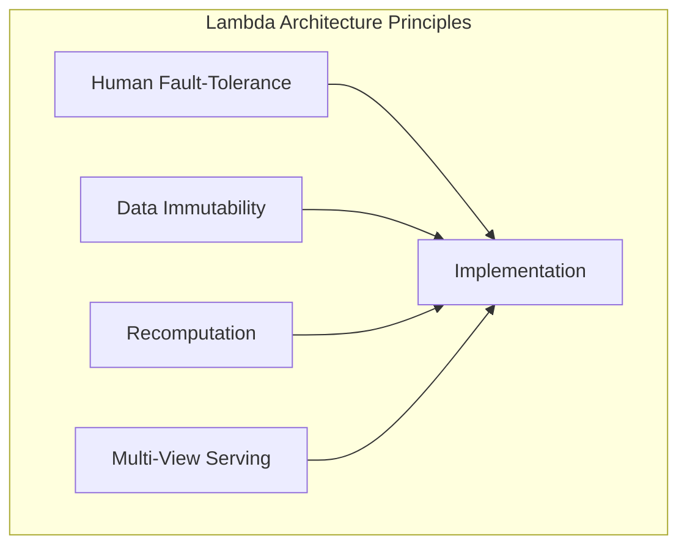
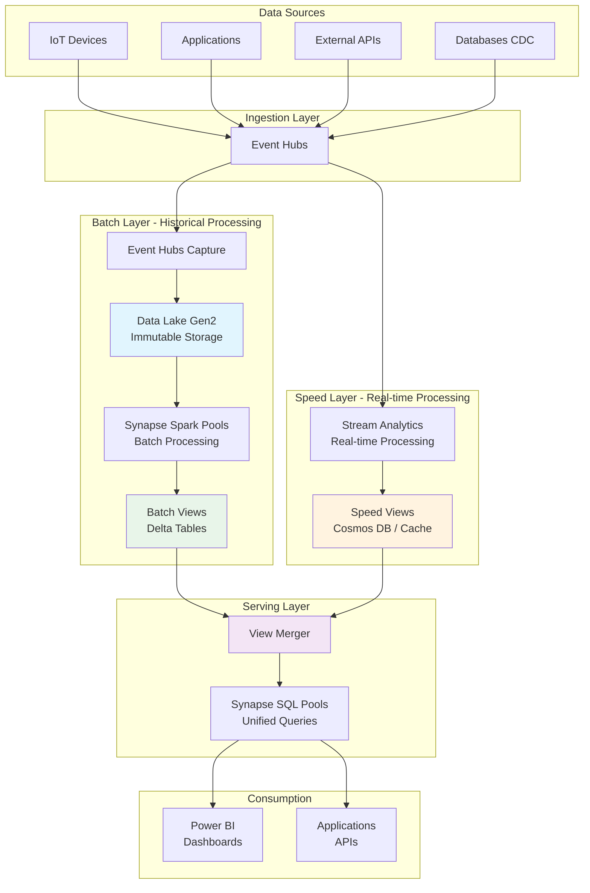
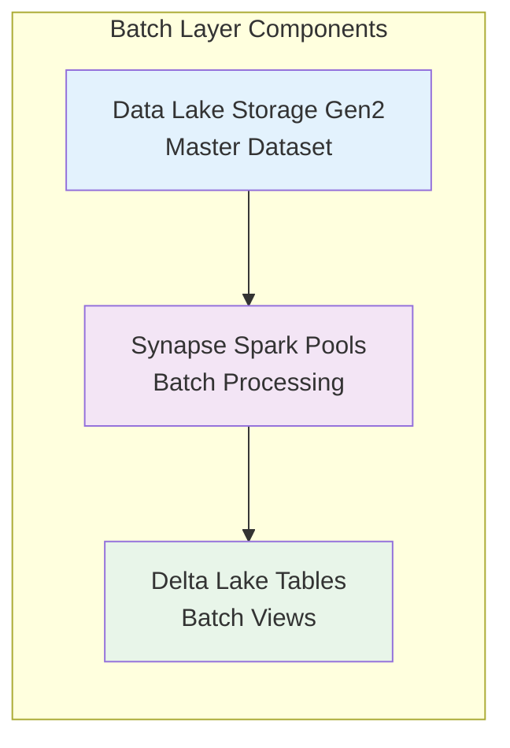
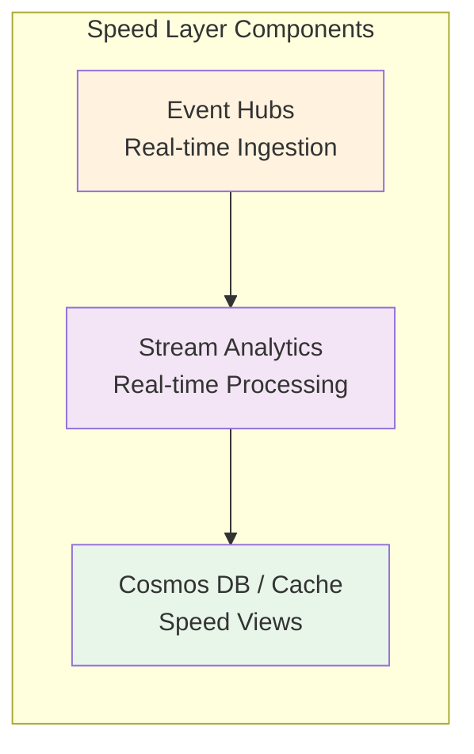
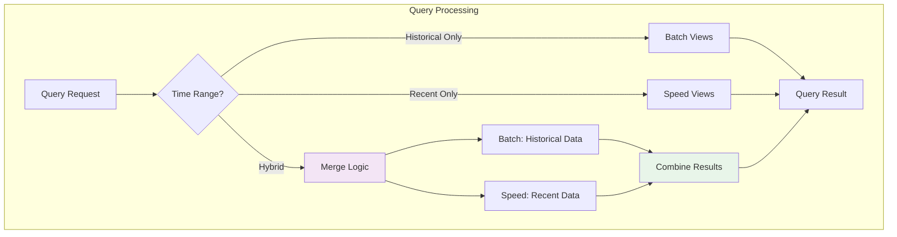
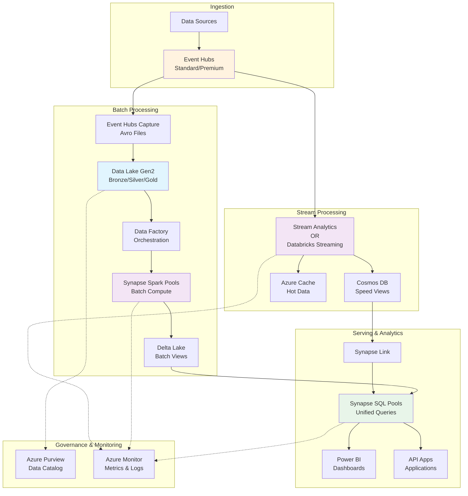
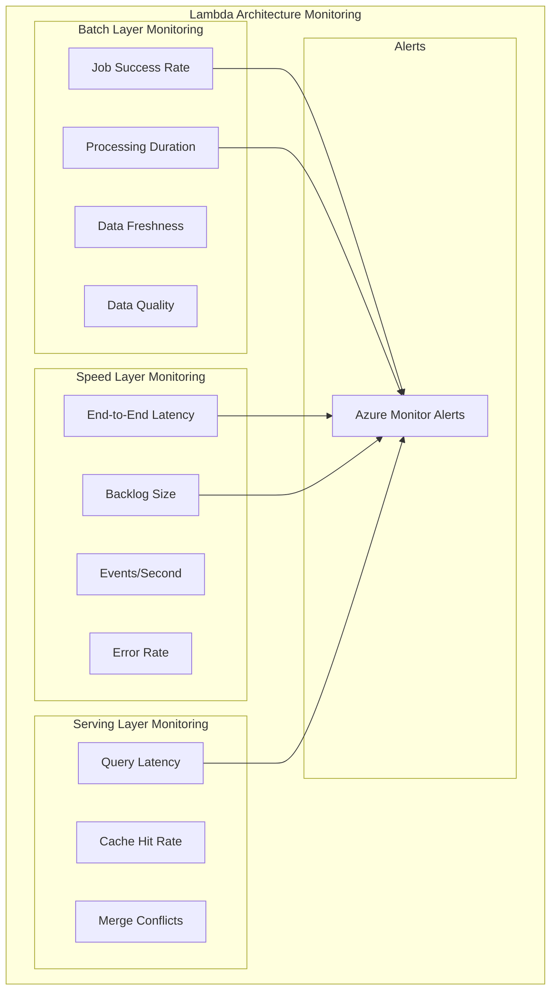
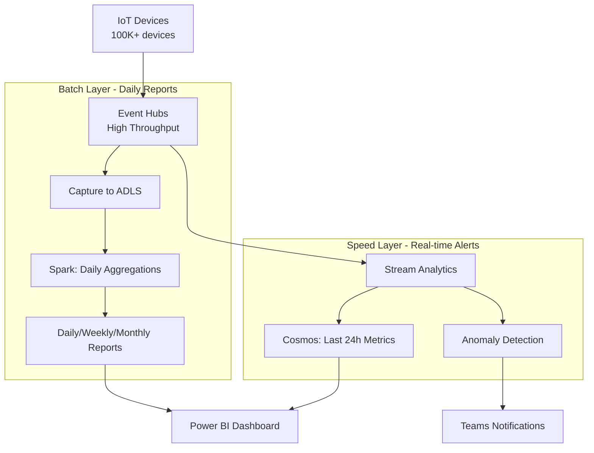
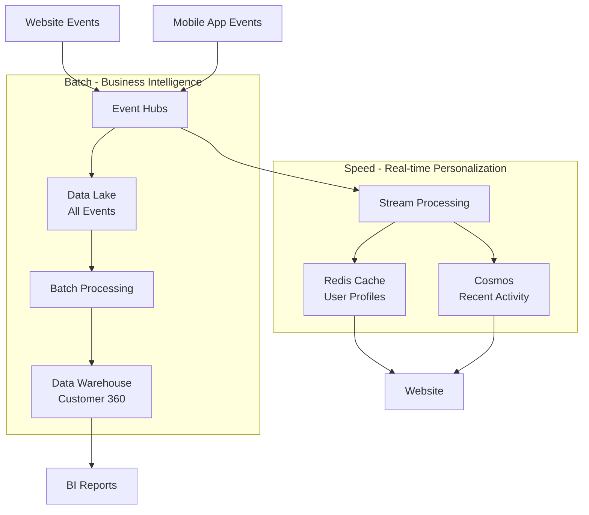
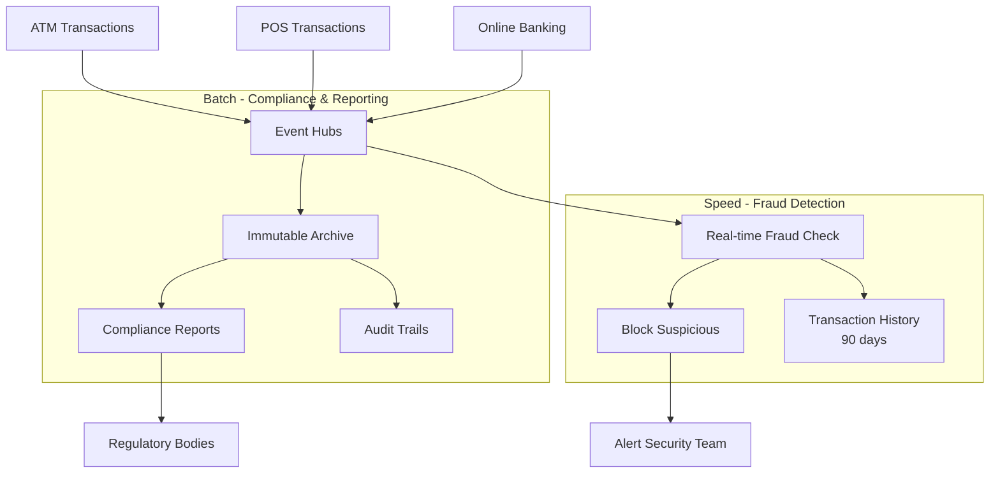

# Lambda Architecture Pattern

> **🏠 [Home](../../../README.md)** | **📖 [Architecture Patterns](../README.md)** | **⚡ [Streaming Architectures](README.md)** | **Lambda Architecture**


Comprehensive guide to implementing Lambda Architecture on Azure for combining batch and real-time stream processing.

---

## Table of Contents

- [Overview](#overview)
- [Architecture Components](#architecture-components)
- [Azure Implementation](#azure-implementation)
- [Design Patterns](#design-patterns)
- [Performance Optimization](#performance-optimization)
- [Monitoring & Operations](#monitoring-operations)
- [Best Practices](#best-practices)
- [Common Challenges](#common-challenges)
- [Use Cases](#use-cases)

---

## Overview

### What is Lambda Architecture?

Lambda Architecture is a data-processing architecture designed to handle massive quantities of data by taking advantage of both batch and stream-processing methods. The architecture balances latency, throughput, and fault-tolerance by using batch processing for comprehensive and accurate views, while simultaneously using real-time stream processing for low-latency approximate results.

### Key Principles



1. **Human Fault-Tolerance**: System should be resilient to human error through recomputation
2. **Data Immutability**: Raw data is never modified, only appended
3. **Recomputation**: Ability to recompute views from raw data
4. **Multi-View Serving**: Combine batch and real-time views for complete picture

### Architecture Diagram



---

## Architecture Components

### 1. Batch Layer

The batch layer stores the immutable, constantly growing master dataset and precomputes batch views.

#### Characteristics

| Aspect | Description |
|--------|-------------|
| **Latency** | Hours to days |
| **Accuracy** | 100% accurate, complete processing |
| **Complexity** | Can handle complex computations |
| **Fault Tolerance** | High - can recompute from source |
| **Data Volume** | Handles unlimited data volumes |

#### Azure Services Mapping



| Component | Azure Service | Purpose |
|-----------|---------------|---------|
| **Master Dataset** | Data Lake Storage Gen2 | Immutable storage of all raw data |
| **Batch Compute** | Synapse Spark Pools | Complex batch processing |
| **Batch Views** | Delta Lake Tables | Precomputed aggregations |
| **Orchestration** | Azure Data Factory | Batch job scheduling |
| **Catalog** | Synapse Metastore | Metadata management |

#### Implementation Example

```python
# Batch Layer Processing with PySpark
from pyspark.sql import SparkSession
from delta.tables import DeltaTable
from datetime import datetime, timedelta

class BatchLayer:
    """Batch layer for Lambda architecture implementing comprehensive data processing"""

    def __init__(self, spark: SparkSession):
        self.spark = spark
        self.master_dataset_path = "abfss://master@datalake.dfs.core.windows.net/raw"
        self.batch_views_path = "abfss://serving@datalake.dfs.core.windows.net/batch"

    def process_batch_view(self, view_name: str, start_date: str, end_date: str):
        """
        Process batch view with complete accuracy over historical data

        Args:
            view_name: Name of the batch view to compute
            start_date: Start date for processing (YYYY-MM-DD)
            end_date: End date for processing (YYYY-MM-DD)
        """
        print(f"Processing batch view: {view_name}")
        print(f"Date range: {start_date} to {end_date}")

        # Read master dataset
        master_df = self.spark.read.format("delta") \
            .load(self.master_dataset_path) \
            .filter(f"event_date >= '{start_date}' AND event_date <= '{end_date}'")

        # Example: Device telemetry aggregations
        if view_name == "device_daily_metrics":
            batch_view = self._compute_device_metrics(master_df)

        # Example: User activity summaries
        elif view_name == "user_activity_summary":
            batch_view = self._compute_user_activity(master_df)

        # Write batch view
        output_path = f"{self.batch_views_path}/{view_name}"

        batch_view.write \
            .format("delta") \
            .mode("overwrite") \
            .partitionBy("batch_date") \
            .option("overwriteSchema", "true") \
            .save(output_path)

        # Optimize for queries
        DeltaTable.forPath(self.spark, output_path).optimize().executeCompaction()

        print(f"Batch view {view_name} processed successfully")

    def _compute_device_metrics(self, df):
        """Compute comprehensive device metrics"""
        return df.groupBy("device_id", "event_date") \
            .agg(
                count("*").alias("event_count"),
                avg("temperature").alias("avg_temperature"),
                max("temperature").alias("max_temperature"),
                min("temperature").alias("min_temperature"),
                stddev("temperature").alias("stddev_temperature"),
                percentile_approx("temperature", 0.5).alias("median_temperature"),
                sum("energy_consumed").alias("total_energy"),
                countDistinct("user_id").alias("unique_users")
            ) \
            .withColumn("batch_date", current_date()) \
            .withColumn("batch_timestamp", current_timestamp())

    def _compute_user_activity(self, df):
        """Compute user activity patterns"""
        from pyspark.sql.functions import (
            col, count, sum, avg, min, max,
            hour, dayofweek, countDistinct,
            when, lit, current_date, current_timestamp
        )

        return df.groupBy("user_id", "event_date") \
            .agg(
                count("*").alias("total_events"),
                countDistinct("device_id").alias("unique_devices"),
                sum(when(col("event_type") == "login", 1).otherwise(0)).alias("login_count"),
                sum(when(col("event_type") == "transaction", 1).otherwise(0)).alias("transaction_count"),
                avg("session_duration").alias("avg_session_duration"),
                max("session_duration").alias("max_session_duration"),
                sum("revenue").alias("total_revenue")
            ) \
            .withColumn("batch_date", current_date()) \
            .withColumn("batch_timestamp", current_timestamp())

    def rebuild_view_from_scratch(self, view_name: str):
        """
        Rebuild entire view from master dataset
        Demonstrates recomputation capability
        """
        print(f"Rebuilding {view_name} from scratch...")

        # Get date range from master dataset
        date_range = self.spark.read.format("delta") \
            .load(self.master_dataset_path) \
            .agg(
                min("event_date").alias("min_date"),
                max("event_date").alias("max_date")
            ) \
            .first()

        # Process entire history
        self.process_batch_view(
            view_name,
            str(date_range.min_date),
            str(date_range.max_date)
        )
```

---

### 2. Speed Layer

The speed layer processes data streams in real-time to provide low-latency views, compensating for the batch layer's high latency.

#### Characteristics

| Aspect | Description |
|--------|-------------|
| **Latency** | Milliseconds to seconds |
| **Accuracy** | Approximate, eventually consistent |
| **Complexity** | Simpler processing (incremental) |
| **Fault Tolerance** | Medium - state can be reconstructed |
| **Data Volume** | Recent data only (windowed) |

#### Azure Services Mapping



| Component | Azure Service | Purpose |
|-----------|---------------|---------|
| **Stream Ingestion** | Event Hubs | Real-time event ingestion |
| **Stream Processing** | Stream Analytics / Databricks | Real-time computations |
| **Speed Views** | Cosmos DB | Low-latency data access |
| **Caching** | Azure Cache for Redis | Sub-millisecond reads |
| **State Store** | Cosmos DB / Table Storage | Stateful stream processing |

#### Implementation Example

```sql
-- Stream Analytics Query for Speed Layer
-- Real-time device metrics with 1-minute tumbling windows

WITH DeviceMetrics AS (
    SELECT
        deviceId,
        System.Timestamp() AS WindowEnd,
        COUNT(*) AS EventCount,
        AVG(temperature) AS AvgTemperature,
        MAX(temperature) AS MaxTemperature,
        MIN(temperature) AS MinTemperature,
        SUM(energyConsumed) AS TotalEnergy,
        COUNT(DISTINCT userId) AS UniqueUsers
    FROM
        EventHubInput TIMESTAMP BY eventTimestamp
    GROUP BY
        deviceId,
        TumblingWindow(minute, 1)
),

Anomalies AS (
    -- Detect anomalies in real-time
    SELECT
        deviceId,
        WindowEnd,
        AvgTemperature,
        CASE
            WHEN AvgTemperature > 85 THEN 'HIGH_TEMP'
            WHEN AvgTemperature < 32 THEN 'LOW_TEMP'
            ELSE 'NORMAL'
        END AS AlertLevel
    FROM
        DeviceMetrics
)

-- Output to Cosmos DB for real-time queries
SELECT
    dm.deviceId,
    dm.WindowEnd AS timestamp,
    dm.EventCount AS eventCount,
    dm.AvgTemperature AS avgTemp,
    dm.MaxTemperature AS maxTemp,
    dm.MinTemperature AS minTemp,
    dm.TotalEnergy AS totalEnergy,
    dm.UniqueUsers AS uniqueUsers,
    a.AlertLevel AS alertLevel,
    'SPEED_LAYER' AS source,
    System.Timestamp() AS processedAt
INTO
    CosmosDBOutput
FROM
    DeviceMetrics dm
    LEFT JOIN Anomalies a ON dm.deviceId = a.deviceId AND dm.WindowEnd = a.WindowEnd
```

#### Databricks Structured Streaming Example

```python
# Speed Layer with Databricks Structured Streaming
from pyspark.sql.functions import *
from pyspark.sql.types import *

class SpeedLayer:
    """Speed layer for real-time stream processing"""

    def __init__(self, spark):
        self.spark = spark
        self.checkpoint_path = "abfss://checkpoints@datalake.dfs.core.windows.net/speed"

    def process_real_time_metrics(self):
        """Process real-time metrics from Event Hubs"""

        # Read from Event Hubs
        df = self.spark.readStream \
            .format("eventhubs") \
            .option("eventhubs.connectionString", self._get_connection_string()) \
            .option("eventhubs.consumerGroup", "$Default") \
            .option("maxEventsPerTrigger", 10000) \
            .load()

        # Parse JSON events
        events_df = df.select(
            from_json(col("body").cast("string"), self._get_schema()).alias("event")
        ).select("event.*")

        # Compute real-time metrics with watermarking
        metrics_df = events_df \
            .withWatermark("eventTimestamp", "2 minutes") \
            .groupBy(
                "deviceId",
                window("eventTimestamp", "1 minute")
            ) \
            .agg(
                count("*").alias("eventCount"),
                avg("temperature").alias("avgTemperature"),
                max("temperature").alias("maxTemperature"),
                min("temperature").alias("minTemperature"),
                sum("energyConsumed").alias("totalEnergy")
            ) \
            .select(
                col("deviceId"),
                col("window.start").alias("windowStart"),
                col("window.end").alias("windowEnd"),
                col("eventCount"),
                col("avgTemperature"),
                col("maxTemperature"),
                col("minTemperature"),
                col("totalEnergy"),
                lit("SPEED_LAYER").alias("source"),
                current_timestamp().alias("processedAt")
            )

        # Write to Cosmos DB
        query = metrics_df.writeStream \
            .outputMode("append") \
            .format("cosmos.oltp") \
            .option("spark.synapse.linkedService", "CosmosDBLinkedService") \
            .option("spark.cosmos.container", "speed_views") \
            .option("checkpointLocation", f"{self.checkpoint_path}/metrics") \
            .start()

        return query

    def _get_schema(self):
        """Define event schema"""
        return StructType([
            StructField("deviceId", StringType(), False),
            StructField("eventTimestamp", TimestampType(), False),
            StructField("temperature", DoubleType(), True),
            StructField("energyConsumed", DoubleType(), True),
            StructField("userId", StringType(), True),
            StructField("eventType", StringType(), True)
        ])

    def _get_connection_string(self):
        """Get Event Hubs connection string from Key Vault"""
        # In production, use Azure Key Vault
        return "Endpoint=sb://..."
```

---

### 3. Serving Layer

The serving layer merges results from batch and speed layers to provide unified, low-latency query responses.

#### Query Merging Strategies



#### Implementation Patterns

##### Pattern 1: Time-Based Partitioning

```python
# Serving Layer - Query Merger
class ServingLayer:
    """Unified serving layer combining batch and speed views"""

    def __init__(self, synapse_connection, cosmos_connection):
        self.synapse = synapse_connection
        self.cosmos = cosmos_connection
        self.batch_lag_hours = 4  # Batch views lag by 4 hours

    def query_device_metrics(self, device_id: str, start_time: datetime, end_time: datetime):
        """
        Query device metrics combining batch and speed layers

        Args:
            device_id: Device identifier
            start_time: Query start time
            end_time: Query end time

        Returns:
            Combined results from both layers
        """
        current_time = datetime.utcnow()
        batch_cutoff = current_time - timedelta(hours=self.batch_lag_hours)

        results = []

        # Query batch layer for historical data
        if start_time < batch_cutoff:
            batch_end = min(end_time, batch_cutoff)
            batch_results = self._query_batch_layer(device_id, start_time, batch_end)
            results.extend(batch_results)

        # Query speed layer for recent data
        if end_time > batch_cutoff:
            speed_start = max(start_time, batch_cutoff)
            speed_results = self._query_speed_layer(device_id, speed_start, end_time)
            results.extend(speed_results)

        # Merge and deduplicate if there's overlap
        return self._merge_results(results)

    def _query_batch_layer(self, device_id: str, start_time: datetime, end_time: datetime):
        """Query Synapse SQL for batch views"""
        query = """
            SELECT
                device_id,
                timestamp,
                event_count,
                avg_temperature,
                max_temperature,
                min_temperature,
                total_energy,
                'BATCH' as source
            FROM batch_views.device_metrics
            WHERE device_id = @device_id
              AND timestamp >= @start_time
              AND timestamp <= @end_time
            ORDER BY timestamp
        """
        return self.synapse.execute(query, {
            'device_id': device_id,
            'start_time': start_time,
            'end_time': end_time
        })

    def _query_speed_layer(self, device_id: str, start_time: datetime, end_time: datetime):
        """Query Cosmos DB for speed views"""
        query = {
            "query": """
                SELECT
                    c.deviceId as device_id,
                    c.windowEnd as timestamp,
                    c.eventCount as event_count,
                    c.avgTemperature as avg_temperature,
                    c.maxTemperature as max_temperature,
                    c.minTemperature as min_temperature,
                    c.totalEnergy as total_energy,
                    'SPEED' as source
                FROM c
                WHERE c.deviceId = @device_id
                  AND c.windowEnd >= @start_time
                  AND c.windowEnd <= @end_time
                ORDER BY c.windowEnd
            """,
            "parameters": [
                {"name": "@device_id", "value": device_id},
                {"name": "@start_time", "value": start_time.isoformat()},
                {"name": "@end_time", "value": end_time.isoformat()}
            ]
        }
        return self.cosmos.query_items(query, partition_key=device_id)

    def _merge_results(self, results: list):
        """Merge results from batch and speed layers"""
        # Sort by timestamp
        sorted_results = sorted(results, key=lambda x: x['timestamp'])

        # Deduplicate if there's overlap (prefer batch layer for accuracy)
        deduplicated = {}
        for record in sorted_results:
            key = f"{record['device_id']}_{record['timestamp']}"
            if key not in deduplicated or record['source'] == 'BATCH':
                deduplicated[key] = record

        return list(deduplicated.values())
```

##### Pattern 2: Materialized Views

```sql
-- Create unified view in Synapse SQL
CREATE VIEW unified_device_metrics
AS
SELECT
    device_id,
    timestamp,
    event_count,
    avg_temperature,
    max_temperature,
    min_temperature,
    total_energy,
    source
FROM (
    -- Batch layer (historical, complete)
    SELECT
        device_id,
        timestamp,
        event_count,
        avg_temperature,
        max_temperature,
        min_temperature,
        total_energy,
        'BATCH' as source
    FROM batch_views.device_metrics
    WHERE timestamp < DATEADD(hour, -4, GETUTCDATE())

    UNION ALL

    -- Speed layer (recent, approximate)
    SELECT
        deviceId as device_id,
        windowEnd as timestamp,
        eventCount as event_count,
        avgTemperature as avg_temperature,
        maxTemperature as max_temperature,
        minTemperature as min_temperature,
        totalEnergy as total_energy,
        'SPEED' as source
    FROM OPENROWSET(
        'CosmosDB',
        'Account=...;Database=...;',
        speed_views
    ) WITH (
        deviceId varchar(50),
        windowEnd datetime2,
        eventCount bigint,
        avgTemperature float,
        maxTemperature float,
        minTemperature float,
        totalEnergy float
    ) AS speed
    WHERE windowEnd >= DATEADD(hour, -4, GETUTCDATE())
) AS combined;
```

---

## Azure Implementation

### Reference Architecture



### Azure Service Configuration

#### Event Hubs Configuration

```json
{
  "name": "lambda-eventhub",
  "sku": "Standard",
  "properties": {
    "partitionCount": 16,
    "messageRetentionInDays": 7,
    "captureDescription": {
      "enabled": true,
      "encoding": "Avro",
      "intervalInSeconds": 300,
      "sizeLimitInBytes": 314572800,
      "destination": {
        "name": "EventHubArchive.AzureDataLake",
        "properties": {
          "storageAccountResourceId": "/subscriptions/.../resourceGroups/.../providers/Microsoft.Storage/storageAccounts/datalake",
          "blobContainer": "raw-events",
          "archiveNameFormat": "{Namespace}/{EventHub}/{PartitionId}/{Year}/{Month}/{Day}/{Hour}/{Minute}/{Second}"
        }
      }
    }
  }
}
```

#### Synapse Spark Pool Configuration

```json
{
  "name": "batch-processing-pool",
  "properties": {
    "nodeSize": "Large",
    "nodeSizeFamily": "MemoryOptimized",
    "autoScale": {
      "enabled": true,
      "minNodeCount": 3,
      "maxNodeCount": 20
    },
    "autoPause": {
      "enabled": true,
      "delayInMinutes": 15
    },
    "sparkVersion": "3.3",
    "sparkConfig": {
      "spark.dynamicAllocation.enabled": "true",
      "spark.dynamicAllocation.minExecutors": "3",
      "spark.dynamicAllocation.maxExecutors": "20",
      "spark.sql.adaptive.enabled": "true",
      "spark.sql.adaptive.coalescePartitions.enabled": "true"
    }
  }
}
```

#### Stream Analytics Job Configuration

```json
{
  "name": "speed-layer-job",
  "properties": {
    "sku": {
      "name": "Standard"
    },
    "eventsOutOfOrderPolicy": "Adjust",
    "outputErrorPolicy": "Drop",
    "eventsOutOfOrderMaxDelayInSeconds": 10,
    "eventsLateArrivalMaxDelayInSeconds": 5,
    "compatibilityLevel": "1.2",
    "transformation": {
      "name": "Transformation",
      "properties": {
        "streamingUnits": 6,
        "query": "..."
      }
    }
  }
}
```

---

## Design Patterns

### Pattern 1: Incremental Batch Processing

```python
# Incremental batch processing to reduce recomputation
class IncrementalBatchProcessor:
    """Process only new/changed data in batch layer"""

    def __init__(self, spark):
        self.spark = spark
        self.checkpoint_table = "batch_checkpoints.processing_watermarks"

    def process_incremental_batch(self, view_name: str):
        """Process only data since last successful batch"""

        # Get last processed timestamp
        last_processed = self._get_last_watermark(view_name)

        # Read only new data
        new_data = self.spark.read.format("delta") \
            .load("abfss://master@datalake.dfs.core.windows.net/raw") \
            .filter(f"event_timestamp > '{last_processed}'")

        # Process new data
        processed_view = self._process_data(new_data, view_name)

        # Merge with existing view (upsert)
        self._merge_with_existing(processed_view, view_name)

        # Update watermark
        self._update_watermark(view_name, new_data.agg(max("event_timestamp")).first()[0])

    def _merge_with_existing(self, new_data, view_name):
        """Merge new batch results with existing using Delta merge"""
        from delta.tables import DeltaTable

        target_path = f"abfss://serving@datalake.dfs.core.windows.net/batch/{view_name}"

        # Check if target exists
        if DeltaTable.isDeltaTable(self.spark, target_path):
            target = DeltaTable.forPath(self.spark, target_path)

            # Merge (upsert) logic
            target.alias("target").merge(
                new_data.alias("source"),
                "target.device_id = source.device_id AND target.timestamp = source.timestamp"
            ).whenMatchedUpdateAll() \
             .whenNotMatchedInsertAll() \
             .execute()
        else:
            # First run - just write
            new_data.write.format("delta") \
                .mode("overwrite") \
                .partitionBy("date") \
                .save(target_path)
```

### Pattern 2: Speed Layer Compaction

```python
# Compact speed layer data before archiving to batch layer
class SpeedLayerCompactor:
    """Compact and clean speed layer data"""

    def __init__(self, cosmos_client):
        self.cosmos = cosmos_client
        self.speed_container = self.cosmos.get_database("speed_layer") \
            .get_container("metrics")

    def compact_to_batch(self, cutoff_time: datetime):
        """
        Compact speed layer data older than cutoff into batch layer
        Then delete from speed layer to control costs
        """
        # Query old speed layer data
        query = """
            SELECT * FROM c
            WHERE c.windowEnd < @cutoff_time
            ORDER BY c.windowEnd
        """

        old_data = list(self.speed_container.query_items(
            query=query,
            parameters=[{"name": "@cutoff_time", "value": cutoff_time.isoformat()}],
            enable_cross_partition_query=True
        ))

        if old_data:
            # Write to batch layer (append to existing)
            self._append_to_batch_layer(old_data)

            # Delete from speed layer
            for item in old_data:
                self.speed_container.delete_item(
                    item=item['id'],
                    partition_key=item['deviceId']
                )

            print(f"Compacted {len(old_data)} records from speed to batch layer")

    def _append_to_batch_layer(self, data: list):
        """Append compacted speed data to batch layer"""
        # Convert to DataFrame and write to Delta Lake
        # This ensures data is preserved before deletion
        pass
```

### Pattern 3: Smart Query Routing

```python
# Route queries intelligently based on requirements
class QueryRouter:
    """Route queries to optimal layer based on requirements"""

    def route_query(self, query_spec: dict):
        """
        Route query based on characteristics:
        - Accuracy requirements
        - Latency requirements
        - Time range
        - Data freshness
        """
        accuracy_required = query_spec.get('accuracy', 'approximate')
        max_latency_ms = query_spec.get('max_latency_ms', 1000)
        time_range = query_spec.get('time_range')

        # High accuracy required -> prefer batch layer
        if accuracy_required == 'exact':
            if self._is_data_in_batch(time_range):
                return self._query_batch_layer(query_spec)
            else:
                # Data not yet in batch, wait or query speed
                return self._wait_or_speed(query_spec, max_latency_ms)

        # Low latency required -> prefer speed layer
        elif max_latency_ms < 100:
            return self._query_speed_layer(query_spec)

        # Balanced -> use serving layer merger
        else:
            return self._query_serving_layer(query_spec)
```

---

## Performance Optimization

### Batch Layer Optimization

#### Delta Lake Optimizations

```python
# Optimize Delta tables for query performance
from delta.tables import DeltaTable

def optimize_batch_views(spark, view_path: str, partition_cols: list):
    """
    Optimize Delta Lake tables with:
    - Compaction (merge small files)
    - Z-Ordering (multi-dimensional clustering)
    - Vacuum (remove old versions)
    """
    delta_table = DeltaTable.forPath(spark, view_path)

    # Compact small files
    delta_table.optimize().executeCompaction()

    # Z-Order by commonly filtered columns
    delta_table.optimize().executeZOrderBy(*partition_cols)

    # Vacuum old versions (keep 7 days for time travel)
    delta_table.vacuum(retentionHours=168)

    # Update statistics
    spark.sql(f"ANALYZE TABLE delta.`{view_path}` COMPUTE STATISTICS FOR ALL COLUMNS")
```

#### Partitioning Strategy

```python
# Optimal partitioning for batch views
partitioning_strategies = {
    "daily_metrics": {
        "partition_by": ["year", "month", "day"],
        "bucket_by": "device_id",
        "buckets": 100,
        "z_order_by": ["device_id", "timestamp"]
    },
    "hourly_metrics": {
        "partition_by": ["date", "hour"],
        "z_order_by": ["device_id", "timestamp"]
    },
    "user_aggregates": {
        "partition_by": ["date"],
        "bucket_by": "user_id",
        "buckets": 200,
        "z_order_by": ["user_id", "event_type"]
    }
}
```

### Speed Layer Optimization

#### Stream Analytics Performance

```sql
-- Optimize Stream Analytics with appropriate windowing
-- Use tumbling windows for non-overlapping aggregations
SELECT
    deviceId,
    System.Timestamp() AS WindowEnd,
    AVG(temperature) AS avgTemp
FROM
    Input TIMESTAMP BY eventTime
GROUP BY
    deviceId,
    TumblingWindow(minute, 1)  -- Non-overlapping, efficient

-- Use hopping windows for sliding aggregations
SELECT
    deviceId,
    System.Timestamp() AS WindowEnd,
    AVG(temperature) AS avgTemp
FROM
    Input TIMESTAMP BY eventTime
GROUP BY
    deviceId,
    HoppingWindow(minute, 5, 1)  -- 5-min window, 1-min hop

-- Use session windows for event bursts
SELECT
    deviceId,
    System.Timestamp() AS WindowEnd,
    COUNT(*) AS eventCount
FROM
    Input TIMESTAMP BY eventTime
GROUP BY
    deviceId,
    SessionWindow(minute, 5, 10)  -- 5-min timeout, 10-min max
```

#### Cosmos DB Optimization

```python
# Optimize Cosmos DB for speed layer
cosmos_optimization_config = {
    "partition_key": "/deviceId",  # Distribute load evenly
    "indexing_policy": {
        "indexingMode": "consistent",
        "automatic": True,
        "includedPaths": [
            {"path": "/deviceId/?"},
            {"path": "/windowEnd/?"},
            {"path": "/avgTemperature/?"}
        ],
        "excludedPaths": [
            {"path": "/*"}  # Exclude everything else
        ]
    },
    "default_ttl": 86400 * 7,  # 7 days TTL (speed layer is temporary)
    "throughput": {
        "autoscale": True,
        "max_throughput": 10000  # Scale up to 10K RU/s
    }
}
```

---

## Monitoring & Operations

### Key Metrics

#### Batch Layer Metrics

```python
# Metrics to monitor for batch layer health
batch_layer_metrics = {
    "processing": {
        "batch_job_duration_minutes": {
            "threshold": 240,  # Alert if > 4 hours
            "aggregation": "avg"
        },
        "batch_job_success_rate": {
            "threshold": 0.95,  # Alert if < 95%
            "aggregation": "avg"
        },
        "records_processed_per_batch": {
            "threshold": 1000000,  # Alert if < 1M (may indicate issues)
            "aggregation": "sum"
        }
    },
    "data_quality": {
        "data_freshness_hours": {
            "threshold": 6,  # Alert if > 6 hours old
            "aggregation": "max"
        },
        "null_value_percentage": {
            "threshold": 0.05,  # Alert if > 5% nulls
            "aggregation": "avg"
        },
        "duplicate_records_percentage": {
            "threshold": 0.01,  # Alert if > 1% duplicates
            "aggregation": "avg"
        }
    },
    "storage": {
        "delta_table_size_gb": {
            "threshold": 5000,  # Alert if > 5TB
            "aggregation": "sum"
        },
        "small_files_count": {
            "threshold": 10000,  # Alert if > 10K small files
            "aggregation": "count"
        }
    }
}
```

#### Speed Layer Metrics

```python
# Metrics to monitor for speed layer health
speed_layer_metrics = {
    "latency": {
        "end_to_end_latency_ms": {
            "threshold": 5000,  # Alert if > 5 seconds
            "aggregation": "p95"
        },
        "processing_latency_ms": {
            "threshold": 1000,  # Alert if > 1 second
            "aggregation": "p95"
        }
    },
    "throughput": {
        "events_per_second": {
            "threshold": 10000,  # Alert if > capacity
            "aggregation": "max"
        },
        "backlog_events": {
            "threshold": 100000,  # Alert if backlog grows
            "aggregation": "max"
        }
    },
    "quality": {
        "dropped_events_percentage": {
            "threshold": 0.01,  # Alert if > 1% dropped
            "aggregation": "avg"
        },
        "out_of_order_events_percentage": {
            "threshold": 0.05,  # Alert if > 5% out of order
            "aggregation": "avg"
        }
    }
}
```

### Monitoring Dashboard



---

## Best Practices

### Data Immutability

```python
# Always preserve raw data - never modify
class DataImmutabilityPattern:
    """Ensure data immutability in batch layer"""

    def ingest_data(self, source_data):
        """
        Ingest data preserving original format
        Store metadata about ingestion
        """
        raw_data_with_metadata = source_data.withColumn(
            "ingestion_metadata",
            struct(
                current_timestamp().alias("ingested_at"),
                lit("event_hub").alias("source_system"),
                input_file_name().alias("source_file"),
                lit("v1").alias("schema_version")
            )
        )

        # Write as immutable (append-only)
        raw_data_with_metadata.write \
            .format("delta") \
            .mode("append") \
            .partitionBy("ingestion_date") \
            .save("abfss://master@datalake.dfs.core.windows.net/raw")

        # Never use mode("overwrite") on master dataset
```

### Recomputation Capability

```python
# Maintain ability to recompute views from master dataset
class RecomputationPattern:
    """Enable recomputation for human fault-tolerance"""

    def recompute_view(self, view_name: str, reason: str):
        """
        Recompute entire view from master dataset
        Useful when logic changes or errors discovered
        """
        print(f"Recomputing {view_name}")
        print(f"Reason: {reason}")

        # Archive old view
        self._archive_old_view(view_name)

        # Reprocess from master dataset
        master_data = self.spark.read.format("delta") \
            .load("abfss://master@datalake.dfs.core.windows.net/raw")

        # Apply current logic
        new_view = self._apply_current_logic(master_data, view_name)

        # Replace old view
        new_view.write \
            .format("delta") \
            .mode("overwrite") \
            .save(f"abfss://serving@datalake.dfs.core.windows.net/batch/{view_name}")

        print(f"Recomputation complete for {view_name}")
```

### Idempotent Processing

```python
# Ensure batch jobs are idempotent
class IdempotentProcessing:
    """Batch jobs should produce same result when run multiple times"""

    def process_batch(self, batch_date: str):
        """
        Process batch for specific date
        Can be run multiple times safely
        """
        # Use deterministic partitioning
        partition_filter = f"event_date = '{batch_date}'"

        # Read data for specific partition only
        data = self.spark.read.format("delta") \
            .load("abfss://master@datalake.dfs.core.windows.net/raw") \
            .filter(partition_filter)

        # Process
        result = self._process(data)

        # Overwrite specific partition only (idempotent)
        result.write \
            .format("delta") \
            .mode("overwrite") \
            .option("replaceWhere", partition_filter) \
            .save("abfss://serving@datalake.dfs.core.windows.net/batch/metrics")
```

---

## Common Challenges

### Challenge 1: Managing Dual Codebases

**Problem**: Maintaining separate code for batch and stream processing

**Solution**:

```python
# Abstract common logic into shared modules
class SharedMetricsLogic:
    """Business logic shared between batch and speed layers"""

    @staticmethod
    def calculate_device_metrics(df, group_cols):
        """
        Same metric calculation for both batch and stream
        Use this in both Spark batch and Structured Streaming
        """
        from pyspark.sql.functions import avg, max, min, count, sum

        return df.groupBy(*group_cols).agg(
            count("*").alias("event_count"),
            avg("temperature").alias("avg_temperature"),
            max("temperature").alias("max_temperature"),
            min("temperature").alias("min_temperature"),
            sum("energy_consumed").alias("total_energy")
        )

# Use in batch layer
batch_metrics = SharedMetricsLogic.calculate_device_metrics(
    batch_df,
    ["device_id", "event_date"]
)

# Use in speed layer (streaming)
speed_metrics = SharedMetricsLogic.calculate_device_metrics(
    streaming_df,
    ["device_id", window("event_timestamp", "1 minute")]
)
```

### Challenge 2: Query Complexity

**Problem**: Complex query routing and merging logic

**Solution**: Use materialized views in Synapse SQL

```sql
-- Simplified querying with materialized view
CREATE MATERIALIZED VIEW mv_unified_metrics
WITH (DISTRIBUTION = HASH(device_id))
AS
SELECT * FROM unified_device_metrics;

-- Queries are simple now
SELECT * FROM mv_unified_metrics
WHERE device_id = 'device-123'
  AND timestamp >= DATEADD(day, -7, GETUTCDATE());
```

### Challenge 3: Eventual Consistency

**Problem**: Speed and batch layers may have different values for same data

**Solution**: Document and communicate consistency guarantees

```python
class ConsistencyGuarantees:
    """Document consistency model for applications"""

    CONSISTENCY_MODEL = {
        "real_time_queries": {
            "max_staleness_seconds": 10,
            "accuracy": "approximate (±5%)",
            "source": "speed_layer"
        },
        "historical_queries": {
            "max_staleness_hours": 4,
            "accuracy": "exact (100%)",
            "source": "batch_layer"
        },
        "recent_queries": {
            "max_staleness_minutes": 5,
            "accuracy": "converging",
            "source": "merged_layers",
            "note": "Batch layer takes precedence when available"
        }
    }
```

---

## Use Cases

### Use Case 1: IoT Device Monitoring



### Use Case 2: E-commerce Analytics



### Use Case 3: Financial Transaction Processing



---

## Additional Resources

### Documentation

- [Azure Event Hubs Documentation](https://docs.microsoft.com/azure/event-hubs/)
- [Azure Stream Analytics Documentation](https://docs.microsoft.com/azure/stream-analytics/)
- [Azure Synapse Analytics Documentation](https://docs.microsoft.com/azure/synapse-analytics/)
- [Delta Lake Documentation](https://docs.delta.io/)

### Code Examples

Refer to the implementation examples provided throughout this guide for:
- Lambda Architecture patterns and configurations
- Event Hubs Capture setup and processing
- Stream Analytics query optimization

### Related Patterns

- [Kappa Architecture](kappa-architecture.md) - Stream-only alternative
- [Event Sourcing](event-sourcing.md) - Event-driven complement
- [CQRS Pattern](cqrs-pattern.md) - Read/write optimization

---

**Last Updated**: 2025-01-28
**Pattern Status**: Production Ready
**Complexity Level**: Advanced
