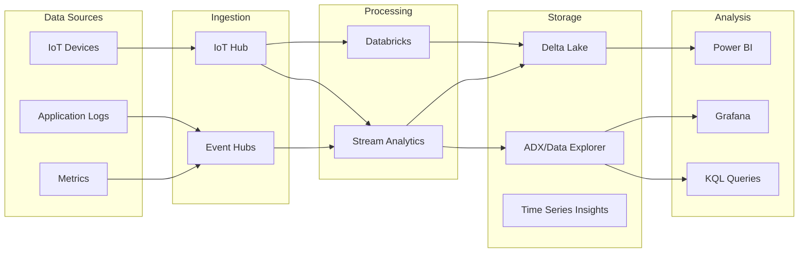

# 📈 Time Series Analytics Patterns

> __🏠 [Home](../../../README.md)__ | __🏗️ [Architecture](../README.md)__ | __⚡ Streaming Architectures__ | __Time Series__


Architecture patterns for time series data ingestion, storage, and analysis.

---

## 🎯 Overview

Time series analytics patterns handle high-volume, time-stamped data from IoT devices, sensors, logs, and metrics.

---

## 🏗️ Architecture



---

## 🔧 Implementation

### Azure Data Explorer Ingestion

```kql
// Create table for time series data
.create table SensorReadings (
    DeviceId: string,
    Timestamp: datetime,
    Temperature: real,
    Humidity: real,
    Pressure: real
)

// Create streaming ingestion policy
.alter table SensorReadings policy streamingingestion enable

// Sample query - aggregation over time
SensorReadings
| where Timestamp > ago(24h)
| summarize
    AvgTemp = avg(Temperature),
    MaxTemp = max(Temperature),
    MinTemp = min(Temperature)
    by bin(Timestamp, 1h), DeviceId
| render timechart
```

### Anomaly Detection

```kql
// Detect anomalies using built-in functions
let anomalies = SensorReadings
| where Timestamp > ago(7d)
| make-series
    AvgTemp = avg(Temperature)
    on Timestamp step 1h
    by DeviceId
| extend anomalies = series_decompose_anomalies(AvgTemp);

anomalies
| mv-expand Timestamp, AvgTemp, anomalies
| where anomalies > 0
| project Timestamp, DeviceId, AvgTemp, AnomalyScore = anomalies
```

### Delta Lake Time Series

```python
from pyspark.sql import SparkSession
from pyspark.sql.functions import *
from delta.tables import DeltaTable

# Optimized time series table with Z-ordering
(spark.readStream
    .format("eventhubs")
    .options(**eventhub_config)
    .load()
    .writeStream
    .format("delta")
    .outputMode("append")
    .partitionBy("date")
    .option("checkpointLocation", "/checkpoints/timeseries")
    .toTable("bronze.sensor_readings"))

# Optimize for time-based queries
spark.sql("""
    OPTIMIZE bronze.sensor_readings
    ZORDER BY (device_id, timestamp)
""")

# Create silver layer with downsampled data
spark.sql("""
    CREATE OR REPLACE TABLE silver.sensor_hourly AS
    SELECT
        device_id,
        date_trunc('hour', timestamp) as hour,
        AVG(temperature) as avg_temp,
        MAX(temperature) as max_temp,
        MIN(temperature) as min_temp,
        COUNT(*) as reading_count
    FROM bronze.sensor_readings
    GROUP BY device_id, date_trunc('hour', timestamp)
""")
```

---

## 📊 Query Patterns

### Rolling Aggregations

```sql
-- Synapse SQL rolling window
SELECT
    device_id,
    timestamp,
    temperature,
    AVG(temperature) OVER (
        PARTITION BY device_id
        ORDER BY timestamp
        ROWS BETWEEN 59 PRECEDING AND CURRENT ROW
    ) as rolling_60min_avg
FROM sensor_readings
WHERE timestamp > DATEADD(day, -1, GETDATE());
```

### Gap Detection

```kql
// Find gaps in time series data
SensorReadings
| order by DeviceId, Timestamp asc
| extend PrevTimestamp = prev(Timestamp, 1)
| extend Gap = Timestamp - PrevTimestamp
| where Gap > 5m  // Expected interval is 1 minute
| project DeviceId, GapStart = PrevTimestamp, GapEnd = Timestamp, GapDuration = Gap
```

---

## 📚 Related Documentation

- [Stream Analytics](../../02-services/streaming-services/azure-stream-analytics/README.md)
- [Azure Data Explorer](../../02-services/analytics-compute/azure-synapse/data-explorer-pools/README.md)
- [IoT Hub Integration](../../04-implementation-guides/iot/README.md)

---

*Last Updated: January 2025*
