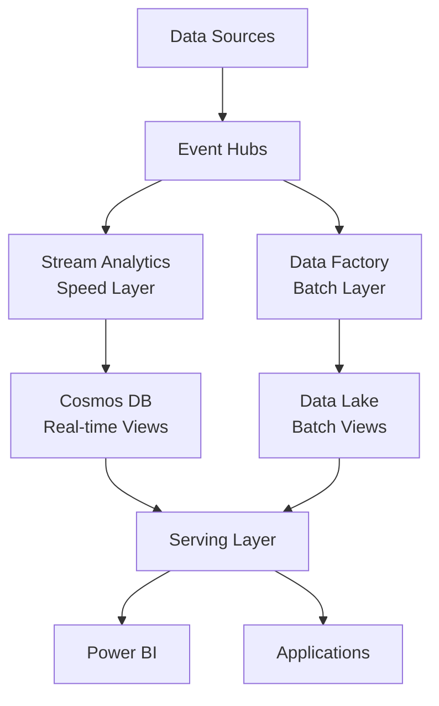
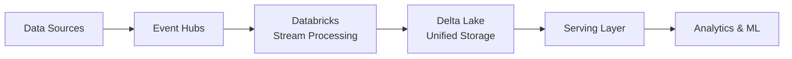

# 🚀 Implementation Guides

> __🏠 [Home](../../README.md)__ | __📖 [Documentation](../README.md)__ | __🚀 Implementation Guides__


Step-by-step implementation guides for common Cloud Scale Analytics scenarios and integration patterns.

---

## 🎯 Overview

Implementation guides provide detailed, hands-on instructions for deploying and configuring Cloud Scale Analytics solutions. Each guide includes prerequisites, step-by-step procedures, code samples, and troubleshooting tips.

### What You'll Find Here

- **Integration Scenarios**: Connect multiple Azure services together
- **ARM/Bicep Templates**: Infrastructure-as-Code deployment samples
- **Configuration Examples**: Real-world configuration patterns
- **Best Practices**: Proven approaches for production deployments
- **Troubleshooting**: Common issues and resolutions

---

## 📋 Prerequisites

Before starting any implementation guide, ensure you have:

### Required Access

- [ ] **Azure Subscription**: Active subscription with contributor access
- [ ] **Resource Group**: Existing or permission to create new
- [ ] **Service Principal**: For automated deployments (optional)
- [ ] **Azure CLI**: Version 2.50.0 or higher
- [ ] **PowerShell**: Version 7.0+ or Azure Cloud Shell

### Required Tools

```bash
# Azure CLI
az --version

# PowerShell (optional)
pwsh --version

# Bicep CLI (for IaC deployments)
az bicep version

# Git (for template downloads)
git --version
```

### Required Knowledge

- **Azure Fundamentals**: Basic understanding of Azure services
- **Networking Concepts**: VNets, subnets, private endpoints
- **Security Basics**: RBAC, managed identities, Key Vault
- **ARM/Bicep**: Basic infrastructure-as-code concepts

---

## 🔗 Integration Scenarios

### Streaming Data Integration

Real-time data streaming and event-driven integration patterns.

#### 📨 [Streaming to Data Lake](integration-scenarios/streaming-to-datalake.md)


Configure Event Hubs Capture to automatically archive streaming data to Azure Data Lake Storage.

**What You'll Build:**
- Event Hubs namespace with capture enabled
- Data Lake Storage Gen2 account
- Automatic Avro file archival
- Time-based and size-based partitioning

**Use Cases:**
- IoT telemetry archival
- Application log aggregation
- Real-time backup of streaming data

---

#### 💾 [Streaming to SQL](integration-scenarios/streaming-to-sql.md)


Stream data from Event Hubs to Azure SQL Database or Synapse SQL using Stream Analytics.

**What You'll Build:**
- Event Hubs for data ingestion
- Stream Analytics job with SQL queries
- Azure SQL Database or Synapse SQL sink
- Real-time data transformation pipeline

**Use Cases:**
- Real-time operational dashboards
- Transaction monitoring systems
- Live inventory management

---

#### ⚡ [Event Hubs with Databricks](integration-scenarios/eventhubs-databricks.md)


Implement structured streaming from Event Hubs to Databricks for real-time analytics and ML.

**What You'll Build:**
- Event Hubs for high-volume ingestion
- Databricks workspace with Delta Lake
- Structured streaming pipelines
- Real-time ML model inference

**Use Cases:**
- Real-time fraud detection
- Anomaly detection systems
- Live customer analytics

---

#### 🌐 [Stream Analytics to Cosmos DB](integration-scenarios/stream-analytics-cosmos.md)


Process streaming data with Stream Analytics and write to Cosmos DB for globally distributed operational data.

**What You'll Build:**
- Stream Analytics job with windowing
- Cosmos DB with optimized partitioning
- Real-time aggregation pipeline
- Global distribution setup

**Use Cases:**
- Real-time personalization
- Global gaming leaderboards
- Multi-region operational analytics

---

#### 📊 [Stream Analytics to Synapse](integration-scenarios/stream-analytics-synapse.md)


Integrate Stream Analytics with Synapse Analytics for real-time to batch analytics workflows.

**What You'll Build:**
- Stream Analytics for real-time processing
- Synapse dedicated SQL pool
- Delta Lake for unified storage
- Lambda architecture pattern

**Use Cases:**
- Real-time analytics dashboards
- Hybrid batch and streaming analytics
- Enterprise data warehousing

---

#### 🎯 [Event-Driven Data Pipelines](integration-scenarios/event-driven-pipelines.md)


Build event-driven Data Factory pipelines triggered by Event Grid and custom events.

**What You'll Build:**
- Event Grid custom topics
- Data Factory with event triggers
- Storage blob event integration
- Automated pipeline orchestration

**Use Cases:**
- File arrival processing
- Event-driven ETL workflows
- Automated data pipeline triggers

---

## 🏗️ Architecture Patterns

### Lambda Architecture



### Kappa Architecture



---

## 🛠️ Deployment Methods

### Azure CLI Deployment

```bash
# Login to Azure
az login

# Set subscription
az account set --subscription "your-subscription-id"

# Create resource group
az group create \
  --name rg-csa-prod \
  --location eastus

# Deploy template
az deployment group create \
  --resource-group rg-csa-prod \
  --template-file main.bicep \
  --parameters @parameters.json
```

### PowerShell Deployment

```powershell
# Connect to Azure
Connect-AzAccount

# Set subscription
Set-AzContext -SubscriptionId "your-subscription-id"

# Create resource group
New-AzResourceGroup `
  -Name "rg-csa-prod" `
  -Location "eastus"

# Deploy template
New-AzResourceGroupDeployment `
  -ResourceGroupName "rg-csa-prod" `
  -TemplateFile "main.bicep" `
  -TemplateParameterFile "parameters.json"
```

### Azure Portal Deployment

1. Navigate to **Azure Portal** → **Create a resource**
2. Search for **Template deployment (custom template)**
3. Select **Build your own template in the editor**
4. Paste ARM/Bicep template content
5. Configure parameters
6. Review and create

---

## 🎯 Quick Start Guide

### 1️⃣ Choose Your Scenario

Review the integration scenarios above and select the one that matches your requirements.

### 2️⃣ Check Prerequisites

Ensure you have all required tools, access, and knowledge before starting.

### 3️⃣ Follow the Guide

Each guide provides step-by-step instructions with code samples and configuration examples.

### 4️⃣ Test and Validate

Use the validation steps provided in each guide to verify your implementation.

### 5️⃣ Optimize and Monitor

Apply best practices and set up monitoring for production readiness.

---

## 📊 Implementation Comparison

| Scenario | Complexity | Duration | Services | Best For |
|----------|-----------|----------|----------|----------|
| **Streaming to Data Lake** | 🟢 Basic | 30 min | 2 | Archival, Backup |
| **Streaming to SQL** | 🟡 Intermediate | 45 min | 3 | Operational Analytics |
| **Event Hubs + Databricks** | 🔴 Advanced | 60 min | 3 | Real-time ML |
| **Stream Analytics + Cosmos** | 🟡 Intermediate | 40 min | 3 | Global Operational Data |
| **Stream Analytics + Synapse** | 🔴 Advanced | 60 min | 4 | Enterprise DW |
| **Event-Driven Pipelines** | 🟡 Intermediate | 50 min | 3 | Automated ETL |

---

## 🔒 Security Considerations

### Network Security

- **Private Endpoints**: Use for all production deployments
- **VNet Integration**: Deploy services within VNets
- **Firewall Rules**: Configure service-level firewalls
- **NSGs**: Apply network security groups

### Identity & Access

- **Managed Identities**: Prefer over service principals
- **RBAC**: Apply least-privilege access
- **Key Vault**: Store all secrets and connection strings
- **Azure AD**: Use for authentication

### Data Protection

- **Encryption in Transit**: TLS 1.2 minimum
- **Encryption at Rest**: Enable for all storage
- **Data Masking**: Apply to sensitive fields
- **Auditing**: Enable diagnostic logs

---

## 💰 Cost Optimization

### General Guidelines

- **Right-size resources** based on actual workload
- **Use auto-scaling** where available
- **Implement retention policies** for storage
- **Monitor and optimize** continuously
- **Use reserved capacity** for predictable workloads

### Service-Specific Tips

- **Event Hubs**: Use auto-inflate, optimize partition count
- **Stream Analytics**: Optimize SU usage, use temporal aggregations
- **Databricks**: Use spot instances, enable auto-termination
- **Synapse**: Pause when not in use, optimize DWU allocation
- **Storage**: Use lifecycle management, choose appropriate tiers

**[📖 Detailed Cost Guide →](../best-practices/cost-optimization.md)**

---

## 📊 Monitoring & Operations

### Key Metrics to Track

- **Throughput**: Messages/events per second
- **Latency**: End-to-end processing time
- **Error Rate**: Failed operations percentage
- **Resource Utilization**: CPU, memory, storage usage
- **Cost**: Daily spending and trends

### Recommended Tools

- **Azure Monitor**: Centralized monitoring and alerting
- **Log Analytics**: Query and analyze diagnostic logs
- **Application Insights**: Application-level monitoring
- **Azure Advisor**: Optimization recommendations
- **Cost Management**: Budget tracking and alerts

**[📖 Monitoring Guide →](../monitoring/README.md)**

---

## 🔧 Troubleshooting

### Common Issues

#### Deployment Failures

**Problem**: Template deployment fails with validation errors

**Solution**:
- Verify parameter values and types
- Check quota limits in subscription
- Ensure unique resource names
- Validate service availability in region

#### Connectivity Issues

**Problem**: Services cannot communicate

**Solution**:
- Verify network security group rules
- Check firewall configurations
- Validate private endpoint DNS resolution
- Test connectivity with network tools

#### Performance Problems

**Problem**: Slow processing or high latency

**Solution**:
- Review resource SKU and scale settings
- Optimize queries and transformations
- Check for throttling in metrics
- Analyze diagnostic logs

**[📖 Full Troubleshooting Guide →](../troubleshooting/README.md)**

---

## 📚 Additional Resources

### Documentation

- [Azure Architecture Center](https://learn.microsoft.com/azure/architecture/)
- [Azure Well-Architected Framework](https://learn.microsoft.com/azure/well-architected/)
- [Cloud Design Patterns](https://learn.microsoft.com/azure/architecture/patterns/)

### Learning Paths

- [Azure Data Engineer Learning Path](https://learn.microsoft.com/training/browse/?roles=data-engineer)
- [Stream Analytics Documentation](https://learn.microsoft.com/azure/stream-analytics/)
- [Event Hubs Documentation](https://learn.microsoft.com/azure/event-hubs/)

### Code Samples

- [Azure Samples on GitHub](https://github.com/Azure-Samples)
- [Azure Quickstart Templates](https://github.com/Azure/azure-quickstart-templates)
- [CSA Code Examples](../code-examples/README.md)

---

## 🤝 Contributing

Have an implementation guide to share? We welcome contributions!

1. Review the [Contributing Guide](../guides/CONTRIBUTING_GUIDE.md)
2. Follow the [Markdown Style Guide](../guides/MARKDOWN_STYLE_GUIDE.md)
3. Submit a pull request with your guide

---

## 💬 Feedback

Was this guide helpful? Let us know!

- ✅ **Guide worked perfectly** - [Give feedback](https://github.com/fgarofalo56/csa-inabox-docs/discussions)
- ⚠️ **Had issues** - [Report a problem](https://github.com/fgarofalo56/csa-inabox-docs/issues/new)
- 💡 **Have suggestions** - [Share your ideas](https://github.com/fgarofalo56/csa-inabox-docs/issues/new)

---

*Last Updated: 2025-01-28*
*Guides Available: 8*
*Average Completion Time: 45 minutes*
